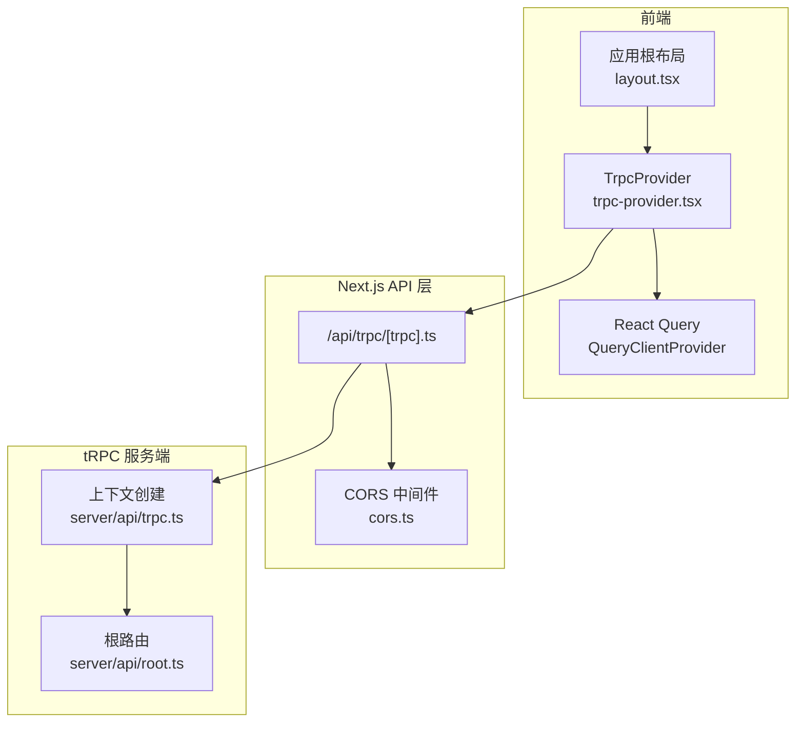
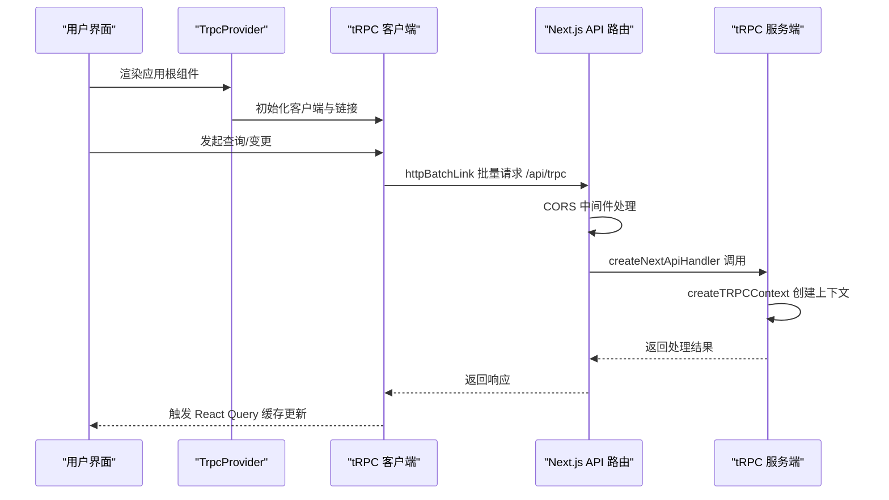
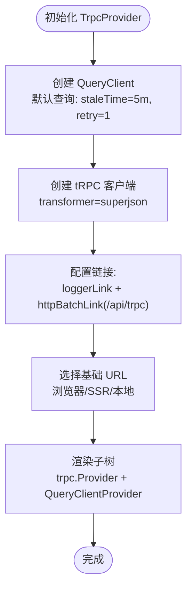
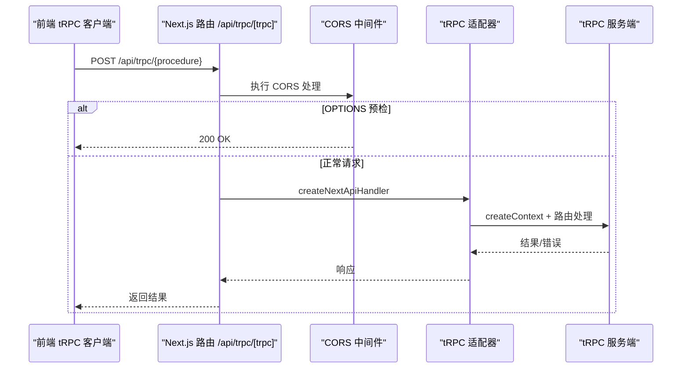
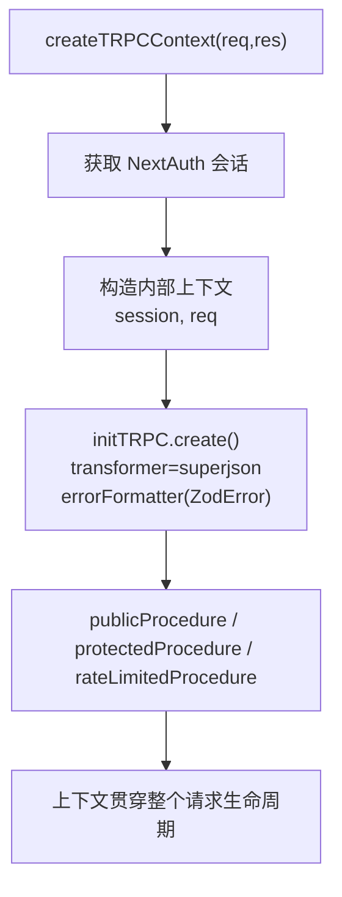
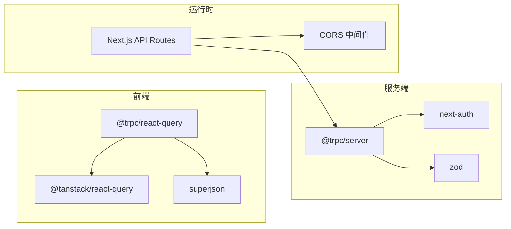

# tRPC Provider

<cite>
**本文引用的文件**
- [src/components/trpc-provider.tsx](file://src/components/trpc-provider.tsx)
- [src/app/layout.tsx](file://src/app/layout.tsx)
- [src/pages/api/trpc/[trpc].ts](file://src/pages/api/trpc/[trpc].ts)
- [src/server/api/trpc.ts](file://src/server/api/trpc.ts)
- [src/server/api/root.ts](file://src/server/api/root.ts)
- [src/lib/cors.ts](file://src/lib/cors.ts)
- [src/auth.ts](file://src/auth.ts)
- [package.json](file://package.json)
</cite>

## 目录
1. [简介](#简介)
2. [项目结构](#项目结构)
3. [核心组件](#核心组件)
4. [架构总览](#架构总览)
5. [组件详细分析](#组件详细分析)
6. [依赖关系分析](#依赖关系分析)
7. [性能考量](#性能考量)
8. [故障排查指南](#故障排查指南)
9. [结论](#结论)

## 简介
本文件系统性阐述 tRPC Provider 组件在前端的集成与配置，覆盖以下关键主题：
- TrpcProvider 的职责与初始化流程
- 客户端实例化、链接配置、中间件与类型安全
- 错误处理与缓存策略
- 上下文传递与 SSR 支持
- 性能优化建议与最佳实践

## 项目结构
tRPC 在本项目中采用“前端 Provider + Next.js API Handler + tRPC Server”的三层架构：
- 前端：TrpcProvider 注入 tRPC 客户端与 React Query，提供全局数据缓存与请求批处理能力
- 服务端：Next.js API Route 作为 tRPC 入口，负责上下文创建、CORS 处理与错误回调
- 服务端 tRPC：定义上下文、初始化、路由与过程（procedures），统一错误格式化

图表来源
- [src/app/layout.tsx](file://src/app/layout.tsx#L25-L53)
- [src/components/trpc-provider.tsx](file://src/components/trpc-provider.tsx#L22-L61)
- [src/pages/api/trpc/[trpc].ts](file://src/pages/api/trpc/[trpc].ts#L1-L27)
- [src/lib/cors.ts](file://src/lib/cors.ts#L42-L53)
- [src/server/api/trpc.ts](file://src/server/api/trpc.ts#L65-L75)
- [src/server/api/root.ts](file://src/server/api/root.ts#L14-L21)

章节来源
- [src/app/layout.tsx](file://src/app/layout.tsx#L25-L53)
- [src/components/trpc-provider.tsx](file://src/components/trpc-provider.tsx#L1-L64)
- [src/pages/api/trpc/[trpc].ts](file://src/pages/api/trpc/[trpc].ts#L1-L27)
- [src/server/api/trpc.ts](file://src/server/api/trpc.ts#L1-L153)
- [src/server/api/root.ts](file://src/server/api/root.ts#L1-L25)
- [src/lib/cors.ts](file://src/lib/cors.ts#L1-L54)

## 核心组件
- TrpcProvider：在应用根部注入 tRPC 客户端与 React Query，提供全局缓存、批处理与日志链路
- Next.js tRPC API Handler：封装 tRPC 适配器，创建上下文，处理 CORS，统一错误输出
- tRPC 服务端上下文与初始化：定义上下文（含 NextAuth 会话）、初始化 tRPC（transformer、errorFormatter）

章节来源
- [src/components/trpc-provider.tsx](file://src/components/trpc-provider.tsx#L14-L63)
- [src/pages/api/trpc/[trpc].ts](file://src/pages/api/trpc/[trpc].ts#L8-L17)
- [src/server/api/trpc.ts](file://src/server/api/trpc.ts#L65-L95)

## 架构总览
tRPC Provider 的工作流如下：
- 应用启动时，根布局渲染 TrpcProvider
- TrpcProvider 创建 QueryClient 与 tRPC 客户端
- 前端发起请求时，通过 httpBatchLink 批量发送至 /api/trpc
- Next.js API Handler 接收请求，先执行 CORS 中间件，再交由 tRPC 适配器处理
- tRPC 服务端创建上下文（包含 NextAuth 会话），执行路由与过程，返回结果

图表来源
- [src/app/layout.tsx](file://src/app/layout.tsx#L49-L49)
- [src/components/trpc-provider.tsx](file://src/components/trpc-provider.tsx#L38-L54)
- [src/pages/api/trpc/[trpc].ts](file://src/pages/api/trpc/[trpc].ts#L20-L27)
- [src/server/api/trpc.ts](file://src/server/api/trpc.ts#L65-L75)

## 组件详细分析

### TrpcProvider 组件
- 作用
  - 注入 tRPC 客户端与 React Query，提供全局缓存与批处理能力
  - 通过 loggerLink 输出开发环境日志与错误链路
  - 通过 httpBatchLink 批量请求后端 API，减少网络往返
- 初始化过程
  - 创建 QueryClient，默认查询缓存过期时间为 5 分钟，重试 1 次
  - 创建 tRPC 客户端，使用 superjson 作为序列化转换器
  - 配置链接：loggerLink（开发环境或错误时启用）+ httpBatchLink（指向 /api/trpc）
  - 根据运行环境选择基础 URL：浏览器相对路径、Vercel 环境 HTTPS、本地开发 HTTP
- 错误处理
  - 开发环境下，loggerLink 会记录 down 方向的错误
  - Next.js API Handler 在开发环境输出错误日志
- 缓存策略
  - QueryClient 默认查询缓存过期时间 5 分钟，重试 1 次
  - 可根据业务场景调整 staleTime 与 retry 策略
- 类型安全
  - 通过 createTRPCReact<AppRouter>() 生成强类型客户端
  - 服务端通过 superjson 与 errorFormatter 保障前后端类型一致性

图表来源
- [src/components/trpc-provider.tsx](file://src/components/trpc-provider.tsx#L22-L61)

章节来源
- [src/components/trpc-provider.tsx](file://src/components/trpc-provider.tsx#L14-L63)

### Next.js tRPC API Handler
- 职责
  - 作为 tRPC 服务端入口，接收前端批量请求
  - 创建上下文（包含 NextAuth 会话），解析错误并按环境输出
  - 统一处理 CORS，兼容跨域与预检请求
- 关键点
  - 使用 createNextApiHandler(router, createContext, onError)
  - 开发环境输出错误日志，生产环境保持静默
  - 先执行 corsMiddleware，若为 OPTIONS 请求直接返回

图表来源
- [src/pages/api/trpc/[trpc].ts](file://src/pages/api/trpc/[trpc].ts#L8-L27)
- [src/lib/cors.ts](file://src/lib/cors.ts#L42-L53)

章节来源
- [src/pages/api/trpc/[trpc].ts](file://src/pages/api/trpc/[trpc].ts#L1-L27)
- [src/lib/cors.ts](file://src/lib/cors.ts#L1-L54)

### tRPC 服务端上下文与初始化
- 上下文创建
  - 通过 createTRPCContext 获取 NextAuth 会话，注入到每个请求上下文中
  - 会话信息可用于鉴权与权限控制
- 初始化
  - 使用 initTRPC.context<Context>().create
  - transformer: superjson，确保复杂数据类型在前后端一致传输
  - errorFormatter：将 ZodError 扁平化，便于前端消费
- 过程与中间件
  - publicProcedure：公开过程，可访问会话数据
  - protectedProcedure：受保护过程，校验会话有效性
  - rateLimitedProcedure：预留限流过程（当前为空实现）

图表来源
- [src/server/api/trpc.ts](file://src/server/api/trpc.ts#L65-L95)
- [src/server/api/trpc.ts](file://src/server/api/trpc.ts#L128-L139)

章节来源
- [src/server/api/trpc.ts](file://src/server/api/trpc.ts#L1-L153)

### 根路由与类型安全
- 根路由 appRouter 汇聚各模块路由（如 ai、quota、apiKey、dashboard、whitelist、settings）
- 通过导出 AppRouter 类型，配合 createTRPCReact<AppRouter>() 实现端到端类型安全

章节来源
- [src/server/api/root.ts](file://src/server/api/root.ts#L14-L24)
- [src/components/trpc-provider.tsx](file://src/components/trpc-provider.tsx#L8-L8)

### 上下文传递与 SSR 支持
- 基础 URL 选择逻辑：浏览器使用相对路径，SSR 使用 Vercel URL 或本地 3000 端口
- NextAuth 会话在 SSR 中通过 req/res 传递，确保服务端渲染时上下文可用
- React Query 在 SSR 场景下可与 SSG/SSR 协同（需在具体页面中使用相应工具）

章节来源
- [src/components/trpc-provider.tsx](file://src/components/trpc-provider.tsx#L15-L20)
- [src/server/api/trpc.ts](file://src/server/api/trpc.ts#L65-L75)

## 依赖关系分析
- 前端依赖
  - @trpc/react-query：提供强类型客户端与 React Hooks
  - @tanstack/react-query：提供缓存、重试、失效等能力
  - superjson：增强序列化，支持日期、BigInt 等复杂类型
- 服务端依赖
  - @trpc/server：tRPC 核心
  - next-auth：会话与鉴权
  - zod：错误格式化与输入校验
- 运行时
  - Next.js API Routes：作为 tRPC 适配层
  - CORS 中间件：处理跨域与预检请求

图表来源
- [package.json](file://package.json#L34-L67)
- [src/pages/api/trpc/[trpc].ts](file://src/pages/api/trpc/[trpc].ts#L1-L5)
- [src/lib/cors.ts](file://src/lib/cors.ts#L1-L54)

章节来源
- [package.json](file://package.json#L1-L90)
- [src/pages/api/trpc/[trpc].ts](file://src/pages/api/trpc/[trpc].ts#L1-L5)
- [src/lib/cors.ts](file://src/lib/cors.ts#L1-L54)

## 性能考量
- 批处理与缓存
  - httpBatchLink 可显著降低请求开销，适合高频查询
  - QueryClient 默认 staleTime=5 分钟，retry=1，可根据业务调整
- 序列化与传输
  - superjson 提升复杂类型传输效率，减少自定义序列化成本
- SSR 与预取
  - 在 SSR 页面中结合 SSG/SSR 工具进行数据预取，减少首屏等待
- CORS 与预检
  - 合理设置 Access-Control-Max-Age，避免频繁预检请求
- 错误与日志
  - 开发环境启用 loggerLink，生产环境关闭以减少日志开销

章节来源
- [src/components/trpc-provider.tsx](file://src/components/trpc-provider.tsx#L25-L54)
- [src/lib/cors.ts](file://src/lib/cors.ts#L29-L30)

## 故障排查指南
- 跨域与预检错误
  - 症状：浏览器发送 OPTIONS 预检失败或 405
  - 处理：确认 Next.js API Handler 已集成 CORS 中间件，且正确处理 OPTIONS
- 开发环境日志
  - 症状：请求失败但无明确错误
  - 处理：开启 loggerLink，查看 down 方向错误；检查 Next.js API Handler 的 onError 回调
- 会话与鉴权
  - 症状：受保护过程抛出 UNAUTHORIZED
  - 处理：确认 NextAuth 会话在 SSR 中通过 req/res 创建；检查 protectedProcedure 的上下文
- 类型不一致
  - 症状：前后端类型不匹配导致序列化异常
  - 处理：确保使用 superjson；检查 errorFormatter 是否正确扁平化 ZodError

章节来源
- [src/pages/api/trpc/[trpc].ts](file://src/pages/api/trpc/[trpc].ts#L11-L16)
- [src/server/api/trpc.ts](file://src/server/api/trpc.ts#L84-L95)
- [src/lib/cors.ts](file://src/lib/cors.ts#L42-L53)
- [src/server/api/trpc.ts](file://src/server/api/trpc.ts#L128-L139)

## 结论
TrpcProvider 通过统一的客户端与缓存配置，为前端提供了高性能、类型安全的数据访问层。结合 Next.js API Handler 的上下文创建与 CORS 处理，以及服务端 tRPC 的初始化与过程定义，整体架构具备良好的可维护性与扩展性。建议在生产环境中根据业务场景进一步优化缓存策略、批处理粒度与错误监控体系。