# 仪表板布局

<cite>
**本文档引用的文件**
- [src/components/dashboard-layout.tsx](file://src/components/dashboard-layout.tsx)
- [src/app/(dashboard)/layout.tsx](file://src/app/(dashboard)/layout.tsx)
- [src/app/(dashboard)/page.tsx](file://src/app/(dashboard)/page.tsx)
- [src/app/(dashboard)/components/stat-card.tsx](file://src/app/(dashboard)/components/stat-card.tsx)
- [src/app/(dashboard)/components/usage-trend-chart.tsx](file://src/app/(dashboard)/components/usage-trend-chart.tsx)
- [src/app/(dashboard)/components/model-distribution-chart.tsx](file://src/app/(dashboard)/components/model-distribution-chart.tsx)
- [src/app/(dashboard)/components/region-heatmap-chart.tsx](file://src/app/(dashboard)/components/region-heatmap-chart.tsx)
- [src/app/(dashboard)/components/recent-activity.tsx](file://src/app/(dashboard)/components/recent-activity.tsx)
- [src/app/(dashboard)/components/activity-item.tsx](file://src/app/(dashboard)/components/activity-item.tsx)
- [src/app/(dashboard)/components/recent-ip-requests.tsx](file://src/app/(dashboard)/components/recent-ip-requests.tsx)
- [src/components/date-range-picker.tsx](file://src/components/date-range-picker.tsx)
- [src/components/date-picker-with-range.tsx](file://src/components/date-picker-with-range.tsx)
- [src/types/dashboard.ts](file://src/types/dashboard.ts)
- [src/lib/types.ts](file://src/lib/types.ts)
- [src/app/layout.tsx](file://src/app/layout.tsx)
</cite>

## 更新摘要
**变更内容**
- 重大架构改进：将原有的两列图表布局重构为响应式的三列网格系统
- 新增三个核心图表模块：'近期请求趋势'、'模型使用分布'和'请求地区分布'
- 引入 xl:grid-cols-3 响应式布局，针对大屏幕显示器优化
- 所有图表容器采用增强的液体玻璃样式和改进的悬停效果
- 优化了统计卡片布局，使用 lg:grid-cols-4 实现四列响应式设计

## 目录
1. [简介](#简介)
2. [项目结构](#项目结构)
3. [核心组件](#核心组件)
4. [架构概览](#架构概览)
5. [详细组件分析](#详细组件分析)
6. [依赖关系分析](#依赖关系分析)
7. [性能考虑](#性能考虑)
8. [故障排除指南](#故障排除指南)
9. [结论](#结论)
10. [附录](#附录)

## 简介

本项目采用基于 Next.js App Router 的仪表板布局系统，提供了一个现代化、响应式的管理后台界面。该系统以 DashboardLayout 组件为核心，结合多种可视化图表和交互组件，为用户提供完整的数据分析和管理功能。

**更新** 系统现已重构为响应式的三列网格布局，针对大屏幕显示器进行了优化，使用 Tailwind CSS 的 xl:grid-cols-3 工具类实现智能响应式行为。新增的三个核心图表模块提供了更全面的数据可视化能力。

系统的主要特点包括：
- 基于 Next.js App Router 的路由架构
- 支持深色/浅色主题切换
- 响应式设计，适配多种设备
- 实时数据可视化展示
- 完整的用户认证和权限管理
- 增强的液体玻璃样式和动画效果

## 项目结构

项目采用 App Router 的文件系统路由结构，仪表板相关的核心文件组织如下：

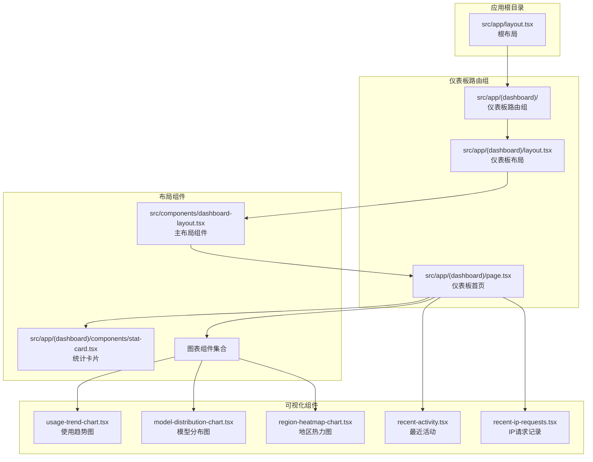

**图表来源**
- [src/app/layout.tsx:1-54](file://src/app/layout.tsx#L1-L54)
- [src/app/(dashboard)/layout.tsx](file://src/app/(dashboard)/layout.tsx#L1-L19)
- [src/components/dashboard-layout.tsx:1-197](file://src/components/dashboard-layout.tsx#L1-L197)

**章节来源**
- [src/app/layout.tsx:1-54](file://src/app/layout.tsx#L1-L54)
- [src/app/(dashboard)/layout.tsx](file://src/app/(dashboard)/layout.tsx#L1-L19)

## 核心组件

### DashboardLayout 主布局组件

DashboardLayout 是整个仪表板系统的核心组件，负责管理页面的整体布局结构。该组件实现了以下关键功能：

#### 布局结构
- **侧边栏导航**：固定宽度 256px 的导航菜单
- **主内容区域**：自适应宽度的主内容区
- **顶部工具栏**：包含主题切换和用户操作

#### 主题管理系统
组件内置了完整的主题切换机制：
- 支持深色/浅色模式自动检测
- 使用 localStorage 持久化用户偏好
- 动态更新 HTML 根元素的 `dark` 类名

#### 导航菜单
预定义了五个主要导航项：
1. 仪表板 - `/`
2. 接口调试 - `/debug`
3. 配额管理 - `/quotas`
4. API 密钥 - `/keys`
5. 用户策略管理 - `/users`

每个导航项都配有相应的图标和样式状态。

**章节来源**
- [src/components/dashboard-layout.tsx:21-51](file://src/components/dashboard-layout.tsx#L21-L51)
- [src/components/dashboard-layout.tsx:58-90](file://src/components/dashboard-layout.tsx#L58-L90)

## 架构概览

系统采用分层架构设计，从底层到顶层的组件关系如下：

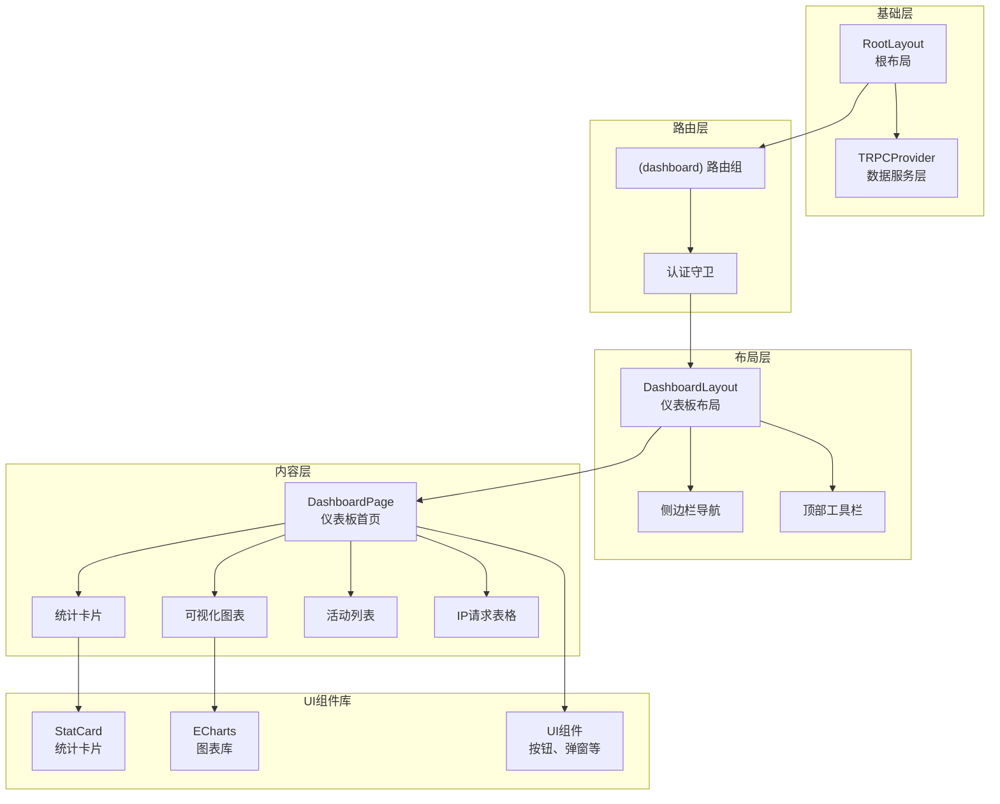

**图表来源**
- [src/app/layout.tsx:25-53](file://src/app/layout.tsx#L25-L53)
- [src/app/(dashboard)/layout.tsx](file://src/app/(dashboard)/layout.tsx#L10-L18)
- [src/components/dashboard-layout.tsx:92-193](file://src/components/dashboard-layout.tsx#L92-L193)

## 详细组件分析

### DashboardLayout 组件详解

#### 组件结构分析

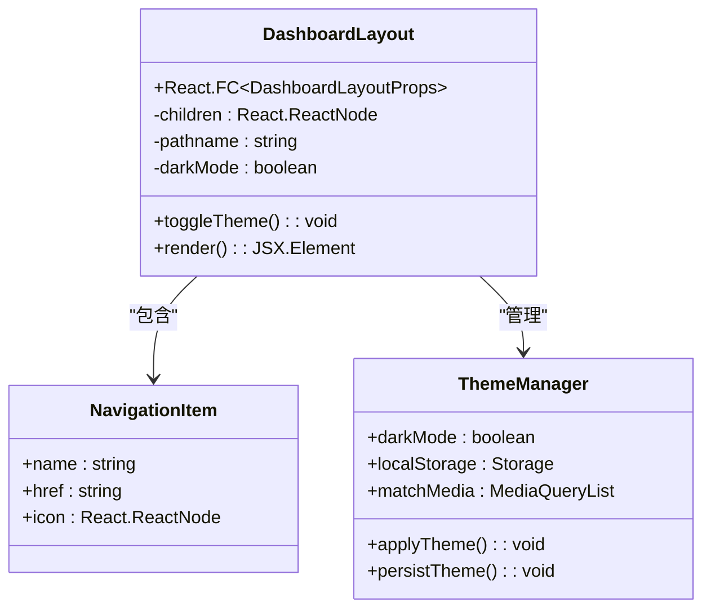

**图表来源**
- [src/components/dashboard-layout.tsx:21-23](file://src/components/dashboard-layout.tsx#L21-L23)
- [src/components/dashboard-layout.tsx:25-51](file://src/components/dashboard-layout.tsx#L25-L51)
- [src/components/dashboard-layout.tsx:56-90](file://src/components/dashboard-layout.tsx#L56-L90)

#### 导航菜单实现

导航菜单采用响应式设计，根据当前路径动态高亮选中项：

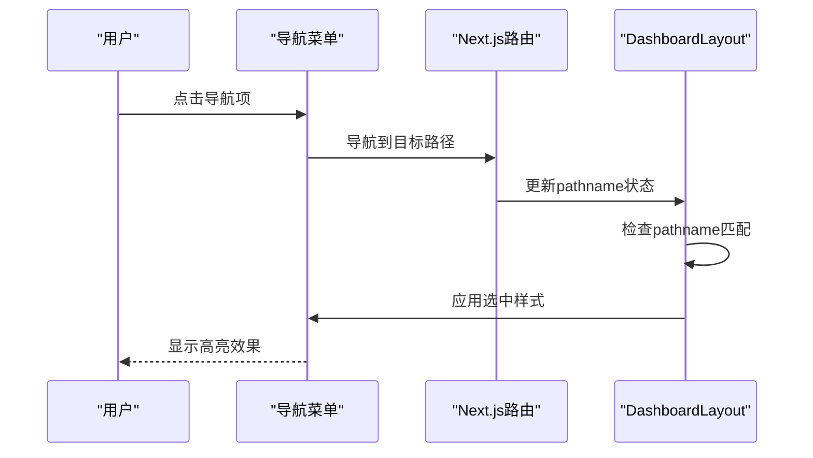

**图表来源**
- [src/components/dashboard-layout.tsx:106-121](file://src/components/dashboard-layout.tsx#L106-L121)
- [src/components/dashboard-layout.tsx:110-115](file://src/components/dashboard-layout.tsx#L110-L115)

#### 主题切换机制

主题切换功能通过以下流程实现：

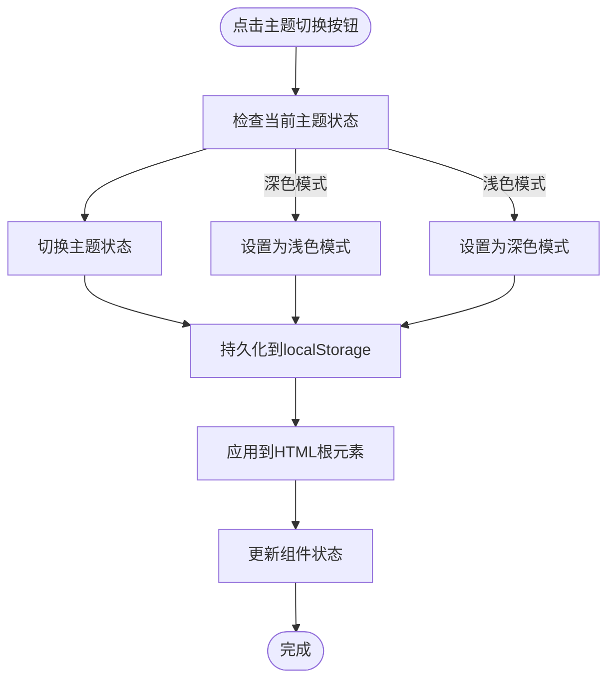

**图表来源**
- [src/components/dashboard-layout.tsx:58-62](file://src/components/dashboard-layout.tsx#L58-L62)
- [src/components/dashboard-layout.tsx:64-90](file://src/components/dashboard-layout.tsx#L64-L90)

**章节来源**
- [src/components/dashboard-layout.tsx:53-194](file://src/components/dashboard-layout.tsx#L53-L194)

### 仪表板首页组件

DashboardPage 是仪表板的核心页面组件，集成了多种数据可视化功能：

#### 布局架构重构

**更新** 仪表板布局已从传统的两列设计重构为响应式的三列网格系统：

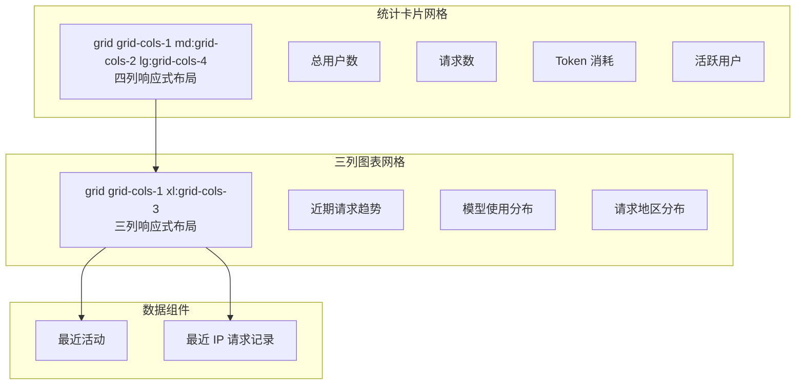

**图表来源**
- [src/app/(dashboard)/page.tsx](file://src/app/(dashboard)/page.tsx#L134-L191)
- [src/app/(dashboard)/page.tsx](file://src/app/(dashboard)/page.tsx#L194-L212)

#### 数据获取和状态管理

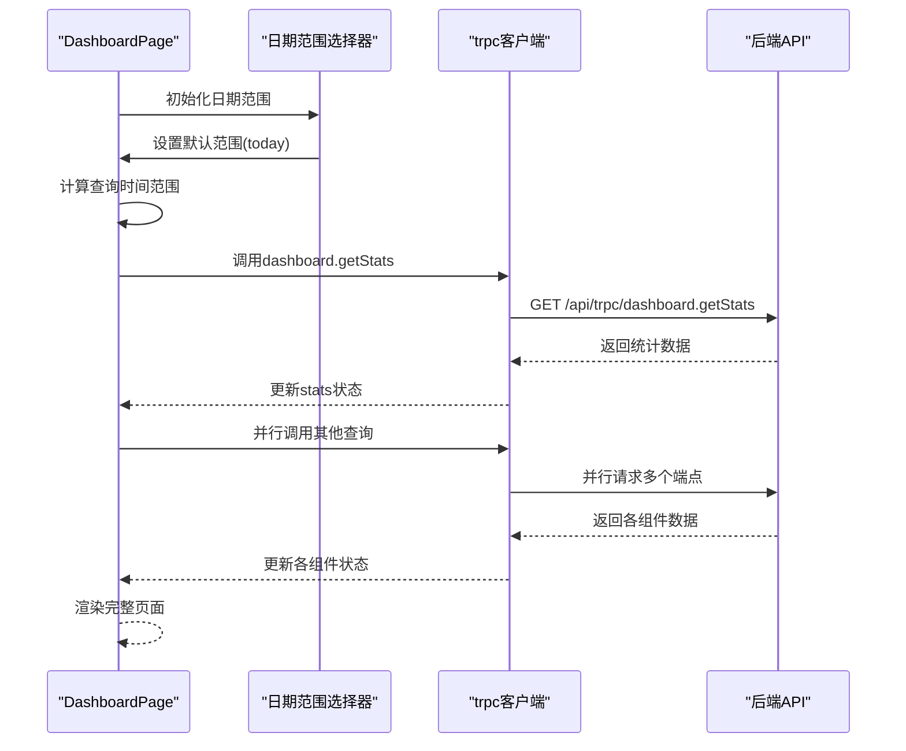

**图表来源**
- [src/app/(dashboard)/page.tsx](file://src/app/(dashboard)/page.tsx#L69-L103)
- [src/app/(dashboard)/page.tsx](file://src/app/(dashboard)/page.tsx#L17-L66)

#### 统计卡片组件

StatCard 组件提供了统一的数据展示格式：

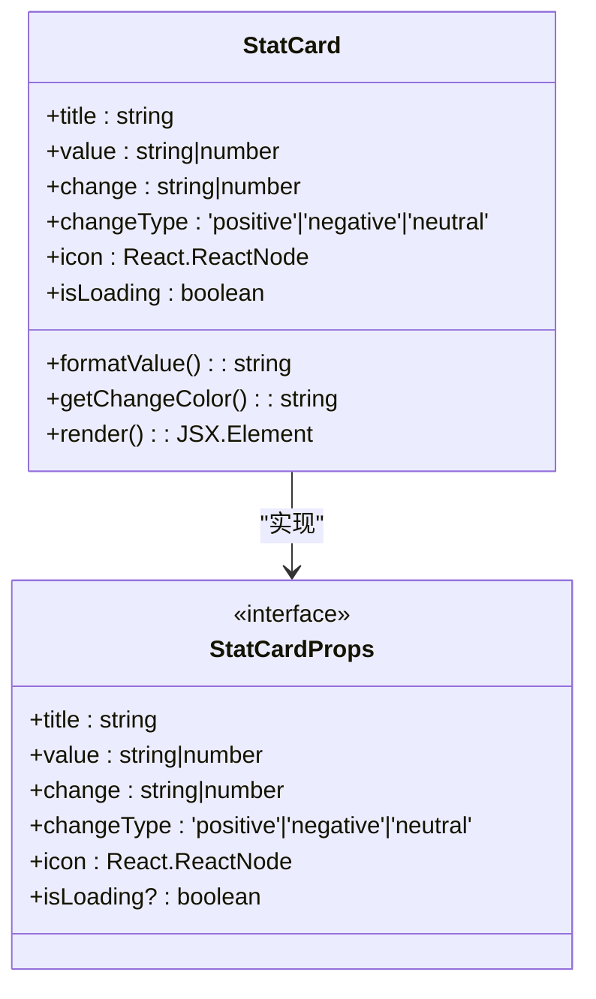

**图表来源**
- [src/app/(dashboard)/components/stat-card.tsx](file://src/app/(dashboard)/components/stat-card.tsx#L5-L12)
- [src/app/(dashboard)/components/stat-card.tsx](file://src/app/(dashboard)/components/stat-card.tsx#L14-L73)

**章节来源**
- [src/app/(dashboard)/page.tsx](file://src/app/(dashboard)/page.tsx#L15-L225)
- [src/app/(dashboard)/components/stat-card.tsx](file://src/app/(dashboard)/components/stat-card.tsx#L14-L73)

### 图表组件分析

#### 使用趋势图表

UsageTrendChart 组件实现了双轴线图，展示请求数和 Token 消耗趋势：

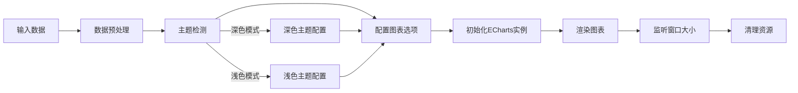

**图表来源**
- [src/app/(dashboard)/components/usage-trend-chart.tsx](file://src/app/(dashboard)/components/usage-trend-chart.tsx#L33-L302)
- [src/app/(dashboard)/components/usage-trend-chart.tsx](file://src/app/(dashboard)/components/usage-trend-chart.tsx#L44-L89)

#### 模型分布图表

ModelDistributionChart 提供了饼图展示不同模型的使用情况：

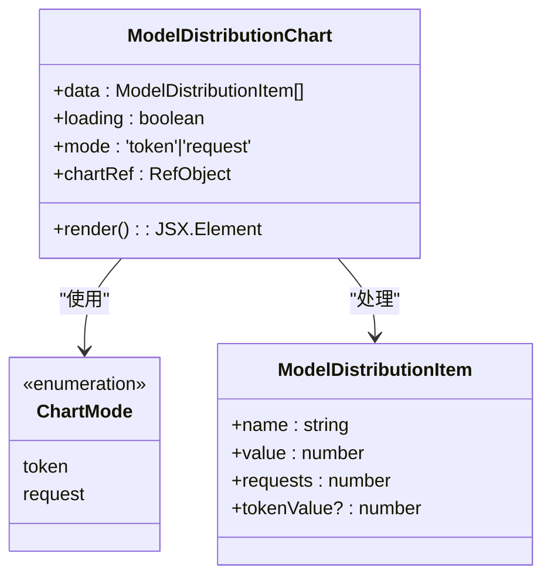

**图表来源**
- [src/app/(dashboard)/components/model-distribution-chart.tsx](file://src/app/(dashboard)/components/model-distribution-chart.tsx#L21-L26)
- [src/app/(dashboard)/components/model-distribution-chart.tsx](file://src/app/(dashboard)/components/model-distribution-chart.tsx#L28-L115)

#### 请求地区分布图表

**新增** RegionHeatmapChart 是最新的图表组件，专门用于展示中国地区的请求分布：

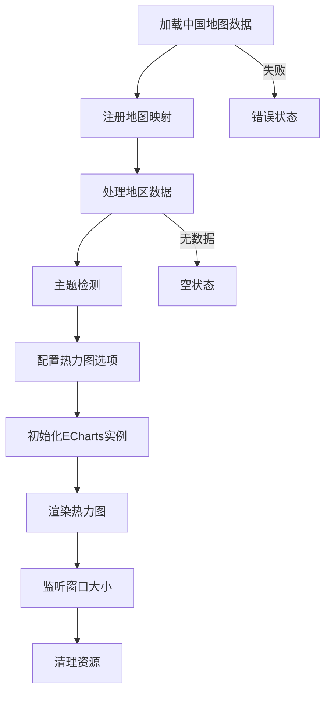

**图表来源**
- [src/app/(dashboard)/components/region-heatmap-chart.tsx](file://src/app/(dashboard)/components/region-heatmap-chart.tsx#L26-L150)
- [src/app/(dashboard)/components/region-heatmap-chart.tsx](file://src/app/(dashboard)/components/region-heatmap-chart.tsx#L74-L137)

**章节来源**
- [src/app/(dashboard)/components/usage-trend-chart.tsx](file://src/app/(dashboard)/components/usage-trend-chart.tsx#L16-L322)
- [src/app/(dashboard)/components/model-distribution-chart.tsx](file://src/app/(dashboard)/components/model-distribution-chart.tsx#L28-L146)
- [src/app/(dashboard)/components/region-heatmap-chart.tsx](file://src/app/(dashboard)/components/region-heatmap-chart.tsx#L20-L175)

### 数据组件分析

#### 最近活动组件

RecentActivity 组件展示了用户的最新操作记录：

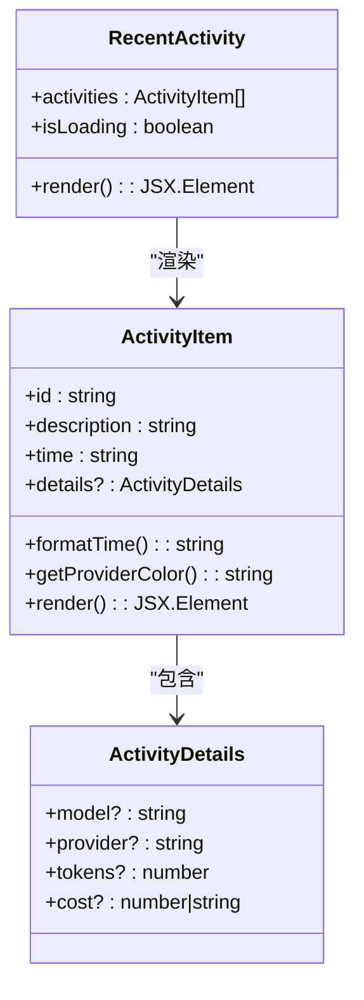

**图表来源**
- [src/app/(dashboard)/components/recent-activity.tsx](file://src/app/(dashboard)/components/recent-activity.tsx#L7-L10)
- [src/app/(dashboard)/components/activity-item.tsx](file://src/app/(dashboard)/components/activity-item.tsx#L5-L15)
- [src/app/(dashboard)/components/activity-item.tsx](file://src/app/(dashboard)/components/activity-item.tsx#L17-L83)

#### IP请求记录组件

RecentIpRequests 组件提供了表格形式的IP访问记录：


**图表来源**
- [src/app/(dashboard)/components/recent-ip-requests.tsx](file://src/app/(dashboard)/components/recent-ip-requests.tsx#L31-L221)
- [src/app/(dashboard)/components/recent-ip-requests.tsx](file://src/app/(dashboard)/components/recent-ip-requests.tsx#L71-L98)

**章节来源**
- [src/app/(dashboard)/components/recent-activity.tsx](file://src/app/(dashboard)/components/recent-activity.tsx#L12-L52)
- [src/app/(dashboard)/components/activity-item.tsx](file://src/app/(dashboard)/components/activity-item.tsx#L17-L83)
- [src/app/(dashboard)/components/recent-ip-requests.tsx](file://src/app/(dashboard)/components/recent-ip-requests.tsx#L31-L221)

## 依赖关系分析

系统组件之间的依赖关系如下：

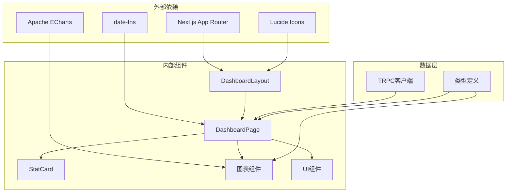

**图表来源**
- [src/components/dashboard-layout.tsx:3-18](file://src/components/dashboard-layout.tsx#L3-L18)
- [src/app/(dashboard)/page.tsx](file://src/app/(dashboard)/page.tsx#L3-L12)

**章节来源**
- [src/components/dashboard-layout.tsx:1-197](file://src/components/dashboard-layout.tsx#L1-L197)
- [src/app/(dashboard)/page.tsx](file://src/app/(dashboard)/page.tsx#L1-L228)

## 性能考虑

### 渲染优化

1. **懒加载策略**：图表组件使用条件渲染，在数据加载完成后再初始化 ECharts 实例
2. **内存管理**：组件卸载时自动清理 ECharts 实例和事件监听器
3. **防抖处理**：窗口大小调整事件使用防抖优化
4. **响应式布局**：使用 Tailwind CSS 的断点系统优化不同屏幕尺寸的渲染性能

### 数据加载优化

1. **并行请求**：仪表板页面同时发起多个 API 请求，减少总体等待时间
2. **缓存策略**：使用 React Query 的缓存机制避免重复请求
3. **骨架屏**：加载状态使用骨架屏提升用户体验

### 主题切换优化

1. **本地存储**：主题偏好持久化到 localStorage，避免每次重新计算
2. **媒体查询**：自动检测系统主题偏好，提供更好的初始体验

### 布局性能优化

**更新** 新的三列网格布局采用了更高效的响应式设计：
- 使用 `xl:grid-cols-3` 实现大屏幕优化
- `lg:grid-cols-4` 实现桌面端四列布局
- `md:grid-cols-2` 实现平板端两列布局
- `grid-cols-1` 实现移动端单列布局

## 故障排除指南

### 常见问题及解决方案

#### 图表不显示或显示异常

**问题症状**：
- 图表空白或只显示部分元素
- 控制台出现 ECharts 相关错误

**可能原因**：
1. ECharts 实例未正确初始化
2. 图表容器尺寸为 0
3. 数据格式不符合要求
4. **新增** 地图数据加载失败（仅限地区分布图表）

**解决步骤**：
1. 检查图表容器的 `ref` 是否正确传递
2. 确认容器具有有效的宽高
3. 验证传入的数据格式是否符合预期
4. 对于地区分布图表，检查 `/100000_full.json` 文件是否可访问

#### 主题切换失效

**问题症状**：
- 点击主题切换按钮无反应
- 页面主题状态不一致

**可能原因**：
1. localStorage 访问被阻止
2. DOM 操作失败
3. 组件状态更新异常

**解决步骤**：
1. 检查浏览器是否禁用了 localStorage
2. 确认 `document.documentElement` 可用
3. 查看控制台是否有相关错误信息

#### 导航菜单高亮异常

**问题症状**：
- 导航项无法正确高亮
- 路由切换后样式未更新

**可能原因**：
1. `usePathname` hook 返回值异常
2. 路径匹配逻辑错误
3. 样式类名冲突

**解决步骤**：
1. 检查路由配置是否正确
2. 验证导航项的 `href` 属性
3. 确认样式优先级设置

#### 布局显示异常

**新增** 三列布局在某些屏幕尺寸下可能出现显示问题：

**问题症状**：
- 图表容器重叠或换行异常
- 响应式断点不生效

**可能原因**：
1. Tailwind CSS 断点配置问题
2. 容器尺寸计算错误
3. CSS 样式冲突

**解决步骤**：
1. 检查容器的 `backdrop-blur-xl` 和 `shadow` 样式是否影响布局
2. 验证 `xl:grid-cols-3` 断点是否正确应用
3. 确认图表容器的最小宽度设置

**章节来源**
- [src/app/(dashboard)/components/usage-trend-chart.tsx](file://src/app/(dashboard)/components/usage-trend-chart.tsx#L33-L42)
- [src/components/dashboard-layout.tsx:64-90](file://src/components/dashboard-layout.tsx#L64-L90)
- [src/components/dashboard-layout.tsx:106-121](file://src/components/dashboard-layout.tsx#L106-L121)
- [src/app/(dashboard)/components/region-heatmap-chart.tsx](file://src/app/(dashboard)/components/region-heatmap-chart.tsx#L36-L52)

## 结论

本仪表板布局系统展现了现代 React 应用的最佳实践，通过合理的组件拆分、清晰的职责划分和完善的错误处理机制，构建了一个功能完整、性能优良的管理后台界面。

**更新** 系统经过重大架构改进，现已具备以下优势：

### 主要优势
- **模块化设计**：组件职责明确，易于维护和扩展
- **响应式布局**：全新的三列网格系统适配多种设备和屏幕尺寸
- **数据可视化**：丰富的图表组件提供直观的数据展示
- **用户体验**：流畅的主题切换和加载状态处理
- **性能优化**：合理的数据加载策略和内存管理
- **现代化设计**：增强的液体玻璃样式和动画效果

### 架构改进亮点
- **三列响应式设计**：针对大屏幕显示器优化，使用 `xl:grid-cols-3`
- **新增图表模块**：'近期请求趋势'、'模型使用分布'、'请求地区分布'
- **统一的液体玻璃样式**：所有图表容器采用一致的设计语言
- **改进的交互体验**：更好的悬停效果和过渡动画

### 未来发展方向
- 扩展更多图表类型支持
- 实现更精细的权限控制
- 增强数据缓存和离线支持
- 扩展国际化功能
- 优化移动端触摸交互

## 附录

### 组件使用示例

#### 基础布局使用

```typescript
// 在路由文件中使用 DashboardLayout
export default function DashboardLayout({
  children
}: {
  children: React.ReactNode;
}) {
  return <DashboardLayout>{children}</DashboardLayout>;
}
```

#### 自定义导航项

```typescript
const customNavigation = [
  ...navigation,
  {
    name: '自定义页面',
    href: '/custom',
    icon: <CustomIcon />
  }
];
```

#### 主题配置

```typescript
// 在组件中使用主题状态
const [darkMode, setDarkMode] = useState(false);

const toggleTheme = () => {
  const newDarkMode = !darkMode;
  setDarkMode(newDarkMode);
  localStorage.setItem('theme', newDarkMode ? 'dark' : 'light');
};
```

### 集成模式

#### 与 tRPC 集成

```typescript
// 在页面组件中使用 tRPC 查询
const { data: stats } = trpc.dashboard.getStats.useQuery({
  startDate: queryStart,
  endDate: queryEnd
});
```

#### 与认证系统集成

```typescript
// 在布局组件中添加认证检查
const session = await getServerSession();
if (!session) {
  redirect('/login');
}
```

#### 新增图表组件集成

**更新** 新的图表组件使用方式：

```typescript
// 使用使用趋势图表
<UsageTrendChart data={usageTrend || []} loading={trendLoading} />

// 使用模型分布图表
<ModelDistributionChart data={modelDistribution || []} loading={distributionLoading} />

// 使用地区分布图表
<RegionHeatmapChart data={regionDistribution || []} loading={regionLoading} />
```

**章节来源**
- [src/app/(dashboard)/layout.tsx](file://src/app/(dashboard)/layout.tsx#L10-L18)
- [src/app/(dashboard)/page.tsx](file://src/app/(dashboard)/page.tsx#L69-L103)
- [src/components/dashboard-layout.tsx:58-62](file://src/components/dashboard-layout.tsx#L58-L62)
- [src/app/(dashboard)/components/usage-trend-chart.tsx](file://src/app/(dashboard)/components/usage-trend-chart.tsx#L16-L322)
- [src/app/(dashboard)/components/model-distribution-chart.tsx](file://src/app/(dashboard)/components/model-distribution-chart.tsx#L28-L146)
- [src/app/(dashboard)/components/region-heatmap-chart.tsx](file://src/app/(dashboard)/components/region-heatmap-chart.tsx#L20-L175)