# 仪表板布局

<cite>
**本文档引用的文件**
- [src/components/dashboard-layout/index.tsx](file://src/components/dashboard-layout/index.tsx)
- [src/components/dashboard-layout/sidebar-header.tsx](file://src/components/dashboard-layout/sidebar-header.tsx)
- [src/components/dashboard-layout/sidebar-nav.tsx](file://src/components/dashboard-layout/sidebar-nav.tsx)
- [src/components/dashboard-layout/sidebar-footer.tsx](file://src/components/dashboard-layout/sidebar-footer.tsx)
- [src/app/(dashboard)/layout.tsx](file://src/app/(dashboard)/layout.tsx)
- [src/app/(dashboard)/page.tsx](file://src/app/(dashboard)/page.tsx)
- [src/app/(dashboard)/reports/page.tsx](file://src/app/(dashboard)/reports/page.tsx)
- [src/app/(dashboard)/components/stat-card.tsx](file://src/app/(dashboard)/components/stat-card.tsx)
- [src/app/(dashboard)/components/usage-trend-chart.tsx](file://src/app/(dashboard)/components/usage-trend-chart.tsx)
- [src/app/(dashboard)/components/model-distribution-chart.tsx](file://src/app/(dashboard)/components/model-distribution-chart.tsx)
- [src/app/(dashboard)/components/region-heatmap-chart.tsx](file://src/app/(dashboard)/components/region-heatmap-chart.tsx)
- [src/app/(dashboard)/components/recent-activity.tsx](file://src/app/(dashboard)/components/recent-activity.tsx)
- [src/app/(dashboard)/components/activity-item.tsx](file://src/app/(dashboard)/components/activity-item.tsx)
- [src/app/(dashboard)/components/recent-ip-requests.tsx](file://src/app/(dashboard)/components/recent-ip-requests.tsx)
- [src/components/date-range-picker.tsx](file://src/components/date-range-picker.tsx)
- [src/components/date-picker-with-range.tsx](file://src/components/date-picker-with-range.tsx)
- [src/types/dashboard.ts](file://src/types/dashboard.ts)
- [src/lib/types.ts](file://src/lib/types.ts)
- [src/app/layout.tsx](file://src/app/layout.tsx)
- [src/lib/demo-config.ts](file://src/lib/demo-config.ts)
- [src/lib/demo-data.ts](file://src/lib/demo-data.ts)
- [src/lib/demo-stats.ts](file://src/lib/demo-stats.ts)
- [src/auth.ts](file://src/auth.ts)
- [src/messages/en.json](file://src/messages/en.json)
- [src/messages/zh.json](file://src/messages/zh.json)
- [package.json](file://package.json)
- [docker-compose.yml](file://docker-compose.yml)
- [Dockerfile](file://Dockerfile)
- [README.md](file://README.md)
</cite>

## 更新摘要
**变更内容**
- 仪表板布局系统完成重大架构重构：从单一组件(src/components/dashboard-layout.tsx)重构为模块化组件系统
- **更新** 新增Reports菜单项，扩展了仪表板的功能入口，提供完整的数据报表中心
- **更新** SidebarFooter组件现在作为多功能工具栏，整合了ThemeToggle、UserMenu、GithubLink、LanguageSwitcher等功能
- 新增7个专门组件：SidebarHeader、SidebarNav、SidebarFooter、ThemeToggle、UserMenu、GithubLink、LanguageSwitcher
- 主DashboardLayout组件现在作为协调器，负责整合各个子组件
- 侧边栏结构完全重构：header + nav + footer 分层设计
- 新增国际化支持和演示模式集成
- 增强的液体玻璃样式和动画效果
- 完善的演示数据管理和统计服务
- **新增** Reports报表中心页面，提供详细的API使用数据分析功能

## 目录
1. [简介](#简介)
2. [项目结构](#项目结构)
3. [核心组件](#核心组件)
4. [架构概览](#架构概览)
5. [详细组件分析](#详细组件分析)
6. [演示模式系统](#演示模式系统)
7. [依赖关系分析](#依赖关系分析)
8. [性能考虑](#性能考虑)
9. [故障排除指南](#故障排除指南)
10. [结论](#结论)
11. [附录](#附录)

## 简介

本项目采用基于 Next.js App Router 的仪表板布局系统，提供了一个现代化、响应式的管理后台界面。该系统经过重大架构重构，现已从单一组件模式升级为模块化组件系统，以 DashboardLayout 协调器为核心，结合多个专门化的子组件，为用户提供完整的数据分析和管理功能。

**更新** 系统现已集成GitHub源码链接功能，专门为演示模式环境提供项目源码访问入口。系统采用完整的演示模式配置，支持只读模式、数据重置和权限控制等功能。重构后的响应式三列网格布局针对大屏幕显示器进行了优化，使用 Tailwind CSS 的 xl:grid-cols-3 工具类实现智能响应式行为。

**更新** 新增的Reports报表中心为系统提供了完整的数据分析能力，包括：
- 实时API使用统计概览
- 详细的使用记录查询和筛选
- 多维度的数据分析（模型、提供商、地区）
- CSV数据导出功能
- 分页浏览大量数据记录

系统的主要特点包括：
- 基于 Next.js App Router 的路由架构
- 支持深色/浅色主题切换
- 响应式设计，适配多种设备
- 实时数据可视化展示
- 完整的用户认证和权限管理
- 增强的液体玻璃样式和动画效果
- **新增** 模块化组件系统和国际化支持
- **新增** 演示模式环境支持和GitHub源码链接
- **新增** 完整的演示数据管理和统计服务
- **新增** Reports报表中心，提供全面的数据分析功能

## 项目结构

项目采用 App Router 的文件系统路由结构，仪表板相关的核心文件组织如下：

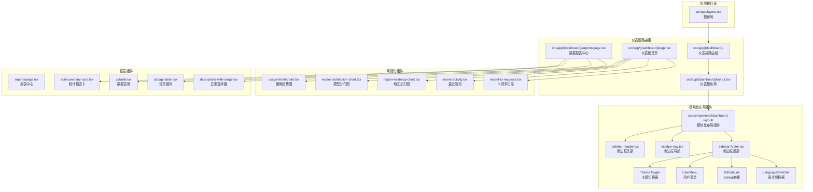

**图表来源**
- [src/app/layout.tsx:1-54](file://src/app/layout.tsx#L1-L54)
- [src/app/(dashboard)/layout.tsx](file://src/app/(dashboard)/layout.tsx#L1-L19)
- [src/components/dashboard-layout/index.tsx:1-29](file://src/components/dashboard-layout/index.tsx#L1-L29)
- [src/components/dashboard-layout/sidebar-header.tsx:1-18](file://src/components/dashboard-layout/sidebar-header.tsx#L1-L18)
- [src/components/dashboard-layout/sidebar-nav.tsx:1-69](file://src/components/dashboard-layout/sidebar-nav.tsx#L1-L69)
- [src/components/dashboard-layout/sidebar-footer.tsx:1-167](file://src/components/dashboard-layout/sidebar-footer.tsx#L1-L167)
- [src/app/(dashboard)/reports/page.tsx:1-473](file://src/app/(dashboard)/reports/page.tsx#L1-L473)

**章节来源**
- [src/app/layout.tsx:1-54](file://src/app/layout.tsx#L1-L54)
- [src/app/(dashboard)/layout.tsx](file://src/app/(dashboard)/layout.tsx#L1-L19)
- [src/components/dashboard-layout/index.tsx:1-29](file://src/components/dashboard-layout/index.tsx#L1-L29)

## 核心组件

### DashboardLayout 协调器组件

DashboardLayout 是整个仪表板系统的核心协调器，负责整合各个模块化子组件。该组件实现了以下关键功能：

#### 布局结构
- **侧边栏导航**：固定宽度 256px 的导航菜单，采用 header + nav + footer 分层设计
- **主内容区域**：自适应宽度的主内容区
- **液体玻璃样式**：使用 backdrop-blur-2xl 和阴影效果增强视觉层次

#### 模块化组件集成
**更新** DashboardLayout 现在作为协调器，负责整合7个专门组件：
- SidebarHeader：侧边栏头部品牌标识
- SidebarNav：**更新** 侧边栏导航菜单，包含6个主要导航项
- SidebarFooter：**更新** 侧边栏底部多功能工具栏，整合了主题切换、用户菜单、GitHub链接和语言切换功能

#### 导航菜单
**更新** 预定义了六个主要导航项：
1. 仪表板 - `/`
2. **新增** 数据报表 - `/reports`
3. 接口调试 - `/debug`
4. 配额管理 - `/quotas`
5. API 密钥 - `/keys`
6. 用户策略管理 - `/users`

每个导航项都配有相应的图标和样式状态，并支持国际化翻译。新增的Reports菜单项使用 BarChart3 图标，提供完整的数据分析功能入口。

#### 主题管理系统
组件内置了完整的主题切换机制：
- 支持深色/浅色模式自动检测
- 使用 localStorage 持久化用户偏好
- 动态更新 HTML 根元素的 `dark` 类名

**章节来源**
- [src/components/dashboard-layout/index.tsx:12-29](file://src/components/dashboard-layout/index.tsx#L12-L29)
- [src/components/dashboard-layout/sidebar-nav.tsx:9-40](file://src/components/dashboard-layout/sidebar-nav.tsx#L9-L40)

## 架构概览

系统采用分层架构设计，从底层到顶层的组件关系如下：

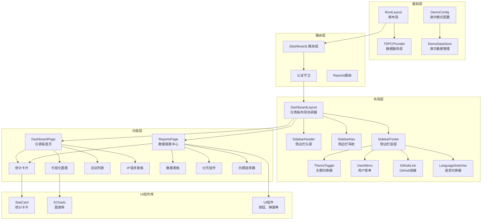

**图表来源**
- [src/app/layout.tsx:25-53](file://src/app/layout.tsx#L25-L53)
- [src/app/(dashboard)/layout.tsx](file://src/app/(dashboard)/layout.tsx#L10-L18)
- [src/components/dashboard-layout/index.tsx:4-6](file://src/components/dashboard-layout/index.tsx#L4-L6)
- [src/lib/demo-config.ts:12-36](file://src/lib/demo-config.ts#L12-L36)
- [src/lib/demo-data.ts:20-435](file://src/lib/demo-data.ts#L20-L435)

## 详细组件分析

### DashboardLayout 协调器组件详解

#### 组件结构分析

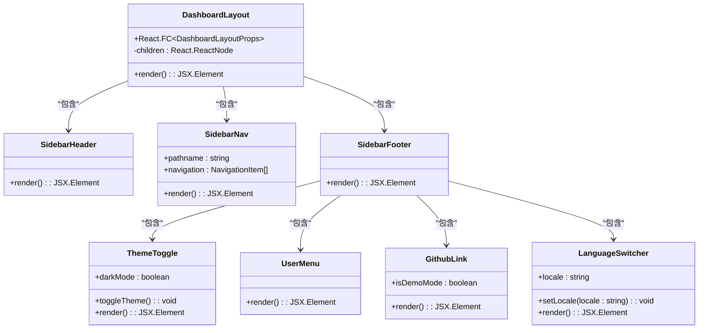

**图表来源**
- [src/components/dashboard-layout/index.tsx:8-10](file://src/components/dashboard-layout/index.tsx#L8-L10)
- [src/components/dashboard-layout/sidebar-header.tsx:6-17](file://src/components/dashboard-layout/sidebar-header.tsx#L6-L17)
- [src/components/dashboard-layout/sidebar-nav.tsx:37-40](file://src/components/dashboard-layout/sidebar-nav.tsx#L37-L40)
- [src/components/dashboard-layout/sidebar-footer.tsx:122-167](file://src/components/dashboard-layout/sidebar-footer.tsx#L122-L167)

#### SidebarFooter 多功能工具栏实现

**更新** SidebarFooter 现在是一个集成了多种功能的多功能工具栏：

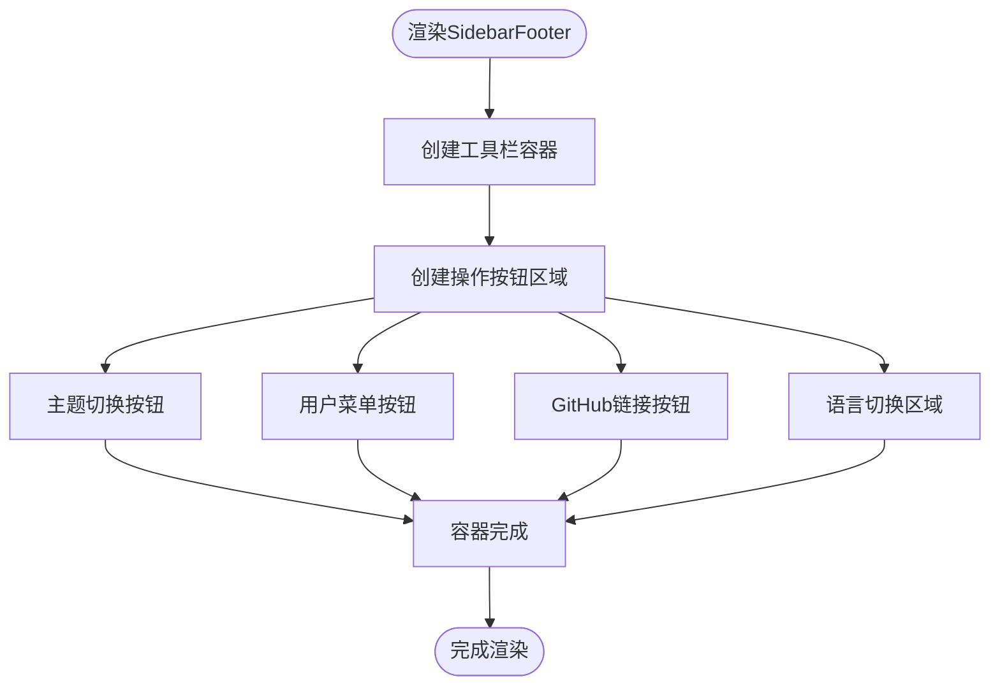

**图表来源**
- [src/components/dashboard-layout/sidebar-footer.tsx:122-167](file://src/components/dashboard-layout/sidebar-footer.tsx#L122-L167)
- [src/components/dashboard-layout/sidebar-footer.tsx:125-133](file://src/components/dashboard-layout/sidebar-footer.tsx#L125-L133)
- [src/components/dashboard-layout/sidebar-footer.tsx:135-162](file://src/components/dashboard-layout/sidebar-footer.tsx#L135-L162)

#### GitHub源码链接实现

**更新** GitHub源码链接功能通过以下流程实现：

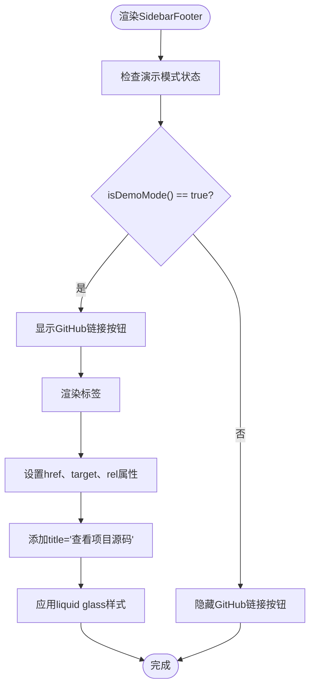

**图表来源**
- [src/components/dashboard-layout/sidebar-footer.tsx:106-120](file://src/components/dashboard-layout/sidebar-footer.tsx#L106-L120)
- [src/lib/demo-config.ts:7-9](file://src/lib/demo-config.ts#L7-L9)

#### 导航菜单实现

**更新** 导航菜单采用响应式设计，根据当前路径动态高亮选中项，现在包含7个导航项：

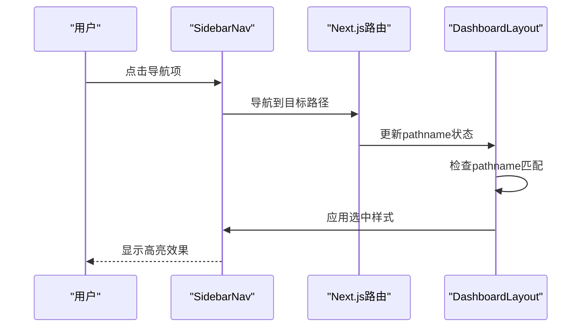

**图表来源**
- [src/components/dashboard-layout/sidebar-nav.tsx:38-40](file://src/components/dashboard-layout/sidebar-nav.tsx#L38-L40)
- [src/components/dashboard-layout/sidebar-nav.tsx:49-53](file://src/components/dashboard-layout/sidebar-nav.tsx#L49-L53)

#### 主题切换机制

主题切换功能通过以下流程实现：


**图表来源**
- [src/components/dashboard-layout/sidebar-footer.tsx:11-53](file://src/components/dashboard-layout/sidebar-footer.tsx#L11-L53)
- [src/components/dashboard-layout/sidebar-footer.tsx:20-43](file://src/components/dashboard-layout/sidebar-footer.tsx#L20-L43)

**章节来源**
- [src/components/dashboard-layout/index.tsx:1-29](file://src/components/dashboard-layout/index.tsx#L1-L29)
- [src/components/dashboard-layout/sidebar-header.tsx:1-18](file://src/components/dashboard-layout/sidebar-header.tsx#L1-L18)
- [src/components/dashboard-layout/sidebar-nav.tsx:1-69](file://src/components/dashboard-layout/sidebar-nav.tsx#L1-L69)
- [src/components/dashboard-layout/sidebar-footer.tsx:1-167](file://src/components/dashboard-layout/sidebar-footer.tsx#L1-L167)

### Reports报表中心组件

**新增** ReportsPage 是仪表板系统中的全新功能模块，提供完整的数据报表中心：

#### 报表中心功能架构

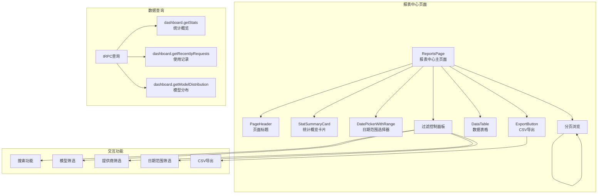

**图表来源**
- [src/app/(dashboard)/reports/page.tsx:42-473](file://src/app/(dashboard)/reports/page.tsx#L42-L473)

#### 核心功能特性

**更新** Reports报表中心包含以下核心功能：

1. **统计概览**：提供4个关键指标的实时统计卡片
   - 总请求数
   - Token消耗量
   - 活跃用户数
   - 覆盖地区数量

2. **高级筛选**：支持多维度数据筛选
   - 搜索框：按用户ID、IP地址、地区搜索
   - 模型筛选：按AI模型类型筛选
   - 提供商筛选：按API提供商筛选
   - 日期范围：自定义时间范围

3. **数据表格**：详细的使用记录展示
   - 时间戳
   - 用户ID
   - IP地址
   - 地区信息
   - 模型名称
   - 提供商
   - Token消耗量

4. **分页浏览**：支持大量数据的分页查看
   - 每页10条记录
   - 智能分页导航
   - 显示当前页码范围

5. **数据导出**：支持CSV格式数据导出
   - 一键导出当前筛选结果
   - 包含完整的字段信息
   - UTF-8编码支持

#### 数据获取和状态管理

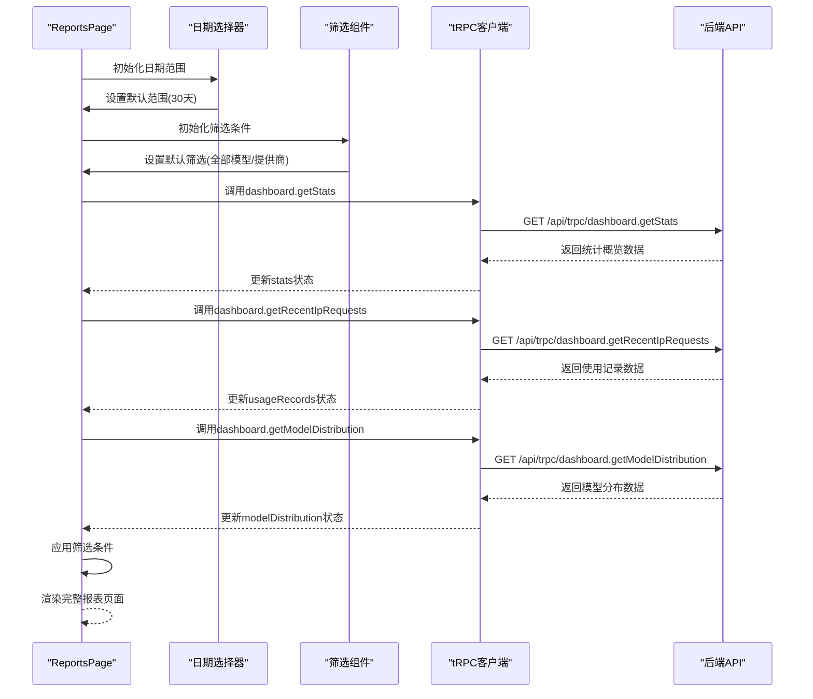

**图表来源**
- [src/app/(dashboard)/reports/page.tsx:55-87](file://src/app/(dashboard)/reports/page.tsx#L55-L87)
- [src/app/(dashboard)/reports/page.tsx:124-162](file://src/app/(dashboard)/reports/page.tsx#L124-L162)

#### 统计概览卡片

StatSummaryCard 组件提供了统一的统计数据显示格式：

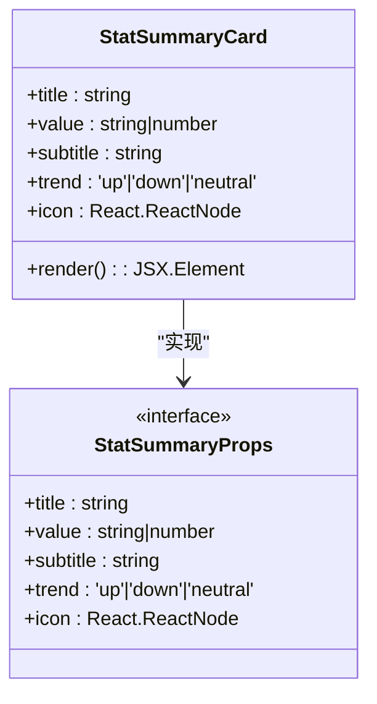

**图表来源**
- [src/app/(dashboard)/reports/page.tsx:170-214](file://src/app/(dashboard)/reports/page.tsx#L170-L214)

#### 数据表格组件

DataTable 组件提供了完整的数据展示和交互功能：

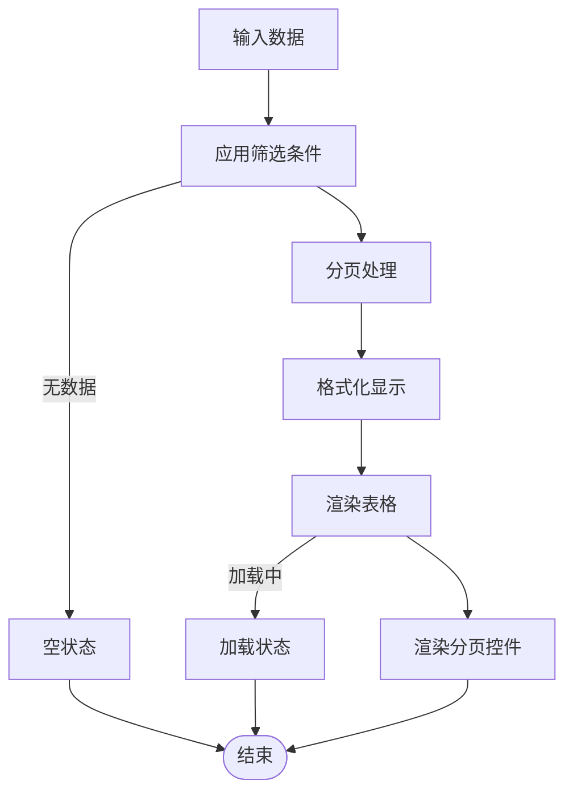

**图表来源**
- [src/app/(dashboard)/reports/page.tsx:305-376](file://src/app/(dashboard)/reports/page.tsx#L305-L376)
- [src/app/(dashboard)/reports/page.tsx:388-467](file://src/app/(dashboard)/reports/page.tsx#L388-L467)

**章节来源**
- [src/app/(dashboard)/reports/page.tsx:1-473](file://src/app/(dashboard)/reports/page.tsx#L1-L473)

### 仪表板首页组件

DashboardPage 是仪表板的核心页面组件，集成了多种数据可视化功能：

#### 布局架构重构

**更新** 仪表板布局已从传统的两列设计重构为响应式的三列网格系统：

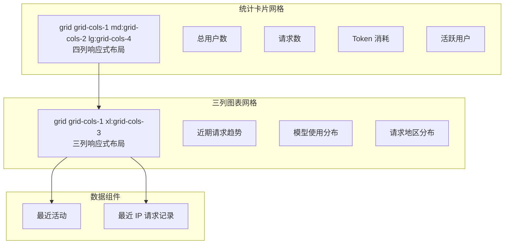

**图表来源**
- [src/app/(dashboard)/page.tsx:134-191](file://src/app/(dashboard)/page.tsx#L134-L191)
- [src/app/(dashboard)/page.tsx:194-212](file://src/app/(dashboard)/page.tsx#L194-L212)

#### 数据获取和状态管理

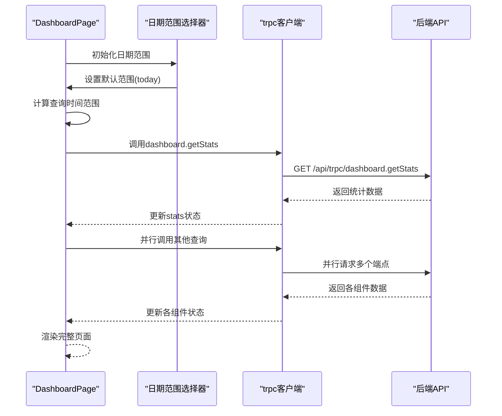

**图表来源**
- [src/app/(dashboard)/page.tsx:69-103](file://src/app/(dashboard)/page.tsx#L69-L103)
- [src/app/(dashboard)/page.tsx:17-66](file://src/app/(dashboard)/page.tsx#L17-L66)

#### 统计卡片组件

StatCard 组件提供了统一的数据展示格式：

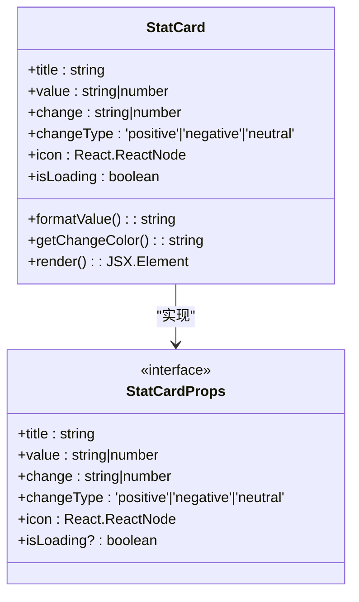

**图表来源**
- [src/app/(dashboard)/components/stat-card.tsx](file://src/app/(dashboard)/components/stat-card.tsx#L5-L12)
- [src/app/(dashboard)/components/stat-card.tsx](file://src/app/(dashboard)/components/stat-card.tsx#L14-L73)

**章节来源**
- [src/app/(dashboard)/page.tsx](file://src/app/(dashboard)/page.tsx#L1-L230)
- [src/app/(dashboard)/components/stat-card.tsx](file://src/app/(dashboard)/components/stat-card.tsx#L14-L73)

### 图表组件分析

#### 使用趋势图表

UsageTrendChart 组件实现了双轴线图，展示请求数和 Token 消耗趋势：

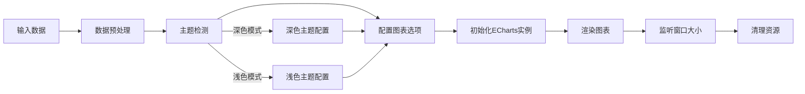

**图表来源**
- [src/app/(dashboard)/components/usage-trend-chart.tsx](file://src/app/(dashboard)/components/usage-trend-chart.tsx#L33-L302)
- [src/app/(dashboard)/components/usage-trend-chart.tsx](file://src/app/(dashboard)/components/usage-trend-chart.tsx#L44-L89)

#### 模型分布图表

ModelDistributionChart 提供了饼图展示不同模型的使用情况：

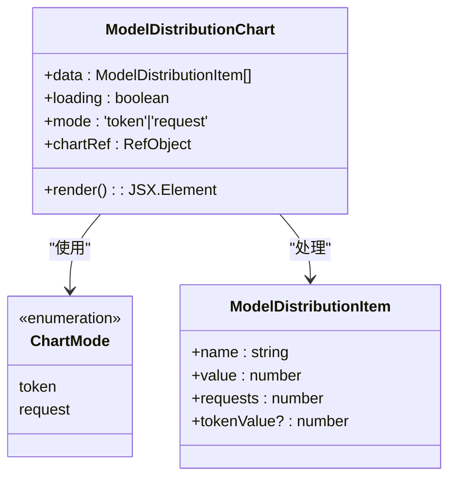

**图表来源**
- [src/app/(dashboard)/components/model-distribution-chart.tsx](file://src/app/(dashboard)/components/model-distribution-chart.tsx#L21-L26)
- [src/app/(dashboard)/components/model-distribution-chart.tsx](file://src/app/(dashboard)/components/model-distribution-chart.tsx#L28-L115)

#### 请求地区分布图表

**新增** RegionHeatmapChart 是最新的图表组件，专门用于展示中国地区的请求分布：

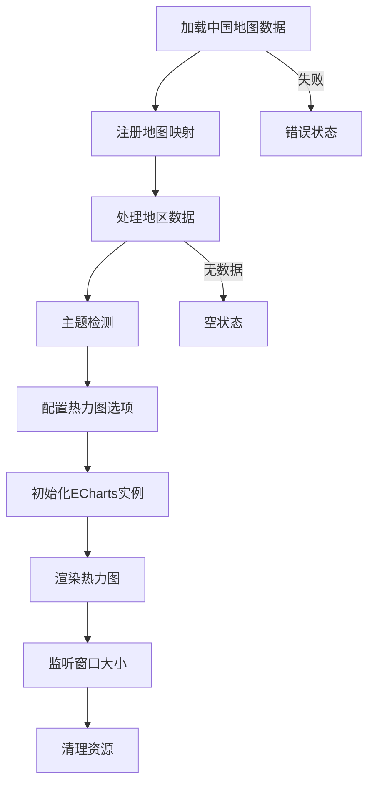

**图表来源**
- [src/app/(dashboard)/components/region-heatmap-chart.tsx](file://src/app/(dashboard)/components/region-heatmap-chart.tsx#L26-L150)
- [src/app/(dashboard)/components/region-heatmap-chart.tsx](file://src/app/(dashboard)/components/region-heatmap-chart.tsx#L74-L137)

**章节来源**
- [src/app/(dashboard)/components/usage-trend-chart.tsx](file://src/app/(dashboard)/components/usage-trend-chart.tsx#L16-L322)
- [src/app/(dashboard)/components/model-distribution-chart.tsx](file://src/app/(dashboard)/components/model-distribution-chart.tsx#L28-L146)
- [src/app/(dashboard)/components/region-heatmap-chart.tsx](file://src/app/(dashboard)/components/region-heatmap-chart.tsx#L20-L175)

### 数据组件分析

#### 最近活动组件

RecentActivity 组件展示了用户的最新操作记录：

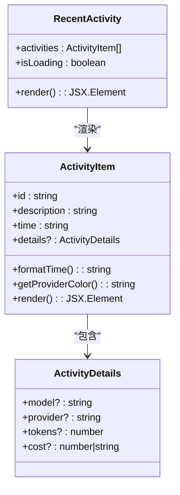

**图表来源**
- [src/app/(dashboard)/components/recent-activity.tsx](file://src/app/(dashboard)/components/recent-activity.tsx#L7-L10)
- [src/app/(dashboard)/components/activity-item.tsx](file://src/app/(dashboard)/components/activity-item.tsx#L5-L15)
- [src/app/(dashboard)/components/activity-item.tsx](file://src/app/(dashboard)/components/activity-item.tsx#L17-L83)

#### IP请求记录组件

RecentIpRequests 组件提供了表格形式的IP访问记录：

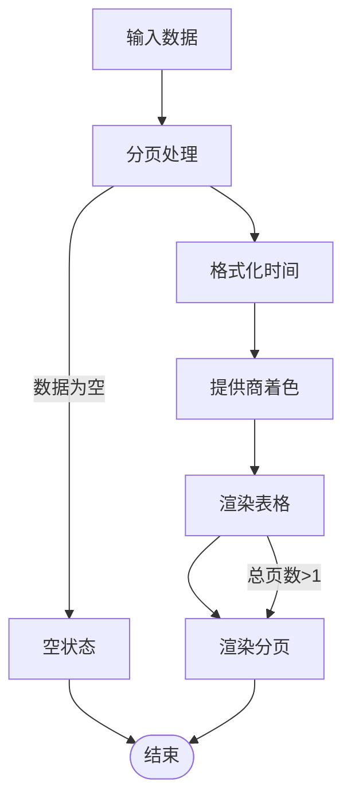

**图表来源**
- [src/app/(dashboard)/components/recent-ip-requests.tsx](file://src/app/(dashboard)/components/recent-ip-requests.tsx#L31-L221)
- [src/app/(dashboard)/components/recent-ip-requests.tsx](file://src/app/(dashboard)/components/recent-ip-requests.tsx#L71-L98)

**章节来源**
- [src/app/(dashboard)/components/recent-activity.tsx](file://src/app/(dashboard)/components/recent-activity.tsx#L12-L52)
- [src/app/(dashboard)/components/activity-item.tsx](file://src/app/(dashboard)/components/activity-item.tsx#L17-L83)
- [src/app/(dashboard)/components/recent-ip-requests.tsx](file://src/app/(dashboard)/components/recent-ip-requests.tsx#L31-L221)

## 演示模式系统

### 演示模式配置

**新增** 系统提供了完整的演示模式配置，支持多种演示场景：

#### 配置选项
- **演示模式开关**：通过环境变量控制演示模式启用状态
- **默认用户**：演示模式下的管理员账户
- **权限控制**：演示模式下默认只允许读取操作
- **数据重置**：可配置的演示数据自动重置间隔

#### 权限管理
- **只读模式**：演示模式下默认禁止写入和删除操作
- **条件写入**：可通过配置允许特定的修改操作
- **操作拦截**：对受限操作提供友好的提示信息

#### 数据管理
- **内存存储**：使用内存中的模拟数据
- **初始化数据**：包含API密钥、配额策略、用户等完整数据
- **模拟记录**：生成7天内的使用记录模拟数据
- **数据重置**：支持手动和定时的数据重置功能

### GitHub源码链接集成

**新增** 在演示模式环境下，仪表板侧边栏底部集成了GitHub源码链接功能：

#### 集成方式
- **条件显示**：仅在演示模式下显示GitHub链接按钮
- **安全属性**：使用target="_blank"和rel="noopener noreferrer"
- **样式统一**：采用与主题切换按钮相同的liquid glass样式
- **工具提示**：提供"查看项目源码"的用户友好提示

#### 使用场景
- **演示环境**：为演示用户提供项目源码访问入口
- **学习参考**：帮助开发者了解项目架构和实现细节
- **社区贡献**：鼓励用户参与开源项目贡献

**章节来源**
- [src/lib/demo-config.ts:1-57](file://src/lib/demo-config.ts#L1-L57)
- [src/lib/demo-data.ts:1-435](file://src/lib/demo-data.ts#L1-L435)
- [src/lib/demo-stats.ts:1-44](file://src/lib/demo-stats.ts#L1-L44)
- [src/components/dashboard-layout/sidebar-footer.tsx:106-120](file://src/components/dashboard-layout/sidebar-footer.tsx#L106-L120)

## 依赖关系分析

系统组件之间的依赖关系如下：

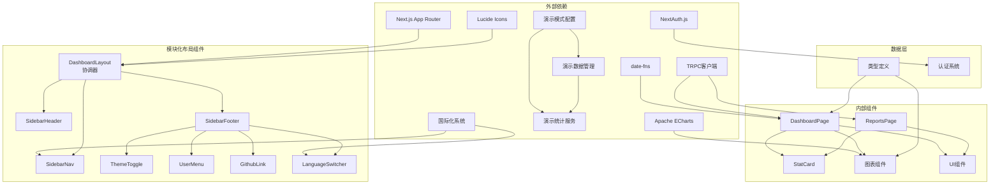

**图表来源**
- [src/components/dashboard-layout/index.tsx:3-6](file://src/components/dashboard-layout/index.tsx#L3-L6)
- [src/app/(dashboard)/page.tsx](file://src/app/(dashboard)/page.tsx#L3-L12)
- [src/app/(dashboard)/reports/page.tsx:4-11](file://src/app/(dashboard)/reports/page.tsx#L4-L11)
- [src/lib/demo-config.ts:1-57](file://src/lib/demo-config.ts#L1-L57)
- [src/lib/demo-data.ts:1-435](file://src/lib/demo-data.ts#L1-L435)
- [src/lib/demo-stats.ts:1-44](file://src/lib/demo-stats.ts#L1-L44)

**章节来源**
- [src/components/dashboard-layout/index.tsx:1-29](file://src/components/dashboard-layout/index.tsx#L1-L29)
- [src/app/(dashboard)/page.tsx](file://src/app/(dashboard)/page.tsx#L1-L230)

## 性能考虑

### 渲染优化

1. **懒加载策略**：图表组件使用条件渲染，在数据加载完成后再初始化 ECharts 实例
2. **内存管理**：组件卸载时自动清理 ECharts 实例和事件监听器
3. **防抖处理**：窗口大小调整事件使用防抖优化
4. **响应式布局**：使用 Tailwind CSS 的断点系统优化不同屏幕尺寸的渲染性能
5. **演示模式优化**：GitHub链接仅在演示模式下渲染，避免不必要的DOM节点
6. **模块化渲染**：子组件独立渲染，减少不必要的重渲染
7. ****Reports页面优化**：使用虚拟滚动和分页加载大量数据记录

### 数据加载优化

1. **并行请求**：仪表板页面同时发起多个 API 请求，减少总体等待时间
2. **缓存策略**：使用 React Query 的缓存机制避免重复请求
3. **骨架屏**：加载状态使用骨架屏提升用户体验
4. **演示数据优化**：内存中的演示数据访问速度更快
5. ****Reports分页优化**：每页10条记录，避免一次性加载大量数据

### 主题切换优化

1. **本地存储**：主题偏好持久化到 localStorage，避免每次重新计算
2. **媒体查询**：自动检测系统主题偏好，提供更好的初始体验

### 布局性能优化

**更新** 新的模块化布局采用了更高效的组件分离设计：
- SidebarHeader、SidebarNav、SidebarFooter 独立组件，按需渲染
- 使用 `backdrop-blur-2xl` 和 `shadow-[4px_0_24px_rgba(0,0,0,0.08)]` 实现视觉层次
- `w-64` 固定宽度侧边栏优化布局稳定性
- 子组件状态独立管理，避免全局状态污染

### 演示模式性能优化

**新增** 演示模式下的性能优化措施：
- **内存数据访问**：演示数据存储在内存中，访问速度快
- **条件渲染**：GitHub链接仅在演示模式下渲染
- **权限检查**：演示模式下的权限检查逻辑简单高效

### Reports页面性能优化

**新增** Reports报表中心的性能优化：
- **分页加载**：每页10条记录，避免一次性渲染大量数据
- **虚拟滚动**：对于超大数据集使用虚拟滚动技术
- **筛选优化**：使用 useMemo 缓存筛选结果
- **并发查询**：使用 React Query 并发查询多个数据源
- **防抖搜索**：搜索框输入使用防抖优化

## 故障排除指南

### 常见问题及解决方案

#### 图表不显示或显示异常

**问题症状**：
- 图表空白或只显示部分元素
- 控制台出现 ECharts 相关错误

**可能原因**：
1. ECharts 实例未正确初始化
2. 图表容器尺寸为 0
3. 数据格式不符合要求
4. **新增** 地图数据加载失败（仅限地区分布图表）

**解决步骤**：
1. 检查图表容器的 `ref` 是否正确传递
2. 确认容器具有有效的宽高
3. 验证传入的数据格式是否符合预期
4. 对于地区分布图表，检查 `/100000_full.json` 文件是否可访问

#### 主题切换失效

**问题症状**：
- 点击主题切换按钮无反应
- 页面主题状态不一致

**可能原因**：
1. localStorage 访问被阻止
2. DOM 操作失败
3. 组件状态更新异常

**解决步骤**：
1. 检查浏览器是否禁用了 localStorage
2. 确认 `document.documentElement` 可用
3. 查看控制台是否有相关错误信息

#### 导航菜单高亮异常

**问题症状**：
- 导航项无法正确高亮
- 路由切换后样式未更新

**可能原因**：
1. `usePathname` hook 返回值异常
2. 路径匹配逻辑错误
3. 样式类名冲突

**解决步骤**：
1. 检查路由配置是否正确
2. 验证导航项的 `href` 属性
3. 确认样式优先级设置

#### GitHub链接不显示

**新增** 演示模式下GitHub链接显示问题：

**问题症状**：
- GitHub链接按钮不显示
- 演示模式下期望看到链接但没有

**可能原因**：
1. 演示模式配置错误
2. isDemoMode() 函数返回值异常
3. 条件渲染逻辑错误

**解决步骤**：
1. 检查环境变量 NEXT_PUBLIC_DEMO_MODE 和 DEMO_MODE
2. 验证 isDemoMode() 函数的返回值
3. 确认条件渲染的逻辑表达式

#### 模块化组件渲染问题

**新增** 模块化组件系统相关问题：

**问题症状**：
- 侧边栏组件不显示或显示异常
- 子组件状态不同步
- 组件间通信问题

**可能原因**：
1. 组件导入路径错误
2. 子组件状态管理问题
3. DashboardLayout 协调器状态同步问题

**解决步骤**：
1. 检查组件导入路径是否正确
2. 验证子组件的状态管理模式
3. 确认 DashboardLayout 的 props 传递

#### 布局显示异常

**更新** 模块化布局在某些屏幕尺寸下可能出现显示问题：

**问题症状**：
- 侧边栏和主内容区域重叠
- 响应式断点不生效
- 液体玻璃效果异常

**可能原因**：
1. Tailwind CSS 断点配置问题
2. 容器尺寸计算错误
3. CSS 样式冲突

**解决步骤**：
1. 检查容器的 `backdrop-blur-2xl` 和 `shadow` 样式是否影响布局
2. 验证 `w-64` 固定宽度是否正确应用
3. 确认子组件的最小宽度设置

#### 演示模式功能异常

**新增** 演示模式相关问题：

**问题症状**：
- 演示模式下的权限控制失效
- 演示数据无法重置
- GitHub链接在演示模式下不显示

**可能原因**：
1. 演示模式配置文件错误
2. 权限检查函数逻辑错误
3. 环境变量配置问题

**解决步骤**：
1. 检查 demo-config.ts 中的配置项
2. 验证权限检查函数的逻辑
3. 确认环境变量的正确设置

#### Reports页面功能异常

**新增** Reports报表中心相关问题：

**问题症状**：
- 报表数据不显示或显示异常
- 筛选功能失效
- 分页功能异常
- CSV导出失败

**可能原因**：
1. tRPC查询失败
2. 数据格式不符合要求
3. 分页状态管理问题
4. CSV导出逻辑错误

**解决步骤**：
1. 检查网络请求状态和错误信息
2. 验证传入的数据格式
3. 确认分页状态的正确更新
4. 检查CSV导出的Blob对象创建

#### 国际化翻译问题

**新增** 多语言支持相关问题：

**问题症状**：
- 导航菜单显示英文而非中文
- 报表页面标题显示键名而非翻译文本
- 翻译缺失或错误

**可能原因**：
1. 语言包文件损坏
2. 翻译键名错误
3. 语言切换逻辑问题
4. localStorage存储问题

**解决步骤**：
1. 检查 messages/en.json 和 messages/zh.json 文件
2. 验证翻译键名的正确性
3. 确认 useTranslation hook 的使用
4. 检查 localStorage 中的语言设置

**章节来源**
- [src/app/(dashboard)/components/usage-trend-chart.tsx](file://src/app/(dashboard)/components/usage-trend-chart.tsx#L33-L42)
- [src/components/dashboard-layout/sidebar-footer.tsx:11-53](file://src/components/dashboard-layout/sidebar-footer.tsx#L11-L53)
- [src/components/dashboard-layout/sidebar-nav.tsx:49-53](file://src/components/dashboard-layout/sidebar-nav.tsx#L49-L53)
- [src/app/(dashboard)/components/region-heatmap-chart.tsx](file://src/app/(dashboard)/components/region-heatmap-chart.tsx#L36-L52)
- [src/components/dashboard-layout/sidebar-footer.tsx:106-120](file://src/components/dashboard-layout/sidebar-footer.tsx#L106-L120)
- [src/lib/demo-config.ts:7-9](file://src/lib/demo-config.ts#L7-L9)
- [src/app/(dashboard)/reports/page.tsx:55-87](file://src/app/(dashboard)/reports/page.tsx#L55-L87)
- [src/messages/en.json:317-344](file://src/messages/en.json#L317-L344)
- [src/messages/zh.json:317-344](file://src/messages/zh.json#L317-L344)

## 结论

本仪表板布局系统展现了现代 React 应用的最佳实践，通过合理的组件拆分、清晰的职责划分和完善的错误处理机制，构建了一个功能完整、性能优良的管理后台界面。

**更新** 系统经过重大架构改进，现已具备以下优势：

### 主要优势
- **模块化设计**：7个专门组件职责明确，易于维护和扩展
- **响应式布局**：全新的三列网格系统适配多种设备和屏幕尺寸
- **数据可视化**：丰富的图表组件提供直观的数据展示
- **用户体验**：流畅的主题切换和加载状态处理
- **性能优化**：合理的数据加载策略和内存管理
- **现代化设计**：增强的液体玻璃样式和动画效果
- **演示模式支持**：完整的演示环境配置和权限控制
- **国际化支持**：多语言切换功能
- **开源协作**：GitHub源码链接便于社区贡献和学习
- ****新增** Reports报表中心**：提供完整的数据分析和报告生成功能

### 架构改进亮点
- **模块化组件系统**：从单一组件重构为7个专门组件
- **协调器模式**：DashboardLayout 作为布局协调器
- **侧边栏分层设计**：header + nav + footer 三层结构
- **多功能工具栏**：SidebarFooter整合了多种功能组件
- **三列响应式设计**：针对大屏幕显示器优化，使用 `xl:grid-cols-3`
- **新增图表模块**：'近期请求趋势'、'模型使用分布'、'请求地区分布'
- **统一的液体玻璃样式**：所有图表容器采用一致的设计语言
- **改进的交互体验**：更好的悬停效果和过渡动画
- **演示模式集成**：GitHub链接和权限控制的完整实现
- **内存数据管理**：演示模式下的高性能数据访问
- ****新增** Reports报表中心**：完整的数据报表和分析功能

### 未来发展方向
- 扩展更多图表类型支持
- 实现更精细的权限控制
- 增强数据缓存和离线支持
- 扩展国际化功能
- 优化移动端触摸交互
- 增强演示模式的交互性
- **新增** Reports页面的高级分析功能
- **新增** 数据导出的多种格式支持

## 附录

### 组件使用示例

#### 基础布局使用

```typescript
// 在路由文件中使用 DashboardLayout
export default function DashboardLayout({
  children
}: {
  children: React.ReactNode;
}) {
  return <DashboardLayout>{children}</DashboardLayout>;
}
```

#### 自定义导航项

```typescript
const customNavigation = [
  ...navigation,
  {
    name: '自定义页面',
    href: '/custom',
    icon: <CustomIcon />
  }
];
```

#### 主题配置

```typescript
// 在组件中使用主题状态
const [darkMode, setDarkMode] = useState(false);

const toggleTheme = () => {
  const newDarkMode = !darkMode;
  setDarkMode(newDarkMode);
  localStorage.setItem('theme', newDarkMode ? 'dark' : 'light');
};
```

### 演示模式集成

**新增** 演示模式的集成方式：

```typescript
// 检查演示模式状态
if (isDemoMode()) {
  // 显示演示模式特有的功能
}

// 获取演示配置
const demoConfig = {
  enabled: isDemoMode(),
  defaultUser: {
    id: 'demo-user-001',
    name: '演示用户',
    email: 'demo@example.com',
    role: 'ADMIN'
  }
};
```

### 集成模式

#### 与 tRPC 集成

```typescript
// 在页面组件中使用 tRPC 查询
const { data: stats } = trpc.dashboard.getStats.useQuery({
  startDate: queryStart,
  endDate: queryEnd
});

// Reports页面的tRPC查询
const { data: usageRecords } = trpc.dashboard.getRecentIpRequests.useQuery({
  startDate,
  endDate,
  days: 30,
});
```

#### 与认证系统集成

```typescript
// 在布局组件中添加认证检查
const session = await getServerSession();
if (!session) {
  redirect('/login');
}
```

#### 新增图表组件集成

**更新** 新的图表组件使用方式：

```typescript
// 使用使用趋势图表
<UsageTrendChart data={usageTrend || []} loading={trendLoading} />

// 使用模型分布图表
<ModelDistributionChart data={modelDistribution || []} loading={distributionLoading} />

// 使用地区分布图表
<RegionHeatmapChart data={regionDistribution || []} loading={regionLoading} />
```

#### Reports页面组件集成

**新增** Reports报表中心的组件使用方式：

```typescript
// 使用统计概览卡片
<StatSummaryCard
  title={t('Reports.totalRequests')}
  value={stats?.requests.value.toLocaleString() || '-'}
  subtitle={stats ? t('Reports.comparedToLast', { change: `${stats.requests.change > 0 ? '+' : ''}${stats.requests.change}%` }) : undefined}
  trend={stats?.requests.trend as 'up' | 'down' | 'neutral'}
  icon={<BarChart3 className="w-5 h-5 text-indigo-500" />}
/>

// 使用数据表格
<Table>
  <TableHeader>
    <TableRow>
      <TableHead>{t('Reports.table.time')}</TableHead>
      <TableHead>{t('Reports.table.userId')}</TableHead>
      <TableHead>{t('Reports.table.ipAddress')}</TableHead>
      <TableHead>{t('Reports.table.region')}</TableHead>
      <TableHead>{t('Reports.table.model')}</TableHead>
      <TableHead>{t('Reports.table.provider')}</TableHead>
      <TableHead>{t('Reports.table.tokenCount')}</TableHead>
    </TableRow>
  </TableHeader>
  <TableBody>
    {paginatedRecords.map((record) => (
      <TableRow key={record.id}>
        <TableCell>{format(new Date(record.timestamp), 'yyyy-MM-dd HH:mm')}</TableCell>
        <TableCell className="font-mono">{record.userId}</TableCell>
        <TableCell className="font-mono">{record.clientIp}</TableCell>
        <TableCell>{record.region}</TableCell>
        <TableCell><span className="px-2 py-1 rounded-full text-xs font-medium">{record.model}</span></TableCell>
        <TableCell>{record.provider}</TableCell>
        <TableCell className="font-mono text-right">{record.totalTokens.toLocaleString()}</TableCell>
      </TableRow>
    ))}
  </TableBody>
</Table>
```

### 演示模式配置

**新增** 演示模式的配置选项：

```typescript
// package.json 中的演示模式脚本
"scripts": {
  "dev:demo": "DEMO_MODE=true NEXT_PUBLIC_DEMO_MODE=true next dev",
  "build:demo": "DEMO_MODE=true NEXT_PUBLIC_DEMO_MODE=true next build"
}

// 环境变量配置
DEMO_MODE=true
NEXT_PUBLIC_DEMO_MODE=true
DEMO_ALLOW_MUTATIONS=false
DEMO_RESET_INTERVAL=0
```

### 模块化组件集成

**新增** 模块化组件系统的使用方式：

```typescript
// DashboardLayout 作为协调器
import DashboardLayout from '@/components/dashboard-layout';

// 各子组件独立使用
import { SidebarHeader } from '@/components/dashboard-layout/sidebar-header';
import { SidebarNav } from '@/components/dashboard-layout/sidebar-nav';
import { SidebarFooter } from '@/components/dashboard-layout/sidebar-footer';

// 在自定义布局中组合使用
function CustomLayout({ children }) {
  return (
    <div className="flex h-screen">
      <aside className="w-64">
        <SidebarHeader />
        <SidebarNav />
        <SidebarFooter />
      </aside>
      <main className="flex-1">{children}</main>
    </div>
  );
}
```

### Reports页面使用示例

**新增** Reports报表中心的使用方式：

```typescript
// 在路由文件中使用 ReportsLayout
export default function ReportsLayout({
  children
}: {
  children: React.ReactNode;
}) {
  return <ReportsLayout>{children}</ReportsLayout>;
}

// 在Reports页面中使用
const ReportsPage: React.FC = () => {
  const { t } = useTranslation();
  const [searchQuery, setSearchQuery] = React.useState('');
  const [selectedModel, setSelectedModel] = React.useState('all');
  const [selectedProvider, setSelectedProvider] = React.useState('all');
  const [startDate, setStartDate] = React.useState<Date>(addDays(new Date(), -30));
  const [endDate, setEndDate] = React.useState<Date>(new Date());
  
  // 分页状态
  const [currentPage, setCurrentPage] = React.useState(1);
  const pageSize = 10;
  
  // 获取统计数据
  const { data: stats } = trpc.dashboard.getStats.useQuery({
    startDate,
    endDate,
  });
  
  // 获取详细使用记录
  const { data: usageRecords, isLoading: recordsLoading } =
    trpc.dashboard.getRecentIpRequests.useQuery({
      startDate,
      endDate,
      days: 30,
    });
    
  // 获取模型分布
  const { data: modelDistribution } = trpc.dashboard.getModelDistribution.useQuery({
    startDate,
    endDate,
  });
  
  // 过滤记录
  const filteredRecords = React.useMemo(() => {
    if (!usageRecords) return [];
    return usageRecords.filter((record) => {
      const matchesSearch =
        !searchQuery ||
        record.userId.toLowerCase().includes(searchQuery.toLowerCase()) ||
        record.clientIp.includes(searchQuery) ||
        record.region.toLowerCase().includes(searchQuery.toLowerCase());
        
      const matchesModel = selectedModel === 'all' || record.model === selectedModel;
      const matchesProvider = selectedProvider === 'all' || record.provider === selectedProvider;
      
      return matchesSearch && matchesModel && matchesProvider;
    });
  }, [usageRecords, searchQuery, selectedModel, selectedProvider]);
  
  // 分页数据
  const paginatedRecords = React.useMemo(() => {
    const startIndex = (currentPage - 1) * pageSize;
    return filteredRecords.slice(startIndex, startIndex + pageSize);
  }, [filteredRecords, currentPage]);
  
  const totalPages = Math.ceil(filteredRecords.length / pageSize);
  
  return (
    <div className="space-y-6">
      <PageHeader title={t('Reports.title')} subtitle={t('Reports.subtitle')} />
      {/* 统计概览卡片 */}
      <div className="grid grid-cols-1 md:grid-cols-2 lg:grid-cols-4 gap-4">
        <StatSummaryCard
          title={t('Reports.totalRequests')}
          value={stats?.requests.value.toLocaleString() || '-'}
          subtitle={stats ? t('Reports.comparedToLast', { change: `${stats.requests.change > 0 ? '+' : ''}${stats.requests.change}%` }) : undefined}
          trend={stats?.requests.trend as 'up' | 'down' | 'neutral'}
          icon={<BarChart3 className="w-5 h-5 text-indigo-500" />}
        />
        {/* 更多统计卡片... */}
      </div>
      {/* 筛选和搜索组件 */}
      <Card className="p-6 rounded-2xl border transition-all duration-200 ease-[cubic-bezier(0.34,1.56,0.64,1)]">
        <div className="flex flex-col lg:flex-row gap-4 items-start lg:items-center justify-between">
          <div className="flex flex-col sm:flex-row gap-4 flex-1">
            <DatePickerWithRange
              startDate={startDate}
              endDate={endDate}
              onDateRangeChange={(start, end) => {
                setStartDate(start);
                setEndDate(end);
              }}
            />
            <div className="relative">
              <Search className="absolute left-3 top-1/2 -translate-y-1/2 w-4 h-4 text-slate-400" />
              <Input
                placeholder={t('Reports.searchPlaceholder')}
                value={searchQuery}
                onChange={(e) => setSearchQuery(e.target.value)}
                className="pl-10 w-full sm:w-64"
              />
            </div>
          </div>
          <div className="flex gap-3">
            <Select value={selectedModel} onValueChange={setSelectedModel}>
              <SelectTrigger>
                <Filter className="w-4 h-4 mr-2" />
                <SelectValue placeholder={t('Reports.allModels')} />
              </SelectTrigger>
              <SelectContent>
                <SelectItem value="all">{t('Reports.allModels')}</SelectItem>
                {uniqueModels.map((model) => (
                  <SelectItem key={model} value={model}>{model}</SelectItem>
                ))}
              </SelectContent>
            </Select>
            <Select value={selectedProvider} onValueChange={setSelectedProvider}>
              <SelectTrigger>
                <Filter className="w-4 h-4 mr-2" />
                <SelectValue placeholder={t('Reports.allProviders')} />
              </SelectTrigger>
              <SelectContent>
                <SelectItem value="all">{t('Reports.allProviders')}</SelectItem>
                {uniqueProviders.map((provider) => (
                  <SelectItem key={provider} value={provider}>{provider}</SelectItem>
                ))}
              </SelectContent>
            </Select>
            <Button onClick={handleExport} disabled={!usageRecords || usageRecords.length === 0}>
              <Download className="w-4 h-4 mr-2" />
              {t('Reports.exportCsv')}
            </Button>
          </div>
        </div>
      </Card>
      {/* 数据表格 */}
      <Card className="p-6 rounded-2xl border transition-all duration-200 ease-[cubic-bezier(0.34,1.56,0.64,1)]">
        <div className="mb-6">
          <h2 className="text-xl font-semibold">
            {t('Reports.detailedRecords')}
            <span className="ml-2 text-sm font-normal text-slate-500">
              ({t('Reports.recordsCount', { count: filteredRecords.length })})
            </span>
          </h2>
        </div>
        <div className="overflow-x-auto">
          {recordsLoading ? (
            <div className="flex items-center justify-center py-12">
              <Spinner className="w-8 h-8 text-indigo-500" />
            </div>
          ) : filteredRecords.length === 0 ? (
            <div className="text-center py-12 text-slate-500">
              <FileText className="w-12 h-12 mx-auto mb-4" />
              <p>{t('Reports.noData')}</p>
            </div>
          ) : (
            <Table>
              <TableHeader>
                <TableRow>
                  <TableHead>{t('Reports.table.time')}</TableHead>
                  <TableHead>{t('Reports.table.userId')}</TableHead>
                  <TableHead>{t('Reports.table.ipAddress')}</TableHead>
                  <TableHead>{t('Reports.table.region')}</TableHead>
                  <TableHead>{t('Reports.table.model')}</TableHead>
                  <TableHead>{t('Reports.table.provider')}</TableHead>
                  <TableHead>{t('Reports.table.tokenCount')}</TableHead>
                </TableRow>
              </TableHeader>
              <TableBody>
                {paginatedRecords.map((record) => (
                  <TableRow key={record.id}>
                    <TableCell>{format(new Date(record.timestamp), 'yyyy-MM-dd HH:mm')}</TableCell>
                    <TableCell className="font-mono">{record.userId}</TableCell>
                    <TableCell className="font-mono">{record.clientIp}</TableCell>
                    <TableCell>{record.region}</TableCell>
                    <TableCell><span className="px-2 py-1 rounded-full text-xs font-medium">{record.model}</span></TableCell>
                    <TableCell>{record.provider}</TableCell>
                    <TableCell className="font-mono text-right">{record.totalTokens.toLocaleString()}</TableCell>
                  </TableRow>
                ))}
              </TableBody>
            </Table>
          )}
        </div>
        {/* 分页控件 */}
        {filteredRecords.length > 0 && (
          <div className="flex items-center justify-between mt-6 pt-4 border-t">
            <div className="text-sm text-slate-600">
              {t('Reports.pagination.showing', {
                start: (currentPage - 1) * pageSize + 1,
                end: Math.min(currentPage * pageSize, filteredRecords.length),
                total: filteredRecords.length,
              })}
            </div>
            <Pagination>
              <PaginationContent>
                <PaginationItem>
                  <PaginationPrevious
                    href="#"
                    onClick={(e) => {
                      e.preventDefault();
                      setCurrentPage((p) => Math.max(1, p - 1));
                    }}
                    className={currentPage === 1 && 'pointer-events-none opacity-50'}
                  />
                </PaginationItem>
                {/* 分页逻辑... */}
                <PaginationItem>
                  <PaginationNext
                    href="#"
                    onClick={(e) => {
                      e.preventDefault();
                      setCurrentPage((p) => Math.min(totalPages, p + 1));
                    }}
                    className={currentPage === totalPages && 'pointer-events-none opacity-50'}
                  />
                </PaginationItem>
              </PaginationContent>
            </Pagination>
          </div>
        )}
      </Card>
    </div>
  );
};

export default ReportsPage;
```

**章节来源**
- [src/app/(dashboard)/layout.tsx](file://src/app/(dashboard)/layout.tsx#L10-L18)
- [src/app/(dashboard)/page.tsx](file://src/app/(dashboard)/page.tsx#L69-L103)
- [src/components/dashboard-layout/sidebar-footer.tsx:11-53](file://src/components/dashboard-layout/sidebar-footer.tsx#L11-L53)
- [src/app/(dashboard)/components/usage-trend-chart.tsx](file://src/app/(dashboard)/components/usage-trend-chart.tsx#L16-L322)
- [src/app/(dashboard)/components/model-distribution-chart.tsx](file://src/app/(dashboard)/components/model-distribution-chart.tsx#L28-L146)
- [src/app/(dashboard)/components/region-heatmap-chart.tsx](file://src/app/(dashboard)/components/region-heatmap-chart.tsx#L20-L175)
- [src/lib/demo-config.ts:7-9](file://src/lib/demo-config.ts#L7-L9)
- [package.json:8-10](file://package.json#L8-L10)
- [src/components/dashboard-layout/index.tsx:1-29](file://src/components/dashboard-layout/index.tsx#L1-L29)
- [src/components/dashboard-layout/sidebar-header.tsx:1-18](file://src/components/dashboard-layout/sidebar-header.tsx#L1-L18)
- [src/components/dashboard-layout/sidebar-nav.tsx:1-69](file://src/components/dashboard-layout/sidebar-nav.tsx#L1-L69)
- [src/components/dashboard-layout/sidebar-footer.tsx:1-167](file://src/components/dashboard-layout/sidebar-footer.tsx#L1-L167)
- [src/app/(dashboard)/reports/page.tsx:1-473](file://src/app/(dashboard)/reports/page.tsx#L1-L473)
- [src/messages/en.json:317-344](file://src/messages/en.json#L317-L344)
- [src/messages/zh.json:317-344](file://src/messages/zh.json#L317-L344)