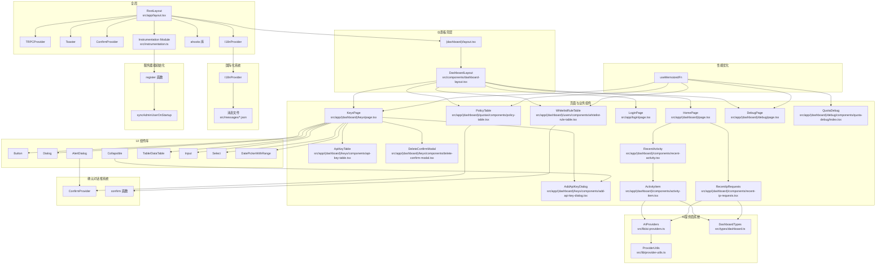
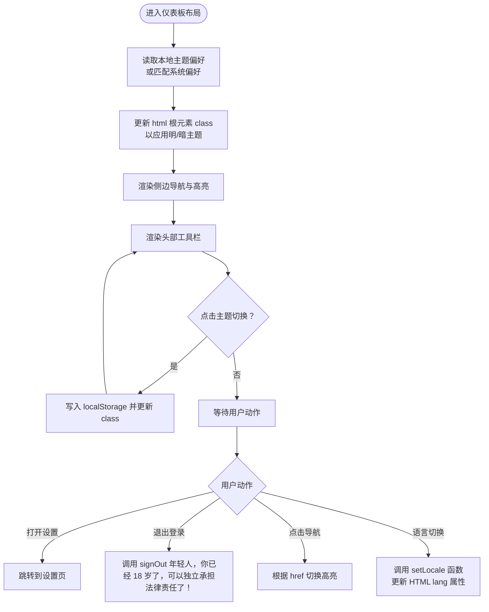
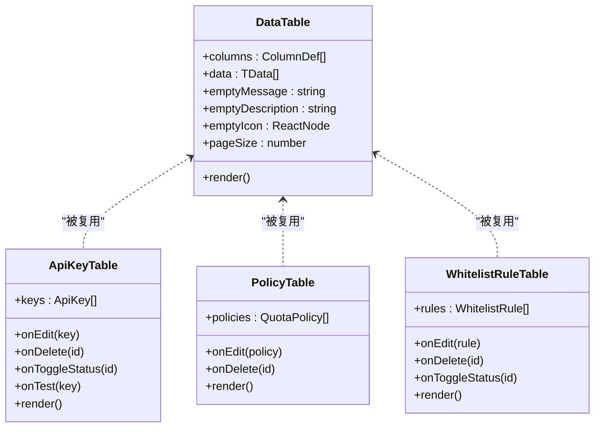
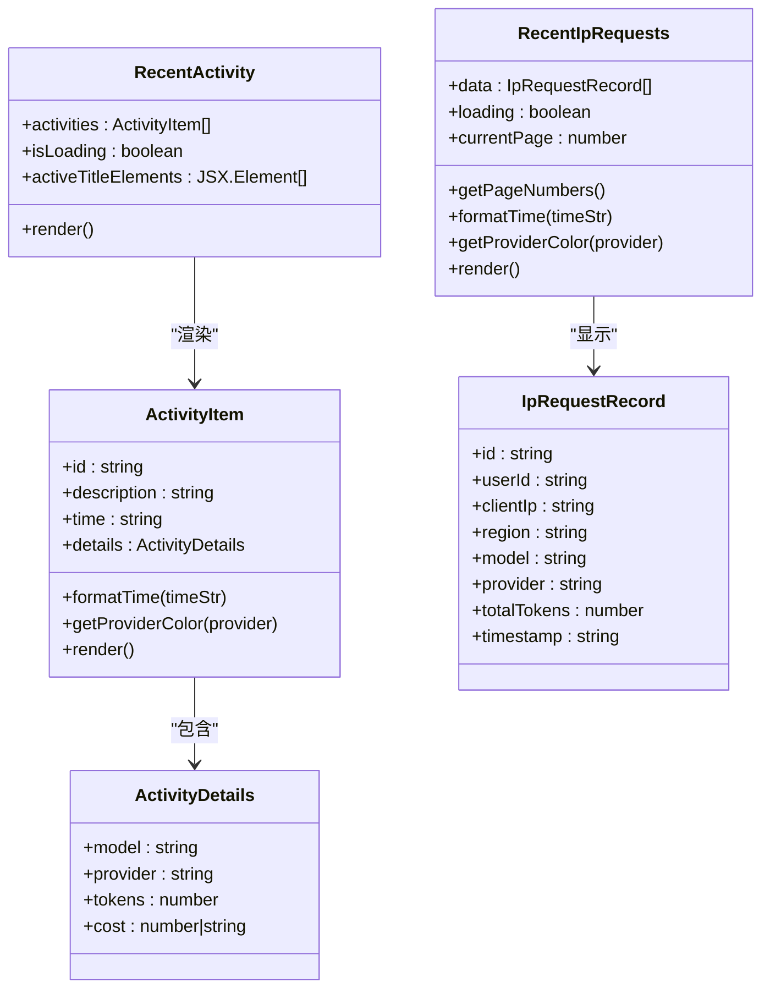
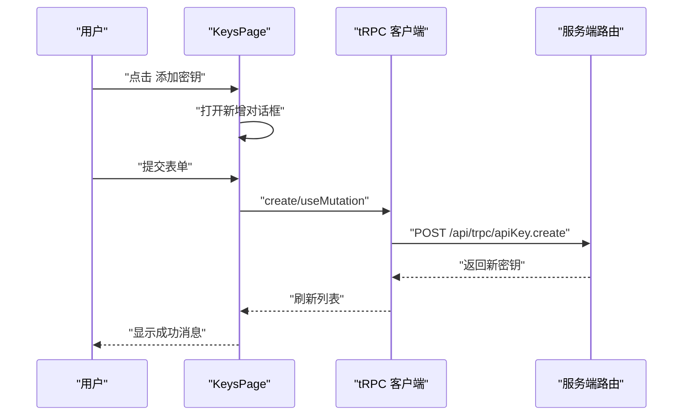
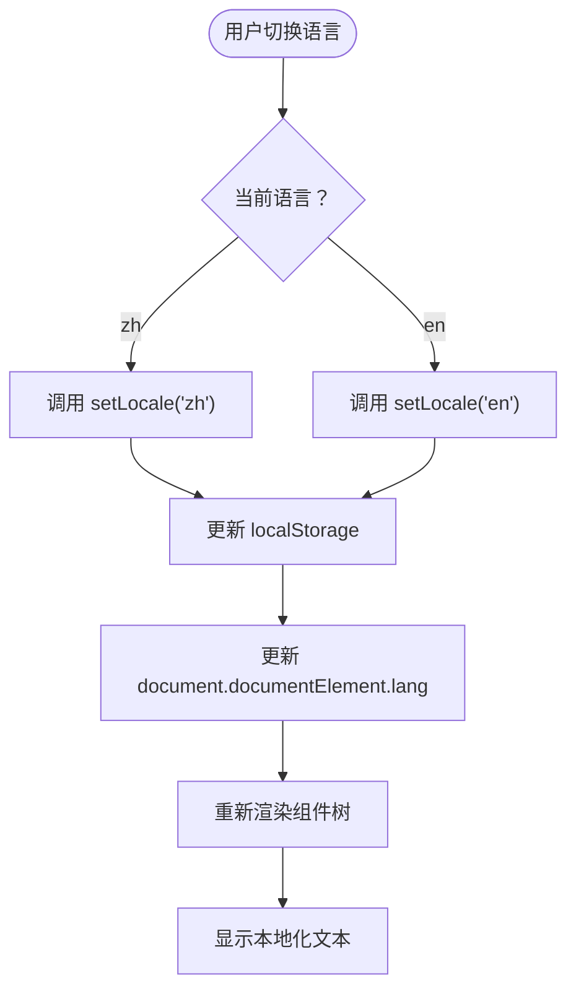
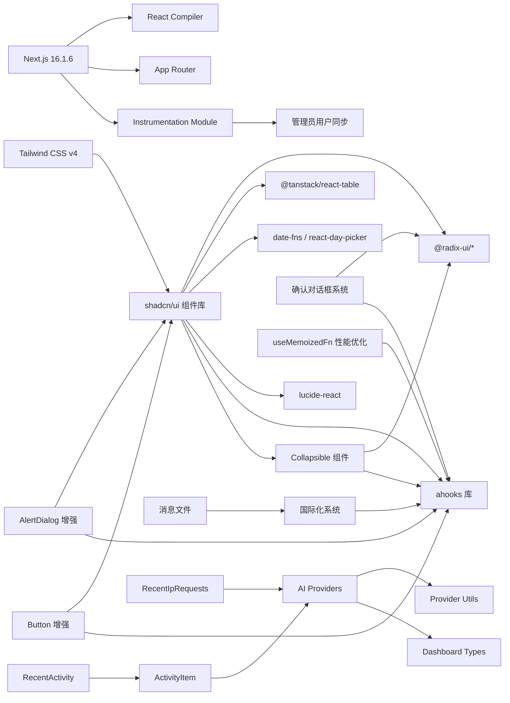

# 前端组件

<cite>
**本文档引用的文件**
- [package.json](file://package.json)
- [next.config.ts](file://next.config.ts)
- [tailwind.config.js](file://tailwind.config.js)
- [components.json](file://components.json)
- [src/app/layout.tsx](file://src/app/layout.tsx)
- [src/components/dashboard-layout/index.tsx](file://src/components/dashboard-layout/index.tsx)
- [src/app/(dashboard)/layout.tsx](file://src/app/(dashboard)/layout.tsx)
- [src/components/ui/button.tsx](file://src/components/ui/button.tsx)
- [src/components/ui/dialog.tsx](file://src/components/ui/dialog.tsx)
- [src/components/ui/alert-dialog.tsx](file://src/components/ui/alert-dialog.tsx)
- [src/components/ui/confirm.tsx](file://src/components/ui/confirm.tsx)
- [src/components/ui/collapsible.tsx](file://src/components/ui/collapsible.tsx)
- [src/components/ui/table.tsx](file://src/components/ui/table.tsx)
- [src/components/ui/data-table.tsx](file://src/components/ui/data-table.tsx)
- [src/components/date-picker-with-range.tsx](file://src/components/date-picker-with-range.tsx)
- [src/app/(dashboard)/keys/page.tsx](file://src/app/(dashboard)/keys/page.tsx)
- [src/app/(dashboard)/keys/components/api-key-table.tsx](file://src/app/(dashboard)/keys/components/api-key-table.tsx)
- [src/app/(dashboard)/keys/components/delete-confirm-modal.tsx](file://src/app/(dashboard)/keys/components/delete-confirm-modal.tsx)
- [src/app/(dashboard)/keys/components/add-api-key-dialog.tsx](file://src/app/(dashboard)/keys/components/add-api-key-dialog.tsx)
- [src/app/(dashboard)/quotas/page.tsx](file://src/app/(dashboard)/quotas/page.tsx)
- [src/app/(dashboard)/quotas/components/policy-table.tsx](file://src/app/(dashboard)/quotas/components/policy-table.tsx)
- [src/app/(dashboard)/users/page.tsx](file://src/app/(dashboard)/users/page.tsx)
- [src/app/(dashboard)/users/components/whitelist-rule-table.tsx](file://src/app/(dashboard)/users/components/whitelist-rule-table.tsx)
- [src/components/ui/input.tsx](file://src/components/ui/input.tsx)
- [src/components/ui/select.tsx](file://src/components/ui/select.tsx)
- [src/instrumentation.ts](file://src/instrumentation.ts)
- [src/i18n/client.tsx](file://src/i18n/client.tsx)
- [src/messages/en.json](file://src/messages/en.json)
- [src/messages/zh.json](file://src/messages/zh.json)
- [src/lib/init-admin.ts](file://src/lib/init-admin.ts)
- [src/components/dashboard-layout/sidebar-nav.tsx](file://src/components/dashboard-layout/sidebar-nav.tsx)
- [src/components/dashboard-layout/sidebar-footer.tsx](file://src/components/dashboard-layout/sidebar-footer.tsx)
- [src/app/login/page.tsx](file://src/app/login/page.tsx)
- [src/app/(dashboard)/page.tsx](file://src/app/(dashboard)/page.tsx)
- [src/app/(dashboard)/debug/page.tsx](file://src/app/(dashboard)/debug/page.tsx)
- [src/app/(dashboard)/debug/components/quota-debug/index.tsx](file://src/app/(dashboard)/debug/components/quota-debug/index.tsx)
- [src/app/(dashboard)/components/activity-item.tsx](file://src/app/(dashboard)/components/activity-item.tsx)
- [src/app/(dashboard)/components/recent-ip-requests.tsx](file://src/app/(dashboard)/components/recent-ip-requests.tsx)
- [src/app/(dashboard)/components/recent-activity.tsx](file://src/app/(dashboard)/components/recent-activity.tsx)
- [src/types/dashboard.ts](file://src/types/dashboard.ts)
- [src/lib/ai-providers.ts](file://src/lib/ai-providers.ts)
- [src/lib/provider-utils.ts](file://src/lib/provider-utils.ts)
</cite>

## 更新摘要
**变更内容**
- 新增 Collapsible 组件，基于 Radix UI 提供折叠/展开功能
- UI 组件库得到全面增强，包括 Button 组件的玻璃变体优化
- 国际化系统扩展，支持更完善的多语言切换和本地化
- 确认对话框系统集成，提供统一的危险操作确认体验
- 液体玻璃样式增强，AlertDialog 和 Button 组件获得更好的视觉效果
- 新增 useMemoizedFn 钩子在多个页面组件中的应用
- 新增 ahooks 库集成，提供性能优化工具
- 新增服务器端注册模块（instrumentation.ts），支持生产环境初始化
- 新增仪表板布局组件的国际化集成
- **更新**：Activity Item 和 Recent IP Requests 组件更新提供商命名约定，支持 DeepSeek、Moonshot、Spark、Kimi、MiniMax 提供商的颜色方案
- **更新**：AI Providers 配置扩展，包含完整的提供商列表和模型映射

## 目录
1. [简介](#简介)
2. [项目结构](#项目结构)
3. [核心组件](#核心组件)
4. [架构总览](#架构总览)
5. [组件详解](#组件详解)
6. [确认对话框系统](#确认对话框系统)
7. [国际化系统](#国际化系统)
8. [性能优化实践](#性能优化实践)
9. [依赖关系分析](#依赖关系分析)
10. [性能与可访问性](#性能与可访问性)
11. [故障排查指南](#故障排查指南)
12. [结论](#结论)
13. [附录](#附录)

## 简介
本文件系统化梳理 AIGate 基于 Next.js 14 App Router 的前端组件体系，重点覆盖以下方面：
- 基于 shadcn/ui 的组件库使用与自定义配置
- 仪表板布局组件的设计与交互
- 表单输入与选择器组件的封装
- 数据表格组件与分页机制
- 页面级业务组件（API 密钥、配额策略、白名单规则）的组织方式
- **新增**：Collapsible 折叠组件，提供内容折叠/展开功能
- **新增**：统一的确认对话框系统，提供一致的危险操作确认体验
- **新增**：AlertDialog 组件的液体玻璃样式增强
- **新增**：Button 组件的液体玻璃变体支持
- **新增**：useMemoizedFn钩子的性能优化应用
- **新增**：ahooks库集成带来的性能提升
- **新增**：服务器端注册模块（instrumentation.ts）支持生产环境初始化
- **新增**：国际化系统（I18nProvider）集成，支持多语言切换
- **更新**：Activity Item 和 Recent IP Requests 组件支持新的提供商颜色方案
- **更新**：AI Providers 配置扩展，支持 DeepSeek、Moonshot、Spark、Kimi、MiniMax 提供商
- 样式定制、响应式设计与主题切换最佳实践

## 项目结构
AIGate 采用 Next.js 14 App Router 的目录约定，页面按功能域组织在 `(dashboard)` 下，并通过共享布局组件统一注入全局 Provider 与通知组件。

```mermaid
graph TB
A["根布局<br/>src/app/layout.tsx"] --> B["仪表板壳层<br/>src/app/(dashboard)/layout.tsx"]
B --> C["仪表板布局组件<br/>src/components/dashboard-layout.tsx"]
B --> D["页面：API 密钥<br/>src/app/(dashboard)/keys/page.tsx"]
D --> E["子组件：密钥表格<br/>src/app/(dashboard)/keys/components/api-key-table.tsx"]
D --> F["子组件：删除确认模态<br/>src/app/(dashboard)/keys/components/delete-confirm-modal.tsx"]
D --> G["子组件：添加密钥对话框<br/>src/app/(dashboard)/keys/components/add-api-key-dialog.tsx"]
B --> H["页面：配额策略<br/>src/app/(dashboard)/quotas/page.tsx"]
H --> I["子组件：策略表格<br/>src/app/(dashboard)/quotas/components/policy-table.tsx"]
B --> J["页面：白名单规则<br/>src/app/(dashboard)/users/page.tsx"]
J --> K["子组件：规则表格<br/>src/app/(dashboard)/users/components/whitelist-rule-table.tsx"]
B --> L["调试页面<br/>src/app/(dashboard)/debug/page.tsx"]
L --> M["配额调试组件<br/>src/app/(dashboard)/debug/components/quota-debug/index.tsx"]
B --> N["仪表板页面<br/>src/app/(dashboard)/page.tsx"]
N --> O["最近活动组件<br/>src/app/(dashboard)/components/recent-activity.tsx"]
O --> P["活动项组件<br/>src/app/(dashboard)/components/activity-item.tsx"]
N --> Q["最近IP请求组件<br/>src/app/(dashboard)/components/recent-ip-requests.tsx"]
A --> R["全局样式与 Provider<br/>src/app/layout.tsx"]
S["UI 组件库<br/>src/components/ui/*.tsx"] -.-> C
S -.-> D
S -.-> H
S -.-> J
S -.-> L
S -.-> N
T["确认对话框系统<br/>src/components/ui/confirm.tsx"] -.-> H
T -.-> J
U["Collapsible 组件<br/>src/components/ui/collapsible.tsx"] -.-> G
V["液体玻璃样式增强<br/>AlertDialog/Button"] -.-> S
W["性能优化<br/>useMemoizedFn/ahooks"] -.-> D
W -.-> H
W -.-> J
W -.-> L
X["服务器端注册模块<br/>src/instrumentation.ts"] -.-> Y["管理员用户同步<br/>src/lib/init-admin.ts"]
Z["国际化系统<br/>src/i18n/client.tsx"] -.-> AA["消息文件<br/>src/messages/*.json"]
BB["仪表板国际化<br/>src/components/dashboard-layout/sidebar-*.tsx"] -.-> Z
CC["登录页面国际化<br/>src/app/login/page.tsx"] -.-> Z
DD["仪表板页面国际化<br/>src/app/(dashboard)/page.tsx"] -.-> Z
EE["调试页面国际化<br/>src/app/(dashboard)/debug/page.tsx"] -.-> Z
FF["AI提供商配置<br/>src/lib/ai-providers.ts"] -.-> GG["提供商工具函数<br/>src/lib/provider-utils.ts"]
HH["活动项组件<br/>src/app/(dashboard)/components/activity-item.tsx"] -.-> FF
II["最近IP请求组件<br/>src/app/(dashboard)/components/recent-ip-requests.tsx"] -.-> FF
JJ["仪表板类型定义<br/>src/types/dashboard.ts"] -.-> HH
JJ -.-> O
```



**图表来源**
- [src/app/layout.tsx:1-58](file://src/app/layout.tsx#L1-L58)
- [src/app/(dashboard)/layout.tsx](file://src/app/(dashboard)/layout.tsx#L1-L19)
- [src/components/dashboard-layout/index.tsx:1-29](file://src/components/dashboard-layout/index.tsx#L1-L29)
- [src/app/(dashboard)/keys/page.tsx](file://src/app/(dashboard)/keys/page.tsx#L1-L145)
- [src/app/(dashboard)/keys/components/api-key-table.tsx](file://src/app/(dashboard)/keys/components/api-key-table.tsx#L1-L194)
- [src/app/(dashboard)/keys/components/delete-confirm-modal.tsx](file://src/app/(dashboard)/keys/components/delete-confirm-modal.tsx#L1-L54)
- [src/app/(dashboard)/keys/components/add-api-key-dialog.tsx](file://src/app/(dashboard)/keys/components/add-api-key-dialog.tsx#L22-L309)
- [src/app/(dashboard)/quotas/page.tsx](file://src/app/(dashboard)/quotas/page.tsx#L1-L146)
- [src/app/(dashboard)/quotas/components/policy-table.tsx](file://src/app/(dashboard)/quotas/components/policy-table.tsx#L1-L167)
- [src/app/(dashboard)/users/page.tsx](file://src/app/(dashboard)/users/page.tsx#L1-L165)
- [src/app/(dashboard)/users/components/whitelist-rule-table.tsx](file://src/app/(dashboard)/users/components/whitelist-rule-table.tsx#L1-L168)
- [src/app/(dashboard)/debug/page.tsx](file://src/app/(dashboard)/debug/page.tsx#L1-L374)
- [src/app/(dashboard)/debug/components/quota-debug/index.tsx](file://src/app/(dashboard)/debug/components/quota-debug/index.tsx#L1-L172)
- [src/app/(dashboard)/page.tsx](file://src/app/(dashboard)/page.tsx#L1-L243)
- [src/app/(dashboard)/components/recent-activity.tsx](file://src/app/(dashboard)/components/recent-activity.tsx#L1-L53)
- [src/app/(dashboard)/components/activity-item.tsx](file://src/app/(dashboard)/components/activity-item.tsx#L1-L89)
- [src/app/(dashboard)/components/recent-ip-requests.tsx](file://src/app/(dashboard)/components/recent-ip-requests.tsx#L1-L216)
- [src/lib/ai-providers.ts:1-483](file://src/lib/ai-providers.ts#L1-L483)
- [src/lib/provider-utils.ts:1-31](file://src/lib/provider-utils.ts#L1-L31)
- [src/types/dashboard.ts:1-48](file://src/types/dashboard.ts#L1-L48)

**章节来源**
- [src/app/layout.tsx:1-58](file://src/app/layout.tsx#L1-L58)
- [src/app/(dashboard)/layout.tsx](file://src/app/(dashboard)/layout.tsx#L1-L19)

## 核心组件
本节聚焦于 UI 组件库与布局组件的关键实现要点，包括按钮、对话框、确认对话框、折叠组件、表格、数据表格、输入与选择器等。

- 按钮 Button
  - 支持多种变体与尺寸，内置液态玻璃（backdrop-blur）与阴影动画，适配明暗主题。
  - 新增 glass 变体，提供更强的液体玻璃效果和透明度控制。
  - **更新**：使用 useMemoizedFn 优化按钮点击事件的性能。
  - 参考路径：[src/components/ui/button.tsx:1-77](file://src/components/ui/button.tsx#L1-L77)

- 对话框 Dialog 与确认对话框 AlertDialog
  - Dialog 基于 Radix UI，提供 Overlay、Portal、Content、Header/Footer、Title/Description 等组合。
  - AlertDialog 提供确认/取消操作，支持自定义标题、描述、按钮文本和样式变体。
  - **新增**：AlertDialog 组件经过增强，支持液体玻璃背景（backdrop-blur-xl）、阴影效果（shadow-[0_24px_64px_rgba(0,0,0,0.2),inset_1px_1px_0_rgba(255,255,255,0.6)]）和边框效果（border border-white/30 dark:border-white/10）。
  - **更新**：AlertDialog 组件集成了液体玻璃样式增强，提供更现代的视觉体验。
  - 参考路径：
    - [src/components/ui/dialog.tsx:1-125](file://src/components/ui/dialog.tsx#L1-L125)
    - [src/components/ui/alert-dialog.tsx:1-146](file://src/components/ui/alert-dialog.tsx#L1-L146)

- **新增**：折叠组件 Collapsible
  - 基于 Radix UI Collapsible，提供折叠/展开功能，支持触发器和内容区域分离。
  - 适用于内容折叠、高级设置展开、表单字段分组等场景。
  - 参考路径：[src/components/ui/collapsible.tsx:1-12](file://src/components/ui/collapsible.tsx#L1-L12)

- **新增**：确认对话框系统 ConfirmProvider 与 confirm 函数
  - Provider 级别的确认对话框，支持全局调用和 Promise 返回值。
  - 提供默认标题、描述、按钮文本和破坏性样式变体。
  - 通过静态实例管理状态，确保在整个应用范围内的一致性。
  - 支持异步操作处理，包含加载状态管理和错误处理。
  - **更新**：使用 useMemoizedFn 优化 show 方法的性能，避免不必要的重新创建。
  - 参考路径：[src/components/ui/confirm.tsx:1-170](file://src/components/ui/confirm.tsx#L1-L170)

- 表格 Table 与数据表格 DataTable
  - Table 封装容器与表头/体/脚样式；DataTable 基于 @tanstack/react-table 实现排序、过滤、分页与空态展示。
  - 支持自定义空态图标、消息与描述，分页页码生成算法考虑"省略号"策略。
  - 参考路径：
    - [src/components/ui/table.tsx:1-115](file://src/components/ui/table.tsx#L1-L115)
    - [src/components/ui/data-table.tsx:1-191](file://src/components/ui/data-table.tsx#L1-L191)

- 输入 Input 与选择 Select
  - Input 提供液态玻璃背景、边框与焦点/悬停过渡。
  - Select 基于 Radix UI，提供触发器、内容面板、滚动按钮、选项项与分隔符，统一动画与玻璃效果。
  - 参考路径：
    - [src/components/ui/input.tsx:1-41](file://src/components/ui/input.tsx#L1-L41)
    - [src/components/ui/select.tsx:1-182](file://src/components/ui/select.tsx#L1-L182)

- 日期范围选择器 DatePickerWithRange
  - 基于 react-day-picker 与 Popover，提供双月日历与本地化文案，支持清空与格式化输出。
  - 参考路径：[src/components/date-picker-with-range.tsx:1-92](file://src/components/date-picker-with-range.tsx#L1-L92)

**章节来源**
- [src/components/ui/button.tsx:1-77](file://src/components/ui/button.tsx#L1-L77)
- [src/components/ui/dialog.tsx:1-125](file://src/components/ui/dialog.tsx#L1-L125)
- [src/components/ui/alert-dialog.tsx:1-146](file://src/components/ui/alert-dialog.tsx#L1-L146)
- [src/components/ui/collapsible.tsx:1-12](file://src/components/ui/collapsible.tsx#L1-L12)
- [src/components/ui/confirm.tsx:1-170](file://src/components/ui/confirm.tsx#L1-L170)
- [src/components/ui/table.tsx:1-115](file://src/components/ui/table.tsx#L1-L115)
- [src/components/ui/data-table.tsx:1-191](file://src/components/ui/data-table.tsx#L1-L191)
- [src/components/ui/input.tsx:1-41](file://src/components/ui/input.tsx#L1-L41)
- [src/components/ui/select.tsx:1-182](file://src/components/ui/select.tsx#L1-L182)
- [src/components/date-picker-with-range.tsx:1-92](file://src/components/date-picker-with-range.tsx#L1-L92)

## 架构总览
AIGate 前端采用"页面 + 共享布局 + UI 组件库 + 确认对话框系统 + 国际化系统"的分层架构。全局 Provider 注入 tRPC、通知组件、确认对话框和国际化支持，仪表板壳层负责权限校验与导航，页面组件通过 tRPC 调用后端接口，UI 组件承担交互与视觉表现。



**图表来源**
- [src/app/layout.tsx:1-58](file://src/app/layout.tsx#L1-L58)
- [src/app/(dashboard)/layout.tsx](file://src/app/(dashboard)/layout.tsx#L1-L19)
- [src/components/dashboard-layout/index.tsx:1-29](file://src/components/dashboard-layout/index.tsx#L1-L29)
- [src/app/(dashboard)/keys/page.tsx](file://src/app/(dashboard)/keys/page.tsx#L1-L145)
- [src/app/(dashboard)/keys/components/api-key-table.tsx](file://src/app/(dashboard)/keys/components/api-key-table.tsx#L1-L194)
- [src/app/(dashboard)/keys/components/delete-confirm-modal.tsx](file://src/app/(dashboard)/keys/components/delete-confirm-modal.tsx#L1-L54)
- [src/app/(dashboard)/keys/components/add-api-key-dialog.tsx](file://src/app/(dashboard)/keys/components/add-api-key-dialog.tsx#L22-L309)
- [src/app/(dashboard)/quotas/page.tsx](file://src/app/(dashboard)/quotas/page.tsx#L1-L146)
- [src/app/(dashboard)/quotas/components/policy-table.tsx](file://src/app/(dashboard)/quotas/components/policy-table.tsx#L1-L167)
- [src/app/(dashboard)/users/page.tsx](file://src/app/(dashboard)/users/page.tsx#L1-L165)
- [src/app/(dashboard)/users/components/whitelist-rule-table.tsx](file://src/app/(dashboard)/users/components/whitelist-rule-table.tsx#L1-L168)
- [src/app/(dashboard)/debug/page.tsx](file://src/app/(dashboard)/debug/page.tsx#L1-L374)
- [src/app/(dashboard)/debug/components/quota-debug/index.tsx](file://src/app/(dashboard)/debug/components/quota-debug/index.tsx#L1-L172)
- [src/app/(dashboard)/page.tsx](file://src/app/(dashboard)/page.tsx#L1-L243)
- [src/app/(dashboard)/components/recent-activity.tsx](file://src/app/(dashboard)/components/recent-activity.tsx#L1-L53)
- [src/app/(dashboard)/components/activity-item.tsx](file://src/app/(dashboard)/components/activity-item.tsx#L1-L89)
- [src/app/(dashboard)/components/recent-ip-requests.tsx](file://src/app/(dashboard)/components/recent-ip-requests.tsx#L1-L216)
- [src/lib/ai-providers.ts:1-483](file://src/lib/ai-providers.ts#L1-L483)
- [src/lib/provider-utils.ts:1-31](file://src/lib/provider-utils.ts#L1-L31)
- [src/types/dashboard.ts:1-48](file://src/types/dashboard.ts#L1-L48)

## 组件详解

### 仪表板布局组件 DashboardLayout
- 功能概览
  - 侧边导航：包含仪表板、接口调试、配额管理、API 密钥、用户策略管理等入口，支持当前路由高亮与悬停放大动效。
  - 头部工具栏：主题切换（明/暗）、用户下拉菜单（设置、退出登录），支持本地存储持久化。
  - **新增**：语言切换功能，支持中英文动态切换，实时更新 HTML lang 属性。
  - 响应式与视觉：使用液态玻璃背景、阴影与边框增强层次感，整体采用渐变背景与圆角卡片风格。
- 关键点
  - 主题切换通过监听与写入 localStorage 并更新 html 根元素 class 实现。
  - 使用 Popover 展示用户菜单，结合 next-auth 的 signOut 完成登出流程。
  - **新增**：语言切换通过 setLocale 函数实现，支持 zh/en 两种语言。
- 参考路径：[src/components/dashboard-layout/index.tsx:1-29](file://src/components/dashboard-layout/index.tsx#L1-L29)



**图表来源**
- [src/components/dashboard-layout/index.tsx:12-28](file://src/components/dashboard-layout/index.tsx#L12-L28)
- [src/components/dashboard-layout/sidebar-footer.tsx:122-166](file://src/components/dashboard-layout/sidebar-footer.tsx#L122-L166)

**章节来源**
- [src/components/dashboard-layout/index.tsx:1-29](file://src/components/dashboard-layout/index.tsx#L1-L29)

### 数据表格组件 DataTable 与页面级表格
- DataTable
  - 基于 @tanstack/react-table，提供排序、过滤、分页与空态展示。
  - 自定义分页页码生成：当总页数超过阈值时插入省略号，保证可视区域友好。
  - 空态图标、消息与描述可由外部传入，提升可用性。
  - 参考路径：[src/components/ui/data-table.tsx:1-191](file://src/components/ui/data-table.tsx#L1-L191)
- API 密钥表格 ApiKeyTable
  - 列定义包含名称、服务商、API Key Id/Key、Base URL、创建时间、最后使用、状态与操作列。
  - 支持复制到剪贴板、测试（可选）、启用/禁用、编辑、删除等操作。
  - **新增**：国际化支持，所有表格标题和操作按钮均通过 t 函数获取本地化文本。
  - **新增**：使用 Collapsible 组件优化高级设置的显示与隐藏。
  - 参考路径：[src/app/(dashboard)/keys/components/api-key-table.tsx](file://src/app/(dashboard)/keys/components/api-key-table.tsx#L1-L194)
- 配额策略表格 PolicyTable
  - 列定义包含策略名称、描述、限制类型（Token/请求次数）、日/月限额、RPM 限制、创建时间与操作列。
  - **新增**：国际化支持，所有表格标题和操作按钮均通过 t 函数获取本地化文本。
  - 参考路径：[src/app/(dashboard)/quotas/components/policy-table.tsx](file://src/app/(dashboard)/quotas/components/policy-table.tsx#L1-L167)
- 白名单规则表格 WhitelistRuleTable
  - 列定义包含优先级、策略名称、描述、校验规则开关与表达式、状态、创建时间与操作列。
  - 支持按优先级降序排序，便于规则优先级展示。
  - **新增**：国际化支持，所有表格标题和操作按钮均通过 t 函数获取本地化文本。
  - 参考路径：[src/app/(dashboard)/users/components/whitelist-rule-table.tsx](file://src/app/(dashboard)/users/components/whitelist-rule-table.tsx#L1-L168)



**图表来源**
- [src/components/ui/data-table.tsx:27-66](file://src/components/ui/data-table.tsx#L27-L66)
- [src/app/(dashboard)/keys/components/api-key-table.tsx](file://src/app/(dashboard)/keys/components/api-key-table.tsx#L29-L174)
- [src/app/(dashboard)/quotas/components/policy-table.tsx](file://src/app/(dashboard)/quotas/components/policy-table.tsx#L32-L147)
- [src/app/(dashboard)/users/components/whitelist-rule-table.tsx](file://src/app/(dashboard)/users/components/whitelist-rule-table.tsx#L36-L147)

**章节来源**
- [src/components/ui/data-table.tsx:1-191](file://src/components/ui/data-table.tsx#L1-L191)
- [src/app/(dashboard)/keys/components/api-key-table.tsx](file://src/app/(dashboard)/keys/components/api-key-table.tsx#L1-L194)
- [src/app/(dashboard)/quotas/components/policy-table.tsx](file://src/app/(dashboard)/quotas/components/policy-table.tsx#L1-L167)
- [src/app/(dashboard)/users/components/whitelist-rule-table.tsx](file://src/app/(dashboard)/users/components/whitelist-rule-table.tsx#L1-L168)

### 表单与输入组件
- Input
  - 统一的液态玻璃外观、边框与焦点/悬停过渡，适用于大多数文本输入场景。
  - 参考路径：[src/components/ui/input.tsx:1-41](file://src/components/ui/input.tsx#L1-L41)
- Select
  - 触发器、内容面板、滚动按钮、选项项与分隔符完整封装，支持 popper 动画与玻璃背景。
  - 参考路径：[src/components/ui/select.tsx:1-182](file://src/components/ui/select.tsx#L1-L182)
- DatePickerWithRange
  - 基于 react-day-picker 的范围选择器，支持双月视图、本地化与格式化输出。
  - 参考路径：[src/components/date-picker-with-range.tsx:1-92](file://src/components/date-picker-with-range.tsx#L1-L92)

**章节来源**
- [src/components/ui/input.tsx:1-41](file://src/components/ui/input.tsx#L1-L41)
- [src/components/ui/select.tsx:1-182](file://src/components/ui/select.tsx#L1-L182)
- [src/components/date-picker-with-range.tsx:1-92](file://src/components/date-picker-with-range.tsx#L1-L92)

### 仪表板活动组件

#### ActivityItem 组件
- 功能概览
  - 显示单个活动条目，包含描述、时间戳和可选的提供商、模型、token 使用量信息。
  - **更新**：支持新的提供商颜色方案，包括 DeepSeek（紫色）、Moonshot（橙色）、Spark（绿色）、Kimi（橙色）、MiniMax（青色）。
  - **更新**：提供商名称转换为小写进行颜色匹配，确保与 AI Providers 配置一致。
- 关键点
  - 时间格式化：支持"刚刚"、"分钟前"、"小时前"、"天前"等人性化时间显示。
  - 颜色方案：基于提供商类型动态分配颜色类，提供视觉区分。
  - 响应式设计：支持深色主题下的颜色变体。
- 参考路径：[src/app/(dashboard)/components/activity-item.tsx](file://src/app/(dashboard)/components/activity-item.tsx#L1-L89)

#### RecentIpRequests 组件
- 功能概览
  - 显示最近的 IP 请求记录，包含 IP 地址、归属地、用户、模型、Token 使用量和时间。
  - **更新**：支持新的提供商颜色方案，与 ActivityItem 组件保持一致。
  - **更新**：提供完整的分页功能，支持 10 条记录每页的分页显示。
- 关键点
  - 分页算法：智能分页，当总页数超过 7 页时显示省略号。
  - 颜色方案：基于提供商类型动态分配颜色类，确保视觉一致性。
  - 表格设计：使用统一的表格组件，支持响应式布局。
- 参考路径：[src/app/(dashboard)/components/recent-ip-requests.tsx](file://src/app/(dashboard)/components/recent-ip-requests.tsx#L1-L216)

#### RecentActivity 组件
- 功能概览
  - 渲染最近活动列表，使用 ActivityItem 组件展示每个活动条目。
  - 支持加载状态和空状态的优雅处理。
- 关键点
  - 性能优化：使用 React.useMemo 缓存活动项的渲染结果。
  - 加载状态：提供骨架屏加载效果，改善用户体验。
  - 数据绑定：接收来自 tRPC 查询的数据，自动渲染活动列表。
- 参考路径：[src/app/(dashboard)/components/recent-activity.tsx](file://src/app/(dashboard)/components/recent-activity.tsx#L1-L53)



**图表来源**
- [src/app/(dashboard)/components/activity-item.tsx:5-15](file://src/app/(dashboard)/components/activity-item.tsx#L5-L15)
- [src/app/(dashboard)/components/recent-ip-requests.tsx:24-33](file://src/app/(dashboard)/components/recent-ip-requests.tsx#L24-L33)
- [src/app/(dashboard)/components/recent-activity.tsx:7-10](file://src/app/(dashboard)/components/recent-activity.tsx#L7-L10)
- [src/types/dashboard.ts:24-35](file://src/types/dashboard.ts#L24-L35)

**章节来源**
- [src/app/(dashboard)/components/activity-item.tsx](file://src/app/(dashboard)/components/activity-item.tsx#L1-L89)
- [src/app/(dashboard)/components/recent-ip-requests.tsx](file://src/app/(dashboard)/components/recent-ip-requests.tsx#L1-L216)
- [src/app/(dashboard)/components/recent-activity.tsx](file://src/app/(dashboard)/components/recent-activity.tsx#L1-L53)
- [src/types/dashboard.ts:1-48](file://src/types/dashboard.ts#L1-L48)

### 页面级业务组件
- KeysPage
  - 使用 tRPC 查询/增删改查 API 密钥，集成对话框、确认模态与消息提示（成功/错误）。
  - 支持新增、编辑、删除、启用/禁用与加载状态。
  - **更新**：保留原有的 DeleteConfirmModal 用于删除操作，同时集成了 confirm 函数进行其他危险操作。
  - **更新**：使用 useMemoizedFn 优化编辑、删除、状态切换等函数的性能。
  - **新增**：国际化支持，所有操作按钮、提示消息均通过 t 函数获取本地化文本。
  - **新增**：使用 Collapsible 组件优化高级设置的折叠/展开功能。
  - 参考路径：[src/app/(dashboard)/keys/page.tsx](file://src/app/(dashboard)/keys/page.tsx#L1-L145)

- AddApiKeyDialog
  - **新增**：基于 Collapsible 组件实现高级设置的折叠/展开功能。
  - 支持 API Key 创建、Base URL 配置、服务商选择等。
  - 使用 useMemoizedFn 优化表单提交和验证逻辑。
  - **更新**：支持新的提供商选项，包括 DeepSeek、Moonshot、Spark、Kimi、MiniMax。
  - 参考路径：[src/app/(dashboard)/keys/components/add-api-key-dialog.tsx](file://src/app/(dashboard)/keys/components/add-api-key-dialog.tsx#L22-L309)



**图表来源**
- [src/app/(dashboard)/keys/page.tsx](file://src/app/(dashboard)/keys/page.tsx#L59-L99)

**章节来源**
- [src/app/(dashboard)/keys/page.tsx](file://src/app/(dashboard)/keys/page.tsx#L1-L145)
- [src/app/(dashboard)/keys/components/add-api-key-dialog.tsx](file://src/app/(dashboard)/keys/components/add-api-key-dialog.tsx#L22-L309)

## 确认对话框系统

### ConfirmProvider 与 confirm 函数
AIGate 引入了统一的确认对话框系统，提供全局级别的确认对话框组件，确保在所有页面中进行危险操作时有一致的用户体验。

- **ConfirmProvider**
  - 作为全局 Provider 包装整个应用，提供确认对话框的状态管理。
  - 使用 React 状态管理确认对话框的打开/关闭状态和配置选项。
  - 通过静态实例暴露 show 方法，支持全局调用。
  - **更新**：使用 useMemoizedFn 优化 show 方法的性能，避免每次渲染都重新创建函数。
  - 支持异步操作处理，包含加载状态管理和错误处理。
  - 参考路径：[src/components/ui/confirm.tsx:36-153](file://src/components/ui/confirm.tsx#L36-L153)

- **confirm 函数**
  - 全局确认对话框入口，支持字符串和对象两种调用方式。
  - 字符串形式：提供默认标题和描述。
  - 对象形式：允许自定义标题、描述、按钮文本和样式变体。
  - 返回 Promise，支持异步操作处理。
  - 支持 onConfirm 回调函数，可在确认时执行异步操作。
  - 参考路径：[src/components/ui/confirm.tsx:155-170](file://src/components/ui/confirm.tsx#L155-L170)

- **AlertDialog 集成**
  - 基于 AlertDialog 组件构建，保持与现有对话框组件的一致性。
  - 支持默认和破坏性两种样式变体，用于区分普通确认和危险操作。
  - **新增**：AlertDialog 经过增强，支持液体玻璃背景（backdrop-blur-xl）、阴影效果（shadow-[0_24px_64px_rgba(0,0,0,0.2),inset_1px_1px_0_rgba(255,255,255,0.6)]）和边框效果（border border-white/30 dark:border-white/10）。
  - 提供自定义动画和视觉效果，符合整体设计语言。
  - **更新**：AlertDialog 组件集成了液体玻璃样式增强，提供更现代的视觉体验。
  - 参考路径：[src/components/ui/alert-dialog.tsx:1-146](file://src/components/ui/alert-dialog.tsx#L1-L146)

### 在页面中的应用
确认对话框系统已在多个页面中集成，提供统一的危险操作确认体验：

- **配额管理页面 QuotasPage**
  - 在删除配额策略时使用 confirm 函数进行确认。
  - 支持异步删除操作，删除成功后自动刷新数据。
  - **更新**：使用 useMemoizedFn 优化删除函数的性能。
  - 参考路径：[src/app/(dashboard)/quotas/page.tsx](file://src/app/(dashboard)/quotas/page.tsx#L1-L146)

- **用户管理页面 UsersPage**
  - 在删除白名单规则时使用 confirm 函数进行确认。
  - 支持异步删除操作，删除成功后自动刷新数据。
  - **更新**：使用 useMemoizedFn 优化删除函数的性能。
  - 参考路径：[src/app/(dashboard)/users/page.tsx](file://src/app/(dashboard)/users/page.tsx#L1-L165)

- **API 密钥管理页面 KeysPage**
  - 在删除 API 密钥时使用 confirm 函数进行确认，支持自定义 onConfirm 回调。
  - **更新**：使用 useMemoizedFn 优化删除函数的性能。
  - **新增**：国际化支持，确认对话框标题和描述通过 t 函数获取本地化文本。
  - 参考路径：[src/app/(dashboard)/keys/page.tsx](file://src/app/(dashboard)/keys/page.tsx#L1-L145)

- **调试页面 QuotaDebug**
  - 在重置配额时使用 confirm 函数进行确认。
  - 支持异步重置操作，重置后自动刷新数据。
  - **更新**：使用 useMemoizedFn 优化重置函数的性能。
  - 参考路径：[src/app/(dashboard)/debug/components/quota-debug/index.tsx](file://src/app/(dashboard)/debug/components/quota-debug/index.tsx#L61-L79)


**图表来源**
- [src/app/(dashboard)/quotas/page.tsx](file://src/app/(dashboard)/quotas/page.tsx#L70-L74)
- [src/app/(dashboard)/users/page.tsx](file://src/app/(dashboard)/users/page.tsx#L94-L98)
- [src/app/(dashboard)/keys/page.tsx](file://src/app/(dashboard)/keys/page.tsx#L69-L79)
- [src/app/(dashboard)/debug/components/quota-debug/index.tsx](file://src/app/(dashboard)/debug/components/quota-debug/index.tsx#L66)
- [src/components/ui/confirm.tsx:155-170](file://src/components/ui/confirm.tsx#L155-L170)

**章节来源**
- [src/components/ui/confirm.tsx:1-170](file://src/components/ui/confirm.tsx#L1-L170)
- [src/app/(dashboard)/quotas/page.tsx](file://src/app/(dashboard)/quotas/page.tsx#L1-L146)
- [src/app/(dashboard)/users/page.tsx](file://src/app/(dashboard)/users/page.tsx#L1-L165)
- [src/app/(dashboard)/keys/page.tsx](file://src/app/(dashboard)/keys/page.tsx#L1-L145)
- [src/app/(dashboard)/debug/components/quota-debug/index.tsx](file://src/app/(dashboard)/debug/components/quota-debug/index.tsx#L1-L172)
- [src/components/ui/alert-dialog.tsx:1-146](file://src/components/ui/alert-dialog.tsx#L1-L146)

## 国际化系统

### I18nProvider 架构
AIGate 实现了完整的国际化系统，支持中英文动态切换和本地化消息管理。

- **I18nProvider**
  - 作为全局 Provider 包装整个应用，提供国际化状态管理。
  - 使用 useLocalStorageState 管理用户语言偏好，支持 zh/en 两种语言。
  - 通过 Context API 暴露 locale、setLocale 和 t 函数。
  - **新增**：自动更新 document.documentElement.lang 属性，支持 SEO 和可访问性。
  - **更新**：增强错误处理机制，提供更详细的翻译键不存在提示。
  - 参考路径：[src/i18n/client.tsx:53-86](file://src/i18n/client.tsx#L53-L86)

- **useTranslation Hook**
  - 自定义 Hook，封装 I18nContext 的使用，提供类型安全的语言切换能力。
  - 包含 locale、setLocale 和 t 函数，支持嵌套对象的翻译键查找。
  - **新增**：提供错误处理，当翻译键不存在时返回键名并输出警告。
  - **更新**：优化性能，使用 useCallback 包装 t 函数和 setLocale 函数。
  - 参考路径：[src/i18n/client.tsx:89-102](file://src/i18n/client.tsx#L89-L102)

- **消息文件结构**
  - **中文消息**：src/messages/zh.json，包含完整的中文翻译内容
  - **英文消息**：src/messages/en.json，包含完整的英文翻译内容
  - 支持嵌套对象结构，便于组织不同模块的翻译内容
  - 参考路径：
    - [src/messages/zh.json:1-180](file://src/messages/zh.json#L1-L180)
    - [src/messages/en.json:1-180](file://src/messages/en.json#L1-L180)

### 服务器端注册模块
- **instrumentation.ts**
  - Next.js 14 服务器端注册模块，支持生产环境下的应用初始化。
  - 仅在 Node.js 运行时和生产环境执行，避免开发环境的额外开销。
  - 调用 syncAdminUserOnStartup 函数同步管理员用户信息。
  - 参考路径：[src/instrumentation.ts:1-10](file://src/instrumentation.ts#L1-L10)

- **管理员用户同步**
  - **init-admin.ts**：同步管理员用户到数据库，确保系统初始状态。
  - 支持从环境变量读取管理员信息（ADMIN_EMAIL、ADMIN_PASSWORD、ADMIN_NAME）。
  - 自动删除现有管理员用户并创建新的管理员账户。
  - 参考路径：[src/lib/init-admin.ts:9-70](file://src/lib/init-admin.ts#L9-L70)

### 在页面中的应用
国际化系统已在多个页面中集成，提供完整的多语言支持：

- **仪表板布局组件**
  - **sidebar-nav.tsx**：导航菜单项通过 t 函数获取本地化文本。
  - **sidebar-footer.tsx**：语言切换按钮、用户菜单项均支持国际化。
  - 参考路径：
    - [src/components/dashboard-layout/sidebar-nav.tsx:9-35](file://src/components/dashboard-layout/sidebar-nav.tsx#L9-L35)
    - [src/components/dashboard-layout/sidebar-footer.tsx:122-166](file://src/components/dashboard-layout/sidebar-footer.tsx#L122-L166)

- **登录页面**
  - **login/page.tsx**：所有表单字段、按钮文本、错误消息均通过 t 函数获取本地化内容。
  - 支持动态语言切换，实时更新页面文本。
  - 参考路径：[src/app/login/page.tsx:12-132](file://src/app/login/page.tsx#L12-L132)

- **仪表板页面**
  - **dashboard/page.tsx**：统计标题、图表标题、按钮文本均支持国际化。
  - **新增**：根据当前语言动态格式化时间显示。
  - 参考路径：[src/app/(dashboard)/page.tsx:16-242](file://src/app/(dashboard)/page.tsx#L16-L242)

- **调试页面**
  - **debug/page.tsx**：调试工具的所有文本内容均支持国际化。
  - **新增**：配额调试组件支持国际化，包括标签页、按钮和提示信息。
  - 参考路径：[src/app/(dashboard)/debug/page.tsx:15-374](file://src/app/(dashboard)/debug/page.tsx#L15-L374)



**图表来源**
- [src/i18n/client.tsx:73-80](file://src/i18n/client.tsx#L73-L80)
- [src/components/dashboard-layout/sidebar-footer.tsx:140-161](file://src/components/dashboard-layout/sidebar-footer.tsx#L140-L161)

**章节来源**
- [src/i18n/client.tsx:1-102](file://src/i18n/client.tsx#L1-L102)
- [src/messages/zh.json:1-180](file://src/messages/zh.json#L1-L180)
- [src/messages/en.json:1-180](file://src/messages/en.json#L1-L180)
- [src/instrumentation.ts:1-10](file://src/instrumentation.ts#L1-L10)
- [src/lib/init-admin.ts:1-71](file://src/lib/init-admin.ts#L1-L71)
- [src/components/dashboard-layout/sidebar-nav.tsx:1-64](file://src/components/dashboard-layout/sidebar-nav.tsx#L1-L64)
- [src/components/dashboard-layout/sidebar-footer.tsx:1-167](file://src/components/dashboard-layout/sidebar-footer.tsx#L1-L167)
- [src/app/login/page.tsx:1-133](file://src/app/login/page.tsx#L1-L133)
- [src/app/(dashboard)/page.tsx:1-243](file://src/app/(dashboard)/page.tsx#L1-L243)
- [src/app/(dashboard)/debug/page.tsx:15-374](file://src/app/(dashboard)/debug/page.tsx#L15-L374)

## 性能优化实践

### useMemoizedFn 钩子的应用
AIGate 在多个页面组件中集成了 useMemoizedFn 钩子，显著提升了组件的性能表现：

- **函数稳定性**：useMemoizedFn 确保回调函数在组件重新渲染时保持引用稳定，避免不必要的子组件重渲染。
- **性能提升**：在 KeysPage、QuotasPage、UsersPage、DebugPage 和 QuotaDebug 中，所有处理函数都使用 useMemoizedFn 包装。
- **内存优化**：避免每次渲染都创建新的函数实例，减少内存占用和垃圾回收压力。

**更新**：在所有主要页面组件中应用 useMemoizedFn，包括：
- KeysPage：handleEditKey、handleDeleteKey、handleToggleStatus、handleSaveKey
- QuotasPage：handleEditPolicy、handleDeletePolicy、handleSavePolicy
- UsersPage：handleEditRule、handleDeleteRule、handleToggleRuleStatus、handleSaveRule
- DebugPage：handleEstimateTokens、generateCode、copyToClipboard、handleSubmit
- QuotaDebug：handleCheckQuota、handleGetUserUsage、handleResetQuota
- **新增**：国际化系统中的 t 函数和 setLocale 函数也使用 useMemoizedFn 优化性能
- **新增**：确认对话框系统中的 confirm 函数和 show 方法使用 useMemoizedFn 优化性能

### ahooks 库的集成
AIGate 集成了 ahooks 库，为组件提供丰富的性能优化工具：

- **useMemoizedFn**：如上所述，用于优化函数性能
- **useMount**：在 ConfirmProvider 中用于初始化静态实例
- **useLocalStorageState**：在 I18nProvider 中用于管理语言偏好
- **其他工具**：提供响应式状态管理、副作用优化等功能

## 依赖关系分析
- 构建与运行时
  - Next.js 16.1.6，启用 React Compiler 与独立输出（standalone）。
  - **新增**：Next.js 14 服务器端注册模块支持。
  - 参考路径：[package.json:1-96](file://package.json#L1-L96)，[next.config.ts:1-9](file://next.config.ts#L1-L9)
- UI 与样式
  - Tailwind CSS v4，启用 tailwindcss-animate 插件；shadcn/ui 配置通过 components.json 管理。
  - 参考路径：[tailwind.config.js:1-78](file://tailwind.config.js#L1-L78)，[components.json:1-18](file://components.json#L1-L18)
- 组件生态
  - Radix UI（对话框、选择器、标签页、折叠组件等）
  - @tanstack/react-table（数据表格）
  - date-fns 与 react-day-picker（日期选择）
  - lucide-react（图标）
  - **新增**：ahooks（useMemoizedFn、useMount、useLocalStorageState 等性能优化工具）
  - **新增**：@radix-ui/react-collapsible（折叠组件）
  - **新增**：Next.js 14 服务器端注册模块（instrumentation.ts）
  - **新增**：AI Providers 系统（支持 OpenAI、DeepSeek、Moonshot、Spark、Kimi、MiniMax）
  - **新增**：Provider Utils 工具函数（前后端提供商名称转换）
  - 参考路径：[package.json:18-73](file://package.json#L18-L73)



**图表来源**
- [package.json:18-73](file://package.json#L18-L73)
- [tailwind.config.js:1-78](file://tailwind.config.js#L1-L78)
- [components.json:1-18](file://components.json#L1-L18)
- [src/components/ui/confirm.tsx:36-153](file://src/components/ui/confirm.tsx#L36-L153)
- [src/components/ui/alert-dialog.tsx:30-50](file://src/components/ui/alert-dialog.tsx#L30-L50)
- [src/components/ui/button.tsx:36-41](file://src/components/ui/button.tsx#L36-L41)
- [src/components/ui/collapsible.tsx:1-12](file://src/components/ui/collapsible.tsx#L1-L12)
- [src/instrumentation.ts:1-10](file://src/instrumentation.ts#L1-L10)
- [src/lib/init-admin.ts:1-71](file://src/lib/init-admin.ts#L1-L71)
- [src/i18n/client.tsx:53-86](file://src/i18n/client.tsx#L53-L86)
- [src/lib/ai-providers.ts:1-483](file://src/lib/ai-providers.ts#L1-L483)
- [src/lib/provider-utils.ts:1-31](file://src/lib/provider-utils.ts#L1-L31)
- [src/types/dashboard.ts:1-48](file://src/types/dashboard.ts#L1-L48)

**章节来源**
- [package.json:1-96](file://package.json#L1-L96)
- [next.config.ts:1-9](file://next.config.ts#L1-L9)
- [tailwind.config.js:1-78](file://tailwind.config.js#L1-L78)
- [components.json:1-18](file://components.json#L1-L18)

## 性能与可访问性
- 性能
  - 启用 React Compiler 与独立构建，减少运行时开销。
  - UI 组件普遍采用液态玻璃与阴影，建议在低端设备上适度减少动画强度。
  - 数据表格使用虚拟化与分页，避免一次性渲染大量数据。
  - **新增**：确认对话框系统使用静态实例管理，避免重复创建组件实例。
  - **新增**：AlertDialog 组件的液体玻璃效果经过优化，确保在低端设备上的流畅性。
  - **新增**：useMemoizedFn 钩子的应用显著减少了函数重新创建的开销，提升了组件性能。
  - **新增**：ahooks 库的集成提供了专业的性能优化工具，包括内存管理和副作用优化。
  - **新增**：国际化系统使用 useLocalStorageState 管理语言偏好，避免重复创建函数实例。
  - **新增**：Collapsible 组件提供高效的折叠/展开功能，减少 DOM 节点数量。
  - **新增**：服务器端注册模块仅在生产环境执行，减少开发环境的性能开销。
  - **新增**：AI Providers 系统使用缓存机制，减少 API Key 查询的性能开销。
- 可访问性
  - 对话框与选择器均基于 Radix UI，具备键盘导航与无障碍语义。
  - 表单组件提供 focus-visible 与占位符对比度，确保键盘用户与低视力用户可用。
  - **新增**：确认对话框支持键盘导航，ESC 键可取消操作。
  - **新增**：AlertDialog 组件支持键盘快捷键和屏幕阅读器无障碍访问。
  - **新增**：Collapsible 组件支持键盘导航和屏幕阅读器无障碍访问。
  - **新增**：液体玻璃样式在深色主题下提供更好的可读性，符合 WCAG 可访问性标准。
  - **新增**：国际化系统自动更新 document.documentElement.lang 属性，支持屏幕阅读器识别语言。
  - **新增**：语言切换按钮提供明确的 ARIA 标签和键盘快捷键支持。
  - **新增**：ActivityItem 和 RecentIpRequests 组件支持深色主题下的颜色对比度。
- 建议
  - 对高频交互（如分页、筛选）增加防抖与节流。
  - 图标与文本对比度保持在 AA/AAA 标准以上。
  - **新增**：确认对话框的按钮具有明确的 ARIA 标签和键盘快捷键支持。
  - **新增**：Collapsible 组件提供平滑的动画过渡效果。
  - **新增**：液体玻璃效果在深色主题下提供更好的可读性。
  - **新增**：国际化系统支持动态语言切换，提升用户体验。
  - **新增**：AI Providers 系统支持多种提供商，满足不同用户需求。

## 故障排查指南
- 登录态与权限
  - 仪表板壳层会检查服务端会话，未登录自动重定向至登录页。
  - 参考路径：[src/app/(dashboard)/layout.tsx](file://src/app/(dashboard)/layout.tsx#L10-L18)
- 主题切换无效
  - 检查 localStorage 中是否存在 theme 键，确认 html 根元素 class 是否正确更新。
  - 参考路径：[src/components/dashboard-layout/index.tsx:11-90](file://src/components/dashboard-layout/index.tsx#L11-L90)
- 表格无数据时显示异常
  - 确认 DataTable 的 emptyMessage/emptyDescription/emptyIcon 是否正确传入。
  - 参考路径：[src/components/ui/data-table.tsx:36-43](file://src/components/ui/data-table.tsx#L36-L43)
- 日期范围选择器不显示
  - 确认 Popover 内容是否正确挂载 Portal，以及日历组件的 locale 与月份参数。
  - 参考路径：[src/components/date-picker-with-range.tsx:70-84](file://src/components/date-picker-with-range.tsx#L70-L84)
- tRPC 请求失败
  - 查看浏览器网络面板与服务端日志，确认路由路径与鉴权头是否正确。
  - 参考路径：[src/app/(dashboard)/keys/page.tsx](file://src/app/(dashboard)/keys/page.tsx#L15-L19)
- **新增**：确认对话框不显示
  - 确保 ConfirmProvider 已正确包裹在根布局中。
  - 检查控制台是否有 "ConfirmProvider not found" 错误。
  - 确认 confirm 函数的导入路径正确。
  - **新增**：检查 useMemoizedFn 是否正确导入和使用。
  - 参考路径：[src/app/layout.tsx:50-53](file://src/app/layout.tsx#L50-L53), [src/components/ui/confirm.tsx:155-170](file://src/components/ui/confirm.tsx#L155-L170)
- **新增**：AlertDialog 样式异常
  - 检查 Tailwind CSS 配置是否正确加载 liquid glass 类名。
  - 确认 backdrop-blur-xl、shadow-[...] 等类名是否生效。
  - **新增**：检查液体玻璃样式是否正确应用到 AlertDialog 组件。
  - 参考路径：[src/components/ui/alert-dialog.tsx:30-50](file://src/components/ui/alert-dialog.tsx#L30-L50)
- **新增**：Button 液体玻璃效果不显示
  - 检查 glass 变体是否正确使用。
  - 确认 backdrop-blur-2xl、backdrop-saturate-[...] 等类名是否正确应用。
  - **新增**：检查 useMemoizedFn 是否影响了按钮的渲染性能。
  - 参考路径：[src/components/ui/button.tsx:36-41](file://src/components/ui/button.tsx#L36-L41)
- **新增**：Collapsible 组件不工作
  - 确认 Collapsible、CollapsibleTrigger、CollapsibleContent 组件正确导入。
  - 检查 CollapsibleTrigger 的 asChild 属性是否正确设置。
  - 确认 CollapsibleContent 的 className 是否包含必要的样式类。
  - **新增**：检查 Radix UI Collapsible 的安装和配置。
  - 参考路径：[src/components/ui/collapsible.tsx:1-12](file://src/components/ui/collapsible.tsx#L1-L12)
- **新增**：国际化系统不工作
  - 确保 I18nProvider 已正确包裹在根布局中。
  - 检查控制台是否有 "useTranslation must be used within an I18nProvider" 错误。
  - 确认消息文件格式正确且路径正确。
  - **新增**：检查 localStorage 中的语言偏好设置。
  - **新增**：确认 document.documentElement.lang 属性是否正确更新。
  - 参考路径：[src/app/layout.tsx:48-53](file://src/app/layout.tsx#L48-L53), [src/i18n/client.tsx:89-102](file://src/i18n/client.tsx#L89-L102)
- **新增**：服务器端注册模块不执行
  - 检查 NEXT_RUNTIME 环境变量是否为 'nodejs'。
  - 确认 NODE_ENV 是否为 'production'。
  - **新增**：检查 syncAdminUserOnStartup 函数是否正确导入。
  - 参考路径：[src/instrumentation.ts:3-9](file://src/instrumentation.ts#L3-L9), [src/lib/init-admin.ts:9-15](file://src/lib/init-admin.ts#L9-L15)
- **新增**：性能问题排查
  - 检查 useMemoizedFn 是否正确包裹了所有频繁使用的函数。
  - 确认 ahooks 库版本兼容性。
  - **新增**：监控组件重渲染次数，验证国际化系统的性能优化效果。
  - **新增**：检查 Collapsible 组件的性能影响。
  - **新增**：监控服务器端注册模块的执行频率和性能影响。
  - **新增**：检查 AI Providers 系统的缓存机制是否正常工作。
- **新增**：ActivityItem 和 RecentIpRequests 颜色方案问题
  - 确认提供商名称是否正确转换为小写进行颜色匹配。
  - 检查 getProviderColor 函数中的颜色映射是否完整。
  - 确认新提供商（DeepSeek、Moonshot、Spark、Kimi、MiniMax）的颜色类是否正确应用。
  - **新增**：检查 AI Providers 配置中的提供商名称是否与组件中的颜色映射一致。

**章节来源**
- [src/app/(dashboard)/layout.tsx](file://src/app/(dashboard)/layout.tsx#L10-L18)
- [src/components/dashboard-layout/index.tsx:11-90](file://src/components/dashboard-layout/index.tsx#L11-L90)
- [src/components/ui/data-table.tsx:36-43](file://src/components/ui/data-table.tsx#L36-L43)
- [src/components/date-picker-with-range.tsx:70-84](file://src/components/date-picker-with-range.tsx#L70-L84)
- [src/app/(dashboard)/keys/page.tsx](file://src/app/(dashboard)/keys/page.tsx#L15-L19)
- [src/app/layout.tsx:50-53](file://src/app/layout.tsx#L50-L53)
- [src/components/ui/confirm.tsx:155-170](file://src/components/ui/confirm.tsx#L155-L170)
- [src/components/ui/alert-dialog.tsx:30-50](file://src/components/ui/alert-dialog.tsx#L30-L50)
- [src/components/ui/button.tsx:36-41](file://src/components/ui/button.tsx#L36-L41)
- [src/components/ui/collapsible.tsx:1-12](file://src/components/ui/collapsible.tsx#L1-L12)
- [src/i18n/client.tsx:89-102](file://src/i18n/client.tsx#L89-L102)
- [src/instrumentation.ts:3-9](file://src/instrumentation.ts#L3-L9)
- [src/lib/init-admin.ts:9-15](file://src/lib/init-admin.ts#L9-L15)
- [src/app/(dashboard)/components/activity-item.tsx](file://src/app/(dashboard)/components/activity-item.tsx#L39-L52)
- [src/app/(dashboard)/components/recent-ip-requests.tsx](file://src/app/(dashboard)/components/recent-ip-requests.tsx#L94-L107)
- [src/lib/ai-providers.ts:410-431](file://src/lib/ai-providers.ts#L410-L431)

## 结论
AIGate 的前端组件体系以 Next.js 14 App Router 为基础，结合 shadcn/ui 与自定义 UI 组件，实现了统一的视觉语言与交互体验。通过仪表板布局组件、数据表格与表单组件的模块化设计，页面级业务组件得以高效复用与扩展。配合 tRPC 与主题切换、通知等基础设施，整体具备良好的可维护性与可扩展性。

**新增的 Collapsible 折叠组件进一步丰富了组件库的功能，为内容折叠和高级设置提供了更好的用户体验**。该组件基于 Radix UI 构建，具有良好的可访问性和性能表现，支持键盘导航和屏幕阅读器无障碍访问。

**新增的确认对话框系统进一步提升了用户体验的一致性和安全性**，为危险操作提供了标准化的确认流程，确保用户能够清晰地理解操作的影响并做出明智的选择。该系统与现有的对话框组件保持一致的设计语言，同时提供了更强大的功能和更好的可访问性支持。

**AlertDialog 组件的液体玻璃样式增强**为用户提供了更加现代和沉浸式的视觉体验，增强了界面的层次感和质感。**Button 组件的液体玻璃变体支持**进一步丰富了组件库的视觉表现力，为不同场景提供了更多样化的选择。

**useMemoizedFn 钩子的广泛应用**显著提升了组件的性能表现，减少了不必要的函数重新创建和组件重渲染。**ahooks 库的集成**为项目提供了专业的性能优化工具，包括内存管理、副作用优化和响应式状态管理等功能，为构建高性能的前端应用奠定了坚实基础。

**新增的国际化系统**为 AIGate 提供了完整的多语言支持，包括中英文切换、本地化消息管理、服务器端注册模块等。该系统通过 I18nProvider 提供统一的国际化上下文，支持嵌套对象的消息结构，确保复杂应用的翻译需求。**服务器端注册模块**确保生产环境下的应用初始化，自动同步管理员用户信息，提升系统的可靠性和可用性。

**新增的 ActivityItem 和 RecentIpRequests 组件支持新的提供商颜色方案**，包括 DeepSeek（紫色）、Moonshot（橙色）、Spark（绿色）、Kimi（橙色）、MiniMax（青色）。这些颜色方案与 AI Providers 配置保持一致，为用户提供直观的视觉区分。**AI Providers 系统的扩展**支持多种主流 AI 提供商，包括 OpenAI、DeepSeek、Moonshot、Spark、Kimi、MiniMax，满足不同用户的需求。

## 附录

### shadcn/ui 使用与自定义配置
- 配置文件 components.json
  - style: default
  - rsc: true
  - tsx: true
  - tailwind: config/css/baseColor/cssVariables/prefix
  - aliases: components/utils
  - 参考路径：[components.json:1-18](file://components.json#L1-L18)
- Tailwind 配置
  - darkMode: class
  - content 覆盖 app/components/src/pages
  - extend: colors、borderRadius、keyframes/animation
  - 插件: tailwindcss-animate
  - **更新**：全局 CSS 变量定义了液体玻璃效果的颜色和样式。
  - 参考路径：[tailwind.config.js:1-78](file://tailwind.config.js#L1-L78)

**章节来源**
- [components.json:1-18](file://components.json#L1-L18)
- [tailwind.config.js:1-78](file://tailwind.config.js#L1-L78)

### Collapsible 组件使用示例
- 基本用法
  ```typescript
  import { Collapsible, CollapsibleContent, CollapsibleTrigger } from '@/components/ui/collapsible';
  
  const MyComponent = () => {
    const [isOpen, setIsOpen] = useState(false);
    
    return (
      <Collapsible open={isOpen} onOpenChange={setIsOpen}>
        <CollapsibleTrigger>点击展开/折叠</CollapsibleTrigger>
        <CollapsibleContent>
          <div className="p-4">
            这里是折叠的内容
          </div>
        </CollapsibleContent>
      </Collapsible>
    );
  };
  ```

**章节来源**
- [src/components/ui/collapsible.tsx:1-12](file://src/components/ui/collapsible.tsx#L1-L12)
- [src/app/(dashboard)/keys/components/add-api-key-dialog.tsx](file://src/app/(dashboard)/keys/components/add-api-key-dialog.tsx#L258-L309)

### 确认对话框系统使用示例
- 基本用法
  ```typescript
  import { confirm } from '@/components/ui/confirm';
  
  const handleDelete = async () => {
    const confirmed = await confirm('确定要删除这个项目吗？');
    if (confirmed) {
      // 执行删除操作
    }
  };
  ```
- 高级用法
  ```typescript
  const handleDangerousOperation = async () => {
    const confirmed = await confirm({
      title: '危险操作确认',
      description: '此操作将永久删除所有相关数据，无法恢复',
      confirmText: '确认删除',
      cancelText: '取消操作',
      variant: 'destructive',
      onConfirm: async () => {
        // 执行异步操作
        await someAsyncOperation();
      }
    });
    
    if (confirmed) {
      // 操作已确认
    }
  };
  ```

**章节来源**
- [src/components/ui/confirm.tsx:155-170](file://src/components/ui/confirm.tsx#L155-L170)
- [src/app/(dashboard)/quotas/page.tsx](file://src/app/(dashboard)/quotas/page.tsx#L70-L74)
- [src/app/(dashboard)/users/page.tsx](file://src/app/(dashboard)/users/page.tsx#L94-L98)
- [src/app/(dashboard)/keys/page.tsx](file://src/app/(dashboard)/keys/page.tsx#L69-L79)
- [src/app/(dashboard)/debug/components/quota-debug/index.tsx](file://src/app/(dashboard)/debug/components/quota-debug/index.tsx#L66)

### 国际化系统使用示例
- 基本用法
  ```typescript
  import { useTranslation } from '@/i18n/client';
  
  const MyComponent = () => {
    const { t, locale, setLocale } = useTranslation();
    
    return (
      <div>
        <h1>{t('Dashboard.title')}</h1>
        <p>{t('Common.loading')}</p>
        <button onClick={() => setLocale('en')}>
          English
        </button>
      </div>
    );
  };
  ```
- 消息文件结构
  ```json
  {
    "Dashboard": {
      "title": "仪表板",
      "subtitle": "欢迎来到 AIGate 管理后台"
    },
    "Common": {
      "loading": "加载中...",
      "save": "保存",
      "cancel": "取消"
    }
  }
  ```

**章节来源**
- [src/i18n/client.tsx:53-86](file://src/i18n/client.tsx#L53-L86)
- [src/messages/zh.json:1-180](file://src/messages/zh.json#L1-L180)
- [src/messages/en.json:1-180](file://src/messages/en.json#L1-L180)

### AlertDialog 液体玻璃样式增强详情
- 核心样式类
  - backdrop-blur-xl：提供模糊背景效果
  - bg-white/80 dark:bg-slate-900/80：浅色和深色主题下的半透明背景
  - border border-white/30 dark:border-white/10：半透明边框
  - shadow-[0_24px_64px_rgba(0,0,0,0.2),inset_1px_1px_0_rgba(255,255,255,0.6)]：外阴影和内发光效果
- 动画效果
  - 缩放动画：从 95% 缩放到正常大小
  - 淡入淡出：平滑的显示和隐藏效果
  - 滑入滑出：从左侧和顶部滑入滑出
- 交互反馈
  - 加载状态：确认按钮显示旋转指示器
  - 禁用状态：处理中时按钮禁用
  - 悬停效果：按钮具有平滑的过渡动画

**章节来源**
- [src/components/ui/alert-dialog.tsx:30-50](file://src/components/ui/alert-dialog.tsx#L30-L50)
- [src/components/ui/alert-dialog.tsx:105-145](file://src/components/ui/alert-dialog.tsx#L105-L145)
- [src/components/ui/confirm.tsx:95-152](file://src/components/ui/confirm.tsx#L95-L152)

### Button 液体玻璃变体增强详情
- glass 变体特性
  - backdrop-blur-2xl：更强的模糊效果
  - backdrop-saturate-[1.8]：更高的饱和度
  - 多层阴影：外阴影和内发光的组合
  - 边框渐变：半透明边框提供层次感
- 动画效果
  - 悬停放大：scale-[1.02] 的轻微放大效果
  - 阴影变化：悬停时增强阴影效果
  - 过渡动画：200ms 的平滑过渡
- 适用场景
  - 重要操作按钮
  - 主要功能入口
  - 需要突出显示的按钮

**章节来源**
- [src/components/ui/button.tsx:36-41](file://src/components/ui/button.tsx#L36-L41)
- [src/components/ui/button.tsx:62-72](file://src/components/ui/button.tsx#L62-L72)
- [src/components/ui/confirm.tsx:115-123](file://src/components/ui/confirm.tsx#L115-L123)

### 服务器端注册模块使用示例
- 基本用法
  ```typescript
  // src/instrumentation.ts
  import { syncAdminUserOnStartup } from './lib/init-admin';

  export async function register() {
    // 只在 Node.js 运行时执行（服务端）
    if (process.env.NEXT_RUNTIME === 'nodejs' && process.env.NODE_ENV === 'production') {
      console.log('🚀 Next.js Instrumentation 注册中...');
      await syncAdminUserOnStartup();
    }
  }
  ```

**章节来源**
- [src/instrumentation.ts:1-10](file://src/instrumentation.ts#L1-L10)
- [src/lib/init-admin.ts:1-71](file://src/lib/init-admin.ts#L1-L71)

### AI Providers 系统使用示例
- 基本用法
  ```typescript
  // src/lib/ai-providers.ts
  import { providers, getProviderByModel } from '@/lib/ai-providers';
  
  const provider = getProviderByModel('deepseek-chat');
  if (provider) {
    // 使用 DeepSeek 提供商
    const response = await provider.makeRequest(apiKey, request);
  }
  ```
- 提供商配置
  ```typescript
  const providers = {
    openai: openaiProvider,
    deepseek: deepseekProvider,
    moonshot: moonshotProvider,
    spark: sparkProvider,
    kimi: kimiProvider,
    minimax: minimaxProvider,
  };
  ```

**章节来源**
- [src/lib/ai-providers.ts:410-431](file://src/lib/ai-providers.ts#L410-L431)
- [src/lib/provider-utils.ts:1-31](file://src/lib/provider-utils.ts#L1-L31)

### ActivityItem 和 RecentIpRequests 颜色方案使用示例
- 基本用法
  ```typescript
  // src/app/(dashboard)/components/activity-item.tsx
  const getProviderColor = (provider?: string) => {
    switch (provider?.toLowerCase()) {
      case 'openai': return 'bg-green-100 text-green-800 dark:bg-green-900 dark:text-green-200';
      case 'deepseek': return 'bg-purple-100 text-purple-800 dark:bg-purple-900 dark:text-purple-200';
      case 'kimi': return 'bg-orange-100 text-orange-800 dark:bg-orange-900 dark:text-orange-200';
      case 'minimax': return 'bg-cyan-100 text-cyan-800 dark:bg-cyan-900 dark:text-cyan-200';
      default: return 'bg-gray-100 text-gray-800 dark:bg-gray-900 dark:text-gray-200';
    }
  };
  ```

**章节来源**
- [src/app/(dashboard)/components/activity-item.tsx](file://src/app/(dashboard)/components/activity-item.tsx#L39-L52)
- [src/app/(dashboard)/components/recent-ip-requests.tsx](file://src/app/(dashboard)/components/recent-ip-requests.tsx#L94-L107)

### 性能优化最佳实践
- useMemoizedFn 使用指南
  - 在组件中使用 useMemoizedFn 包装所有频繁使用的回调函数
  - 确保函数参数的稳定性，避免不必要的重新创建
  - 在大型列表组件中特别注意性能优化
- ahooks 库集成
  - 导入必要的 hooks：useMemoizedFn、useMount、useLocalStorageState 等
  - 避免重复导入相同的功能模块
  - 定期更新 ahooks 版本以获得最新的性能改进
- 国际化系统优化
  - 使用 useMemoizedFn 包装 t 函数和 setLocale 函数
  - 避免在渲染过程中创建新的函数实例
  - 使用 useLocalStorageState 管理语言偏好，减少不必要的重渲染
- Collapsible 组件优化
  - 使用 asChild 属性确保正确的语义化结构
  - 避免在 CollapsibleContent 中放置过多的重型组件
  - 合理使用动画，避免影响性能
- 服务器端注册优化
  - 确保仅在生产环境执行
  - 使用环境变量控制执行条件
  - 避免阻塞应用启动过程
- AI Providers 系统优化
  - 使用缓存机制减少 API Key 查询
  - 合理的错误处理和重试机制
  - 支持多种提供商的统一接口

**章节来源**
- [src/app/(dashboard)/keys/page.tsx:11-13](file://src/app/(dashboard)/keys/page.tsx#L11-L13)
- [src/app/(dashboard)/quotas/page.tsx:12](file://src/app/(dashboard)/quotas/page.tsx#L12)
- [src/app/(dashboard)/users/page.tsx:12](file://src/app/(dashboard)/users/page.tsx#L12)
- [src/app/(dashboard)/debug/page.tsx:5](file://src/app/(dashboard)/debug/page.tsx#L5)
- [src/app/(dashboard)/debug/components/quota-debug/index.tsx:11](file://src/app/(dashboard)/debug/components/quota-debug/index.tsx#L11)
- [src/components/ui/confirm.tsx:14](file://src/components/ui/confirm.tsx#L14)
- [src/i18n/client.tsx:4](file://src/i18n/client.tsx#L4)
- [src/i18n/client.tsx:73-80](file://src/i18n/client.tsx#L73-L80)
- [src/components/ui/collapsible.tsx:1-12](file://src/components/ui/collapsible.tsx#L1-L12)
- [package.json:44](file://package.json#L44)
- [src/lib/ai-providers.ts:434-459](file://src/lib/ai-providers.ts#L434-L459)