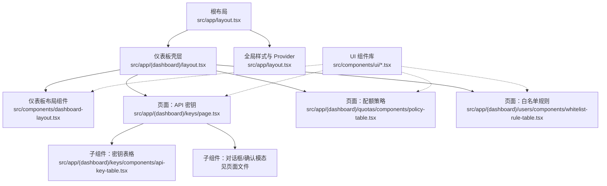
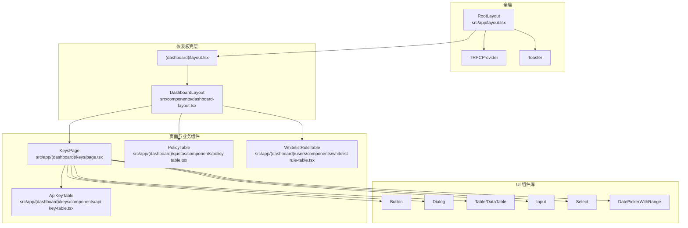
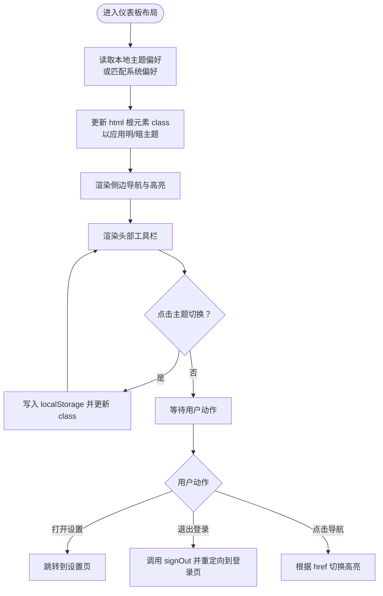
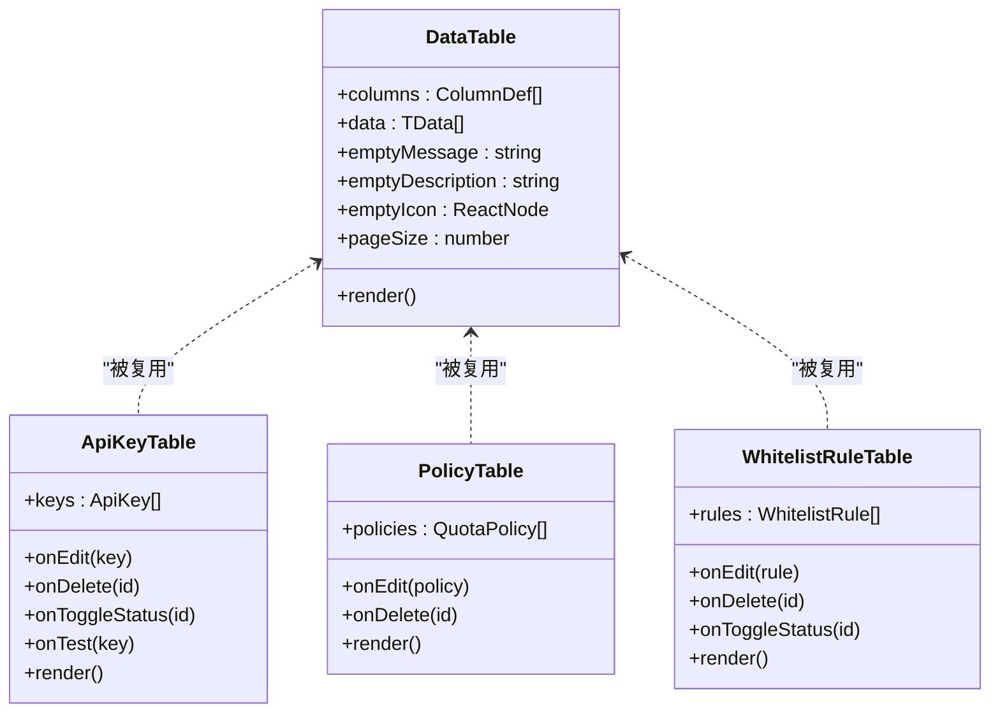
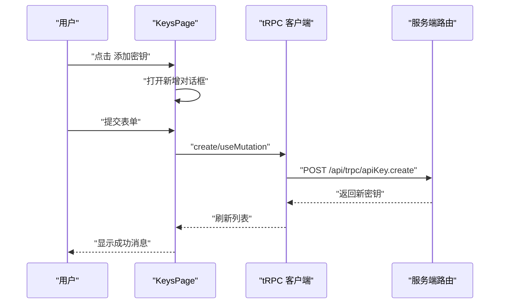
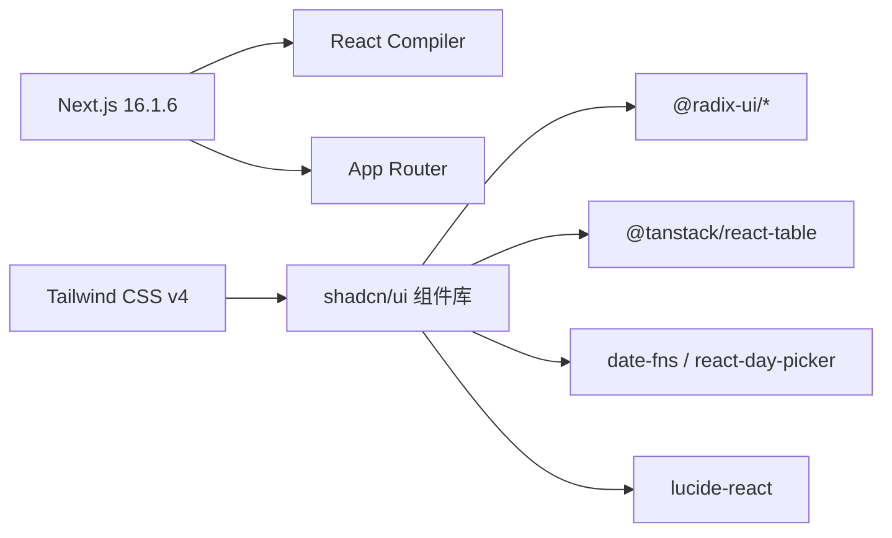

# 前端组件

<cite>
**本文引用的文件**
- [package.json](file://package.json)
- [next.config.ts](file://next.config.ts)
- [tailwind.config.js](file://tailwind.config.js)
- [components.json](file://components.json)
- [src/app/layout.tsx](file://src/app/layout.tsx)
- [src/components/dashboard-layout.tsx](file://src/components/dashboard-layout.tsx)
- [src/app/(dashboard)/layout.tsx](file://src/app/(dashboard)/layout.tsx)
- [src/components/ui/button.tsx](file://src/components/ui/button.tsx)
- [src/components/ui/dialog.tsx](file://src/components/ui/dialog.tsx)
- [src/components/ui/table.tsx](file://src/components/ui/table.tsx)
- [src/components/ui/data-table.tsx](file://src/components/ui/data-table.tsx)
- [src/components/date-picker-with-range.tsx](file://src/components/date-picker-with-range.tsx)
- [src/app/(dashboard)/keys/page.tsx](file://src/app/(dashboard)/keys/page.tsx)
- [src/app/(dashboard)/keys/components/api-key-table.tsx](file://src/app/(dashboard)/keys/components/api-key-table.tsx)
- [src/app/(dashboard)/quotas/components/policy-table.tsx](file://src/app/(dashboard)/quotas/components/policy-table.tsx)
- [src/app/(dashboard)/users/components/whitelist-rule-table.tsx](file://src/app/(dashboard)/users/components/whitelist-rule-table.tsx)
- [src/components/ui/input.tsx](file://src/components/ui/input.tsx)
- [src/components/ui/select.tsx](file://src/components/ui/select.tsx)
</cite>

## 目录
1. [简介](#简介)
2. [项目结构](#项目结构)
3. [核心组件](#核心组件)
4. [架构总览](#架构总览)
5. [组件详解](#组件详解)
6. [依赖关系分析](#依赖关系分析)
7. [性能与可访问性](#性能与可访问性)
8. [故障排查指南](#故障排查指南)
9. [结论](#结论)
10. [附录](#附录)

## 简介
本文件系统化梳理 AIGate 基于 Next.js 14 App Router 的前端组件体系，重点覆盖以下方面：
- 基于 shadcn/ui 的组件库使用与自定义配置
- 仪表板布局组件的设计与交互
- 表单输入与选择器组件的封装
- 数据表格组件与分页机制
- 页面级业务组件（API 密钥、配额策略、白名单规则）的组织方式
- 样式定制、响应式设计与主题切换最佳实践

## 项目结构
AIGate 采用 Next.js 14 App Router 的目录约定，页面按功能域组织在 `(dashboard)` 下，并通过共享布局组件统一注入全局 Provider 与通知组件。

图表来源
- [src/app/layout.tsx](file://src/app/layout.tsx#L1-L54)
- [src/app/(dashboard)/layout.tsx](file://src/app/(dashboard)/layout.tsx#L1-L19)
- [src/components/dashboard-layout.tsx](file://src/components/dashboard-layout.tsx#L1-L197)
- [src/app/(dashboard)/keys/page.tsx](file://src/app/(dashboard)/keys/page.tsx#L1-L194)
- [src/app/(dashboard)/keys/components/api-key-table.tsx](file://src/app/(dashboard)/keys/components/api-key-table.tsx#L1-L194)
- [src/app/(dashboard)/quotas/components/policy-table.tsx](file://src/app/(dashboard)/quotas/components/policy-table.tsx#L1-L167)
- [src/app/(dashboard)/users/components/whitelist-rule-table.tsx](file://src/app/(dashboard)/users/components/whitelist-rule-table.tsx#L1-L168)

章节来源
- [src/app/layout.tsx](file://src/app/layout.tsx#L1-L54)
- [src/app/(dashboard)/layout.tsx](file://src/app/(dashboard)/layout.tsx#L1-L19)

## 核心组件
本节聚焦于 UI 组件库与布局组件的关键实现要点，包括按钮、对话框、表格、数据表格、输入与选择器等。

- 按钮 Button
  - 支持多种变体与尺寸，内置液态玻璃（backdrop-blur）与阴影动画，适配明暗主题。
  - 参考路径：[src/components/ui/button.tsx](file://src/components/ui/button.tsx#L1-L77)

- 对话框 Dialog
  - 基于 Radix UI，提供 Overlay、Portal、Content、Header/Footer、Title/Description 等组合。
  - 内置液态玻璃背景与缩放/滑入动画，关闭按钮具备高对比度与悬停缩放。
  - 参考路径：[src/components/ui/dialog.tsx](file://src/components/ui/dialog.tsx#L1-L125)

- 表格 Table 与数据表格 DataTable
  - Table 封装容器与表头/体/脚样式；DataTable 基于 @tanstack/react-table 实现排序、过滤、分页与空态展示。
  - 支持自定义空态图标、消息与描述，分页页码生成算法考虑“省略号”策略。
  - 参考路径：
    - [src/components/ui/table.tsx](file://src/components/ui/table.tsx#L1-L115)
    - [src/components/ui/data-table.tsx](file://src/components/ui/data-table.tsx#L1-L191)

- 输入 Input 与选择 Select
  - Input 提供液态玻璃背景、边框与焦点/悬停过渡。
  - Select 基于 Radix UI，提供触发器、内容面板、滚动按钮、选项项与分隔符，统一动画与玻璃效果。
  - 参考路径：
    - [src/components/ui/input.tsx](file://src/components/ui/input.tsx#L1-L41)
    - [src/components/ui/select.tsx](file://src/components/ui/select.tsx#L1-L182)

- 日期范围选择器 DatePickerWithRange
  - 基于 react-day-picker 与 Popover，提供双月日历与本地化文案，支持清空与格式化输出。
  - 参考路径：[src/components/date-picker-with-range.tsx](file://src/components/date-picker-with-range.tsx#L1-L92)

章节来源
- [src/components/ui/button.tsx](file://src/components/ui/button.tsx#L1-L77)
- [src/components/ui/dialog.tsx](file://src/components/ui/dialog.tsx#L1-L125)
- [src/components/ui/table.tsx](file://src/components/ui/table.tsx#L1-L115)
- [src/components/ui/data-table.tsx](file://src/components/ui/data-table.tsx#L1-L191)
- [src/components/ui/input.tsx](file://src/components/ui/input.tsx#L1-L41)
- [src/components/ui/select.tsx](file://src/components/ui/select.tsx#L1-L182)
- [src/components/date-picker-with-range.tsx](file://src/components/date-picker-with-range.tsx#L1-L92)

## 架构总览
AIGate 前端采用“页面 + 共享布局 + UI 组件库”的分层架构。全局 Provider 注入 tRPC 与通知组件，仪表板壳层负责权限校验与导航，页面组件通过 tRPC 调用后端接口，UI 组件承担交互与视觉表现。

图表来源
- [src/app/layout.tsx](file://src/app/layout.tsx#L1-L54)
- [src/app/(dashboard)/layout.tsx](file://src/app/(dashboard)/layout.tsx#L1-L19)
- [src/components/dashboard-layout.tsx](file://src/components/dashboard-layout.tsx#L1-L197)
- [src/app/(dashboard)/keys/page.tsx](file://src/app/(dashboard)/keys/page.tsx#L1-L194)
- [src/app/(dashboard)/keys/components/api-key-table.tsx](file://src/app/(dashboard)/keys/components/api-key-table.tsx#L1-L194)
- [src/app/(dashboard)/quotas/components/policy-table.tsx](file://src/app/(dashboard)/quotas/components/policy-table.tsx#L1-L167)
- [src/app/(dashboard)/users/components/whitelist-rule-table.tsx](file://src/app/(dashboard)/users/components/whitelist-rule-table.tsx#L1-L168)
- [src/components/ui/button.tsx](file://src/components/ui/button.tsx#L1-L77)
- [src/components/ui/dialog.tsx](file://src/components/ui/dialog.tsx#L1-L125)
- [src/components/ui/table.tsx](file://src/components/ui/table.tsx#L1-L115)
- [src/components/ui/data-table.tsx](file://src/components/ui/data-table.tsx#L1-L191)
- [src/components/ui/input.tsx](file://src/components/ui/input.tsx#L1-L41)
- [src/components/ui/select.tsx](file://src/components/ui/select.tsx#L1-L182)
- [src/components/date-picker-with-range.tsx](file://src/components/date-picker-with-range.tsx#L1-L92)

## 组件详解

### 仪表板布局组件 DashboardLayout
- 功能概览
  - 侧边导航：包含仪表板、接口调试、配额管理、API 密钥、用户策略管理等入口，支持当前路由高亮与悬停放大动效。
  - 头部工具栏：主题切换（明/暗）、用户下拉菜单（设置、退出登录），支持本地存储持久化。
  - 响应式与视觉：使用液态玻璃背景、阴影与边框增强层次感，整体采用渐变背景与圆角卡片风格。
- 关键点
  - 主题切换通过监听与写入 localStorage 并更新 html 根元素 class 实现。
  - 使用 Popover 展示用户菜单，结合 next-auth 的 signOut 完成登出流程。
- 参考路径：[src/components/dashboard-layout.tsx](file://src/components/dashboard-layout.tsx#L1-L197)

图表来源
- [src/components/dashboard-layout.tsx](file://src/components/dashboard-layout.tsx#L56-L90)

章节来源
- [src/components/dashboard-layout.tsx](file://src/components/dashboard-layout.tsx#L1-L197)

### 数据表格组件 DataTable 与页面级表格
- DataTable
  - 基于 @tanstack/react-table，提供排序、过滤、分页与空态展示。
  - 自定义分页页码生成：当总页数超过阈值时插入省略号，保证可视区域友好。
  - 空态图标、消息与描述可由外部传入，提升可用性。
  - 参考路径：[src/components/ui/data-table.tsx](file://src/components/ui/data-table.tsx#L1-L191)
- API 密钥表格 ApiKeyTable
  - 列定义包含名称、服务商、API Key Id/Key、Base URL、创建时间、最后使用、状态与操作列。
  - 支持复制到剪贴板、测试（可选）、启用/禁用、编辑、删除等操作。
  - 参考路径：[src/app/(dashboard)/keys/components/api-key-table.tsx](file://src/app/(dashboard)/keys/components/api-key-table.tsx#L1-L194)
- 配额策略表格 PolicyTable
  - 列定义包含策略名称、描述、限制类型（Token/请求次数）、日/月限额、RPM 限制、创建时间与操作列。
  - 参考路径：[src/app/(dashboard)/quotas/components/policy-table.tsx](file://src/app/(dashboard)/quotas/components/policy-table.tsx#L1-L167)
- 白名单规则表格 WhitelistRuleTable
  - 列定义包含优先级、策略名称、描述、校验规则开关与表达式、状态、创建时间与操作列。
  - 支持按优先级降序排序，便于规则优先级展示。
  - 参考路径：[src/app/(dashboard)/users/components/whitelist-rule-table.tsx](file://src/app/(dashboard)/users/components/whitelist-rule-table.tsx#L1-L168)

图表来源
- [src/components/ui/data-table.tsx](file://src/components/ui/data-table.tsx#L27-L66)
- [src/app/(dashboard)/keys/components/api-key-table.tsx](file://src/app/(dashboard)/keys/components/api-key-table.tsx#L29-L174)
- [src/app/(dashboard)/quotas/components/policy-table.tsx](file://src/app/(dashboard)/quotas/components/policy-table.tsx#L32-L147)
- [src/app/(dashboard)/users/components/whitelist-rule-table.tsx](file://src/app/(dashboard)/users/components/whitelist-rule-table.tsx#L36-L147)

章节来源
- [src/components/ui/data-table.tsx](file://src/components/ui/data-table.tsx#L1-L191)
- [src/app/(dashboard)/keys/components/api-key-table.tsx](file://src/app/(dashboard)/keys/components/api-key-table.tsx#L1-L194)
- [src/app/(dashboard)/quotas/components/policy-table.tsx](file://src/app/(dashboard)/quotas/components/policy-table.tsx#L1-L167)
- [src/app/(dashboard)/users/components/whitelist-rule-table.tsx](file://src/app/(dashboard)/users/components/whitelist-rule-table.tsx#L1-L168)

### 表单与输入组件
- Input
  - 统一的液态玻璃外观、边框与焦点/悬停过渡，适用于大多数文本输入场景。
  - 参考路径：[src/components/ui/input.tsx](file://src/components/ui/input.tsx#L1-L41)
- Select
  - 触发器、内容面板、滚动按钮、选项项与分隔符完整封装，支持 popper 动画与玻璃背景。
  - 参考路径：[src/components/ui/select.tsx](file://src/components/ui/select.tsx#L1-L182)
- DatePickerWithRange
  - 基于 react-day-picker 的范围选择器，支持双月视图、本地化与格式化输出。
  - 参考路径：[src/components/date-picker-with-range.tsx](file://src/components/date-picker-with-range.tsx#L1-L92)

章节来源
- [src/components/ui/input.tsx](file://src/components/ui/input.tsx#L1-L41)
- [src/components/ui/select.tsx](file://src/components/ui/select.tsx#L1-L182)
- [src/components/date-picker-with-range.tsx](file://src/components/date-picker-with-range.tsx#L1-L92)

### 页面级业务组件
- KeysPage
  - 使用 tRPC 查询/增删改查 API 密钥，集成对话框、确认模态与消息提示（成功/错误）。
  - 支持新增、编辑、删除、启用/禁用与加载状态。
  - 参考路径：[src/app/(dashboard)/keys/page.tsx](file://src/app/(dashboard)/keys/page.tsx#L1-L194)

图表来源
- [src/app/(dashboard)/keys/page.tsx](file://src/app/(dashboard)/keys/page.tsx#L16-L105)

章节来源
- [src/app/(dashboard)/keys/page.tsx](file://src/app/(dashboard)/keys/page.tsx#L1-L194)

## 依赖关系分析
- 构建与运行时
  - Next.js 16.1.6，启用 React Compiler 与独立输出（standalone）。
  - 参考路径：[package.json](file://package.json#L1-L90)，[next.config.ts](file://next.config.ts#L1-L9)
- UI 与样式
  - Tailwind CSS v4，启用 tailwindcss-animate 插件；shadcn/ui 配置通过 components.json 管理。
  - 参考路径：[tailwind.config.js](file://tailwind.config.js#L1-L78)，[components.json](file://components.json#L1-L18)
- 组件生态
  - Radix UI（对话框、选择器、标签页等）
  - @tanstack/react-table（数据表格）
  - date-fns 与 react-day-picker（日期选择）
  - lucide-react（图标）
  - 参考路径：[package.json](file://package.json#L18-L67)

图表来源
- [package.json](file://package.json#L18-L67)
- [tailwind.config.js](file://tailwind.config.js#L1-L78)
- [components.json](file://components.json#L1-L18)

章节来源
- [package.json](file://package.json#L1-L90)
- [next.config.ts](file://next.config.ts#L1-L9)
- [tailwind.config.js](file://tailwind.config.js#L1-L78)
- [components.json](file://components.json#L1-L18)

## 性能与可访问性
- 性能
  - 启用 React Compiler 与独立构建，减少运行时开销。
  - UI 组件普遍采用液态玻璃与阴影，建议在低端设备上适度减少动画强度。
  - 数据表格使用虚拟化与分页，避免一次性渲染大量数据。
- 可访问性
  - 对话框与选择器均基于 Radix UI，具备键盘导航与无障碍语义。
  - 表单组件提供 focus-visible 与占位符对比度，确保键盘用户与低视力用户可用。
- 建议
  - 对高频交互（如分页、筛选）增加防抖与节流。
  - 图标与文本对比度保持在 AA/AAA 标准以上。

[本节为通用指导，不直接分析具体文件]

## 故障排查指南
- 登录态与权限
  - 仪表板壳层会检查服务端会话，未登录自动重定向至登录页。
  - 参考路径：[src/app/(dashboard)/layout.tsx](file://src/app/(dashboard)/layout.tsx#L10-L18)
- 主题切换无效
  - 检查 localStorage 中是否存在 theme 键，确认 html 根元素 class 是否正确更新。
  - 参考路径：[src/components/dashboard-layout.tsx](file://src/components/dashboard-layout.tsx#L64-L90)
- 表格无数据时显示异常
  - 确认 DataTable 的 emptyMessage/emptyDescription/emptyIcon 是否正确传入。
  - 参考路径：[src/components/ui/data-table.tsx](file://src/components/ui/data-table.tsx#L36-L43)
- 日期范围选择器不显示
  - 确认 Popover 内容是否正确挂载 Portal，以及日历组件的 locale 与月份参数。
  - 参考路径：[src/components/date-picker-with-range.tsx](file://src/components/date-picker-with-range.tsx#L70-L84)
- tRPC 请求失败
  - 查看浏览器网络面板与服务端日志，确认路由路径与鉴权头是否正确。
  - 参考路径：[src/app/(dashboard)/keys/page.tsx](file://src/app/(dashboard)/keys/page.tsx#L15-L19)

章节来源
- [src/app/(dashboard)/layout.tsx](file://src/app/(dashboard)/layout.tsx#L10-L18)
- [src/components/dashboard-layout.tsx](file://src/components/dashboard-layout.tsx#L64-L90)
- [src/components/ui/data-table.tsx](file://src/components/ui/data-table.tsx#L36-L43)
- [src/components/date-picker-with-range.tsx](file://src/components/date-picker-with-range.tsx#L70-L84)
- [src/app/(dashboard)/keys/page.tsx](file://src/app/(dashboard)/keys/page.tsx#L15-L19)

## 结论
AIGate 的前端组件体系以 Next.js 14 App Router 为基础，结合 shadcn/ui 与自定义 UI 组件，实现了统一的视觉语言与交互体验。通过仪表板布局组件、数据表格与表单组件的模块化设计，页面级业务组件得以高效复用与扩展。配合 tRPC 与主题切换、通知等基础设施，整体具备良好的可维护性与可扩展性。

[本节为总结性内容，不直接分析具体文件]

## 附录

### shadcn/ui 使用与自定义配置
- 配置文件 components.json
  - style: default
  - rsc: true
  - tsx: true
  - tailwind: config/css/baseColor/cssVariables/prefix
  - aliases: components/utils
  - 参考路径：[components.json](file://components.json#L1-L18)
- Tailwind 配置
  - darkMode: class
  - content 覆盖 app/components/src/pages
  - extend: colors、borderRadius、keyframes/animation
  - 插件: tailwindcss-animate
  - 参考路径：[tailwind.config.js](file://tailwind.config.js#L1-L78)

章节来源
- [components.json](file://components.json#L1-L18)
- [tailwind.config.js](file://tailwind.config.js#L1-L78)