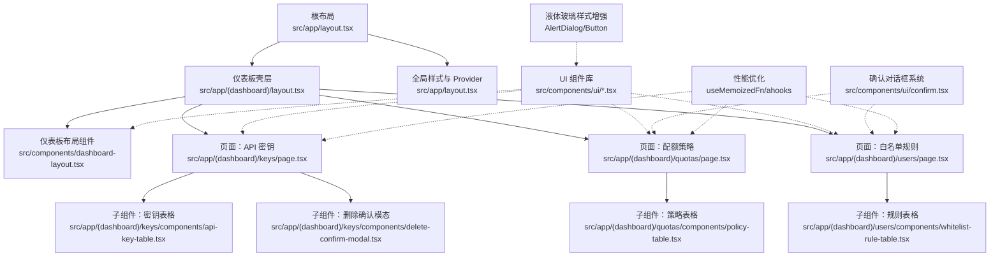
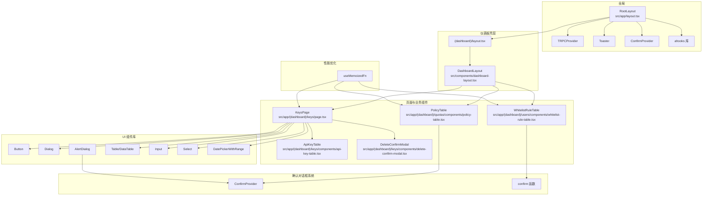
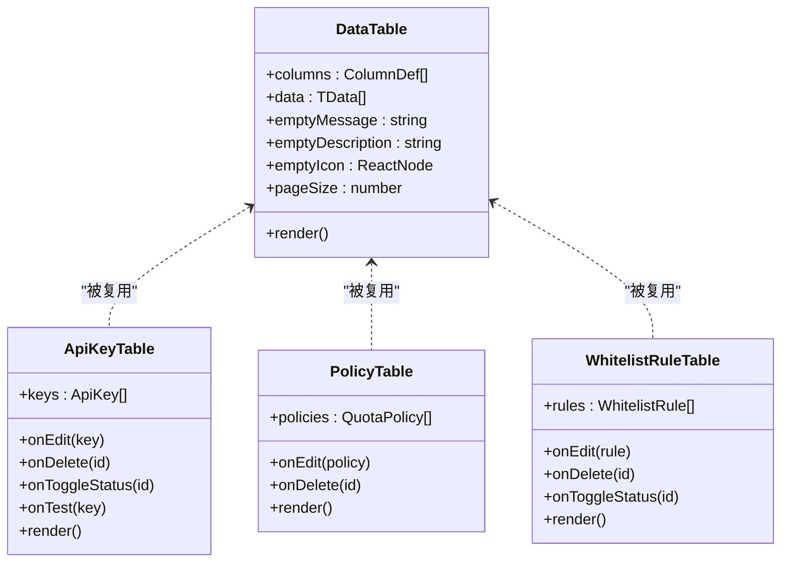
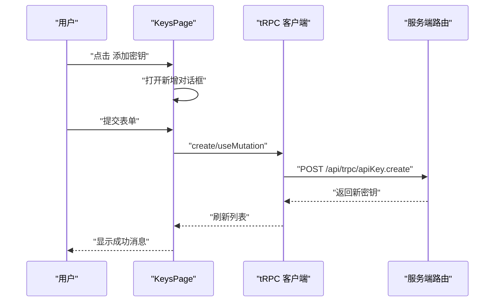
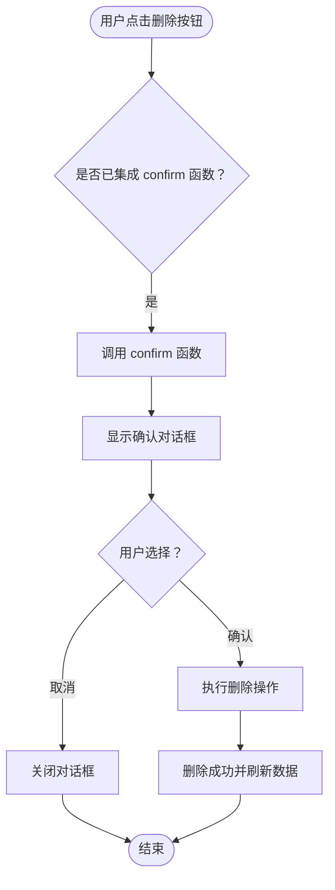
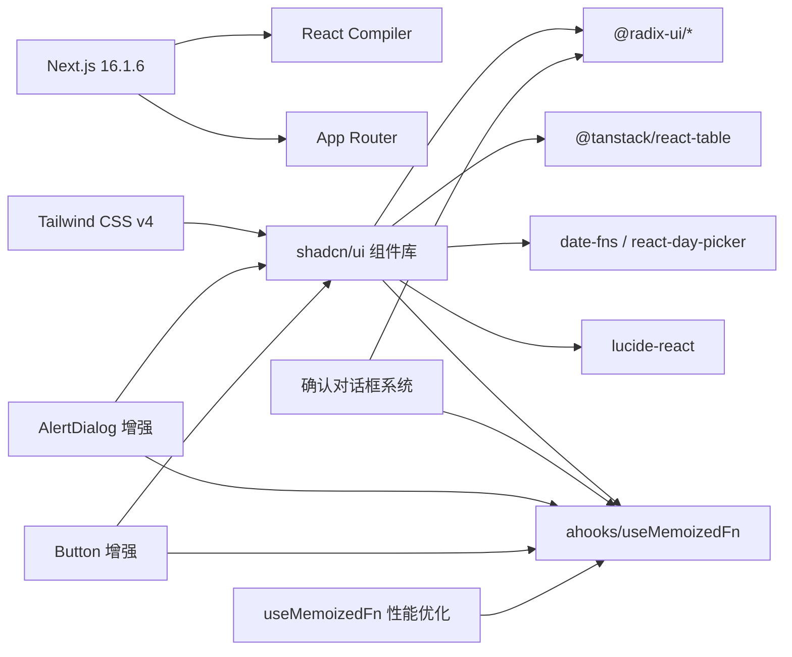

# 前端组件

<cite>
**本文引用的文件**
- [package.json](file://package.json)
- [next.config.ts](file://next.config.ts)
- [tailwind.config.js](file://tailwind.config.js)
- [components.json](file://components.json)
- [src/app/layout.tsx](file://src/app/layout.tsx)
- [src/components/dashboard-layout.tsx](file://src/components/dashboard-layout.tsx)
- [src/app/(dashboard)/layout.tsx](file://src/app/(dashboard)/layout.tsx)
- [src/components/ui/button.tsx](file://src/components/ui/button.tsx)
- [src/components/ui/dialog.tsx](file://src/components/ui/dialog.tsx)
- [src/components/ui/alert-dialog.tsx](file://src/components/ui/alert-dialog.tsx)
- [src/components/ui/confirm.tsx](file://src/components/ui/confirm.tsx)
- [src/components/ui/table.tsx](file://src/components/ui/table.tsx)
- [src/components/ui/data-table.tsx](file://src/components/ui/data-table.tsx)
- [src/components/date-picker-with-range.tsx](file://src/components/date-picker-with-range.tsx)
- [src/app/(dashboard)/keys/page.tsx](file://src/app/(dashboard)/keys/page.tsx)
- [src/app/(dashboard)/keys/components/api-key-table.tsx](file://src/app/(dashboard)/keys/components/api-key-table.tsx)
- [src/app/(dashboard)/keys/components/delete-confirm-modal.tsx](file://src/app/(dashboard)/keys/components/delete-confirm-modal.tsx)
- [src/app/(dashboard)/quotas/page.tsx](file://src/app/(dashboard)/quotas/page.tsx)
- [src/app/(dashboard)/quotas/components/policy-table.tsx](file://src/app/(dashboard)/quotas/components/policy-table.tsx)
- [src/app/(dashboard)/users/page.tsx](file://src/app/(dashboard)/users/page.tsx)
- [src/app/(dashboard)/users/components/whitelist-rule-table.tsx](file://src/app/(dashboard)/users/components/whitelist-rule-table.tsx)
- [src/components/ui/input.tsx](file://src/components/ui/input.tsx)
- [src/components/ui/select.tsx](file://src/components/ui/select.tsx)
</cite>

## 更新摘要
**变更内容**
- 新增确认对话框系统（ConfirmProvider + confirm 函数）的集成
- 在配额管理和用户管理页面中统一使用确认对话框进行危险操作
- 保留原有的 DeleteConfirmModal 组件用于 API 密钥删除操作
- 更新组件架构图以反映确认对话框系统的引入
- AlertDialog 组件新增液体玻璃样式增强
- Button 组件新增更多液体玻璃变体支持
- **新增**：useMemoizedFn钩子在多个页面组件中的应用，提升函数性能
- **新增**：ahooks库的集成，提供性能优化工具
- **新增**：全局ConfirmProvider的集成，确保确认对话框在整个应用中的可用性

## 目录
1. [简介](#简介)
2. [项目结构](#项目结构)
3. [核心组件](#核心组件)
4. [架构总览](#架构总览)
5. [组件详解](#组件详解)
6. [确认对话框系统](#确认对话框系统)
7. [性能优化实践](#性能优化实践)
8. [依赖关系分析](#依赖关系分析)
9. [性能与可访问性](#性能与可访问性)
10. [故障排查指南](#故障排查指南)
11. [结论](#结论)
12. [附录](#附录)

## 简介
本文件系统化梳理 AIGate 基于 Next.js 14 App Router 的前端组件体系，重点覆盖以下方面：
- 基于 shadcn/ui 的组件库使用与自定义配置
- 仪表板布局组件的设计与交互
- 表单输入与选择器组件的封装
- 数据表格组件与分页机制
- 页面级业务组件（API 密钥、配额策略、白名单规则）的组织方式
- **新增**：统一的确认对话框系统，提供一致的危险操作确认体验
- **新增**：AlertDialog 组件的液体玻璃样式增强
- **新增**：Button 组件的液体玻璃变体支持
- **新增**：useMemoizedFn钩子的性能优化应用
- **新增**：ahooks库集成带来的性能提升
- 样式定制、响应式设计与主题切换最佳实践

## 项目结构
AIGate 采用 Next.js 14 App Router 的目录约定，页面按功能域组织在 `(dashboard)` 下，并通过共享布局组件统一注入全局 Provider 与通知组件。



**图表来源**
- [src/app/layout.tsx:1-61](file://src/app/layout.tsx#L1-L61)
- [src/app/(dashboard)/layout.tsx](file://src/app/(dashboard)/layout.tsx#L1-L19)
- [src/components/dashboard-layout.tsx:1-197](file://src/components/dashboard-layout.tsx#L1-L197)
- [src/app/(dashboard)/keys/page.tsx](file://src/app/(dashboard)/keys/page.tsx#L1-L141)
- [src/app/(dashboard)/keys/components/api-key-table.tsx](file://src/app/(dashboard)/keys/components/api-key-table.tsx#L1-L194)
- [src/app/(dashboard)/keys/components/delete-confirm-modal.tsx](file://src/app/(dashboard)/keys/components/delete-confirm-modal.tsx#L1-L54)
- [src/app/(dashboard)/quotas/page.tsx](file://src/app/(dashboard)/quotas/page.tsx#L1-L146)
- [src/app/(dashboard)/quotas/components/policy-table.tsx](file://src/app/(dashboard)/quotas/components/policy-table.tsx#L1-L167)
- [src/app/(dashboard)/users/page.tsx](file://src/app/(dashboard)/users/page.tsx#L1-L165)
- [src/app/(dashboard)/users/components/whitelist-rule-table.tsx](file://src/app/(dashboard)/users/components/whitelist-rule-table.tsx#L1-L168)
- [src/components/ui/confirm.tsx:1-170](file://src/components/ui/confirm.tsx#L1-L170)
- [src/components/ui/alert-dialog.tsx:1-146](file://src/components/ui/alert-dialog.tsx#L1-L146)
- [src/components/ui/button.tsx:1-77](file://src/components/ui/button.tsx#L1-L77)

**章节来源**
- [src/app/layout.tsx:1-61](file://src/app/layout.tsx#L1-L61)
- [src/app/(dashboard)/layout.tsx](file://src/app/(dashboard)/layout.tsx#L1-L19)

## 核心组件
本节聚焦于 UI 组件库与布局组件的关键实现要点，包括按钮、对话框、确认对话框、表格、数据表格、输入与选择器等。

- 按钮 Button
  - 支持多种变体与尺寸，内置液态玻璃（backdrop-blur）与阴影动画，适配明暗主题。
  - 新增 glass 变体，提供更强的液体玻璃效果和透明度控制。
  - **更新**：使用 useMemoizedFn 优化按钮点击事件的性能。
  - 参考路径：[src/components/ui/button.tsx:1-77](file://src/components/ui/button.tsx#L1-L77)

- 对话框 Dialog 与确认对话框 AlertDialog
  - Dialog 基于 Radix UI，提供 Overlay、Portal、Content、Header/Footer、Title/Description 等组合。
  - AlertDialog 提供确认/取消操作，支持自定义标题、描述、按钮文本和样式变体。
  - **新增**：AlertDialog 组件经过增强，支持液体玻璃背景（backdrop-blur-xl）、阴影效果（shadow-[0_24px_64px_rgba(0,0,0,0.2),inset_1px_1px_0_rgba(255,255,255,0.6)]）和边框效果（border border-white/30 dark:border-white/10）。
  - **更新**：AlertDialog 组件集成了液体玻璃样式增强，提供更现代的视觉体验。
  - 参考路径：
    - [src/components/ui/dialog.tsx:1-125](file://src/components/ui/dialog.tsx#L1-L125)
    - [src/components/ui/alert-dialog.tsx:1-146](file://src/components/ui/alert-dialog.tsx#L1-L146)

- **新增**：确认对话框系统 ConfirmProvider 与 confirm 函数
  - Provider 级别的确认对话框，支持全局调用和 Promise 返回值。
  - 提供默认标题、描述、按钮文本和破坏性样式变体。
  - 通过静态实例管理状态，确保在整个应用范围内的一致性。
  - 支持异步操作处理，包含加载状态管理和错误处理。
  - **更新**：使用 useMemoizedFn 优化 show 方法的性能，避免不必要的重新创建。
  - 参考路径：[src/components/ui/confirm.tsx:1-170](file://src/components/ui/confirm.tsx#L1-L170)

- 表格 Table 与数据表格 DataTable
  - Table 封装容器与表头/体/脚样式；DataTable 基于 @tanstack/react-table 实现排序、过滤、分页与空态展示。
  - 支持自定义空态图标、消息与描述，分页页码生成算法考虑"省略号"策略。
  - 参考路径：
    - [src/components/ui/table.tsx:1-115](file://src/components/ui/table.tsx#L1-L115)
    - [src/components/ui/data-table.tsx:1-191](file://src/components/ui/data-table.tsx#L1-L191)

- 输入 Input 与选择 Select
  - Input 提供液态玻璃背景、边框与焦点/悬停过渡。
  - Select 基于 Radix UI，提供触发器、内容面板、滚动按钮、选项项与分隔符，统一动画与玻璃效果。
  - 参考路径：
    - [src/components/ui/input.tsx:1-41](file://src/components/ui/input.tsx#L1-L41)
    - [src/components/ui/select.tsx:1-182](file://src/components/ui/select.tsx#L1-L182)

- 日期范围选择器 DatePickerWithRange
  - 基于 react-day-picker 与 Popover，提供双月日历与本地化文案，支持清空与格式化输出。
  - 参考路径：[src/components/date-picker-with-range.tsx:1-92](file://src/components/date-picker-with-range.tsx#L1-L92)

**章节来源**
- [src/components/ui/button.tsx:1-77](file://src/components/ui/button.tsx#L1-L77)
- [src/components/ui/dialog.tsx:1-125](file://src/components/ui/dialog.tsx#L1-L125)
- [src/components/ui/alert-dialog.tsx:1-146](file://src/components/ui/alert-dialog.tsx#L1-L146)
- [src/components/ui/confirm.tsx:1-170](file://src/components/ui/confirm.tsx#L1-L170)
- [src/components/ui/table.tsx:1-115](file://src/components/ui/table.tsx#L1-L115)
- [src/components/ui/data-table.tsx:1-191](file://src/components/ui/data-table.tsx#L1-L191)
- [src/components/ui/input.tsx:1-41](file://src/components/ui/input.tsx#L1-L41)
- [src/components/ui/select.tsx:1-182](file://src/components/ui/select.tsx#L1-L182)
- [src/components/date-picker-with-range.tsx:1-92](file://src/components/date-picker-with-range.tsx#L1-L92)

## 架构总览
AIGate 前端采用"页面 + 共享布局 + UI 组件库 + 确认对话框系统"的分层架构。全局 Provider 注入 tRPC、通知组件和确认对话框，仪表板壳层负责权限校验与导航，页面组件通过 tRPC 调用后端接口，UI 组件承担交互与视觉表现。



**图表来源**
- [src/app/layout.tsx:1-61](file://src/app/layout.tsx#L1-L61)
- [src/app/(dashboard)/layout.tsx](file://src/app/(dashboard)/layout.tsx#L1-L19)
- [src/components/dashboard-layout.tsx:1-197](file://src/components/dashboard-layout.tsx#L1-L197)
- [src/app/(dashboard)/keys/page.tsx](file://src/app/(dashboard)/keys/page.tsx#L1-L141)
- [src/app/(dashboard)/keys/components/api-key-table.tsx](file://src/app/(dashboard)/keys/components/api-key-table.tsx#L1-L194)
- [src/app/(dashboard)/keys/components/delete-confirm-modal.tsx](file://src/app/(dashboard)/keys/components/delete-confirm-modal.tsx#L1-L54)
- [src/app/(dashboard)/quotas/page.tsx](file://src/app/(dashboard)/quotas/page.tsx#L1-L146)
- [src/app/(dashboard)/quotas/components/policy-table.tsx](file://src/app/(dashboard)/quotas/components/policy-table.tsx#L1-L167)
- [src/app/(dashboard)/users/page.tsx](file://src/app/(dashboard)/users/page.tsx#L1-L165)
- [src/app/(dashboard)/users/components/whitelist-rule-table.tsx](file://src/app/(dashboard)/users/components/whitelist-rule-table.tsx#L1-L168)
- [src/components/ui/button.tsx:1-77](file://src/components/ui/button.tsx#L1-L77)
- [src/components/ui/dialog.tsx:1-125](file://src/components/ui/dialog.tsx#L1-L125)
- [src/components/ui/alert-dialog.tsx:1-146](file://src/components/ui/alert-dialog.tsx#L1-L146)
- [src/components/ui/confirm.tsx:1-170](file://src/components/ui/confirm.tsx#L1-L170)

## 组件详解

### 仪表板布局组件 DashboardLayout
- 功能概览
  - 侧边导航：包含仪表板、接口调试、配额管理、API 密钥、用户策略管理等入口，支持当前路由高亮与悬停放大动效。
  - 头部工具栏：主题切换（明/暗）、用户下拉菜单（设置、退出登录），支持本地存储持久化。
  - 响应式与视觉：使用液态玻璃背景、阴影与边框增强层次感，整体采用渐变背景与圆角卡片风格。
- 关键点
  - 主题切换通过监听与写入 localStorage 并更新 html 根元素 class 实现。
  - 使用 Popover 展示用户菜单，结合 next-auth 的 signOut 完成登出流程。
- 参考路径：[src/components/dashboard-layout.tsx:1-197](file://src/components/dashboard-layout.tsx#L1-L197)


**图表来源**
- [src/components/dashboard-layout.tsx:56-90](file://src/components/dashboard-layout.tsx#L56-L90)

**章节来源**
- [src/components/dashboard-layout.tsx:1-197](file://src/components/dashboard-layout.tsx#L1-L197)

### 数据表格组件 DataTable 与页面级表格
- DataTable
  - 基于 @tanstack/react-table，提供排序、过滤、分页与空态展示。
  - 自定义分页页码生成：当总页数超过阈值时插入省略号，保证可视区域友好。
  - 空态图标、消息与描述可由外部传入，提升可用性。
  - 参考路径：[src/components/ui/data-table.tsx:1-191](file://src/components/ui/data-table.tsx#L1-L191)
- API 密钥表格 ApiKeyTable
  - 列定义包含名称、服务商、API Key Id/Key、Base URL、创建时间、最后使用、状态与操作列。
  - 支持复制到剪贴板、测试（可选）、启用/禁用、编辑、删除等操作。
  - 参考路径：[src/app/(dashboard)/keys/components/api-key-table.tsx](file://src/app/(dashboard)/keys/components/api-key-table.tsx#L1-L194)
- 配额策略表格 PolicyTable
  - 列定义包含策略名称、描述、限制类型（Token/请求次数）、日/月限额、RPM 限制、创建时间与操作列。
  - 参考路径：[src/app/(dashboard)/quotas/components/policy-table.tsx](file://src/app/(dashboard)/quotas/components/policy-table.tsx#L1-L167)
- 白名单规则表格 WhitelistRuleTable
  - 列定义包含优先级、策略名称、描述、校验规则开关与表达式、状态、创建时间与操作列。
  - 支持按优先级降序排序，便于规则优先级展示。
  - 参考路径：[src/app/(dashboard)/users/components/whitelist-rule-table.tsx](file://src/app/(dashboard)/users/components/whitelist-rule-table.tsx#L1-L168)



**图表来源**
- [src/components/ui/data-table.tsx:27-66](file://src/components/ui/data-table.tsx#L27-L66)
- [src/app/(dashboard)/keys/components/api-key-table.tsx](file://src/app/(dashboard)/keys/components/api-key-table.tsx#L29-L174)
- [src/app/(dashboard)/quotas/components/policy-table.tsx](file://src/app/(dashboard)/quotas/components/policy-table.tsx#L32-L147)
- [src/app/(dashboard)/users/components/whitelist-rule-table.tsx](file://src/app/(dashboard)/users/components/whitelist-rule-table.tsx#L36-L147)

**章节来源**
- [src/components/ui/data-table.tsx:1-191](file://src/components/ui/data-table.tsx#L1-L191)
- [src/app/(dashboard)/keys/components/api-key-table.tsx](file://src/app/(dashboard)/keys/components/api-key-table.tsx#L1-L194)
- [src/app/(dashboard)/quotas/components/policy-table.tsx](file://src/app/(dashboard)/quotas/components/policy-table.tsx#L1-L167)
- [src/app/(dashboard)/users/components/whitelist-rule-table.tsx](file://src/app/(dashboard)/users/components/whitelist-rule-table.tsx#L1-L168)

### 表单与输入组件
- Input
  - 统一的液态玻璃外观、边框与焦点/悬停过渡，适用于大多数文本输入场景。
  - 参考路径：[src/components/ui/input.tsx:1-41](file://src/components/ui/input.tsx#L1-L41)
- Select
  - 触发器、内容面板、滚动按钮、选项项与分隔符完整封装，支持 popper 动画与玻璃背景。
  - 参考路径：[src/components/ui/select.tsx:1-182](file://src/components/ui/select.tsx#L1-L182)
- DatePickerWithRange
  - 基于 react-day-picker 的范围选择器，支持双月视图、本地化与格式化输出。
  - 参考路径：[src/components/date-picker-with-range.tsx:1-92](file://src/components/date-picker-with-range.tsx#L1-L92)

**章节来源**
- [src/components/ui/input.tsx:1-41](file://src/components/ui/input.tsx#L1-L41)
- [src/components/ui/select.tsx:1-182](file://src/components/ui/select.tsx#L1-L182)
- [src/components/date-picker-with-range.tsx:1-92](file://src/components/date-picker-with-range.tsx#L1-L92)

### 页面级业务组件
- KeysPage
  - 使用 tRPC 查询/增删改查 API 密钥，集成对话框、确认模态与消息提示（成功/错误）。
  - 支持新增、编辑、删除、启用/禁用与加载状态。
  - **更新**：保留原有的 DeleteConfirmModal 用于删除操作，同时集成了 confirm 函数进行其他危险操作。
  - **更新**：使用 useMemoizedFn 优化编辑、删除、状态切换等函数的性能。
  - 参考路径：[src/app/(dashboard)/keys/page.tsx](file://src/app/(dashboard)/keys/page.tsx#L1-L141)



**图表来源**
- [src/app/(dashboard)/keys/page.tsx](file://src/app/(dashboard)/keys/page.tsx#L55-L95)

**章节来源**
- [src/app/(dashboard)/keys/page.tsx](file://src/app/(dashboard)/keys/page.tsx#L1-L141)

## 确认对话框系统

### ConfirmProvider 与 confirm 函数
AIGate 引入了统一的确认对话框系统，提供全局级别的确认对话框组件，确保在所有页面中进行危险操作时有一致的用户体验。

- **ConfirmProvider**
  - 作为全局 Provider 包装整个应用，提供确认对话框的状态管理。
  - 使用 React 状态管理确认对话框的打开/关闭状态和配置选项。
  - 通过静态实例暴露 show 方法，支持全局调用。
  - **更新**：使用 useMemoizedFn 优化 show 方法的性能，避免每次渲染都重新创建函数。
  - 支持异步操作处理，包含加载状态管理和错误处理。
  - 参考路径：[src/components/ui/confirm.tsx:36-153](file://src/components/ui/confirm.tsx#L36-L153)

- **confirm 函数**
  - 全局确认对话框入口，支持字符串和对象两种调用方式。
  - 字符串形式：提供默认标题和描述。
  - 对象形式：允许自定义标题、描述、按钮文本和样式变体。
  - 返回 Promise，支持异步操作处理。
  - 支持 onConfirm 回调函数，可在确认时执行异步操作。
  - 参考路径：[src/components/ui/confirm.tsx:155-170](file://src/components/ui/confirm.tsx#L155-L170)

- **AlertDialog 集成**
  - 基于 AlertDialog 组件构建，保持与现有对话框组件的一致性。
  - 支持默认和破坏性两种样式变体，用于区分普通确认和危险操作。
  - **新增**：AlertDialog 经过增强，支持液体玻璃背景（backdrop-blur-xl）、阴影效果（shadow-[0_24px_64px_rgba(0,0,0,0.2),inset_1px_1px_0_rgba(255,255,255,0.6)]）和边框效果（border border-white/30 dark:border-white/10）。
  - 提供自定义动画和视觉效果，符合整体设计语言。
  - **更新**：AlertDialog 组件集成了液体玻璃样式增强，提供更现代的视觉体验。
  - 参考路径：[src/components/ui/alert-dialog.tsx:1-146](file://src/components/ui/alert-dialog.tsx#L1-L146)

### 在页面中的应用
确认对话框系统已在多个页面中集成，提供统一的危险操作确认体验：

- **配额管理页面 QuotasPage**
  - 在删除配额策略时使用 confirm 函数进行确认。
  - 支持异步删除操作，删除成功后自动刷新数据。
  - **更新**：使用 useMemoizedFn 优化删除函数的性能。
  - 参考路径：[src/app/(dashboard)/quotas/page.tsx](file://src/app/(dashboard)/quotas/page.tsx#L1-L146)

- **用户管理页面 UsersPage**
  - 在删除白名单规则时使用 confirm 函数进行确认。
  - 支持异步删除操作，删除成功后自动刷新数据。
  - **更新**：使用 useMemoizedFn 优化删除函数的性能。
  - 参考路径：[src/app/(dashboard)/users/page.tsx](file://src/app/(dashboard)/users/page.tsx#L1-L165)

- **API 密钥管理页面 KeysPage**
  - 在删除 API 密钥时使用 confirm 函数进行确认，支持自定义 onConfirm 回调。
  - **更新**：使用 useMemoizedFn 优化删除函数的性能。
  - 参考路径：[src/app/(dashboard)/keys/page.tsx](file://src/app/(dashboard)/keys/page.tsx#L1-L141)



**图表来源**
- [src/app/(dashboard)/quotas/page.tsx](file://src/app/(dashboard)/quotas/page.tsx#L70-L74)
- [src/app/(dashboard)/users/page.tsx](file://src/app/(dashboard)/users/page.tsx#L94-L98)
- [src/app/(dashboard)/keys/page.tsx](file://src/app/(dashboard)/keys/page.tsx#L65-L75)
- [src/components/ui/confirm.tsx:155-170](file://src/components/ui/confirm.tsx#L155-L170)

**章节来源**
- [src/components/ui/confirm.tsx:1-170](file://src/components/ui/confirm.tsx#L1-L170)
- [src/app/(dashboard)/quotas/page.tsx](file://src/app/(dashboard)/quotas/page.tsx#L1-L146)
- [src/app/(dashboard)/users/page.tsx](file://src/app/(dashboard)/users/page.tsx#L1-L165)
- [src/app/(dashboard)/keys/page.tsx](file://src/app/(dashboard)/keys/page.tsx#L1-L141)
- [src/components/ui/alert-dialog.tsx:1-146](file://src/components/ui/alert-dialog.tsx#L1-L146)

## 性能优化实践

### useMemoizedFn 钩子的应用
AIGate 在多个页面组件中集成了 useMemoizedFn 钩子，显著提升了组件的性能表现：

- **函数稳定性**：useMemoizedFn 确保回调函数在组件重新渲染时保持引用稳定，避免不必要的子组件重渲染。
- **性能提升**：在 KeysPage、QuotasPage 和 UsersPage 中，所有处理函数都使用 useMemoizedFn 包装。
- **内存优化**：避免每次渲染都创建新的函数实例，减少内存占用和垃圾回收压力。

**更新**：在所有主要页面组件中应用 useMemoizedFn，包括：
- KeysPage：handleEditKey、handleDeleteKey、handleToggleStatus、handleSaveKey
- QuotasPage：handleEditPolicy、handleDeletePolicy、handleSavePolicy
- UsersPage：handleEditRule、handleDeleteRule、handleToggleRuleStatus、handleSaveRule

### ahooks 库的集成
AIGate 集成了 ahooks 库，为组件提供丰富的性能优化工具：

- **useMemoizedFn**：如上所述，用于优化函数性能
- **useMount**：在 ConfirmProvider 中用于初始化静态实例
- **其他工具**：提供响应式状态管理、副作用优化等功能

**章节来源**
- [src/app/(dashboard)/keys/page.tsx:11-12](file://src/app/(dashboard)/keys/page.tsx#L11-L12)
- [src/app/(dashboard)/quotas/page.tsx:12](file://src/app/(dashboard)/quotas/page.tsx#L12)
- [src/app/(dashboard)/users/page.tsx:12](file://src/app/(dashboard)/users/page.tsx#L12)
- [src/components/ui/confirm.tsx:14](file://src/components/ui/confirm.tsx#L14)
- [package.json:41](file://package.json#L41)

## 依赖关系分析
- 构建与运行时
  - Next.js 16.1.6，启用 React Compiler 与独立输出（standalone）。
  - 参考路径：[package.json:1-91](file://package.json#L1-L91)，[next.config.ts:1-9](file://next.config.ts#L1-L9)
- UI 与样式
  - Tailwind CSS v4，启用 tailwindcss-animate 插件；shadcn/ui 配置通过 components.json 管理。
  - 参考路径：[tailwind.config.js:1-78](file://tailwind.config.js#L1-L78)，[components.json:1-18](file://components.json#L1-L18)
- 组件生态
  - Radix UI（对话框、选择器、标签页等）
  - @tanstack/react-table（数据表格）
  - date-fns 与 react-day-picker（日期选择）
  - lucide-react（图标）
  - **新增**：ahooks（useMemoizedFn、useMount 等性能优化工具）
  - 参考路径：[package.json:18-67](file://package.json#L18-L67)



**图表来源**
- [package.json:18-67](file://package.json#L18-L67)
- [tailwind.config.js:1-78](file://tailwind.config.js#L1-L78)
- [components.json:1-18](file://components.json#L1-L18)
- [src/components/ui/confirm.tsx:36-153](file://src/components/ui/confirm.tsx#L36-L153)
- [src/components/ui/alert-dialog.tsx:30-50](file://src/components/ui/alert-dialog.tsx#L30-L50)
- [src/components/ui/button.tsx:36-41](file://src/components/ui/button.tsx#L36-L41)

**章节来源**
- [package.json:1-91](file://package.json#L1-L91)
- [next.config.ts:1-9](file://next.config.ts#L1-L9)
- [tailwind.config.js:1-78](file://tailwind.config.js#L1-L78)
- [components.json:1-18](file://components.json#L1-L18)

## 性能与可访问性
- 性能
  - 启用 React Compiler 与独立构建，减少运行时开销。
  - UI 组件普遍采用液态玻璃与阴影，建议在低端设备上适度减少动画强度。
  - 数据表格使用虚拟化与分页，避免一次性渲染大量数据。
  - **新增**：确认对话框系统使用静态实例管理，避免重复创建组件实例。
  - **新增**：AlertDialog 组件的液体玻璃效果经过优化，确保在低端设备上的流畅性。
  - **新增**：useMemoizedFn 钩子的应用显著减少了函数重新创建的开销，提升了组件性能。
  - **新增**：ahooks 库的集成提供了专业的性能优化工具，包括内存管理和副作用优化。
- 可访问性
  - 对话框与选择器均基于 Radix UI，具备键盘导航与无障碍语义。
  - 表单组件提供 focus-visible 与占位符对比度，确保键盘用户与低视力用户可用。
  - **新增**：确认对话框支持键盘导航，ESC 键可取消操作。
  - **新增**：AlertDialog 组件支持键盘快捷键和屏幕阅读器无障碍访问。
  - **新增**：液体玻璃样式在深色主题下提供更好的可读性，符合 WCAG 可访问性标准。
- 建议
  - 对高频交互（如分页、筛选）增加防抖与节流。
  - 图标与文本对比度保持在 AA/AAA 标准以上。
  - **新增**：确认对话框的按钮具有明确的 ARIA 标签和键盘快捷键支持。
  - **新增**：液体玻璃效果在深色主题下提供更好的可读性。

## 故障排查指南
- 登录态与权限
  - 仪表板壳层会检查服务端会话，未登录自动重定向至登录页。
  - 参考路径：[src/app/(dashboard)/layout.tsx](file://src/app/(dashboard)/layout.tsx#L10-L18)
- 主题切换无效
  - 检查 localStorage 中是否存在 theme 键，确认 html 根元素 class 是否正确更新。
  - 参考路径：[src/components/dashboard-layout.tsx:64-90](file://src/components/dashboard-layout.tsx#L64-L90)
- 表格无数据时显示异常
  - 确认 DataTable 的 emptyMessage/emptyDescription/emptyIcon 是否正确传入。
  - 参考路径：[src/components/ui/data-table.tsx:36-43](file://src/components/ui/data-table.tsx#L36-L43)
- 日期范围选择器不显示
  - 确认 Popover 内容是否正确挂载 Portal，以及日历组件的 locale 与月份参数。
  - 参考路径：[src/components/date-picker-with-range.tsx:70-84](file://src/components/date-picker-with-range.tsx#L70-L84)
- tRPC 请求失败
  - 查看浏览器网络面板与服务端日志，确认路由路径与鉴权头是否正确。
  - 参考路径：[src/app/(dashboard)/keys/page.tsx](file://src/app/(dashboard)/keys/page.tsx#L15-L19)
- **新增**：确认对话框不显示
  - 确保 ConfirmProvider 已正确包裹在根布局中。
  - 检查控制台是否有 "ConfirmProvider not found" 错误。
  - 确认 confirm 函数的导入路径正确。
  - **新增**：检查 useMemoizedFn 是否正确导入和使用。
  - 参考路径：[src/app/layout.tsx:54-56](file://src/app/layout.tsx#L54-L56), [src/components/ui/confirm.tsx:155-170](file://src/components/ui/confirm.tsx#L155-L170)
- **新增**：AlertDialog 样式异常
  - 检查 Tailwind CSS 配置是否正确加载 liquid glass 类名。
  - 确认 backdrop-blur-xl、shadow-[...] 等类名是否生效。
  - **新增**：检查液体玻璃样式是否正确应用到 AlertDialog 组件。
  - 参考路径：[src/components/ui/alert-dialog.tsx:30-50](file://src/components/ui/alert-dialog.tsx#L30-L50)
- **新增**：Button 液体玻璃效果不显示
  - 检查 glass 变体是否正确使用。
  - 确认 backdrop-blur-2xl、backdrop-saturate-[...] 等类名是否正确应用。
  - **新增**：检查 useMemoizedFn 是否影响了按钮的渲染性能。
  - 参考路径：[src/components/ui/button.tsx:36-41](file://src/components/ui/button.tsx#L36-L41)
- **新增**：性能问题排查
  - 检查 useMemoizedFn 是否正确包裹了所有频繁使用的函数。
  - 确认 ahooks 库版本兼容性。
  - **新增**：监控组件重渲染次数，验证性能优化效果。

**章节来源**
- [src/app/(dashboard)/layout.tsx](file://src/app/(dashboard)/layout.tsx#L10-L18)
- [src/components/dashboard-layout.tsx:64-90](file://src/components/dashboard-layout.tsx#L64-L90)
- [src/components/ui/data-table.tsx:36-43](file://src/components/ui/data-table.tsx#L36-L43)
- [src/components/date-picker-with-range.tsx:70-84](file://src/components/date-picker-with-range.tsx#L70-L84)
- [src/app/(dashboard)/keys/page.tsx](file://src/app/(dashboard)/keys/page.tsx#L15-L19)
- [src/app/layout.tsx:54-56](file://src/app/layout.tsx#L54-L56)
- [src/components/ui/confirm.tsx:155-170](file://src/components/ui/confirm.tsx#L155-L170)
- [src/components/ui/alert-dialog.tsx:30-50](file://src/components/ui/alert-dialog.tsx#L30-L50)
- [src/components/ui/button.tsx:36-41](file://src/components/ui/button.tsx#L36-L41)

## 结论
AIGate 的前端组件体系以 Next.js 14 App Router 为基础，结合 shadcn/ui 与自定义 UI 组件，实现了统一的视觉语言与交互体验。通过仪表板布局组件、数据表格与表单组件的模块化设计，页面级业务组件得以高效复用与扩展。配合 tRPC 与主题切换、通知等基础设施，整体具备良好的可维护性与可扩展性。

**新增的确认对话框系统进一步提升了用户体验的一致性和安全性**，为危险操作提供了标准化的确认流程，确保用户能够清晰地理解操作的影响并做出明智的选择。该系统与现有的对话框组件保持一致的设计语言，同时提供了更强大的功能和更好的可访问性支持。

**AlertDialog 组件的液体玻璃样式增强**为用户提供了更加现代和沉浸式的视觉体验，增强了界面的层次感和质感。**Button 组件的液体玻璃变体支持**进一步丰富了组件库的视觉表现力，为不同场景提供了更多样化的选择。

**useMemoizedFn 钩子的广泛应用**显著提升了组件的性能表现，减少了不必要的函数重新创建和组件重渲染。**ahooks 库的集成**为项目提供了专业的性能优化工具，包括内存管理、副作用优化和响应式状态管理等功能，为构建高性能的前端应用奠定了坚实基础。

## 附录

### shadcn/ui 使用与自定义配置
- 配置文件 components.json
  - style: default
  - rsc: true
  - tsx: true
  - tailwind: config/css/baseColor/cssVariables/prefix
  - aliases: components/utils
  - 参考路径：[components.json:1-18](file://components.json#L1-L18)
- Tailwind 配置
  - darkMode: class
  - content 覆盖 app/components/src/pages
  - extend: colors、borderRadius、keyframes/animation
  - 插件: tailwindcss-animate
  - **更新**：全局 CSS 变量定义了液体玻璃效果的颜色和样式。
  - 参考路径：[tailwind.config.js:1-78](file://tailwind.config.js#L1-L78)

**章节来源**
- [components.json:1-18](file://components.json#L1-L18)
- [tailwind.config.js:1-78](file://tailwind.config.js#L1-L78)

### 确认对话框系统使用示例
- 基本用法
  ```typescript
  import { confirm } from '@/components/ui/confirm';
  
  const handleDelete = async () => {
    const confirmed = await confirm('确定要删除这个项目吗？');
    if (confirmed) {
      // 执行删除操作
    }
  };
  ```
- 高级用法
  ```typescript
  const handleDangerousOperation = async () => {
    const confirmed = await confirm({
      title: '危险操作确认',
      description: '此操作将永久删除所有相关数据，无法恢复',
      confirmText: '确认删除',
      cancelText: '取消操作',
      variant: 'destructive',
      onConfirm: async () => {
        // 执行异步操作
        await someAsyncOperation();
      }
    });
    
    if (confirmed) {
      // 操作已确认
    }
  };
  ```

**章节来源**
- [src/components/ui/confirm.tsx:155-170](file://src/components/ui/confirm.tsx#L155-L170)
- [src/app/(dashboard)/quotas/page.tsx](file://src/app/(dashboard)/quotas/page.tsx#L70-L74)
- [src/app/(dashboard)/users/page.tsx](file://src/app/(dashboard)/users/page.tsx#L94-L98)
- [src/app/(dashboard)/keys/page.tsx](file://src/app/(dashboard)/keys/page.tsx#L65-L75)

### AlertDialog 液体玻璃样式增强详情
- 核心样式类
  - backdrop-blur-xl：提供模糊背景效果
  - bg-white/80 dark:bg-slate-900/80：浅色和深色主题下的半透明背景
  - border border-white/30 dark:border-white/10：半透明边框
  - shadow-[0_24px_64px_rgba(0,0,0,0.2),inset_1px_1px_0_rgba(255,255,255,0.6)]：外阴影和内发光效果
- 动画效果
  - 缩放动画：从 95% 缩放到正常大小
  - 淡入淡出：平滑的显示和隐藏效果
  - 滑入滑出：从左侧和顶部滑入滑出
- 交互反馈
  - 加载状态：确认按钮显示旋转指示器
  - 禁用状态：处理中时按钮禁用
  - 悬停效果：按钮具有平滑的过渡动画

**章节来源**
- [src/components/ui/alert-dialog.tsx:30-50](file://src/components/ui/alert-dialog.tsx#L30-L50)
- [src/components/ui/alert-dialog.tsx:105-145](file://src/components/ui/alert-dialog.tsx#L105-L145)
- [src/components/ui/confirm.tsx:95-152](file://src/components/ui/confirm.tsx#L95-L152)

### Button 液体玻璃变体增强详情
- glass 变体特性
  - backdrop-blur-2xl：更强的模糊效果
  - backdrop-saturate-[1.8]：更高的饱和度
  - 多层阴影：外阴影和内发光的组合
  - 边框渐变：半透明边框提供层次感
- 动画效果
  - 悬停放大：scale-[1.02] 的轻微放大效果
  - 阴影变化：悬停时增强阴影效果
  - 过渡动画：200ms 的平滑过渡
- 适用场景
  - 重要操作按钮
  - 主要功能入口
  - 需要突出显示的按钮

**章节来源**
- [src/components/ui/button.tsx:36-41](file://src/components/ui/button.tsx#L36-L41)
- [src/components/ui/button.tsx:62-72](file://src/components/ui/button.tsx#L62-L72)
- [src/components/ui/confirm.tsx:115-123](file://src/components/ui/confirm.tsx#L115-L123)

### 性能优化最佳实践
- useMemoizedFn 使用指南
  - 在组件中使用 useMemoizedFn 包装所有频繁使用的回调函数
  - 确保函数参数的稳定性，避免不必要的重新创建
  - 在大型列表组件中特别注意性能优化
- ahooks 库集成
  - 导入必要的 hooks：useMemoizedFn、useMount 等
  - 避免重复导入相同的功能模块
  - 定期更新 ahooks 版本以获得最新的性能改进
- 性能监控
  - 使用 React DevTools Profiler 监控组件渲染性能
  - 关注重渲染频率和内存使用情况
  - 定期评估 useMemoizedFn 的使用效果

**章节来源**
- [src/app/(dashboard)/keys/page.tsx:11-12](file://src/app/(dashboard)/keys/page.tsx#L11-L12)
- [src/app/(dashboard)/quotas/page.tsx:12](file://src/app/(dashboard)/quotas/page.tsx#L12)
- [src/app/(dashboard)/users/page.tsx:12](file://src/app/(dashboard)/users/page.tsx#L12)
- [src/components/ui/confirm.tsx:14](file://src/components/ui/confirm.tsx#L14)
- [package.json:41](file://package.json#L41)