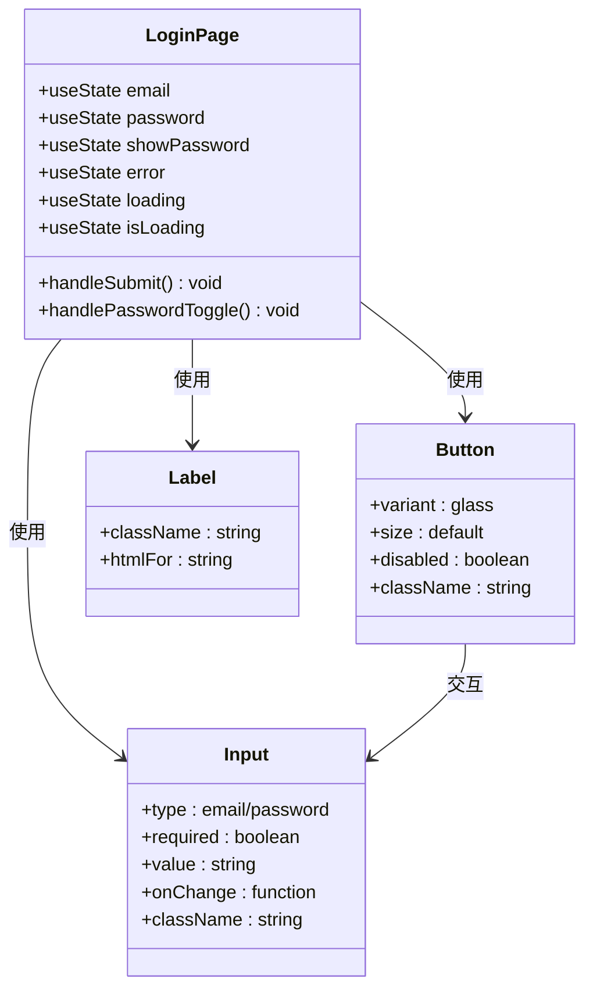
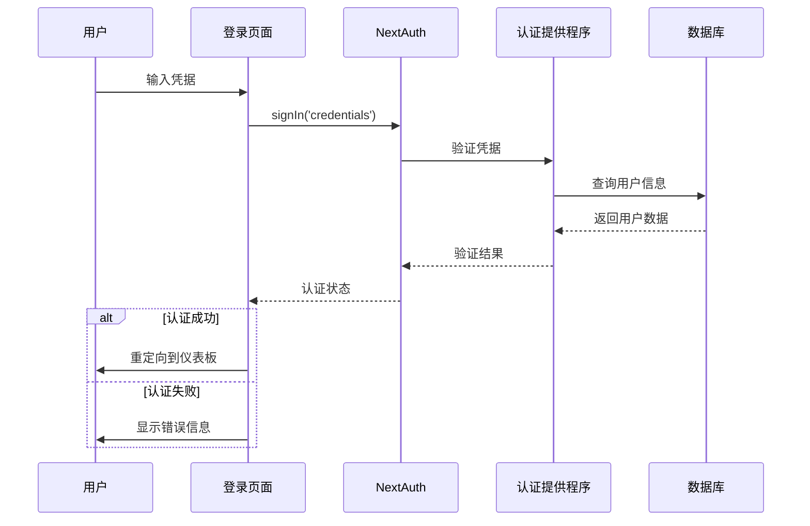
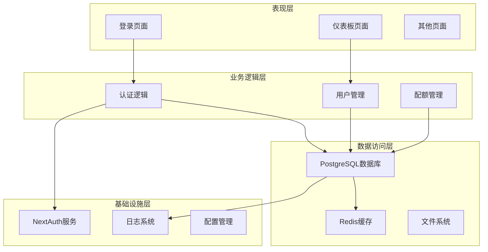
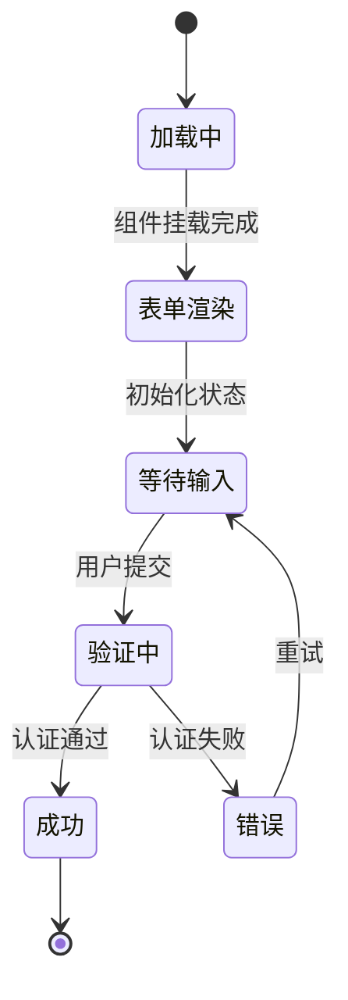
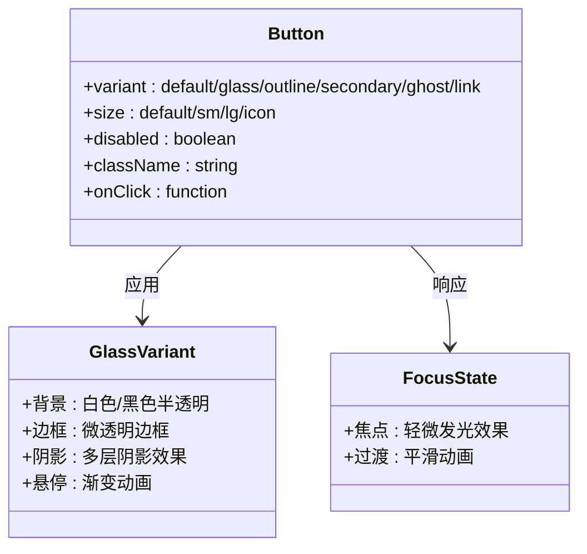
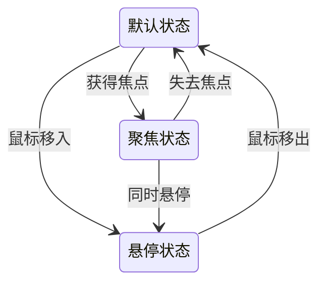
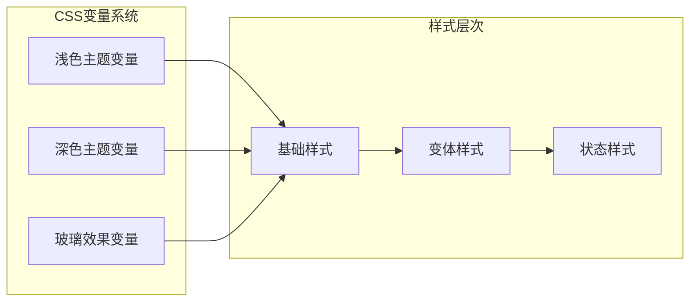
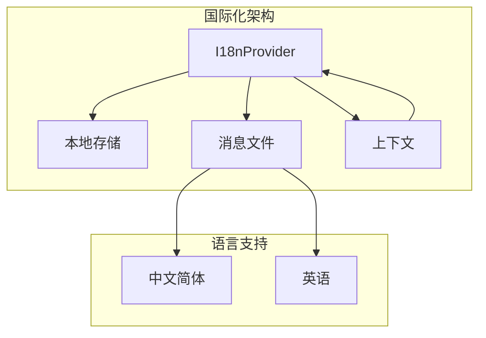
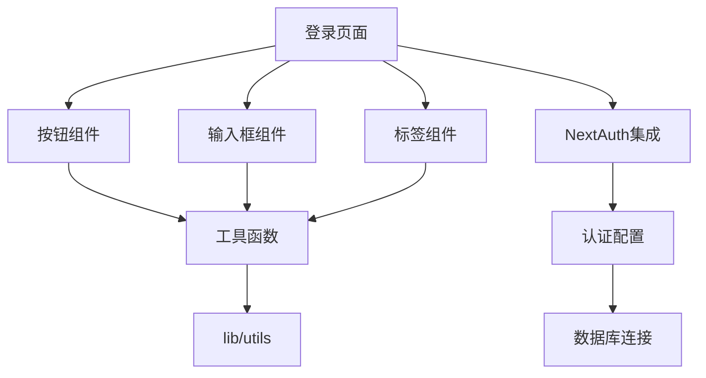
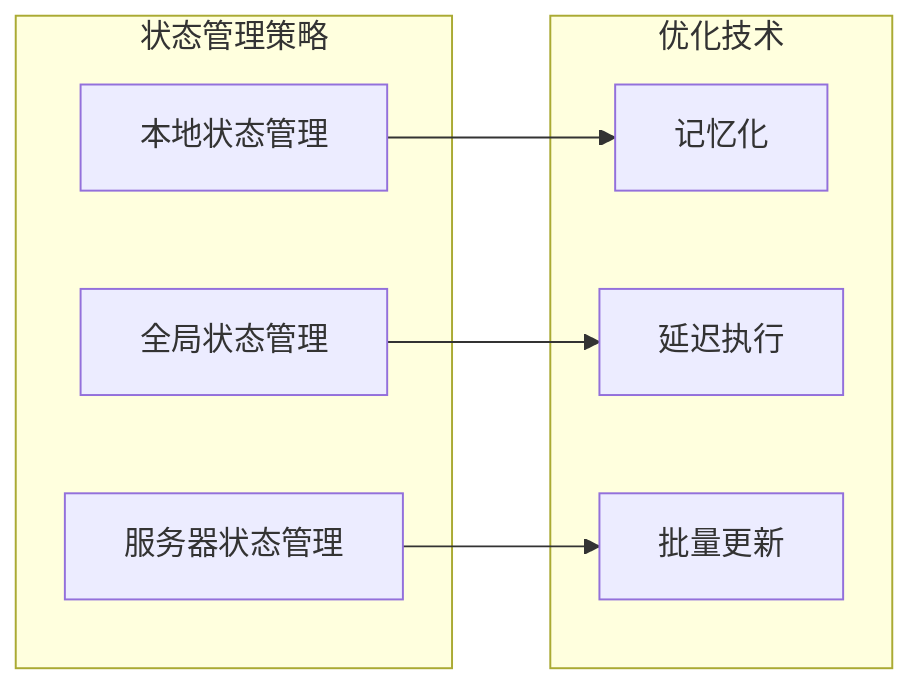

# 登录页面视觉重设计

<cite>
**本文档引用的文件**
- [src/app/login/page.tsx](file://src/app/login/page.tsx)
- [src/components/ui/button.tsx](file://src/components/ui/button.tsx)
- [src/components/ui/input.tsx](file://src/components/ui/input.tsx)
- [src/components/ui/label.tsx](file://src/components/ui/label.tsx)
- [src/app/globals.css](file://src/app/globals.css)
- [tailwind.config.js](file://tailwind.config.js)
- [src/auth.ts](file://src/auth.ts)
- [src/app/api/auth/[...nextauth]/route.ts](file://src/app/api/auth/[...nextauth]/route.ts)
- [src/lib/utils.ts](file://src/lib/utils.ts)
- [src/i18n/client.tsx](file://src/i18n/client.tsx)
- [src/messages/zh.json](file://src/messages/zh.json)
- [components.json](file://components.json)
</cite>

## 目录
1. [项目概述](#项目概述)
2. [项目结构](#项目结构)
3. [核心组件](#核心组件)
4. [架构概览](#架构概览)
5. [详细组件分析](#详细组件分析)
6. [依赖关系分析](#依赖关系分析)
7. [性能考虑](#性能考虑)
8. [故障排除指南](#故障排除指南)
9. [结论](#结论)

## 项目概述

AIGate 是一个基于 Next.js 16.1.6 构建的智能 AI 网关管理系统，采用现代化的前端技术栈和设计系统。该项目实现了完整的登录认证功能，支持演示模式和生产环境两种运行模式。

**章节来源**
- [package.json:1-94](file://package.json#L1-L94)

## 项目结构

项目采用基于功能模块的组织方式，登录页面位于应用的路由系统中，与全局样式和认证系统紧密集成。

```mermaid
graph TB
subgraph "应用层"
Login[登录页面<br/>src/app/login/page.tsx]
Dashboard[仪表板<br/>src/app/(dashboard)/page.tsx]
Settings[设置页面<br/>src/app/settings/page.tsx]
end
subgraph "组件层"
UI[UI组件库<br/>src/components/ui/]
Form[表单组件<br/>Input/Button/Label]
Layout[布局组件<br/>DashboardLayout]
end
subgraph "认证层"
Auth[认证配置<br/>src/auth.ts]
NextAuth[NextAuth集成<br/>src/app/api/auth/[...nextauth]/route.ts]
end
subgraph "样式层"
CSS[全局样式<br/>src/app/globals.css]
Tailwind[Tailwind配置<br/>tailwind.config.js]
Utils[工具函数<br/>src/lib/utils.ts]
end
Login --> UI
Login --> Auth
UI --> CSS
Auth --> NextAuth
CSS --> Tailwind
```

**图表来源**
- [src/app/login/page.tsx:1-129](file://src/app/login/page.tsx#L1-L129)
- [src/auth.ts:1-150](file://src/auth.ts#L1-L150)
- [src/app/globals.css:1-138](file://src/app/globals.css#L1-L138)

**章节来源**
- [src/app/login/page.tsx:1-129](file://src/app/login/page.tsx#L1-L129)
- [src/auth.ts:1-150](file://src/auth.ts#L1-L150)

## 核心组件

### 登录页面组件

登录页面采用了现代化的液态玻璃效果设计，实现了响应式布局和暗黑模式支持。



**图表来源**
- [src/app/login/page.tsx:11-129](file://src/app/login/page.tsx#L11-L129)
- [src/components/ui/button.tsx:62-77](file://src/components/ui/button.tsx#L62-L77)
- [src/components/ui/input.tsx:8-41](file://src/components/ui/input.tsx#L8-L41)

### 认证系统架构

系统集成了 NextAuth.js 提供完整的身份验证解决方案，支持多种认证提供程序。



**图表来源**
- [src/app/login/page.tsx:20-43](file://src/app/login/page.tsx#L20-L43)
- [src/auth.ts:15-117](file://src/auth.ts#L15-L117)

**章节来源**
- [src/app/login/page.tsx:11-129](file://src/app/login/page.tsx#L11-L129)
- [src/components/ui/button.tsx:1-77](file://src/components/ui/button.tsx#L1-L77)
- [src/components/ui/input.tsx:1-41](file://src/components/ui/input.tsx#L1-L41)

## 架构概览

系统采用分层架构设计，各层职责明确，便于维护和扩展。



**图表来源**
- [src/auth.ts:7-143](file://src/auth.ts#L7-L143)
- [src/lib/database.ts](file://src/lib/database.ts)
- [src/lib/redis.ts](file://src/lib/redis.ts)

## 详细组件分析

### 登录表单组件

登录表单采用了现代化的设计理念，实现了完整的用户体验流程。

#### 表单字段设计

| 字段 | 类型 | 验证规则 | 样式特性 |
|------|------|----------|----------|
| 邮箱地址 | email | 必填，格式验证 | 圆角设计，玻璃效果 |
| 密码 | password | 必填，长度验证 | 支持显示/隐藏切换 |
| 记住我 | checkbox | 可选 | 滑块开关设计 |

#### 交互状态管理



**图表来源**
- [src/app/login/page.tsx:12-48](file://src/app/login/page.tsx#L12-L48)

#### 错误处理机制

系统实现了多层次的错误处理机制，确保用户获得清晰的反馈信息。

```mermaid
flowchart TD
Submit[用户提交] --> Validate[表单验证]
Validate --> Valid{验证通过?}
Valid --> |否| ShowFormError[显示表单错误]
Valid --> |是| CallAuth[调用认证API]
CallAuth --> AuthSuccess{认证成功?}
AuthSuccess --> |是| Redirect[重定向到主页]
AuthSuccess --> |否| ShowAuthError[显示认证错误]
ShowFormError --> Submit
ShowAuthError --> Submit
Redirect --> [*]
```

**图表来源**
- [src/app/login/page.tsx:20-43](file://src/app/login/page.tsx#L20-L43)

**章节来源**
- [src/app/login/page.tsx:60-121](file://src/app/login/page.tsx#L60-L121)

### UI组件系统

#### 按钮组件设计

按钮组件采用了变体系统，支持多种视觉风格和尺寸规格。



**图表来源**
- [src/components/ui/button.tsx:7-54](file://src/components/ui/button.tsx#L7-L54)

#### 输入框组件设计

输入框组件实现了液态玻璃效果，提供了丰富的交互状态。



**图表来源**
- [src/components/ui/input.tsx:13-31](file://src/components/ui/input.tsx#L13-L31)

**章节来源**
- [src/components/ui/button.tsx:1-77](file://src/components/ui/button.tsx#L1-L77)
- [src/components/ui/input.tsx:1-41](file://src/components/ui/input.tsx#L1-L41)

### 样式系统架构

#### 液态玻璃效果实现

系统采用了先进的 CSS 技术实现液态玻璃效果，支持明暗主题切换。



**图表来源**
- [src/app/globals.css:5-129](file://src/app/globals.css#L5-L129)

#### Tailwind CSS 配置

Tailwind CSS 配置文件定义了完整的样式系统，支持自定义颜色和动画效果。

**章节来源**
- [src/app/globals.css:1-138](file://src/app/globals.css#L1-L138)
- [tailwind.config.js:1-78](file://tailwind.config.js#L1-L78)

### 国际化支持

系统实现了完整的国际化支持，当前支持中文和英文两种语言。



**图表来源**
- [src/i18n/client.tsx:53-87](file://src/i18n/client.tsx#L53-L87)

**章节来源**
- [src/i18n/client.tsx:1-96](file://src/i18n/client.tsx#L1-L96)
- [src/messages/zh.json:1-92](file://src/messages/zh.json#L1-L92)

## 依赖关系分析

### 核心依赖关系

系统的关键依赖关系如下所示：

```mermaid
graph TB
subgraph "前端框架"
NextJS[Next.js 16.1.6]
React[React 19.2.3]
TypeScript[TypeScript 5]
end
subgraph "UI框架"
Tailwind[Tailwind CSS 4]
ShadCN[shadcn/ui]
Lucide[Lucide React]
end
subgraph "认证系统"
NextAuth[NextAuth.js 4.24.13]
AuthCore[@auth/core]
DrizzleAdapter[@auth/drizzle-adapter]
end
subgraph "数据库"
PostgreSQL[PostgreSQL]
Drizzle[Drizzle ORM]
Redis[Redis]
end
subgraph "工具库"
clsx[clsx]
tailwind-merge[tailwind-merge]
class-variance-authority[cva]
end
NextJS --> React
NextJS --> Tailwind
NextJS --> NextAuth
NextAuth --> AuthCore
NextAuth --> DrizzleAdapter
Tailwind --> ShadCN
ShadCN --> Lucide
NextJS --> clsx
NextJS --> tailwind-merge
NextJS --> class-variance-authority
```

**图表来源**
- [package.json:20-72](file://package.json#L20-L72)

### 组件依赖图



**图表来源**
- [src/app/login/page.tsx:4-9](file://src/app/login/page.tsx#L4-L9)
- [src/lib/utils.ts:1-7](file://src/lib/utils.ts#L1-L7)

**章节来源**
- [package.json:1-94](file://package.json#L1-L94)
- [components.json:1-18](file://components.json#L1-L18)

## 性能考虑

### 渲染优化

系统采用了多种性能优化策略：

1. **懒加载**: 使用 React.lazy 和 Suspense 实现组件懒加载
2. **代码分割**: Next.js 自动进行代码分割
3. **缓存策略**: 实现浏览器缓存和服务器端缓存
4. **资源优化**: 图片和字体资源的优化处理

### 状态管理



## 故障排除指南

### 常见问题诊断

#### 登录失败问题

| 问题类型 | 可能原因 | 解决方案 |
|----------|----------|----------|
| 凭据错误 | 邮箱或密码不正确 | 检查输入格式和字符 |
| 账户状态异常 | 账户被禁用或未激活 | 联系管理员 |
| 网络连接问题 | 服务器连接失败 | 检查网络状态 |
| 会话过期 | 认证令牌失效 | 重新登录 |

#### 样式显示问题

| 问题类型 | 可能原因 | 解决方案 |
|----------|----------|----------|
| 样式不生效 | CSS变量未正确加载 | 检查globals.css文件 |
| 主题切换异常 | 暗黑模式配置错误 | 验证tailwind.config.js |
| 响应式布局问题 | 断点配置不当 | 调整屏幕尺寸测试 |

**章节来源**
- [src/app/login/page.tsx:32-42](file://src/app/login/page.tsx#L32-L42)
- [src/auth.ts:15-117](file://src/auth.ts#L15-L117)

## 结论

AIGate 登录页面的视觉重设计成功实现了现代化的液态玻璃效果，提供了优秀的用户体验和完整的功能特性。系统采用的技术架构具有良好的可维护性和扩展性，为后续的功能开发奠定了坚实的基础。

主要成就包括：
- 实现了现代化的视觉设计语言
- 建立了完整的认证安全体系
- 提供了良好的用户体验和无障碍支持
- 构建了可扩展的架构基础

未来可以考虑的方向：
- 进一步优化移动端体验
- 增加更多的个性化定制选项
- 实现更丰富的动画效果
- 扩展多语言支持范围