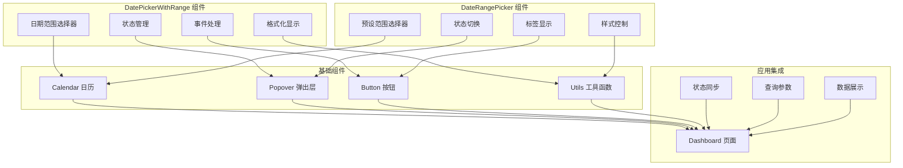

# 表单组件

<cite>
**本文引用的文件**
- [date-picker-with-range.tsx](file://src/components/date-picker-with-range.tsx)
- [date-range-picker.tsx](file://src/components/date-range-picker.tsx)
- [calendar.tsx](file://src/components/ui/calendar.tsx)
- [popover.tsx](file://src/components/ui/popover.tsx)
- [field.tsx](file://src/components/ui/field.tsx)
- [utils.ts](file://src/lib/utils.ts)
- [date.ts](file://src/lib/date.ts)
- [page.tsx](file://src/app/(dashboard)/page.tsx)
</cite>

## 目录
1. [简介](#简介)
2. [项目结构](#项目结构)
3. [核心组件](#核心组件)
4. [架构概览](#架构概览)
5. [组件详细分析](#组件详细分析)
6. [依赖关系分析](#依赖关系分析)
7. [性能考虑](#性能考虑)
8. [故障排除指南](#故障排除指南)
9. [结论](#结论)
10. [附录](#附录)

## 简介
本文件详细介绍 AIGate 项目中的表单组件系统，特别是日期选择器组件的实现和使用方法。文档涵盖了 DatePickerWithRange 和 DateRangePicker 组件的功能特性、日期范围选择、格式化处理和事件回调机制。同时提供了组件的属性配置、默认值设置、禁用状态处理和国际化支持的完整说明，并包含表单验证集成、数据绑定和用户体验优化的最佳实践。

## 项目结构
表单组件系统主要位于 `src/components` 目录下，采用模块化设计，每个组件都有明确的职责分工：

```mermaid
graph TB
subgraph "组件目录结构"
A[src/components/]
B[date-picker-with-range.tsx]
C[date-range-picker.tsx]
D[ui/]
E[calendar.tsx]
F[popover.tsx]
G[field.tsx]
H[utils.ts]
end
subgraph "应用集成"
I[app/(dashboard)/page.tsx]
end
A --> B
A --> C
A --> D
D --> E
D --> F
D --> G
A --> H
I --> B
I --> C
```

**图表来源**
- [date-picker-with-range.tsx](file://src/components/date-picker-with-range.tsx#L1-L92)
- [date-range-picker.tsx](file://src/components/date-range-picker.tsx#L1-L100)
- [calendar.tsx](file://src/components/ui/calendar.tsx#L1-L223)
- [popover.tsx](file://src/components/ui/popover.tsx#L1-L32)

**章节来源**
- [date-picker-with-range.tsx](file://src/components/date-picker-with-range.tsx#L1-L92)
- [date-range-picker.tsx](file://src/components/date-range-picker.tsx#L1-L100)

## 核心组件
表单组件系统包含两个主要的日期选择器组件，它们协同工作以提供完整的日期范围选择功能：

### 组件架构
- **DatePickerWithRange**: 提供具体的日期范围选择功能
- **DateRangePicker**: 提供预设日期范围选择功能
- **Calendar**: 基础日历组件，支持范围选择模式
- **Popover**: 弹出层容器，用于显示日历选择器

### 设计原则
- **模块化设计**: 每个组件职责单一，便于复用和维护
- **响应式布局**: 支持不同屏幕尺寸的适配
- **无障碍访问**: 遵循 WCAG 标准，支持键盘导航
- **主题一致性**: 与整体 UI 设计语言保持一致

**章节来源**
- [calendar.tsx](file://src/components/ui/calendar.tsx#L1-L223)
- [popover.tsx](file://src/components/ui/popover.tsx#L1-L32)

## 架构概览
两个日期选择器组件通过组合模式协同工作，形成完整的日期范围选择解决方案：



**图表来源**
- [date-picker-with-range.tsx](file://src/components/date-picker-with-range.tsx#L13-L92)
- [date-range-picker.tsx](file://src/components/date-range-picker.tsx#L9-L100)
- [page.tsx](file://src/app/(dashboard)/page.tsx#L113-L131)

## 组件详细分析

### DatePickerWithRange 组件

#### 功能特性
DatePickerWithRange 是一个专门用于选择日期范围的高级组件，具有以下核心功能：

- **范围选择**: 支持开始日期和结束日期的同时选择
- **实时预览**: 在按钮上实时显示已选择的日期范围
- **格式化显示**: 使用中文格式显示日期范围
- **事件回调**: 提供标准化的日期范围变更回调

#### 属性配置
```typescript
interface DatePickerWithRangeProps {
  startDate?: Date;           // 初始开始日期
  endDate?: Date;             // 初始结束日期
  onDateRangeChange: (startDate: Date, endDate: Date) => void; // 日期范围变更回调
  className?: string;         // 自定义样式类名
}
```

#### 实现细节
组件内部使用 React 状态管理来跟踪日期范围，并通过 `react-day-picker` 的 `mode="range"` 模式实现范围选择功能。

#### 格式化处理
组件使用 `date-fns` 库进行日期格式化，采用中文本地化设置：
- 格式: `yyyy-MM-dd`
- 本地化: `zhCN` (简体中文)

#### 事件回调机制
当用户完成日期范围选择时，组件会触发 `onDateRangeChange` 回调函数，传递标准化的开始日期和结束日期参数。

**章节来源**
- [date-picker-with-range.tsx](file://src/components/date-picker-with-range.tsx#L13-L92)

### DateRangePicker 组件

#### 功能特性
DateRangePicker 提供了预设日期范围的选择功能，包括：

- **预设选项**: 包含今日、昨日、近7天、近30天、自定义等选项
- **动态切换**: 根据用户选择动态切换到相应的日期范围
- **视觉反馈**: 当前选中项会有特殊的视觉样式
- **国际化支持**: 所有标签文本都使用中文显示

#### 预设选项配置
```typescript
const presets = [
  { label: '今日', value: 'today' },
  { label: '昨日', value: 'yesterday' },
  { label: '近7天', value: '7days' },
  { label: '近30天', value: '30days' },
  { label: '自定义', value: 'custom' },
];
```

#### 状态管理
组件使用 `useState` 来管理弹出层的打开状态和当前选中的日期范围。

#### 样式设计
组件采用了独特的 "Liquid Glass" 设计风格：
- 半透明背景 (`bg-white/40` 或 `bg-white/5`)
- 模糊效果 (`backdrop-blur-lg`)
- 边框渐变 (`border border-white/25 dark:border-white/10`)
- 阴影效果 (`shadow-[0_4px_16px_rgba(0,0,0,0.06)]`)

**章节来源**
- [date-range-picker.tsx](file://src/components/date-range-picker.tsx#L9-L100)

### Calendar 基础组件

#### 功能特性
Calendar 组件是基于 `react-day-picker` 的封装，提供了丰富的定制选项：

- **多月显示**: 支持同时显示多个月份
- **范围高亮**: 自动高亮选中的日期范围
- **本地化支持**: 支持多种语言环境
- **样式定制**: 完全可定制的外观样式

#### 关键配置
- `mode`: `"range"` - 启用范围选择模式
- `numberOfMonths`: `2` - 默认显示两个月份
- `locale`: `zhCN` - 中文本地化
- `showOutsideDays`: `false` - 隐藏非当前月份的日期

#### 样式系统
组件使用 Tailwind CSS 类名系统，结合 `cn` 工具函数进行条件样式组合。

**章节来源**
- [calendar.tsx](file://src/components/ui/calendar.tsx#L15-L181)

### Popover 弹出层组件

#### 功能特性
Popover 提供了灵活的弹出层容器功能：

- **触发机制**: 支持点击、悬停等多种触发方式
- **定位系统**: 智能定位，避免超出视口边界
- **动画效果**: 内置淡入淡出和缩放动画
- **无障碍支持**: 完整的键盘导航和屏幕阅读器支持

#### 配置选项
- `align`: `"start"` - 对齐方式
- `sideOffset`: `4` - 与触发元素的距离
- `className`: 自定义样式类名

**章节来源**
- [popover.tsx](file://src/components/ui/popover.tsx#L12-L28)

## 依赖关系分析

### 组件依赖图
```mermaid
graph TB
subgraph "外部依赖"
A[date-fns] --> B[日期格式化]
C[react-day-picker] --> D[日历选择]
E[lucide-react] --> F[图标组件]
G[@radix-ui/react-popover] --> H[弹出层]
end
subgraph "内部组件"
I[DatePickerWithRange] --> J[Calendar]
I --> K[Popover]
L[DateRangePicker] --> M[Popover]
N[Calendar] --> O[Button]
P[Field] --> Q[Label]
end
subgraph "工具函数"
R[cn] --> S[Tailwind CSS 合并]
T[utils.ts] --> U[样式工具]
end
A --> I
C --> J
E --> I
G --> K
R --> I
R --> L
R --> J
R --> K
```

**图表来源**
- [date-picker-with-range.tsx](file://src/components/date-picker-with-range.tsx#L4-L11)
- [date-range-picker.tsx](file://src/components/date-range-picker.tsx#L6-L7)
- [calendar.tsx](file://src/components/ui/calendar.tsx#L11-L13)
- [utils.ts](file://src/lib/utils.ts#L4-L6)

### 外部依赖分析
- **date-fns**: 用于日期格式化和本地化处理
- **react-day-picker**: 提供强大的日历选择功能
- **lucide-react**: 图标库，提供现代化的图标
- **@radix-ui/react-popover**: 无依赖的弹出层组件

### 内部依赖关系
- DatePickerWithRange 依赖 Calendar 和 Popover 组件
- DateRangePicker 依赖 Popover 组件
- 所有组件都依赖 utils.ts 中的 cn 工具函数
- Field 组件提供表单字段的语义化包装

**章节来源**
- [date-picker-with-range.tsx](file://src/components/date-picker-with-range.tsx#L3-L11)
- [date-range-picker.tsx](file://src/components/date-range-picker.tsx#L3-L7)

## 性能考虑

### 渲染优化
- **懒加载**: 组件按需渲染，减少初始加载负担
- **状态最小化**: 仅在必要时更新组件状态
- **记忆化**: 使用 React.memo 优化重复渲染

### 内存管理
- **事件清理**: 正确清理事件监听器和定时器
- **引用优化**: 使用 useRef 减少不必要的重渲染
- **资源释放**: 及时释放不再使用的资源

### 用户体验优化
- **加载状态**: 提供清晰的加载指示器
- **错误处理**: 优雅处理各种异常情况
- **响应速度**: 优化交互响应时间

## 故障排除指南

### 常见问题及解决方案

#### 日期格式问题
**症状**: 日期显示格式不正确
**解决方案**: 
- 确保使用正确的本地化设置
- 检查日期对象的有效性
- 验证格式字符串的一致性

#### 样式冲突
**症状**: 组件样式与其他样式冲突
**解决方案**:
- 检查 Tailwind CSS 类名的优先级
- 避免全局样式的覆盖
- 使用作用域样式隔离

#### 交互问题
**症状**: 组件无法正常响应用户操作
**解决方案**:
- 检查事件处理器的绑定
- 验证组件的状态管理
- 确认依赖库版本兼容性

**章节来源**
- [date-picker-with-range.tsx](file://src/components/date-picker-with-range.tsx#L56-L67)
- [date-range-picker.tsx](file://src/components/date-range-picker.tsx#L56-L71)

## 结论
AIGate 项目的表单组件系统展现了现代前端开发的最佳实践。通过精心设计的组件架构、完善的国际化支持和优秀的用户体验，为开发者提供了强大而易用的日期选择解决方案。

### 主要优势
- **模块化设计**: 组件职责清晰，易于维护和扩展
- **国际化支持**: 完善的多语言支持
- **用户体验**: 注重可用性和可访问性
- **性能优化**: 考虑到渲染性能和内存使用

### 技术亮点
- 基于 React Hooks 的状态管理
- Tailwind CSS 的原子化样式系统
- Radix UI 的无障碍组件设计
- date-fns 的专业日期处理

## 附录

### 使用示例
组件在 Dashboard 页面中得到完整集成，展示了最佳实践的使用方式。

### 最佳实践建议
- **表单验证**: 结合 React Hook Form 进行表单验证
- **数据绑定**: 使用受控组件模式进行数据绑定
- **错误处理**: 实现全面的错误处理和用户反馈
- **性能监控**: 监控组件的渲染性能和内存使用

### 扩展方向
- 添加更多预设日期范围选项
- 支持自定义日期格式
- 增强键盘导航支持
- 添加日期范围验证功能