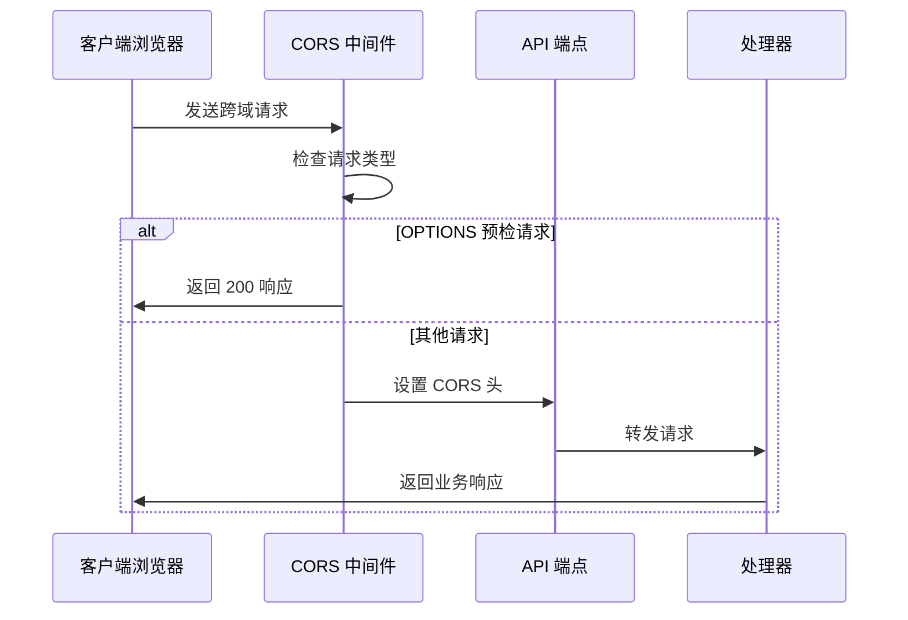
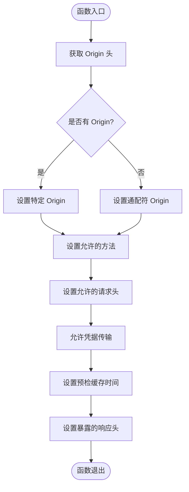
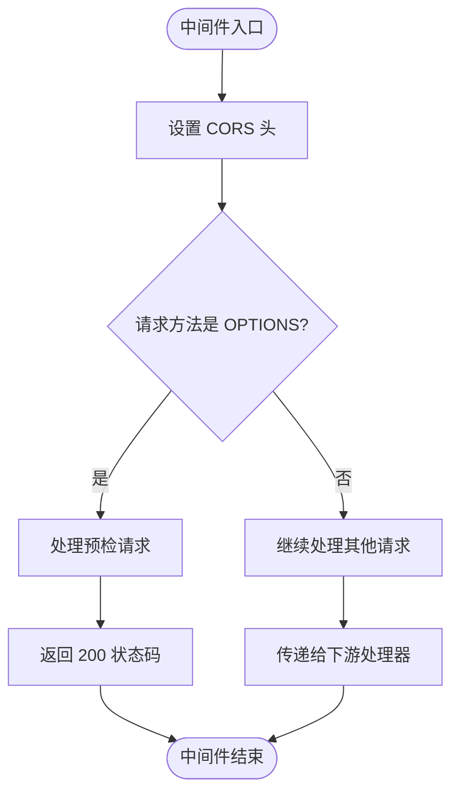
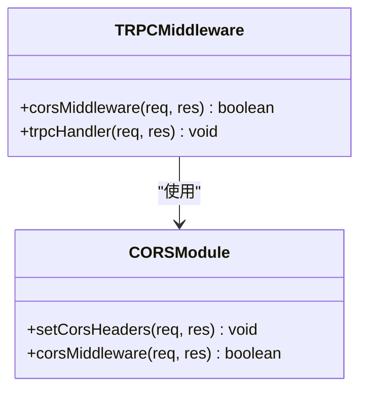
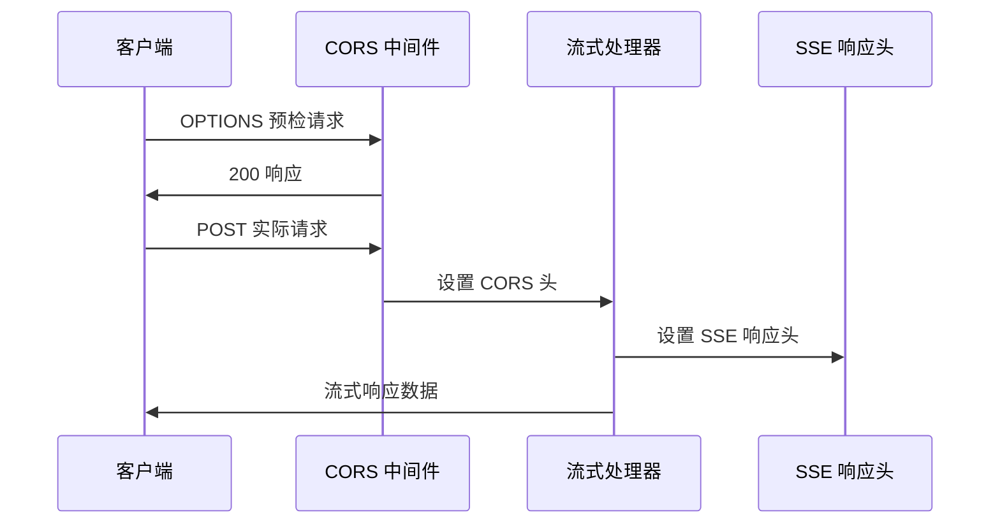
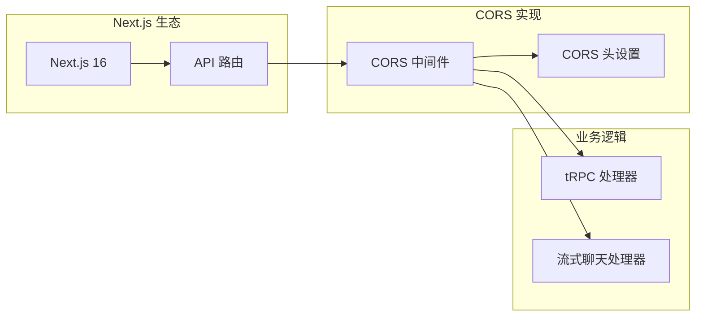

# CORS 配置与管理

<cite>
**本文档引用的文件**
- [src/lib/cors.ts](file://src/lib/cors.ts)
- [src/pages/api/trpc/[trpc].ts](file://src/pages/api/trpc/[trpc].ts)
- [src/pages/api/ai/chat/stream.ts](file://src/pages/api/ai/chat/stream.ts)
- [docs/cors-testing.md](file://docs/cors-testing.md)
- [next.config.ts](file://next.config.ts)
- [package.json](file://package.json)
- [README.md](file://README.md)
</cite>

## 目录
1. [简介](#简介)
2. [项目结构](#项目结构)
3. [核心组件](#核心组件)
4. [架构概览](#架构概览)
5. [详细组件分析](#详细组件分析)
6. [依赖关系分析](#依赖关系分析)
7. [性能考虑](#性能考虑)
8. [故障排除指南](#故障排除指南)
9. [结论](#结论)
10. [附录](#附录)

## 简介

CORS（跨域资源共享）是现代 Web 应用中不可或缺的安全机制。它允许来自不同源（协议、域名、端口）的资源相互访问，同时保持浏览器同源策略的安全性。

AIGate 项目采用 Next.js 16 构建，集成了 tRPC 类型安全 API 和多种 AI 服务提供商。为了支持跨域请求，项目实现了完整的 CORS 配置方案，确保前端应用能够安全地与后端 API 进行通信。

## 项目结构

AIGate 项目采用模块化架构，CORS 功能主要分布在以下几个关键位置：

```mermaid
graph TB
subgraph "CORS 核心"
CORS[src/lib/cors.ts<br/>CORS 中间件]
end
subgraph "API 层"
TRPC[src/pages/api/trpc/[trpc].ts<br/>tRPC 端点]
STREAM[src/pages/api/ai/chat/stream.ts<br/>流式聊天端点]
end
subgraph "配置层"
NEXT[next.config.ts<br/>Next.js 配置]
DOCS[docs/cors-testing.md<br/>CORS 测试文档]
end
CORS --> TRPC
CORS --> STREAM
NEXT --> TRPC
NEXT --> STREAM
DOCS --> CORS
```

**图表来源**
- [src/lib/cors.ts](file://src/lib/cors.ts#L1-L54)
- [src/pages/api/trpc/[trpc].ts](file://src/pages/api/trpc/[trpc].ts#L1-L28)
- [src/pages/api/ai/chat/stream.ts](file://src/pages/api/ai/chat/stream.ts#L1-L184)

**章节来源**
- [src/lib/cors.ts](file://src/lib/cors.ts#L1-L54)
- [src/pages/api/trpc/[trpc].ts](file://src/pages/api/trpc/[trpc].ts#L1-L28)
- [src/pages/api/ai/chat/stream.ts](file://src/pages/api/ai/chat/stream.ts#L1-L184)

## 核心组件

### CORS 中间件架构

AIGate 项目实现了两个核心的 CORS 组件：

1. **setCorsHeaders()** - 设置标准 CORS 响应头
2. **corsMiddleware()** - 处理 OPTIONS 预检请求的中间件

这两个组件协同工作，为所有 API 端点提供统一的跨域支持。

**章节来源**
- [src/lib/cors.ts](file://src/lib/cors.ts#L7-L34)
- [src/lib/cors.ts](file://src/lib/cors.ts#L42-L53)

## 架构概览

CORS 在 AIGate 中的实现遵循了标准的浏览器安全模型：



**图表来源**
- [src/lib/cors.ts](file://src/lib/cors.ts#L42-L53)
- [src/pages/api/trpc/[trpc].ts](file://src/pages/api/trpc/[trpc].ts#L20-L27)

## 详细组件分析

### CORS 中间件实现

#### setCorsHeaders() 函数分析

该函数负责设置所有必要的 CORS 响应头，确保浏览器正确处理跨域请求：



**图表来源**
- [src/lib/cors.ts](file://src/lib/cors.ts#L7-L34)

#### 关键响应头说明

| 响应头名称 | 默认值 | 作用说明 |
|-----------|--------|----------|
| `Access-Control-Allow-Origin` | `*` | 指定允许访问的来源 |
| `Access-Control-Allow-Methods` | `GET, HEAD, POST, PUT, DELETE, OPTIONS, PATCH` | 允许的 HTTP 方法 |
| `Access-Control-Allow-Headers` | `Content-Type, Authorization, X-CSRF-Token, X-Requested-With` | 允许的请求头 |
| `Access-Control-Allow-Credentials` | `true` | 允许发送 Cookie 和认证信息 |
| `Access-Control-Max-Age` | `86400` | 预检请求缓存时间（秒） |
| `Access-Control-Expose-Headers` | `Content-Length, X-Request-Id` | 暴露给客户端的响应头 |

**章节来源**
- [src/lib/cors.ts](file://src/lib/cors.ts#L11-L33)

#### corsMiddleware() 函数分析

该中间件提供了完整的 CORS 处理逻辑：



**图表来源**
- [src/lib/cors.ts](file://src/lib/cors.ts#L42-L53)

**章节来源**
- [src/lib/cors.ts](file://src/lib/cors.ts#L42-L53)

### API 端点集成

#### tRPC 端点集成

tRPC 端点通过简单的中间件集成实现了 CORS 支持：



**图表来源**
- [src/pages/api/trpc/[trpc].ts](file://src/pages/api/trpc/[trpc].ts#L5-L27)

#### 流式聊天端点集成

流式聊天端点实现了更复杂的 CORS 处理，需要在多个阶段设置响应头：



**图表来源**
- [src/pages/api/ai/chat/stream.ts](file://src/pages/api/ai/chat/stream.ts#L6-L14)
- [src/pages/api/ai/chat/stream.ts](file://src/pages/api/ai/chat/stream.ts#L95-L100)

**章节来源**
- [src/pages/api/trpc/[trpc].ts](file://src/pages/api/trpc/[trpc].ts#L20-L27)
- [src/pages/api/ai/chat/stream.ts](file://src/pages/api/ai/chat/stream.ts#L10-L14)

## 依赖关系分析

### 外部依赖

AIGate 项目对 CORS 功能的依赖相对简单，主要依赖 Next.js 的原生 API 路由机制：



**图表来源**
- [package.json](file://package.json#L50-L67)
- [src/lib/cors.ts](file://src/lib/cors.ts#L1-L1)

**章节来源**
- [package.json](file://package.json#L18-L67)

### 内部依赖关系

```mermaid
graph TB
subgraph "核心模块"
CORS[src/lib/cors.ts]
end
subgraph "API 端点"
TRPC[src/pages/api/trpc/[trpc].ts]
STREAM[src/pages/api/ai/chat/stream.ts]
end
subgraph "配置文档"
TEST[docs/cors-testing.md]
end
CORS --> TRPC
CORS --> STREAM
TEST --> CORS
TEST --> TRPC
TEST --> STREAM
```

**图表来源**
- [src/lib/cors.ts](file://src/lib/cors.ts#L5-L6)
- [src/pages/api/trpc/[trpc].ts](file://src/pages/api/trpc/[trpc].ts#L5)
- [src/pages/api/ai/chat/stream.ts](file://src/pages/api/ai/chat/stream.ts#L6)

**章节来源**
- [src/lib/cors.ts](file://src/lib/cors.ts#L1-L54)
- [src/pages/api/trpc/[trpc].ts](file://src/pages/api/trpc/[trpc].ts#L1-L28)
- [src/pages/api/ai/chat/stream.ts](file://src/pages/api/ai/chat/stream.ts#L1-L184)

## 性能考虑

### 预检请求缓存

CORS 实现中设置了 `Access-Control-Max-Age: 86400`，这意味着浏览器会缓存预检请求的结果 24 小时。这可以显著减少重复的跨域请求开销。

### 响应头优化

- **最小化响应头数量**：只设置必要的 CORS 响应头
- **精确的允许方法列表**：避免使用通配符，明确指定允许的方法
- **精确的允许头列表**：只允许必要的请求头，减少复杂性

### 中间件执行效率

CORS 中间件的执行成本极低，主要操作都是设置响应头，不会对业务逻辑产生明显影响。

## 故障排除指南

### 常见问题诊断

#### 405 Method Not Allowed 错误

这是最常见 CORS 相关错误之一，通常发生在浏览器发送 OPTIONS 预检请求后，服务器没有正确处理该请求。

**解决步骤**：
1. 确认 CORS 中间件已正确导入和使用
2. 检查 API 端点是否在路由处理之前调用了 `corsMiddleware()`
3. 验证服务器是否已重启以加载最新代码

#### CORS 头缺失问题

如果浏览器显示 CORS 相关错误，检查以下响应头是否正确设置：

- `Access-Control-Allow-Origin`
- `Access-Control-Allow-Methods`
- `Access-Control-Allow-Headers`
- `Access-Control-Allow-Credentials`

#### 预检请求失败

预检请求应该返回 200 状态码且不包含业务响应体。如果预检请求失败，检查：

1. `corsMiddleware()` 是否在所有 API 端点正确调用
2. 是否正确处理了 `req.method === 'OPTIONS'` 的情况
3. 响应头是否正确设置

### 调试技巧

#### 浏览器开发者工具

1. 打开 Network 标签
2. 查看 OPTIONS 预检请求的响应头
3. 检查是否有 CORS 相关的错误信息
4. 观察实际请求的响应头是否包含预期的 CORS 头

#### 服务器日志

1. 开发服务器应该记录所有请求日志
2. 检查是否有 CORS 中间件的执行日志
3. 查看是否有中间件返回的 200 响应

#### 测试工具

使用 cURL 进行手动测试是最可靠的方法：

```bash
# 测试预检请求
curl -X OPTIONS http://localhost:3000/api/trpc/endpoint \
  -H "Origin: http://example.com" \
  -H "Access-Control-Request-Method: POST" \
  -H "Access-Control-Request-Headers: Content-Type" \
  -v

# 测试实际请求
curl -X POST http://localhost:3000/api/trpc/endpoint \
  -H "Origin: http://example.com" \
  -H "Content-Type: application/json" \
  -d '{"json":{}}' \
  -v
```

**章节来源**
- [docs/cors-testing.md](file://docs/cors-testing.md#L32-L324)

### 生产环境安全配置

当前开发配置允许任何来源访问，这在生产环境中是不安全的。建议：

1. **限制允许的来源**：只允许受信任的域名
2. **验证 Authorization 头**：实现 API Key 验证或 OAuth2
3. **限制允许的方法**：只允许必要的 HTTP 方法
4. **限制允许的请求头**：移除不必要的请求头

## 结论

AIGate 项目的 CORS 实现简洁而有效，通过两个核心函数提供了完整的跨域支持。其设计遵循了最佳实践：

- **标准化实现**：严格按照 CORS 规范实现
- **中间件模式**：提供可复用的 CORS 中间件
- **全面覆盖**：支持所有 API 端点
- **易于扩展**：可以根据需要调整配置

对于生产环境，建议根据具体需求调整 CORS 配置，特别是来源限制和安全头设置，以确保系统的安全性。

## 附录

### CORS 配置选项参考

| 配置项 | 默认值 | 说明 |
|-------|--------|------|
| 允许来源 | `*` | 可以设置为特定域名或通配符 |
| 允许方法 | `GET, HEAD, POST, PUT, DELETE, OPTIONS, PATCH` | 根据实际需求精简 |
| 允许头 | `Content-Type, Authorization, X-CSRF-Token, X-Requested-With` | 移除不需要的头 |
| 凭据支持 | `true` | 允许发送 Cookie 和认证信息 |
| 预检缓存 | `86400` | 24 小时缓存预检结果 |

### 最佳实践建议

1. **生产环境配置**：始终限制允许的来源，不要使用通配符
2. **最小权限原则**：只允许必要的 HTTP 方法和请求头
3. **定期审查**：定期审查和更新 CORS 配置
4. **监控告警**：监控 CORS 相关的错误和异常
5. **文档维护**：保持 CORS 配置文档的及时更新