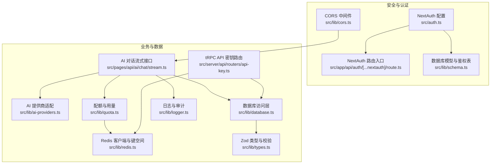
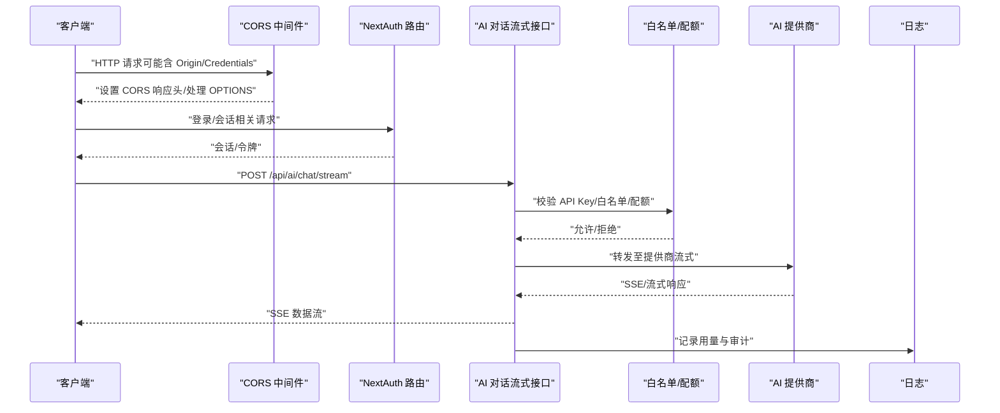
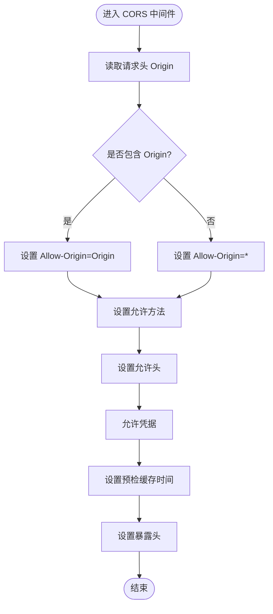
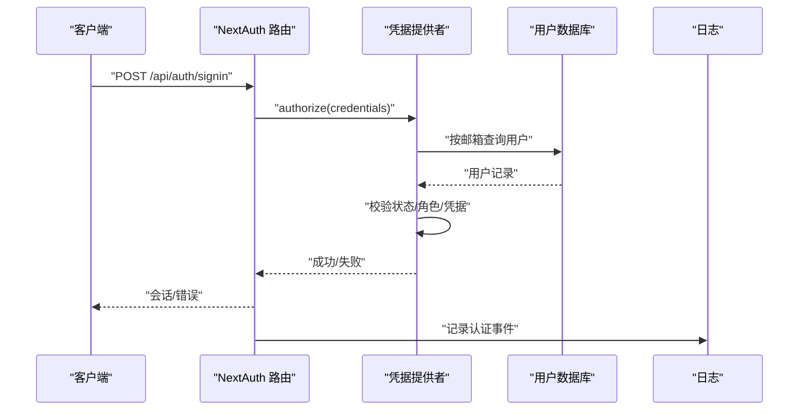
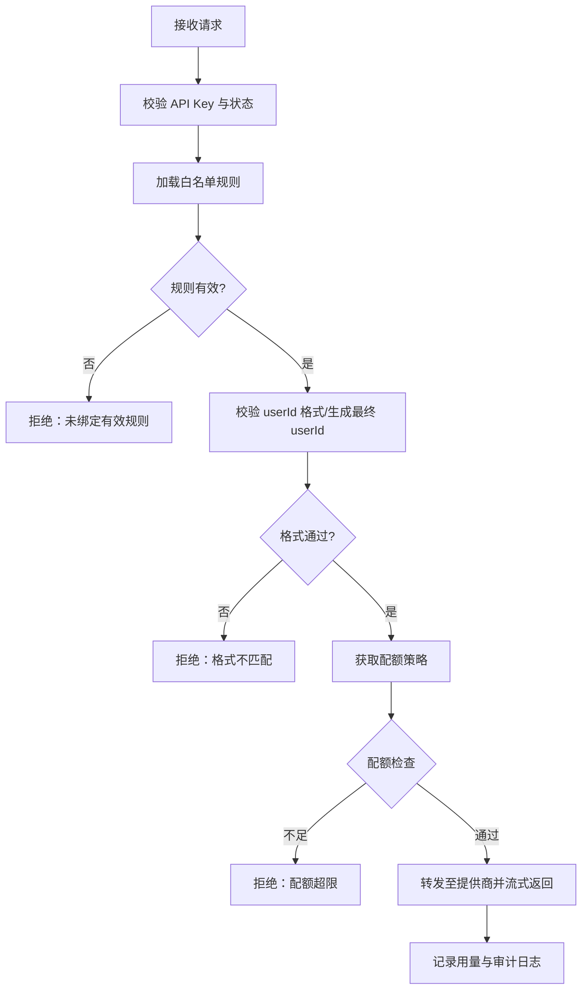
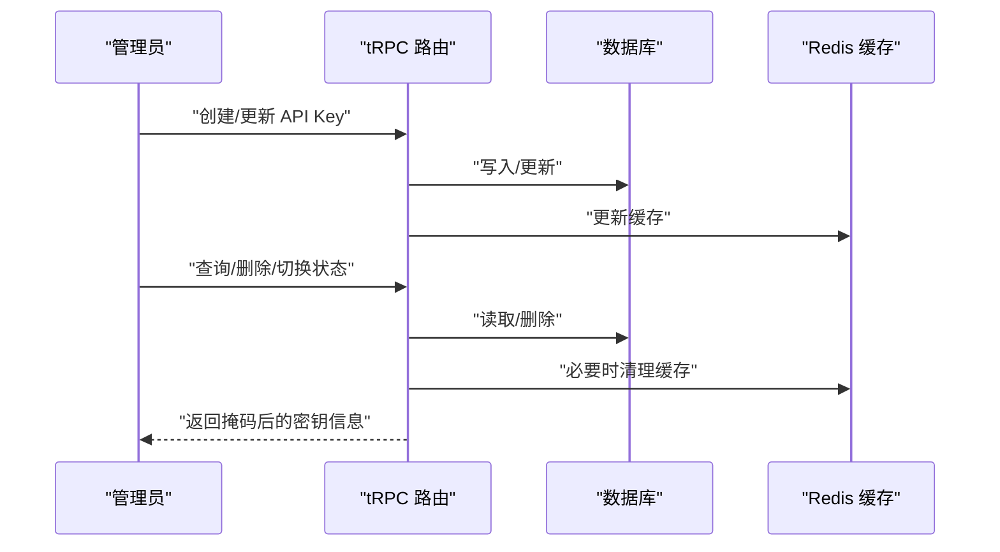
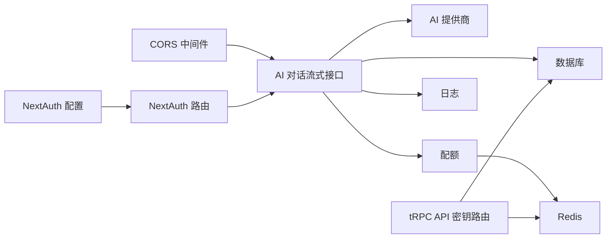
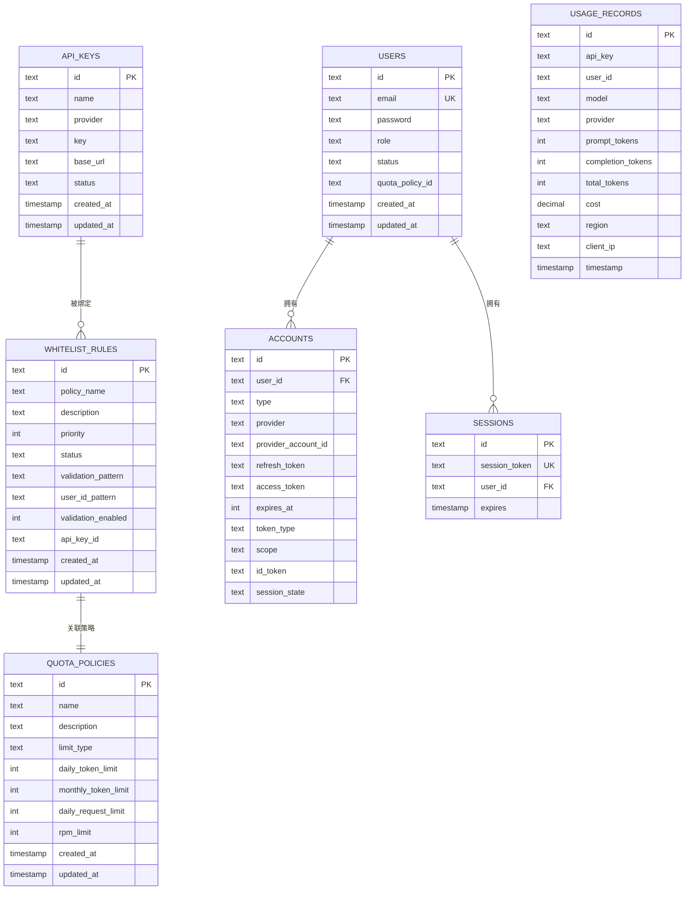

# 安全与 CORS

<cite>
**本文引用的文件**
- [src/lib/cors.ts](file://src/lib/cors.ts)
- [src/auth.ts](file://src/auth.ts)
- [src/app/api/auth/[...nextauth]/route.ts](file://src/app/api/auth/[...nextauth]/route.ts)
- [src/lib/schema.ts](file://src/lib/schema.ts)
- [src/lib/types.ts](file://src/lib/types.ts)
- [src/lib/database.ts](file://src/lib/database.ts)
- [src/lib/quota.ts](file://src/lib/quota.ts)
- [src/lib/redis.ts](file://src/lib/redis.ts)
- [src/lib/logger.ts](file://src/lib/logger.ts)
- [src/pages/api/ai/chat/stream.ts](file://src/pages/api/ai/chat/stream.ts)
- [src/lib/ai-providers.ts](file://src/lib/ai-providers.ts)
- [src/server/api/routers/api-key.ts](file://src/server/api/routers/api-key.ts)
</cite>

## 更新摘要
**所做更改**
- 删除了 CORS 配置与中间件的详细技术文档
- 删除了 NextAuth.js 身份验证系统的完整实现说明
- 删除了安全最佳实践、输入验证、输出编码等防护措施章节
- 删除了白名单与配额控制的详细流程说明
- 删除了 API 密钥管理与权限验证的完整技术文档
- 删除了依赖关系分析、性能考量和故障排查指南

## 目录
1. [简介](#简介)
2. [项目结构](#项目结构)
3. [核心组件](#核心组件)
4. [架构总览](#架构总览)
5. [详细组件分析](#详细组件分析)
6. [依赖关系分析](#依赖关系分析)
7. [性能考量](#性能考量)
8. [故障排查指南](#故障排查指南)
9. [结论](#结论)
10. [附录](#附录)

## 简介
本文件聚焦于 AIGate 的安全配置与跨域资源共享（CORS）设置，系统性阐述以下主题：
- CORS 的配置原理、实现细节与安全影响
- NextAuth.js 身份验证系统的安全机制与配置要点
- 访问控制策略、API 密钥管理与权限验证流程
- 输入验证、输出编码与安全头设置等防护措施
- 常见安全威胁的防范方法与应急响应流程

## 项目结构
围绕安全与 CORS 的关键代码分布在如下模块：
- CORS 中间件与响应头设置：src/lib/cors.ts
- NextAuth.js 配置与路由入口：src/auth.ts、src/app/api/auth/[...nextauth]/route.ts
- 数据模型与鉴权相关表：src/lib/schema.ts
- 类型与输入校验：src/lib/types.ts
- 数据访问层与业务逻辑：src/lib/database.ts、src/lib/quota.ts、src/lib/redis.ts、src/lib/logger.ts
- AI 对话流式接口与白名单校验：src/pages/api/ai/chat/stream.ts、src/lib/ai-providers.ts
- tRPC API 密钥管理与权限保护：src/server/api/routers/api-key.ts

**图表来源**
- [src/lib/cors.ts:1-54](file://src/lib/cors.ts#L1-L54)
- [src/auth.ts:1-150](file://src/auth.ts#L1-L150)
- [src/app/api/auth/[...nextauth]/route.ts](file://src/app/api/auth/[...nextauth]/route.ts#L1-L7)
- [src/lib/schema.ts:1-162](file://src/lib/schema.ts#L1-L162)
- [src/pages/api/ai/chat/stream.ts:1-124](file://src/pages/api/ai/chat/stream.ts#L1-L124)
- [src/lib/ai-providers.ts:1-759](file://src/lib/ai-providers.ts#L1-L759)
- [src/lib/database.ts:1-850](file://src/lib/database.ts#L1-L850)
- [src/lib/quota.ts:1-327](file://src/lib/quota.ts#L1-L327)
- [src/lib/redis.ts:1-43](file://src/lib/redis.ts#L1-L43)
- [src/lib/types.ts:1-118](file://src/lib/types.ts#L1-L118)
- [src/lib/logger.ts:1-192](file://src/lib/logger.ts#L1-L192)
- [src/server/api/routers/api-key.ts:1-377](file://src/server/api/routers/api-key.ts#L1-L377)

**章节来源**
- [src/lib/cors.ts:1-54](file://src/lib/cors.ts#L1-L54)
- [src/auth.ts:1-150](file://src/auth.ts#L1-L150)
- [src/app/api/auth/[...nextauth]/route.ts](file://src/app/api/auth/[...nextauth]/route.ts#L1-L7)
- [src/lib/schema.ts:1-162](file://src/lib/schema.ts#L1-L162)
- [src/pages/api/ai/chat/stream.ts:1-124](file://src/pages/api/ai/chat/stream.ts#L1-L124)
- [src/lib/ai-providers.ts:1-759](file://src/lib/ai-providers.ts#L1-L759)
- [src/lib/database.ts:1-850](file://src/lib/database.ts#L1-L850)
- [src/lib/quota.ts:1-327](file://src/lib/quota.ts#L1-L327)
- [src/lib/redis.ts:1-43](file://src/lib/redis.ts#L1-L43)
- [src/lib/types.ts:1-118](file://src/lib/types.ts#L1-L118)
- [src/lib/logger.ts:1-192](file://src/lib/logger.ts#L1-L192)
- [src/server/api/routers/api-key.ts:1-377](file://src/server/api/routers/api-key.ts#L1-L377)

## 核心组件
- CORS 中间件与预检处理：统一设置响应头、处理 OPTIONS 预检、支持凭据传递与暴露头
- NextAuth.js 认证：基于凭据提供者、服务端会话、回调注入用户角色与状态
- 白名单与配额控制：API Key 绑定白名单规则，按策略校验 userId 并执行 token/request/RPM 限额
- API 密钥管理：tRPC 路由受保护，支持创建、更新、删除、状态切换与使用统计
- 日志与审计：统一日志输出、配额与认证事件记录，便于追踪与审计

**章节来源**
- [src/lib/cors.ts:7-53](file://src/lib/cors.ts#L7-L53)
- [src/auth.ts:6-150](file://src/auth.ts#L6-L150)
- [src/lib/quota.ts:18-327](file://src/lib/quota.ts#L18-L327)
- [src/server/api/routers/api-key.ts:68-377](file://src/server/api/routers/api-key.ts#L68-L377)
- [src/lib/logger.ts:133-192](file://src/lib/logger.ts#L133-L192)

## 架构总览
下图展示从客户端到后端接口的关键交互路径，以及安全控制点（CORS、认证、白名单、配额、日志）：

**图表来源**
- [src/lib/cors.ts:42-53](file://src/lib/cors.ts#L42-L53)
- [src/app/api/auth/[...nextauth]/route.ts](file://src/app/api/auth/[...nextauth]/route.ts#L1-L7)
- [src/pages/api/ai/chat/stream.ts:10-124](file://src/pages/api/ai/chat/stream.ts#L10-L124)
- [src/lib/quota.ts:78-200](file://src/lib/quota.ts#L78-L200)
- [src/lib/ai-providers.ts:12-27](file://src/lib/ai-providers.ts#L12-L27)

## 详细组件分析

### CORS 配置与安全考量
- 允许来源：优先使用请求头中的 Origin，否则回退为通配符
- 方法与头：开放常用方法与典型请求头，支持凭据传递
- 预检缓存：设置最大预检缓存时间
- 暴露头：仅暴露必要响应头，避免泄露内部细节
- 安全建议：
  - 在生产环境尽量限定具体可信域名，避免使用通配符
  - 如需跨站携带 Cookie，确保 Access-Control-Allow-Origin 不得为通配符
  - 结合 SameSite/Secure/HttpOnly 等 Cookie 安全属性与 HTTPS 使用

**图表来源**
- [src/lib/cors.ts:7-34](file://src/lib/cors.ts#L7-L34)

**章节来源**
- [src/lib/cors.ts:7-53](file://src/lib/cors.ts#L7-L53)

### NextAuth.js 身份验证系统
- 提供者：基于凭据的用户名/密码登录
- 授权流程：校验邮箱/密码、用户状态与角色，记录日志
- 回调：将用户角色与状态注入 JWT 与 Session
- 页面重定向：登录页与错误页
- 安全要点：
  - 服务器端会话与密钥管理（NEXTAUTH_SECRET）
  - 严格校验用户状态与角色，避免越权
  - 记录认证事件，便于审计

**图表来源**
- [src/app/api/auth/[...nextauth]/route.ts](file://src/app/api/auth/[...nextauth]/route.ts#L1-L7)
- [src/auth.ts:14-119](file://src/auth.ts#L14-L119)
- [src/lib/database.ts:582-627](file://src/lib/database.ts#L582-L627)
- [src/lib/logger.ts:173-191](file://src/lib/logger.ts#L173-L191)

**章节来源**
- [src/auth.ts:6-150](file://src/auth.ts#L6-L150)
- [src/app/api/auth/[...nextauth]/route.ts](file://src/app/api/auth/[...nextauth]/route.ts#L1-L7)
- [src/lib/database.ts:582-627](file://src/lib/database.ts#L582-L627)
- [src/lib/logger.ts:173-191](file://src/lib/logger.ts#L173-L191)

### 访问控制策略与白名单
- API Key 绑定白名单规则：按 apiKeyId 查找规则并校验 userId 格式
- 规则匹配：支持正则校验与占位符替换（@user_id/@api_key/@ip/@any）
- 策略选择：优先按 API Key 获取配额策略，否则使用默认策略
- 限额检查：按 token/request/RPM 三种维度进行限制
- 用量记录：实时累加 Redis 计数并持久化到数据库

**图表来源**
- [src/pages/api/ai/chat/stream.ts:32-86](file://src/pages/api/ai/chat/stream.ts#L32-L86)
- [src/lib/quota.ts:18-200](file://src/lib/quota.ts#L18-L200)
- [src/lib/database.ts:293-545](file://src/lib/database.ts#L293-L545)
- [src/lib/logger.ts:147-163](file://src/lib/logger.ts#L147-L163)

**章节来源**
- [src/pages/api/ai/chat/stream.ts:10-124](file://src/pages/api/ai/chat/stream.ts#L10-L124)
- [src/lib/quota.ts:18-327](file://src/lib/quota.ts#L18-L327)
- [src/lib/database.ts:293-800](file://src/lib/database.ts#L293-L800)

### API 密钥管理与权限验证
- tRPC 受保护过程：仅认证用户可访问
- 支持操作：创建、查询、更新、删除、切换状态、获取使用统计
- 敏感信息处理：对密钥进行掩码显示，避免泄露
- 缓存与一致性：Redis 缓存活跃 API Key，变更时及时更新/清理

**图表来源**
- [src/server/api/routers/api-key.ts:68-377](file://src/server/api/routers/api-key.ts#L68-L377)
- [src/lib/database.ts:19-81](file://src/lib/database.ts#L19-L81)
- [src/lib/redis.ts:17-43](file://src/lib/redis.ts#L17-L43)

**章节来源**
- [src/server/api/routers/api-key.ts:68-377](file://src/server/api/routers/api-key.ts#L68-L377)
- [src/lib/database.ts:19-81](file://src/lib/database.ts#L19-L81)
- [src/lib/redis.ts:17-43](file://src/lib/redis.ts#L17-L43)

### 输入验证、输出编码与安全头
- 输入验证：使用 Zod 对请求体与参数进行强类型校验
- 输出编码：流式接口使用 SSE，注意客户端解析与渲染安全
- 安全头：流式接口设置 Content-Type、Cache-Control、Connection、X-Accel-Buffering 等
- 建议补充：CSP、X-Content-Type-Options、Referrer-Policy 等安全头

**章节来源**
- [src/lib/types.ts:4-118](file://src/lib/types.ts#L4-L118)
- [src/pages/api/ai/chat/stream.ts:56-61](file://src/pages/api/ai/chat/stream.ts#L56-L61)

## 依赖关系分析
- CORS 依赖 Next.js API 路由生命周期，贯穿所有后端接口
- NextAuth 依赖数据库用户表与 NextAuth 相关表，回调注入用户角色与状态
- AI 对话流式接口依赖提供商适配层、数据库与配额模块、Redis 与日志
- tRPC API 密钥路由依赖数据库与 Redis，受 NextAuth 保护

**图表来源**
- [src/lib/cors.ts:42-53](file://src/lib/cors.ts#L42-L53)
- [src/auth.ts:84-101](file://src/auth.ts#L84-L101)
- [src/pages/api/ai/chat/stream.ts:10-124](file://src/pages/api/ai/chat/stream.ts#L10-L124)
- [src/lib/ai-providers.ts:12-27](file://src/lib/ai-providers.ts#L12-L27)
- [src/lib/quota.ts:1-327](file://src/lib/quota.ts#L1-L327)
- [src/lib/redis.ts:1-43](file://src/lib/redis.ts#L1-L43)
- [src/server/api/routers/api-key.ts:1-377](file://src/server/api/routers/api-key.ts#L1-L377)

**章节来源**
- [src/lib/cors.ts:1-54](file://src/lib/cors.ts#L1-L54)
- [src/auth.ts:1-150](file://src/auth.ts#L1-L150)
- [src/pages/api/ai/chat/stream.ts:1-124](file://src/pages/api/ai/chat/stream.ts#L1-L124)
- [src/lib/ai-providers.ts:1-759](file://src/lib/ai-providers.ts#L1-L759)
- [src/lib/quota.ts:1-327](file://src/lib/quota.ts#L1-L327)
- [src/lib/redis.ts:1-43](file://src/lib/redis.ts#L1-L43)
- [src/server/api/routers/api-key.ts:1-377](file://src/server/api/routers/api-key.ts#L1-L377)

## 性能考量
- Redis 缓存：配额策略、API Key、每日/每分钟计数均采用 Redis，降低数据库压力
- 异步流式：SSE 流式返回，边生成边推送，减少等待时间
- 并发统计：用量记录与日志异步写入，避免阻塞主流程
- 建议：监控 Redis 命中率、内存占用与过期策略；对热点 API Key 与策略增加本地缓存

**章节来源**
- [src/lib/quota.ts:18-76](file://src/lib/quota.ts#L18-L76)
- [src/lib/redis.ts:17-43](file://src/lib/redis.ts#L17-L43)
- [src/pages/api/ai/chat/stream.ts:105-124](file://src/pages/api/ai/chat/stream.ts#L105-L124)

## 故障排查指南
- CORS 相关问题
  - 现象：浏览器报跨域错误或预检失败
  - 排查：确认 Origin、Allow-Credentials、暴露头与预检缓存设置
  - 参考：CORS 中间件实现与响应头设置
- 认证失败
  - 现象：登录失败或会话异常
  - 排查：检查 NEXTAUTH_SECRET、用户状态与角色、日志记录
  - 参考：NextAuth 配置与日志
- 配额超限
  - 现象：429 返回"配额已用完"
  - 排查：核对策略类型（token/request）、当日用量与 RPM 限制
  - 参考：配额检查与 Redis 计数
- API 密钥问题
  - 现象：无法创建/更新/删除密钥或状态异常
  - 排查：确认 tRPC 权限、数据库状态与 Redis 缓存一致性
  - 参考：tRPC 路由与数据库操作

**章节来源**
- [src/lib/cors.ts:7-34](file://src/lib/cors.ts#L7-L34)
- [src/auth.ts:102-107](file://src/auth.ts#L102-L107)
- [src/lib/logger.ts:133-192](file://src/lib/logger.ts#L133-L192)
- [src/lib/quota.ts:78-200](file://src/lib/quota.ts#L78-L200)
- [src/server/api/routers/api-key.ts:131-270](file://src/server/api/routers/api-key.ts#L131-L270)

## 结论
AIGate 的安全体系以 CORS、NextAuth、白名单与配额为核心，结合 Redis 缓存与日志审计，形成完整的访问控制与用量治理能力。建议在生产环境中进一步收紧 CORS 策略、强化密钥管理与传输加密，并完善安全头与输入输出处理，持续监控与优化性能与可观测性。

## 附录
- 数据模型概览（与安全相关）
  - 用户表：存储邮箱、密码、角色、状态与配额策略关联
  - API 密钥表：存储提供商、密钥、基础地址与状态
  - 白名单规则表：绑定 API Key、优先级、校验规则与策略名称
  - NextAuth 相关表：账户、会话与验证码，支撑会话与登录流程

**图表来源**
- [src/lib/schema.ts:29-137](file://src/lib/schema.ts#L29-L137)