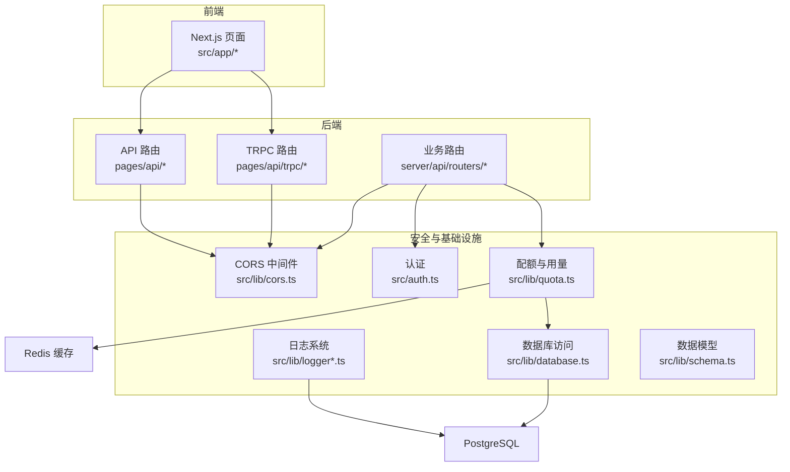
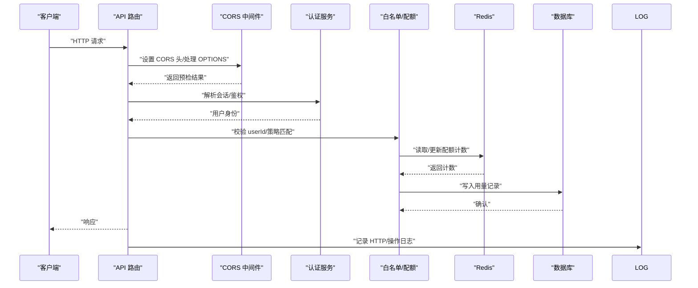
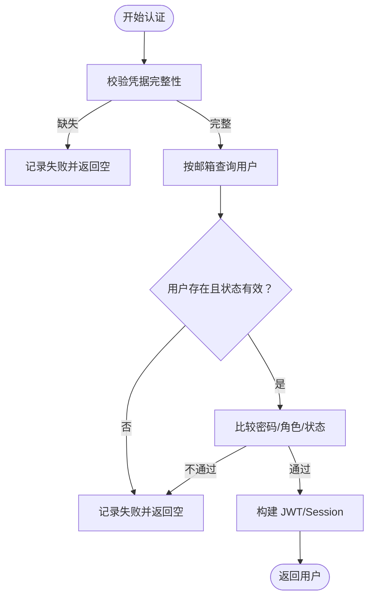
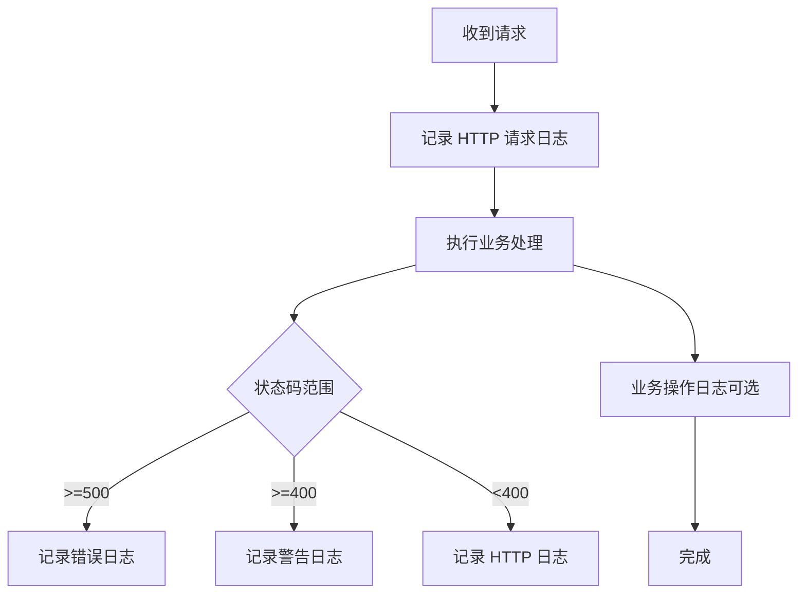
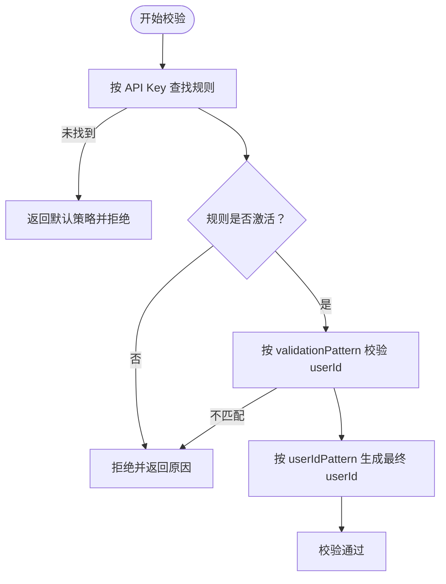
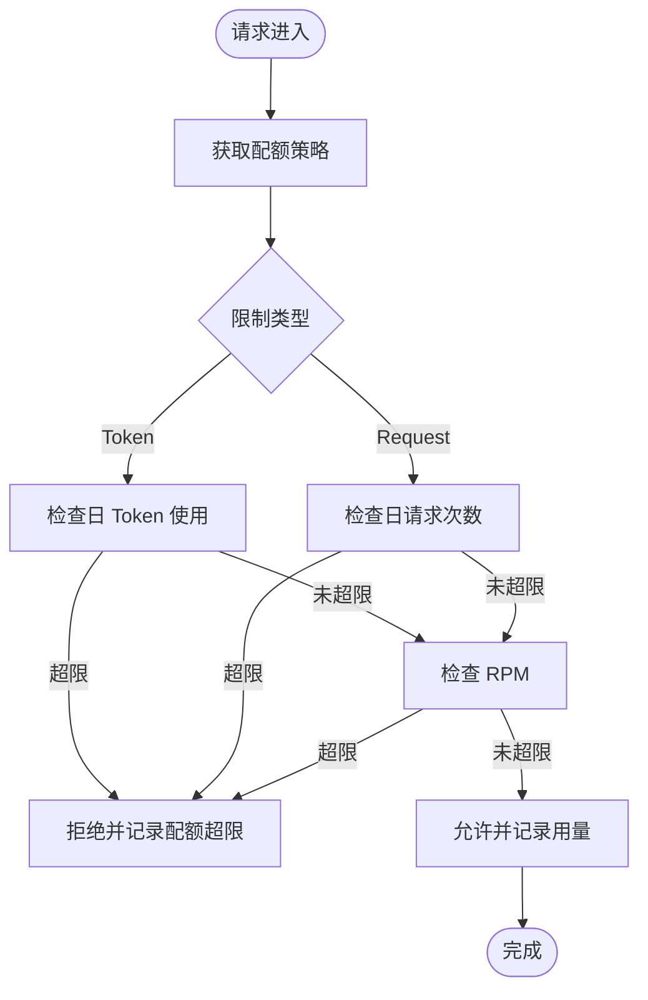
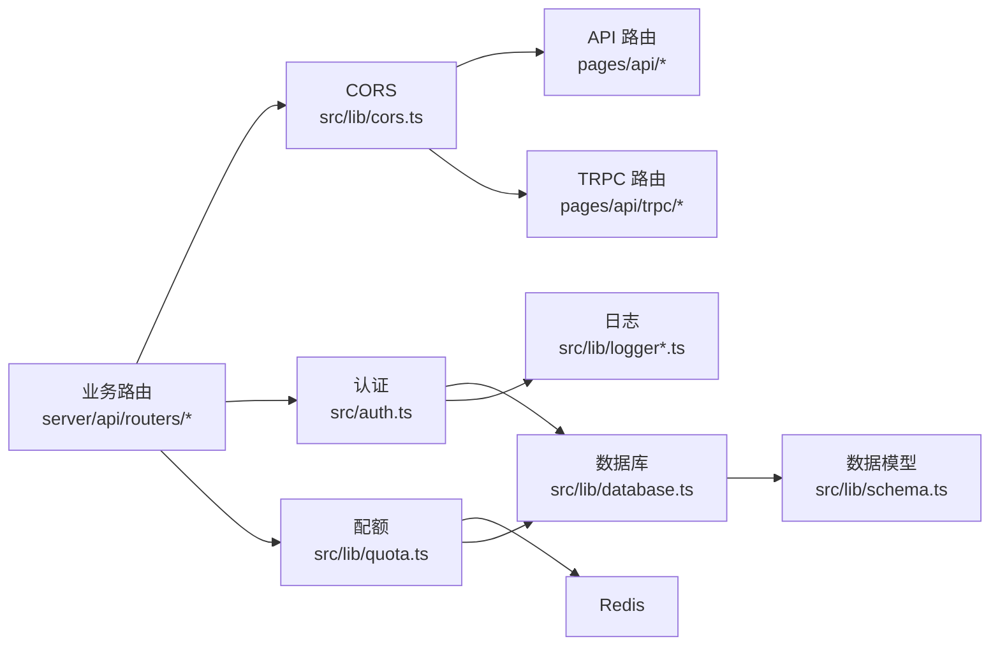

# 安全最佳实践

<cite>
**本文引用的文件**
- [src/lib/logger.ts](file://src/lib/logger.ts)
- [src/lib/logger-middleware.ts](file://src/lib/logger-middleware.ts)
- [src/lib/cors.ts](file://src/lib/cors.ts)
- [src/auth.ts](file://src/auth.ts)
- [src/app/api/auth/[...nextauth]/route.ts](file://src/app/api/auth/[...nextauth]/route.ts)
- [src/app/api/auth/register/route.ts](file://src/app/api/auth/register/route.ts)
- [src/lib/database.ts](file://src/lib/database.ts)
- [src/lib/schema.ts](file://src/lib/schema.ts)
- [src/lib/quota.ts](file://src/lib/quota.ts)
- [src/pages/api/ai/chat/stream.ts](file://src/pages/api/ai/chat/stream.ts)
- [src/pages/api/trpc/[trpc].ts](file://src/pages/api/trpc/[trpc].ts)
- [src/server/api/routers/ai.ts](file://src/server/api/routers/ai.ts)
- [package.json](file://package.json)
- [next.config.ts](file://next.config.ts)
</cite>

## 目录
1. [简介](#简介)
2. [项目结构](#项目结构)
3. [核心组件](#核心组件)
4. [架构总览](#架构总览)
5. [详细组件分析](#详细组件分析)
6. [依赖关系分析](#依赖关系分析)
7. [性能考量](#性能考量)
8. [故障排查指南](#故障排查指南)
9. [结论](#结论)
10. [附录](#附录)

## 简介
本指南面向 AIGate 项目，系统性梳理其安全实现与防护措施，覆盖输入验证、输出编码、安全头设置、日志与监控、常见威胁与防护、安全配置检查清单、定期安全审计建议以及应急响应流程。文档以代码为依据，结合架构图与流程图，帮助开发者与运维人员建立一致的安全基线。

## 项目结构
AIGate 采用 Next.js 应用结构，后端路由位于 pages/api 与 server/api/routers，安全相关能力集中在日志、CORS、认证与配额控制模块中。前端 UI 与仪表盘位于 src/app 下，数据持久化通过 Drizzle ORM 访问 PostgreSQL，用量与配额通过 Redis 缓存与计数。

图表来源
- [src/lib/logger.ts](file://src/lib/logger.ts#L1-L184)
- [src/lib/logger-middleware.ts](file://src/lib/logger-middleware.ts#L1-L138)
- [src/lib/cors.ts](file://src/lib/cors.ts#L1-L54)
- [src/auth.ts](file://src/auth.ts#L1-L114)
- [src/lib/quota.ts](file://src/lib/quota.ts#L1-L327)
- [src/lib/database.ts](file://src/lib/database.ts#L1-L692)
- [src/lib/schema.ts](file://src/lib/schema.ts#L1-L162)

章节来源
- [package.json](file://package.json#L1-L90)
- [next.config.ts](file://next.config.ts#L1-L9)

## 核心组件
- 认证与会话：基于 NextAuth 的凭据提供器，集中于认证选项与服务端会话获取。
- CORS：统一设置跨域响应头，处理预检请求。
- 日志：结构化日志，区分 HTTP、错误、配额、认证等类别，生产环境按日期轮转。
- 配额与用量：基于 Redis 的限流与配额检查，结合数据库用量记录。
- 白名单与用户校验：通过白名单规则对 userId 进行格式校验与生成。

章节来源
- [src/auth.ts](file://src/auth.ts#L1-L114)
- [src/lib/cors.ts](file://src/lib/cors.ts#L1-L54)
- [src/lib/logger.ts](file://src/lib/logger.ts#L1-L184)
- [src/lib/quota.ts](file://src/lib/quota.ts#L1-L327)
- [src/lib/database.ts](file://src/lib/database.ts#L421-L545)

## 架构总览
下图展示请求在系统中的关键安全路径：CORS 预检、认证授权、白名单校验、配额检查、用量记录与日志。

图表来源
- [src/lib/cors.ts](file://src/lib/cors.ts#L42-L53)
- [src/auth.ts](file://src/auth.ts#L84-L101)
- [src/lib/database.ts](file://src/lib/database.ts#L456-L545)
- [src/lib/quota.ts](file://src/lib/quota.ts#L78-L200)
- [src/lib/logger-middleware.ts](file://src/lib/logger-middleware.ts#L5-L29)

## 详细组件分析

### 认证与会话（NextAuth）
- 提供器：凭据提供器，要求邮箱与密码。
- 授权流程：校验用户存在、密码匹配、状态与角色，记录认证尝试与结果日志。
- 回调：将用户角色与状态注入 JWT 与 Session。
- 会话：提供服务端会话获取工具。

图表来源
- [src/auth.ts](file://src/auth.ts#L14-L81)

章节来源
- [src/auth.ts](file://src/auth.ts#L1-L114)
- [src/app/api/auth/[...nextauth]/route.ts](file://src/app/api/auth/[...nextauth]/route.ts#L1-L7)

### CORS 与安全头
- 动态 Origin：根据请求头设置允许来源，否则回退为通配。
- 方法与头：显式允许常用方法与典型头，包含 CSRF 相关头。
- 凭据：允许携带 Cookie。
- 预检缓存：设置最大缓存时间。
- 中间件：处理 OPTIONS 预检并结束响应。

章节来源
- [src/lib/cors.ts](file://src/lib/cors.ts#L1-L54)

### 日志与监控
- 结构化输出：控制台彩色输出与 JSON 文件输出。
- 分级与分类：HTTP、错误、配额、认证、AI 请求等专用日志。
- 中间件：自动记录请求方法、URL、状态码、UA、Referer、IP、耗时等。
- 文件轮转：生产环境按日期轮转，错误与 HTTP 分离存储。

图表来源
- [src/lib/logger-middleware.ts](file://src/lib/logger-middleware.ts#L5-L29)
- [src/lib/logger.ts](file://src/lib/logger.ts#L94-L102)

章节来源
- [src/lib/logger.ts](file://src/lib/logger.ts#L1-L184)
- [src/lib/logger-middleware.ts](file://src/lib/logger-middleware.ts#L1-L138)

### 白名单与用户校验
- 规则匹配：按优先级与状态匹配，支持正则校验与占位符生成最终 userId。
- 校验失败：返回明确原因，避免放行。
- 默认策略：无匹配时退回默认策略。

图表来源
- [src/lib/database.ts](file://src/lib/database.ts#L456-L545)

章节来源
- [src/lib/database.ts](file://src/lib/database.ts#L421-L545)
- [src/lib/schema.ts](file://src/lib/schema.ts#L85-L98)

### 配额与用量控制
- 策略来源：优先按 API Key 获取白名单规则与策略，否则使用默认策略。
- 限制维度：按日 Token 数、按日请求次数、每分钟请求次数（RPM）。
- 计数与记录：Redis 计数与过期策略，用量记录入库并写入日志。

图表来源
- [src/lib/quota.ts](file://src/lib/quota.ts#L78-L200)
- [src/lib/quota.ts](file://src/lib/quota.ts#L202-L260)

章节来源
- [src/lib/quota.ts](file://src/lib/quota.ts#L1-L327)

### 注册接口与输入校验
- 输入：接收 JSON，提取邮箱字段。
- 校验：若用户已存在返回 400；若系统未配置默认策略返回 500。
- 建议：补充更严格的邮箱格式校验与幂等性设计。

章节来源
- [src/app/api/auth/register/route.ts](file://src/app/api/auth/register/route.ts#L1-L30)

## 依赖关系分析
- 认证依赖：NextAuth、数据库用户查询、日志。
- CORS 依赖：统一响应头设置，被 API 与 TRPC 路由复用。
- 日志依赖：Winston、winston-daily-rotate-file，按环境输出。
- 配额依赖：Redis、数据库用量表、白名单规则与策略。
- 数据模型：Drizzle ORM 定义表结构与关系。

图表来源
- [src/auth.ts](file://src/auth.ts#L1-L114)
- [src/lib/cors.ts](file://src/lib/cors.ts#L1-L54)
- [src/lib/quota.ts](file://src/lib/quota.ts#L1-L327)
- [src/lib/database.ts](file://src/lib/database.ts#L1-L692)
- [src/lib/schema.ts](file://src/lib/schema.ts#L1-L162)

章节来源
- [package.json](file://package.json#L1-L90)

## 性能考量
- Redis 计数：使用原子自增与过期策略，降低数据库压力。
- 缓存策略：按 API Key 缓存配额策略，减少重复查询。
- 日志异步：文件写入与轮转在后台进行，避免阻塞请求。
- CORS 预检缓存：减少浏览器重复预检请求。

## 故障排查指南
- 认证失败：检查日志中“认证失败”条目，核对凭据、用户状态与角色。
- CORS 问题：确认响应头是否正确设置，预检是否提前返回。
- 配额超限：查看配额日志与 Redis 计数键，核对策略配置。
- HTTP 异常：根据状态码分级日志定位错误来源。
- 注册失败：检查默认配额策略是否存在与邮箱格式。

章节来源
- [src/lib/logger.ts](file://src/lib/logger.ts#L105-L183)
- [src/lib/logger-middleware.ts](file://src/lib/logger-middleware.ts#L32-L67)
- [src/lib/quota.ts](file://src/lib/quota.ts#L103-L156)

## 结论
AIGate 在安全方面具备较为完善的基础设施：统一的 CORS 处理、结构化的日志体系、基于策略的配额与用量控制、以及基于 NextAuth 的认证回调。建议在后续迭代中进一步强化输入校验、输出编码、安全头加固与审计追踪，形成闭环的安全运营体系。

## 附录

### 常见威胁与防护方法
- XSS：前端渲染需避免内联脚本与动态 HTML；后端输出到前端需进行上下文相关的编码与转义。
- CSRF：结合 SameSite Cookie、CSRF Token 与来源校验；CORS 已允许必要头，需确保服务端严格校验来源与令牌。
- 注入攻击：参数化查询与白名单校验；对用户输入进行最小权限与长度限制。
- 会话劫持：强密码策略、短会话与刷新机制、HTTPS 传输与安全 Cookie 属性。
- 速率限制：已实现 RPM 与日级限制，建议结合 IP 与 API Key 维度进行聚合限流。

### 安全配置检查清单
- CORS
  - 是否仅允许受信来源？
  - 是否开启凭据支持？
  - 预检缓存时间是否合理？
- 认证
  - NEXTAUTH_SECRET 是否安全？
  - 是否强制强密码与多因子？
  - 会话是否设置安全标志（Secure、SameSite、HttpOnly）？
- 日志
  - 生产环境是否启用 JSON 文件输出与轮转？
  - 是否记录敏感元数据（如用户 ID、Token）？
- 配额与用量
  - Redis 过期策略是否与业务周期匹配？
  - 是否对异常计数进行告警？
- 数据库
  - 是否使用只读账户执行查询？
  - 是否启用连接池与超时控制？

### 定期安全审计建议
- 代码审计：重点检查输入处理、权限判断、敏感操作日志。
- 配额策略评审：定期评估策略阈值与命中率，调整 RPM 与日限额。
- 第三方依赖：定期更新依赖版本，关注 CVE 与漏洞公告。
- 渗透测试：模拟常见攻击场景，验证防护有效性。

### 应急响应流程
- 发现安全事件：立即隔离受影响资源，冻结相关 API Key 与会话。
- 事件记录：在日志中记录事件详情与处置步骤，保留证据链。
- 根因分析：回溯认证、CORS、配额与用量路径，定位薄弱环节。
- 修复与加固：修复漏洞、收紧策略、增强监控与告警。
- 复盘与演练：完善应急预案，组织演练与培训。