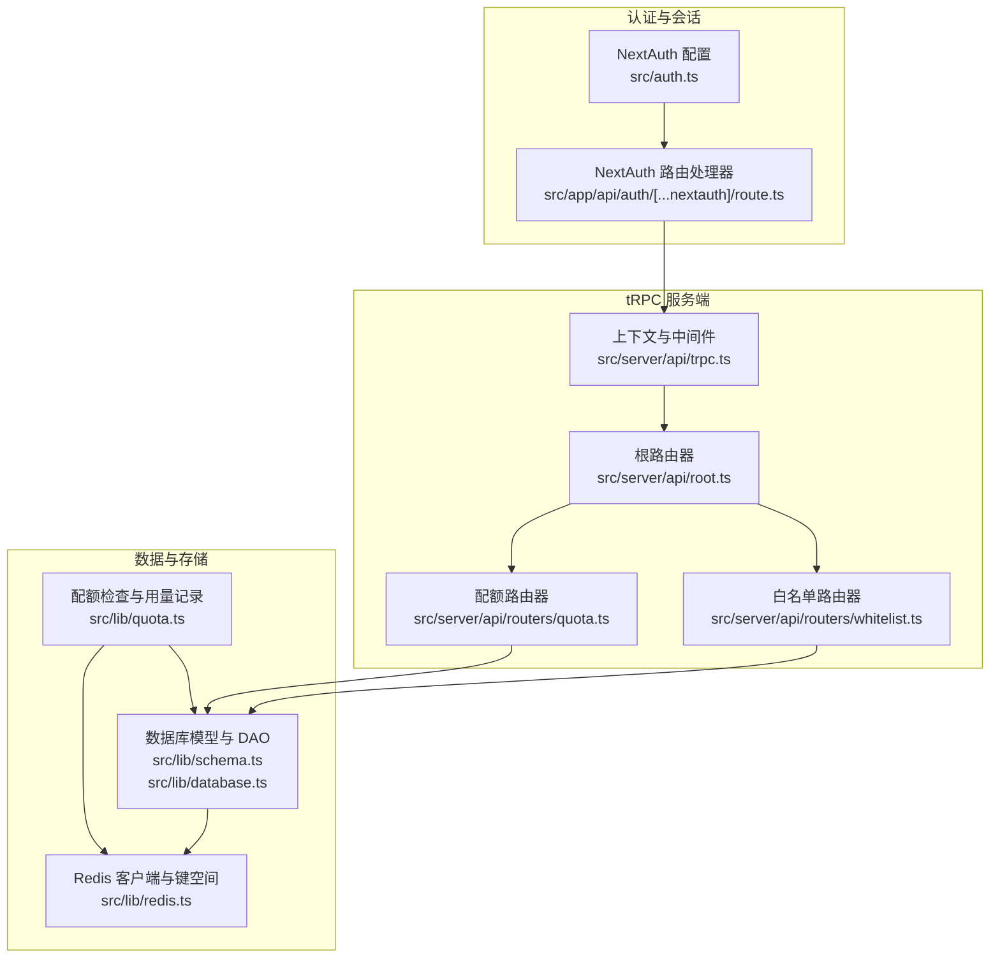
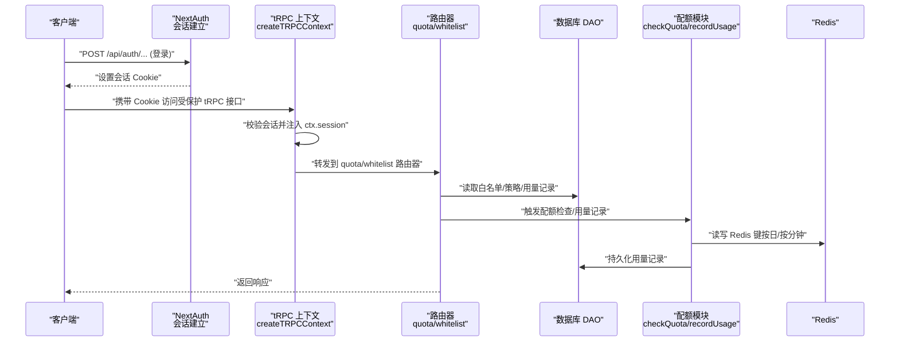
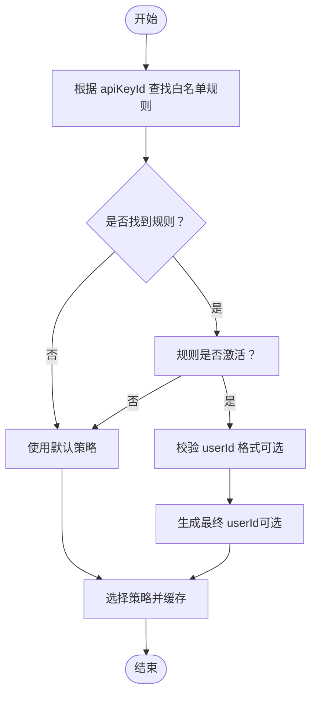
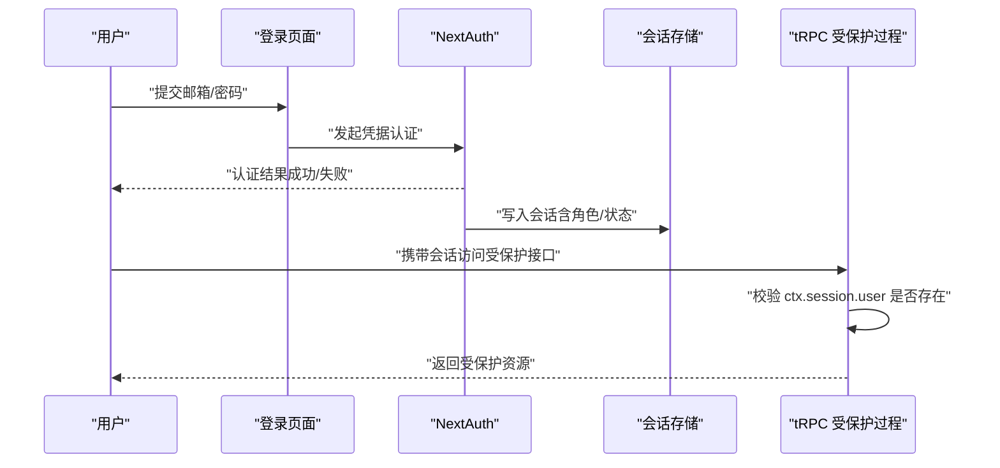
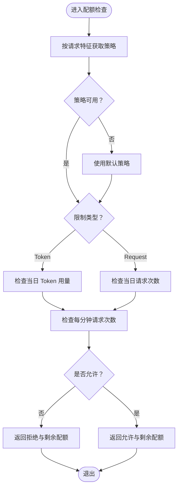
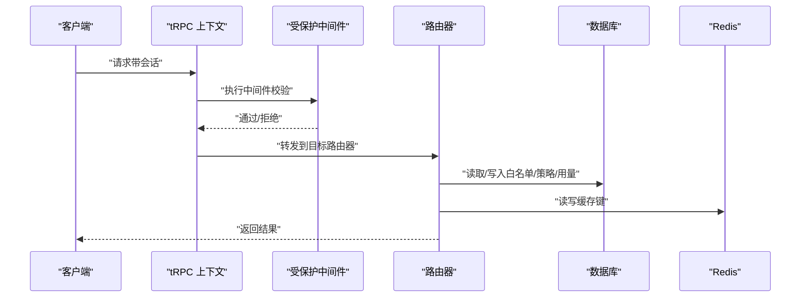
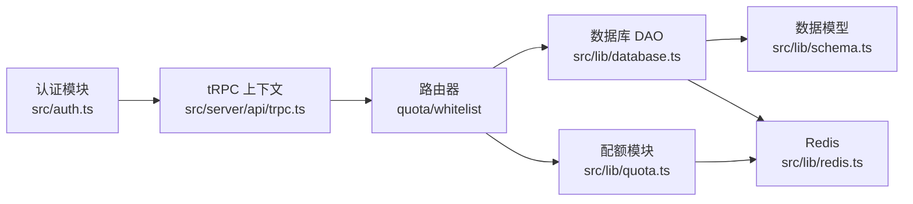

# 访问控制与权限管理

<cite>
**本文引用的文件**
- [src/lib/quota.ts](file://src/lib/quota.ts)
- [src/lib/database.ts](file://src/lib/database.ts)
- [src/lib/redis.ts](file://src/lib/redis.ts)
- [src/lib/schema.ts](file://src/lib/schema.ts)
- [src/auth.ts](file://src/auth.ts)
- [src/server/api/trpc.ts](file://src/server/api/trpc.ts)
- [src/server/api/root.ts](file://src/server/api/root.ts)
- [src/server/api/routers/quota.ts](file://src/server/api/routers/quota.ts)
- [src/server/api/routers/whitelist.ts](file://src/server/api/routers/whitelist.ts)
- [src/app/api/auth/[...nextauth]/route.ts](file://src/app/api/auth/[...nextauth]/route.ts)
- [src/types/api-key.ts](file://src/types/api-key.ts)
</cite>

## 目录
1. [简介](#简介)
2. [项目结构](#项目结构)
3. [核心组件](#核心组件)
4. [架构总览](#架构总览)
5. [组件详解](#组件详解)
6. [依赖关系分析](#依赖关系分析)
7. [性能考量](#性能考量)
8. [故障排查指南](#故障排查指南)
9. [结论](#结论)
10. [附录](#附录)

## 简介
本文件系统性梳理 AIGate 的访问控制与权限管理体系，覆盖以下方面：
- API Key 验证与白名单策略
- 用户角色与会话管理
- 配额系统（用户级限制、策略继承与缓存）
- tRPC 路由器中的权限检查与中间件
- 设计原理、实施方法与最佳实践
- 权限配置示例与常见问题排查

## 项目结构
围绕权限与配额的关键目录与文件如下：
- 认证与会话：NextAuth 配置与路由
- tRPC 服务端：上下文、中间件与路由器
- 数据层：数据库模型、DAO 与 Redis 键空间
- 配额与白名单：策略解析、用量记录与缓存清理

图表来源
- [src/auth.ts](file://src/auth.ts#L1-L114)
- [src/app/api/auth/[...nextauth]/route.ts](file://src/app/api/auth/[...nextauth]/route.ts#L1-L7)
- [src/server/api/trpc.ts](file://src/server/api/trpc.ts#L1-L153)
- [src/server/api/root.ts](file://src/server/api/root.ts#L1-L25)
- [src/server/api/routers/quota.ts](file://src/server/api/routers/quota.ts#L1-L221)
- [src/server/api/routers/whitelist.ts](file://src/server/api/routers/whitelist.ts#L1-L222)
- [src/lib/schema.ts](file://src/lib/schema.ts#L1-L162)
- [src/lib/database.ts](file://src/lib/database.ts#L1-L692)
- [src/lib/redis.ts](file://src/lib/redis.ts#L1-L43)
- [src/lib/quota.ts](file://src/lib/quota.ts#L1-L327)

章节来源
- [src/server/api/root.ts](file://src/server/api/root.ts#L1-L25)
- [src/server/api/trpc.ts](file://src/server/api/trpc.ts#L1-L153)

## 核心组件
- 认证与会话（NextAuth）
  - 提供基于凭据的登录流程，返回用户角色与状态，用于后续授权判断。
- tRPC 中间件与路由器
  - 提供受保护过程与基础上下文，结合会话信息进行授权。
- 白名单与配额策略
  - 基于 API Key 绑定的白名单规则，解析用户标识并选择对应配额策略。
- 配额检查与用量记录
  - 基于 Redis 的高并发配额检查与用量统计，支持按日/按分钟维度。
- 数据模型与 DAO
  - 定义用户、API Key、配额策略、白名单规则与用量记录的数据结构与数据库操作。

章节来源
- [src/auth.ts](file://src/auth.ts#L1-L114)
- [src/server/api/trpc.ts](file://src/server/api/trpc.ts#L128-L152)
- [src/lib/database.ts](file://src/lib/database.ts#L293-L579)
- [src/lib/quota.ts](file://src/lib/quota.ts#L1-L327)
- [src/lib/schema.ts](file://src/lib/schema.ts#L28-L98)

## 架构总览
下图展示从客户端到 tRPC、再到数据库与 Redis 的整体调用链路与权限控制点：

图表来源
- [src/app/api/auth/[...nextauth]/route.ts](file://src/app/api/auth/[...nextauth]/route.ts#L1-L7)
- [src/server/api/trpc.ts](file://src/server/api/trpc.ts#L65-L75)
- [src/server/api/routers/quota.ts](file://src/server/api/routers/quota.ts#L41-L87)
- [src/server/api/routers/whitelist.ts](file://src/server/api/routers/whitelist.ts#L24-L169)
- [src/lib/quota.ts](file://src/lib/quota.ts#L78-L200)
- [src/lib/database.ts](file://src/lib/database.ts#L332-L352)
- [src/lib/redis.ts](file://src/lib/redis.ts#L18-L42)

## 组件详解

### 1) API Key 验证与白名单策略
- API Key 绑定白名单规则
  - 每个 API Key 仅能绑定一条白名单规则；当请求到达时，系统根据 API Key 查找其绑定的规则。
- 用户标识校验与生成
  - 若规则启用校验，使用正则对传入 userId 进行格式校验；若配置了 userIdPattern，可将占位符替换为实际值（如 @user_id、@api_key、@ip）生成最终用户标识。
- 策略选择与缓存
  - 通过 JOIN 查询直接返回策略对象，并缓存策略键，避免重复查询数据库。

图表来源
- [src/lib/database.ts](file://src/lib/database.ts#L332-L352)
- [src/lib/database.ts](file://src/lib/database.ts#L456-L545)
- [src/lib/quota.ts](file://src/lib/quota.ts#L18-L57)

章节来源
- [src/lib/database.ts](file://src/lib/database.ts#L317-L352)
- [src/lib/database.ts](file://src/lib/database.ts#L456-L545)
- [src/lib/quota.ts](file://src/lib/quota.ts#L18-L57)

### 2) 用户角色与会话管理
- NextAuth 凭据登录
  - 校验邮箱、密码与状态，返回包含角色与状态的用户信息。
- 会话回调
  - 将用户角色与状态注入 JWT 与 Session，供 tRPC 中间件读取。
- tRPC 受保护过程
  - 通过中间件校验会话是否存在，确保仅登录用户可访问。

图表来源
- [src/auth.ts](file://src/auth.ts#L14-L81)
- [src/auth.ts](file://src/auth.ts#L84-L101)
- [src/server/api/trpc.ts](file://src/server/api/trpc.ts#L128-L139)
- [src/app/api/auth/[...nextauth]/route.ts](file://src/app/api/auth/[...nextauth]/route.ts#L1-L7)

章节来源
- [src/auth.ts](file://src/auth.ts#L1-L114)
- [src/server/api/trpc.ts](file://src/server/api/trpc.ts#L128-L139)

### 3) 配额系统：权限控制与策略继承
- 策略继承与默认回退
  - 当未找到白名单规则或策略查询失败时，回退到默认策略。
- 限制类型与检查逻辑
  - 支持按 Token 或按请求次数两种模式；均检查当日用量与每分钟请求次数（RPM）。
- 用量记录与日志
  - 记录用量时同时更新 Redis 计数与过期时间，并持久化到数据库。
- 策略变更后的缓存清理
  - 更新/删除策略后扫描并清理相关缓存键，保证策略生效即时性。

图表来源
- [src/lib/quota.ts](file://src/lib/quota.ts#L59-L76)
- [src/lib/quota.ts](file://src/lib/quota.ts#L78-L200)
- [src/lib/quota.ts](file://src/lib/quota.ts#L202-L260)
- [src/server/api/routers/quota.ts](file://src/server/api/routers/quota.ts#L15-L37)

章节来源
- [src/lib/quota.ts](file://src/lib/quota.ts#L1-L327)
- [src/server/api/routers/quota.ts](file://src/server/api/routers/quota.ts#L1-L221)

### 4) tRPC 路由器中的权限检查与中间件
- 上下文创建
  - 从 NextAuth 会话中提取用户信息，注入到 tRPC 上下文中。
- 受保护过程
  - 通过中间件校验会话用户是否存在，未登录则返回未授权错误。
- 白名单与配额相关接口
  - 配额与白名单路由器均使用受保护过程，确保只有登录用户可调用。
- 策略变更后的缓存清理
  - 在更新/删除策略后，扫描并清理与 API Key 相关的 Redis 缓存键。

图表来源
- [src/server/api/trpc.ts](file://src/server/api/trpc.ts#L65-L75)
- [src/server/api/trpc.ts](file://src/server/api/trpc.ts#L128-L139)
- [src/server/api/routers/quota.ts](file://src/server/api/routers/quota.ts#L15-L37)
- [src/server/api/routers/whitelist.ts](file://src/server/api/routers/whitelist.ts#L66-L102)

章节来源
- [src/server/api/trpc.ts](file://src/server/api/trpc.ts#L1-L153)
- [src/server/api/routers/quota.ts](file://src/server/api/routers/quota.ts#L1-L221)
- [src/server/api/routers/whitelist.ts](file://src/server/api/routers/whitelist.ts#L1-L222)

### 5) 数据模型与权限相关字段
- 用户表
  - 角色（USER/ADMIN）、状态（ACTIVE/INACTIVE/SUSPENDED）等字段用于会话与授权判断。
- API Key 表
  - 提供者、密钥、状态等，支撑上游服务调用与白名单绑定。
- 白名单规则表
  - 策略名称、优先级、状态、校验正则、用户 ID 模式、API Key 绑定等。
- 配额策略表
  - 限制类型（token/request）、每日/每月限额、每分钟请求上限等。
- 用量记录表
  - 记录每次请求的 Token 消耗、提供商、地区、客户端 IP 等。

章节来源
- [src/lib/schema.ts](file://src/lib/schema.ts#L71-L98)
- [src/lib/schema.ts](file://src/lib/schema.ts#L42-L68)
- [src/lib/schema.ts](file://src/lib/schema.ts#L85-L98)
- [src/lib/schema.ts](file://src/lib/schema.ts#L28-L40)
- [src/lib/schema.ts](file://src/lib/schema.ts#L54-L68)

### 6) 权限配置示例（步骤说明）
- 创建配额策略
  - 选择限制类型（Token 或 Request），设置相应限额；保存后立即生效。
- 绑定 API Key 与白名单规则
  - 为 API Key 绑定一条白名单规则；规则启用校验时，可配置 userId 格式与用户 ID 生成模式。
- 用户访问与用量记录
  - 客户端携带 API Key 发起请求；系统根据 API Key 解析策略并进行配额检查；成功后记录用量。
- 策略变更与缓存清理
  - 更新或删除策略后，系统自动清理相关缓存键，确保新策略即时生效。

章节来源
- [src/server/api/routers/quota.ts](file://src/server/api/routers/quota.ts#L103-L140)
- [src/server/api/routers/whitelist.ts](file://src/server/api/routers/whitelist.ts#L66-L102)
- [src/lib/quota.ts](file://src/lib/quota.ts#L202-L260)
- [src/server/api/routers/quota.ts](file://src/server/api/routers/quota.ts#L15-L37)

## 依赖关系分析
- 组件耦合
  - tRPC 路由器依赖数据库 DAO 与配额模块；配额模块依赖 Redis 与数据库；认证模块为 tRPC 中间件提供会话数据。
- 外部依赖
  - NextAuth（会话）、Redis（缓存）、PostgreSQL（Drizzle ORM）。
- 循环依赖
  - 未发现循环导入；模块职责清晰，分层明确。

图表来源
- [src/auth.ts](file://src/auth.ts#L1-L114)
- [src/server/api/trpc.ts](file://src/server/api/trpc.ts#L1-L153)
- [src/server/api/routers/quota.ts](file://src/server/api/routers/quota.ts#L1-L221)
- [src/server/api/routers/whitelist.ts](file://src/server/api/routers/whitelist.ts#L1-L222)
- [src/lib/database.ts](file://src/lib/database.ts#L1-L692)
- [src/lib/schema.ts](file://src/lib/schema.ts#L1-L162)
- [src/lib/quota.ts](file://src/lib/quota.ts#L1-L327)
- [src/lib/redis.ts](file://src/lib/redis.ts#L1-L43)

## 性能考量
- 缓存策略
  - 配额策略按 API Key 缓存 1 小时；Redis 键按日/按分钟命名，便于过期与清理。
- 并发与原子性
  - 使用 Redis 自增与过期控制，保障高并发场景下的计数一致性。
- 扫描清理
  - 策略变更时使用 SCAN + DEL 清理相关缓存键，避免阻塞主流程。
- 数据库负载
  - 白名单规则与策略通过 JOIN 查询一次性返回，减少往返；DAO 层统一处理异常与默认值。

章节来源
- [src/lib/quota.ts](file://src/lib/quota.ts#L18-L57)
- [src/lib/quota.ts](file://src/lib/quota.ts#L202-L260)
- [src/server/api/routers/quota.ts](file://src/server/api/routers/quota.ts#L15-L37)
- [src/lib/redis.ts](file://src/lib/redis.ts#L18-L42)

## 故障排查指南
- 登录失败
  - 检查凭据是否完整、用户状态是否为 ACTIVE、角色是否为 ADMIN；查看日志输出定位错误原因。
- 未授权访问
  - 确认请求是否携带有效会话 Cookie；检查受保护中间件是否正确注入 ctx.session。
- 配额检查失败
  - 查看配额检查返回的拒绝原因与剩余配额；确认策略是否正确绑定 API Key；检查 Redis 键是否存在与过期时间。
- 策略未生效
  - 确认策略更新/删除后是否触发缓存清理；检查 Redis 中策略键是否被清理。
- 白名单规则不生效
  - 检查规则状态是否为 active；校验正则是否有效；确认 userIdPattern 占位符替换是否正确。

章节来源
- [src/auth.ts](file://src/auth.ts#L14-L81)
- [src/server/api/trpc.ts](file://src/server/api/trpc.ts#L128-L139)
- [src/lib/quota.ts](file://src/lib/quota.ts#L78-L200)
- [src/server/api/routers/quota.ts](file://src/server/api/routers/quota.ts#L15-L37)
- [src/lib/database.ts](file://src/lib/database.ts#L456-L545)

## 结论
AIGate 的权限体系以“API Key + 白名单 + 配额策略”为核心，结合 NextAuth 会话与 tRPC 中间件，实现了细粒度的访问控制与高并发的配额管理。通过 Redis 缓存与数据库 DAO 的协同，系统在保证实时性的同时具备良好的扩展性。建议在生产环境中持续监控 Redis 缓存命中率与数据库负载，并定期审查白名单规则与配额策略，确保安全与性能的平衡。

## 附录
- API Key 类型定义参考：[src/types/api-key.ts](file://src/types/api-key.ts#L1-L21)
- tRPC 根路由器注册：[src/server/api/root.ts](file://src/server/api/root.ts#L14-L21)