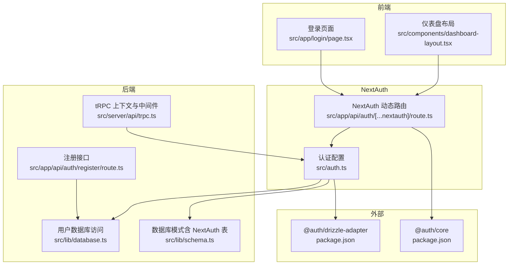
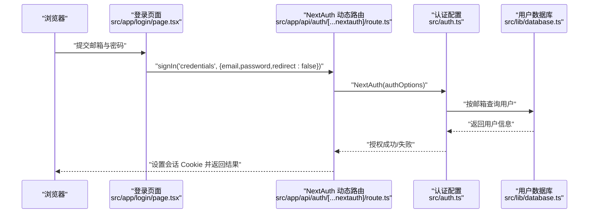
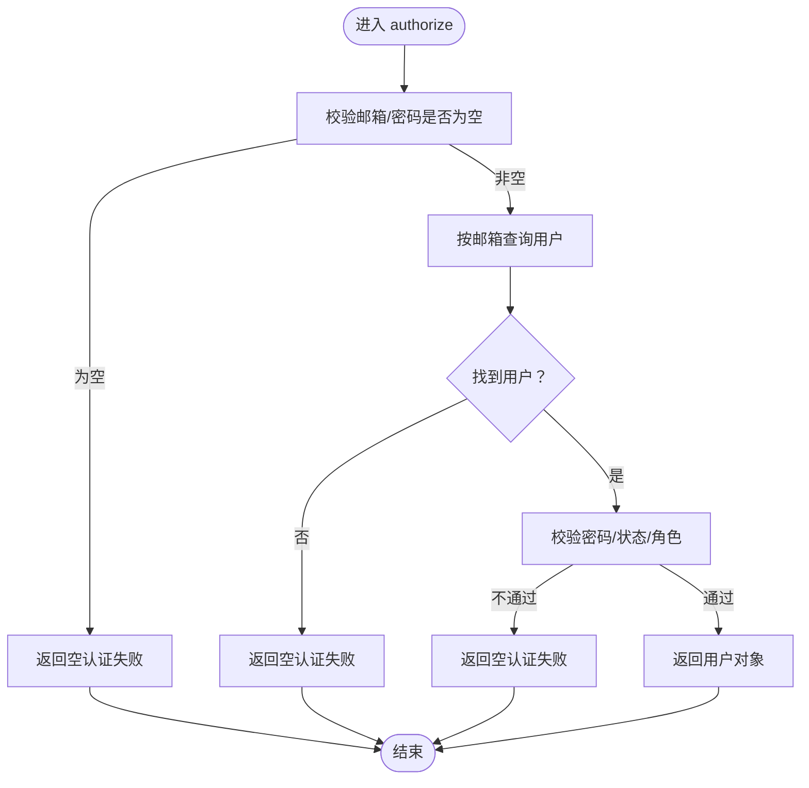
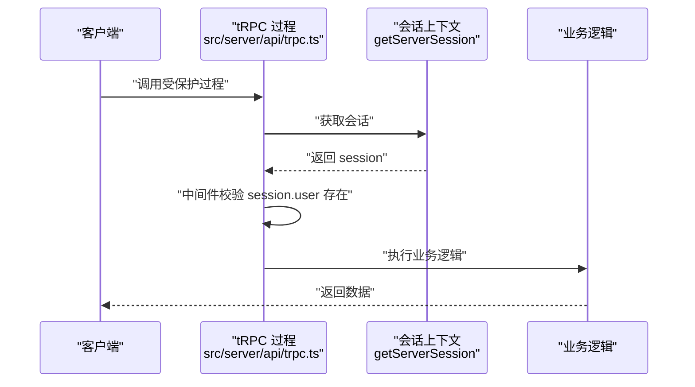
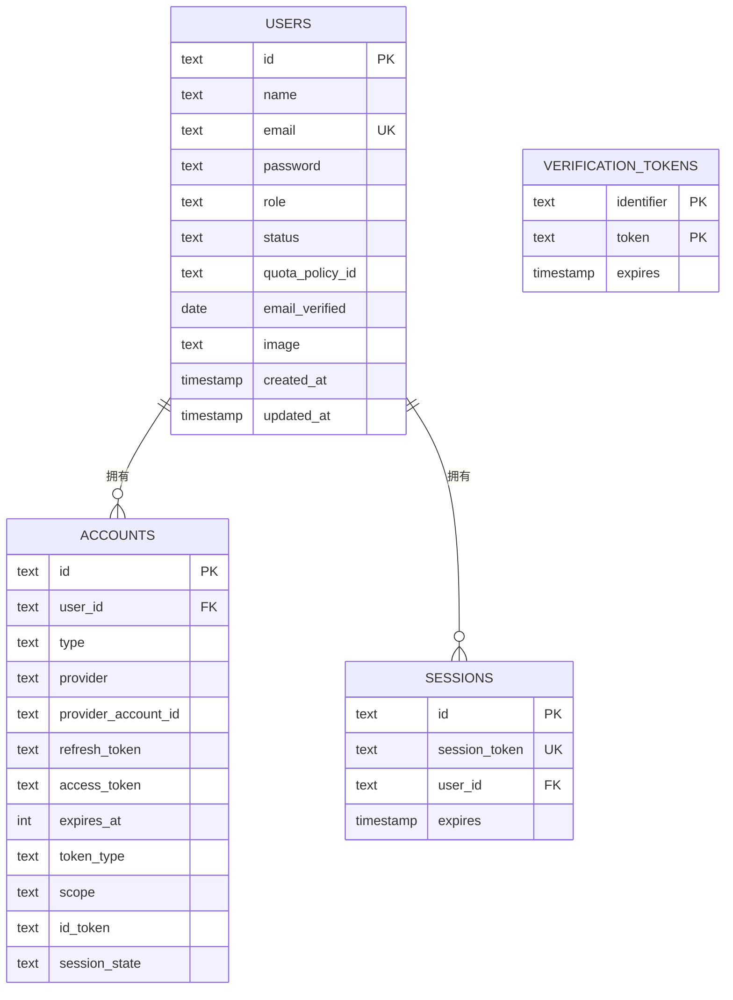
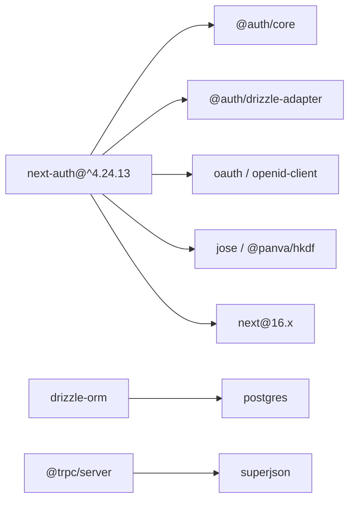

# 身份验证系统

<cite>
**本文引用的文件**
- [src/auth.ts](file://src/auth.ts)
- [src/app/api/auth/[...nextauth]/route.ts](file://src/app/api/auth/[...nextauth]/route.ts)
- [src/app/login/page.tsx](file://src/app/login/page.tsx)
- [src/app/api/auth/register/route.ts](file://src/app/api/auth/register/route.ts)
- [src/server/api/trpc.ts](file://src/server/api/trpc.ts)
- [src/lib/database.ts](file://src/lib/database.ts)
- [src/lib/schema.ts](file://src/lib/schema.ts)
- [src/components/dashboard-layout.tsx](file://src/components/dashboard-layout.tsx)
- [package.json](file://package.json)
- [next.config.ts](file://next.config.ts)
</cite>

## 目录
1. [简介](#简介)
2. [项目结构](#项目结构)
3. [核心组件](#核心组件)
4. [架构总览](#架构总览)
5. [详细组件分析](#详细组件分析)
6. [依赖关系分析](#依赖关系分析)
7. [性能考虑](#性能考虑)
8. [故障排除指南](#故障排除指南)
9. [结论](#结论)

## 简介
本文件面向 AIGate 身份验证系统，基于 NextAuth.js 实现的凭证登录与会话管理。当前系统以“管理员凭证登录”为核心能力，支持 JWT 与会话回调扩展用户角色与状态信息；同时结合 tRPC 中间件实现后端访问控制。本文将系统性说明认证流程、登录/登出机制、会话持久化策略、注册接口现状与扩展建议、权限检查机制以及安全最佳实践。

## 项目结构
与身份验证直接相关的目录与文件如下：
- NextAuth 配置与路由
  - 认证配置：src/auth.ts
  - NextAuth 动态路由：src/app/api/auth/[...nextauth]/route.ts
  - 登录页面：src/app/login/page.tsx
  - 注册接口：src/app/api/auth/register/route.ts
- 后端集成与权限控制
  - tRPC 上下文与受保护过程：src/server/api/trpc.ts
  - 用户数据库访问：src/lib/database.ts
  - 数据库模式（含 NextAuth 表）：src/lib/schema.ts
- 依赖与构建配置
  - 依赖声明：package.json
  - Next.js 构建配置：next.config.ts

**图表来源**
- [src/auth.ts](file://src/auth.ts#L1-L114)
- [src/app/api/auth/[...nextauth]/route.ts](file://src/app/api/auth/[...nextauth]/route.ts#L1-L7)
- [src/app/login/page.tsx](file://src/app/login/page.tsx#L1-L119)
- [src/app/api/auth/register/route.ts](file://src/app/api/auth/register/route.ts#L1-L30)
- [src/server/api/trpc.ts](file://src/server/api/trpc.ts#L1-L153)
- [src/lib/database.ts](file://src/lib/database.ts#L581-L691)
- [src/lib/schema.ts](file://src/lib/schema.ts#L100-L137)
- [package.json](file://package.json#L18-L67)

**章节来源**
- [src/auth.ts](file://src/auth.ts#L1-L114)
- [src/app/api/auth/[...nextauth]/route.ts](file://src/app/api/auth/[...nextauth]/route.ts#L1-L7)
- [src/app/login/page.tsx](file://src/app/login/page.tsx#L1-L119)
- [src/app/api/auth/register/route.ts](file://src/app/api/auth/register/route.ts#L1-L30)
- [src/server/api/trpc.ts](file://src/server/api/trpc.ts#L1-L153)
- [src/lib/database.ts](file://src/lib/database.ts#L581-L691)
- [src/lib/schema.ts](file://src/lib/schema.ts#L100-L137)
- [package.json](file://package.json#L18-L67)
- [next.config.ts](file://next.config.ts#L1-L9)

## 核心组件
- NextAuth 配置与回调
  - 提供商：凭证登录（Credentials Provider）
  - 回调：jwt 与 session，将用户角色与状态写入 token 与 session
  - 页面：登录页与错误页重定向
  - 密钥：NEXTAUTH_SECRET
- NextAuth 动态路由
  - 暴露 GET/POST，统一处理 NextAuth 请求
- 登录页面
  - 使用 next-auth/react 的 signIn 方法提交凭证
- tRPC 上下文与受保护过程
  - 通过 getServerSession 注入会话上下文
  - 受保护过程在中间件中校验会话有效性
- 用户数据库访问
  - 支持按邮箱查询用户、创建用户、更新密码等
- 数据库模式
  - 定义 users 表及 NextAuth 相关表（accounts、sessions、verification_tokens）

**章节来源**
- [src/auth.ts](file://src/auth.ts#L6-L107)
- [src/app/api/auth/[...nextauth]/route.ts](file://src/app/api/auth/[...nextauth]/route.ts#L1-L7)
- [src/app/login/page.tsx](file://src/app/login/page.tsx#L20-L43)
- [src/server/api/trpc.ts](file://src/server/api/trpc.ts#L65-L75)
- [src/lib/database.ts](file://src/lib/database.ts#L581-L691)
- [src/lib/schema.ts](file://src/lib/schema.ts#L70-L137)

## 架构总览
下面的序列图展示了从浏览器发起登录到服务端建立会话的完整流程，以及后续请求如何通过 tRPC 中间件获取会话上下文。

**图表来源**
- [src/app/login/page.tsx](file://src/app/login/page.tsx#L20-L43)
- [src/app/api/auth/[...nextauth]/route.ts](file://src/app/api/auth/[...nextauth]/route.ts#L1-L7)
- [src/auth.ts](file://src/auth.ts#L14-L82)
- [src/lib/database.ts](file://src/lib/database.ts#L584-L592)

## 详细组件分析

### NextAuth 配置与回调
- 凭证提供商
  - 接收邮箱与密码字段
  - 校验逻辑：邮箱存在、密码一致、状态为 ACTIVE、角色为 ADMIN
  - 开发环境保留测试用户作为备选
- 回调
  - jwt：将用户 id、role、status 写入 token
  - session：将 token 中的用户信息注入 session.user
- 页面与密钥
  - 登录页与错误页重定向至 /login
  - 使用 NEXTAUTH_SECRET 或回退密钥

**图表来源**
- [src/auth.ts](file://src/auth.ts#L14-L82)

**章节来源**
- [src/auth.ts](file://src/auth.ts#L6-L107)

### NextAuth 动态路由
- 统一处理 NextAuth 的 GET/POST 请求
- 引用全局 authOptions

**章节来源**
- [src/app/api/auth/[...nextauth]/route.ts](file://src/app/api/auth/[...nextauth]/route.ts#L1-L7)

### 登录页面
- 使用 next-auth/react 的 signIn 方法提交凭证
- redirect: false 以便前端自行处理跳转
- 成功后跳转首页并刷新

**章节来源**
- [src/app/login/page.tsx](file://src/app/login/page.tsx#L20-L43)

### tRPC 上下文与受保护过程
- createTRPCContext：通过 getServerSession 注入会话
- protectedProcedure：中间件校验 ctx.session.user 是否存在，否则抛出 UNAUTHORIZED

**图表来源**
- [src/server/api/trpc.ts](file://src/server/api/trpc.ts#L65-L75)
- [src/server/api/trpc.ts](file://src/server/api/trpc.ts#L128-L139)

**章节来源**
- [src/server/api/trpc.ts](file://src/server/api/trpc.ts#L65-L75)
- [src/server/api/trpc.ts](file://src/server/api/trpc.ts#L128-L139)

### 用户数据库访问与模式
- 用户数据库操作
  - getByEmail：按邮箱查询用户
  - create/update/delete：用户 CRUD
  - updatePassword：更新用户密码
- NextAuth 相关表
  - accounts、sessions、verification_tokens

**图表来源**
- [src/lib/schema.ts](file://src/lib/schema.ts#L70-L137)

**章节来源**
- [src/lib/database.ts](file://src/lib/database.ts#L581-L691)
- [src/lib/schema.ts](file://src/lib/schema.ts#L70-L137)

### 注册流程与扩展建议
- 当前注册接口
  - 接收邮箱，检查是否存在
  - 若无默认配额策略则返回错误
  - 未实际创建用户（返回成功占位）
- 建议扩展
  - 校验邮箱格式与唯一性
  - 生成默认配额策略关联
  - 生成用户 ID 与初始状态
  - 返回新用户信息或错误详情

**章节来源**
- [src/app/api/auth/register/route.ts](file://src/app/api/auth/register/route.ts#L1-L30)

### 登出机制
- 仪表盘布局中使用 signOut 并指定回调 URL 为 /login

**章节来源**
- [src/components/dashboard-layout.tsx](file://src/components/dashboard-layout.tsx#L174-L183)

## 依赖关系分析
- NextAuth 核心与适配器
  - @auth/core 与 @auth/drizzle-adapter 由 next-auth 间接引入
- Next.js 与运行时
  - next 16.x、react 19.x
- Drizzle ORM 与数据库
  - drizzle-orm、postgres
- 其他工具
  - redis、winston 日志、uuid、nanoid 等

**图表来源**
- [package.json](file://package.json#L18-L67)

**章节来源**
- [package.json](file://package.json#L18-L67)

## 性能考虑
- 会话存储
  - 当前使用 NextAuth 默认会话存储（基于数据库适配器）。若需降低延迟，可评估将会话缓存至 Redis（需扩展适配器或中间件）
- 密钥轮换
  - 更换 NEXTAUTH_SECRET 会导致现有会话失效，建议在维护窗口内滚动密钥并通知用户重新登录
- 数据库查询
  - 用户查询按邮箱唯一索引进行，注意在高并发场景下对 users.email 建立高效索引
- tRPC 上下文
  - createTRPCContext 每次请求都会调用 getServerSession，建议确保会话读取路径高效

[本节为通用指导，无需特定文件来源]

## 故障排除指南
- 登录失败
  - 检查邮箱/密码是否为空
  - 确认用户状态为 ACTIVE 且角色为 ADMIN
  - 查看日志输出定位错误
- 会话无效
  - 确认 NEXTAUTH_SECRET 设置正确
  - 检查 cookies 是否被浏览器拒绝或跨域策略
- tRPC 抛出 UNAUTHORIZED
  - 确认前端已登录且会话有效
  - 检查受保护过程的中间件链路
- 注册接口报错
  - 系统尚未配置默认配额策略
  - 建议先初始化默认配额策略后再调用注册

**章节来源**
- [src/auth.ts](file://src/auth.ts#L14-L82)
- [src/server/api/trpc.ts](file://src/server/api/trpc.ts#L128-L139)
- [src/app/api/auth/register/route.ts](file://src/app/api/auth/register/route.ts#L18-L22)

## 结论
AIGate 的身份验证系统以 NextAuth.js 为基础，采用凭证登录与 JWT/Session 回调扩展用户角色与状态，结合 tRPC 中间件实现后端访问控制。当前系统聚焦管理员凭证登录，注册流程处于占位阶段，建议后续完善注册、密码重置与邮箱验证等能力。在安全方面，建议强化 CSRF 保护、会话安全与令牌刷新策略，并在生产环境中优化会话存储与密钥轮换流程。