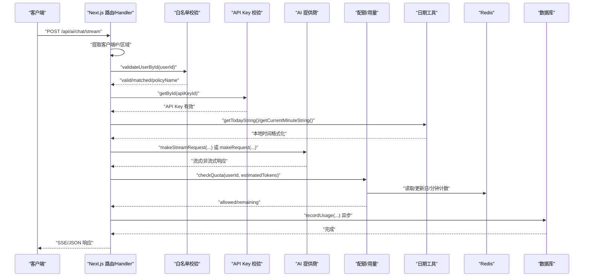
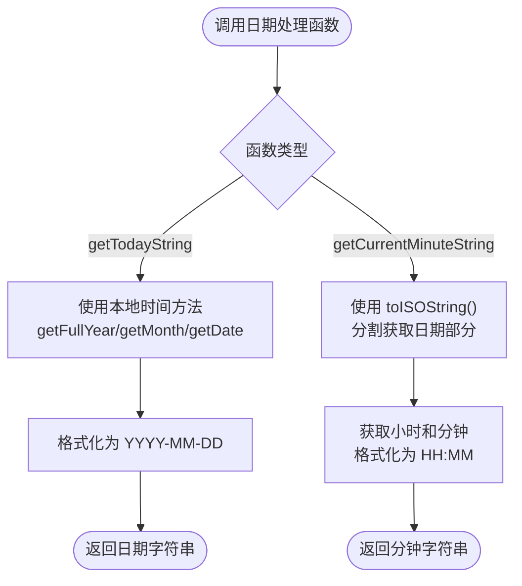
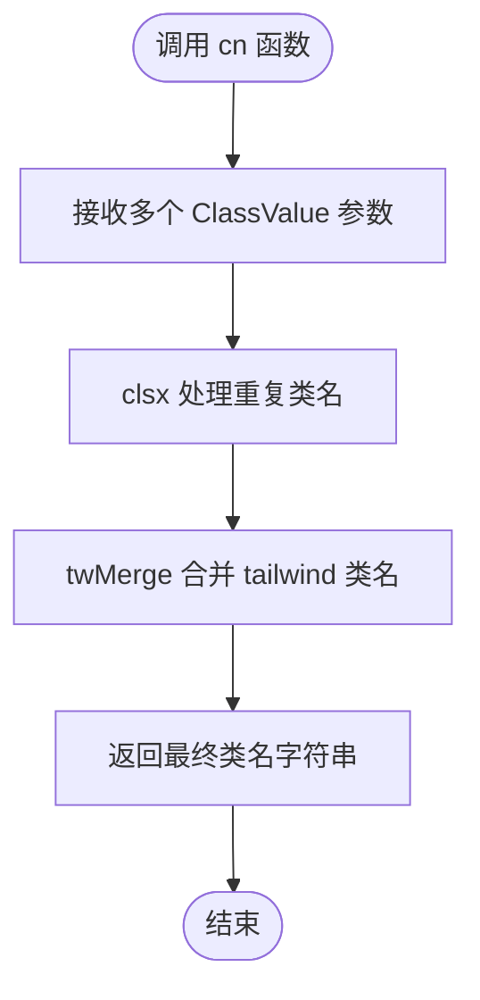
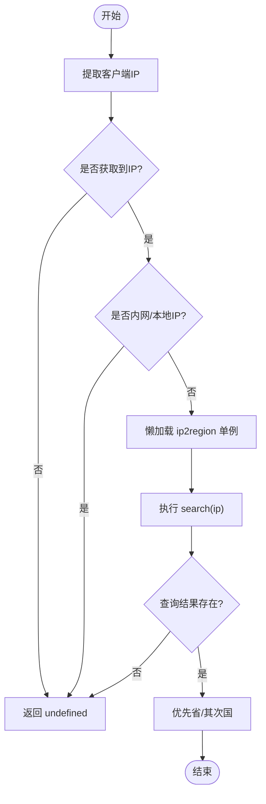
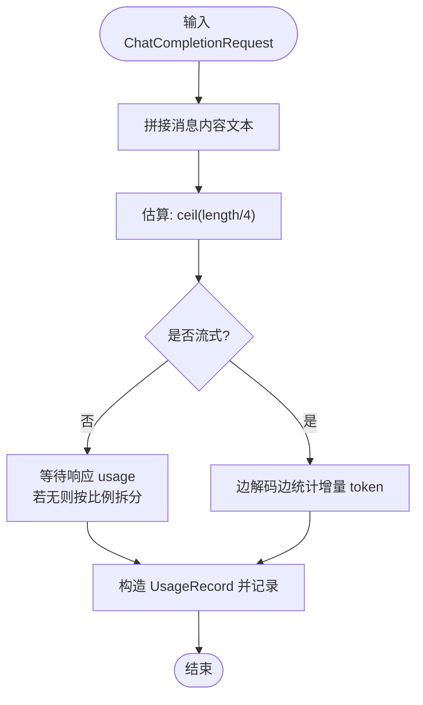
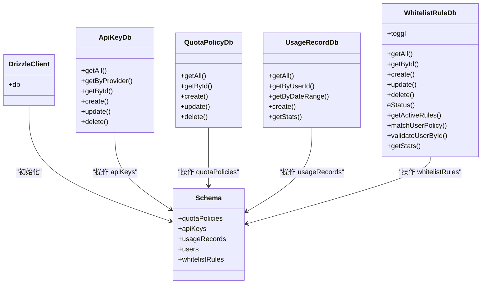
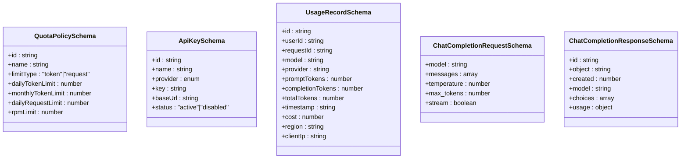
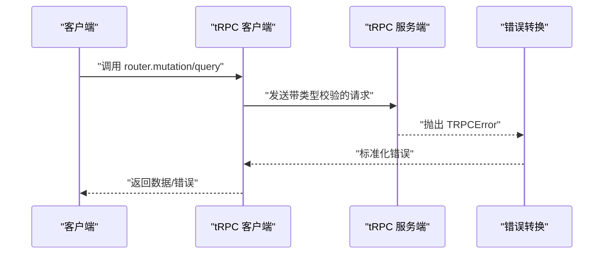
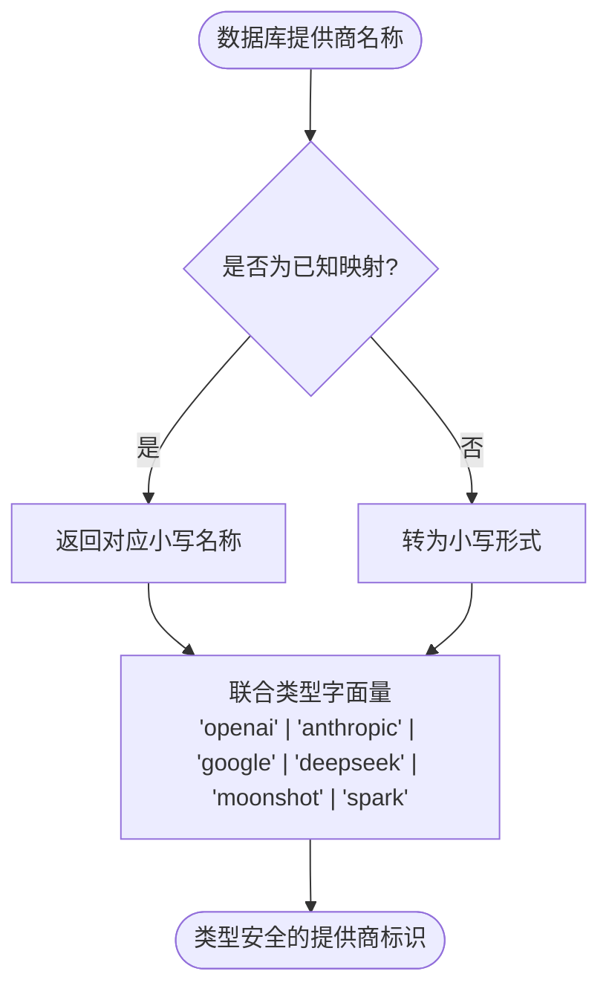
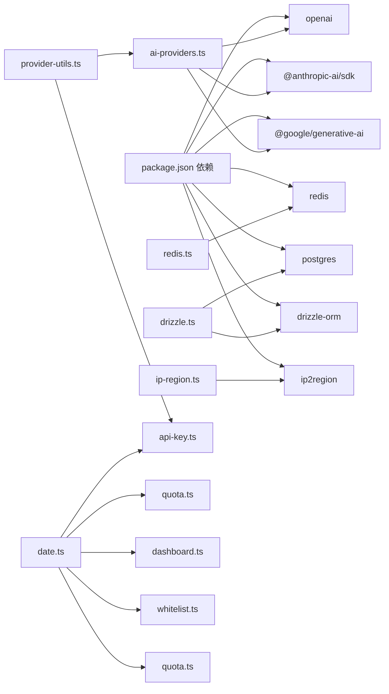

# 工具函数与实用程序

<cite>
**本文引用的文件**
- [src/lib/utils.ts](file://src/lib/utils.ts)
- [src/lib/ip-region.ts](file://src/lib/ip-region.ts)
- [src/lib/quota.ts](file://src/lib/quota.ts)
- [src/lib/database.ts](file://src/lib/database.ts)
- [src/lib/types.ts](file://src/lib/types.ts)
- [src/lib/redis.ts](file://src/lib/redis.ts)
- [src/lib/schema.ts](file://src/lib/schema.ts)
- [src/lib/drizzle.ts](file://src/lib/drizzle.ts)
- [src/lib/ai-providers.ts](file://src/lib/ai-providers.ts)
- [src/lib/provider-utils.ts](file://src/lib/provider-utils.ts)
- [src/lib/date.ts](file://src/lib/date.ts)
- [src/utils/api.ts](file://src/utils/api.ts)
- [src/server/api/routers/ai.ts](file://src/server/api/routers/ai.ts)
- [src/server/api/routers/apiKey.ts](file://src/server/api/routers/apiKey.ts)
- [src/server/api/routers/dashboard.ts](file://src/server/api/routers/dashboard.ts)
- [src/server/api/routers/quota.ts](file://src/server/api/routers/quota.ts)
- [src/server/api/routers/whitelist.ts](file://src/server/api/routers/whitelist.ts)
- [src/pages/api/ai/chat/stream.ts](file://src/pages/api/ai/chat/stream.ts)
- [package.json](file://package.json)
- [.prettierrc](file://.prettierrc)
</cite>

## 更新摘要
**变更内容**
- 新增日期处理工具函数章节，详细介绍 getTodayString 和 getCurrentMinuteString 的实现与应用
- 更新配额管理章节，反映日期工具函数在配额检查、用量记录和统计中的关键作用
- 扩展仪表板和 API Key 管理章节，说明日期格式化在数据展示中的重要性
- 增加时区处理机制的详细说明，解释本地时间与 UTC 时间的区别
- 更新依赖关系分析，反映新增的日期工具函数在多个模块中的广泛使用

## 目录
1. [简介](#简介)
2. [项目结构](#项目结构)
3. [核心组件](#核心组件)
4. [架构总览](#架构总览)
5. [详细组件分析](#详细组件分析)
6. [依赖关系分析](#依赖关系分析)
7. [性能考虑](#性能考虑)
8. [故障排查指南](#故障排查指南)
9. [结论](#结论)
10. [附录](#附录)

## 简介
本文件面向 AIGate 的工具函数与实用程序，系统化梳理以下能力：
- IP 地理位置解析：数据库集成、查询路径、缓存策略与私网过滤
- Token 估算算法：模型差异处理、上下文长度计算与准确性优化
- 数据库工具函数：查询构建、事务处理与错误封装
- 类型定义文件：Zod 类型安全、接口定义与泛型使用
- API 工具函数：请求封装、响应处理与错误转换
- **日期处理工具函数**：解决时区相关问题，提供本地时间格式化与分钟粒度时间戳
- **样式工具函数**：基于 clsx/tailwind-merge 的类名合并函数，经过格式化改进提升代码一致性
- **类型安全增强**：提供商转换工具函数的联合类型字面量返回类型，提供更好的编译时安全保证
- 性能优化：Redis 缓存、Drizzle 查询、流式处理与资源清理
- 测试与质量保障：类型约束、边界条件与兼容性降级
- 使用示例与扩展指南：在路由与页面中的调用方式与最佳实践

## 项目结构
工具函数与实用程序主要分布在以下模块：
- 工具与通用：cn 样式合并、API 输入输出推断、日期处理工具
- 地理位置：IP 提取、区域查询、私网判定
- 配额与用量：策略匹配、Redis 计数、用量记录与统计
- 数据库抽象：Drizzle ORM、表结构与 CRUD 封装
- 类型系统：Zod Schema 与类型推断
- AI 提供商：统一接口、Token 估算、流式与非流式请求
- **提供商工具**：类型安全的提供商名称转换与验证
- API 路由：tRPC 与 Next.js API Handler 的调用链

```mermaid
graph TB
subgraph "工具与类型"
U["utils.ts<br/>样式合并"]
T["types.ts<br/>Zod 类型"]
AU["api.ts<br/>tRPC 输入/输出推断"]
PU["provider-utils.ts<br/>类型安全转换"]
DT["date.ts<br/>日期处理工具"]
END
subgraph "地理位置"
IR["ip-region.ts<br/>IP 提取/区域查询"]
END
subgraph "配额与用量"
Q["quota.ts<br/>策略/检查/记录/统计"]
R["redis.ts<br/>Redis 客户端/键生成"]
END
subgraph "数据库"
DZ["drizzle.ts<br/>连接初始化"]
SCH["schema.ts<br/>表结构/枚举"]
DB["database.ts<br/>CRUD 封装"]
END
subgraph "AI 提供商"
AP["ai-providers.ts<br/>统一接口/估算/流式"]
END
subgraph "API 路由"
R_AI["server/api/routers/ai.ts"]
R_APIKEY["server/api/routers/apiKey.ts"]
R_DASHBOARD["server/api/routers/dashboard.ts"]
R_QUOTA["server/api/routers/quota.ts"]
R_WHITELIST["server/api/routers/whitelist.ts"]
S_STREAM["pages/api/ai/chat/stream.ts"]
END
U --> R_AI
T --> R_AI
IR --> R_AI
Q --> R_AI
Q --> R_DASHBOARD
Q --> R_APIKEY
Q --> R_QUOTA
Q --> R_WHITELIST
DT --> Q
DT --> R_DASHBOARD
DT --> R_APIKEY
DT --> R_WHITELIST
DT --> R_QUOTA
R --> Q
DZ --> DB
SCH --> DB
DB --> R_AI
DB --> R_APIKEY
AP --> R_AI
AP --> S_STREAM
AU --> R_AI
PU --> R_APIKEY
PU --> AP
```

**图表来源**
- [src/lib/utils.ts](file://src/lib/utils.ts#L1-L7)
- [src/lib/types.ts](file://src/lib/types.ts#L1-L118)
- [src/utils/api.ts](file://src/utils/api.ts#L1-L17)
- [src/lib/ip-region.ts](file://src/lib/ip-region.ts#L1-L101)
- [src/lib/quota.ts](file://src/lib/quota.ts#L1-L334)
- [src/lib/redis.ts](file://src/lib/redis.ts#L1-L49)
- [src/lib/drizzle.ts](file://src/lib/drizzle.ts#L1-L12)
- [src/lib/schema.ts](file://src/lib/schema.ts#L1-L159)
- [src/lib/database.ts](file://src/lib/database.ts#L1-L524)
- [src/lib/ai-providers.ts](file://src/lib/ai-providers.ts#L1-L759)
- [src/lib/provider-utils.ts](file://src/lib/provider-utils.ts#L1-L27)
- [src/lib/date.ts](file://src/lib/date.ts#L1-L17)
- [src/server/api/routers/ai.ts](file://src/server/api/routers/ai.ts#L1-L301)
- [src/server/api/routers/apiKey.ts](file://src/server/api/routers/apiKey.ts#L1-L377)
- [src/server/api/routers/dashboard.ts](file://src/server/api/routers/dashboard.ts#L1-L454)
- [src/server/api/routers/quota.ts](file://src/server/api/routers/quota.ts#L1-L221)
- [src/server/api/routers/whitelist.ts](file://src/server/api/routers/whitelist.ts#L1-L222)
- [src/pages/api/ai/chat/stream.ts](file://src/pages/api/ai/chat/stream.ts#L1-L167)

**章节来源**
- [src/lib/utils.ts](file://src/lib/utils.ts#L1-L7)
- [src/lib/types.ts](file://src/lib/types.ts#L1-L118)
- [src/utils/api.ts](file://src/utils/api.ts#L1-L17)
- [src/lib/ip-region.ts](file://src/lib/ip-region.ts#L1-L101)
- [src/lib/quota.ts](file://src/lib/quota.ts#L1-L334)
- [src/lib/redis.ts](file://src/lib/redis.ts#L1-L49)
- [src/lib/drizzle.ts](file://src/lib/drizzle.ts#L1-L12)
- [src/lib/schema.ts](file://src/lib/schema.ts#L1-L159)
- [src/lib/database.ts](file://src/lib/database.ts#L1-L524)
- [src/lib/ai-providers.ts](file://src/lib/ai-providers.ts#L1-L759)
- [src/lib/provider-utils.ts](file://src/lib/provider-utils.ts#L1-L27)
- [src/lib/date.ts](file://src/lib/date.ts#L1-L17)
- [src/server/api/routers/ai.ts](file://src/server/api/routers/ai.ts#L1-L301)
- [src/server/api/routers/apiKey.ts](file://src/server/api/routers/apiKey.ts#L1-L377)
- [src/server/api/routers/dashboard.ts](file://src/server/api/routers/dashboard.ts#L1-L454)
- [src/server/api/routers/quota.ts](file://src/server/api/routers/quota.ts#L1-L221)
- [src/server/api/routers/whitelist.ts](file://src/server/api/routers/whitelist.ts#L1-L222)
- [src/pages/api/ai/chat/stream.ts](file://src/pages/api/ai/chat/stream.ts#L1-L167)

## 核心组件
- 样式工具：基于 clsx/tailwind-merge 的类名合并函数，避免重复与冲突，经过格式化改进提升代码一致性
- IP 地理位置：从 HTTP 请求头与 socket 中提取真实 IP，结合 ip2region 查询区域，跳过内网/本地地址
- 配额与用量：策略匹配（白名单规则 → 策略表）、Redis 计数（日/分钟）、用量记录与统计
- 数据库抽象：Drizzle 初始化、表结构定义、ORM CRUD 封装与并发统计
- 类型系统：Zod Schema 与类型推断，确保输入输出一致性
- AI 提供商：统一接口、按模型选择提供商、Token 估算、流式与非流式请求
- **日期处理工具**：解决时区相关问题，提供本地时间格式化与分钟粒度时间戳
- **提供商工具**：类型安全的提供商名称转换，支持 openai、anthropic、google、deepseek、moonshot、spark 等联合类型字面量
- API 路由：tRPC mutation/query 与 Next.js API Handler，封装错误与元数据

**章节来源**
- [src/lib/utils.ts](file://src/lib/utils.ts#L1-L7)
- [src/lib/ip-region.ts](file://src/lib/ip-region.ts#L1-L101)
- [src/lib/quota.ts](file://src/lib/quota.ts#L1-L334)
- [src/lib/database.ts](file://src/lib/database.ts#L1-L524)
- [src/lib/types.ts](file://src/lib/types.ts#L1-L118)
- [src/lib/ai-providers.ts](file://src/lib/ai-providers.ts#L1-L759)
- [src/lib/provider-utils.ts](file://src/lib/provider-utils.ts#L1-L27)
- [src/lib/date.ts](file://src/lib/date.ts#L1-L17)
- [src/server/api/routers/ai.ts](file://src/server/api/routers/ai.ts#L1-L301)
- [src/pages/api/ai/chat/stream.ts](file://src/pages/api/ai/chat/stream.ts#L1-L167)

## 架构总览
下图展示从请求进入至用量记录的关键流程，涵盖 IP 解析、配额检查、提供商调用与用量统计。



**图表来源**
- [src/pages/api/ai/chat/stream.ts](file://src/pages/api/ai/chat/stream.ts#L1-L167)
- [src/server/api/routers/ai.ts](file://src/server/api/routers/ai.ts#L1-L301)
- [src/lib/ai-providers.ts](file://src/lib/ai-providers.ts#L1-L759)
- [src/lib/quota.ts](file://src/lib/quota.ts#L1-L334)
- [src/lib/database.ts](file://src/lib/database.ts#L1-L524)
- [src/lib/redis.ts](file://src/lib/redis.ts#L1-L49)
- [src/lib/date.ts](file://src/lib/date.ts#L1-L17)

## 详细组件分析

### 日期处理工具函数
**更新** 本节新增内容，详细介绍新增的日期处理工具函数

- **getTodayString 函数**：获取今日日期字符串，修复时区问题，使用本地时间而非 UTC 时间
  - 实现原理：使用 getFullYear、getMonth、getDate 获取本地日期，避免时区偏移
  - 格式规范：返回 YYYY-MM-DD 格式的日期字符串
  - 参数支持：可选的 Date 对象参数，未提供时使用当前时间
  - 时区处理：通过使用本地时间方法（getFullYear、getMonth、getDate）避免 UTC 转换问题

- **getCurrentMinuteString 函数**：获取当前分钟字符串，提供分钟粒度的时间戳
  - 实现原理：使用 toISOString() 获取 UTC 时间，然后分割获取日期部分
  - 格式规范：返回 YYYY-MM-DD:HH:MM 格式的字符串
  - 应用场景：用于 Redis 分钟级计数器的键生成

- **广泛应用场景**：
  - 配额管理：用于生成每日和每分钟的 Redis 键
  - 仪表板统计：用于日期范围的数据聚合
  - API Key 管理：用于创建和更新时间的格式化
  - 白名单规则：用于规则创建时间的本地化显示



**图表来源**
- [src/lib/date.ts](file://src/lib/date.ts#L3-L10)
- [src/lib/date.ts](file://src/lib/date.ts#L13-L16)

**章节来源**
- [src/lib/date.ts](file://src/lib/date.ts#L1-L17)

### 样式工具函数
**更新** 本节新增内容，反映 utils.ts 文件经过格式化改进提升代码一致性

- **cn 函数**：基于 clsx 和 tailwind-merge 的类名合并工具函数
- **格式化改进**：经过 Prettier 格式化，确保代码风格一致性和可读性
- **类型安全**：使用 ClassValue 类型确保传入参数的类型安全
- **功能特性**：
  - 支持多个类名参数的合并
  - 自动处理重复类名和冲突
  - 优化 tailwind CSS 类名的合并顺序
  - 返回最终的类名字符串



**图表来源**
- [src/lib/utils.ts](file://src/lib/utils.ts#L4-L6)

**章节来源**
- [src/lib/utils.ts](file://src/lib/utils.ts#L1-L7)

### IP 地理位置解析
- IP 提取优先级：X-Forwarded-For → X-Real-IP → socket.remoteAddress；IPv6 映射地址规范化
- 私网过滤：对 127.0.0.1、::1、10./172.16-31./192.168. 等内网/本地地址直接跳过
- 查询逻辑：单例懒加载 ip2region 实例，查询失败返回 undefined 并记录错误
- 区域返回：优先省，其次国家，缺失时返回 undefined



**图表来源**
- [src/lib/ip-region.ts](file://src/lib/ip-region.ts#L24-L101)

**章节来源**
- [src/lib/ip-region.ts](file://src/lib/ip-region.ts#L1-L101)

### Token 估算算法
- 统一估算：按字符长度估算，约 4 字符 ≈ 1 Token
- 模型差异：各提供商的 estimateTokens 基于消息内容拼接后的文本长度估算
- 上下文长度：不同模型的上下文长度由提供商决定，估算仅用于配额预估与成本近似
- 准确性优化：
  - 非流式：以实际响应 usage 为准，若不可得则按估算比例拆分 prompt/completion
  - 流式：边解码边统计增量 token，减少误差
  - 记录用量：最终以实际值写入数据库，确保统计准确



**图表来源**
- [src/lib/ai-providers.ts](file://src/lib/ai-providers.ts#L29-L32)
- [src/lib/ai-providers.ts](file://src/lib/ai-providers.ts#L96-L99)
- [src/lib/ai-providers.ts](file://src/lib/ai-providers.ts#L278-L281)
- [src/lib/ai-providers.ts](file://src/lib/ai-providers.ts#L465-L468)
- [src/lib/ai-providers.ts](file://src/lib/ai-providers.ts#L537-L540)
- [src/lib/ai-providers.ts](file://src/lib/ai-providers.ts#L609-L612)
- [src/lib/ai-providers.ts](file://src/lib/ai-providers.ts#L681-L684)
- [src/server/api/routers/ai.ts](file://src/server/api/routers/ai.ts#L52-L65)
- [src/pages/api/ai/chat/stream.ts](file://src/pages/api/ai/chat/stream.ts#L108-L122)

**章节来源**
- [src/lib/ai-providers.ts](file://src/lib/ai-providers.ts#L1-L759)
- [src/server/api/routers/ai.ts](file://src/server/api/routers/ai.ts#L1-L301)
- [src/pages/api/ai/chat/stream.ts](file://src/pages/api/ai/chat/stream.ts#L1-L167)

### 数据库工具函数设计
- 连接与初始化：Postgres 客户端 + Drizzle ORM，关闭预取以适配事务池
- 表结构：定义枚举、主键、外键关系，导出类型便于强类型使用
- CRUD 封装：每个实体提供 getAll/getById/create/update/delete 等方法，异常捕获并返回空/默认值
- 并发统计：多指标聚合查询使用 Promise.all 并发执行，降低延迟
- 错误封装：统一捕获异常并记录日志，返回空集合或默认对象，避免中断流程



**图表来源**
- [src/lib/drizzle.ts](file://src/lib/drizzle.ts#L1-L12)
- [src/lib/schema.ts](file://src/lib/schema.ts#L1-L159)
- [src/lib/database.ts](file://src/lib/database.ts#L1-L524)

**章节来源**
- [src/lib/drizzle.ts](file://src/lib/drizzle.ts#L1-L12)
- [src/lib/schema.ts](file://src/lib/schema.ts#L1-L159)
- [src/lib/database.ts](file://src/lib/database.ts#L1-L524)

### 类型定义文件
- Zod Schema：对策略、API Key、用户、聊天请求/响应、用量记录进行严格约束
- 类型推断：通过 z.infer 生成 TS 类型，确保运行时校验与编译期类型一致
- 泛型使用：在 tRPC 输入输出推断中使用泛型，提升跨模块类型一致性



**图表来源**
- [src/lib/types.ts](file://src/lib/types.ts#L4-L15)
- [src/lib/types.ts](file://src/lib/types.ts#L20-L29)
- [src/lib/types.ts](file://src/lib/types.ts#L64-L77)
- [src/lib/types.ts](file://src/lib/types.ts#L48-L59)
- [src/lib/types.ts](file://src/lib/types.ts#L93-L115)

**章节来源**
- [src/lib/types.ts](file://src/lib/types.ts#L1-L118)
- [src/utils/api.ts](file://src/utils/api.ts#L1-L17)

### API 工具函数
- tRPC 输入/输出推断：通过 inferRouterInputs/inferRouterOutputs 在客户端/服务端共享类型
- 错误转换：统一抛出 TRPCError，便于前端捕获与展示
- 元数据注入：在响应中附加请求 ID、提供商、处理时长与剩余配额



**图表来源**
- [src/utils/api.ts](file://src/utils/api.ts#L1-L17)
- [src/server/api/routers/ai.ts](file://src/server/api/routers/ai.ts#L1-L301)
- [src/server/api/routers/apiKey.ts](file://src/server/api/routers/apiKey.ts#L1-L377)

**章节来源**
- [src/utils/api.ts](file://src/utils/api.ts#L1-L17)
- [src/server/api/routers/ai.ts](file://src/server/api/routers/ai.ts#L1-L301)
- [src/server/api/routers/apiKey.ts](file://src/server/api/routers/apiKey.ts#L1-L377)

### 类型安全增强：提供商转换工具函数
**更新** 本节新增内容，反映 `provider-utils.ts` 中 `convertProviderFromDb` 函数的类型安全增强

- **联合类型字面量**：`convertProviderFromDb` 函数现在返回严格的联合类型字面量，包括 `'openai' | 'anthropic' | 'google' | 'deepseek' | 'moonshot' | 'spark'`
- **编译时安全**：通过类型断言确保只返回预定义的提供商名称，防止意外的字符串值
- **向后兼容**：对于数据库中存储的其他提供商名称，函数会回退到小写形式，保持向后兼容性
- **使用场景**：
  - API Key 路由中用于转换数据库存储的提供商名称
  - AI 提供商选择逻辑中的类型安全保证
  - 组件渲染中的提供商显示名称转换



**图表来源**
- [src/lib/provider-utils.ts](file://src/lib/provider-utils.ts#L12-L26)

**章节来源**
- [src/lib/provider-utils.ts](file://src/lib/provider-utils.ts#L1-L27)
- [src/server/api/routers/apiKey.ts](file://src/server/api/routers/apiKey.ts#L79-L84)
- [src/server/api/routers/apiKey.ts](file://src/server/api/routers/apiKey.ts#L207-L213)

## 依赖关系分析
- 外部依赖：Redis、Postgres、Drizzle-ORM、ip2region、OpenAI/Anthropic/Google 等 SDK
- 内部耦合：路由层依赖工具层（IP、配额、提供商、日期），工具层依赖数据库与缓存
- 循环依赖：未见直接循环；数据库与路由通过异步导入规避循环
- **新增依赖**：日期工具函数被多个模块广泛使用，包括配额管理、仪表板、API Key管理、白名单规则和配额路由



**图表来源**
- [package.json](file://package.json#L18-L56)
- [src/lib/redis.ts](file://src/lib/redis.ts#L1-L16)
- [src/lib/drizzle.ts](file://src/lib/drizzle.ts#L1-L9)
- [src/lib/ip-region.ts](file://src/lib/ip-region.ts#L1-L2)
- [src/lib/ai-providers.ts](file://src/lib/ai-providers.ts#L42-L46)
- [src/lib/provider-utils.ts](file://src/lib/provider-utils.ts#L1-L27)
- [src/lib/date.ts](file://src/lib/date.ts#L1-L17)

**章节来源**
- [package.json](file://package.json#L1-L75)
- [src/lib/redis.ts](file://src/lib/redis.ts#L1-L16)
- [src/lib/drizzle.ts](file://src/lib/drizzle.ts#L1-L12)
- [src/lib/ip-region.ts](file://src/lib/ip-region.ts#L1-L101)
- [src/lib/ai-providers.ts](file://src/lib/ai-providers.ts#L1-L759)
- [src/lib/provider-utils.ts](file://src/lib/provider-utils.ts#L1-L27)
- [src/lib/date.ts](file://src/lib/date.ts#L1-L17)

## 性能考虑
- Redis 缓存
  - 策略缓存：用户策略缓存 1 小时，降低数据库压力
  - API Key 缓存：按提供商缓存 1 小时，减少数据库查询
  - 计数器过期：日计数 7 天，分钟计数 2 分钟，避免长期占用内存
  - **日期工具优化**：通过本地时间获取避免不必要的时区转换开销
- 数据库并发
  - 统计查询使用 Promise.all 并发，减少 RTT
  - 事务模式下禁用预取，避免不支持场景
- 流式处理
  - SSE 流式传输，边读边写，降低内存峰值
  - 流式 Token 统计采用增量估算，减少解析开销
- 资源清理
  - 流读取完成后释放锁，避免句柄泄漏
  - 异步记录用量，避免阻塞主流程
- **日期处理优化**：
  - 本地时间获取避免时区转换，提高性能
  - 分钟粒度时间戳用于高频计数场景，减少键空间膨胀

**章节来源**
- [src/lib/quota.ts](file://src/lib/quota.ts#L17-L47)
- [src/lib/quota.ts](file://src/lib/quota.ts#L207-L230)
- [src/lib/redis.ts](file://src/lib/redis.ts#L19-L48)
- [src/lib/database.ts](file://src/lib/database.ts#L236-L276)
- [src/pages/api/ai/chat/stream.ts](file://src/pages/api/ai/chat/stream.ts#L96-L125)
- [src/lib/date.ts](file://src/lib/date.ts#L1-L17)

## 故障排查指南
- IP 地理位置
  - 现象：区域为空
  - 排查：确认请求头是否正确传递、是否命中内网/本地地址、ip2region 数据库可用
- 配额检查
  - 现象：频繁 429
  - 排查：核对 limitType、日/分钟计数键、策略缓存是否过期
  - **新增排查**：检查日期格式是否正确，确认本地时间与 UTC 时间的差异
- Redis 连接
  - 现象：日志报错"Redis Client Error"
  - 排查：检查 REDIS_URL、网络连通性、过期策略是否生效
- 数据库异常
  - 现象：查询/统计返回空集合
  - 排查：确认连接字符串、迁移状态、并发查询是否超时
- 流式处理
  - 现象：SSE 中断或解析错误
  - 排查：检查提供商流式接口、Nginx 缓冲设置、增量 token 统计逻辑
- **样式工具函数**
  - 现象：类名合并异常或样式冲突
  - 排查：确认传入参数类型、检查 cn 函数的参数处理、验证 tailwind CSS 类名格式
- **提供商转换**
  - 现象：类型错误或意外的提供商名称
  - 排查：确认数据库中存储的提供商名称格式、检查 `convertProviderFromDb` 函数的映射表、验证联合类型字面量的完整性
- **日期处理工具**
  - 现象：日期格式错误或时区显示异常
  - 排查：确认本地时间获取方法、检查 getTodayString 和 getCurrentMinuteString 的返回格式、验证时区设置
  - 现象：配额统计异常
  - 排查：检查 Redis 键生成中的日期格式、确认分钟粒度计数器的键格式正确

**章节来源**
- [src/lib/ip-region.ts](file://src/lib/ip-region.ts#L65-L68)
- [src/lib/quota.ts](file://src/lib/quota.ts#L183-L189)
- [src/lib/redis.ts](file://src/lib/redis.ts#L7-L9)
- [src/lib/database.ts](file://src/lib/database.ts#L24-L26)
- [src/pages/api/ai/chat/stream.ts](file://src/pages/api/ai/chat/stream.ts#L154-L158)
- [src/lib/utils.ts](file://src/lib/utils.ts#L4-L6)
- [src/lib/provider-utils.ts](file://src/lib/provider-utils.ts#L12-L26)
- [src/lib/date.ts](file://src/lib/date.ts#L1-L17)

## 结论
本项目通过清晰的模块划分与强类型约束，实现了高可用的工具函数与实用程序体系。IP 地理位置解析、Token 估算、配额与用量管理、数据库抽象与类型系统相互配合，既保证了功能完整性，也兼顾了性能与可维护性。

**最新改进**：通过新增的日期处理工具函数，项目现在能够更好地处理时区相关问题。getTodayString 和 getCurrentMinuteString 函数解决了本地时间与 UTC 时间的差异，确保配额统计、用量记录和数据展示的一致性。这些函数已被广泛应用于配额管理、仪表板、API Key管理、白名单规则和配额路由等多个模块，提高了系统的可靠性和用户体验。

建议在生产环境中持续监控 Redis 与数据库健康状况，并定期评估配额策略与估算精度。同时，注意时区配置的一致性，确保日期工具函数在不同环境中的正确性。

## 附录
- 使用示例
  - 在 tRPC 路由中调用：参考聊天完成与流式接口的实现
  - 在页面 API 中调用：参考流式聊天处理器
  - 在组件中使用：参考样式合并工具函数 cn 的使用
  - **格式化改进**：参考 utils.ts 文件的格式化规范和 .prettierrc 配置
  - **类型安全使用**：参考 `convertProviderFromDb` 函数在 API Key 路由中的应用
  - **日期处理使用**：参考配额检查、用量记录、仪表板统计和 API Key 管理中的日期格式化
- 扩展开发指南
  - 新增提供商：在 AI 提供商映射中注册新模型与估算逻辑，同时更新 `provider-utils.ts` 中的映射表
  - 新增配额策略字段：在 Schema 与 Zod Schema 中同步新增
  - 新增缓存键：在 RedisKeys 中添加命名规范的键生成器
  - 新增统计维度：在数据库统计查询中增加聚合项
  - **样式工具扩展**：如需新增样式工具函数，遵循 utils.ts 的格式化规范和类型安全原则
  - **类型安全扩展**：当新增新的提供商时，确保在 `convertProviderFromDb` 函数的联合类型字面量中添加对应的类型定义
  - **日期工具扩展**：如需新增日期处理功能，遵循现有日期工具函数的实现模式，确保时区处理的一致性

**章节来源**
- [src/server/api/routers/ai.ts](file://src/server/api/routers/ai.ts#L1-L301)
- [src/pages/api/ai/chat/stream.ts](file://src/pages/api/ai/chat/stream.ts#L1-L167)
- [src/lib/utils.ts](file://src/lib/utils.ts#L1-L7)
- [src/lib/ai-providers.ts](file://src/lib/ai-providers.ts#L688-L759)
- [src/lib/schema.ts](file://src/lib/schema.ts#L28-L40)
- [src/lib/types.ts](file://src/lib/types.ts#L4-L15)
- [src/lib/redis.ts](file://src/lib/redis.ts#L19-L37)
- [src/lib/database.ts](file://src/lib/database.ts#L223-L276)
- [src/lib/provider-utils.ts](file://src/lib/provider-utils.ts#L12-L26)
- [src/lib/date.ts](file://src/lib/date.ts#L1-L17)
- [src/server/api/routers/apiKey.ts](file://src/server/api/routers/apiKey.ts#L79-L84)
- [src/server/api/routers/dashboard.ts](file://src/server/api/routers/dashboard.ts#L280-L295)
- [src/server/api/routers/quota.ts](file://src/server/api/routers/quota.ts#L15-L37)
- [src/server/api/routers/whitelist.ts](file://src/server/api/routers/whitelist.ts#L25-L35)
- [.prettierrc](file://.prettierrc#L1-L16)