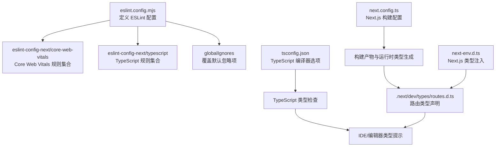
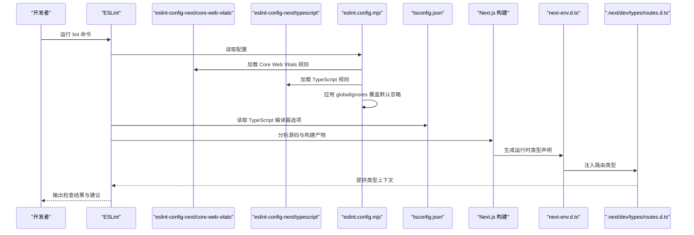
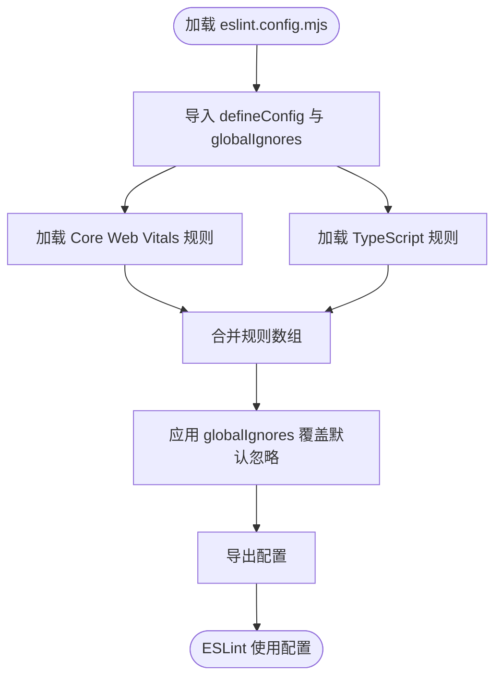
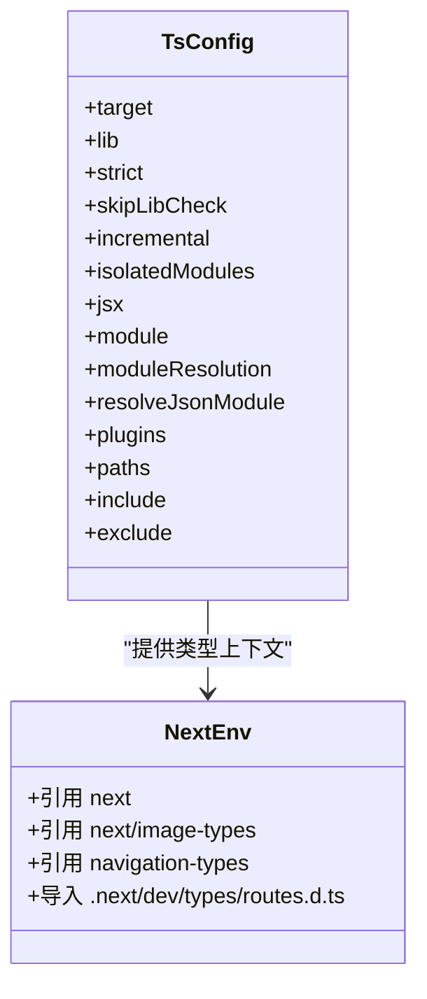
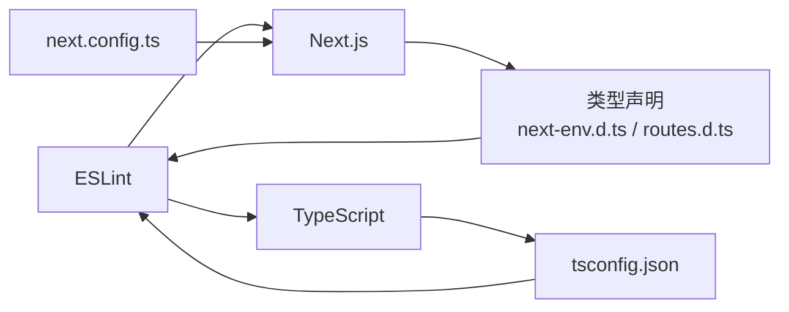

# ESLint 配置

<cite>
**本文引用的文件**
- [eslint.config.mjs](file://eslint.config.mjs)
- [package.json](file://package.json)
- [tsconfig.json](file://tsconfig.json)
- [next.config.ts](file://next.config.ts)
- [next-env.d.ts](file://next-env.d.ts)
- [.next/dev/types/routes.d.ts](file://.next/dev/types/routes.d.ts)
</cite>

## 目录
1. [简介](#简介)
2. [项目结构](#项目结构)
3. [核心组件](#核心组件)
4. [架构总览](#架构总览)
5. [详细组件分析](#详细组件分析)
6. [依赖关系分析](#依赖关系分析)
7. [性能考量](#性能考量)
8. [故障排查指南](#故障排查指南)
9. [结论](#结论)
10. [附录](#附录)

## 简介
本文件面向 AIGate 项目的 ESLint 配置，重点解析 eslint.config.mjs 的配置结构与行为，涵盖以下主题：
- eslint-config-next 的引入与使用方式
- Core Web Vitals 规则的配置与作用范围
- TypeScript 支持的配置选项（类型检查、编译器设置）
- 全局忽略规则的配置（对 .next、out、build 等目录的排除）
- 自定义规则的添加方法与最佳实践
- 常见 ESLint 错误的解决方案与调试技巧
- 不同开发环境中的配置差异与团队协作规范

## 项目结构
AIGate 使用基于函数式配置的新版 ESLint 配置文件 eslint.config.mjs，并通过 eslint-config-next 提供 Next.js 专用规则集。TypeScript 类型检查由 tsconfig.json 统一管理，Next.js 运行时类型通过 next-env.d.ts 引入。

图表来源
- [eslint.config.mjs](file://eslint.config.mjs#L1-L18)
- [tsconfig.json](file://tsconfig.json#L1-L42)
- [next.config.ts](file://next.config.ts#L1-L8)
- [next-env.d.ts](file://next-env.d.ts#L1-L8)
- [.next/dev/types/routes.d.ts](file://.next/dev/types/routes.d.ts#L1-L81)

章节来源
- [eslint.config.mjs](file://eslint.config.mjs#L1-L18)
- [tsconfig.json](file://tsconfig.json#L1-L42)
- [next.config.ts](file://next.config.ts#L1-L8)
- [next-env.d.ts](file://next-env.d.ts#L1-L8)
- [.next/dev/types/routes.d.ts](file://.next/dev/types/routes.d.ts#L1-L81)

## 核心组件
- eslint.config.mjs：定义 ESLint 配置，聚合 Core Web Vitals 与 TypeScript 规则，并通过 globalIgnores 覆盖默认忽略项。
- eslint-config-next：提供 Next.js 场景下的规则集，包括 Core Web Vitals 与 TypeScript 支持。
- tsconfig.json：统一管理 TypeScript 编译器选项，启用严格模式与增量编译等特性。
- next.config.ts：Next.js 构建配置，影响构建产物与类型生成。
- next-env.d.ts 与 .next/dev/types/routes.d.ts：注入 Next.js 运行时类型，辅助 ESLint 与 IDE 的类型检查。

章节来源
- [eslint.config.mjs](file://eslint.config.mjs#L1-L18)
- [tsconfig.json](file://tsconfig.json#L1-L42)
- [next.config.ts](file://next.config.ts#L1-L8)
- [next-env.d.ts](file://next-env.d.ts#L1-L8)
- [.next/dev/types/routes.d.ts](file://.next/dev/types/routes.d.ts#L1-L81)

## 架构总览
下图展示 ESLint 配置在项目中的整体作用链：从 eslint.config.mjs 聚合规则到 tsconfig.json 的类型检查，再到 Next.js 构建与类型生成，最终服务于 IDE 与开发体验。

图表来源
- [eslint.config.mjs](file://eslint.config.mjs#L1-L18)
- [tsconfig.json](file://tsconfig.json#L1-L42)
- [next.config.ts](file://next.config.ts#L1-L8)
- [next-env.d.ts](file://next-env.d.ts#L1-L8)
- [.next/dev/types/routes.d.ts](file://.next/dev/types/routes.d.ts#L1-L81)

## 详细组件分析

### eslint.config.mjs 配置结构与行为
- 导入与聚合
  - 通过 defineConfig 定义配置数组，聚合来自 eslint-config-next 的 Core Web Vitals 与 TypeScript 规则。
- 忽略规则覆盖
  - 使用 globalIgnores 显式覆盖 eslint-config-next 默认忽略项，确保 .next、out、build、next-env.d.ts 等路径被纳入检查范围。
- 导出
  - 将最终配置导出为默认模块，供 ESLint CLI 读取。

图表来源
- [eslint.config.mjs](file://eslint.config.mjs#L1-L18)

章节来源
- [eslint.config.mjs](file://eslint.config.mjs#L1-L18)

### Core Web Vitals 规则配置
- 规则来源
  - 通过 eslint-config-next/core-web-vitals 提供的规则集合，用于检测与性能相关的指标问题，如 Largest Contentful Paint、Cumulative Layout Shift、First Input Delay 等。
- 适用范围
  - 该规则集适用于 Next.js App Router 与页面结构，结合项目中动态路由与 API 路由的实际实现进行检查。
- 与 TypeScript 的协同
  - 在 TypeScript 启用严格模式与增量编译的前提下，Core Web Vitals 规则能更准确地识别潜在的类型不一致或运行时性能隐患。

章节来源
- [eslint.config.mjs](file://eslint.config.mjs#L1-L18)
- [tsconfig.json](file://tsconfig.json#L1-L42)

### TypeScript 支持配置
- 编译器选项
  - 启用严格模式、跳过库检查、增量编译、隔离模块等选项，提升类型检查准确性与性能。
  - JSX 使用 react-jsx，模块解析采用 bundler，便于与 Next.js 生态集成。
- 路径映射
  - 通过 paths 配置 @/* 指向 src/*，简化导入路径，减少规则误报。
- 类型声明注入
  - next-env.d.ts 引入 Next.js 运行时类型，.next/dev/types/routes.d.ts 提供路由类型，增强 ESLint 对 Next.js 特性（如 App Router）的理解能力。

图表来源
- [tsconfig.json](file://tsconfig.json#L1-L42)
- [next-env.d.ts](file://next-env.d.ts#L1-L8)
- [.next/dev/types/routes.d.ts](file://.next/dev/types/routes.d.ts#L1-L81)

章节来源
- [tsconfig.json](file://tsconfig.json#L1-L42)
- [next-env.d.ts](file://next-env.d.ts#L1-L8)
- [.next/dev/types/routes.d.ts](file://.next/dev/types/routes.d.ts#L1-L81)

### 全局忽略规则配置
- 默认忽略项
  - eslint-config-next 默认忽略 .next、out、build、next-env.d.ts 等目录与文件。
- 覆盖策略
  - 通过 globalIgnores 在 eslint.config.mjs 中显式覆盖默认忽略，使这些目录与文件纳入 ESLint 检查范围，有助于发现构建产物中的异常或潜在问题。

章节来源
- [eslint.config.mjs](file://eslint.config.mjs#L8-L16)

### 自定义规则添加与最佳实践
- 添加自定义规则
  - 在 eslint.config.mjs 中，可在现有规则数组基础上追加自定义规则对象，以满足团队特定的代码风格或安全要求。
- 最佳实践
  - 优先使用官方推荐规则集（如 eslint-config-next），再按需微调。
  - 保持规则粒度适中，避免过度限制开发效率。
  - 结合 Prettier 与 TypeScript 编译器，形成“格式化 + 类型检查 + 规则校验”的三层保障。

章节来源
- [eslint.config.mjs](file://eslint.config.mjs#L1-L18)

## 依赖关系分析
- ESLint 与 Next.js 生态
  - eslint-config-next 与 Next.js 版本需匹配，确保规则与框架特性一致。
- TypeScript 与 Next.js 类型
  - tsconfig.json 的严格模式与增量编译提升类型检查质量；next-env.d.ts 与路由类型声明为 ESLint 提供上下文信息。
- 构建配置影响
  - next.config.ts 的 output 与 reactCompiler 设置会影响构建产物与类型生成，间接影响 ESLint 的检查范围与准确性。

图表来源
- [eslint.config.mjs](file://eslint.config.mjs#L1-L18)
- [tsconfig.json](file://tsconfig.json#L1-L42)
- [next.config.ts](file://next.config.ts#L1-L8)
- [next-env.d.ts](file://next-env.d.ts#L1-L8)
- [.next/dev/types/routes.d.ts](file://.next/dev/types/routes.d.ts#L1-L81)

章节来源
- [eslint.config.mjs](file://eslint.config.mjs#L1-L18)
- [tsconfig.json](file://tsconfig.json#L1-L42)
- [next.config.ts](file://next.config.ts#L1-L8)
- [next-env.d.ts](file://next-env.d.ts#L1-L8)
- [.next/dev/types/routes.d.ts](file://.next/dev/types/routes.d.ts#L1-L81)

## 性能考量
- 增量编译与隔离模块
  - tsconfig.json 启用增量编译与隔离模块，可显著降低类型检查开销，提升开发体验。
- 构建产物忽略
  - 默认忽略 .next、out、build 等目录，避免对大型构建产物进行重复扫描，提高 ESLint 执行效率。
- 覆盖忽略的权衡
  - 若开启 globalIgnores，会扩大检查范围，可能增加执行时间，应根据团队需求与 CI 速度进行权衡。

章节来源
- [tsconfig.json](file://tsconfig.json#L1-L42)
- [eslint.config.mjs](file://eslint.config.mjs#L8-L16)

## 故障排查指南
- 常见错误与解决
  - 规则冲突：当自定义规则与 eslint-config-next 冲突时，优先调整自定义规则或使用 overrides 进行局部覆盖。
  - 类型未解析：确认 tsconfig.json 的 paths 与 include/exclude 配置正确，确保 next-env.d.ts 与路由类型声明生效。
  - 构建产物误报：若因 .next、out、build 目录导致误报，可通过 globalIgnores 控制是否纳入检查。
- 调试技巧
  - 使用 ESLint CLI 的详细输出与规则来源定位问题。
  - 在本地临时禁用部分规则，逐步缩小问题范围。
  - 结合 Prettier 与 TypeScript 编译器先行修复格式与类型问题，再进行 ESLint 校验。

章节来源
- [eslint.config.mjs](file://eslint.config.mjs#L1-L18)
- [tsconfig.json](file://tsconfig.json#L1-L42)
- [next-env.d.ts](file://next-env.d.ts#L1-L8)
- [.next/dev/types/routes.d.ts](file://.next/dev/types/routes.d.ts#L1-L81)

## 结论
AIGate 的 ESLint 配置通过 eslint.config.mjs 聚合 Core Web Vitals 与 TypeScript 规则，并以 globalIgnores 覆盖默认忽略项，形成一套面向 Next.js App Router 的高效检查体系。配合严格的 tsconfig.json 与 Next.js 类型声明，能够有效提升代码质量与用户体验。建议团队在遵循官方规则集的基础上，按需添加自定义规则，并建立统一的调试与协作流程。

## 附录
- 团队协作规范建议
  - 统一 ESLint 与 TypeScript 版本，确保规则一致性。
  - 在 PR 中强制执行 lint 与类型检查，避免引入新问题。
  - 对于大型构建产物，建议仅在 CI 或本地特定场景启用 globalIgnores 覆盖，日常开发保持默认忽略以保证性能。