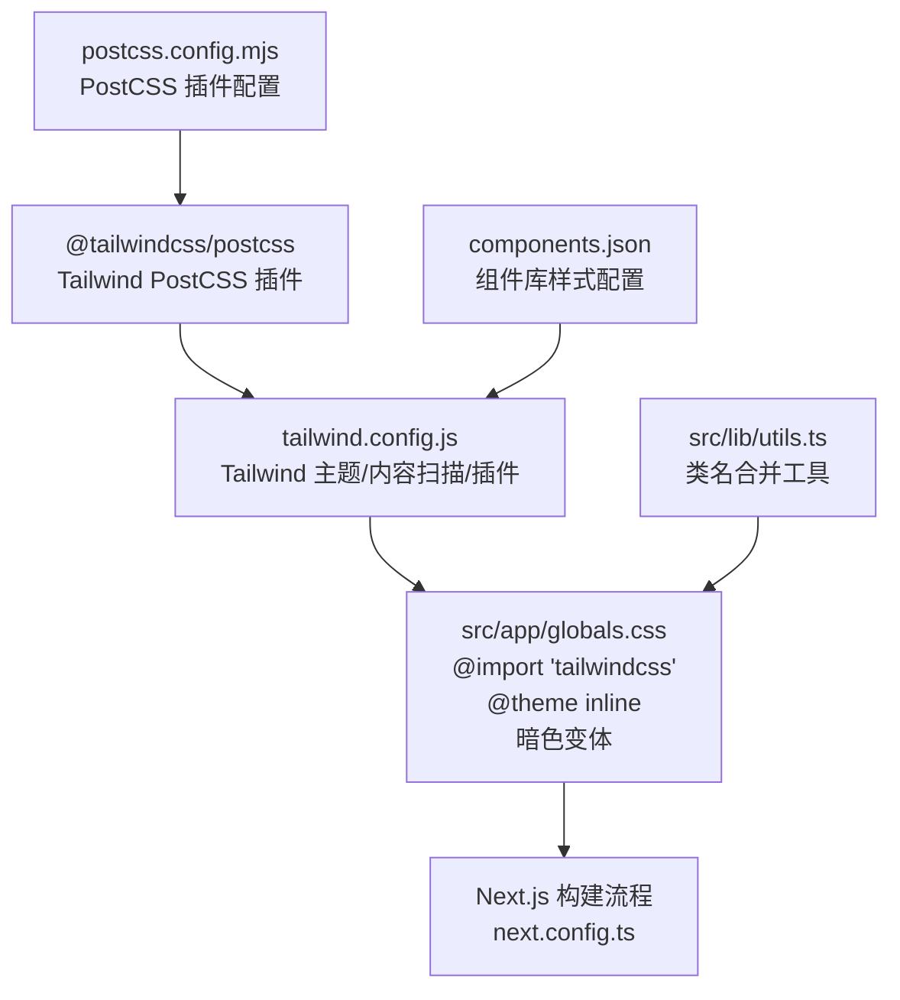
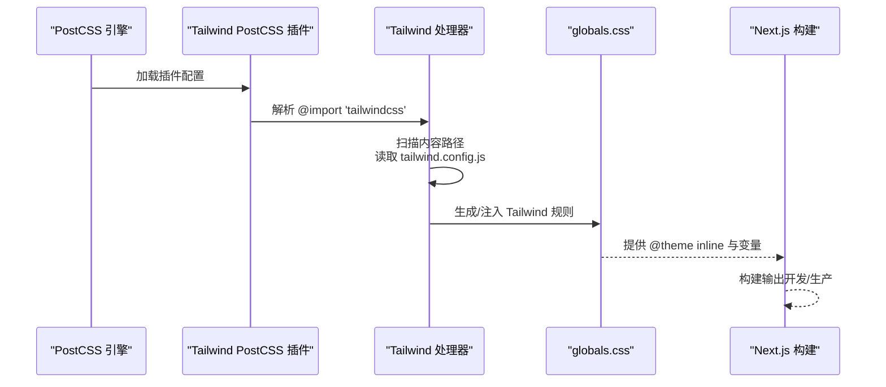
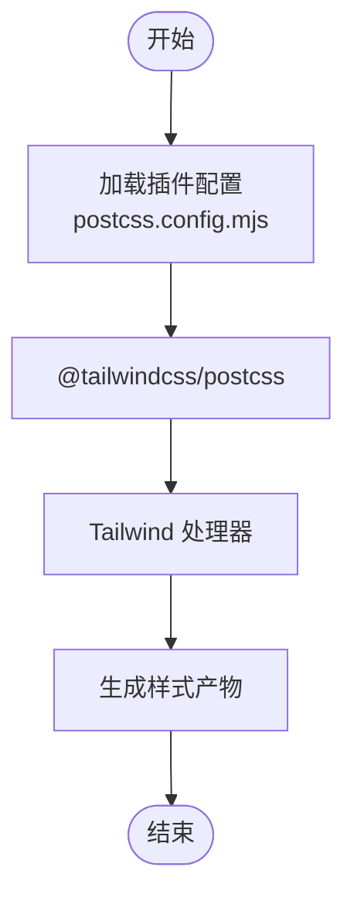
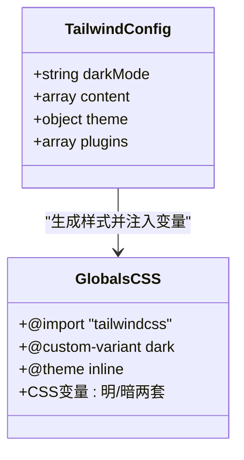
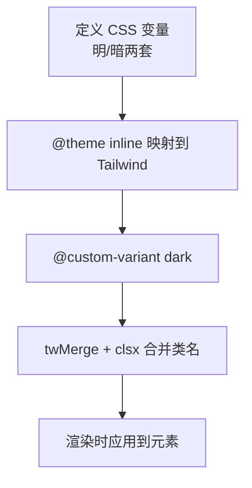
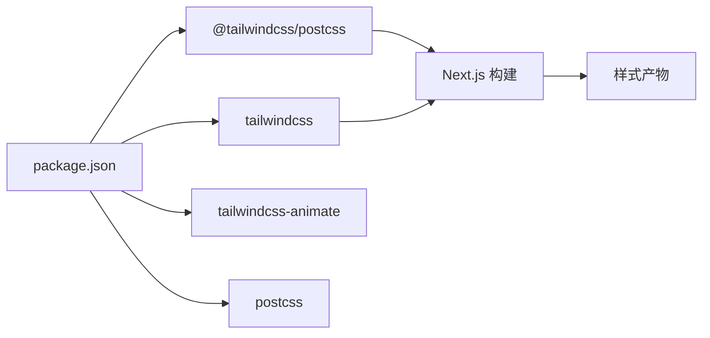

# PostCSS 配置

<cite>
**本文引用的文件**
- [postcss.config.mjs](file://postcss.config.mjs)
- [tailwind.config.js](file://tailwind.config.js)
- [components.json](file://components.json)
- [src/app/globals.css](file://src/app/globals.css)
- [package.json](file://package.json)
- [next.config.ts](file://next.config.ts)
- [src/lib/utils.ts](file://src/lib/utils.ts)
</cite>

## 目录
1. [简介](#简介)
2. [项目结构](#项目结构)
3. [核心组件](#核心组件)
4. [架构总览](#架构总览)
5. [详细组件分析](#详细组件分析)
6. [依赖关系分析](#依赖关系分析)
7. [性能考量](#性能考量)
8. [故障排查指南](#故障排查指南)
9. [结论](#结论)
10. [附录](#附录)

## 简介
本文件系统化梳理 AIGate 项目的 PostCSS 配置与 Tailwind CSS 集成方式，重点覆盖以下方面：
- postcss.config.mjs 的配置结构与插件链执行顺序
- 与 Tailwind CSS 的集成：自动前缀、浏览器兼容性、暗色模式与主题变量
- CSS 预处理器能力：变量、自定义主题、暗色变体等
- 不同构建环境（开发/生产）下的差异与优化策略
- 常见 PostCSS 插件的使用建议与配置要点
- 样式调试与性能优化最佳实践
- 现代浏览器兼容性与降级处理方案

## 项目结构
AIGate 使用 Next.js 作为应用框架，Tailwind CSS v4 作为原子化样式基础，并通过 PostCSS 插件桥接。关键配置文件如下：
- PostCSS 配置：postcss.config.mjs
- Tailwind 配置：tailwind.config.js
- 组件库配置：components.json（用于生成与样式相关）
- 全局样式入口：src/app/globals.css
- 构建与运行配置：next.config.ts
- 工具函数：src/lib/utils.ts（类名合并）
- 依赖声明：package.json

图表来源
- [postcss.config.mjs](file://postcss.config.mjs#L1-L8)
- [tailwind.config.js](file://tailwind.config.js#L1-L78)
- [src/app/globals.css](file://src/app/globals.css#L1-L125)
- [next.config.ts](file://next.config.ts#L1-L9)
- [components.json](file://components.json#L1-L18)
- [src/lib/utils.ts](file://src/lib/utils.ts#L1-L7)

章节来源
- [postcss.config.mjs](file://postcss.config.mjs#L1-L8)
- [tailwind.config.js](file://tailwind.config.js#L1-L78)
- [src/app/globals.css](file://src/app/globals.css#L1-L125)
- [next.config.ts](file://next.config.ts#L1-L9)
- [components.json](file://components.json#L1-L18)
- [src/lib/utils.ts](file://src/lib/utils.ts#L1-L7)

## 核心组件
- PostCSS 插件链
  - 当前仅启用 Tailwind PostCSS 插件，负责将 @import 'tailwindcss' 解析为实际的 Tailwind 指令，并在后续由 Tailwind 处理器生成样式。
- Tailwind 配置
  - 内容扫描路径覆盖 pages、components、app、src 等目录，确保按需生成样式。
  - 主题扩展包含容器、颜色、圆角、动画等；启用暗色模式为 class 方式。
  - 插件包含 tailwindcss-animate，用于增强动画相关类。
- 全局样式入口
  - 引入 Tailwind 指令并声明自定义暗色变体，同时以 @theme inline 形式将 CSS 变量映射到 Tailwind 主题。
  - 定义了明/暗两套变量值，支持玻璃拟态风格。
- 组件库配置
  - 组件库样式源指向 tailwind.config.js 与 src/app/globals.css，开启 CSS 变量与无前缀。
- 构建与运行
  - Next.js 输出模式为 standalone，React Compiler 开启，提升构建与运行效率。

章节来源
- [postcss.config.mjs](file://postcss.config.mjs#L1-L8)
- [tailwind.config.js](file://tailwind.config.js#L1-L78)
- [src/app/globals.css](file://src/app/globals.css#L1-L125)
- [components.json](file://components.json#L1-L18)
- [next.config.ts](file://next.config.ts#L1-L9)

## 架构总览
下图展示从 PostCSS 到 Tailwind、再到全局样式的完整链路，以及 Next.js 的参与：

图表来源
- [postcss.config.mjs](file://postcss.config.mjs#L1-L8)
- [tailwind.config.js](file://tailwind.config.js#L1-L78)
- [src/app/globals.css](file://src/app/globals.css#L1-L125)
- [next.config.ts](file://next.config.ts#L1-L9)

## 详细组件分析

### PostCSS 插件链与执行顺序
- 配置现状
  - 仅启用 @tailwindcss/postcss 插件，无其他 PostCSS 插件（如 autoprefixer、cssnano 等）。
- 执行顺序
  - PostCSS 会先加载插件列表，再对输入进行转换。当前顺序为：@tailwindcss/postcss → Tailwind 处理器 → 生成样式。
- 影响
  - 缺失自动前缀与压缩优化，生产环境体积与兼容性可能受影响。

图表来源
- [postcss.config.mjs](file://postcss.config.mjs#L1-L8)

章节来源
- [postcss.config.mjs](file://postcss.config.mjs#L1-L8)

### Tailwind 集成与主题配置
- 内容扫描
  - 覆盖 pages、components、app、src 下的 TS/TSX 文件，确保按需生成。
- 暗色模式
  - 使用 class 模式，配合自定义暗色变体声明，实现明/暗两套变量。
- 主题扩展
  - 容器宽度、圆角、动画等扩展，便于组件库与业务样式复用。
- 动画插件
  - tailwindcss-animate 提供更丰富的动画类，减少手写动画代码。

图表来源
- [tailwind.config.js](file://tailwind.config.js#L1-L78)
- [src/app/globals.css](file://src/app/globals.css#L1-L125)

章节来源
- [tailwind.config.js](file://tailwind.config.js#L1-L78)
- [src/app/globals.css](file://src/app/globals.css#L1-L125)

### CSS 预处理器能力与变量体系
- 变量与主题
  - 在 :root 与 .dark 中分别定义变量，通过 @theme inline 将其映射到 Tailwind 主题键。
  - 支持玻璃拟态风格的颜色与阴影变量，便于统一视觉语言。
- 自定义变体
  - 使用 @custom-variant dark 定义暗色选择器，确保在 class 模式下正确生效。
- 类名合并工具
  - 使用 twMerge 结合 clsx 合并类名，避免冲突并减少冗余类。

图表来源
- [src/app/globals.css](file://src/app/globals.css#L1-L125)
- [src/lib/utils.ts](file://src/lib/utils.ts#L1-L7)

章节来源
- [src/app/globals.css](file://src/app/globals.css#L1-L125)
- [src/lib/utils.ts](file://src/lib/utils.ts#L1-L7)

### 构建环境差异与优化策略
- 开发环境
  - Next.js 默认启用热更新与源映射，PostCSS 保持最小化处理，便于调试。
- 生产环境
  - 当前未启用 cssnano 等压缩插件，建议在生产构建中引入压缩与去重策略，以降低体积。
- 浏览器兼容性
  - 当前未启用 autoprefixer，建议在生产构建中加入，以自动添加厂商前缀，提升兼容性。

章节来源
- [postcss.config.mjs](file://postcss.config.mjs#L1-L8)
- [next.config.ts](file://next.config.ts#L1-L9)

### 常见 PostCSS 插件使用建议
- autoprefixer
  - 作用：根据目标浏览器自动添加/移除厂商前缀，提升兼容性。
  - 建议：结合 browserslist 或 package.json 中的 browserslist 字段使用。
- cssnano
  - 作用：压缩 CSS，去除注释、空白与重复规则，减小体积。
  - 建议：仅在生产环境启用，避免影响开发调试体验。
- postcss-preset-env
  - 作用：启用现代 CSS 语法特性（如自定义属性、嵌套），并自动回退到兼容写法。
  - 建议：与 autoprefixer 搭配使用，提升可维护性与兼容性。

章节来源
- [postcss.config.mjs](file://postcss.config.mjs#L1-L8)

### CSS 优化与压缩策略
- 按需生成
  - 通过 tailwind.config.js 的 content 配置，确保仅生成被使用的样式，减少初始体积。
- 变量集中管理
  - 在 :root 与 .dark 中统一管理变量，降低重复与维护成本。
- 类名合并
  - 使用 twMerge + clsx 合并类名，避免重复与冲突，间接减少无效样式。
- 压缩与前缀
  - 建议在生产构建中引入 cssnano 与 autoprefixer，以获得更优的体积与兼容性。

章节来源
- [tailwind.config.js](file://tailwind.config.js#L1-L78)
- [src/app/globals.css](file://src/app/globals.css#L1-L125)
- [src/lib/utils.ts](file://src/lib/utils.ts#L1-L7)
- [postcss.config.mjs](file://postcss.config.mjs#L1-L8)

### 样式调试与性能优化最佳实践
- 调试
  - 使用浏览器开发者工具检查元素的最终类名与变量值，确认暗色模式切换是否生效。
  - 在 globals.css 中逐步注释变量块，定位问题范围。
- 性能
  - 控制内容扫描范围，避免不必要的文件被纳入扫描。
  - 合理拆分样式模块，避免单个 CSS 文件过大。
  - 在生产环境启用压缩与前缀，减少网络传输时间。

章节来源
- [src/app/globals.css](file://src/app/globals.css#L1-L125)
- [tailwind.config.js](file://tailwind.config.js#L1-L78)
- [postcss.config.mjs](file://postcss.config.mjs#L1-L8)

### 现代浏览器兼容性与降级处理
- 兼容性现状
  - 当前未启用 autoprefixer，可能导致部分旧版浏览器出现兼容问题。
- 降级处理建议
  - 在生产构建中引入 autoprefixer，确保主流浏览器的兼容性。
  - 对于极少数不支持的特性，提供回退样式或使用 postcss-preset-env 进行自动回退。
  - 使用 Tailwind 的默认回退值与渐进增强策略，保证基础可用性。

章节来源
- [postcss.config.mjs](file://postcss.config.mjs#L1-L8)
- [tailwind.config.js](file://tailwind.config.js#L1-L78)

## 依赖关系分析
- 直接依赖
  - @tailwindcss/postcss：负责解析 Tailwind 指令。
  - tailwindcss：提供 v4 的核心能力（含 @theme inline、暗色变体等）。
  - tailwindcss-animate：增强动画类。
  - postcss：PostCSS 引擎。
- 间接依赖
  - Next.js：通过构建流程调用 PostCSS 与 Tailwind。
  - 组件库（通过 components.json）：与 Tailwind 配置联动，确保生成一致的样式。

图表来源
- [package.json](file://package.json#L1-L75)
- [postcss.config.mjs](file://postcss.config.mjs#L1-L8)
- [tailwind.config.js](file://tailwind.config.js#L1-L78)

章节来源
- [package.json](file://package.json#L1-L75)
- [postcss.config.mjs](file://postcss.config.mjs#L1-L8)
- [tailwind.config.js](file://tailwind.config.js#L1-L78)

## 性能考量
- 构建阶段
  - Tailwind 按需生成可显著减少初始 CSS 体积；建议在生产构建中启用压缩与前缀，进一步优化。
- 运行阶段
  - 使用 twMerge + clsx 合并类名，减少 DOM 属性长度与重排开销。
- 缓存与增量
  - Next.js 的构建缓存机制可加速重复构建；保持 Tailwind 内容扫描范围稳定有助于缓存命中率。

## 故障排查指南
- 暗色模式不生效
  - 检查是否正确设置 darkMode 为 class，并在根元素或父元素上添加对应 class。
  - 确认 @custom-variant dark 的声明与使用位置正确。
- 变量未生效
  - 确认 @theme inline 是否正确映射变量，且变量在 :root 与 .dark 中均有定义。
- 样式体积过大
  - 检查 content 扫描范围是否过宽，必要时缩小扫描路径。
  - 在生产构建中引入 cssnano 与 autoprefixer。
- 构建失败或报错
  - 确认 PostCSS 插件版本与 Tailwind 版本兼容。
  - 检查 next.config.ts 的输出模式与 React Compiler 设置是否符合预期。

章节来源
- [src/app/globals.css](file://src/app/globals.css#L1-L125)
- [tailwind.config.js](file://tailwind.config.js#L1-L78)
- [postcss.config.mjs](file://postcss.config.mjs#L1-L8)
- [next.config.ts](file://next.config.ts#L1-L9)

## 结论
AIGate 的当前 PostCSS 配置以 Tailwind PostCSS 插件为核心，结合 Tailwind v4 的主题与变量能力，实现了简洁高效的样式体系。建议在生产环境中补充 autoprefixer 与 cssnano，以提升兼容性与体积表现；同时保持内容扫描范围合理，配合类名合并工具，持续优化构建与运行性能。

## 附录
- 关键文件路径与职责
  - postcss.config.mjs：定义 PostCSS 插件链
  - tailwind.config.js：定义 Tailwind 主题、内容扫描与插件
  - src/app/globals.css：引入 Tailwind 指令、定义变量与暗色变体
  - components.json：组件库样式配置
  - next.config.ts：Next.js 构建配置
  - src/lib/utils.ts：类名合并工具