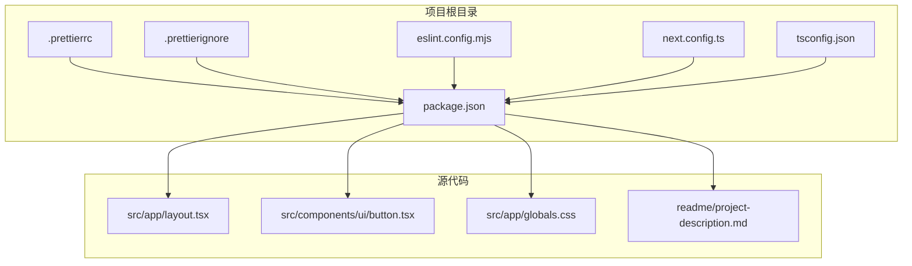
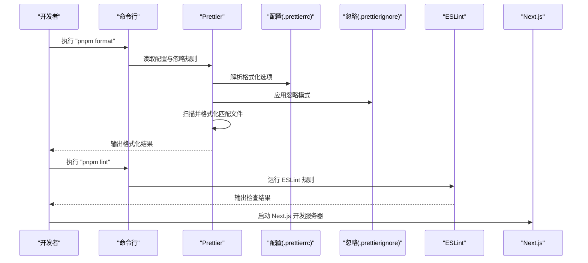
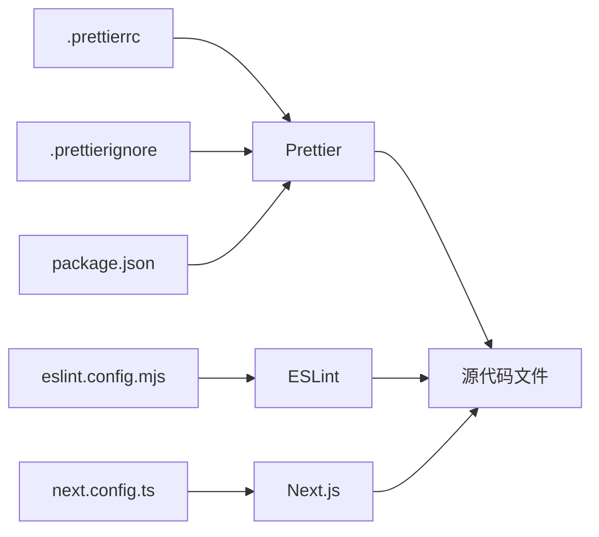

# Prettier 格式化配置

<cite>
**本文引用的文件**
- [.prettierrc](file://.prettierrc)
- [.prettierignore](file://.prettierignore)
- [package.json](file://package.json)
- [eslint.config.mjs](file://eslint.config.mjs)
- [next.config.ts](file://next.config.ts)
- [tsconfig.json](file://tsconfig.json)
- [src/app/layout.tsx](file://src/app/layout.tsx)
- [src/components/ui/button.tsx](file://src/components/ui/button.tsx)
- [src/app/globals.css](file://src/app/globals.css)
- [readme/project-description.md](file://readme/project-description.md)
</cite>

## 目录
1. [简介](#简介)
2. [项目结构](#项目结构)
3. [核心组件](#核心组件)
4. [架构总览](#架构总览)
5. [详细组件分析](#详细组件分析)
6. [依赖关系分析](#依赖关系分析)
7. [性能考量](#性能考量)
8. [故障排查指南](#故障排查指南)
9. [结论](#结论)
10. [附录](#附录)

## 简介
本文件系统性梳理 AIGate 项目的 Prettier 格式化配置，涵盖配置项含义、忽略规则、与编辑器和 Git hooks 的集成、团队协作规范以及常见问题排查。目标是帮助团队成员在不同开发环境中保持一致的代码风格，减少因格式差异导致的审查负担与合并冲突。

## 项目结构
AIGate 为基于 Next.js 的前端项目，采用 TypeScript 与 Tailwind CSS，Prettier 作为统一的代码格式化工具，配合 ESLint 与 Next.js 配置共同保障代码质量与一致性。

图表来源
- [.prettierrc](file://.prettierrc#L1-L16)
- [.prettierignore](file://.prettierignore#L1-L111)
- [package.json](file://package.json#L1-L75)
- [eslint.config.mjs](file://eslint.config.mjs#L1-L19)
- [next.config.ts](file://next.config.ts#L1-L9)
- [tsconfig.json](file://tsconfig.json#L1-L42)
- [src/app/layout.tsx](file://src/app/layout.tsx#L1-L30)
- [src/components/ui/button.tsx](file://src/components/ui/button.tsx#L1-L58)
- [src/app/globals.css](file://src/app/globals.css#L1-L125)
- [readme/project-description.md](file://readme/project-description.md#L1-L160)

章节来源
- [package.json](file://package.json#L1-L75)

## 核心组件
- Prettier 配置文件：统一缩进、引号、分号、换行等格式策略
- Prettier 忽略文件：排除构建产物、依赖、日志、IDE 临时文件等
- 与脚手架集成：通过 package.json 脚本提供格式化命令
- 与 ESLint 协同：避免重复检查格式，聚焦逻辑与风格一致性
- 与 Next.js 配置协同：确保开发与构建环境的一致性

章节来源
- [.prettierrc](file://.prettierrc#L1-L16)
- [.prettierignore](file://.prettierignore#L1-L111)
- [package.json](file://package.json#L6-L16)
- [eslint.config.mjs](file://eslint.config.mjs#L1-L19)
- [next.config.ts](file://next.config.ts#L1-L9)

## 架构总览
下图展示 Prettier 在 AIGate 项目中的工作流：开发者执行格式化脚本后，Prettier 依据配置与忽略规则扫描源文件，对匹配到的文件进行格式化；同时 ESLint 专注于语法与风格规则检查，二者互补。

图表来源
- [package.json](file://package.json#L6-L16)
- [.prettierrc](file://.prettierrc#L1-L16)
- [.prettierignore](file://.prettierignore#L1-L111)
- [eslint.config.mjs](file://eslint.config.mjs#L1-L19)
- [next.config.ts](file://next.config.ts#L1-L9)

## 详细组件分析

### Prettier 配置项详解（.prettierrc）
- 分号：启用分号
- 尾逗号：按 ES5 标准处理
- 单引号：优先使用单引号
- 行宽：100 字符
- 缩进：2 空格（禁用 Tab）
- 大括号间距：保留键值对冒号后的空格
- JSX 单引号：关闭 JSX 属性使用单引号
- JSX 箭头函数括号：始终包裹
- 结尾换行：LF（Unix 风格）
- 对象属性引号：按需添加
- Markdown 段落：保持原样（不强制换行）

这些选项确保：
- TypeScript/TSX 与 CSS 的一致性格式
- JSX 与 Markdown 的可读性与稳定性
- 团队内统一的视觉与排版体验

章节来源
- [.prettierrc](file://.prettierrc#L1-L16)

### Prettier 忽略规则（.prettierignore）
- 依赖与缓存：node_modules、.pnpm-store、.cache、.parcel-cache 等
- 构建输出：.next、out、dist、build
- 环境文件：.env*
- 数据库：drizzle 目录
- 日志与进程：*.log、pids、*.pid、*.seed、*.pid.lock
- 覆盖率与测试缓存：coverage、.nyc_output、.eslintcache
- 包管理器锁文件：仅保留 pnpm-lock.yaml
- IDE 临时文件：.vscode、.idea、*.swp、*.swo、*~

作用：
- 避免对生成物与临时文件进行格式化，提升效率
- 减少无关变更进入版本控制
- 降低 CI/CD 成本

章节来源
- [.prettierignore](file://.prettierignore#L1-L111)

### 与脚手架的集成（package.json）
- 格式化命令：提供写入与检查两种模式，便于本地与 CI 使用
- 依赖：Prettier 版本固定，保证团队一致性

章节来源
- [package.json](file://package.json#L6-L16)

### 与 ESLint 的协同
- ESLint 专注语法与风格规则检查，Prettier 负责格式化
- 通过配置覆盖默认忽略，确保关键目录仍被检查
- 二者结合，避免重复劳动，提高代码质量

章节来源
- [eslint.config.mjs](file://eslint.config.mjs#L1-L19)

### 与 Next.js 配置的协同
- Next.js 开发与构建配置与 Prettier 的忽略规则相辅相成
- 例如 .next 目录被忽略，避免格式化生成物

章节来源
- [next.config.ts](file://next.config.ts#L1-L9)
- [.prettierignore](file://.prettierignore#L64-L66)

### 不同文件类型的格式化规则
- TypeScript/TSX：遵循 .prettierrc 的单引号、分号、行宽、缩进与大括号间距
- CSS：遵循 .prettierrc 的换行与缩进策略，保持与项目主题一致
- Markdown：遵循 .prettierrc 的 proseWrap 与 endOfLine，避免破坏段落结构

示例参考文件
- [src/app/layout.tsx](file://src/app/layout.tsx#L1-L30)
- [src/components/ui/button.tsx](file://src/components/ui/button.tsx#L1-L58)
- [src/app/globals.css](file://src/app/globals.css#L1-L125)
- [readme/project-description.md](file://readme/project-description.md#L1-L160)

章节来源
- [.prettierrc](file://.prettierrc#L1-L16)
- [src/app/layout.tsx](file://src/app/layout.tsx#L1-L30)
- [src/components/ui/button.tsx](file://src/components/ui/button.tsx#L1-L58)
- [src/app/globals.css](file://src/app/globals.css#L1-L125)
- [readme/project-description.md](file://readme/project-description.md#L1-L160)

### VS Code 扩展与 Git hooks 集成
- VS Code 扩展：建议安装 Prettier 插件，并在保存时自动格式化
- Git hooks：可在提交前自动运行格式化与检查，防止格式化差异进入仓库
- 注意：VS Code 设置与 Git hooks 的行为应与 .prettierrc/.prettierignore 保持一致

（本节为通用实践说明，不直接分析具体文件）

### 团队协作中的格式化标准与最佳实践
- 统一使用 pnpm format 与 pnpm format:check
- 在 PR 中禁止提交未格式化的文件
- CI 中加入格式检查步骤，失败即阻断合并
- 新增文件类型时，同步完善 .prettierignore 与 .prettierrc

（本节为通用实践说明，不直接分析具体文件）

## 依赖关系分析
Prettier 的生效依赖于配置文件与忽略文件，同时与脚手架、ESLint、Next.js 配置存在间接耦合。

图表来源
- [.prettierrc](file://.prettierrc#L1-L16)
- [.prettierignore](file://.prettierignore#L1-L111)
- [package.json](file://package.json#L6-L16)
- [eslint.config.mjs](file://eslint.config.mjs#L1-L19)
- [next.config.ts](file://next.config.ts#L1-L9)

章节来源
- [package.json](file://package.json#L6-L16)
- [eslint.config.mjs](file://eslint.config.mjs#L1-L19)
- [next.config.ts](file://next.config.ts#L1-L9)

## 性能考量
- 忽略规则减少扫描范围，显著提升格式化速度
- 使用 pnpm 与 .pnpm-store 缓存，降低依赖解析开销
- 在大型项目中，建议将 .prettierrc 与 .prettierignore 保持精简，避免过度复杂化

（本节为通用指导，不直接分析具体文件）

## 故障排查指南
- 格式化未生效
  - 检查是否正确安装 Prettier 依赖
  - 确认 .prettierrc 与 .prettierignore 是否被识别
  - 使用 pnpm format:check 验证当前状态
- 忽略规则不生效
  - 确认路径与通配符是否正确
  - 检查是否被 ESLint 默认忽略覆盖
- VS Code 保存时格式化异常
  - 确认 VS Code 的 Prettier 扩展已启用
  - 检查工作区设置与全局设置冲突
- Git hooks 报错
  - 确保 hooks 脚本调用 pnpm format 与 pnpm lint
  - 检查权限与 Node 环境

章节来源
- [package.json](file://package.json#L6-L16)
- [.prettierrc](file://.prettierrc#L1-L16)
- [.prettierignore](file://.prettierignore#L1-L111)
- [eslint.config.mjs](file://eslint.config.mjs#L1-L19)

## 结论
AIGate 的 Prettier 配置以简洁明确为核心，结合严格的忽略规则与脚手架集成，形成高效稳定的格式化体系。通过与 ESLint、Next.js 的协同，以及团队协作规范，能够持续保持高质量与一致性的代码风格。

## 附录
- 常用命令
  - pnpm format：格式化全部匹配文件
  - pnpm format:check：检查格式一致性
- 参考文件
  - [package.json](file://package.json#L6-L16)
  - [.prettierrc](file://.prettierrc#L1-L16)
  - [.prettierignore](file://.prettierignore#L1-L111)
  - [eslint.config.mjs](file://eslint.config.mjs#L1-L19)
  - [next.config.ts](file://next.config.ts#L1-L9)
  - [tsconfig.json](file://tsconfig.json#L1-L42)