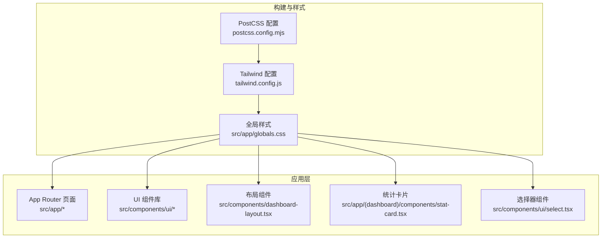
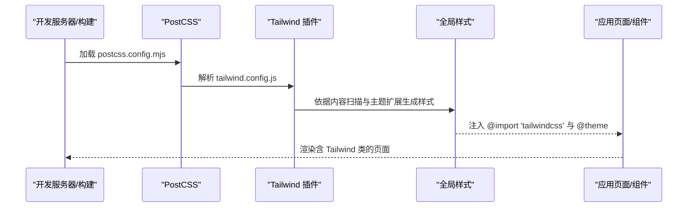
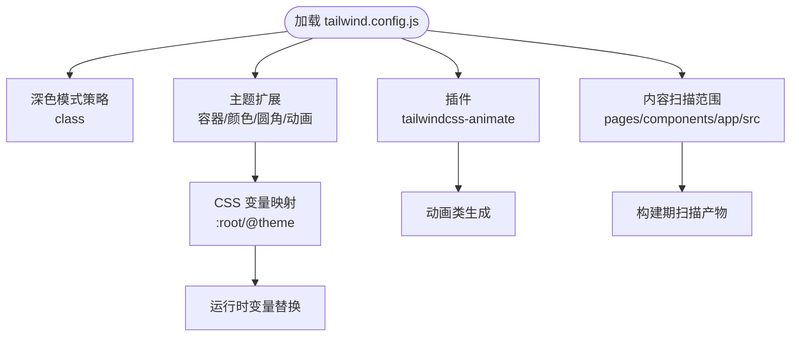
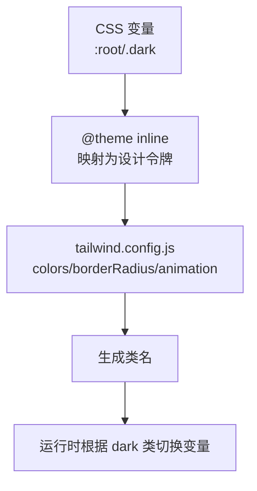
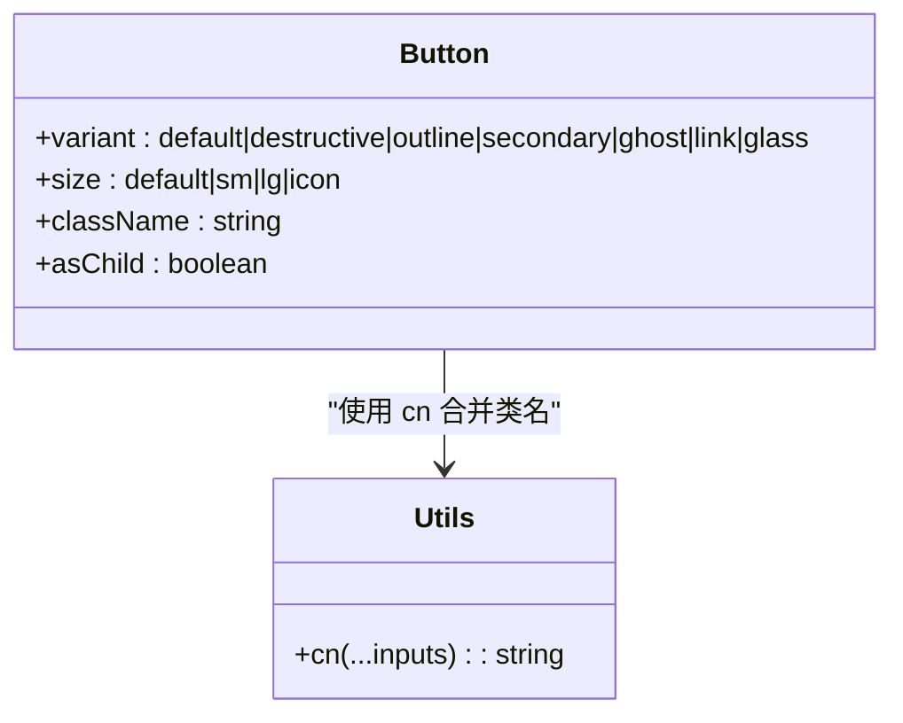
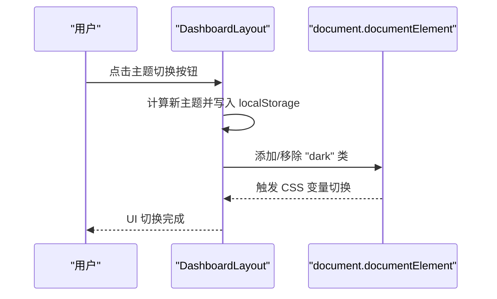
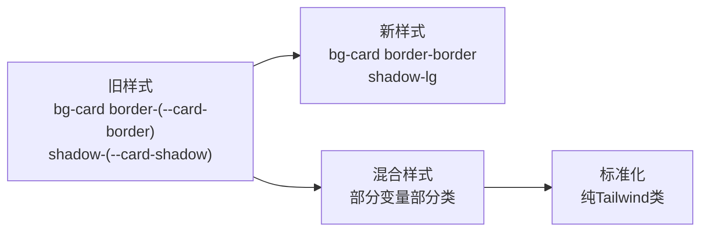
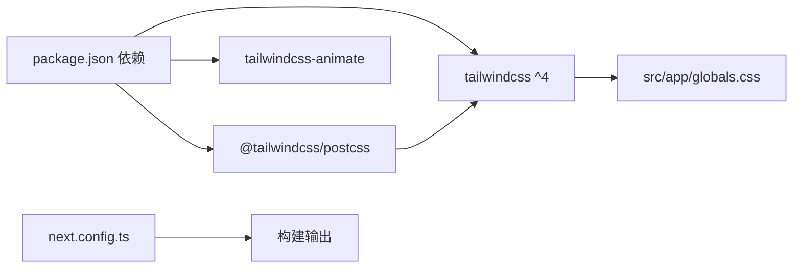

# Tailwind CSS 配置

<cite>
**本文引用的文件**
- [tailwind.config.js](file://tailwind.config.js)
- [postcss.config.mjs](file://postcss.config.mjs)
- [package.json](file://package.json)
- [next.config.ts](file://next.config.ts)
- [src/app/globals.css](file://src/app/globals.css)
- [components.json](file://components.json)
- [src/components/ui/button.tsx](file://src/components/ui/button.tsx)
- [src/lib/utils.ts](file://src/lib/utils.ts)
- [src/components/dashboard-layout.tsx](file://src/components/dashboard-layout.tsx)
- [src/app/(dashboard)/components/stat-card.tsx](file://src/app/(dashboard)/components/stat-card.tsx)
- [src/components/ui/select.tsx](file://src/components/ui/select.tsx)
- [readme/ui-rule.md](file://readme/ui-rule.md)
</cite>

## 更新摘要
**所做更改**
- 更新了组件样式重构部分，反映从自定义CSS变量到标准Tailwind类的迁移
- 新增了UI组件样式标准化的具体实例分析
- 更新了样式冲突解决和调试技巧章节
- 完善了团队协作中的设计系统规范

## 目录
1. [简介](#简介)
2. [项目结构](#项目结构)
3. [核心组件](#核心组件)
4. [架构概览](#架构概览)
5. [详细组件分析](#详细组件分析)
6. [UI组件样式标准化](#ui组件样式标准化)
7. [依赖分析](#依赖分析)
8. [性能考虑](#性能考虑)
9. [故障排查指南](#故障排查指南)
10. [结论](#结论)
11. [附录](#附录)

## 简介
本文件面向 AIGate 项目的 Tailwind CSS 配置，系统化解读 tailwind.config.js 的主题定制、颜色系统、动画扩展、内容扫描范围与插件集成，并结合 PostCSS、Next.js App Router 与组件库配置，给出响应式断点、自定义工具类、样式冲突解决与团队协作的设计系统规范与命名约定。

**更新** 本版本重点反映了UI组件样式标准化的变更，从自定义CSS变量迁移到标准Tailwind类的实践案例。

## 项目结构
AIGate 使用 Next.js App Router，Tailwind CSS 通过 PostCSS 插件在构建阶段处理，全局样式通过 src/app/globals.css 引入并启用原生 @theme 与 @custom-variant dark，组件库采用基于 Radix UI 与 class-variance-authority 的 CVA 组件体系。



**图表来源**
- [postcss.config.mjs](file://postcss.config.mjs#L1-L8)
- [tailwind.config.js](file://tailwind.config.js#L1-L78)
- [src/app/globals.css](file://src/app/globals.css#L1-L125)

**章节来源**
- [postcss.config.mjs](file://postcss.config.mjs#L1-L8)
- [tailwind.config.js](file://tailwind.config.js#L1-L78)
- [src/app/globals.css](file://src/app/globals.css#L1-L125)

## 核心组件
- Tailwind 配置与主题扩展
  - 深色模式：class 机制，配合 @custom-variant dark
  - 内容扫描：覆盖 pages、components、app、src 下 TS/TSX
  - 主题扩展：容器、颜色系统（HSL 变量映射）、圆角变量、动画键帧与别名
  - 插件：tailwindcss-animate
- PostCSS 集成
  - 使用 @tailwindcss/postcss 插件，确保 Tailwind 指令在构建期生效
- Next.js 集成
  - next.config.ts 启用 reactCompiler 与 standalone 输出
- 全局样式与设计系统
  - src/app/globals.css 定义 CSS 变量、@theme 映射、深浅两套变量与 @custom-variant dark
  - components.json 指定 tailwind.config.js、CSS、基础色与 CSS 变量开关
- 组件库与工具函数
  - CVA 组件（如 Button）使用 cn 合并类名，结合 CSS 变量实现玻璃与主题色

**章节来源**
- [tailwind.config.js](file://tailwind.config.js#L1-L78)
- [postcss.config.mjs](file://postcss.config.mjs#L1-L8)
- [next.config.ts](file://next.config.ts#L1-L9)
- [src/app/globals.css](file://src/app/globals.css#L1-L125)
- [components.json](file://components.json#L1-L18)
- [src/components/ui/button.tsx](file://src/components/ui/button.tsx#L1-L58)
- [src/lib/utils.ts](file://src/lib/utils.ts#L1-L7)

## 架构概览
Tailwind 在构建流程中的作用链路如下：



**图表来源**
- [postcss.config.mjs](file://postcss.config.mjs#L1-L8)
- [tailwind.config.js](file://tailwind.config.js#L1-L78)
- [src/app/globals.css](file://src/app/globals.css#L1-L125)

## 详细组件分析

### Tailwind 配置详解（tailwind.config.js）
- 深色模式
  - 使用 ["class"] 策略，通过给 html 或根元素添加 dark 类触发展示
  - 结合 src/app/globals.css 的 @custom-variant dark，确保在任意层级正确匹配
- 内容扫描（content）
  - 覆盖 ./pages/**/*.{ts,tsx}、./components/**/*.{ts,tsx}、./app/**/*.{ts,tsx}、./src/**/*.{ts,tsx}
  - 保证 Next.js App Router 的 app 目录与 src 下组件均可被扫描到
- 主题扩展（theme.extend）
  - 容器：居中、内边距、2xl 屏幕断点
  - 颜色系统：border/input/ring/background/foreground/primary/secondary/destructive/muted/accent/popover/card
    - 均映射至 CSS 变量，便于与 @theme 一致化
  - 圆角：lg/md/sm 对应 --radius 变量派生
  - 动画：accordion-down/up 键帧与别名，配合 tailwindcss-animate 插件
- 插件
  - tailwindcss-animate：提供折叠/展开等常用动画类



**图表来源**
- [tailwind.config.js](file://tailwind.config.js#L1-L78)
- [src/app/globals.css](file://src/app/globals.css#L53-L75)

**章节来源**
- [tailwind.config.js](file://tailwind.config.js#L1-L78)

### PostCSS 集成（postcss.config.mjs）
- 通过 @tailwindcss/postcss 插件启用 Tailwind 指令（@import 'tailwindcss'、@theme 等）
- 与 tailwind.config.js 协同工作，确保内容扫描与主题扩展生效

**章节来源**
- [postcss.config.mjs](file://postcss.config.mjs#L1-L8)

### 全局样式与设计系统（src/app/globals.css）
- @import 'tailwindcss'：引入 Tailwind 样式
- @custom-variant dark：自定义深色变体，兼容任意层级
- :root 与 .dark：定义 CSS 变量（背景、前景、卡片、遮罩、主/次/强调/破坏性、边框、输入、环、圆角、玻璃模糊与饱和度）
- @theme inline：将 CSS 变量映射为 Tailwind 设计令牌，使 tailwind.config.js 的颜色与圆角等扩展与 CSS 变量保持一致
- body：绑定背景与文字颜色，设置基础字体族



**图表来源**
- [src/app/globals.css](file://src/app/globals.css#L1-L125)
- [tailwind.config.js](file://tailwind.config.js#L11-L75)

**章节来源**
- [src/app/globals.css](file://src/app/globals.css#L1-L125)

### 组件库与工具类（CVA + cn）
- CVA 组件（如 Button）使用 variants/sizes 与 CSS 变量组合，实现主题色、悬停、激活与玻璃效果
- cn 工具函数合并类名并进行冲突修复（clsx + tailwind-merge）



**图表来源**
- [src/components/ui/button.tsx](file://src/components/ui/button.tsx#L1-L58)
- [src/lib/utils.ts](file://src/lib/utils.ts#L1-L7)

**章节来源**
- [src/components/ui/button.tsx](file://src/components/ui/button.tsx#L1-L58)
- [src/lib/utils.ts](file://src/lib/utils.ts#L1-L7)

### 布局与主题切换（Dashboard Layout）
- 通过在 html 根节点添加/移除 dark 类实现主题切换
- 使用 CSS 变量控制背景、卡片、遮罩、边框、阴影等，确保深浅模式一致性



**图表来源**
- [src/components/dashboard-layout.tsx](file://src/components/dashboard-layout.tsx#L95-L132)
- [src/app/globals.css](file://src/app/globals.css#L3-L118)

**章节来源**
- [src/components/dashboard-layout.tsx](file://src/components/dashboard-layout.tsx#L95-L132)
- [src/app/globals.css](file://src/app/globals.css#L3-L118)

### 组件库与 Tailwind 集成（components.json）
- 指定 tailwind.config.js、CSS、基础色（baseColor）、CSS 变量开关与 RSC/TSX 支持
- aliases 指向组件与工具函数路径，便于组件库命令行工具生成组件时解析

**章节来源**
- [components.json](file://components.json#L1-L18)

## UI组件样式标准化

### 样式重构概述
AIGate 项目正在进行UI组件样式标准化，从自定义CSS变量迁移到标准Tailwind类，这一变更提升了样式的一致性和可维护性。

### 具体迁移实例

#### 统计卡片组件（StatCard）
**更新** 统计卡片组件展示了从混合使用到完全采用Tailwind类的迁移过程：

- **迁移前**：使用 `bg-card border-(--card-border) shadow-(--card-shadow)` 等自定义CSS变量
- **迁移后**：完全采用标准Tailwind类，如 `bg-card`、`border-border`、`shadow-lg`



**图表来源**
- [src/app/(dashboard)/components/stat-card.tsx](file://src/app/(dashboard)/components/stat-card.tsx#L42-L72)

#### 仪表板布局组件（DashboardLayout）
**更新** 布局组件中的CSS变量使用也进行了标准化：

- **侧边栏背景**：从 `bg-(--card)/80` 迁移到 `bg-card/80`
- **导航链接**：从 `bg-(--primary-glass)` 迁移到 `bg-primary/20`
- **头部背景**：从 `bg-(--card)/70` 迁移到 `bg-card/70`

#### 选择器组件（Select）
**更新** 选择器组件中保留了必要的CSS变量使用：

- **视口尺寸**：使用 `h-(--radix-select-trigger-height)` 和 `min-w-(--radix-select-trigger-width)` 
- **背景色**：使用 `bg-popover` 替代 `bg-(--popover)`

### 迁移策略与最佳实践

#### 1. 渐进式迁移
- 优先迁移高频使用的组件
- 保持现有功能不变，仅调整样式类名
- 分批次进行，避免一次性大规模改动

#### 2. 样式映射表
创建自定义CSS变量到Tailwind类的映射关系：

| CSS变量 | Tailwind类 | 用途 |
|---------|------------|------|
| `--card` | `bg-card` | 卡片背景 |
| `--primary` | `bg-primary` | 主要按钮 |
| `--border` | `border-border` | 边框样式 |
| `--popover` | `bg-popover` | 弹出层背景 |

#### 3. 兼容性处理
对于Radix UI组件，保留必要的CSS变量以维持功能完整性：

```typescript
// 保留CSS变量用于Radix UI尺寸计算
<SelectPrimitive.Viewport
  className={cn(
    'p-1',
    position === 'popper' &&
      'h-(--radix-select-trigger-height) w-full min-w-(--radix-select-trigger-width)'
  )}
>
```

**章节来源**
- [src/app/(dashboard)/components/stat-card.tsx](file://src/app/(dashboard)/components/stat-card.tsx#L42-L72)
- [src/components/dashboard-layout.tsx](file://src/components/dashboard-layout.tsx#L137-L181)
- [src/components/ui/select.tsx](file://src/components/ui/select.tsx#L79-L83)

## 依赖分析
- Tailwind 版本与插件
  - package.json 指定 tailwindcss^4 与 tailwindcss-animate，与 tailwind.config.js 插件一致
- PostCSS 插件
  - @tailwindcss/postcss 在 postcss.config.mjs 中启用
- Next.js 配置
  - next.config.ts 启用 reactCompiler 与 standalone 输出，不影响 Tailwind 样式生成



**图表来源**
- [package.json](file://package.json#L18-L74)
- [postcss.config.mjs](file://postcss.config.mjs#L1-L8)
- [next.config.ts](file://next.config.ts#L1-L9)

**章节来源**
- [package.json](file://package.json#L18-L74)
- [postcss.config.mjs](file://postcss.config.mjs#L1-L8)
- [next.config.ts](file://next.config.ts#L1-L9)

## 性能考虑
- 内容扫描范围
  - 当前扫描 pages/components/app/src，建议在新增目录后及时更新 content，避免未使用的类未被清理
- 动画与变量
  - 使用 CSS 变量与 tailwind.config.js 的 animation/键帧，避免重复定义
- 构建优化
  - Next.js 启用 reactCompiler，有助于减少运行时开销，样式层面仍以 Tailwind 的按需生成为主
- **更新** 样式标准化后的性能优势
  - 减少了CSS变量的运行时计算开销
  - 提高了样式的可预测性和渲染性能

## 故障排查指南
- 样式不生效
  - 确认 src/app/globals.css 已被页面导入（layout.tsx 已导入）
  - 确认 postcss.config.mjs 中 @tailwindcss/postcss 已启用
  - 确认 tailwind.config.js 的 content 覆盖到目标组件目录
- 深色模式无效
  - 检查是否在 html 根节点添加了 dark 类（DashboardLayout 示例）
  - 确认 @custom-variant dark 与 CSS 变量 .dark 块均存在
- 动画类不工作
  - 确认 tailwindcss-animate 插件已安装并在 tailwind.config.js 中启用
- 类名冲突
  - 使用 cn 工具函数（clsx + tailwind-merge）合并类名，减少冲突
- **更新** 样式标准化相关问题
  - 检查CSS变量是否正确映射到Tailwind类
  - 确认Radix UI组件的CSS变量使用是否必要
  - 验证渐进式迁移过程中类名的正确性
- 构建报错
  - 检查 Tailwind 版本与 PostCSS 插件版本是否匹配（package.json 与 postcss.config.mjs）

**章节来源**
- [src/app/layout.tsx](file://src/app/layout.tsx#L1-L30)
- [postcss.config.mjs](file://postcss.config.mjs#L1-L8)
- [tailwind.config.js](file://tailwind.config.js#L1-L78)
- [src/components/dashboard-layout.tsx](file://src/components/dashboard-layout.tsx#L95-L132)
- [src/lib/utils.ts](file://src/lib/utils.ts#L1-L7)

## 结论
AIGate 的 Tailwind 配置以 CSS 变量为核心，结合 @theme 与 @custom-variant dark，实现了主题一致与按需生成；通过 tailwind.config.js 的主题扩展与 tailwindcss-animate 插件，提供了丰富的组件态与动画能力；配合 PostCSS 与 Next.js App Router，形成稳定的构建与运行时链路。

**更新** 本次UI组件样式标准化进一步提升了项目的代码质量和维护性，通过从自定义CSS变量到标准Tailwind类的迁移，实现了更好的性能表现和开发体验。建议在团队协作中遵循设计系统规范与命名约定，持续维护 content 扫描范围与 CSS 变量体系。

## 附录

### 响应式设计与断点
- 容器断点：2xl=1400px（theme.container.screens）
- 组件内断点：如网格布局使用 md/lg 断点（参考仪表盘页面的 grid-cols）
- 建议
  - 在组件中使用语义化断点（sm/md/lg/xl/2xl），避免硬编码像素
  - 通过 CSS 变量统一管理圆角与间距，确保跨组件一致性

**章节来源**
- [tailwind.config.js](file://tailwind.config.js#L12-L18)
- [src/app/(dashboard)/page.tsx](file://src/app/(dashboard)/page.tsx#L43-L79)

### 自定义工具类与最佳实践
- 自定义工具类
  - 在 tailwind.config.js 的 theme.extend 中添加所需属性（如动画、圆角、阴影）
  - 使用 CSS 变量与 @theme 保持与设计令牌一致
- 最佳实践
  - 优先使用现有工具类，必要时再扩展
  - 通过 CVA 组件封装复杂变体，避免在模板中直接拼接类名
  - 使用 cn 合并类名，减少冲突
  - **更新** 在样式标准化过程中，优先使用标准Tailwind类而非CSS变量

**章节来源**
- [tailwind.config.js](file://tailwind.config.js#L11-L75)
- [src/components/ui/button.tsx](file://src/components/ui/button.tsx#L1-L58)
- [src/lib/utils.ts](file://src/lib/utils.ts#L1-L7)

### 与 Next.js App Router 的集成
- 页面与布局
  - layout.tsx 导入全局样式，确保 Tailwind 指令与 @theme 生效
  - App Router 的 app 目录由 tailwind.config.js 的 content 覆盖
- 构建配置
  - next.config.ts 启用 reactCompiler 与 standalone 输出，不影响 Tailwind 样式生成

**章节来源**
- [src/app/layout.tsx](file://src/app/layout.tsx#L1-L30)
- [tailwind.config.js](file://tailwind.config.js#L4-L9)
- [next.config.ts](file://next.config.ts#L1-L9)

### 团队协作与设计系统规范
- 设计系统
  - 新极简主义 + 杂志质感 + 液态玻璃点缀（参考 UI 规范文档）
  - 深色模式必须支持，规范见 readme/ui-rule.md
- 命名约定
  - 组件使用 CVA，variants/sizes 语义化
  - CSS 变量命名与 tailwind.config.js 一致，避免重复定义
  - 类名合并使用 cn，避免冲突
  - **更新** 样式标准化后，优先使用标准Tailwind类名，CSS变量仅在必要时保留

**章节来源**
- [readme/ui-rule.md](file://readme/ui-rule.md#L1-L99)

### 样式迁移检查清单
- [ ] 组件类名从CSS变量迁移到标准Tailwind类
- [ ] 保留必要的Radix UI CSS变量
- [ ] 验证深色模式兼容性
- [ ] 测试动画和过渡效果
- [ ] 确认响应式断点正常工作
- [ ] 检查组件间样式一致性
- [ ] 更新文档和注释
- [ ] 进行回归测试