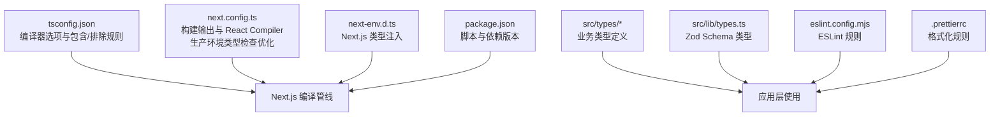
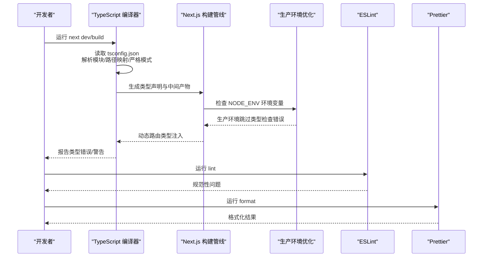
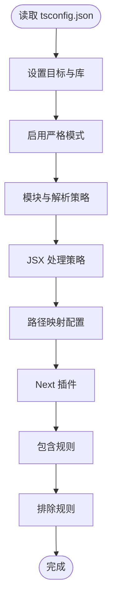
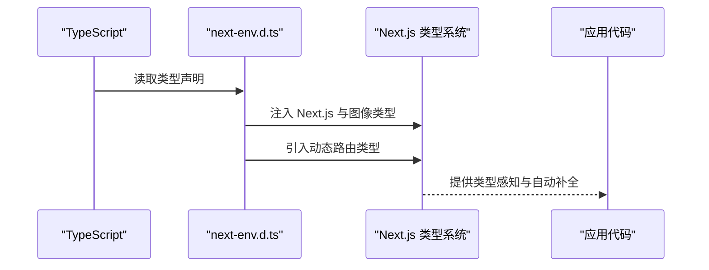
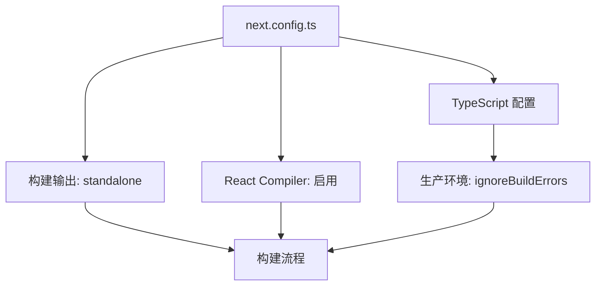
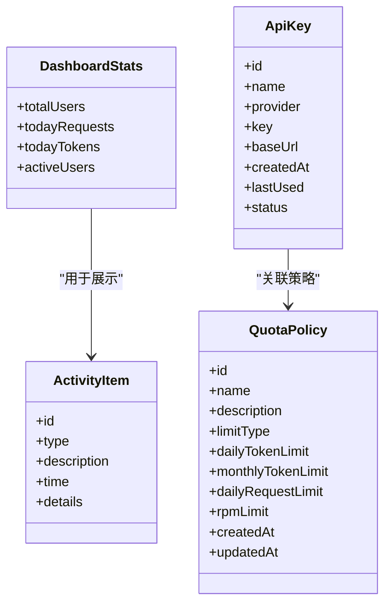
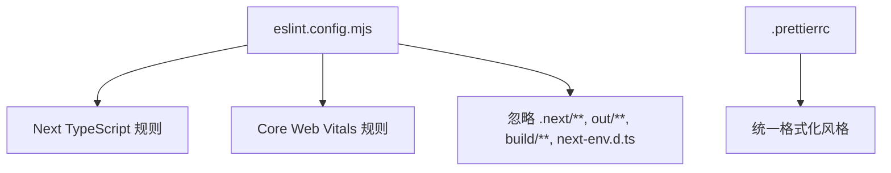
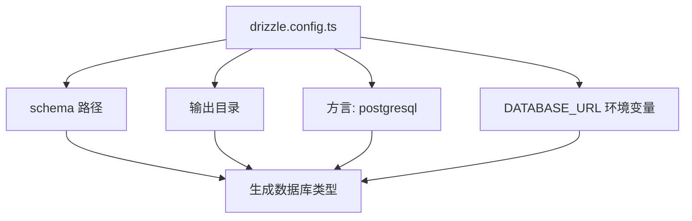
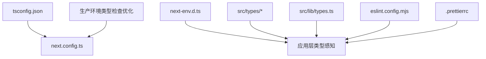

# TypeScript 配置

<cite>
**本文引用的文件**
- [tsconfig.json](file://tsconfig.json)
- [next-env.d.ts](file://next-env.d.ts)
- [next.config.ts](file://next.config.ts)
- [package.json](file://package.json)
- [eslint.config.mjs](file://eslint.config.mjs)
- [.prettierrc](file://.prettierrc)
- [src/app/layout.tsx](file://src/app/layout.tsx)
- [src/app/page.tsx](file://src/app/page.tsx)
- [src/components/ui/button.tsx](file://src/components/ui/button.tsx)
- [src/lib/utils.ts](file://src/lib/utils.ts)
- [src/lib/types.ts](file://src/lib/types.ts)
- [src/types/api-key.ts](file://src/types/api-key.ts)
- [src/types/dashboard.ts](file://src/types/dashboard.ts)
- [drizzle.config.ts](file://drizzle.config.ts)
</cite>

## 更新摘要
**变更内容**
- 新增生产环境类型检查优化配置
- 更新 Next.js TypeScript 配置以提高构建可靠性
- 增强生产环境稳定性策略

## 目录
1. [简介](#简介)
2. [项目结构](#项目结构)
3. [核心组件](#核心组件)
4. [架构总览](#架构总览)
5. [详细组件分析](#详细组件分析)
6. [依赖关系分析](#依赖关系分析)
7. [性能考量](#性能考量)
8. [故障排查指南](#故障排查指南)
9. [结论](#结论)
10. [附录](#附录)

## 简介
本文件系统性梳理 AIGate 项目的 TypeScript 配置与 Next.js 相关配置，重点覆盖以下方面：
- tsconfig.json 的编译选项与严格模式、模块解析策略、输出配置
- Next.js 特定的 TypeScript 配置（JSX 处理、路径映射、类型声明）
- next-env.d.ts 的作用与 Next.js 环境变量类型注入机制
- **新增**：生产环境类型检查优化配置，提高构建可靠性
- 开发、测试、生产等不同环境下的配置差异与建议
- TypeScript 最佳实践、常见错误与修复思路
- 类型安全检查与代码重构注意事项
- 团队协作中的类型定义规范与共享策略

## 项目结构
AIGate 使用 Next.js App Router 架构，TypeScript 配置集中于根目录的 tsconfig.json，并通过 next.config.ts 控制构建行为。类型定义分布在 src/types 与 src/lib/types 中，配合 ESLint 与 Prettier 统一风格。

**更新** 新增生产环境类型检查优化配置，通过 `ignoreBuildErrors: process.env.NODE_ENV === 'production'` 实现

图表来源
- [tsconfig.json](file://tsconfig.json#L1-L42)
- [next.config.ts](file://next.config.ts#L1-L12)
- [next-env.d.ts](file://next-env.d.ts#L1-L8)
- [package.json](file://package.json#L1-L84)
- [eslint.config.mjs](file://eslint.config.mjs#L1-L19)
- [.prettierrc](file://.prettierrc#L1-L16)

章节来源
- [tsconfig.json](file://tsconfig.json#L1-L42)
- [next.config.ts](file://next.config.ts#L1-L12)
- [next-env.d.ts](file://next-env.d.ts#L1-L8)
- [package.json](file://package.json#L1-L84)
- [eslint.config.mjs](file://eslint.config.mjs#L1-L19)
- [.prettierrc](file://.prettierrc#L1-L16)

## 核心组件
- 编译器选项与严格模式
  - 启用严格模式、跳过库检查、禁止发出 JS、启用增量编译、隔离模块等，确保类型安全与快速增量构建。
- 模块解析策略
  - 使用 bundler 解析器，支持 JSON 模块解析，适配现代打包器生态。
- 输出与 JSX 处理
  - JSX 采用 react-jsx，目标 ES2017，库包含 DOM、迭代器与 ESNext，满足浏览器与 Node 场景。
- 路径映射
  - 通过 paths 将 @/* 映射到 ./src/*，统一导入路径，提升可维护性。
- Next.js 类型注入
  - 通过 next-env.d.ts 引入 Next.js 与图像类型，并引入 .next/dev/types 下的动态路由类型。
- **新增**：生产环境类型检查优化
  - 通过 `typescript.ignoreBuildErrors` 配置，在生产环境中跳过 TypeScript 类型检查错误，提高构建可靠性。

**章节来源**
- [tsconfig.json](file://tsconfig.json#L2-L29)
- [next.config.ts](file://next.config.ts#L6-L8)
- [next-env.d.ts](file://next-env.d.ts#L1-L8)

## 架构总览
TypeScript 在 AIGate 中的职责是：
- 在构建前进行类型检查与模块解析
- 生成 Next.js 所需的类型声明（如路由类型）
- 与 ESLint、Prettier 协作，保证代码质量与一致性
- **新增**：在生产环境中平衡类型安全与构建稳定性

**更新** 新增生产环境类型检查优化流程

图表来源
- [tsconfig.json](file://tsconfig.json#L1-L42)
- [next.config.ts](file://next.config.ts#L6-L8)
- [next-env.d.ts](file://next-env.d.ts#L1-L8)
- [eslint.config.mjs](file://eslint.config.mjs#L1-L19)
- [.prettierrc](file://.prettierrc#L1-L16)

## 详细组件分析

### tsconfig.json 分析
- 编译器选项要点
  - 目标与库：ES2017 与 DOM/迭代器/ESNext 库，兼顾浏览器与 Node 场景。
  - 严格模式：开启严格模式，提升类型安全性。
  - 模块与解析：ESNext 模块与 bundler 解析器，支持现代打包器。
  - JSX：react-jsx，适配 React 18+ JSX transform。
  - 路径映射：@/* -> ./src/*，简化导入路径。
  - 插件：启用 Next 插件以获得框架特定类型支持。
- 包含与排除
  - 包含 next-env.d.ts、所有 ts/tsx、以及 .next/types/**/*.ts 与 .next/dev/types/**/*.ts，确保类型覆盖到动态路由与 Next 生成类型。
  - 排除 node_modules，避免第三方包影响类型检查。

**更新** 新增生产环境类型检查优化配置

图表来源
- [tsconfig.json](file://tsconfig.json#L2-L41)
- [next.config.ts](file://next.config.ts#L6-L8)

章节来源
- [tsconfig.json](file://tsconfig.json#L2-L41)
- [next.config.ts](file://next.config.ts#L6-L8)

### next-env.d.ts 的作用
- 类型注入
  - 引入 Next.js 与图像类型的全局声明，使 IDE 与编译器识别框架内置类型。
  - 引入 .next/dev/types/routes.d.ts，将动态路由参数、查询字符串等类型注入到应用层。
- 不可编辑提示
  - 文件注释明确该文件不应被手动修改，遵循 Next.js 官方建议。

**更新** 新增生产环境类型检查优化配置

图表来源
- [next-env.d.ts](file://next-env.d.ts#L1-L8)
- [next.config.ts](file://next.config.ts#L6-L8)

章节来源
- [next-env.d.ts](file://next-env.d.ts#L1-L8)
- [next.config.ts](file://next.config.ts#L6-L8)

### Next.js 构建配置（next.config.ts）
- 构建输出
  - output: standalone，便于容器化部署与边缘运行时。
- React Compiler
  - reactCompiler: true，启用 React Compiler 优化，提升渲染性能与包体积。
- **新增**：生产环境类型检查优化
  - typescript.ignoreBuildErrors: process.env.NODE_ENV === 'production'
  - 在生产环境中跳过 TypeScript 类型检查错误，提高构建可靠性
- 兼容性
  - 保持与 Next.js 版本一致，避免不兼容的实验特性。

**更新** 新增生产环境类型检查优化配置

图表来源
- [next.config.ts](file://next.config.ts#L1-L12)

章节来源
- [next.config.ts](file://next.config.ts#L1-L12)

### 路径映射与模块解析
- 路径映射
  - @/* -> ./src/*，统一导入路径，减少相对路径层级。
- 模块解析
  - bundler 解析器与 ESNext 模块，适配现代打包器（如 Turbopack/webpack）。
- 实际使用示例
  - 组件导入中使用 @/lib/utils，符合路径映射约定。

**更新** 新增生产环境类型检查优化配置

图表来源
- [tsconfig.json](file://tsconfig.json#L25-L29)
- [src/lib/utils.ts](file://src/lib/utils.ts#L1-L7)
- [src/components/ui/button.tsx](file://src/components/ui/button.tsx#L5-L5)
- [next.config.ts](file://next.config.ts#L6-L8)

章节来源
- [tsconfig.json](file://tsconfig.json#L25-L29)
- [src/lib/utils.ts](file://src/lib/utils.ts#L1-L7)
- [src/components/ui/button.tsx](file://src/components/ui/button.tsx#L5-L5)
- [next.config.ts](file://next.config.ts#L6-L8)

### 类型定义与 Zod Schema
- 业务类型
  - src/types 下定义界面与数据模型类型，如仪表盘统计、活动项、趋势数据等。
- Zod Schema 类型
  - src/lib/types.ts 使用 Zod 定义校验与推断类型，确保运行时与编译时类型一致。
- API Key 类型
  - src/types/api-key.ts 定义 API Key 的结构与表单数据类型，约束提供商枚举与状态。

**更新** 新增生产环境类型检查优化配置

图表来源
- [src/types/dashboard.ts](file://src/types/dashboard.ts#L1-L48)
- [src/types/api-key.ts](file://src/types/api-key.ts#L1-L19)
- [src/lib/types.ts](file://src/lib/types.ts#L1-L118)
- [next.config.ts](file://next.config.ts#L6-L8)

章节来源
- [src/types/dashboard.ts](file://src/types/dashboard.ts#L1-L48)
- [src/types/api-key.ts](file://src/types/api-key.ts#L1-L19)
- [src/lib/types.ts](file://src/lib/types.ts#L1-L118)
- [next.config.ts](file://next.config.ts#L6-L8)

### ESLint 与 Prettier 集成
- ESLint
  - 使用 eslint-config-next 的 core-web-vitals 与 typescript 规则集，结合自定义忽略列表，覆盖 .next、out、build 与 next-env.d.ts。
- Prettier
  - 统一分号、尾逗号、单引号、宽度、缩进等风格，保证团队一致性。

**更新** 新增生产环境类型检查优化配置

图表来源
- [eslint.config.mjs](file://eslint.config.mjs#L1-L19)
- [.prettierrc](file://.prettierrc#L1-L16)
- [next.config.ts](file://next.config.ts#L6-L8)

章节来源
- [eslint.config.mjs](file://eslint.config.mjs#L1-L19)
- [.prettierrc](file://.prettierrc#L1-L16)
- [next.config.ts](file://next.config.ts#L6-L8)

### Drizzle 配置与类型
- Drizzle 配置
  - 指定 schema 路径、输出目录、方言与数据库凭证 URL，配合环境变量使用。
- 类型生成
  - 通过 drizzle-kit 生成数据库类型，与 src/lib/types.ts 的 Zod 类型形成互补。

**更新** 新增生产环境类型检查优化配置

图表来源
- [drizzle.config.ts](file://drizzle.config.ts#L1-L11)
- [next.config.ts](file://next.config.ts#L6-L8)

章节来源
- [drizzle.config.ts](file://drizzle.config.ts#L1-L11)
- [next.config.ts](file://next.config.ts#L6-L8)

## 依赖关系分析
- TypeScript 与 Next.js
  - tsconfig.json 与 next.config.ts 协同，确保编译与运行时一致。
- 类型声明与应用层
  - next-env.d.ts 注入 Next.js 类型；src/types 与 src/lib/types.ts 提供业务类型。
- 工具链集成
  - ESLint 与 Prettier 作为静态检查与格式化工具，保障代码质量。
- **新增**：生产环境类型检查优化
  - 通过环境变量控制类型检查行为，平衡开发体验与生产稳定性。

**更新** 新增生产环境类型检查优化配置

**更新** 新增生产环境类型检查优化配置

图表来源
- [tsconfig.json](file://tsconfig.json#L1-L42)
- [next.config.ts](file://next.config.ts#L1-L12)
- [next-env.d.ts](file://next-env.d.ts#L1-L8)
- [eslint.config.mjs](file://eslint.config.mjs#L1-L19)
- [.prettierrc](file://.prettierrc#L1-L16)

章节来源
- [tsconfig.json](file://tsconfig.json#L1-L42)
- [next.config.ts](file://next.config.ts#L1-L12)
- [next-env.d.ts](file://next-env.d.ts#L1-L8)
- [eslint.config.mjs](file://eslint.config.mjs#L1-L19)
- [.prettierrc](file://.prettierrc#L1-L16)

## 性能考量
- 增量编译
  - incremental: true，显著提升大型项目的二次构建速度。
- 模块解析
  - bundler 解析器与 ESNext 模块，减少不必要的转换与 polyfill。
- 构建输出
  - standalone 输出便于容器化与边缘部署，减少运行时依赖。
- React Compiler
  - 启用 React Compiler 可降低运行时开销，提升渲染性能。
- **新增**：生产环境类型检查优化
  - 在生产环境中跳过类型检查错误，避免因类型问题导致的构建失败，提高部署可靠性。

**更新** 新增生产环境类型检查优化配置

章节来源
- [tsconfig.json](file://tsconfig.json#L18-L19)
- [next.config.ts](file://next.config.ts#L4-L6)
- [next.config.ts](file://next.config.ts#L6-L8)

## 故障排查指南
- 类型错误
  - 症状：编译报错或 IDE 提示类型不匹配。
  - 排查：确认 tsconfig.json 的 strict、module、moduleResolution 是否与项目一致；检查 next-env.d.ts 是否正确引入动态路由类型。
- 路径解析失败
  - 症状：导入 @/* 报错。
  - 排查：确认 tsconfig.json 的 paths 配置与实际目录结构一致；确保 bundler 解析器可用。
- Next.js 类型缺失
  - 症状：路由参数、图像类型不可用。
  - 排查：确认 next-env.d.ts 正确引入；清理 .next/types 并重新构建。
- **新增**：生产环境构建失败
  - 症状：生产环境构建因 TypeScript 错误而失败。
  - 排查：确认 NODE_ENV 环境变量设置为 production；检查 typescript.ignoreBuildErrors 配置是否生效。
- ESLint 冲突
  - 症状：ESLint 忽略 .next 类型文件或报错。
  - 排查：检查 eslint.config.mjs 的忽略列表是否包含 .next/**、next-env.d.ts；必要时调整规则。
- Prettier 格式化异常
  - 症状：格式化结果与预期不符。
  - 排查：核对 .prettierrc 的配置项；确保编辑器使用同一配置。

**更新** 新增生产环境类型检查优化配置相关故障排查

章节来源
- [tsconfig.json](file://tsconfig.json#L1-L42)
- [next-env.d.ts](file://next-env.d.ts#L1-L8)
- [next.config.ts](file://next.config.ts#L6-L8)
- [eslint.config.mjs](file://eslint.config.mjs#L1-L19)
- [.prettierrc](file://.prettierrc#L1-L16)

## 结论
AIGate 的 TypeScript 配置围绕严格模式、现代模块解析与 Next.js 类型注入展开，结合 ESLint 与 Prettier 形成完整的质量保障体系。通过路径映射与 Zod 类型，项目在类型安全与开发效率之间取得平衡。**新增的生产环境类型检查优化配置**进一步提升了构建可靠性，通过在生产环境中跳过 TypeScript 类型检查错误，确保部署流程的稳定性。建议在团队协作中统一类型定义与命名规范，持续优化增量编译与构建输出策略，同时合理利用生产环境优化配置来平衡质量与可靠性。

**更新** 新增生产环境类型检查优化配置总结

## 附录

### 不同环境的配置差异与建议
- 开发环境
  - 使用 next dev 启动，启用增量编译与 React Compiler；确保 .next/types 与 .next/dev/types 更新。
  - TypeScript 严格模式完全启用，提供最佳类型安全保障。
- 测试环境
  - 使用 next build 进行类型检查与打包验证；结合 ESLint 与 Prettier 规则。
  - TypeScript 严格模式启用，确保测试环境与生产环境的一致性。
- **新增**：生产环境
  - 使用 standalone 输出，便于容器化部署；确保 DATABASE_URL 等环境变量正确配置。
  - 启用 typescript.ignoreBuildErrors 配置，在生产环境中跳过 TypeScript 类型检查错误，提高构建可靠性。
  - 通过 NODE_ENV 环境变量自动切换类型检查行为。

**更新** 新增生产环境配置差异

章节来源
- [package.json](file://package.json#L6-L16)
- [next.config.ts](file://next.config.ts#L4-L6)
- [next.config.ts](file://next.config.ts#L6-L8)
- [drizzle.config.ts](file://drizzle.config.ts#L7-L9)

### TypeScript 最佳实践
- 优先使用严格模式与隔离模块，减少隐式类型。
- 利用路径映射统一导入，避免深层相对路径。
- 将业务类型与 Zod Schema 分离，分别用于编译期与运行时校验。
- 在组件中显式声明 props 类型，结合 Radix 组件的变体类型。
- **新增**：合理利用生产环境类型检查优化配置，平衡开发体验与生产稳定性。

**更新** 新增生产环境类型检查优化配置最佳实践

章节来源
- [tsconfig.json](file://tsconfig.json#L9-L19)
- [src/components/ui/button.tsx](file://src/components/ui/button.tsx#L37-L41)
- [src/lib/types.ts](file://src/lib/types.ts#L1-L118)
- [next.config.ts](file://next.config.ts#L6-L8)

### 常见错误与解决方案
- 动态路由类型缺失：确认 next-env.d.ts 引入 .next/dev/types/routes.d.ts。
- 模块解析失败：检查 tsconfig.json 的 paths 与 moduleResolution。
- ESLint 忽略 .next 类型：在 eslint.config.mjs 中调整忽略列表。
- **新增**：生产环境构建失败：检查 NODE_ENV 环境变量与 typescript.ignoreBuildErrors 配置。
- **新增**：类型检查过于严格：在开发环境中保持严格模式，在生产环境中启用忽略配置。

**更新** 新增生产环境类型检查优化配置相关错误处理

章节来源
- [next-env.d.ts](file://next-env.d.ts#L4-L4)
- [tsconfig.json](file://tsconfig.json#L14-L15)
- [eslint.config.mjs](file://eslint.config.mjs#L9-L15)
- [next.config.ts](file://next.config.ts#L6-L8)

### 类型安全检查与重构注意事项
- 重构时优先更新类型定义，再迁移实现。
- 使用 Zod Schema 保证接口一致性，避免手写类型遗漏字段。
- 在组件层使用只读属性与最小暴露原则，降低耦合。
- **新增**：在生产环境中合理利用类型检查优化配置，确保部署流程稳定。

**更新** 新增生产环境类型检查优化配置注意事项

章节来源
- [src/lib/types.ts](file://src/lib/types.ts#L1-L118)
- [src/types/api-key.ts](file://src/types/api-key.ts#L1-L19)
- [src/types/dashboard.ts](file://src/types/dashboard.ts#L1-L48)
- [next.config.ts](file://next.config.ts#L6-L8)

### 团队协作中的类型定义规范与共享策略
- 统一命名与目录结构：src/types 用于界面与业务模型，src/lib/types.ts 用于 Zod 与运行时类型。
- 文档化公共类型：为跨模块共享的类型编写简要说明，便于他人理解。
- 版本对齐：确保 TypeScript 与 Next.js 版本兼容，避免实验特性导致的类型不一致。
- **新增**：生产环境类型检查策略：在团队开发中明确区分开发与生产环境的类型检查策略，确保部署流程的可靠性。

**更新** 新增生产环境类型检查策略团队协作规范

章节来源
- [src/types/api-key.ts](file://src/types/api-key.ts#L1-L19)
- [src/types/dashboard.ts](file://src/types/dashboard.ts#L1-L48)
- [src/lib/types.ts](file://src/lib/types.ts#L1-L118)
- [package.json](file://package.json#L46-L46)
- [next.config.ts](file://next.config.ts#L6-L8)