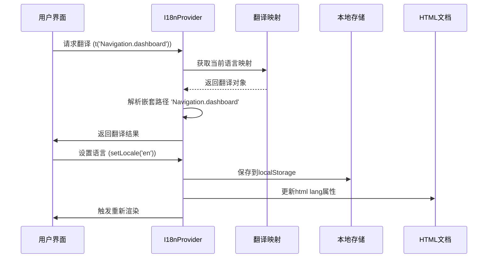
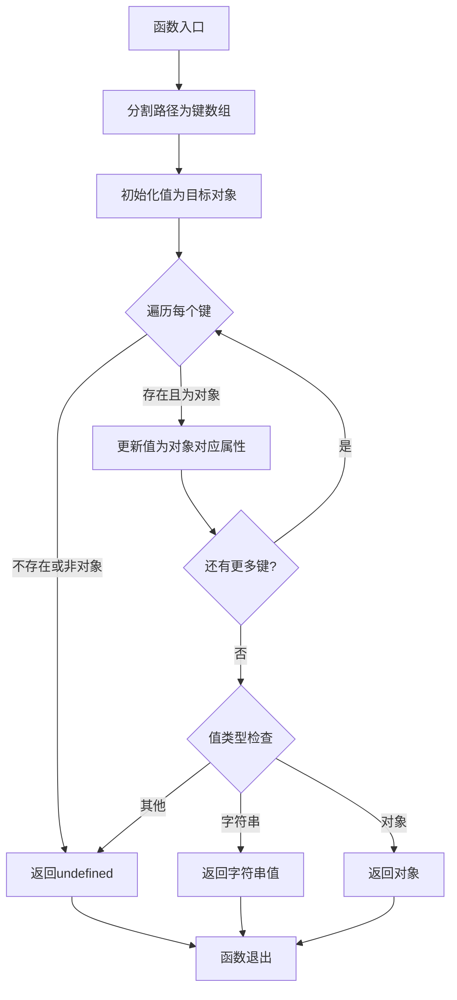
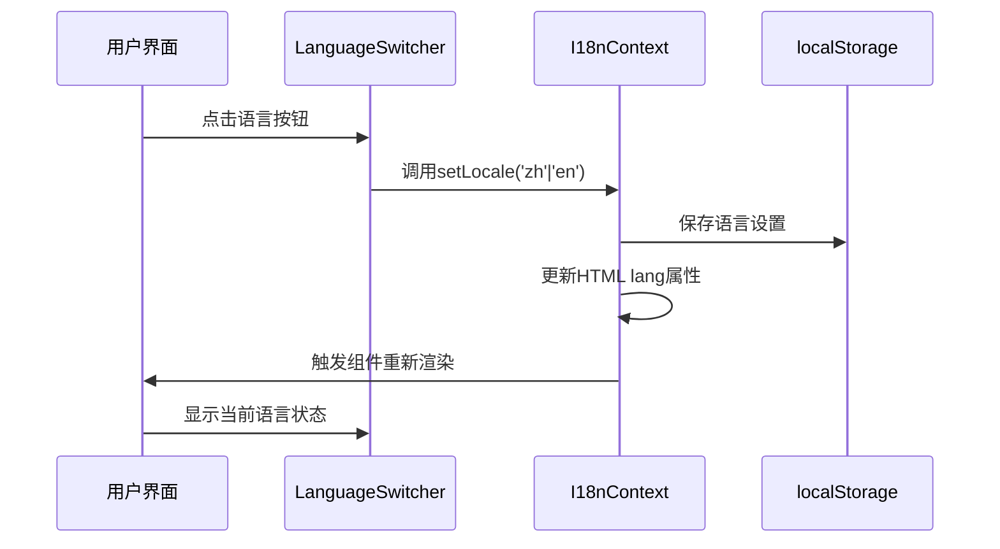
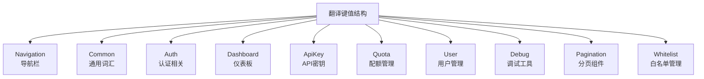
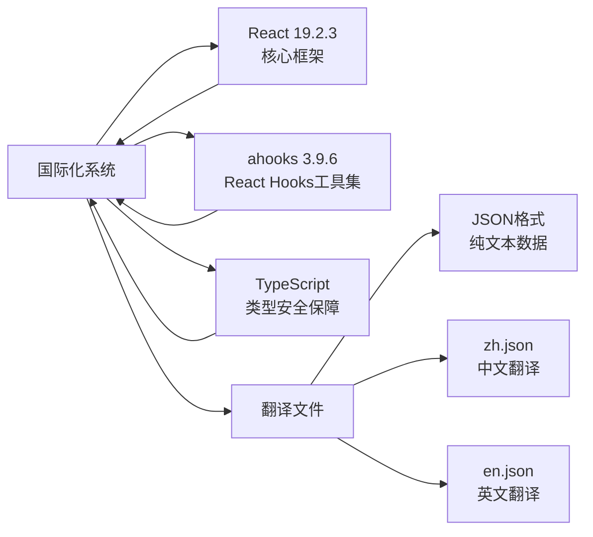
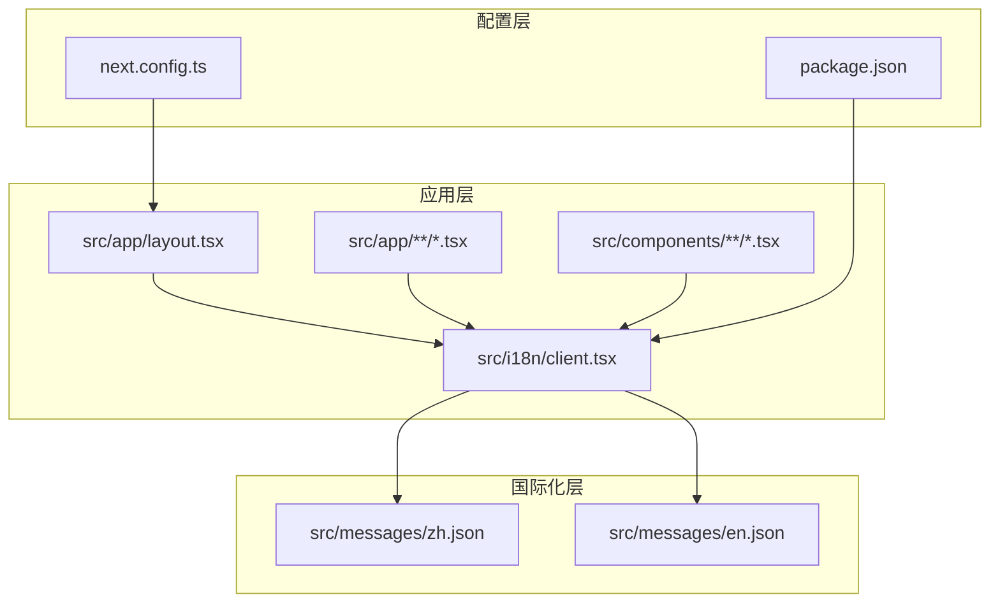

# 国际化系统

<cite>
**本文档引用的文件**
- [src/i18n/client.tsx](file://src/i18n/client.tsx)
- [src/messages/en.json](file://src/messages/en.json)
- [src/messages/zh.json](file://src/messages/zh.json)
- [src/app/layout.tsx](file://src/app/layout.tsx)
- [src/app/(dashboard)/keys/components/api-key-table.tsx](file://src/app/(dashboard)/keys/components/api-key-table.tsx)
- [src/app/login/page.tsx](file://src/app/login/page.tsx)
- [src/components/dashboard-layout/sidebar-nav.tsx](file://src/components/dashboard-layout/sidebar-nav.tsx)
- [src/components/dashboard-layout/sidebar-footer.tsx](file://src/components/dashboard-layout/sidebar-footer.tsx)
- [src/app/(dashboard)/page.tsx](file://src/app/(dashboard)/page.tsx)
- [src/app/(dashboard)/debug/components/quota-debug/index.tsx](file://src/app/(dashboard)/debug/components/quota-debug/index.tsx)
- [src/app/(dashboard)/users/components/whitelist-rule-form.tsx](file://src/app/(dashboard)/users/components/whitelist-rule-form.tsx)
- [src/components/ui/pagination.tsx](file://src/components/ui/pagination.tsx)
- [src/app/(dashboard)/debug/components/quota-debug/check-quota-tab.tsx](file://src/app/(dashboard)/debug/components/quota-debug/check-quota-tab.tsx)
- [src/app/(dashboard)/users/components/whitelist-rule-table.tsx](file://src/app/(dashboard)/users/components/whitelist-rule-table.tsx)
- [package.json](file://package.json)
- [next.config.ts](file://next.config.ts)
</cite>

## 更新摘要
**变更内容**
- 国际化系统进行了重大扩展，新增超过110个翻译键
- 新增Debug、Pagination、Whitelist、Common等分类
- 所有调试组件、白名单管理组件和分页组件都集成了useTranslation钩子
- 翻译键总数从180个增加到295个，覆盖更全面的业务场景
- 分页组件完全支持国际化，包括上一页、下一页、更多页等标签

## 目录
1. [简介](#简介)
2. [项目结构](#项目结构)
3. [核心组件](#核心组件)
4. [架构概览](#架构概览)
5. [详细组件分析](#详细组件分析)
6. [翻译键值结构](#翻译键值结构)
7. [依赖关系分析](#依赖关系分析)
8. [性能考虑](#性能考虑)
9. [故障排除指南](#故障排除指南)
10. [结论](#结论)

## 简介

本项目采用全新自研的国际化（i18n）系统，为 AIGate AI 网关管理系统提供中英文双语支持。该系统基于 React Context 架构，通过本地存储实现语言偏好持久化，并提供了完整的翻译键值映射机制。

系统设计特点：
- **轻量级实现**：自研 i18n 解决方案，避免引入大型第三方库
- **本地存储持久化**：用户语言偏好保存在 localStorage 中
- **嵌套对象支持**：支持深层路径访问的翻译键值
- **类型安全**：完整的 TypeScript 类型定义
- **自动 HTML lang 属性更新**：根据语言切换自动更新页面语言属性
- **动态语言切换**：支持运行时切换语言而不刷新页面
- **全面覆盖**：新增Debug、Pagination、Whitelist等分类，翻译键总数达295个

## 项目结构

国际化系统主要由以下核心文件组成：

```mermaid
graph TB
subgraph "国际化系统架构"
A[src/i18n/client.tsx<br/>I18nProvider 组件] --> B[src/messages/zh.json<br/>中文翻译资源]
A --> C[src/messages/en.json<br/>英文翻译资源]
D[src/app/layout.tsx<br/>应用布局] --> A
E[src/app/**/*.tsx<br/>业务组件] --> A
F[src/components/**/*.tsx<br/>UI组件] --> A
G[src/components/dashboard-layout/sidebar-footer.tsx<br/>语言切换器] --> A
H[src/components/dashboard-layout/sidebar-nav.tsx<br/>导航菜单] --> A
I[src/app/(dashboard)/page.tsx<br/>仪表板页面] --> A
J[src/app/(dashboard)/debug/**/*<br/>调试组件] --> A
K[src/app/(dashboard)/users/**/*<br/>用户管理组件] --> A
L[src/components/ui/pagination.tsx<br/>分页组件] --> A
end
```

**章节来源**
- [src/i18n/client.tsx:1-96](file://src/i18n/client.tsx#L1-L96)
- [src/messages/en.json:1-295](file://src/messages/en.json#L1-L295)
- [src/messages/zh.json:1-295](file://src/messages/zh.json#L1-L295)

## 核心组件

### I18nProvider 组件

国际化系统的核心是 `I18nProvider` 组件，它负责：

- **语言状态管理**：使用 `useLocalStorageState` 管理用户语言偏好
- **翻译函数**：提供 `t()` 函数进行文本翻译
- **上下文提供**：通过 React Context 向子组件提供国际化能力
- **HTML lang 属性**：根据语言切换自动更新页面语言属性
- **动态语言切换**：提供 `setLocale` 函数支持运行时切换语言

### useTranslation 钩子

新的 `useTranslation` 钩子提供了简洁的国际化 API：

```mermaid
flowchart TD
A[useTranslation调用] --> B[获取I18nContext]
B --> C{上下文是否存在?}
C --> |是| D[返回{locale, setLocale, t}]
C --> |否| E[抛出错误]
D --> F[组件获得翻译能力]
E --> G[useTranslation必须在I18nProvider内使用]
```

**章节来源**
- [src/i18n/client.tsx:89-95](file://src/i18n/client.tsx#L89-L95)

## 架构概览

国际化系统采用分层架构设计，确保了良好的可维护性和扩展性：



系统架构的关键特性：

1. **状态隔离**：每个组件只关心自己的翻译需求
2. **懒加载优化**：翻译文件按需加载，减少初始包体积
3. **类型安全保障**：完整的 TypeScript 类型定义防止拼写错误
4. **错误处理**：未找到的翻译键会输出警告并回退到键名本身
5. **实时更新**：语言切换立即生效，无需页面刷新

## 详细组件分析

### getNestedValue 函数

该函数实现了深度对象路径解析，支持点号分隔的嵌套访问：



**章节来源**
- [src/i18n/client.tsx:23-47](file://src/i18n/client.tsx#L23-L47)

### 语言切换器组件

语言切换器组件展示了完整的语言切换功能实现：



**章节来源**
- [src/components/dashboard-layout/sidebar-footer.tsx:119-151](file://src/components/dashboard-layout/sidebar-footer.tsx#L119-L151)

## 翻译键值结构

系统采用分层的 JSON 结构组织翻译内容，现已扩展为完整的业务领域覆盖：



**新增翻译键分类**：
- **Debug分类**：包含配额检查、使用情况、重置配额等功能的完整翻译
- **Pagination分类**：分页组件的国际化支持（上一页、下一页、更多页）
- **Whitelist分类**：白名单规则管理的完整翻译（优先级、验证规则、关联API Key等）

**章节来源**
- [src/messages/en.json:2-295](file://src/messages/en.json#L2-L295)
- [src/messages/zh.json:2-295](file://src/messages/zh.json#L2-L295)

## 依赖关系分析

### 外部依赖

系统对外部依赖的使用情况：



### 内部依赖关系



**章节来源**
- [package.json:1-94](file://package.json#L1-L94)
- [next.config.ts:1-9](file://next.config.ts#L1-L9)

## 性能考虑

### 优化策略

1. **按需加载**：翻译文件作为独立模块加载，避免不必要的包体积增加
2. **缓存机制**：翻译映射在内存中缓存，避免重复解析
3. **懒执行**：翻译函数只有在组件渲染时才执行
4. **本地存储**：语言偏好持久化，减少每次启动的计算开销
5. **类型安全**：编译时类型检查，运行时零额外开销

### 内存使用

- 每个语言的翻译对象约占用 5-10KB 内存
- 支持最多 2 种语言同时驻留内存
- 嵌套对象解析使用递归算法，深度限制在合理范围内
- 本地存储使用 localStorage，避免内存泄漏

## 故障排除指南

### 常见问题及解决方案

#### 翻译键不存在

当访问不存在的翻译键时，系统会输出警告并回退到键名本身：

**解决方法**：
1. 检查翻译键是否存在于对应的 JSON 文件中
2. 验证键名拼写是否正确
3. 确认嵌套路径的层级关系

#### 语言切换不生效

如果语言切换后界面文字没有变化：

**解决步骤**：
1. 检查 `setLocale` 函数是否正确调用
2. 确认 `localStorage` 中的语言设置已被更新
3. 验证组件是否重新渲染
4. 检查 `useTranslation` 钩子是否在正确的组件树中使用

#### HTML lang 属性未更新

页面的 `lang` 属性应该随语言切换而变化：

**检查要点**：
1. 确认 `handleSetLocale` 函数被调用
2. 检查 `document.documentElement.lang` 是否被正确设置
3. 验证浏览器是否支持动态语言属性更新

#### 翻译函数类型错误

在 TypeScript 中使用翻译结果时可能出现类型错误：

**解决方法**：
1. 使用类型断言 `(t('key') as string)` 或 `(t('key') as Record<string, string>)`
2. 在使用前检查返回值类型
3. 利用 TypeScript 的类型推断功能

## 结论

本国际化系统通过简洁而高效的架构设计，为 AIGate AI 网关管理系统提供了可靠的多语言支持。系统经过重大扩展后，现已具备以下优势：

1. **实现简单**：仅 96 行核心代码，易于理解和维护
2. **性能优秀**：零外部依赖，按需加载，内存占用小
3. **功能完整**：支持嵌套键值、类型安全、错误处理、动态语言切换
4. **扩展性强**：易于添加新语言和新翻译键
5. **用户体验佳**：本地存储持久化，语言切换实时生效
6. **覆盖全面**：新增Debug、Pagination、Whitelist等分类，翻译键总数达295个
7. **组件集成完善**：所有调试组件、白名单管理组件和分页组件都集成了国际化支持

该系统特别适合中小型项目的国际化需求，在保证功能完整性的同时最大化了开发效率和运行性能。对于需要更复杂国际化功能的大型项目，可以考虑迁移到专业的国际化解决方案，但本系统为大多数应用场景提供了优秀的平衡点。

**新增功能亮点**：
- 完整的中文/英文双语支持，翻译键总数达295个
- 实时语言切换，无需页面刷新
- 本地存储持久化用户偏好
- 全面的业务领域翻译覆盖，包括调试、分页、白名单管理等
- 简洁易用的 API 设计，useTranslation钩子广泛集成
- 完善的类型安全保证
- 分页组件完全支持国际化

**章节来源**
- [src/i18n/client.tsx:1-96](file://src/i18n/client.tsx#L1-L96)
- [src/messages/en.json:1-295](file://src/messages/en.json#L1-L295)
- [src/messages/zh.json:1-295](file://src/messages/zh.json#L1-L295)