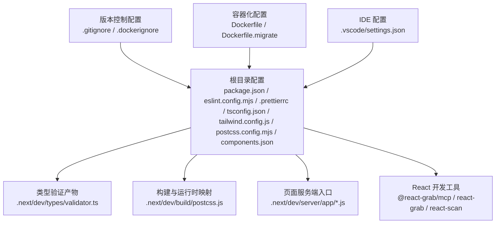
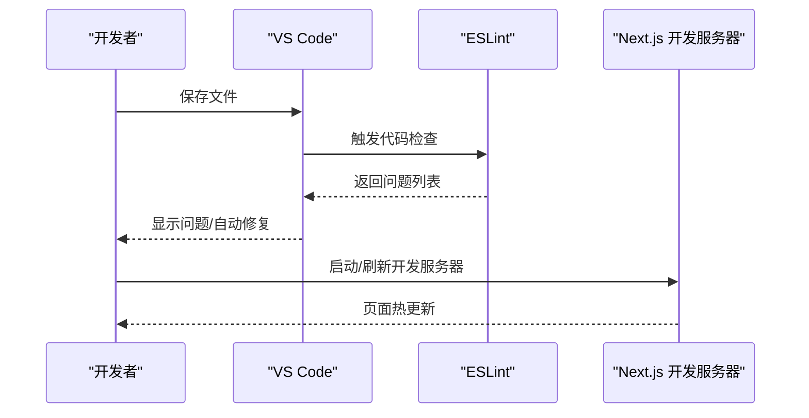
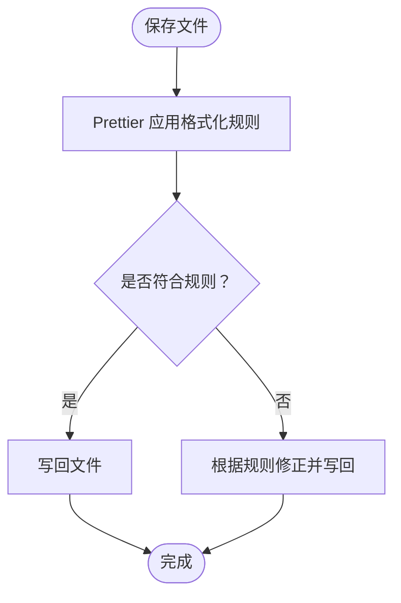
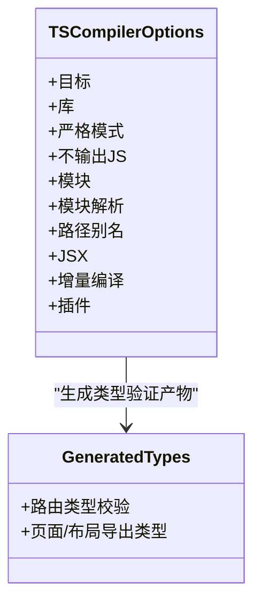
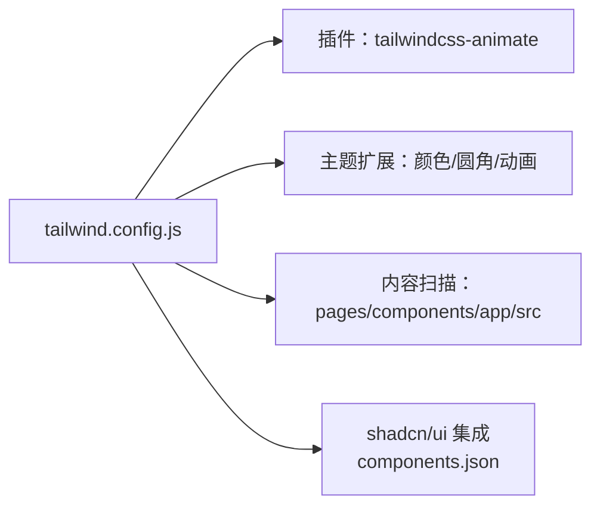
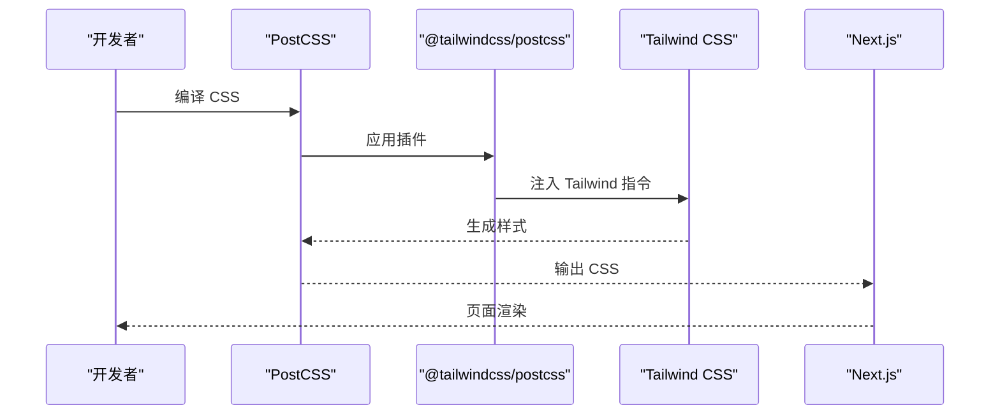
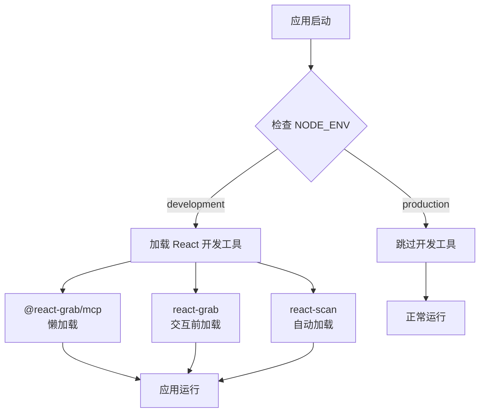
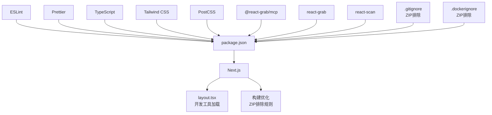

# 开发工具与配置

<cite>
**本文引用的文件**
- [package.json](file://package.json)
- [eslint.config.mjs](file://eslint.config.mjs)
- [.prettierrc](file://.prettierrc)
- [tsconfig.json](file://tsconfig.json)
- [tailwind.config.js](file://tailwind.config.js)
- [postcss.config.mjs](file://postcss.config.mjs)
- [components.json](file://components.json)
- [.vscode/settings.json](file://.vscode/settings.json)
- [src/app/layout.tsx](file://src/app/layout.tsx)
- [next.config.ts](file://next.config.ts)
- [.next/dev/types/validator.ts](file://.next/dev/types/validator.ts)
- [.next/dev/build/postcss.js](file://.next/dev/build/postcss.js)
- [.next/dev/server/app/_not-found/page.js](file://.next/dev/server/app/_not-found/page.js)
- [.next/dev/server/app/login/page.js](file://.next/dev/server/app/login/page.js)
- [.next/dev/server/app/page.js](file://.next/dev/server/app/page.js)
- [.gitignore](file://.gitignore)
- [.dockerignore](file://.dockerignore)
- [Dockerfile](file://Dockerfile)
- [Dockerfile.migrate](file://Dockerfile.migrate)
</cite>

## 更新摘要
**所做更改**
- 新增构建优化与文件排除规则章节，详细说明ZIP文件排除策略
- 更新.gitignore和.dockerignore配置说明，解释ZIP文件排除的必要性和影响
- 增强构建流程优化指南，涵盖Git跟踪和Docker构建上下文优化
- 新增文件排除规则对开发工作流的影响分析

## 目录
1. [简介](#简介)
2. [项目结构](#项目结构)
3. [核心组件](#核心组件)
4. [架构总览](#架构总览)
5. [详细组件分析](#详细组件分析)
6. [React 开发工具集成](#react-开发工具集成)
7. [构建优化与文件排除规则](#构建优化与文件排除规则)
8. [依赖关系分析](#依赖关系分析)
9. [性能考量](#性能考量)
10. [故障排查指南](#故障排查指南)
11. [结论](#结论)
12. [附录](#附录)

## 简介
本文件面向 AIGate 的开发与配置，系统梳理并解释以下开发工具链与配置：
- ESLint：规则集、代码风格检查、潜在问题检测与自动修复
- Prettier：格式化策略（缩进、换行、引号等）
- TypeScript：编译选项（严格模式、模块解析、声明文件处理）
- Tailwind CSS：主题定制、插件集成与构建优化
- PostCSS：预处理与浏览器兼容性设置
- **React 开发工具**：@react-grab/mcp、react-grab、react-scan 的集成与配置
- **构建优化与文件排除规则**：ZIP文件排除策略与构建流程优化
- VS Code 调试与编辑器配置：扩展推荐与保存时格式化/修复
- 代码质量检查流程：提交前检查与持续集成建议
- 开发工作流最佳实践与团队协作规范

## 项目结构
本项目采用 Next.js App Router 结构，配合 TypeScript、Tailwind CSS 与 PostCSS 生态。关键配置文件分布如下：
- 根目录配置：package.json、eslint.config.mjs、.prettierrc、tsconfig.json、tailwind.config.js、postcss.config.mjs、components.json
- 版本控制配置：.gitignore、.dockerignore
- 容器化配置：Dockerfile、Dockerfile.migrate
- IDE 配置：.vscode/settings.json
- 类型验证产物：.next/dev/types/validator.ts
- 构建与运行时映射：.next/dev/build/postcss.js、.next/dev/server/app/*.js
- **React 开发工具**：通过 next/script 在开发环境中动态加载



**图表来源**
- [package.json](file://package.json#L1-L85)
- [.prettierrc](file://.prettierrc#L1-L16)
- [tsconfig.json](file://tsconfig.json#L1-L42)
- [tailwind.config.js](file://tailwind.config.js#L1-L78)
- [postcss.config.mjs](file://postcss.config.mjs#L1-L8)
- [components.json](file://components.json#L1-L18)
- [.gitignore](file://.gitignore#L1-L45)
- [.dockerignore](file://.dockerignore#L1-L13)
- [Dockerfile](file://Dockerfile#L1-L54)
- [Dockerfile.migrate](file://Dockerfile.migrate#L1-L14)
- [.next/dev/types/validator.ts](file://.next/dev/types/validator.ts#L1-L190)
- [.next/dev/build/postcss.js](file://.next/dev/build/postcss.js#L1-L7)
- [.next/dev/server/app/page.js](file://.next/dev/server/app/page.js#L1-L19)
- [src/app/layout.tsx](file://src/app/layout.tsx#L26-L44)

**章节来源**
- [package.json](file://package.json#L1-L85)
- [.prettierrc](file://.prettierrc#L1-L16)
- [tsconfig.json](file://tsconfig.json#L1-L42)
- [tailwind.config.js](file://tailwind.config.js#L1-L78)
- [postcss.config.mjs](file://postcss.config.mjs#L1-L8)
- [components.json](file://components.json#L1-L18)
- [.gitignore](file://.gitignore#L1-L45)
- [.dockerignore](file://.dockerignore#L1-L13)
- [Dockerfile](file://Dockerfile#L1-L54)
- [Dockerfile.migrate](file://Dockerfile.migrate#L1-L14)
- [.next/dev/types/validator.ts](file://.next/dev/types/validator.ts#L1-L190)
- [.next/dev/build/postcss.js](file://.next/dev/build/postcss.js#L1-L7)
- [.next/dev/server/app/page.js](file://.next/dev/server/app/page.js#L1-L19)
- [src/app/layout.tsx](file://src/app/layout.tsx#L26-L44)

## 核心组件
本节从"工具链职责"角度概览各配置组件及其作用范围。

- ESLint
  - 规则来源：基于 eslint-config-next 的 core-web-vitals 与 typescript 规则组合
  - 忽略项：覆盖默认忽略项，确保源码参与检查
  - 自动修复：通过脚本与 VS Code 保存时修复联动实现
- Prettier
  - 统一格式化策略：分号、尾随逗号、单双引号、宽度、制表符、换行符等
  - 与 VS Code 集成：保存即格式化，统一团队风格
- TypeScript
  - 编译目标与库：ES2017 及 DOM/ESNext
  - 严格模式：启用严格类型检查
  - 模块解析：bundler（Turbopack/Next 构建）
  - 路径别名：@/*
- Tailwind CSS
  - 内容扫描：pages/components/app/src 下 TS/TSX
  - 主题扩展：容器、颜色、圆角、动画键值
  - 插件：tailwindcss-animate
- PostCSS
  - 插件：@tailwindcss/postcss
  - 与构建系统映射：由 Turbopack 在开发时加载
- **React 开发工具**
  - **@react-grab/mcp**：React 组件分析和调试工具，仅开发环境加载
  - **react-grab**：React 组件扫描工具，提供组件树可视化
  - **react-scan**：React 组件性能分析工具，自动检测组件渲染
- **构建优化与文件排除规则**
  - **ZIP文件排除**：在.gitignore和.dockerignore中添加*.zip规则，防止ZIP归档被Git跟踪和Docker构建上下文包含
  - **构建上下文优化**：减少不必要的文件传输和存储空间占用
  - **开发工作流优化**：避免ZIP文件干扰版本控制和容器构建
- VS Code
  - 保存时格式化与 ESLint 修复联动
  - 多语言默认格式化器：Prettier

**章节来源**
- [eslint.config.mjs](file://eslint.config.mjs#L1-L19)
- [package.json](file://package.json#L6-L16)
- [.prettierrc](file://.prettierrc#L1-L16)
- [.vscode/settings.json](file://.vscode/settings.json#L1-L34)
- [tsconfig.json](file://tsconfig.json#L2-L30)
- [tailwind.config.js](file://tailwind.config.js#L1-L78)
- [postcss.config.mjs](file://postcss.config.mjs#L1-L8)
- [src/app/layout.tsx](file://src/app/layout.tsx#L26-L44)
- [.gitignore](file://.gitignore#L3-L4)
- [.dockerignore](file://.dockerignore#L1-L13)

## 架构总览
下图展示开发期从编辑器到构建系统的工具链交互，包括新增的构建优化与文件排除规则：

```mermaid
graph TB
subgraph "编辑器"
VS["VS Code<br/>.vscode/settings.json"]
end
subgraph "格式化与检查"
PRE["Prettier<br/>.prettierrc"]
ESL["ESLint<br/>eslint.config.mjs"]
end
subgraph "类型与样式"
TSC["TypeScript<br/>tsconfig.json"]
TW["Tailwind CSS<br/>tailwind.config.js"]
PC["PostCSS<br/>postcss.config.mjs"]
END
subgraph "React 开发工具"
RG["@react-grab/mcp<br/>组件分析"]
RS["react-grab<br/>组件扫描"]
RSC["react-scan<br/>性能分析"]
END
subgraph "构建优化与文件排除"
GI[".gitignore<br/>*.zip 排除"]
DI[".dockerignore<br/>*.zip 排除"]
BC["构建上下文优化"]
END
subgraph "构建与运行"
N["Next.js 开发服务器"]
RT["类型验证产物<br/>.next/dev/types/validator.ts"]
PB["PostCSS 运行时映射<br/>.next/dev/build/postcss.js"]
END
VS --> PRE
VS --> ESL
ESL --> N
PRE --> N
TSC --> N
TW --> PC --> N
RG --> N
RS --> N
RSC --> N
GI --> BC
DI --> BC
BC --> N
N --> RT
N --> PB
```

**图表来源**
- [.vscode/settings.json](file://.vscode/settings.json#L1-L34)
- [.prettierrc](file://.prettierrc#L1-L16)
- [eslint.config.mjs](file://eslint.config.mjs#L1-L19)
- [tsconfig.json](file://tsconfig.json#L1-L42)
- [tailwind.config.js](file://tailwind.config.js#L1-L78)
- [postcss.config.mjs](file://postcss.config.mjs#L1-L8)
- [src/app/layout.tsx](file://src/app/layout.tsx#L26-L44)
- [.next/dev/types/validator.ts](file://.next/dev/types/validator.ts#L1-L190)
- [.next/dev/build/postcss.js](file://.next/dev/build/postcss.js#L1-L7)
- [.gitignore](file://.gitignore#L3-L4)
- [.dockerignore](file://.dockerignore#L1-L13)

## 详细组件分析

### ESLint 配置与规则集
- 规则来源
  - 使用 eslint-config-next 的 core-web-vitals 与 typescript 规则组合，确保现代 Web 性能指标与 TS 语法一致性
- 忽略项覆盖
  - 显式覆盖默认忽略项（.next、out、build、next-env.d.ts），使源码参与检查
- 自动修复
  - 通过脚本与 VS Code 保存时修复联动，提升开发效率
- 建议
  - 提交前执行 lint 脚本；在 CI 中增加 lint 步骤，保证分支质量



**图表来源**
- [eslint.config.mjs](file://eslint.config.mjs#L1-L19)
- [.vscode/settings.json](file://.vscode/settings.json#L4-L6)
- [package.json](file://package.json#L10-L10)

**章节来源**
- [eslint.config.mjs](file://eslint.config.mjs#L1-L19)
- [package.json](file://package.json#L10-L10)
- [.vscode/settings.json](file://.vscode/settings.json#L4-L6)

### Prettier 格式化配置
- 关键策略
  - 分号：开启；尾随逗号：按 ES5；单引号：开启；行长：100；制表符宽度：2；使用空格而非制表符
  - 对齐与括号：保留尾随逗号；大括号内空格；跨行大括号；箭头函数参数括号：始终添加
  - 行结束符：LF；属性引号策略：按需；JSX 单引号：关闭；段落包裹策略：保持
- 与 VS Code 集成
  - 保存时格式化；多语言统一使用 Prettier 作为默认格式化器
- 建议
  - 团队统一 .prettierrc；在 CI 中加入格式检查步骤（format:check）



**图表来源**
- [.prettierrc](file://.prettierrc#L1-L16)
- [.vscode/settings.json](file://.vscode/settings.json#L2-L33)

**章节来源**
- [.prettierrc](file://.prettierrc#L1-L16)
- [.vscode/settings.json](file://.vscode/settings.json#L2-L33)

### TypeScript 编译配置
- 编译目标与库
  - 目标：ES2017；库：DOM、DOM.Iterable、ESNext
- 严格模式与增量
  - 严格模式：开启；不输出 JS：开启；增量编译：开启
- 模块与解析
  - 模块：esnext；模块解析：bundler（适配 Turbopack/Next）
  - 路径别名：@/* -> ./src/*
- JSX 与插件
  - JSX：react-jsx；内置插件：next
- 包含与排除
  - 包含：next-env.d.ts、所有 .ts/.tsx、.next/types/**/*.ts、.next/dev/types/**/*.ts、**/*.mts；排除：node_modules
- 类型验证产物
  - Next 自动生成 .next/dev/types/validator.ts，用于校验路由导出类型一致性



**图表来源**
- [tsconfig.json](file://tsconfig.json#L2-L30)
- [.next/dev/types/validator.ts](file://.next/dev/types/validator.ts#L1-L190)

**章节来源**
- [tsconfig.json](file://tsconfig.json#L1-L42)
- [.next/dev/types/validator.ts](file://.next/dev/types/validator.ts#L1-L190)

### Tailwind CSS 配置
- 内容扫描
  - 扫描 pages/components/app/src 下的 TS/TSX 文件，确保仅打包使用到的样式
- 主题扩展
  - 容器居中与内边距；颜色系统使用 CSS 变量（支持明暗主题）；圆角变量；动画键值与时长
- 插件
  - tailwindcss-animate：提供折叠/展开等动画类
- 与 shadcn/ui 集成
  - components.json 指定 tailwind 配置、CSS 入口、基础色与 CSS 变量开关，并定义组件与工具函数别名



**图表来源**
- [tailwind.config.js](file://tailwind.config.js#L1-L78)
- [components.json](file://components.json#L1-L18)

**章节来源**
- [tailwind.config.js](file://tailwind.config.js#L1-L78)
- [components.json](file://components.json#L1-L18)

### PostCSS 配置
- 插件
  - @tailwindcss/postcss：将 Tailwind 指令注入到 CSS 流程中
- 运行时映射
  - 开发时由 Turbopack 加载，映射到实际 transform 实现，确保与 Next 构建一致



**图表来源**
- [postcss.config.mjs](file://postcss.config.mjs#L1-L8)
- [.next/dev/build/postcss.js](file://.next/dev/build/postcss.js#L1-L7)

**章节来源**
- [postcss.config.mjs](file://postcss.config.mjs#L1-L8)
- [.next/dev/build/postcss.js](file://.next/dev/build/postcss.js#L1-L7)

### VS Code 调试与编辑器配置
- 保存时格式化：开启；默认格式化器：Prettier
- 保存时 ESLint 修复：开启，自动修复可自动修复的 ESLint 问题
- 多语言默认格式化器：JavaScript/TypeScript/JSON/CSS/SCSS/HTML/Markdown 均使用 Prettier
- 建议
  - 团队统一 VS Code 设置；安装 Prettier 与 ESLint 扩展；在 CI 中强制格式检查

**章节来源**
- [.vscode/settings.json](file://.vscode/settings.json#L1-L34)

## React 开发工具集成

### 工具概述
AIGate 集成了三个专业的 React 开发工具，专门用于组件分析和调试，这些工具仅在开发环境中加载，不会影响生产环境的性能和体积。

### 工具配置与加载机制

#### @react-grab/mcp（React 组件分析）
- **功能**：提供 React 组件的深度分析能力，包括组件树可视化、状态监控、性能分析
- **加载条件**：仅在 `process.env.NODE_ENV === "development"` 时加载
- **加载策略**：使用 `strategy="lazyOnload"` 确保不影响页面初始加载速度
- **CDN 源**：通过 unpkg.com 加载最新版本

#### react-grab（组件扫描）
- **功能**：扫描 React 组件树，提供组件结构的可视化展示
- **加载条件**：仅在开发环境加载
- **加载策略**：使用 `strategy="beforeInteractive"` 确保在页面交互前可用
- **CDN 源**：通过 unpkg.com 加载

#### react-scan（性能分析）
- **功能**：自动检测 React 组件的渲染性能，识别潜在的性能瓶颈
- **加载条件**：仅在开发环境加载
- **加载策略**：直接嵌入 script 标签，无需额外配置
- **CDN 源**：通过 unpkg.com 加载

### 集成实现

React 开发工具通过 `src/app/layout.tsx` 中的条件加载机制集成：



**图表来源**
- [src/app/layout.tsx](file://src/app/layout.tsx#L26-L44)

### 工具特性与优势

#### 性能优化
- **按需加载**：仅在开发环境加载，生产环境完全不引入
- **CDN 加速**：通过 unpkg.com CDN 加载，确保全球访问速度
- **异步加载**：使用 Next.js Script 组件的异步加载策略

#### 开发体验增强
- **实时分析**：提供组件树的实时可视化
- **性能监控**：自动检测组件渲染性能
- **状态追踪**：监控组件状态变化和生命周期

#### 配置灵活性
- **零配置**：开箱即用，无需额外配置
- **版本管理**：通过包管理器自动管理版本升级
- **安全加载**：使用 CDN 和 crossOrigin 属性确保安全性

**章节来源**
- [src/app/layout.tsx](file://src/app/layout.tsx#L26-L44)
- [package.json](file://package.json#L63-L82)

## 构建优化与文件排除规则

### ZIP 文件排除策略概述
为优化构建流程并防止不必要的文件被跟踪和包含，项目在版本控制系统和容器构建中实施了ZIP文件排除规则。这一策略主要体现在.gitignore和.dockerignore文件中，通过添加*.zip规则来阻止ZIP归档文件被Git跟踪和Docker构建上下文包含。

### .gitignore 中的 ZIP 文件排除
在.gitignore文件中，第3-4行明确包含了ZIP文件的排除规则：
```
*.tar
*.zip
```
这确保了：
- Git仓库中不会跟踪任何ZIP文件
- ZIP文件不会出现在版本历史中
- 减少仓库大小和克隆时间
- 避免敏感数据意外被提交

### .dockerignore 中的 ZIP 文件排除
在.dockerignore文件中，虽然没有直接列出*.zip，但通过排除node_modules、.next等构建产物，间接减少了ZIP文件对Docker构建上下文的影响。Docker构建时会自动忽略.gitignore中定义的规则，因此ZIP文件同样不会被包含在构建上下文中。

### 构建上下文优化效果
ZIP文件排除规则对构建流程产生了以下积极影响：

#### Git 仓库优化
- **减小仓库体积**：避免大型ZIP文件占用存储空间
- **加速克隆和推送**：减少网络传输数据量
- **提高版本控制性能**：Git不需要处理ZIP文件的二进制内容

#### Docker 构建优化
- **减少构建上下文大小**：避免不必要的文件传输
- **加快镜像构建速度**：Docker不需要复制ZIP文件
- **节省存储空间**：减少Docker层的大小

#### 开发工作流改进
- **避免意外提交**：开发人员不会误将生成的ZIP文件提交到仓库
- **清理工作简化**：不需要手动删除或忽略ZIP文件
- **CI/CD流程稳定**：构建过程更加可靠和可预测

### 影响分析与最佳实践

#### 对开发流程的影响
- **正向影响**：提高了开发效率，减少了不必要的文件处理
- **负向影响**：需要确保开发过程中产生的临时ZIP文件不会被误用
- **改进建议**：在适当的目录中存放生成的ZIP文件，避免与源代码混在一起

#### 对部署流程的影响
- **正向影响**：简化了部署流程，减少了不必要的文件传输
- **负向影响**：如果需要部署ZIP文件，需要确保它们不在排除规则范围内
- **改进建议**：为部署专用的ZIP文件创建独立的目录结构

#### 对团队协作的影响
- **正向影响**：统一了文件管理标准，减少了文件冲突
- **负向影响**：需要团队成员了解新的文件排除规则
- **改进建议**：在团队培训中强调ZIP文件排除的重要性

### 相关配置文件的作用

#### next.config.ts 配置
项目使用了`output: 'standalone'`配置，这使得Next.js生成独立的运行时文件，与ZIP文件排除规则相辅相成，共同优化构建输出。

#### Dockerfile 配置
Dockerfile中已经包含了ZIP文件排除的相关配置，通过排除node_modules、.next等目录，确保构建上下文的精简。

#### drizzle.config.ts 配置
数据库迁移配置与ZIP文件排除规则无关，但体现了项目对构建优化的整体考虑。

**章节来源**
- [.gitignore](file://.gitignore#L3-L4)
- [.dockerignore](file://.dockerignore#L1-L13)
- [next.config.ts](file://next.config.ts#L4)
- [Dockerfile](file://Dockerfile#L1-L54)
- [Dockerfile.migrate](file://Dockerfile.migrate#L1-L14)
- [drizzle.config.ts](file://drizzle.config.ts#L1-L11)

## 依赖关系分析
- 工具链耦合
  - ESLint 与 Prettier：ESLint 优先负责逻辑与风格问题，Prettier 负责格式统一；两者通过 VS Code 与脚本协同
  - TypeScript 与 Next：tsconfig.json 与 Next 的类型验证产物相互配合，保障路由与页面导出类型正确
  - Tailwind 与 PostCSS：postcss.config.mjs 将 Tailwind 指令注入到 CSS 流程，最终由 Next 在开发时应用
  - **React 开发工具**：通过 next/script 在开发环境中动态加载，与主应用完全解耦
  - **构建优化与文件排除规则**：.gitignore和.dockerignore中的ZIP文件排除规则与构建流程紧密集成
- 外部依赖
  - Next.js、TypeScript、Tailwind CSS、PostCSS、ESLint、Prettier、**React 开发工具**、**ZIP文件排除规则** 等均在 package.json 中声明



**图表来源**
- [package.json](file://package.json#L1-L85)
- [src/app/layout.tsx](file://src/app/layout.tsx#L26-L44)
- [.gitignore](file://.gitignore#L3-L4)
- [.dockerignore](file://.dockerignore#L1-L13)

**章节来源**
- [package.json](file://package.json#L1-L85)

## 性能考量
- 构建性能
  - 使用 bundler 模块解析与 esnext 模块，配合 Turbopack/Next 的快速重载
  - Tailwind 内容扫描限定在必要目录，减少无用样式
  - **ZIP文件排除**：通过.gitignore和.dockerignore排除ZIP文件，减少构建上下文大小
- 类型检查
  - noEmit 与增量编译开启，缩短类型检查时间
- 开发体验
  - 保存时格式化与 ESLint 修复联动，降低手动干预成本
- **React 开发工具性能**
  - **按需加载**：仅在开发环境加载，生产环境零影响
  - **CDN 加速**：通过 CDN 加载，减少本地构建负担
  - **异步策略**：使用 lazyOnload 和 beforeInteractive 等策略优化加载时机
- **构建优化性能**
  - **构建上下文精简**：ZIP文件排除规则显著减少Docker构建时间和存储空间
  - **Git操作加速**：ZIP文件不被跟踪，Git克隆和推送更快
  - **CI/CD流程优化**：构建过程更加稳定和高效

## 故障排查指南
- ESLint 报错
  - 确认 eslint.config.mjs 已覆盖默认忽略项；在本地执行 lint 脚本定位问题
- Prettier 格式异常
  - 检查 .prettierrc 是否被 VS Code 或其他工具覆盖；确认 VS Code 默认格式化器为 Prettier
- TypeScript 类型错误
  - 查看 .next/dev/types/validator.ts 中的类型校验提示，核对路由导出类型与约定
- Tailwind 样式未生效
  - 确认 tailwind.config.js 的 content 扫描路径包含对应文件；确认 PostCSS 插件已正确加载
- PostCSS 插件未生效
  - 检查 .next/dev/build/postcss.js 的运行时映射是否指向正确的配置文件
- **React 开发工具问题**
  - **工具未加载**：检查 NODE_ENV 环境变量是否为 development；确认 CDN 可访问性
  - **功能异常**：检查浏览器控制台是否有加载错误；确认网络连接正常
  - **性能影响**：确认工具仅在开发环境加载；检查是否有自定义配置覆盖默认行为
- **构建优化问题**
  - **ZIP文件仍被跟踪**：检查.gitignore规则是否正确；确认Git缓存是否已清理
  - **Docker构建包含ZIP文件**：检查.dockerignore规则；确认构建上下文是否正确
  - **构建时间异常**：检查是否有其他大型文件被包含在构建上下文中

**章节来源**
- [eslint.config.mjs](file://eslint.config.mjs#L1-L19)
- [.prettierrc](file://.prettierrc#L1-L16)
- [.next/dev/types/validator.ts](file://.next/dev/types/validator.ts#L1-L190)
- [tailwind.config.js](file://tailwind.config.js#L1-L78)
- [postcss.config.mjs](file://postcss.config.mjs#L1-L8)
- [.next/dev/build/postcss.js](file://.next/dev/build/postcss.js#L1-L7)
- [src/app/layout.tsx](file://src/app/layout.tsx#L26-L44)
- [.gitignore](file://.gitignore#L3-L4)
- [.dockerignore](file://.dockerignore#L1-L13)

## 结论
本文件系统梳理了 AIGate 的开发工具与配置，明确了 ESLint、Prettier、TypeScript、Tailwind CSS、PostCSS 以及 VS Code 的职责边界与协作方式。**新增的构建优化与文件排除规则**进一步提升了项目的整体性能和开发体验，通过ZIP文件排除策略有效减少了构建上下文大小，优化了Git仓库管理和Docker构建流程。

**新增的 React 开发工具集成**进一步增强了开发体验，提供了强大的组件分析和调试能力，同时通过精心设计的加载机制确保了生产环境的性能不受影响。通过统一的规则与脚本，结合类型验证产物、构建映射、React 开发工具和ZIP文件排除规则，能够有效保障代码质量与开发效率。

建议在团队内推广统一的编辑器设置与 CI 检查流程，以维持长期一致的开发体验与代码风格。同时，继续关注构建优化策略，定期评估ZIP文件排除规则的有效性，并根据项目发展需要进行调整。

## 附录
- 提交前检查清单
  - 运行格式化检查与修复
  - 运行 ESLint 检查并修复可自动修复的问题
  - 运行 TypeScript 类型检查
  - 运行构建检查（可选）
  - **验证 React 开发工具在开发环境正常加载**
  - **确认ZIP文件排除规则生效**
- 持续集成建议
  - 在 CI 中增加格式检查、ESLint 检查、类型检查与构建检查步骤，失败即阻断合并
  - **在 CI 中验证开发工具的加载条件正确性**
  - **在 CI 中验证ZIP文件排除规则的正确性**
- 团队协作规范
  - 统一 VS Code 设置与扩展；遵循 .prettierrc 与 eslint.config.mjs 的规则；新增或调整配置需同步至团队
  - **合理使用 React 开发工具进行组件调试，避免在生产环境引入任何开发工具**
  - **遵循ZIP文件排除规则，避免将生成的ZIP文件提交到版本控制系统**
  - **定期清理项目中的临时ZIP文件，保持仓库整洁**