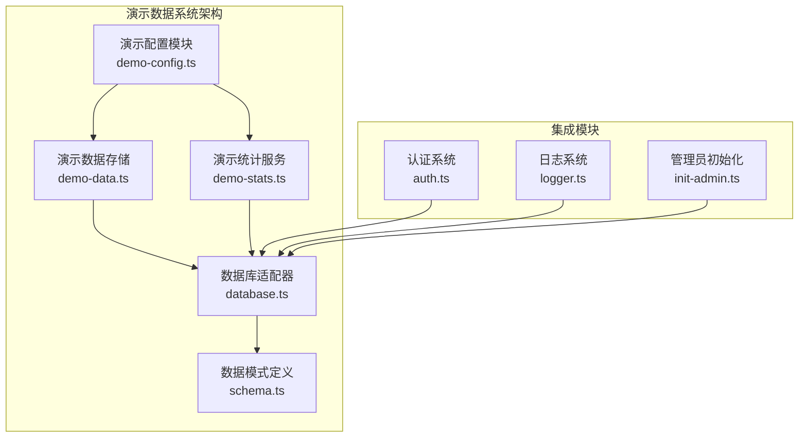
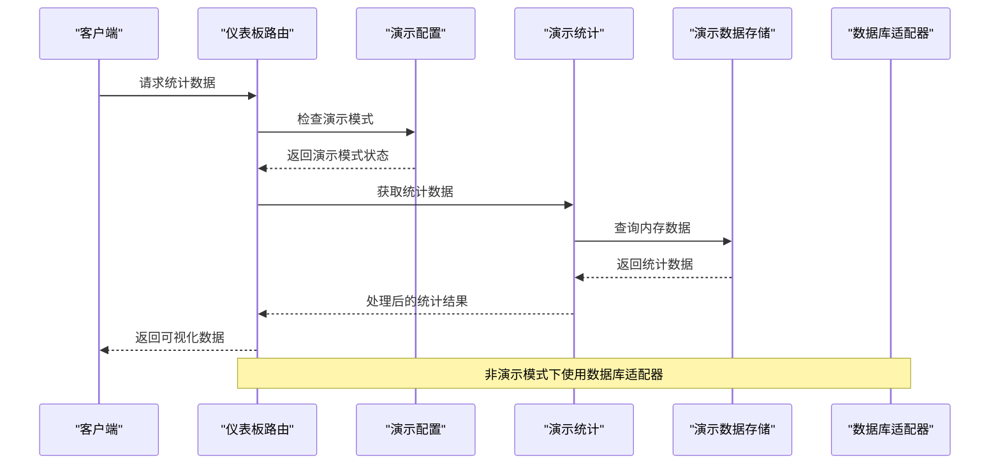
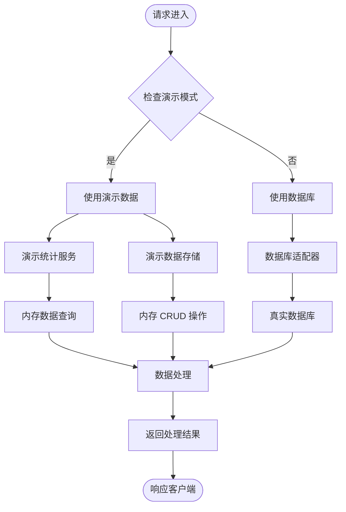
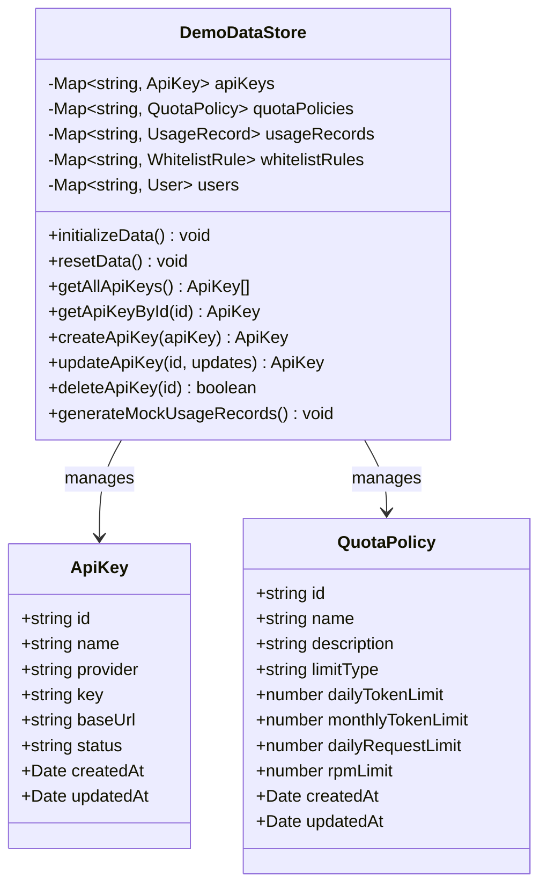
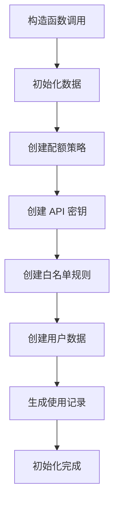
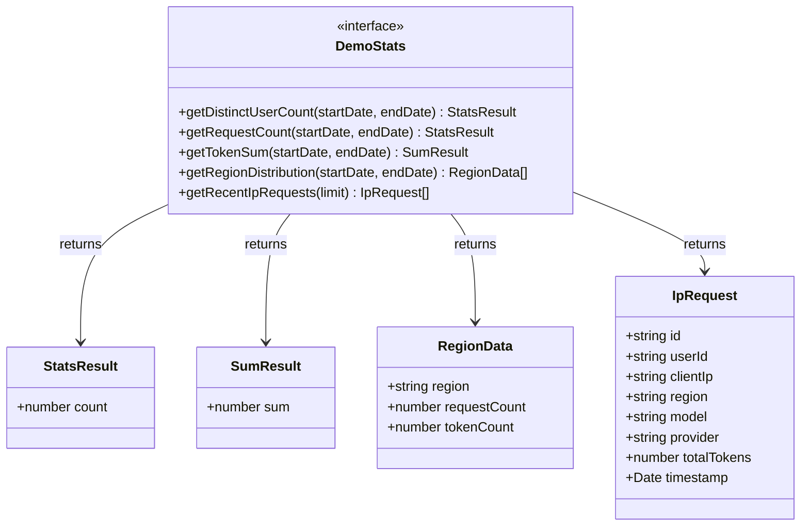
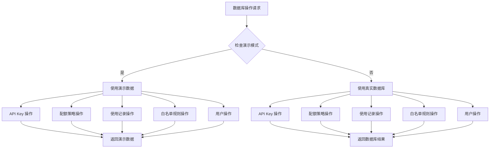
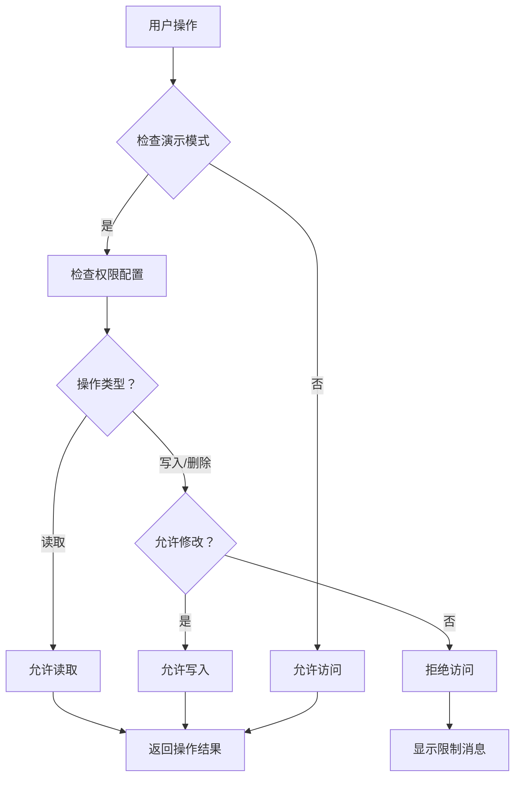
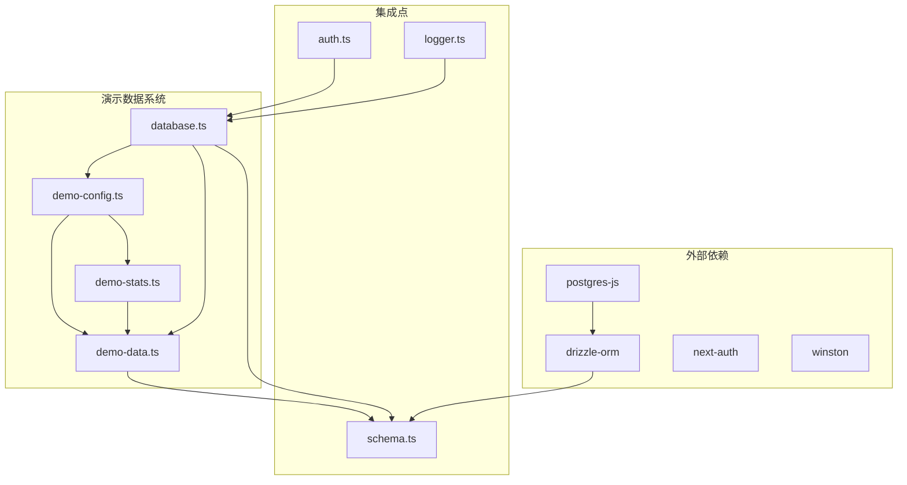

# 演示数据系统

<cite>
**本文档引用的文件**
- [README.md](file://README.md)
- [package.json](file://package.json)
- [src/lib/demo-config.ts](file://src/lib/demo-config.ts)
- [src/lib/demo-data.ts](file://src/lib/demo-data.ts)
- [src/lib/demo-stats.ts](file://src/lib/demo-stats.ts)
- [src/lib/schema.ts](file://src/lib/schema.ts)
- [src/lib/database.ts](file://src/lib/database.ts)
- [src/lib/drizzle.ts](file://src/lib/drizzle.ts)
- [src/lib/init-admin.ts](file://src/lib/init-admin.ts)
- [src/lib/logger.ts](file://src/lib/logger.ts)
- [src/auth.ts](file://src/auth.ts)
- [src/server/api/routers/dashboard.ts](file://src/server/api/routers/dashboard.ts)
- [src/app/(dashboard)/layout.tsx](file://src/app/(dashboard)/layout.tsx)
- [src/app/(dashboard)/page.tsx](file://src/app/(dashboard)/page.tsx)
- [src/components/dashboard-layout/index.tsx](file://src/components/dashboard-layout/index.tsx)
</cite>

## 更新摘要
**所做更改**
- 新增演示配置模块的详细说明和权限控制机制
- 完善演示数据存储的内存管理策略和数据初始化流程
- 增强演示统计服务的功能描述和性能优化策略
- 更新数据库适配器的演示模式切换机制
- 添加演示模式基础设施的完整架构图和组件关系图

## 目录
1. [简介](#简介)
2. [项目结构](#项目结构)
3. [核心组件](#核心组件)
4. [架构概览](#架构概览)
5. [详细组件分析](#详细组件分析)
6. [依赖关系分析](#依赖关系分析)
7. [性能考虑](#性能考虑)
8. [故障排除指南](#故障排除指南)
9. [结论](#结论)

## 简介

演示数据系统是 AIGate 项目中的关键基础设施，专门用于在演示模式下提供完整的数据管理功能。该系统通过精心设计的架构实现了与生产数据库相同的接口，确保演示环境能够完全模拟真实的数据操作场景。

AIGate 是一个基于 Next.js 16 + tRPC + Redis 的智能 AI 网关管理系统，支持配额控制和多模型代理。演示数据系统作为其核心功能之一，提供了以下主要特性：

- **智能配额管理**：基于 Redis 的实时配额检查，支持 Token 和请求次数双重限制
- **多模型代理**：统一接入 OpenAI、Anthropic、Google、DeepSeek 等主流 AI 服务商
- **高性能架构**：tRPC 类型安全 API + Redis 缓存，毫秒级响应
- **现代化界面**：Liquid Glass 设计语言，支持深色模式自动切换
- **安全认证**：NextAuth.js 身份验证，支持管理员账户动态配置
- **实时监控**：仪表板展示请求趋势、地区分布、IP 记录等关键指标

## 项目结构

演示数据系统采用模块化设计，主要包含以下几个核心模块：

**图表来源**
- [src/lib/demo-config.ts:1-57](file://src/lib/demo-config.ts#L1-L57)
- [src/lib/demo-data.ts:1-435](file://src/lib/demo-data.ts#L1-L435)
- [src/lib/demo-stats.ts:1-111](file://src/lib/demo-stats.ts#L1-L111)
- [src/lib/database.ts:1-850](file://src/lib/database.ts#L1-L850)

**章节来源**
- [README.md:1-83](file://README.md#L1-L83)
- [package.json:1-94](file://package.json#L1-L94)

## 核心组件

### 演示配置模块

演示配置模块负责控制演示模式的启用状态和行为参数。它提供了灵活的配置选项，包括演示模式开关、默认用户设置、权限控制等。

**关键特性：**
- **模式切换**：通过环境变量控制演示模式的启用/禁用
- **权限管理**：支持读写操作的权限控制
- **数据重置**：可配置的自动数据重置机制
- **默认凭据**：内置演示用户的认证信息

**演示配置详情：**
- 模式开关：`NEXT_PUBLIC_DEMO_MODE` 和 `DEMO_MODE` 环境变量
- 权限控制：`DEMO_ALLOW_MUTATIONS` 控制修改操作
- 数据重置：`DEMO_RESET_INTERVAL` 设置自动重置间隔
- 默认用户：演示管理员账户配置
- 演示凭据：预设的演示用户登录信息

### 演示数据存储

演示数据存储是整个系统的核心，采用内存 Map 结构实现完整的 CRUD 操作。该模块提供了与生产数据库相同的数据访问接口，确保演示环境的完整性和一致性。

**数据模型支持：**
- 配额策略管理
- API 密钥管理  
- 用户使用记录
- 白名单规则
- 系统用户管理

**内存存储优势：**
- 快速访问：内存 Map 结构提供 O(1) 的数据访问速度
- 低延迟：避免了数据库连接和网络延迟
- 高并发：适合演示环境的高并发访问需求

### 演示统计服务

统计服务模块专门为仪表板功能提供数据支持，实现了多种统计查询功能，包括用户统计、请求统计、Token 统计等。

**统计功能：**
- 唯一用户数统计
- 请求次数统计
- Token 消耗统计
- 地区分布统计
- 最近 IP 请求记录

**章节来源**
- [src/lib/demo-config.ts:1-57](file://src/lib/demo-config.ts#L1-L57)
- [src/lib/demo-data.ts:1-435](file://src/lib/demo-data.ts#L1-L435)
- [src/lib/demo-stats.ts:1-111](file://src/lib/demo-stats.ts#L1-L111)

## 架构概览

演示数据系统采用分层架构设计，通过适配器模式实现了与生产数据库的无缝对接：

**图表来源**
- [src/server/api/routers/dashboard.ts:1-513](file://src/server/api/routers/dashboard.ts#L1-L513)
- [src/lib/demo-config.ts:1-57](file://src/lib/demo-config.ts#L1-L57)
- [src/lib/demo-stats.ts:1-111](file://src/lib/demo-stats.ts#L1-L111)

### 数据流架构

**图表来源**
- [src/lib/database.ts:1-850](file://src/lib/database.ts#L1-L850)
- [src/lib/demo-data.ts:1-435](file://src/lib/demo-data.ts#L1-L435)

## 详细组件分析

### 演示数据存储类分析

演示数据存储类采用了单例模式设计，通过内存 Map 结构实现了高效的数据管理：

**图表来源**
- [src/lib/demo-data.ts:20-435](file://src/lib/demo-data.ts#L20-L435)

#### 数据初始化流程

演示数据存储在构造函数中自动初始化了完整的演示数据集，包括默认配额策略、API 密钥、白名单规则和用户数据：

**图表来源**
- [src/lib/demo-data.ts:27-221](file://src/lib/demo-data.ts#L27-L221)

**章节来源**
- [src/lib/demo-data.ts:1-435](file://src/lib/demo-data.ts#L1-L435)

### 演示统计服务分析

演示统计服务提供了多种统计查询功能，通过内存数据实现了高效的统计计算：

**图表来源**
- [src/lib/demo-stats.ts:8-111](file://src/lib/demo-stats.ts#L8-L111)

#### 统计查询优化

统计服务针对不同类型的查询进行了优化设计：

- **时间范围查询**：通过过滤操作实现高效的时间段数据检索
- **聚合统计**：使用 Set 和 reduce 操作实现快速的去重和求和计算
- **排序操作**：通过 Map 结构实现稳定的排序和数据转换

**章节来源**
- [src/lib/demo-stats.ts:1-111](file://src/lib/demo-stats.ts#L1-L111)

### 数据库适配器分析

数据库适配器模块实现了演示模式和生产模式的无缝切换：

**图表来源**
- [src/lib/database.ts:21-850](file://src/lib/database.ts#L21-L850)

#### 权限控制机制

演示配置模块提供了灵活的权限控制机制：

**图表来源**
- [src/lib/demo-config.ts:38-57](file://src/lib/demo-config.ts#L38-L57)

**章节来源**
- [src/lib/database.ts:1-850](file://src/lib/database.ts#L1-L850)
- [src/lib/demo-config.ts:1-57](file://src/lib/demo-config.ts#L1-L57)

## 依赖关系分析

演示数据系统与其他模块的依赖关系如下：

**图表来源**
- [src/lib/demo-data.ts:1-17](file://src/lib/demo-data.ts#L1-L17)
- [src/lib/database.ts:1-18](file://src/lib/database.ts#L1-L18)
- [src/lib/schema.ts:1-162](file://src/lib/schema.ts#L1-L162)

### 数据模式定义

演示数据系统使用统一的数据模式定义，确保演示数据与生产数据的一致性：

**核心数据表：**
- **配额策略表**：定义用户配额限制规则
- **API 密钥表**：管理各 AI 服务商的访问密钥
- **使用记录表**：记录用户的 API 调用历史
- **白名单规则表**：定义用户访问控制规则
- **用户表**：管理系统的用户信息

**章节来源**
- [src/lib/schema.ts:1-162](file://src/lib/schema.ts#L1-L162)
- [src/lib/drizzle.ts:1-12](file://src/lib/drizzle.ts#L1-L12)

## 性能考虑

演示数据系统在设计时充分考虑了性能优化：

### 内存存储优势
- **快速访问**：内存 Map 结构提供 O(1) 的数据访问速度
- **低延迟**：避免了数据库连接和网络延迟
- **高并发**：适合演示环境的高并发访问需求

### 查询优化策略
- **批量操作**：支持批量数据查询和更新操作
- **索引模拟**：通过 Map 结构实现类似索引的快速查找
- **缓存机制**：重复查询结果的缓存利用

### 内存管理
- **数据清理**：提供数据重置功能，定期清理内存数据
- **垃圾回收**：利用 JavaScript 引擎的垃圾回收机制
- **容量控制**：通过配置参数控制演示数据的规模

## 故障排除指南

### 常见问题及解决方案

**演示模式无法启用**
- 检查环境变量 `NEXT_PUBLIC_DEMO_MODE` 是否设置为 `true`
- 确认 `DEMO_MODE` 环境变量正确配置
- 验证演示配置模块的初始化过程

**数据访问异常**
- 检查演示数据存储的初始化状态
- 验证内存数据结构的完整性
- 确认数据类型转换的正确性

**统计查询性能问题**
- 优化时间范围查询的过滤逻辑
- 考虑增加数据索引机制
- 实现查询结果的缓存策略

**权限控制失效**
- 检查演示权限配置的状态
- 验证权限检查函数的逻辑
- 确认操作拦截机制的正确性

**章节来源**
- [src/lib/demo-config.ts:38-57](file://src/lib/demo-config.ts#L38-L57)
- [src/lib/demo-data.ts:213-221](file://src/lib/demo-data.ts#L213-L221)

## 结论

演示数据系统作为 AIGate 项目的重要组成部分，通过精心设计的架构实现了演示模式下的完整数据管理功能。该系统具有以下显著优势：

**技术优势：**
- **模块化设计**：清晰的职责分离和接口定义
- **性能优化**：内存存储机制提供高效的访问速度
- **兼容性强**：与生产数据库保持一致的接口设计
- **扩展性好**：易于添加新的数据模型和功能

**实用价值：**
- **演示支持**：为系统演示提供了完整的数据基础
- **开发效率**：简化了开发和测试环境的搭建
- **用户体验**：提供了流畅的交互体验和实时数据展示
- **维护成本**：降低了系统的维护复杂度

通过合理的架构设计和优化策略，演示数据系统不仅满足了演示环境的需求，也为生产环境提供了可靠的技术基础。该系统的设计理念和实现方式为类似的演示系统开发提供了有价值的参考。