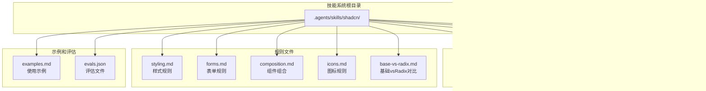
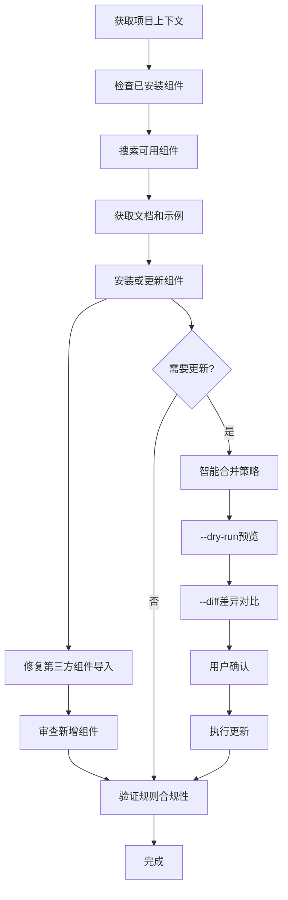
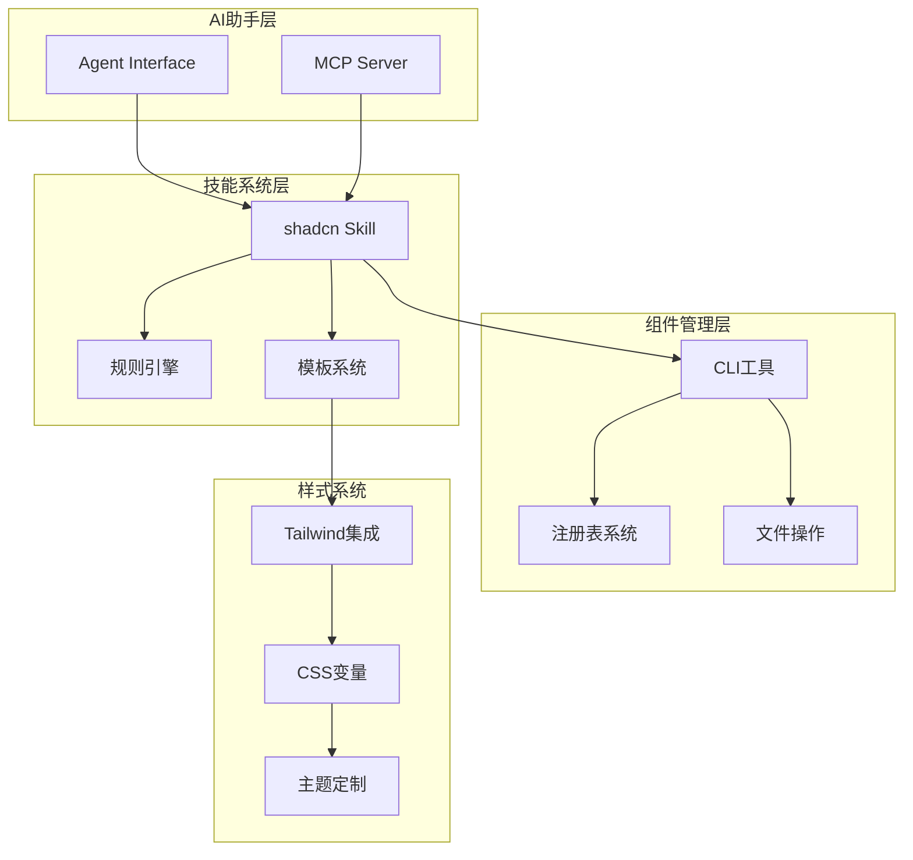
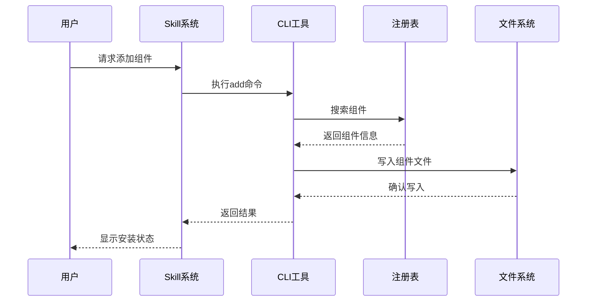
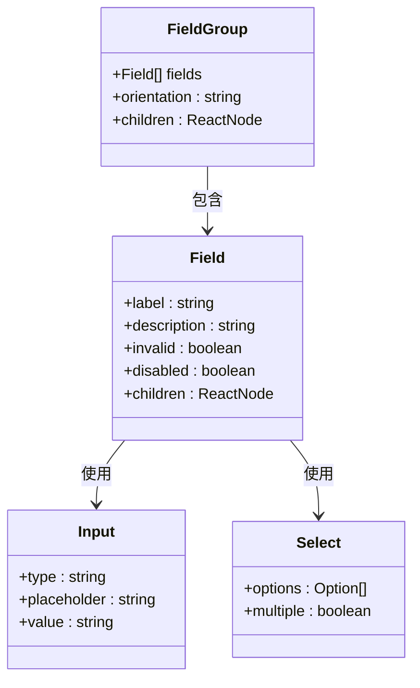
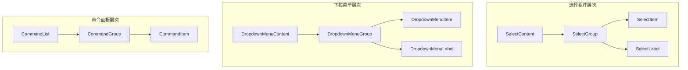
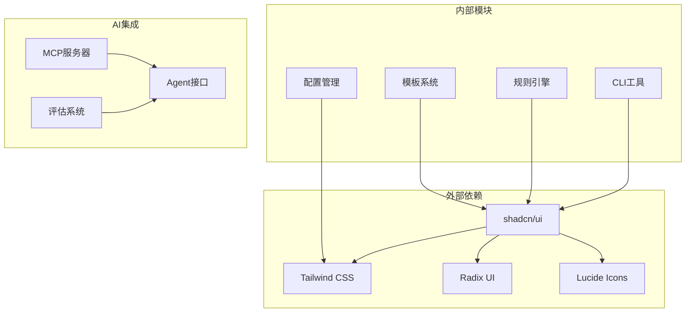
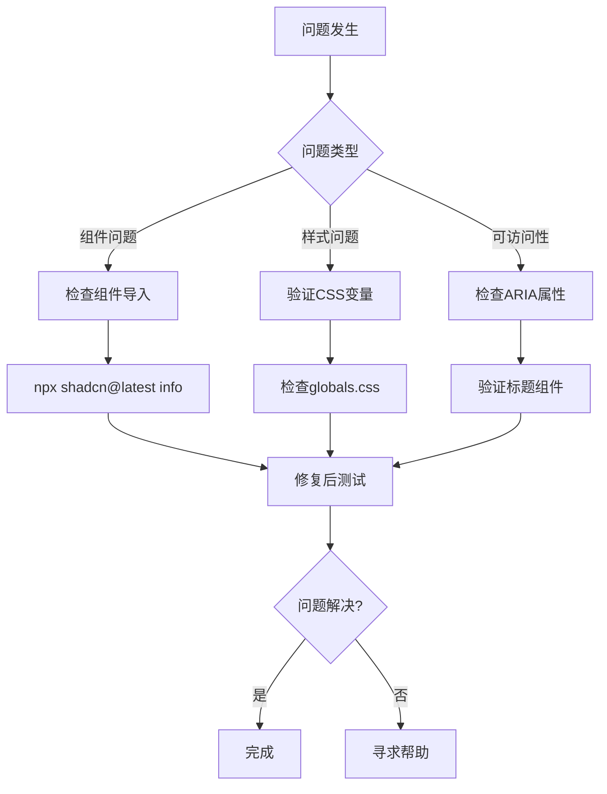

# shadcn/ui技能系统

<cite>
**本文档引用的文件**
- [.agents/skills/shadcn/SKILL.md](file://.agents/skills/shadcn/SKILL.md)
- [.agents/skills/shadcn/cli.md](file://.agents/skills/shadcn/cli.md)
- [.agents/skills/shadcn/customization.md](file://.agents/skills/shadcn/customization.md)
- [.agents/skills/shadcn/mcp.md](file://.agents/skills/shadcn/mcp.md)
- [.agents/skills/shadcn/rules/styling.md](file://.agents/skills/shadcn/rules/styling.md)
- [.agents/skills/shadcn/rules/forms.md](file://.agents/skills/shadcn/rules/forms.md)
- [.agents/skills/shadcn/rules/composition.md](file://.agents/skills/shadcn/rules/composition.md)
- [.agents/skills/shadcn/rules/icons.md](file://.agents/skills/shadcn/rules/icons.md)
- [.agents/skills/shadcn/rules/base-vs-radix.md](file://.agents/skills/shadcn/rules/base-vs-radix.md)
</cite>

## 目录
1. [简介](#简介)
2. [项目结构](#项目结构)
3. [核心组件](#核心组件)
4. [架构概览](#架构概览)
5. [详细组件分析](#详细组件分析)
6. [依赖关系分析](#依赖关系分析)
7. [性能考虑](#性能考虑)
8. [故障排除指南](#故障排除指南)
9. [结论](#结论)

## 简介

shadcn/ui技能系统是一个专为AI助手设计的完整UI组件管理框架，基于shadcn/ui的设计系统和组件库。该系统提供了从组件添加、搜索、调试到样式定制的全流程解决方案，确保开发者能够构建一致、可访问且美观的用户界面。

该技能系统的核心特点包括：
- 基于CLI的组件管理工具
- 完整的组件使用规则和最佳实践
- 支持多种图标库和主题配置
- 智能的MCP服务器集成
- 严格的样式和可访问性规范

## 项目结构

shadcn/ui技能系统采用模块化设计，主要包含以下核心目录结构：



**图表来源**
- [.agents/skills/shadcn/SKILL.md:1-241](file://.agents/skills/shadcn/SKILL.md#L1-L241)
- [.agents/skills/shadcn/cli.md:1-256](file://.agents/skills/shadcn/cli.md#L1-L256)

**章节来源**
- [.agents/skills/shadcn/SKILL.md:1-241](file://.agents/skills/shadcn/SKILL.md#L1-L241)
- [.agents/skills/shadcn/cli.md:1-256](file://.agents/skills/shadcn/cli.md#L1-L256)

## 核心组件

### 1. 项目上下文管理系统

系统通过注入的项目上下文提供完整的项目信息，包括：
- **别名系统**：动态导入路径前缀（如@/、~/）
- **React特性检测**：RSC支持状态
- **Tailwind版本管理**：v3/v4兼容性
- **图标库配置**：Lucide、Tabler等
- **文件路径解析**：组件、工具函数、钩子的精确位置

### 2. 组件选择和使用指南

系统提供详细的组件选择矩阵，帮助开发者做出正确的技术决策：

| 需求类型 | 推荐组件 | 使用场景 |
|---------|---------|---------|
| 按钮/操作 | Button（带适当变体） | 表单提交、导航链接 |
| 表单输入 | Input、Select、Switch等 | 用户数据收集 |
| 切换选项 | ToggleGroup + ToggleGroupItem | 2-5个选项切换 |
| 数据展示 | Table、Card、Badge、Avatar | 信息可视化 |
| 导航 | Sidebar、NavigationMenu、Tabs | 页面导航 |
| 覆盖层 | Dialog、Sheet、Drawer | 弹窗交互 |
| 反馈 | sonner、Alert、Progress | 用户反馈 |

### 3. 工作流程引擎

系统定义了标准化的工作流程，确保组件管理的一致性和可靠性：



**图表来源**
- [.agents/skills/shadcn/SKILL.md:165-190](file://.agents/skills/shadcn/SKILL.md#L165-L190)

**章节来源**
- [.agents/skills/shadcn/SKILL.md:120-153](file://.agents/skills/shadcn/SKILL.md#L120-L153)

## 架构概览

### 1. 技术栈架构



**图表来源**
- [.agents/skills/shadcn/SKILL.md:1-241](file://.agents/skills/shadcn/SKILL.md#L1-L241)
- [.agents/skills/shadcn/cli.md:1-256](file://.agents/skills/shadcn/cli.md#L1-L256)

### 2. 组件生命周期管理



**图表来源**
- [.agents/skills/shadcn/cli.md:45-100](file://.agents/skills/shadcn/cli.md#L45-L100)

## 详细组件分析

### 1. 样式系统规则

#### 语义化颜色系统

样式系统采用语义化颜色命名，确保主题一致性：

| 颜色变量 | 用途 | 示例 |
|---------|------|------|
| `--background`/`--foreground` | 页面背景和默认文本 | `bg-background`/`text-foreground` |
| `--primary`/`--primary-foreground` | 主要按钮和操作 | `bg-primary`/`text-primary-foreground` |
| `--secondary`/`--secondary-foreground` | 次要操作 | `bg-secondary`/`text-secondary-foreground` |
| `--muted`/`--muted-foreground` | 调试/禁用状态 | `bg-muted`/`text-muted-foreground` |
| `--destructive`/`--destructive-foreground` | 错误和破坏性操作 | `text-destructive` |

#### 布局优先原则

```mermaid
flowchart LR
A[使用className进行布局] --> B[避免覆盖组件颜色]
B --> C[使用语义化颜色令牌]
C --> D[首选内置变体]
D --> E[使用CSS变量定制]
F[错误做法] --> G[使用原始颜色值]
G --> H[手动z-index设置]
H --> I[使用space-x/y类]
J[正确做法] --> K[使用语义化令牌]
K --> L[使用cn()处理条件类]
L --> M[使用size-*处理等尺寸]
```

**图表来源**
- [.agents/skills/shadcn/rules/styling.md:19-163](file://.agents/skills/shadcn/rules/styling.md#L19-L163)

**章节来源**
- [.agents/skills/shadcn/rules/styling.md:1-163](file://.agents/skills/shadcn/rules/styling.md#L1-L163)

### 2. 表单和输入组件规则

#### 表单布局标准

表单系统强制使用`FieldGroup` + `Field`模式，确保一致的用户体验：



**图表来源**
- [.agents/skills/shadcn/rules/forms.md:14-44](file://.agents/skills/shadcn/rules/forms.md#L14-L44)

#### 输入组组件

输入组系统提供专门的组件来处理复杂的输入场景：

| 组件类型 | 用途 | 优势 |
|---------|------|------|
| `InputGroup` | 复合输入容器 | 支持前后缀元素 |
| `InputGroupInput` | 输入框 | 与输入组完全集成 |
| `InputGroupAddon` | 附加组件 | 按钮、图标等 |
| `ToggleGroup` | 选项切换 | 2-7个选项的优雅切换 |

**章节来源**
- [.agents/skills/shadcn/rules/forms.md:1-193](file://.agents/skills/shadcn/rules/forms.md#L1-L193)

### 3. 组件组合和可访问性

#### 组合模式

组件组合遵循严格的层次结构要求：



**图表来源**
- [.agents/skills/shadcn/rules/composition.md:21-54](file://.agents/skills/shadcn/rules/composition.md#L21-L54)

#### 可访问性要求

所有覆盖层组件都必须包含标题组件：

| 组件类型 | 必需标题 | 可视隐藏方式 |
|---------|---------|-------------|
| `Dialog` | `DialogTitle` | `className="sr-only"` |
| `Sheet` | `SheetTitle` | `className="sr-only"` |
| `Drawer` | `DrawerTitle` | `className="sr-only"` |
| `AlertDialog` | `AlertDialogTitle` | `className="sr-only"` |

**章节来源**
- [.agents/skills/shadcn/rules/composition.md:1-196](file://.agents/skills/shadcn/rules/composition.md#L1-L196)

### 4. 图标系统规范

#### 图标使用标准

```mermaid
flowchart TD
A[按钮中的图标] --> B[data-icon属性]
B --> C[inline-start或inline-end]
C --> D[无尺寸类]
E[图标导入] --> F[使用项目配置的图标库]
F --> G[lucide-react或@tabler/icons-react]
H[图标传递] --> I[作为组件对象传递]
I --> J[避免字符串键查找]
```

**图表来源**
- [.agents/skills/shadcn/rules/icons.md:1-102](file://.agents/skills/shadcn/rules/icons.md#L1-L102)

**章节来源**
- [.agents/skills/shadcn/rules/icons.md:1-102](file://.agents/skills/shadcn/rules/icons.md#L1-L102)

### 5. 基础vsRadix对比

#### API差异对照

| 特性 | Base实现 | Radix实现 | 使用建议 |
|------|---------|---------|---------|
| 触发器组合 | `asChild` | `render` | 根据项目基座选择 |
| 多选支持 | `multiple`布尔值 | `type="multiple"` | 复杂选择场景 |
| 滑块值类型 | 数字 | 数组 | 简单范围选择 |
| 手风琴类型 | 无type属性 | `type="single/multiple"` | 功能复杂度 |

**章节来源**
- [.agents/skills/shadcn/rules/base-vs-radix.md:1-307](file://.agents/skills/shadcn/rules/base-vs-radix.md#L1-L307)

## 依赖关系分析

### 1. 核心依赖图



**图表来源**
- [.agents/skills/shadcn/SKILL.md:1-241](file://.agents/skills/shadcn/SKILL.md#L1-L241)
- [.agents/skills/shadcn/cli.md:1-256](file://.agents/skills/shadcn/cli.md#L1-L256)

### 2. 版本兼容性矩阵

| 组件 | shadcn/ui版本 | Tailwind版本 | 兼容性 |
|------|-------------|-------------|--------|
| v3.x | 3.x | 3.x | ✅ 完全兼容 |
| v4.x | 4.x | 4.x | ✅ 完全兼容 |
| v3.x | 4.x | 3.x | ⚠️ 部分功能受限 |
| v4.x | 3.x | 4.x | ❌ 不兼容 |

**章节来源**
- [.agents/skills/shadcn/customization.md:1-203](file://.agents/skills/shadcn/customization.md#L1-L203)

## 性能考虑

### 1. 组件加载优化

- **按需加载**：仅在需要时加载组件
- **代码分割**：大型组件库的懒加载
- **缓存策略**：注册表内容缓存
- **增量更新**：智能差异比较

### 2. 样式性能优化

- **CSS变量复用**：减少重复样式定义
- **Tailwind优化**：移除未使用的样式
- **组件级样式**：避免全局样式污染
- **响应式优化**：移动端性能考虑

## 故障排除指南

### 1. 常见问题诊断

#### 组件导入错误

**症状**：组件无法正常渲染
**原因**：第三方组件导入路径不匹配
**解决**：使用`npx shadcn@latest info`获取正确的UI别名并重写导入

#### 样式冲突

**症状**：组件外观异常
**原因**：自定义样式覆盖了组件样式
**解决**：使用语义化颜色令牌而非硬编码颜色值

#### 可访问性问题

**症状**：屏幕阅读器无法正确读取
**原因**：缺少必要的ARIA属性
**解决**：确保所有覆盖层组件都有标题组件

### 2. 调试工具



**图表来源**
- [.agents/skills/shadcn/SKILL.md:165-190](file://.agents/skills/shadcn/SKILL.md#L165-L190)

**章节来源**
- [.agents/skills/shadcn/SKILL.md:165-190](file://.agents/skills/shadcn/SKILL.md#L165-L190)

## 结论

shadcn/ui技能系统提供了一个完整、一致且可扩展的UI组件管理解决方案。通过严格的设计规范、智能的CLI工具和强大的AI集成功能，该系统能够显著提高开发效率并确保应用的质量一致性。

### 主要优势

1. **一致性**：统一的设计语言和组件规范
2. **可访问性**：内置的无障碍功能支持
3. **可维护性**：清晰的代码结构和文档
4. **可扩展性**：灵活的主题定制和组件扩展
5. **开发体验**：智能化的工具链和工作流程

### 最佳实践建议

- 始终使用项目上下文提供的别名进行导入
- 严格遵守样式和组件组合规则
- 利用CLI工具进行组件管理和更新
- 定期检查和更新组件以保持最新状态
- 在团队中推广和维护这些规范

该技能系统为现代Web应用开发提供了一个坚实的基础，能够帮助团队构建高质量、可维护的用户界面。