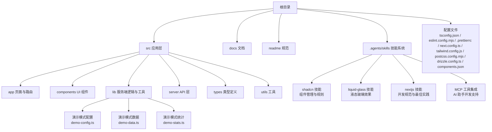
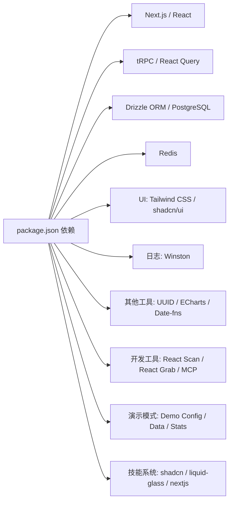

# 开发指南

<cite>
**本文引用的文件**
- [package.json](file://package.json)
- [tsconfig.json](file://tsconfig.json)
- [eslint.config.mjs](file://eslint.config.mjs)
- [.prettierrc](file://.prettierrc)
- [next.config.ts](file://next.config.ts)
- [drizzle.config.ts](file://drizzle.config.ts)
- [tailwind.config.js](file://tailwind.config.js)
- [postcss.config.mjs](file://postcss.config.mjs)
- [components.json](file://components.json)
- [src/global.d.ts](file://src/global.d.ts)
- [README.md](file://README.md)
- [docs/ai-api.md](file://docs/ai-api.md)
- [readme/tech.md](file://readme/tech.md)
- [readme/ui-rule.md](file://readme/ui-rule.md)
- [.gitignore](file://.gitignore)
- [src/app/layout.tsx](file://src/app/layout.tsx)
- [.agents/skills/shadcn/mcp.md](file://.agents/skills/shadcn/mcp.md)
- [.agents/skills/shadcn/cli.md](file://.agents/skills/shadcn/cli.md)
- [.agents/skills/shadcn/SKILL.md](file://.agents/skills/shadcn/SKILL.md)
- [.agents/skills/shadcn/customization.md](file://.agents/skills/shadcn/customization.md)
- [.agents/skills/shadcn/rules/composition.md](file://.agents/skills/shadcn/rules/composition.md)
- [.agents/skills/shadcn/rules/base-vs-radix.md](file://.agents/skills/shadcn/rules/base-vs-radix.md)
- [.agents/skills/liquid-glass/SKILL.md](file://.agents/skills/liquid-glass/SKILL.md)
- [.agents/skills/nextjs/SKILL.md](file://.agents/skills/nextjs/SKILL.md)
- [src/lib/demo-config.ts](file://src/lib/demo-config.ts)
- [src/lib/demo-data.ts](file://src/lib/demo-data.ts)
- [src/lib/demo-stats.ts](file://src/lib/demo-stats.ts)
- [src/auth.ts](file://src/auth.ts)
- [src/lib/init-admin.ts](file://src/lib/init-admin.ts)
</cite>

## 更新摘要
**变更内容**
- 新增演示模式开发脚本章节，介绍 dev:demo 和 build:demo 脚本的使用方法
- 新增演示模式配置与数据管理章节，详细说明演示模式的工作原理
- 更新开发环境搭建步骤，包含演示模式的配置选项
- 新增演示模式测试与验证指南
- 新增技能系统文档，包含 shadcn、liquid-glass、nextjs 等技能说明
- 新增 MCP 开发工具集成说明，包括工具配置和使用方法
- 新增 React Scan 和 React Grab 工具的使用说明

## 目录
1. [简介](#简介)
2. [项目结构](#项目结构)
3. [核心组件](#核心组件)
4. [架构总览](#架构总览)
5. [详细组件分析](#详细组件分析)
6. [开发工具集成](#开发工具集成)
7. [演示模式开发](#演示模式开发)
8. [技能系统文档](#技能系统文档)
9. [依赖分析](#依赖分析)
10. [性能考虑](#性能考虑)
11. [故障排查指南](#故障排查指南)
12. [结论](#结论)
13. [附录](#附录)

## 简介
本指南面向 AIGate 项目的开发者，提供从环境搭建、代码规范、TypeScript 配置、调试与测试、到贡献与发布流程的全流程说明。AIGate 是一个基于 Next.js 16 + tRPC + Redis 的智能 AI 网关管理系统，支持配额控制、多模型代理与现代化 UI。**最新更新**：项目集成了 React Scan、React Grab 和 MCP 开发工具，显著提升组件渲染性能可视化和开发效率。**新增功能**：演示模式开发脚本（dev:demo 和 build:demo）简化了演示环境的测试流程，**新增技能系统文档**涵盖 shadcn 组件管理、liquid-glass 液态玻璃效果、nextjs 开发规范等专业技能。

## 项目结构
仓库采用按功能与层次混合的组织方式：
- 根目录包含构建与工具配置、Docker 与部署脚本、数据库迁移配置等
- src 目录包含应用入口、页面路由、组件库、服务端 API、类型与工具
- docs 与 readme 子目录提供技术文档与 UI 规范
- .agents/skills/shadcn 提供 UI 规则与技能说明，包含 MCP 服务器配置
- **新增**：演示模式相关文件位于 src/lib 目录下，包括演示配置、数据和统计服务
- **新增**：技能系统文档位于 .agents/skills 目录下，提供专业的开发技能指导



**章节来源**
- [README.md:1-83](file://README.md#L1-L83)
- [readme/tech.md:1-2](file://readme/tech.md#L1-L2)
- [readme/ui-rule.md:1-99](file://readme/ui-rule.md#L1-L99)

## 核心组件
- 包管理与脚本：使用 pnpm 9 作为包管理器，提供开发、构建、启动、数据库迁移、格式化与代码检查等脚本
- **新增**：演示模式脚本：dev:demo 和 build:demo，支持演示环境的快速开发与构建
- 构建与运行：Next.js 16，启用 React Compiler 与 standalone 输出
- 类型系统：TypeScript 5，严格模式，路径别名 @/*
- 代码质量：ESLint 9（Next.js 规则集）+ Prettier 3
- UI 框架：Tailwind CSS 4 + shadcn/ui，支持深色模式与动画
- 数据访问：Drizzle ORM + PostgreSQL，配合 Drizzle Kit 进行迁移与生成
- 状态与 API：tRPC 类型安全 RPC，服务端路由与客户端调用
- 缓存与日志：Redis 缓存 + Winston 日志轮转
- **开发工具**：React Scan（性能可视化）、React Grab（组件抓取）、MCP（AI 助手工具）
- **新增技能系统**：专业技能文档，涵盖组件管理、UI 效果实现、开发规范等

**章节来源**
- [package.json:1-95](file://package.json#L1-L95)
- [next.config.ts:1-9](file://next.config.ts#L1-L9)
- [tsconfig.json:1-42](file://tsconfig.json#L1-L42)
- [eslint.config.mjs:1-19](file://eslint.config.mjs#L1-L19)
- [.prettierrc:1-16](file://.prettierrc#L1-L16)
- [tailwind.config.js:1-78](file://tailwind.config.js#L1-L78)
- [postcss.config.mjs:1-8](file://postcss.config.mjs#L1-L8)
- [drizzle.config.ts:1-11](file://drizzle.config.ts#L1-L11)
- [components.json:1-18](file://components.json#L1-L18)
- [src/global.d.ts:1-4](file://src/global.d.ts#L1-L4)

## 架构总览
AIGate 采用前后端一体化的 Next.js App Router 架构，服务端通过 tRPC 暴露类型安全 API，前端使用 React 组件与 shadcn/ui 构建管理后台，数据持久化由 PostgreSQL + Redis 提供，日志系统采用 Winston。**最新架构**：集成了现代化开发工具链，包括性能监控、组件管理与 AI 辅助开发，**新增演示模式支持**，为测试和演示提供独立的数据环境，**新增技能系统**为开发者提供专业的开发指导。

```mermaid
graph TB
subgraph "前端"
FE["Next.js App Router<br/>React 19"]
UI["shadcn/ui + Tailwind CSS 4"]
TRPC["tRPC 客户端"]
DEV["开发工具链<br/>React Scan / React Grab / MCP"]
DEMOMODE["演示模式<br/>DEMO_MODE / NEXT_PUBLIC_DEMO_MODE"]
SKILLS["技能系统<br/>shadcn / liquid-glass / nextjs"]
end
subgraph "后端"
API["tRPC 服务端<br/>src/server"]
AUTH["NextAuth.js 认证"]
QUOTA["配额与白名单<br/>Redis"]
DB["PostgreSQL"]
LOG["Winston 日志"]
END
subgraph "演示模式层"
DEMOCFG["演示配置<br/>demo-config.ts"]
DEMODATA["演示数据<br/>demo-data.ts"]
DEMOSTATS["演示统计<br/>demo-stats.ts"]
END
FE --> UI
FE --> TRPC
FE --> DEV
FE --> DEMOMODE
FE --> SKILLS
TRPC --> API
API --> AUTH
API --> QUOTA
API --> DB
API --> LOG
API --> DEMOCFG
API --> DEMODATA
API --> DEMOSTATS
```

**图表来源**
- [next.config.ts:1-9](file://next.config.ts#L1-L9)
- [tailwind.config.js:1-78](file://tailwind.config.js#L1-L78)
- [drizzle.config.ts:1-11](file://drizzle.config.ts#L1-L11)
- [README.md:74-83](file://README.md#L74-L83)
- [src/lib/demo-config.ts:1-57](file://src/lib/demo-config.ts#L1-L57)
- [src/lib/demo-data.ts:1-451](file://src/lib/demo-data.ts#L1-L451)
- [src/lib/demo-stats.ts:1-111](file://src/lib/demo-stats.ts#L1-L111)

## 详细组件分析

### 环境与依赖管理
- Node.js 与包管理器
  - 使用 pnpm 9 作为包管理器，版本在 package.json 中声明
  - 依赖安装：使用 pnpm install
- 脚本与工作流
  - 开发：pnpm dev
  - **新增**：演示开发：pnpm dev:demo（启用演示模式的开发服务器）
  - 构建：pnpm build
  - **新增**：演示构建：pnpm build:demo（启用演示模式的生产构建）
  - 启动：pnpm start
  - Lint：pnpm lint
  - 格式化：pnpm format / pnpm format:check
  - 数据库：pnpm db:generate / pnpm db:migrate / pnpm db:push / pnpm db:seed
- 依赖清单
  - 前端：Next.js 16、React 19、Tailwind CSS 4、shadcn/ui
  - 状态与 API：tRPC（client/server/react-query）
  - 认证：NextAuth.js + Drizzle Adapter
  - 数据库：Drizzle ORM + PostgreSQL + Redis
  - 工具：Winston 日志、ECharts 图表、date-fns、UUID 等
  - **开发工具**：React Scan、React Grab、MCP
  - **新增技能系统**：专业技能文档与工具支持

**章节来源**
- [package.json:1-95](file://package.json#L1-L95)

### TypeScript 配置与全局类型
- 编译目标与模块解析
  - 目标：ES2017
  - 模块：esnext
  - 解析器：bundler
  - JSX：react-jsx
  - 路径别名：@/* -> ./src/*
- 严格性与增量编译
  - 严格模式开启
  - noEmit，配合 Next.js 类型生成
  - incremental 启用
- 全局类型
  - src/global.d.ts 声明 CSS 模块类型，避免样式导入报错

**章节来源**
- [tsconfig.json:1-42](file://tsconfig.json#L1-L42)
- [src/global.d.ts:1-4](file://src/global.d.ts#L1-L4)

### 代码规范与格式化
- ESLint 配置
  - 使用 eslint-config-next 的 core-web-vitals 与 typescript 规则集
  - 覆盖 .next、out、build、next-env.d.ts 等默认忽略项
- Prettier 配置
  - 分号、尾随逗号、单引号、行长、缩进、括号等规则
  - endOfLine: lf，保证跨平台一致性
- 命令
  - pnpm lint：执行 ESLint
  - pnpm format / pnpm format:check：格式化与检查

**章节来源**
- [eslint.config.mjs:1-19](file://eslint.config.mjs#L1-L19)
- [.prettierrc:1-16](file://.prettierrc#L1-L16)
- [package.json:6-16](file://package.json#L6-L16)

### UI 与样式体系
- Tailwind CSS 4
  - content 覆盖 pages、components、app、src 下的 ts/tsx
  - 深色模式 class 驱动
  - 动画插件 tailwindcss-animate
- shadcn/ui
  - components.json 定义样式、RSC、TSX、Tailwind 配置与别名
  - 与 Tailwind CSS 4 集成，支持 Liquid Glass 风格点缀
- PostCSS
  - @tailwindcss/postcss 插件，与 Tailwind CSS 4 协同

**章节来源**
- [tailwind.config.js:1-78](file://tailwind.config.js#L1-L78)
- [components.json:1-18](file://components.json#L1-L18)
- [postcss.config.mjs:1-8](file://postcss.config.mjs#L1-L8)

### 数据库与迁移
- Drizzle 配置
  - schema 指向 src/lib/schema.ts
  - 输出目录 drizzle
  - 方言：postgresql
  - 连接：process.env.DATABASE_URL
- 常用命令
  - 生成迁移：pnpm db:generate
  - 推送模式：pnpm db:push
  - 迁移执行：pnpm db:migrate
  - 初始化种子：pnpm db:seed

**章节来源**
- [drizzle.config.ts:1-11](file://drizzle.config.ts#L1-L11)
- [package.json:13-16](file://package.json#L13-L16)

### 构建与运行配置
- Next.js 配置
  - output: standalone
  - reactCompiler: true
- .gitignore
  - 忽略 node_modules、.next、out、build、日志、.env* 等

**章节来源**
- [next.config.ts:1-9](file://next.config.ts#L1-L9)
- [.gitignore:1-45](file://.gitignore#L1-L45)

### API 与 tRPC
- API 路由
  - /api/trpc/[trpc]：tRPC 服务端入口
  - /api/ai/chat/stream：流式聊天接口（SSE）
- 路由器
  - src/server/routers 下包含 ai、api-key、dashboard、quota、settings、whitelist 等模块
- 类型安全
  - tRPC client/server 与 react-query 集成，确保前后端类型一致

**章节来源**
- [docs/ai-api.md:1-825](file://docs/ai-api.md#L1-L825)
- [README.md:52-72](file://README.md#L52-L72)

## 开发工具集成

### React Scan 开发工具
React Scan 是一个强大的 React 组件渲染性能可视化工具，专门用于开发环境中的性能分析。

- **自动加载机制**
  - 在开发环境（NODE_ENV === 'development'）下自动加载
  - 通过 next/script 标签异步加载，不影响生产环境性能
  - 使用 beforeInteractive 策略确保在页面渲染前可用

- **核心功能**
  - 实时显示组件树结构和渲染时间
  - 高亮显示高成本组件和重渲染区域
  - 提供性能瓶颈识别和优化建议
  - 支持组件层级分析和内存使用监控

- **使用场景**
  - 组件渲染性能分析
  - 重渲染检测与优化
  - 内存泄漏排查
  - 性能回归测试

**章节来源**
- [src/app/layout.tsx:33-49](file://src/app/layout.tsx#L33-L49)

### React Grab 组件抓取工具
React Grab 提供智能的组件抓取和管理功能，提升开发效率和组件复用率。

- **自动集成**
  - 开发环境下自动加载 react-grab 工具
  - 通过 CDN 异步加载，确保开发体验流畅
  - 支持组件快速提取和模板生成

- **主要特性**
  - 组件源码提取和分析
  - 智能组件分类和标签
  - 快速原型开发支持
  - 组件依赖关系可视化

- **开发价值**
  - 加速组件开发流程
  - 提升代码复用率
  - 标准化组件结构
  - 减少重复劳动

**章节来源**
- [src/app/layout.tsx:33-49](file://src/app/layout.tsx#L33-L49)
- [package.json:82-83](file://package.json#L82-L83)

### MCP (Model Context Protocol) AI 助手工具
MCP 提供 AI 助手驱动的组件管理和开发辅助功能。

- **MCP 服务器配置**
  - 支持 AI 助手搜索、浏览和安装组件
  - 提供注册表操作工具（search、view、install）
  - 支持多种编辑器配置（VS Code、Cursor、Claude Code）

- **核心工具集**
  - `shadcn:get_project_registries`：获取项目注册表信息
  - `shadcn:list_items_in_registries`：列出注册表中的组件
  - `shadcn:search_items_in_registries`：模糊搜索组件
  - `shadcn:view_items_in_registries`：查看组件详情
  - `shadcn:get_item_examples_from_registries`：获取使用示例
  - `shadcn:get_add_command_for_items`：生成安装命令
  - `shadcn:get_audit_checklist`：组件审计清单

- **编辑器集成**
  - VS Code：`.vscode/mcp.json`
  - Cursor：`.cursor/mcp.json`
  - Claude Code：`.mcp.json`
  - OpenCode：`opencode.json`
  - Codex：`~/.codex/config.toml`

**章节来源**
- [src/app/layout.tsx:40-42](file://src/app/layout.tsx#L40-L42)
- [.agents/skills/shadcn/mcp.md:1-95](file://.agents/skills/shadcn/mcp.md#L1-L95)
- [.agents/skills/shadcn/cli.md:1-256](file://.agents/skills/shadcn/cli.md#L1-L256)

### 开发工具配置与使用

#### 自动加载机制
所有开发工具都通过条件加载机制集成：
- 仅在开发环境（NODE_ENV === 'development'）下加载
- 使用 next/script 标签确保异步加载
- 不影响生产环境性能和包大小

#### 工具加载策略
- **React Scan**：使用 `beforeInteractive` 策略，确保在页面渲染前可用
- **React Grab**：使用 `beforeInteractive` 策略，提供即时的组件抓取功能
- **MCP**：使用 `lazyOnload` 策略，延迟加载以优化初始性能

#### 调试与监控
- 开发者可以在浏览器控制台中访问工具提供的 API
- 工具会在开发工具面板中显示相关信息
- 支持与现有调试工具链无缝集成

**章节来源**
- [src/app/layout.tsx:33-49](file://src/app/layout.tsx#L33-L49)
- [package.json:69-84](file://package.json#L69-L84)

## 演示模式开发

### 演示模式概述
演示模式为 AIGate 提供了一个独立的测试和演示环境，无需真实的数据库连接即可进行功能验证。通过设置环境变量 `DEMO_MODE=true` 和 `NEXT_PUBLIC_DEMO_MODE=true`，系统将启用演示模式，使用内存中的模拟数据进行所有操作。

### 演示模式脚本
项目提供了专门的演示模式开发脚本，简化了演示环境的测试流程：

- **开发脚本**：`pnpm dev:demo`
  - 同时设置 `DEMO_MODE=true` 和 `NEXT_PUBLIC_DEMO_MODE=true`
  - 启动带有演示模式的开发服务器
  - 支持热重载和实时调试

- **构建脚本**：`pnpm build:demo`
  - 设置演示模式环境变量进行生产构建
  - 生成优化的演示模式应用包
  - 适合部署演示版本

**章节来源**
- [package.json:7-10](file://package.json#L7-L10)

### 演示模式配置
演示模式的核心配置位于 `src/lib/demo-config.ts`，提供以下功能：

- **模式开关**：通过环境变量控制演示模式的启用状态
- **默认用户**：内置演示管理员账号，用户名为 `demo@example.com`，密码为 `demo123`
- **权限控制**：默认只允许读取操作，可通过配置允许修改
- **数据重置**：支持定时重置演示数据，保持测试环境的一致性

**章节来源**
- [src/lib/demo-config.ts:1-57](file://src/lib/demo-config.ts#L1-L57)

### 演示模式数据管理
演示模式使用内存数据存储，所有数据操作都在内存中完成，不会影响真实数据库：

- **数据存储**：使用 Map 结构存储 API Key、配额策略、使用记录、白名单规则和用户信息
- **初始化数据**：包含默认的配额策略、API Key、白名单规则和演示用户
- **模拟使用记录**：生成最近7天的模拟使用数据，包含不同地区和模型的请求
- **数据操作**：提供完整的 CRUD 操作接口，支持分页、过滤和排序

**章节来源**
- [src/lib/demo-data.ts:1-451](file://src/lib/demo-data.ts#L1-L451)

### 演示模式统计服务
演示模式的统计服务为仪表板等功能提供数据支持：

- **用户统计**：计算指定日期范围内的唯一用户数量
- **请求统计**：统计指定日期范围内的请求总数
- **Token 统计**：计算指定日期范围内的 Token 使用总量
- **地区分布**：提供地区维度的请求和 Token 统计
- **最近请求**：获取最近的 IP 请求记录

**章节来源**
- [src/lib/demo-stats.ts:1-111](file://src/lib/demo-stats.ts#L1-L111)

### 演示模式认证集成
演示模式与认证系统的集成确保了演示环境的安全性和一致性：

- **演示账号登录**：支持使用演示管理员账号直接登录
- **凭证验证**：验证演示账号的邮箱和密码
- **用户信息**：返回演示用户的完整信息，包括角色和状态
- **数据库兼容**：即使在演示模式下，也支持从数据库获取用户信息

**章节来源**
- [src/auth.ts:1-150](file://src/auth.ts#L1-L150)

### 演示模式测试与验证
使用演示模式进行测试的推荐流程：

1. **启动演示环境**：运行 `pnpm dev:demo` 启动演示模式开发服务器
2. **登录验证**：使用演示账号 `demo@example.com` / `demo123` 登录系统
3. **功能测试**：验证所有管理功能在演示模式下的行为
4. **数据验证**：检查演示数据的完整性和一致性
5. **权限测试**：验证演示模式下的权限控制机制
6. **构建测试**：运行 `pnpm build:demo` 验证演示模式的生产构建

**章节来源**
- [package.json:7-10](file://package.json#L7-L10)
- [src/lib/demo-config.ts:17-29](file://src/lib/demo-config.ts#L17-L29)

## 技能系统文档

### shadcn/ui 技能系统
shadcn 技能系统提供完整的组件管理与开发指导，涵盖设计原则、组件规则和最佳实践。

- **核心原则**
  - 优先使用现有组件，避免重复造轮子
  - 组件组合优于自定义标记
  - 优先使用内置变体而非自定义样式
  - 使用语义化颜色而非原始值

- **关键规则**
  - **样式与 Tailwind**：布局使用 className，不覆盖组件颜色或排版
  - **表单与输入**：使用 FieldGroup + Field，按钮内图标使用 data-icon
  - **组件结构**：项目必须在其组内，对话框总是需要标题
  - **组件选择**：根据需求选择合适的组件类型

- **CLI 工具**
  - 项目信息：`npx shadcn@latest info`
  - 搜索组件：`npx shadcn@latest search`
  - 添加组件：`npx shadcn@latest add`
  - 查看文档：`npx shadcn@latest docs`

**章节来源**
- [.agents/skills/shadcn/SKILL.md:1-241](file://.agents/skills/shadcn/SKILL.md#L1-L241)
- [.agents/skills/shadcn/cli.md:1-256](file://.agents/skills/shadcn/cli.md#L1-L256)

### Liquid Glass 液态玻璃效果
Liquid Glass 技能专注于 Apple 风格的液态玻璃效果实现，提供完整的视觉指导。

- **核心视觉特征**
  - **模糊层**：backdrop-filter: blur() 模糊背景内容
  - **色调层**：半透明背景色为玻璃着色
  - **光泽层**：内高光和边缘发光模拟光线折射
  - **内容层**：实际的 UI 内容

- **实现策略**
  - CSS 自定义属性：定义主题变量用于一致复用
  - Tailwind CSS 方法：使用工具类作为主要方法
  - 多层结构：对于更高保真度使用多层 DOM 结构
  - 动画指导：有机的交互感觉，使用弹簧曲线

- **组件变体**
  - default：卡片、面板的基础样式
  - thin：覆盖层、工具提示的纤细样式
  - thick：模态框、导航栏的厚重样式
  - colored：强调元素的彩色样式

**章节来源**
- [.agents/skills/liquid-glass/SKILL.md:1-157](file://.agents/skills/liquid-glass/SKILL.md#L1-L157)

### Next.js 开发规范
Next.js 技能系统提供专业的 Next.js 16+ 开发指导，涵盖项目栈、配置和最佳实践。

- **项目栈**
  - Next.js 16.1.6（App Router）
  - React 19.2.3
  - TypeScript 5.x
  - Tailwind CSS v4
  - tRPC 10.45.2 + React Query
  - pnpm 9.0.0

- **关键配置**
  - next.config.ts：启用 standalone 输出和 React Compiler
  - 路径别名：@/* 映射到 ./src/*
  - App Router 结构：清晰的路由分组和组件组织

- **开发命令**
  - 开发服务器：pnpm dev
  - 构建：pnpm build
  - 启动生产服务器：pnpm start
  - 代码检查：pnpm lint
  - 格式化：pnpm format / pnpm format:check

**章节来源**
- [.agents/skills/nextjs/SKILL.md:1-171](file://.agents/skills/nextjs/SKILL.md#L1-L171)

### 组件管理规则
技能系统包含详细的组件管理规则，确保代码质量和一致性。

- **样式与 Tailwind**
  - 使用 className 进行布局，不进行样式覆盖
  - 使用 gap-* 替代 space-x-* 或 space-y-*
  - 使用 size-* 替代 w-* h-*

- **表单与输入**
  - 使用 FieldGroup + Field 进行表单布局
  - 使用 InputGroup + InputGroupAddon
  - 字段验证使用 data-invalid + aria-invalid

- **组件结构**
  - 项目必须在其组内
  - 对话框总是需要标题
  - 使用完整的 Card 组合
  - Button 不使用 isPending 或 isLoading 属性

**章节来源**
- [.agents/skills/shadcn/rules/composition.md:1-196](file://.agents/skills/shadcn/rules/composition.md#L1-L196)
- [.agents/skills/shadcn/rules/base-vs-radix.md:1-307](file://.agents/skills/shadcn/rules/base-vs-radix.md#L1-L307)

## 依赖分析
- 前端依赖
  - Next.js 16、React 19、@trpc/*、@tanstack/react-query、@tanstack/react-table、lucide-react、echarts、date-fns、sonner、next-themes 等
- UI 与样式
  - tailwindcss、tailwindcss-animate、@tailwindcss/postcss、shadcn/ui
- 数据与缓存
  - drizzle-orm、postgres、redis
- 工具与日志
  - winston、winston-daily-rotate-file、bcryptjs、nanoid、uuid、superjson
- 开发工具
  - typescript、eslint、prettier、drizzle-kit、tsx
  - **新增**：react-scan、react-grab、@react-grab/mcp
- **新增**：演示模式依赖
  - 内存数据存储、演示配置管理、统计服务
- **新增**：技能系统依赖
  - 专业技能文档与工具支持



**图表来源**
- [package.json:18-95](file://package.json#L18-L95)

**章节来源**
- [package.json:18-95](file://package.json#L18-L95)

## 性能考虑
- 构建与运行
  - Next.js 16 + React Compiler：提升渲染性能
  - standalone 输出：便于容器化与冷启动优化
  - **开发工具优化**：开发环境下异步加载，不影响生产性能
  - **演示模式优化**：内存数据存储，避免数据库连接开销
  - **技能系统优化**：专业技能指导减少开发时间
- 数据访问
  - Redis 缓存配额与会话，降低数据库压力
  - Drizzle ORM 查询优化与连接池
  - **演示模式数据优化**：内存存储减少 I/O 操作
- UI 与网络
  - Tailwind CSS 4 + shadcn/ui 减少打包体积
  - tRPC 类型安全减少序列化开销
- 日志与监控
  - Winston + Daily Rotate：按日期切割日志，避免磁盘膨胀
  - **React Scan 性能监控**：实时性能分析，帮助识别瓶颈

**章节来源**
- [next.config.ts:1-9](file://next.config.ts#L1-L9)
- [README.md:74-83](file://README.md#L74-L83)

## 故障排查指南
- 本地开发常见问题
  - 端口占用：调整 NEXT_PUBLIC_APP_PORT 或停止占用进程
  - 环境变量缺失：确认 .env 文件存在且包含 DATABASE_URL、NEXTAUTH_SECRET 等
  - 数据库连接失败：检查 DATABASE_URL 与数据库可达性
  - Redis 连接失败：确认 REDIS_URL 与 Redis 服务状态
  - **开发工具问题**：检查 CDN 可访问性和网络连接
  - **演示模式问题**：检查 DEMO_MODE 和 NEXT_PUBLIC_DEMO_MODE 环境变量设置
  - **技能系统问题**：检查技能文档完整性与工具配置
- Lint 与格式化
  - pnpm lint 报错：根据 ESLint 输出修复规则冲突
  - pnpm format:check 失败：运行 pnpm format 修复
- tRPC 与 API
  - /api/trpc 调用异常：检查 userId、apiKeyId 与请求体格式
  - 流式接口 /api/ai/chat/stream：确认 stream=true 且使用 SSE 客户端
- 数据库迁移
  - 迁移失败：查看 drizzle 日志，确认 schema 与 credentials 正确
  - 初始化失败：运行 pnpm db:seed 检查种子脚本
- **开发工具故障排查**
  - React Scan 无法加载：检查浏览器控制台错误和网络连接
  - React Grab 功能异常：确认工具已正确注入到全局作用域
  - MCP 服务器启动失败：检查编辑器配置文件和网络权限
- **演示模式故障排查**
  - 演示模式未启用：确认环境变量设置正确
  - 演示数据异常：检查演示数据存储状态
  - 演示账号登录失败：验证演示账号信息和密码
- **技能系统故障排查**
  - 技能文档缺失：检查 .agents/skills 目录完整性
  - 组件管理工具失效：确认 shadcn CLI 可用性
  - 液态玻璃效果异常：检查 CSS 变量和 Tailwind 配置

**章节来源**
- [package.json:6-16](file://package.json#L6-L16)
- [drizzle.config.ts:1-11](file://drizzle.config.ts#L1-L11)
- [docs/ai-api.md:1-825](file://docs/ai-api.md#L1-L825)

## 结论
本指南提供了 AIGate 从环境搭建到日常开发与维护的完整路径。**最新更新**：通过集成 React Scan、React Grab 和 MCP 开发工具，项目现在具备了完整的现代化开发工具链。**新增功能**：演示模式开发脚本（dev:demo 和 build:demo）简化了演示环境的测试流程，为开发者提供了独立的测试和演示环境。**新增技能系统**：涵盖 shadcn 组件管理、liquid-glass 液态玻璃效果、nextjs 开发规范等专业技能，为开发者提供全面的技术指导。遵循本文的配置与流程，可确保团队在 TypeScript、ESLint/Prettier、Tailwind/shadcn/ui、tRPC、Drizzle/PostgreSQL、Redis 与 Next.js 16 生态下高效协作，同时享受先进的性能监控、AI 辅助开发、演示模式测试体验和专业技能指导。

## 附录

### 开发环境搭建步骤
- 安装 Node.js 与 pnpm
  - 使用 pnpm 9 作为包管理器
- 克隆仓库并安装依赖
  - pnpm install
- 配置环境变量
  - 参考 README 的一键部署与配置说明，准备 .env 文件
- **新增**：演示模式配置
  - 开发环境下使用 `pnpm dev:demo` 启动演示模式
  - 生产环境下使用 `pnpm build:demo` 构建演示版本
  - 无需额外配置即可使用演示模式功能
- **新增**：技能系统配置
  - 安装 shadcn CLI：`pnpm add shadcn@latest`
  - 初始化项目：`npx shadcn@latest init`
  - 配置组件注册表和主题
- 启动开发服务器
  - pnpm dev（常规开发）
  - **新增**：pnpm dev:demo（演示模式开发）
- 数据库初始化
  - pnpm db:generate / pnpm db:migrate / pnpm db:seed

**章节来源**
- [README.md:14-50](file://README.md#L14-L50)
- [package.json:5-16](file://package.json#L5-L16)

### 代码规范与提交流程
- 代码规范
  - 使用 ESLint 与 Prettier，提交前执行 pnpm lint 与 pnpm format:check
- 提交建议
  - 保持变更原子化，编写清晰的提交信息
  - 遵循 UI 设计原则（新极简主义 + 杂志质感 + 液态玻璃点缀）
  - **新增**：开发工具使用规范
    - 利用 React Scan 进行性能优化
    - 使用 React Grab 提升组件开发效率
    - 通过 MCP 管理组件注册表
    - **演示模式开发规范**：使用演示模式进行功能测试和验证
    - **技能系统使用规范**：遵循 shadcn 组件管理原则，使用 liquid-glass 效果，遵守 nextjs 开发规范

**章节来源**
- [eslint.config.mjs:1-19](file://eslint.config.mjs#L1-L19)
- [.prettierrc:1-16](file://.prettierrc#L1-L16)
- [readme/ui-rule.md:1-99](file://readme/ui-rule.md#L1-L99)

### 调试技巧
- 使用 Next.js DevTools 与 React DevTools
- **新增**：开发工具调试
  - React Scan：分析组件渲染性能，识别重渲染热点
  - React Grab：快速提取和分析组件源码
  - MCP：通过 AI 助手获取组件使用示例和最佳实践
  - **演示模式调试**：使用演示账号进行功能验证，检查演示数据状态
  - **技能系统调试**：验证组件管理工具的正确使用
- tRPC 调试：在客户端捕获错误码并打印 aigate_metadata
- 流式接口：使用浏览器 EventSource 或 fetch + ReadableStream 调试
- 日志：查看 Winston 输出与轮转文件

**章节来源**
- [docs/ai-api.md:1-825](file://docs/ai-api.md#L1-L825)
- [README.md:74-83](file://README.md#L74-L83)

### 测试策略
- 单元与集成测试：建议在 src 目录下新增 tests 子目录，使用 React Testing Library 与 tRPC Mock
- API 测试：针对 /api/trpc 与 /api/ai/chat/stream 编写端到端测试
- UI 测试：基于 Playwright 或 Cypress，覆盖关键用户流程（添加 API Key、查看配额、发起聊天）
- **新增**：演示模式测试
  - 功能测试：验证演示模式下的所有管理功能
  - 数据测试：检查演示数据的完整性和一致性
  - 权限测试：验证演示模式下的权限控制机制
  - 性能测试：验证演示模式的响应速度和稳定性
  - 构建测试：验证演示模式的生产构建过程
- **新增**：技能系统测试
  - 组件管理测试：验证 shadcn CLI 工具的正确使用
  - 液态玻璃效果测试：检查 CSS 效果的实现质量
  - 开发规范测试：验证代码是否符合 nextjs 技能规范

### 代码审查标准
- 代码风格：通过 ESLint 与 Prettier 检查
- 类型安全：确保 TypeScript 严格模式下无错误
- 可读性：函数与组件命名清晰，注释必要
- 性能：避免不必要的重渲染与重复请求
- 安全：校验用户输入、最小权限原则、敏感信息脱敏
- **新增**：开发工具集成标准
  - 开发工具使用符合最佳实践
  - 不在生产环境引入开发工具
  - 确保开发工具异步加载不影响性能
  - **演示模式集成标准**：演示模式代码应独立于生产逻辑，易于切换和禁用
  - **技能系统集成标准**：技能文档应完整准确，工具配置正确

### 贡献指南与分支管理
- 分支策略：采用 Git Flow，主分支保护，特性分支从 develop 拉取
- 提交信息：使用动词开头，简短描述，必要时补充背景
- 合并与发布：通过 Pull Request 审查，合并后触发 CI/CD 流水线进行构建与部署
- **新增**：开发工具贡献
  - 开发工具集成需经过性能评估
  - 确保工具兼容性和稳定性
  - 提供使用文档和示例
  - **演示模式贡献**：演示模式功能需提供完整的测试用例和文档说明
  - **技能系统贡献**：技能文档需经过同行评审，确保准确性与实用性

### 发布流程
- 一键部署
  - ./deploy.sh config：交互式配置环境变量
  - ./deploy.sh up：一键部署（拉取镜像、构建应用、启动服务）
- 常用命令
  - ./deploy.sh update：更新应用（重新构建 + 数据库迁移）
  - ./deploy.sh down/restart/logs/status：停止、重启、查看日志与状态
- **新增**：演示模式发布
  - **演示版本发布**：使用 `pnpm build:demo` 构建演示版本
  - **演示环境部署**：将演示版本部署到独立的演示服务器
  - **演示模式配置**：确保演示环境的环境变量正确设置
  - **演示数据管理**：定期清理和重置演示数据，保持测试环境新鲜度
- **新增**：技能系统发布
  - **技能文档更新**：确保技能系统文档与代码同步
  - **工具版本管理**：跟踪 shadcn CLI 和相关工具的版本更新
  - **效果验证**：验证液态玻璃效果在不同环境下的兼容性

**章节来源**
- [README.md:14-39](file://README.md#L14-L39)
- [package.json:9-10](file://package.json#L9-L10)
- [src/lib/demo-config.ts:32-36](file://src/lib/demo-config.ts#L32-L36)