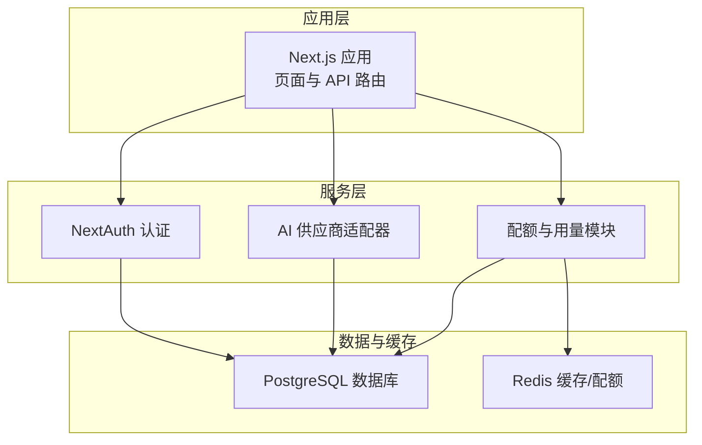
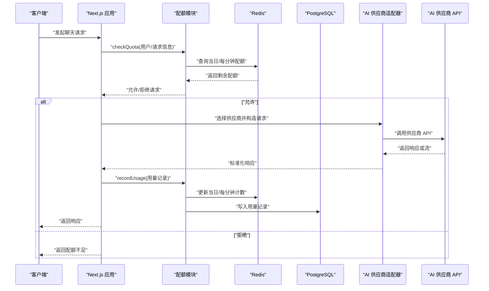
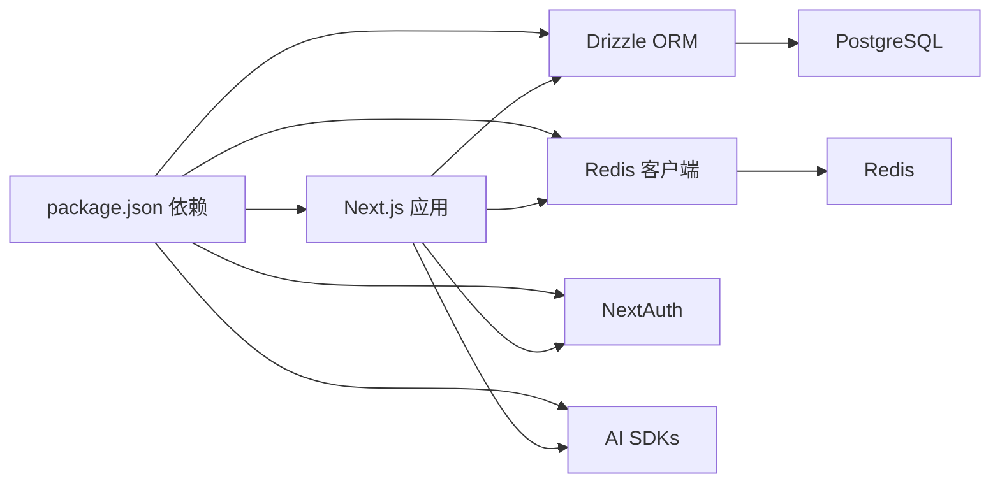
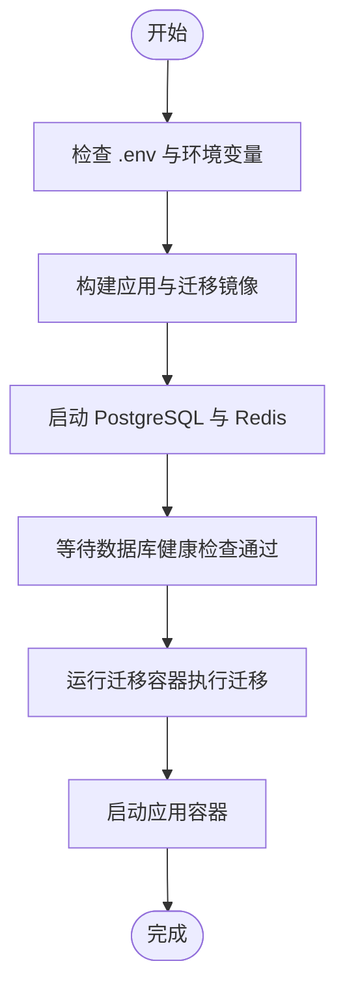

# 快速开始

<cite>
**本文引用的文件**
- [package.json](file://package.json)
- [Dockerfile](file://Dockerfile)
- [Dockerfile.migrate](file://Dockerfile.migrate)
- [docker-compose.yml](file://docker-compose.yml)
- [.env](file://.env)
- [drizzle.config.ts](file://drizzle.config.ts)
- [next.config.ts](file://next.config.ts)
- [src/lib/database.ts](file://src/lib/database.ts)
- [src/lib/drizzle.ts](file://src/lib/drizzle.ts)
- [src/lib/schema.ts](file://src/lib/schema.ts)
- [src/lib/redis.ts](file://src/lib/redis.ts)
- [src/lib/quota.ts](file://src/lib/quota.ts)
- [src/lib/ai-providers.ts](file://src/lib/ai-providers.ts)
- [src/auth.ts](file://src/auth.ts)
- [deploy.sh](file://deploy.sh)
</cite>

## 目录
1. [简介](#简介)
2. [项目结构](#项目结构)
3. [核心组件](#核心组件)
4. [架构总览](#架构总览)
5. [详细组件分析](#详细组件分析)
6. [依赖关系分析](#依赖关系分析)
7. [性能注意事项](#性能注意事项)
8. [故障排查指南](#故障排查指南)
9. [结论](#结论)
10. [附录](#附录)

## 简介
本指南面向希望在 15 分钟内成功启动 AIGate 的开发者，覆盖环境准备、依赖安装、数据库初始化、首次运行配置，以及开发与生产环境的部署方式（含 Docker 容器化）。你将获得：
- 最小可行配置清单
- 环境变量与数据库连接配置
- AI 供应商 API 密钥的获取与配置方法
- 常见安装问题排查与解决方案
- 开发与生产环境的部署命令与配置说明

## 项目结构
AIGate 是基于 Next.js 的全栈应用，采用 Drizzle ORM 进行数据库访问，Redis 实现配额与缓存，NextAuth 提供认证，支持多 AI 供应商（OpenAI、Anthropic、Google、DeepSeek、Moonshot、Spark）。

图表来源
- [src/lib/database.ts](file://src/lib/database.ts#L1-L524)
- [src/lib/drizzle.ts](file://src/lib/drizzle.ts#L1-L12)
- [src/lib/redis.ts](file://src/lib/redis.ts#L1-L49)
- [src/lib/quota.ts](file://src/lib/quota.ts#L1-L334)
- [src/lib/ai-providers.ts](file://src/lib/ai-providers.ts#L1-L759)
- [src/auth.ts](file://src/auth.ts#L1-L59)

章节来源
- [package.json](file://package.json#L1-L75)
- [next.config.ts](file://next.config.ts#L1-L9)

## 核心组件
- 数据库与迁移：Drizzle ORM + PostgreSQL；提供迁移脚本与配置。
- 缓存与配额：Redis 实现每日/每分钟限流与用量统计。
- 认证：NextAuth 使用凭据提供者，本地测试用户。
- AI 供应商：统一适配 OpenAI、Anthropic、Google、DeepSeek、Moonshot、Spark，并支持流式响应。
- 部署：Docker 多阶段构建，Compose 编排数据库与缓存，独立迁移容器。

章节来源
- [src/lib/database.ts](file://src/lib/database.ts#L1-L524)
- [src/lib/drizzle.ts](file://src/lib/drizzle.ts#L1-L12)
- [src/lib/schema.ts](file://src/lib/schema.ts#L1-L159)
- [src/lib/redis.ts](file://src/lib/redis.ts#L1-L49)
- [src/lib/quota.ts](file://src/lib/quota.ts#L1-L334)
- [src/lib/ai-providers.ts](file://src/lib/ai-providers.ts#L1-L759)
- [src/auth.ts](file://src/auth.ts#L1-L59)

## 架构总览
下图展示从客户端到 AI 供应商的调用链路与配额控制流程：

图表来源
- [src/lib/quota.ts](file://src/lib/quota.ts#L74-L190)
- [src/lib/redis.ts](file://src/lib/redis.ts#L1-L49)
- [src/lib/database.ts](file://src/lib/database.ts#L142-L277)
- [src/lib/ai-providers.ts](file://src/lib/ai-providers.ts#L1-L759)

## 详细组件分析

### 环境与依赖安装
- 运行时要求
  - Node.js 20（容器镜像已内置）
  - pnpm 9（容器镜像已启用）
- 本地开发
  - 安装依赖：使用 pnpm（项目已锁定版本）
  - 启动开发服务器：使用 Next.js 开发命令
- 生产构建
  - 使用多阶段 Dockerfile 构建静态产物
  - 使用 Standalone 输出（需开启）配合独立运行

章节来源
- [package.json](file://package.json#L6-L16)
- [Dockerfile](file://Dockerfile#L1-L52)
- [next.config.ts](file://next.config.ts#L3-L6)

### 数据库初始化与迁移
- 迁移配置
  - Drizzle Kit 配置指向 schema 文件与 DATABASE_URL
- 迁移执行
  - 本地：使用脚本执行迁移
  - Docker：使用独立迁移容器一次性执行
- 数据库健康检查
  - Compose 对 PostgreSQL 设置健康检查，等待就绪后再启动应用

章节来源
- [drizzle.config.ts](file://drizzle.config.ts#L1-L11)
- [Dockerfile.migrate](file://Dockerfile.migrate#L1-L15)
- [docker-compose.yml](file://docker-compose.yml#L62-L75)

### 首次运行配置
- 环境变量
  - 必填项：DATABASE_URL、REDIS_URL、NEXTAUTH_SECRET、NEXTAUTH_URL
  - 示例值参考项目根目录的环境文件
- 认证
  - 使用凭据提供者，内置测试用户用于登录页验证
- AI 供应商密钥
  - 在管理后台添加各供应商的 API Key 与可选的自定义 baseUrl
  - 系统会自动选择 ACTIVE 状态的密钥并缓存到 Redis

章节来源
- [.env](file://.env#L1-L4)
- [src/auth.ts](file://src/auth.ts#L1-L59)
- [src/lib/ai-providers.ts](file://src/lib/ai-providers.ts#L709-L758)
- [src/lib/database.ts](file://src/lib/database.ts#L19-L80)

### 开发环境运行
- 方式一：本地直接运行
  - 安装依赖后，启动开发服务器
  - 访问登录页，使用测试用户登录
- 方式二：Docker Compose
  - 启动 PostgreSQL、Redis、应用与一次性迁移容器
  - 应用端口映射默认 3000，可通过环境变量调整

章节来源
- [package.json](file://package.json#L6-L16)
- [docker-compose.yml](file://docker-compose.yml#L1-L84)

### 生产环境部署（Docker 容器化）
- 构建镜像
  - 多阶段构建，最终以 Standalone 模式运行
- 运行容器
  - 使用 Compose 编排应用、数据库与缓存
  - 迁移容器在数据库就绪后执行一次迁移
- 端口与网络
  - 应用暴露 3000 端口，容器间通过自定义网络通信

章节来源
- [Dockerfile](file://Dockerfile#L1-L52)
- [docker-compose.yml](file://docker-compose.yml#L1-L84)
- [next.config.ts](file://next.config.ts#L3-L6)

### 配额与用量控制
- 配额类型
  - 支持按 Token 或请求次数两种模式
  - 每日与每分钟限制（RPM）
- 缓存键设计
  - 用户每日用量、请求次数、每分钟计数、策略缓存、API Key 缓存
- 用量记录
  - 统一写入数据库，支持统计与报表

章节来源
- [src/lib/quota.ts](file://src/lib/quota.ts#L1-L334)
- [src/lib/redis.ts](file://src/lib/redis.ts#L1-L49)
- [src/lib/database.ts](file://src/lib/database.ts#L142-L277)

### AI 供应商适配
- 支持供应商
  - OpenAI、Anthropic、Google、DeepSeek、Moonshot、Spark
- 统一接口
  - 标准化请求与响应格式，支持同步与流式响应
- 自定义 baseUrl
  - 支持通过 API Key 表配置供应商自定义域名

章节来源
- [src/lib/ai-providers.ts](file://src/lib/ai-providers.ts#L1-L759)
- [src/lib/schema.ts](file://src/lib/schema.ts#L42-L52)

## 依赖关系分析

图表来源
- [package.json](file://package.json#L18-L56)

章节来源
- [package.json](file://package.json#L18-L56)

## 性能注意事项
- 缓存优先：配额与策略优先从 Redis 读取，降低数据库压力
- 批量统计：用量统计使用聚合查询，避免逐条扫描
- 流式响应：AI 供应商流式输出减少前端等待时间
- 连接池：数据库连接禁用预取以适配事务模式

章节来源
- [src/lib/redis.ts](file://src/lib/redis.ts#L1-L49)
- [src/lib/quota.ts](file://src/lib/quota.ts#L223-L255)
- [src/lib/database.ts](file://src/lib/database.ts#L222-L277)
- [src/lib/drizzle.ts](file://src/lib/drizzle.ts#L7-L9)

## 故障排查指南

### 1. 数据库无法连接
- 症状：应用启动时报数据库连接错误
- 排查要点
  - 确认 DATABASE_URL 格式正确且可达
  - Compose 中数据库容器健康检查是否通过
  - 迁移容器是否成功执行
- 参考文件
  - [docker-compose.yml](file://docker-compose.yml#L24-L43)
  - [docker-compose.yml](file://docker-compose.yml#L62-L75)
  - [drizzle.config.ts](file://drizzle.config.ts#L7-L9)

章节来源
- [docker-compose.yml](file://docker-compose.yml#L24-L43)
- [docker-compose.yml](file://docker-compose.yml#L62-L75)
- [drizzle.config.ts](file://drizzle.config.ts#L7-L9)

### 2. Redis 连接失败
- 症状：配额检查与用量记录异常
- 排查要点
  - REDIS_URL 是否正确
  - Redis 容器健康状态
- 参考文件
  - [.env](file://.env#L1-L1)
  - [docker-compose.yml](file://docker-compose.yml#L45-L59)
  - [src/lib/redis.ts](file://src/lib/redis.ts#L3-L5)

章节来源
- [.env](file://.env#L1-L1)
- [docker-compose.yml](file://docker-compose.yml#L45-L59)
- [src/lib/redis.ts](file://src/lib/redis.ts#L3-L5)

### 3. 登录失败或认证异常
- 症状：登录页无法进入后台
- 排查要点
  - NEXTAUTH_SECRET 与 NEXTAUTH_URL 是否设置
  - 测试用户凭据是否正确
- 参考文件
  - [.env](file://.env#L3-L4)
  - [src/auth.ts](file://src/auth.ts#L12-L24)

章节来源
- [.env](file://.env#L3-L4)
- [src/auth.ts](file://src/auth.ts#L12-L24)

### 4. AI 供应商调用失败
- 症状：聊天接口报错或无响应
- 排查要点
  - API Key 是否添加为 ACTIVE
  - 是否配置了正确的自定义 baseUrl
  - 供应商模型是否受支持
- 参考文件
  - [src/lib/ai-providers.ts](file://src/lib/ai-providers.ts#L709-L758)
  - [src/lib/ai-providers.ts](file://src/lib/ai-providers.ts#L688-L707)

章节来源
- [src/lib/ai-providers.ts](file://src/lib/ai-providers.ts#L709-L758)
- [src/lib/ai-providers.ts](file://src/lib/ai-providers.ts#L688-L707)

### 5. Docker 启动后页面空白或 500
- 症状：浏览器显示空白或 500 错误
- 排查要点
  - 确认迁移容器已成功执行
  - 应用容器端口映射是否冲突
  - 日志输出：使用日志命令查看容器日志
- 参考文件
  - [deploy.sh](file://deploy.sh#L118-L128)
  - [docker-compose.yml](file://docker-compose.yml#L18-L20)

章节来源
- [deploy.sh](file://deploy.sh#L118-L128)
- [docker-compose.yml](file://docker-compose.yml#L18-L20)

## 结论
通过本指南，你可以在 15 分钟内完成 AIGate 的环境准备、依赖安装、数据库初始化与首次运行配置，并掌握开发与生产环境的部署方式。建议在生产环境中：
- 更换默认密钥与 Secret
- 使用外部数据库与 Redis
- 配置反向代理与 HTTPS
- 为各 AI 供应商配置备用 Key 与限流策略

## 附录

### 最小可行配置清单
- 环境变量
  - DATABASE_URL：PostgreSQL 连接串
  - REDIS_URL：Redis 连接串
  - NEXTAUTH_SECRET：至少 32 字符的安全密钥
  - NEXTAUTH_URL：应用外网访问地址
- 供应商密钥
  - 在管理后台添加至少一个 ACTIVE 的 API Key
- 端口映射
  - 默认应用端口 3000，可在 Compose 中调整

章节来源
- [.env](file://.env#L1-L4)
- [docker-compose.yml](file://docker-compose.yml#L8-L9)

### 开发环境命令
- 安装依赖
  - 使用 pnpm 安装
- 启动开发服务器
  - 使用 Next.js 开发命令
- 构建与运行
  - 构建产物用于本地预览或容器运行

章节来源
- [package.json](file://package.json#L6-L16)

### 生产环境命令
- 一键部署脚本
  - 支持 up、update、down、restart、logs、migrate、status、clean 等子命令
- Compose 编排
  - 启动应用、数据库、缓存与迁移容器
- Dockerfile
  - 多阶段构建，Standalone 输出

章节来源
- [deploy.sh](file://deploy.sh#L1-L168)
- [docker-compose.yml](file://docker-compose.yml#L1-L84)
- [Dockerfile](file://Dockerfile#L1-L52)
- [next.config.ts](file://next.config.ts#L3-L6)

### 数据库与缓存初始化流程

图表来源
- [deploy.sh](file://deploy.sh#L58-L84)
- [docker-compose.yml](file://docker-compose.yml#L62-L75)
- [docker-compose.yml](file://docker-compose.yml#L24-L43)