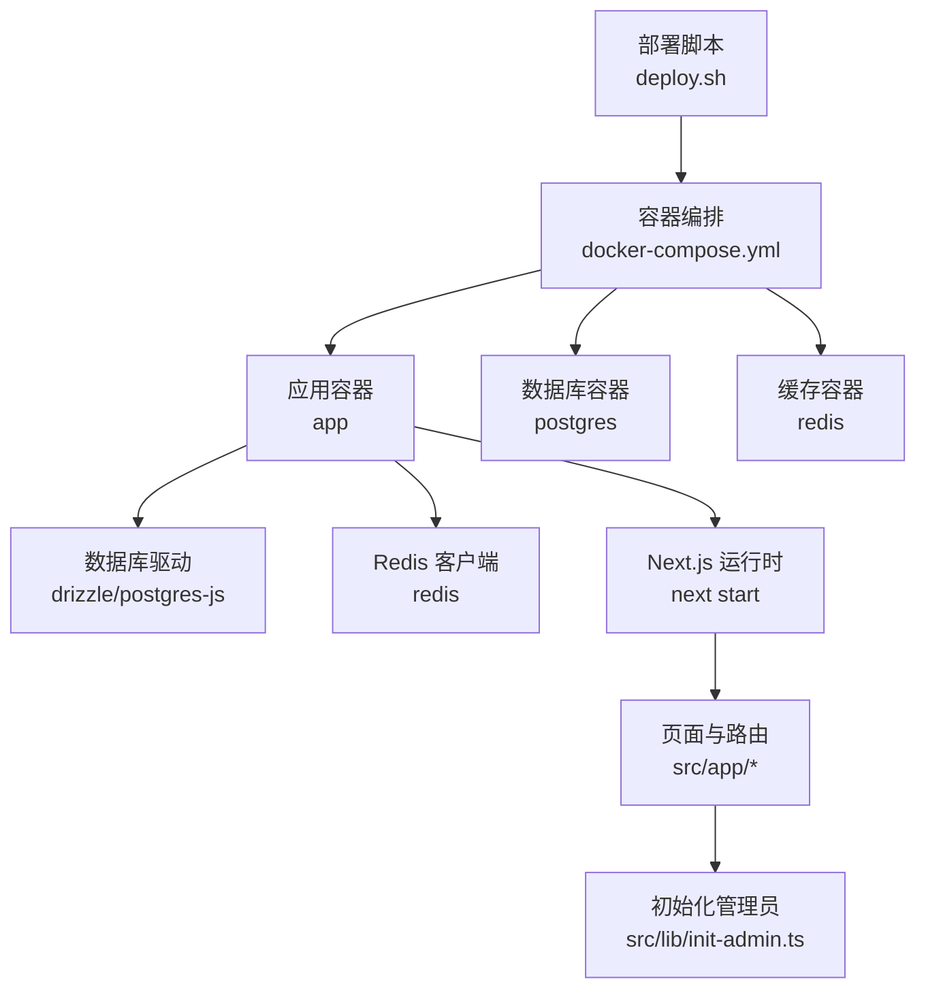
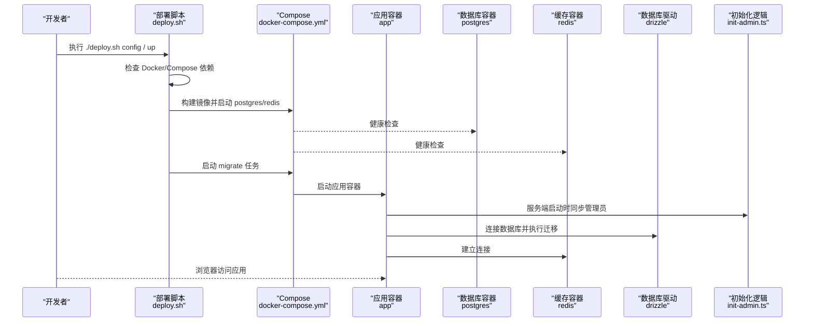
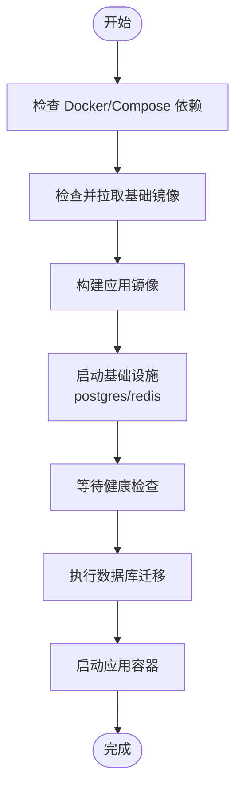
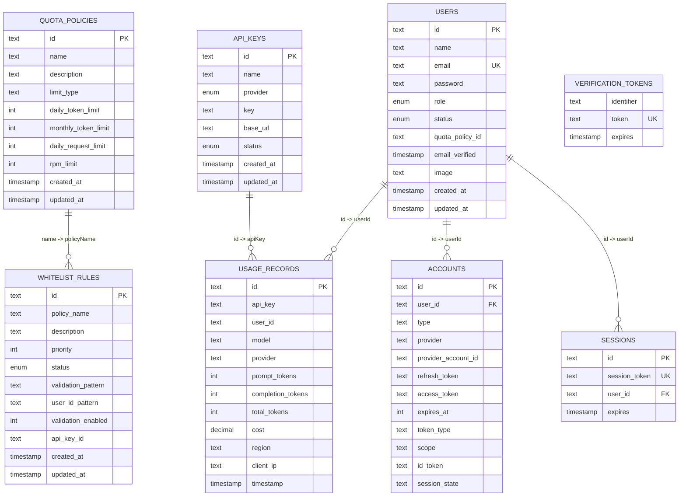
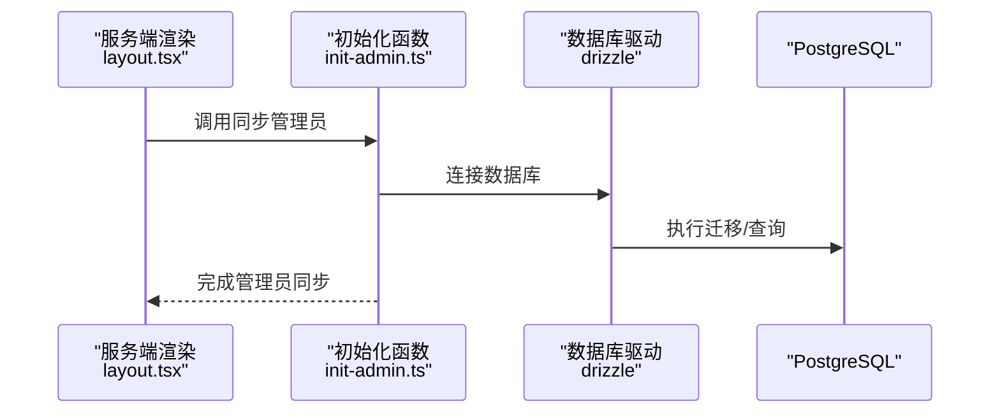
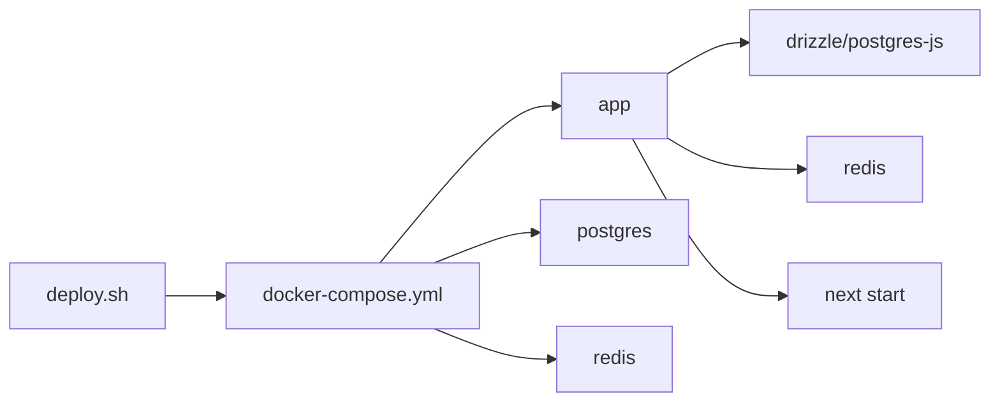

# 快速开始

<cite>
**本文引用的文件**   
- [README.md](file://README.md)
- [deploy.sh](file://deploy.sh)
- [docker-compose.yml](file://docker-compose.yml)
- [Dockerfile](file://Dockerfile)
- [package.json](file://package.json)
- [next.config.ts](file://next.config.ts)
- [drizzle.config.ts](file://drizzle.config.ts)
- [src/lib/init-admin.ts](file://src/lib/init-admin.ts)
- [src/lib/database.ts](file://src/lib/database.ts)
- [src/lib/redis.ts](file://src/lib/redis.ts)
- [src/lib/schema.ts](file://src/lib/schema.ts)
- [src/app/layout.tsx](file://src/app/layout.tsx)
</cite>

## 目录
1. [简介](#简介)
2. [项目结构](#项目结构)
3. [核心组件](#核心组件)
4. [架构总览](#架构总览)
5. [详细组件分析](#详细组件分析)
6. [依赖关系分析](#依赖关系分析)
7. [性能注意事项](#性能注意事项)
8. [故障排查指南](#故障排查指南)
9. [结论](#结论)
10. [附录](#附录)

## 简介
本指南面向首次部署与运行 AIGate 的用户，目标是帮助你在最短时间内完成环境准备、一键部署、初始配置与基本功能验证，并提供常见问题排查建议。AIGate 是一个基于 Next.js 14 + tRPC + Redis 的智能 AI 网关管理系统，支持配额控制、多模型代理、安全认证与实时监控。

## 项目结构
- 一键部署脚本：deploy.sh 提供交互式配置与多种部署命令（up、update、down、restart、logs、migrate、status、config、clean）。
- 容器编排：docker-compose.yml 定义应用、PostgreSQL、Redis 与一次性迁移任务。
- 构建与运行：Dockerfile 使用多阶段构建，结合 next.config.ts 的 standalone 输出，以最小化运行时体积。
- 数据与配置：drizzle.config.ts 定义数据库 schema 与迁移路径；init-admin.ts 在应用启动时按环境变量同步管理员用户；schema.ts 描述数据库表结构。
- 前后端集成：src/app/layout.tsx 在服务端启动时触发管理员同步；src/lib/redis.ts 提供 Redis 客户端；src/lib/database.ts 提供数据库访问层。

图表来源
- [deploy.sh](file://deploy.sh#L207-L273)
- [docker-compose.yml](file://docker-compose.yml#L1-L87)
- [Dockerfile](file://Dockerfile#L1-L54)
- [next.config.ts](file://next.config.ts#L1-L9)
- [drizzle.config.ts](file://drizzle.config.ts#L1-L11)
- [src/lib/init-admin.ts](file://src/lib/init-admin.ts#L1-L79)
- [src/lib/redis.ts](file://src/lib/redis.ts#L1-L43)
- [src/lib/database.ts](file://src/lib/database.ts#L1-L692)

章节来源
- [README.md](file://README.md#L1-L83)
- [deploy.sh](file://deploy.sh#L1-L382)
- [docker-compose.yml](file://docker-compose.yml#L1-L87)
- [Dockerfile](file://Dockerfile#L1-L54)
- [next.config.ts](file://next.config.ts#L1-L9)
- [drizzle.config.ts](file://drizzle.config.ts#L1-L11)
- [src/lib/init-admin.ts](file://src/lib/init-admin.ts#L1-L79)
- [src/lib/redis.ts](file://src/lib/redis.ts#L1-L43)
- [src/lib/database.ts](file://src/lib/database.ts#L1-L692)

## 核心组件
- 一键部署脚本：负责依赖检查、镜像拉取、应用构建、基础设施启动、数据库迁移与应用启动。
- 容器编排：定义应用、数据库、缓存与迁移任务的网络、健康检查与依赖关系。
- 应用镜像：多阶段构建，使用 pnpm 与 standalone 输出，降低运行时资源占用。
- 数据层：Drizzle ORM + PostgreSQL，配合 schema 定义表结构；迁移配置由 drizzle.config.ts 管理。
- 缓存层：Redis 用于配额与策略缓存，键空间设计覆盖用户配额、请求速率、策略缓存等。
- 初始化逻辑：应用启动时按环境变量同步管理员用户，确保后台登录可用。

章节来源
- [deploy.sh](file://deploy.sh#L36-L49)
- [docker-compose.yml](file://docker-compose.yml#L1-L87)
- [Dockerfile](file://Dockerfile#L1-L54)
- [drizzle.config.ts](file://drizzle.config.ts#L1-L11)
- [src/lib/schema.ts](file://src/lib/schema.ts#L1-L162)
- [src/lib/redis.ts](file://src/lib/redis.ts#L1-L43)
- [src/lib/init-admin.ts](file://src/lib/init-admin.ts#L1-L79)

## 架构总览
下图展示了从部署脚本到应用运行、数据库与缓存交互的整体流程。

图表来源
- [deploy.sh](file://deploy.sh#L207-L273)
- [docker-compose.yml](file://docker-compose.yml#L1-L87)
- [src/lib/init-admin.ts](file://src/lib/init-admin.ts#L9-L70)

## 详细组件分析

### 环境准备与前置条件
- Docker 与 Docker Compose：脚本会检测 Docker 与 Compose v2 是否安装，未安装将提示安装链接。
- Node.js 与包管理：应用镜像使用 node:20-alpine，开发与构建使用 pnpm；package.json 指定 pnpm 版本。
- 本地端口与网络：compose 将应用端口映射到宿主机，网络采用自定义桥接网络。

章节来源
- [deploy.sh](file://deploy.sh#L36-L49)
- [package.json](file://package.json#L1-L90)
- [docker-compose.yml](file://docker-compose.yml#L1-L87)

### 一键部署流程详解
- 命令概览
  - up：首次部署/全量启动（默认），包含镜像检查、构建、启动基础设施、迁移与应用启动。
  - update：重新构建镜像并执行数据库迁移，随后重启应用。
  - down：停止并移除所有容器。
  - restart：重启应用容器。
  - logs：查看应用日志。
  - migrate：仅执行数据库迁移。
  - status：查看服务状态。
  - config：交互式配置环境变量。
  - clean：停止并清除所有数据（危险）。
- 部署步骤拆解
  1) 依赖检查：确保 Docker 与 Compose v2 可用。
  2) 镜像检查与拉取：对 Node.js、PostgreSQL、Redis 镜像进行存在性检查与拉取。
  3) 构建应用镜像：使用 docker compose build，跳过远程检查。
  4) 启动基础设施：先启动 postgres 与 redis，并等待其健康。
  5) 执行迁移：运行 migrate 任务，完成后启动应用。
  6) 输出访问地址与常用命令提示。

图表来源
- [deploy.sh](file://deploy.sh#L207-L273)

章节来源
- [deploy.sh](file://deploy.sh#L8-L382)

### 环境变量配置选项
- 管理员账户：ADMIN_EMAIL、ADMIN_PASSWORD、ADMIN_NAME（NEXT_PUBLIC_* 为前端可见的管理员信息）。
- 数据库连接：DATABASE_URL（由 compose 注入）。
- 缓存配置：REDIS_URL（由 compose 注入）。
- 应用端口：APP_PORT（默认 3000，compose 映射到宿主）。
- 认证相关：NEXTAUTH_SECRET（若不存在则自动生成）、NEXTAUTH_URL（基于 APP_PORT）。
- 日志设置：LOG_DIR、LOG_LEVEL（Winston 使用，生产环境写文件）。
- 配置保存：脚本会在 .env 中写入上述键值，支持交互式修改与确认保存。

章节来源
- [deploy.sh](file://deploy.sh#L92-L192)
- [deploy.sh](file://deploy.sh#L62-L89)
- [docker-compose.yml](file://docker-compose.yml#L10-L23)

### 首次运行后的基本配置
- 管理员账户设置：通过交互式配置或直接编辑 .env，应用启动时会按环境变量同步管理员用户。
- 数据库初始化：compose 启动 migrate 任务，Drizzle 根据 schema 执行迁移。
- 基本功能验证：
  - 登录后台：访问应用地址（默认 http://localhost:3000），使用管理员账户登录。
  - API 调用：参考 README 的 OpenAI 兼容接口示例，携带 X-User-ID 与策略参数进行测试。
  - 管理后台：通过 /settings 页面可动态修改管理员账户信息，实时生效无需重启。

章节来源
- [src/lib/init-admin.ts](file://src/lib/init-admin.ts#L9-L70)
- [src/app/layout.tsx](file://src/app/layout.tsx#L8-L11)
- [README.md](file://README.md#L52-L72)

### 数据库与缓存组件
- 数据库 schema：包含配额策略、API 密钥、用量记录、用户、白名单规则及 NextAuth 相关表。
- 迁移配置：drizzle.config.ts 指定 schema 路径与输出目录。
- Redis 键空间：涵盖用户每日配额、请求次数、每分钟请求、策略缓存、API Key 缓存、请求日志等。

图表来源
- [src/lib/schema.ts](file://src/lib/schema.ts#L1-L162)

章节来源
- [src/lib/schema.ts](file://src/lib/schema.ts#L1-L162)
- [drizzle.config.ts](file://drizzle.config.ts#L1-L11)
- [src/lib/redis.ts](file://src/lib/redis.ts#L18-L43)

### 应用启动与初始化流程
- 服务端初始化：在服务端渲染时调用 syncAdminUserOnStartup，按环境变量同步管理员用户。
- 应用运行：Next.js 以 standalone 方式运行，监听环境变量 PORT（默认 3000）。

图表来源
- [src/app/layout.tsx](file://src/app/layout.tsx#L8-L11)
- [src/lib/init-admin.ts](file://src/lib/init-admin.ts#L9-L70)

章节来源
- [src/app/layout.tsx](file://src/app/layout.tsx#L1-L54)
- [src/lib/init-admin.ts](file://src/lib/init-admin.ts#L1-L79)

## 依赖关系分析
- 组件耦合
  - 部署脚本与 compose：脚本驱动 compose 的构建、启动与迁移。
  - 应用容器与数据库/缓存：应用容器依赖健康运行的数据库与缓存。
  - 数据层：Drizzle 作为 ORM，依赖 DATABASE_URL；schema 定义表结构。
  - 缓存层：Redis 客户端依赖 REDIS_URL。
- 外部依赖
  - Docker/Compose：容器化运行必备。
  - Node.js 与 pnpm：构建与运行时依赖。
  - Next.js standalone：减少运行时体积与依赖。

图表来源
- [deploy.sh](file://deploy.sh#L207-L273)
- [docker-compose.yml](file://docker-compose.yml#L1-L87)
- [Dockerfile](file://Dockerfile#L1-L54)

章节来源
- [deploy.sh](file://deploy.sh#L1-L382)
- [docker-compose.yml](file://docker-compose.yml#L1-L87)
- [package.json](file://package.json#L1-L90)

## 性能注意事项
- 使用多阶段构建与 standalone 输出，降低运行时资源占用。
- Redis 缓存键空间设计覆盖高频查询场景（每日配额、请求速率、策略缓存），建议合理设置过期时间与内存上限。
- 数据库迁移在应用启动前完成，避免运行时阻塞；Drizzle 查询使用索引字段（如 email、id）可提升查询效率。
- 日志级别与目录在生产环境写文件，建议结合日志轮转策略控制磁盘占用。

## 故障排查指南
- 依赖缺失
  - 症状：脚本报错提示未安装 Docker 或 Compose v2。
  - 处理：安装 Docker 并升级至包含 Compose v2 的版本。
- 镜像拉取失败
  - 症状：拉取 node:20-alpine、postgres:15-alpine、redis:7-alpine 失败。
  - 处理：检查网络与镜像仓库可达性，手动 docker pull 对应镜像后重试。
- 基础设施未就绪
  - 症状：应用启动后数据库或缓存连接失败。
  - 处理：查看 compose 健康检查状态，确认 postgres 与 redis 健康后再启动应用。
- 数据库迁移失败
  - 症状：迁移任务报错或应用无法启动。
  - 处理：执行 ./deploy.sh migrate 单独运行迁移，查看日志定位错误；确认 DATABASE_URL 正确。
- 管理员账户不可用
  - 症状：登录后台失败。
  - 处理：确认 .env 中 ADMIN_EMAIL/ADMIN_PASSWORD/ADMIN_NAME 设置正确；应用启动时会按环境变量同步管理员；也可通过管理后台 /settings 动态修改。
- 日志与状态
  - 查看日志：./deploy.sh logs。
  - 查看状态：./deploy.sh status。
- 清理与重置
  - 危险操作：./deploy.sh clean 将删除所有容器与数据卷（包括数据库数据），谨慎使用。

章节来源
- [deploy.sh](file://deploy.sh#L275-L334)
- [deploy.sh](file://deploy.sh#L308-L322)
- [src/lib/init-admin.ts](file://src/lib/init-admin.ts#L66-L70)

## 结论
通过本快速开始指南，你可以在本地完成环境准备、一键部署、初始配置与基本功能验证。建议在生产环境中进一步完善网络与安全策略、日志轮转与备份方案，并结合实际业务调整配额策略与缓存键空间设计。

## 附录
- 常用命令
  - 交互式配置：./deploy.sh config
  - 一键部署：./deploy.sh up
  - 更新应用：./deploy.sh update
  - 停止服务：./deploy.sh down
  - 重启应用：./deploy.sh restart
  - 查看日志：./deploy.sh logs
  - 仅迁移：./deploy.sh migrate
  - 查看状态：./deploy.sh status
  - 清理数据：./deploy.sh clean

章节来源
- [README.md](file://README.md#L18-L39)
- [deploy.sh](file://deploy.sh#L337-L357)