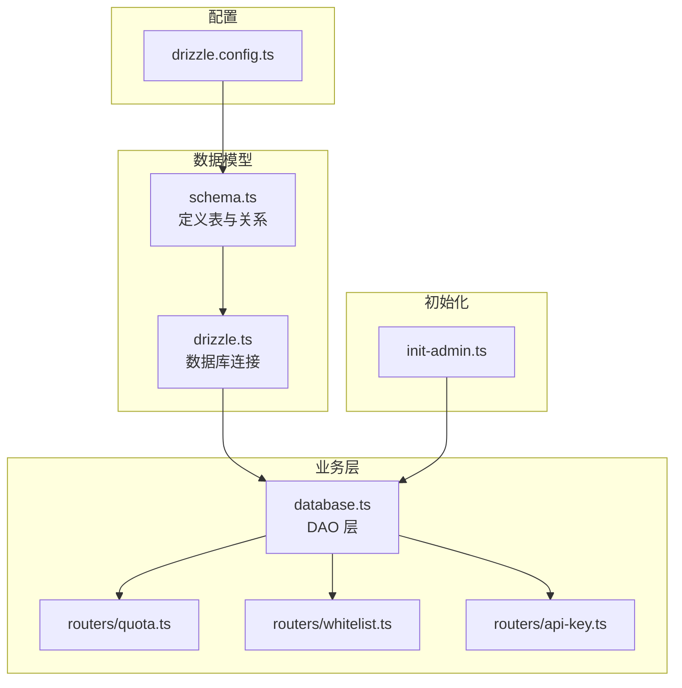
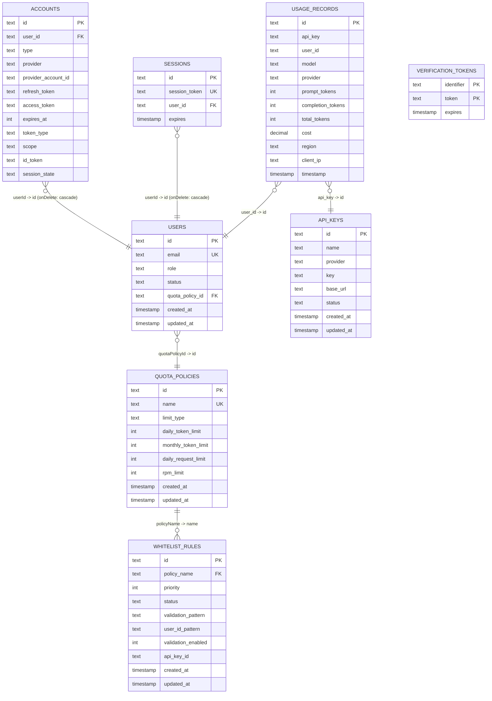
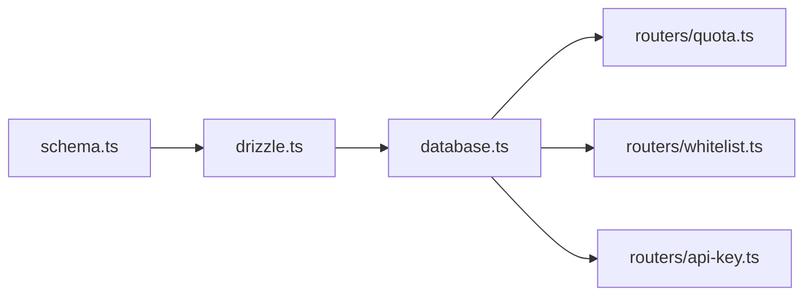

# 实体关系映射

<cite>
**本文档引用的文件**
- [drizzle.config.ts](file://drizzle.config.ts)
- [schema.ts](file://src/lib/schema.ts)
- [drizzle.ts](file://src/lib/drizzle.ts)
- [database.ts](file://src/lib/database.ts)
- [quota.ts](file://src/server/api/routers/quota.ts)
- [whitelist.ts](file://src/server/api/routers/whitelist.ts)
- [api-key.ts](file://src/server/api/routers/api-key.ts)
- [init-admin.ts](file://src/lib/init-admin.ts)
- [types.ts](file://src/lib/types.ts)
</cite>

## 目录
1. [简介](#简介)
2. [项目结构](#项目结构)
3. [核心组件](#核心组件)
4. [架构总览](#架构总览)
5. [详细组件分析](#详细组件分析)
6. [依赖分析](#依赖分析)
7. [性能考虑](#性能考虑)
8. [故障排除指南](#故障排除指南)
9. [结论](#结论)
10. [附录](#附录)

## 简介
本文件面向 AIGate 的数据库与实体关系设计，基于 Drizzle ORM 的 schema 定义与业务层调用，系统性梳理各数据表之间的关联关系、外键约束与引用完整性，明确一对一、一对多、多对多关系的实现方式，并解释关系定义、级联操作与数据一致性保障机制。同时提供实体关系图、查询优化策略、性能考量以及复杂查询示例与关系维护最佳实践。

## 项目结构
AIGate 的数据模型由 Drizzle ORM 在 PostgreSQL 中定义，核心文件包括：
- 数据库配置：drizzle.config.ts
- 数据模型定义：src/lib/schema.ts
- 数据库连接封装：src/lib/drizzle.ts
- 业务数据库操作：src/lib/database.ts
- API 层路由（配额、白名单、API Key）：src/server/api/routers/*.ts
- 启动时初始化管理员：src/lib/init-admin.ts
- 类型定义：src/lib/types.ts

图表来源
- [drizzle.config.ts](file://drizzle.config.ts#L1-L11)
- [schema.ts](file://src/lib/schema.ts#L1-L162)
- [drizzle.ts](file://src/lib/drizzle.ts#L1-L12)
- [database.ts](file://src/lib/database.ts#L1-L692)
- [quota.ts](file://src/server/api/routers/quota.ts#L1-L221)
- [whitelist.ts](file://src/server/api/routers/whitelist.ts#L1-L222)
- [api-key.ts](file://src/server/api/routers/api-key.ts#L1-L377)
- [init-admin.ts](file://src/lib/init-admin.ts#L1-L79)

章节来源
- [drizzle.config.ts](file://drizzle.config.ts#L1-L11)
- [schema.ts](file://src/lib/schema.ts#L1-L162)
- [drizzle.ts](file://src/lib/drizzle.ts#L1-L12)
- [database.ts](file://src/lib/database.ts#L1-L692)

## 核心组件
本节概述数据模型中的核心实体及它们的关系定义。

- 配额策略表（quotaPolicies）
  - 主键：id
  - 关键字段：name（策略名）、limitType（限制类型：token/request）、各类限额等
  - 作用：定义用户的配额策略，被白名单规则引用

- API 密钥表（apiKeys）
  - 主键：id
  - 关键字段：provider（服务商）、key（密钥）、status（状态）
  - 作用：存储可用的 API Key，供路由层使用

- 用量记录表（usageRecords）
  - 主键：id
  - 关键字段：apiKey、userId、model、provider、promptTokens、completionTokens、totalTokens、cost、region、clientIp、timestamp
  - 作用：记录每次调用的用量与成本

- 用户表（users）
  - 主键：id
  - 关键字段：email（唯一）、role、status、quotaPolicyId（外键指向 quotaPolicies.name）
  - 作用：系统用户，与配额策略关联

- 白名单规则表（whitelistRules）
  - 主键：id
  - 关键字段：policyName（策略名）、priority、status、validationPattern、userIdPattern、validationEnabled、apiKeyId
  - 作用：按策略名与 API Key 绑定用户校验规则

- NextAuth 表（accounts、sessions、verification_tokens）
  - accounts.userId 引用 users.id（级联删除）
  - sessions.userId 引用 users.id（级联删除）
  - verification_tokens 复合主键（identifier、token）

- 关系定义
  - whitelistRules.policyName → quotaPolicies.name（一对一）

章节来源
- [schema.ts](file://src/lib/schema.ts#L28-L162)

## 架构总览
下图展示实体关系与典型查询路径：

图表来源
- [schema.ts](file://src/lib/schema.ts#L28-L162)

## 详细组件分析

### 配额策略（quotaPolicies）
- 关系属性
  - 一对一：whitelistRules.policyName → quotaPolicies.name
- 业务要点
  - 支持按 token 或 request 两种限制类型
  - 提供日/月限额与 RPM 限制
- 查询与维护
  - CRUD 操作在 database.ts 中实现
  - 路由层提供创建、更新、删除接口

章节来源
- [schema.ts](file://src/lib/schema.ts#L28-L40)
- [database.ts](file://src/lib/database.ts#L83-L141)
- [quota.ts](file://src/server/api/routers/quota.ts#L89-L220)

### API 密钥（apiKeys）
- 关系属性
  - 一对多：apiKeys.id → usageRecords.api_key
- 业务要点
  - 存储不同服务商的密钥
  - 支持状态切换与缓存更新
- 查询与维护
  - CRUD 操作在 database.ts 中实现
  - 路由层提供创建、更新、删除、状态切换与使用统计

章节来源
- [schema.ts](file://src/lib/schema.ts#L42-L52)
- [database.ts](file://src/lib/database.ts#L19-L81)
- [api-key.ts](file://src/server/api/routers/api-key.ts#L68-L377)

### 用量记录（usageRecords）
- 关系属性
  - 多对一：usageRecords.user_id → users.id
  - 多对一：usageRecords.api_key → apiKeys.id
- 业务要点
  - 记录每次调用的 token 消耗与成本
  - 支持按用户、时间范围查询与统计
- 查询与维护
  - 统计接口在 database.ts 中实现
  - 路由层提供使用统计查询

章节来源
- [schema.ts](file://src/lib/schema.ts#L54-L68)
- [database.ts](file://src/lib/database.ts#L143-L278)
- [api-key.ts](file://src/server/api/routers/api-key.ts#L324-L377)

### 用户（users）
- 关系属性
  - 多对一：users.quotaPolicyId → quotaPolicies.id
  - 一对多：users.id → accounts.user_id（级联删除）
  - 一对多：users.id → sessions.user_id（级联删除）
- 业务要点
  - 角色与状态管理
  - 与配额策略关联
- 查询与维护
  - CRUD 操作在 database.ts 中实现
  - 启动时初始化管理员逻辑在 init-admin.ts 中

章节来源
- [schema.ts](file://src/lib/schema.ts#L70-L83)
- [schema.ts](file://src/lib/schema.ts#L100-L125)
- [database.ts](file://src/lib/database.ts#L581-L691)
- [init-admin.ts](file://src/lib/init-admin.ts#L1-L79)

### 白名单规则（whitelistRules）
- 关系属性
  - 多对一：whitelistRules.policyName → quotaPolicies.name
  - 多对一：whitelistRules.apiKeyId → apiKeys.id（业务约束：单 API Key 仅绑定一个规则）
- 业务要点
  - 支持优先级、状态、正则校验、用户 ID 模式生成
  - 提供规则匹配与校验流程
- 查询与维护
  - CRUD 操作在 database.ts 中实现
  - 路由层提供创建、更新、删除、状态切换与统计

章节来源
- [schema.ts](file://src/lib/schema.ts#L85-L98)
- [schema.ts](file://src/lib/schema.ts#L139-L145)
- [database.ts](file://src/lib/database.ts#L292-L579)
- [whitelist.ts](file://src/server/api/routers/whitelist.ts#L22-L222)

### NextAuth 相关表（accounts、sessions、verification_tokens）
- 关系属性
  - accounts.userId → users.id（onDelete: cascade）
  - sessions.userId → users.id（onDelete: cascade）
  - verification_tokens(identifier, token) 复合主键
- 业务要点
  - 支持第三方登录与会话管理
  - 级联删除确保用户删除时清理相关会话

章节来源
- [schema.ts](file://src/lib/schema.ts#L100-L137)

### 关系定义与级联操作
- 外键与级联
  - accounts.userId → users.id（onDelete: cascade）
  - sessions.userId → users.id（onDelete: cascade）
  - whitelistRules.policyName → quotaPolicies.name（一对一）
- 引用完整性
  - 通过 Drizzle 的 references 定义与 PostgreSQL 约束保证
  - 业务层在路由中对 API Key 绑定进行约束检查

章节来源
- [schema.ts](file://src/lib/schema.ts#L100-L145)
- [whitelist.ts](file://src/server/api/routers/whitelist.ts#L73-L82)

## 依赖分析
- 组件耦合
  - database.ts 作为 DAO 层，被多个路由层调用
  - schema.ts 是所有关系与约束的源头
  - drizzle.ts 提供统一数据库连接
- 直接与间接依赖
  - 路由层依赖 database.ts
  - database.ts 依赖 schema.ts
  - drizzle.ts 依赖 schema.ts 并注入到数据库实例
- 循环依赖
  - 当前结构无循环依赖
- 外部依赖
  - PostgreSQL（通过 drizzle-orm 与 postgres-js）
  - Redis（用于缓存 API Key 与配额策略）

图表来源
- [schema.ts](file://src/lib/schema.ts#L1-L162)
- [drizzle.ts](file://src/lib/drizzle.ts#L1-L12)
- [database.ts](file://src/lib/database.ts#L1-L692)
- [quota.ts](file://src/server/api/routers/quota.ts#L1-L221)
- [whitelist.ts](file://src/server/api/routers/whitelist.ts#L1-L222)
- [api-key.ts](file://src/server/api/routers/api-key.ts#L1-L377)

## 性能考虑
- 查询优化策略
  - 为高频查询字段建立索引（如 usageRecords.user_id、usageRecords.timestamp、users.email、apiKeys.provider、whitelistRules.apiKeyId）
  - 使用分页与排序（按 timestamp 降序）避免全表扫描
  - 对统计查询采用聚合函数（count、sum、countDistinct）并结合 WHERE 条件
- 缓存策略
  - API Key 在 Redis 中短期缓存，降低数据库压力
  - 配额策略变更后批量清理相关 Redis 键
- 写入优化
  - 使用 returning() 减少往返
  - 批量操作（如统计查询）使用 Promise.all 并行执行
- 连接与预处理
  - 禁用预读取以适配事务池模式，减少内存占用

章节来源
- [drizzle.ts](file://src/lib/drizzle.ts#L1-L12)
- [api-key.ts](file://src/server/api/routers/api-key.ts#L149-L156)
- [quota.ts](file://src/server/api/routers/quota.ts#L15-L37)
- [database.ts](file://src/lib/database.ts#L237-L258)

## 故障排除指南
- 常见问题与定位
  - 外键约束错误：检查关联字段是否正确（如 whitelistRules.policyName 对应 quotaPolicies.name）
  - 用户删除后会话残留：确认 accounts/sessions 的 onDelete: cascade 是否生效
  - API Key 绑定冲突：确保单个 API Key 仅绑定一个白名单规则
  - Redis 缓存异常：关注缓存更新/删除失败的日志
- 排查步骤
  - 核对 schema.ts 中的 references 定义
  - 检查路由层的输入校验与约束检查
  - 查看数据库统计查询与缓存清理逻辑
- 相关实现位置
  - 外键与级联：schema.ts
  - 白名单规则绑定约束：whitelist.ts
  - API Key 缓存：api-key.ts
  - 统计与缓存清理：database.ts、quota.ts

章节来源
- [schema.ts](file://src/lib/schema.ts#L100-L145)
- [whitelist.ts](file://src/server/api/routers/whitelist.ts#L73-L82)
- [api-key.ts](file://src/server/api/routers/api-key.ts#L149-L156)
- [quota.ts](file://src/server/api/routers/quota.ts#L15-L37)
- [database.ts](file://src/lib/database.ts#L237-L258)

## 结论
AIGate 的数据模型通过 Drizzle ORM 明确地定义了实体关系与外键约束，配合 NextAuth 的级联删除机制，确保了用户生命周期内的引用完整性。白名单规则与配额策略的解耦设计提升了策略管理的灵活性；用量记录与 API Key 的关联为成本与用量统计提供了基础。通过合理的索引、缓存与并行查询策略，系统在可维护性与性能之间取得了平衡。

## 附录

### 复杂查询示例（路径引用）
- 获取某 API Key 最近7天的用量统计与每日汇总
  - 路径：[api-key.ts](file://src/server/api/routers/api-key.ts#L324-L377)
  - 说明：按日期分组统计请求次数与 token 消耗
- 根据 API Key 与 userId 校验并匹配策略
  - 路径：[whitelist.ts](file://src/server/api/routers/whitelist.ts#L207-L221)
  - 说明：先按 apiKeyId 获取规则，再进行正则与用户 ID 生成校验
- 更新配额策略后清理缓存
  - 路径：[quota.ts](file://src/server/api/routers/quota.ts#L15-L37)
  - 说明：扫描并删除匹配的 Redis 键，确保策略变更即时生效

### 关系维护最佳实践
- 新增实体时
  - 明确定义主键与外键，必要时添加复合主键或唯一约束
  - 对高频查询字段建立索引
- 修改关系时
  - 先在 schema.ts 中更新 references，再执行迁移
  - 如涉及级联删除，确保下游表的清理逻辑完备
- 业务约束
  - 在路由层增加显式约束检查（如 API Key 绑定唯一性）
  - 对关键写入操作使用事务，保证原子性