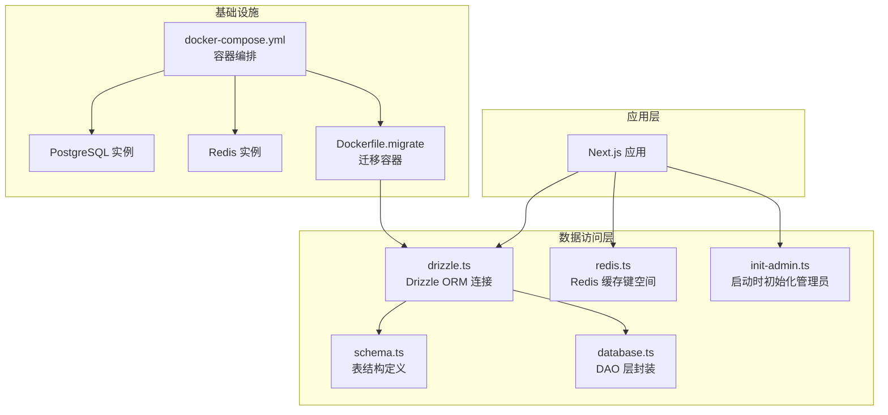
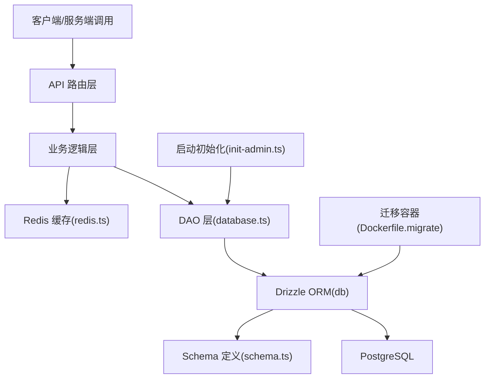
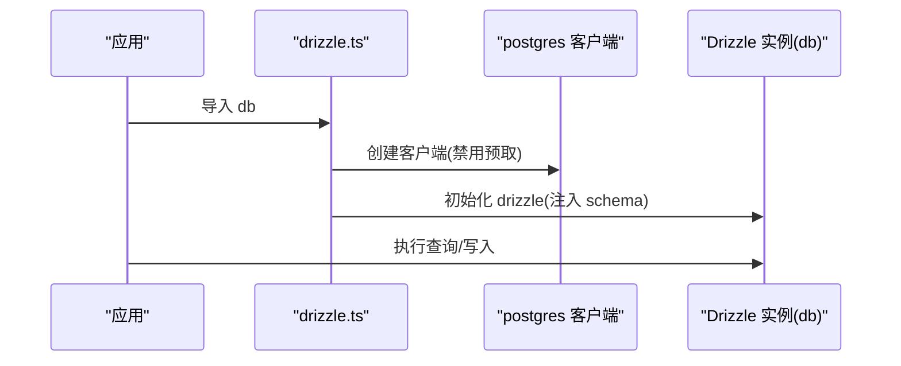
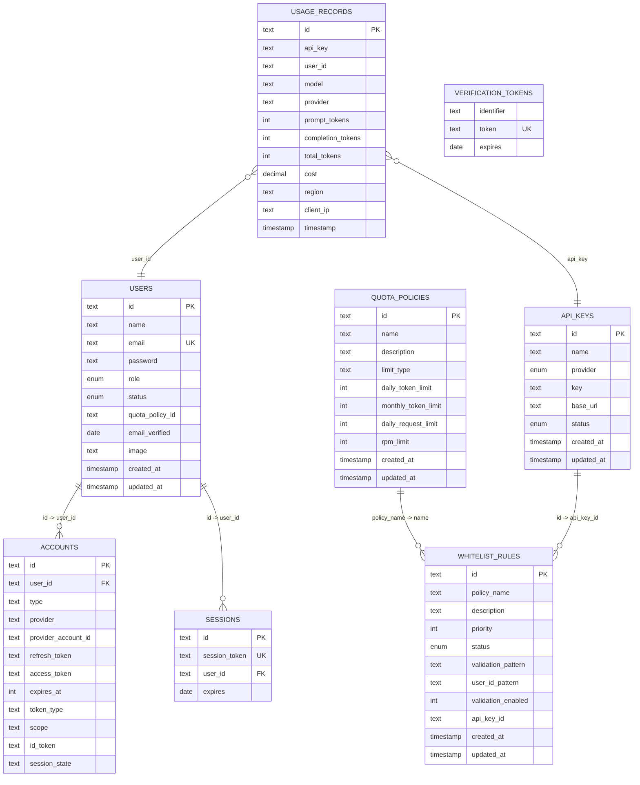
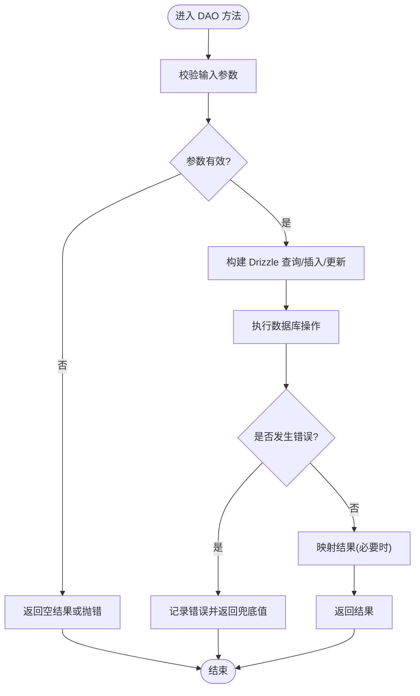
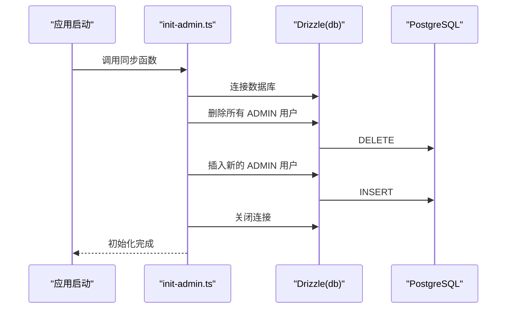
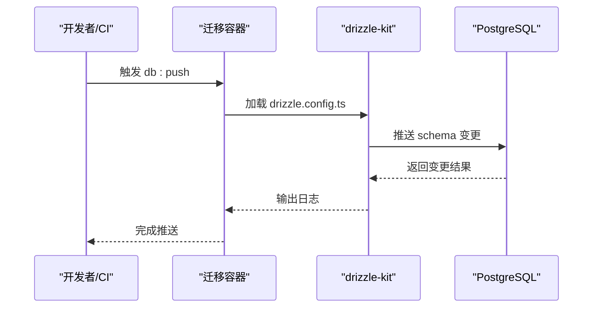
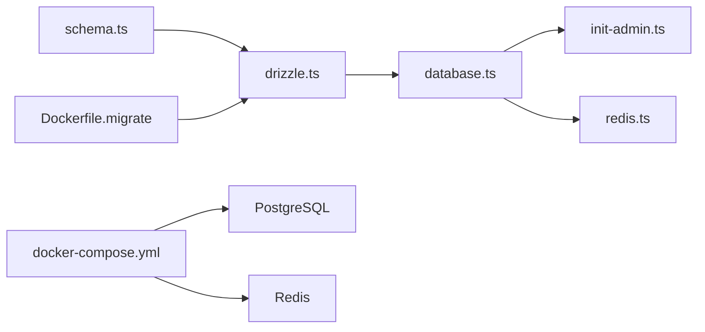

# 数据库架构概览

<cite>
**本文档引用的文件**
- [drizzle.config.ts](file://drizzle.config.ts)
- [src/lib/drizzle.ts](file://src/lib/drizzle.ts)
- [src/lib/database.ts](file://src/lib/database.ts)
- [src/lib/schema.ts](file://src/lib/schema.ts)
- [docker-compose.yml](file://docker-compose.yml)
- [Dockerfile.migrate](file://Dockerfile.migrate)
- [package.json](file://package.json)
- [src/lib/init-admin.ts](file://src/lib/init-admin.ts)
- [src/lib/redis.ts](file://src/lib/redis.ts)
</cite>

## 目录
1. [引言](#引言)
2. [项目结构](#项目结构)
3. [核心组件](#核心组件)
4. [架构总览](#架构总览)
5. [详细组件分析](#详细组件分析)
6. [依赖关系分析](#依赖关系分析)
7. [性能考虑](#性能考虑)
8. [故障排除指南](#故障排除指南)
9. [结论](#结论)

## 引言
本文件面向 AIGate 项目的数据库架构，提供从整体设计思路、技术选型到实现细节的系统化说明。重点覆盖以下方面：
- Drizzle ORM 的使用方式与连接管理
- PostgreSQL 配置与连接池策略
- 数据库初始化流程、迁移策略与版本管理
- 数据库连接配置、事务处理与并发控制
- 性能优化建议与监控指标

## 项目结构
数据库相关代码主要集中在 src/lib 目录下，采用“按职责分层”的组织方式：
- schema 定义数据库表结构与枚举
- drizzle 提供统一的数据库连接实例
- database 封装各实体的数据访问层
- init-admin 在应用启动时进行管理员账户初始化
- redis 提供缓存键空间与键命名规范

**图表来源**
- [src/lib/drizzle.ts](file://src/lib/drizzle.ts#L1-L12)
- [src/lib/schema.ts](file://src/lib/schema.ts#L1-L162)
- [src/lib/database.ts](file://src/lib/database.ts#L1-L692)
- [src/lib/init-admin.ts](file://src/lib/init-admin.ts#L1-L79)
- [src/lib/redis.ts](file://src/lib/redis.ts#L1-L43)
- [docker-compose.yml](file://docker-compose.yml#L1-L87)
- [Dockerfile.migrate](file://Dockerfile.migrate#L1-L14)

**章节来源**
- [src/lib/drizzle.ts](file://src/lib/drizzle.ts#L1-L12)
- [src/lib/schema.ts](file://src/lib/schema.ts#L1-L162)
- [src/lib/database.ts](file://src/lib/database.ts#L1-L692)
- [src/lib/init-admin.ts](file://src/lib/init-admin.ts#L1-L79)
- [src/lib/redis.ts](file://src/lib/redis.ts#L1-L43)
- [docker-compose.yml](file://docker-compose.yml#L1-L87)
- [Dockerfile.migrate](file://Dockerfile.migrate#L1-L14)

## 核心组件
- Drizzle ORM 连接与配置：在 drizzle.ts 中创建单一连接实例，禁用预取以适配事务模式。
- 表结构与枚举：schema.ts 定义用户、API 密钥、用量记录、白名单规则等表及枚举类型。
- DAO 层：database.ts 对各实体提供 CRUD 与统计查询方法，并封装跨表关联查询。
- 初始化流程：init-admin.ts 在应用启动时确保管理员账户存在且状态正确。
- 缓存策略：redis.ts 定义缓存键空间，支撑配额与策略的热点读取。

**章节来源**
- [src/lib/drizzle.ts](file://src/lib/drizzle.ts#L1-L12)
- [src/lib/schema.ts](file://src/lib/schema.ts#L1-L162)
- [src/lib/database.ts](file://src/lib/database.ts#L1-L692)
- [src/lib/init-admin.ts](file://src/lib/init-admin.ts#L1-L79)
- [src/lib/redis.ts](file://src/lib/redis.ts#L1-L43)

## 架构总览
AIGate 的数据库层采用 Drizzle ORM + PostgreSQL 的组合，配合 Redis 缓存提升高频读场景性能。迁移与版本管理通过 drizzle-kit 工具链完成，开发与生产环境通过 docker-compose 统一编排。

**图表来源**
- [src/lib/database.ts](file://src/lib/database.ts#L1-L692)
- [src/lib/drizzle.ts](file://src/lib/drizzle.ts#L1-L12)
- [src/lib/schema.ts](file://src/lib/schema.ts#L1-L162)
- [src/lib/init-admin.ts](file://src/lib/init-admin.ts#L1-L79)
- [src/lib/redis.ts](file://src/lib/redis.ts#L1-L43)
- [Dockerfile.migrate](file://Dockerfile.migrate#L1-L14)

## 详细组件分析

### Drizzle ORM 连接与配置
- 连接创建：通过 postgres 客户端创建连接，设置禁用预取以避免与事务模式冲突。
- 单例导出：将 drizzle 实例作为 db 导出，供全局使用。
- Schema 注册：在创建 drizzle 实例时注入 schema，确保类型安全与自动补全。

**图表来源**
- [src/lib/drizzle.ts](file://src/lib/drizzle.ts#L1-L12)

**章节来源**
- [src/lib/drizzle.ts](file://src/lib/drizzle.ts#L1-L12)

### 表结构与枚举
- 枚举类型：角色、状态、提供商、白名单状态、限制类型等，保证数据一致性。
- 主要表：
  - 配额策略：包含每日/每月令牌限制、每分钟请求限制等。
  - API 密钥：存储提供商、密钥、基础 URL、状态等。
  - 用量记录：记录请求维度的令牌消耗、成本、区域、IP、时间戳等。
  - 用户：包含角色、状态、配额策略关联、认证信息等。
  - 白名单规则：优先级、状态、校验正则、用户 ID 模式、关联 API Key 等。
  - NextAuth 相关表：accounts、sessions、verification_tokens。

**图表来源**
- [src/lib/schema.ts](file://src/lib/schema.ts#L1-L162)

**章节来源**
- [src/lib/schema.ts](file://src/lib/schema.ts#L1-L162)

### DAO 层与查询封装
- API Key 管理：支持按提供商查询、按 ID 查询、创建、更新、删除。
- 配额策略：支持创建、更新、删除、按 ID 查询。
- 用量记录：支持分页查询、按用户/日期范围查询、统计汇总。
- 白名单规则：支持按 API Key 查询、关联策略内连接查询、状态切换、匹配用户策略、按用户校验。
- 用户管理：支持按邮箱/ID 查询、管理员列表、创建、更新、删除、批量删除。
- 统计接口：提供总用户数、今日请求/令牌、总请求、活跃用户等聚合统计。

**图表来源**
- [src/lib/database.ts](file://src/lib/database.ts#L1-L692)

**章节来源**
- [src/lib/database.ts](file://src/lib/database.ts#L1-L692)

### 启动时管理员初始化
- 单次执行：通过标志位确保仅在首次启动时执行。
- 清理旧管理员：删除所有 ADMIN 角色用户。
- 创建新管理员：从环境变量读取管理员信息，插入用户表。
- 连接关闭：初始化完成后主动关闭数据库连接。

**图表来源**
- [src/lib/init-admin.ts](file://src/lib/init-admin.ts#L1-L79)
- [src/lib/drizzle.ts](file://src/lib/drizzle.ts#L1-L12)

**章节来源**
- [src/lib/init-admin.ts](file://src/lib/init-admin.ts#L1-L79)

### 缓存键空间与热点数据
- 键空间设计：用户每日配额、用户每日请求次数、用户 RPM、用户策略缓存、API Key 缓存、请求日志等。
- 作用：降低数据库压力，提升配额检查与策略查询的响应速度。

**章节来源**
- [src/lib/redis.ts](file://src/lib/redis.ts#L1-L43)

### 迁移策略与版本管理
- 配置文件：drizzle.config.ts 指定 schema 文件路径、输出目录、方言与数据库凭据。
- 迁移容器：Dockerfile.migrate 基于 Node 镜像安装依赖，复制 schema 与配置，执行 db:push。
- 脚本命令：package.json 提供 db:generate、db:push、db:migrate 等脚本，便于本地与 CI 使用。

**图表来源**
- [drizzle.config.ts](file://drizzle.config.ts#L1-L11)
- [Dockerfile.migrate](file://Dockerfile.migrate#L1-L14)
- [package.json](file://package.json#L1-L90)

**章节来源**
- [drizzle.config.ts](file://drizzle.config.ts#L1-L11)
- [Dockerfile.migrate](file://Dockerfile.migrate#L1-L14)
- [package.json](file://package.json#L1-L90)

## 依赖关系分析
- 组件耦合：
  - database.ts 依赖 drizzle.ts 导出的 db 实例与 schema 类型。
  - init-admin.ts 独立使用 drizzle-orm/postgres-js 直连数据库，不依赖应用层 DAO。
  - redis.ts 与业务逻辑解耦，通过键空间约定被上层调用。
- 外部依赖：
  - PostgreSQL 作为主数据库，提供强一致性和 ACID 支持。
  - Redis 作为缓存层，支撑高频读取与配额计算。

**图表来源**
- [src/lib/schema.ts](file://src/lib/schema.ts#L1-L162)
- [src/lib/drizzle.ts](file://src/lib/drizzle.ts#L1-L12)
- [src/lib/database.ts](file://src/lib/database.ts#L1-L692)
- [src/lib/init-admin.ts](file://src/lib/init-admin.ts#L1-L79)
- [src/lib/redis.ts](file://src/lib/redis.ts#L1-L43)
- [docker-compose.yml](file://docker-compose.yml#L1-L87)
- [Dockerfile.migrate](file://Dockerfile.migrate#L1-L14)

**章节来源**
- [src/lib/schema.ts](file://src/lib/schema.ts#L1-L162)
- [src/lib/drizzle.ts](file://src/lib/drizzle.ts#L1-L12)
- [src/lib/database.ts](file://src/lib/database.ts#L1-L692)
- [src/lib/init-admin.ts](file://src/lib/init-admin.ts#L1-L79)
- [src/lib/redis.ts](file://src/lib/redis.ts#L1-L43)
- [docker-compose.yml](file://docker-compose.yml#L1-L87)
- [Dockerfile.migrate](file://Dockerfile.migrate#L1-L14)

## 性能考虑
- 连接与并发
  - 当前使用单客户端连接，适合开发与小规模部署；生产环境建议引入连接池管理工具（如 pg-pool）以提升并发与稳定性。
  - 禁用预取避免与事务模式冲突，适用于当前事务驱动的写入场景。
- 查询优化
  - 对高频查询（用量统计、配额检查）结合 Redis 缓存，减少数据库压力。
  - 合理使用索引：对常用过滤字段（如用户 ID、时间戳、API Key）建立索引。
- 写入优化
  - 批量写入：将多条用量记录合并提交，减少往返开销。
  - 去重与幂等：在插入前做去重校验，避免重复写入。
- 监控指标
  - 数据库层面：连接数、查询延迟、慢查询、锁等待、缓冲区命中率。
  - 应用层面：缓存命中率、热点键分布、DAO 方法耗时、错误率。
  - 建议采集：Prometheus + Grafana 或云数据库自带监控面板。

[本节为通用性能建议，无需特定文件引用]

## 故障排除指南
- 连接问题
  - 确认 DATABASE_URL 环境变量正确，容器间网络可达。
  - 查看 PostgreSQL 健康检查状态与日志。
- 迁移失败
  - 检查 drizzle.config.ts 的 schema 路径与 dbCredentials.url。
  - 在迁移容器中手动执行 db:push 并查看输出日志。
- 初始化异常
  - 确认 init-admin.ts 的环境变量 ADMIN_EMAIL/PASSWORD/NAME 设置。
  - 查看启动日志中的错误堆栈，确认数据库权限与表结构。
- 缓存失效
  - 检查 REDIS_URL 环境变量与 Redis 健康状态。
  - 核对键空间命名与 TTL 设置，避免误删或过期。

**章节来源**
- [docker-compose.yml](file://docker-compose.yml#L1-L87)
- [Dockerfile.migrate](file://Dockerfile.migrate#L1-L14)
- [src/lib/init-admin.ts](file://src/lib/init-admin.ts#L1-L79)
- [src/lib/redis.ts](file://src/lib/redis.ts#L1-L43)

## 结论
AIGate 的数据库架构以 Drizzle ORM + PostgreSQL 为核心，辅以 Redis 缓存与标准化的迁移流程，满足从开发到生产的演进需求。建议在生产环境中引入连接池、完善索引与监控体系，并持续优化热点查询与写入路径，以获得更稳健的性能表现。