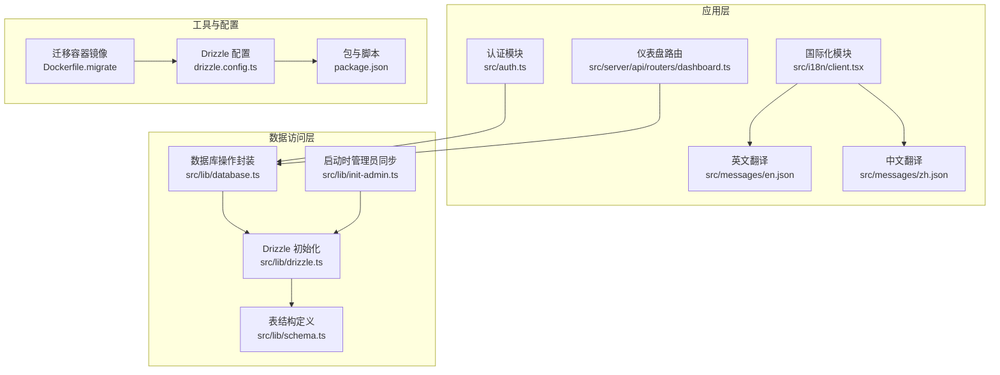
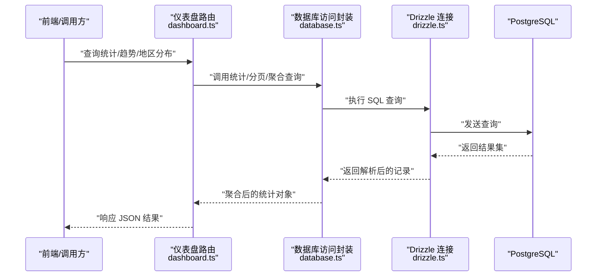
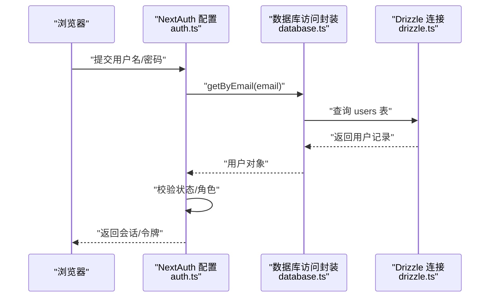
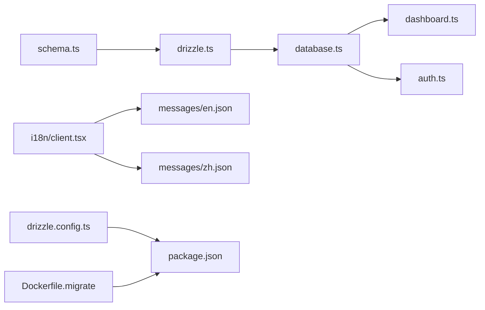
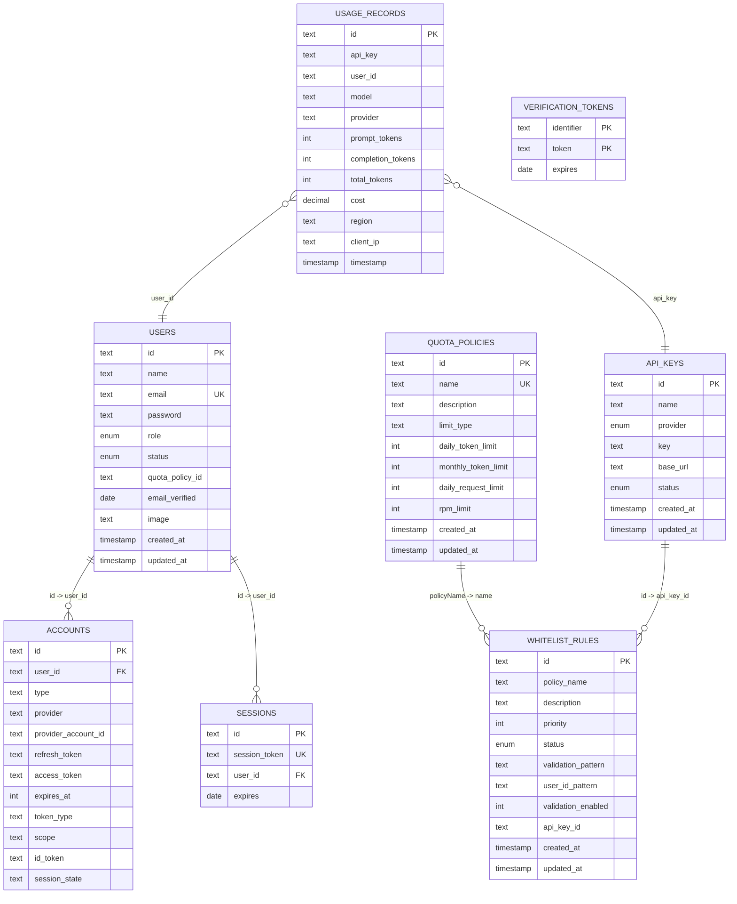

# 数据库设计

<cite>
**本文引用的文件**
- [drizzle.config.ts](file://drizzle.config.ts)
- [schema.ts](file://src/lib/schema.ts)
- [drizzle.ts](file://src/lib/drizzle.ts)
- [database.ts](file://src/lib/database.ts)
- [init-admin.ts](file://src/lib/init-admin.ts)
- [package.json](file://package.json)
- [Dockerfile.migrate](file://Dockerfile.migrate)
- [auth.ts](file://src/auth.ts)
- [dashboard.ts](file://src/server/api/routers/dashboard.ts)
- [en.json](file://src/messages/en.json)
- [zh.json](file://src/messages/zh.json)
- [client.tsx](file://src/i18n/client.tsx)
</cite>

## 更新摘要
**所做更改**
- 移除了国际化专门文档文件的引用和相关内容
- 更新了数据库设计文档以反映项目结构的变化
- 保持数据库架构、表结构和实体关系的核心内容不变
- 维持原有的性能考量、故障排查和结论部分

## 目录
1. [简介](#简介)
2. [项目结构](#项目结构)
3. [核心组件](#核心组件)
4. [架构总览](#架构总览)
5. [详细组件分析](#详细组件分析)
6. [依赖分析](#依赖分析)
7. [性能考量](#性能考量)
8. [故障排查指南](#故障排查指南)
9. [结论](#结论)
10. [附录](#附录)

## 简介
本文件系统化梳理 AIGate 的数据库设计与实现，覆盖架构、表结构、实体关系、字段定义、约束与索引策略、初始化与迁移方案、数据访问模式、查询优化与性能建议等。目标是帮助开发者与运维人员快速理解并高效维护数据库层。

**更新** 本次更新反映了项目结构的变化，移除了对国际化专门文档文件的引用，专注于数据库核心设计内容。

## 项目结构
AIGate 使用 Drizzle ORM + PostgreSQL 作为数据库抽象与存储后端，采用"代码优先"的方式在 schema.ts 中定义表结构，并通过 drizzle.config.ts 配置生成迁移与推送命令。数据库连接在 drizzle.ts 中集中初始化，业务侧通过 database.ts 提供统一的数据访问层封装。

**图表来源**
- [drizzle.config.ts:1-11](file://drizzle.config.ts#L1-L11)
- [schema.ts:1-162](file://src/lib/schema.ts#L1-L162)
- [drizzle.ts:1-12](file://src/lib/drizzle.ts#L1-L12)
- [database.ts:1-850](file://src/lib/database.ts#L1-L850)
- [init-admin.ts:1-71](file://src/lib/init-admin.ts#L1-L71)
- [package.json:1-94](file://package.json#L1-L94)
- [Dockerfile.migrate:1-14](file://Dockerfile.migrate#L1-L14)
- [client.tsx:1-96](file://src/i18n/client.tsx#L1-L96)
- [en.json:1-180](file://src/messages/en.json#L1-L180)
- [zh.json:1-180](file://src/messages/zh.json#L1-L180)

**章节来源**
- [drizzle.config.ts:1-11](file://drizzle.config.ts#L1-L11)
- [schema.ts:1-162](file://src/lib/schema.ts#L1-L162)
- [drizzle.ts:1-12](file://src/lib/drizzle.ts#L1-L12)
- [database.ts:1-850](file://src/lib/database.ts#L1-L850)
- [init-admin.ts:1-71](file://src/lib/init-admin.ts#L1-L71)
- [package.json:1-94](file://package.json#L1-L94)
- [Dockerfile.migrate:1-14](file://Dockerfile.migrate#L1-L14)
- [client.tsx:1-96](file://src/i18n/client.tsx#L1-L96)
- [en.json:1-180](file://src/messages/en.json#L1-L180)
- [zh.json:1-180](file://src/messages/zh.json#L1-L180)

## 核心组件
- 表结构定义：在 schema.ts 中以 Drizzle ORM 的 pgTable 定义各业务表，包含主键、枚举、时间戳、金额等字段，并通过 relations 声明关系。
- 数据库连接：drizzle.ts 将 DATABASE_URL 环境变量注入，创建 postgres 客户端与 drizzle 实例。
- 数据访问封装：database.ts 提供各表的 CRUD 与聚合查询方法，统一处理错误与返回值。
- 初始化与迁移：通过 package.json 的脚本与 drizzle.config.ts 配置，结合 Dockerfile.migrate 在容器内执行推送；init-admin.ts 在应用启动时同步管理员账户。
- 国际化支持：通过 i18n 模块和消息文件提供多语言支持，与数据库层相对独立。

**更新** 新增了国际化模块的相关组件说明，但保持数据库设计的核心内容不变。

**章节来源**
- [schema.ts:1-162](file://src/lib/schema.ts#L1-L162)
- [drizzle.ts:1-12](file://src/lib/drizzle.ts#L1-L12)
- [database.ts:1-850](file://src/lib/database.ts#L1-L850)
- [init-admin.ts:1-71](file://src/lib/init-admin.ts#L1-L71)
- [package.json:1-94](file://package.json#L1-L94)
- [drizzle.config.ts:1-11](file://drizzle.config.ts#L1-L11)
- [Dockerfile.migrate:1-14](file://Dockerfile.migrate#L1-L14)
- [client.tsx:1-96](file://src/i18n/client.tsx#L1-L96)
- [en.json:1-180](file://src/messages/en.json#L1-L180)
- [zh.json:1-180](file://src/messages/zh.json#L1-L180)

## 架构总览
数据库层围绕 schema.ts 的表结构展开，drizzle.ts 统一连接，database.ts 提供 CRUD 与统计查询，dashboard 路由调用统计接口，auth 模块读取用户信息进行认证。国际化模块通过独立的消息文件提供多语言支持。

**图表来源**
- [dashboard.ts:1-454](file://src/server/api/routers/dashboard.ts#L1-L454)
- [database.ts:144-374](file://src/lib/database.ts#L144-L374)
- [drizzle.ts:1-12](file://src/lib/drizzle.ts#L1-L12)

## 详细组件分析

### 表结构与字段定义
以下为各业务表的字段、类型、约束与索引策略概览（基于 schema.ts 的定义）：

- 配额策略表 quota_policies
  - 字段与类型：id（主键）、name（非空）、description、limit_type（默认 token）、daily_token_limit、monthly_token_limit、daily_request_limit、rpm_limit（默认 60）、createdAt/updatedAt（默认当前时间）。
  - 约束：主键 id；limit_type 默认值；rpm_limit 非空默认值。
  - 索引：无显式索引，建议按 name 唯一键与常用查询维度建立索引。
  - 复杂度：插入/更新 O(1)，查询 O(n)（无索引时）。

- API 密钥表 api_keys
  - 字段与类型：id（主键）、name（非空）、provider（枚举）、key（非空）、base_url、status（枚举，默认 ACTIVE）、createdAt/updatedAt。
  - 约束：主键 id；provider/status 枚举；key 唯一性未声明，建议添加唯一索引。
  - 索引：无显式索引，建议对 provider、status 建立复合索引，key 建唯一索引。
  - 复杂度：插入/更新 O(1)，查询 O(n)。

- 用量记录表 usage_records
  - 字段与类型：id（主键）、api_key（非空）、user_id（非空）、model/provider（非空）、prompt_tokens/completion_tokens/total_tokens（非空）、cost（金额，精度 10,6）、region、client_ip、timestamp（默认当前时间）。
  - 约束：主键 id；多字段非空。
  - 索引：无显式索引，建议对 timestamp、user_id、provider、model 建立复合索引以支持统计与分页。
  - 复杂度：插入 O(1)，统计查询 O(n)（无索引时）。

- 用户表 users
  - 字段与类型：id（主键）、name/email/password/role/status（枚举，默认 USER）、quota_policy_id（非空）、email_verified、image、createdAt/updatedAt。
  - 约证：主键 id；email 唯一；role/status 枚举；quota_policy_id 非空。
  - 索引：无显式索引，建议对 email 建唯一索引（已通过唯一约束保障）。
  - 复杂度：插入/更新 O(1)，查询 O(n)。

- 白名单规则表 whitelist_rules
  - 字段与类型：id（主键）、policy_name（非空）、description、priority（默认 1）、status（枚举，默认 active）、validation_pattern、user_id_pattern、validation_enabled（默认 0）、api_key_id、createdAt/updatedAt。
  - 约束：主键 id；status 枚举；priority 非负。
  - 索引：无显式索引，建议对 api_key_id、status、priority 建立复合索引。
  - 复杂度：插入/更新 O(1)，查询 O(n)。

- NextAuth 相关表 accounts/sessions/verification_tokens
  - accounts：外键 user_id 引用 users(id)，级联删除；字段包含 provider、providerAccountId 等。
  - sessions：sessionToken 唯一；外键 user_id 引用 users(id)，级联删除。
  - verification_tokens：复合主键（identifier+token）。
  - 索引：无显式索引，建议对 sessionToken、provider/providerAccountId、identifier/token 建索引。
  - 复杂度：插入/更新 O(1)，查询 O(n)。

- 关系定义
  - whitelist_rules.policyName -> quotaPolicies.name（一对一关系）。
  - accounts.sessions.users：一对多关系（用户-会话）。

**章节来源**
- [schema.ts:28-162](file://src/lib/schema.ts#L28-L162)

### 数据访问模式
- API Key 操作：getAll/getByProvider/getById/create/update/delete。
- 配额策略操作：getAll/getById/create/update/delete。
- 用量记录操作：getAll/getByUserId/getByDateRange/create/getStats（聚合统计）。
- 白名单规则操作：getAll/getById/getByApiKeyId/getByApiKeyIdWithPolicy/create/update/delete/toggleStatus/getActiveRules/matchUserPolicy/validateUserByApiKey/getStats。
- 用户操作：getByEmail/getById/getAdmins/getAll/create/update/updatePassword/delete/deleteAll。

**章节来源**
- [database.ts:19-850](file://src/lib/database.ts#L19-L850)

### 查询优化策略
- 常用过滤字段加索引：usage_records.timestamp、usage_records.user_id、usage_records.provider、usage_records.model；whitelist_rules.api_key_id、status、priority；accounts.providerAccountId；sessions.sessionToken。
- 聚合查询优化：dashboard 路由使用 distinct 计算唯一用户数与 sum 聚合，建议在 timestamp、userId 上建立复合索引以提升性能。
- 分页与排序：按 timestamp 降序查询，建议在 timestamp 建立索引以避免排序成本。
- 正则匹配：白名单规则的 userId 校验在应用层进行，建议对 validation_enabled=1 的规则建立索引以加速筛选。

**章节来源**
- [dashboard.ts:1-454](file://src/server/api/routers/dashboard.ts#L1-L454)
- [database.ts:144-374](file://src/lib/database.ts#L144-L374)

### 数据库初始化与迁移
- 配置：drizzle.config.ts 指定 schema 路径、输出目录、方言与数据库凭据（DATABASE_URL）。
- 推送/生成/迁移脚本：package.json 中提供 db:push、db:generate、db:migrate。
- 容器迁移：Dockerfile.migrate 在容器内安装依赖并执行 pnpm db:push，确保在 CI/CD 环境中自动推送。
- 启动时管理员同步：init-admin.ts 读取环境变量，删除旧管理员并创建新管理员，保证初始数据一致性。

**章节来源**
- [drizzle.config.ts:1-11](file://drizzle.config.ts#L1-L11)
- [package.json:1-94](file://package.json#L1-L94)
- [Dockerfile.migrate:1-14](file://Dockerfile.migrate#L1-L14)
- [init-admin.ts:1-71](file://src/lib/init-admin.ts#L1-L71)

### 认证与用户数据流
- 认证流程：auth.ts 使用 CredentialsProvider 从数据库加载用户，校验状态与角色，返回 JWT 与 Session。
- 用户数据：database.ts 提供 getByEmail/getById 等方法，drizzle.ts 提供统一连接。

**图表来源**
- [auth.ts:1-114](file://src/auth.ts#L1-L114)
- [database.ts:715-726](file://src/lib/database.ts#L715-L726)
- [drizzle.ts:1-12](file://src/lib/drizzle.ts#L1-L12)

## 依赖分析
- Drizzle ORM 与 postgres-js：通过 drizzle.ts 注入 DATABASE_URL，驱动 schema.ts 中的表定义。
- NextAuth Adapter：通过 @auth/drizzle-adapter 与 schema.ts 的 accounts/sessions/verification_tokens 表配合，实现认证持久化。
- 业务路由：dashboard.ts 依赖 database.ts 的统计查询，database.ts 依赖 drizzle.ts 的连接实例。
- 国际化模块：i18n 模块通过消息文件提供多语言支持，与数据库层解耦。

**图表来源**
- [schema.ts:1-162](file://src/lib/schema.ts#L1-L162)
- [drizzle.ts:1-12](file://src/lib/drizzle.ts#L1-L12)
- [database.ts:1-850](file://src/lib/database.ts#L1-L850)
- [dashboard.ts:1-454](file://src/server/api/routers/dashboard.ts#L1-L454)
- [auth.ts:1-114](file://src/auth.ts#L1-L114)
- [client.tsx:1-96](file://src/i18n/client.tsx#L1-L96)
- [en.json:1-180](file://src/messages/en.json#L1-L180)
- [zh.json:1-180](file://src/messages/zh.json#L1-L180)
- [drizzle.config.ts:1-11](file://drizzle.config.ts#L1-L11)
- [package.json:1-94](file://package.json#L1-L94)
- [Dockerfile.migrate:1-14](file://Dockerfile.migrate#L1-L14)

**章节来源**
- [schema.ts:1-162](file://src/lib/schema.ts#L1-L162)
- [drizzle.ts:1-12](file://src/lib/drizzle.ts#L1-L12)
- [database.ts:1-850](file://src/lib/database.ts#L1-L850)
- [dashboard.ts:1-454](file://src/server/api/routers/dashboard.ts#L1-L454)
- [auth.ts:1-114](file://src/auth.ts#L1-L114)
- [client.tsx:1-96](file://src/i18n/client.tsx#L1-L96)
- [en.json:1-180](file://src/messages/en.json#L1-L180)
- [zh.json:1-180](file://src/messages/zh.json#L1-L180)
- [drizzle.config.ts:1-11](file://drizzle.config.ts#L1-L11)
- [package.json:1-94](file://package.json#L1-L94)
- [Dockerfile.migrate:1-14](file://Dockerfile.migrate#L1-L14)

## 性能考量
- 索引策略
  - usage_records：timestamp、user_id、provider、model 建立复合索引；cost 可按需建立索引。
  - whitelist_rules：api_key_id、status、priority 建立复合索引；validation_enabled 建单列索引。
  - accounts/sessions/verification_tokens：分别对 providerAccountId、sessionToken、identifier/token 建索引。
- 聚合查询
  - 使用 distinct 与 sum/count 聚合时，确保相关字段有索引；必要时预计算日汇总表以降低在线查询压力。
- 写入路径
  - usage_records 高频写入，建议批量入库与异步落盘；控制并发与事务粒度。
- 读放大
  - dashboard 路由使用 Promise.all 并行查询多个聚合指标，注意数据库连接池与超时设置。

## 故障排查指南
- 连接问题
  - 检查 DATABASE_URL 是否正确；确认容器内可访问数据库；查看 drizzle.ts 初始化日志。
- 权限与迁移
  - 使用 pnpm db:push 确认 schema 已推送；若失败，检查 drizzle.config.ts 的 schema 路径与 dbCredentials.url。
- 启动时管理员同步
  - 查看 init-admin.ts 输出日志，确认 ADMIN_* 环境变量是否设置；检查删除与插入是否成功。
- 认证失败
  - 查看 auth.ts 日志，确认用户状态与角色；核对 users 表 email 唯一性与密码字段。
- 统计异常
  - dashboard 路由聚合查询失败时，检查 usage_records 的 timestamp 与 userId 字段是否为空；确认索引是否存在。
- 国际化问题
  - 检查 i18n provider 是否正确初始化；确认消息文件路径是否正确；验证本地化键值是否存在。

**章节来源**
- [drizzle.ts:1-12](file://src/lib/drizzle.ts#L1-L12)
- [drizzle.config.ts:1-11](file://drizzle.config.ts#L1-L11)
- [init-admin.ts:1-71](file://src/lib/init-admin.ts#L1-L71)
- [auth.ts:1-114](file://src/auth.ts#L1-L114)
- [dashboard.ts:1-454](file://src/server/api/routers/dashboard.ts#L1-L454)
- [client.tsx:1-96](file://src/i18n/client.tsx#L1-L96)

## 结论
AIGate 的数据库设计以 Drizzle ORM 为核心，采用代码优先的 schema 定义与统一的连接初始化，辅以 database.ts 的数据访问封装与 dashboard 的统计查询。通过合理的索引策略与查询优化，可在高并发场景下保持稳定性能。国际化模块通过独立的消息文件提供多语言支持，与数据库层解耦。建议后续完善索引、引入分区与物化视图，并加强监控与告警机制。

## 附录

### 表关系图

**图表来源**
- [schema.ts:28-162](file://src/lib/schema.ts#L28-L162)