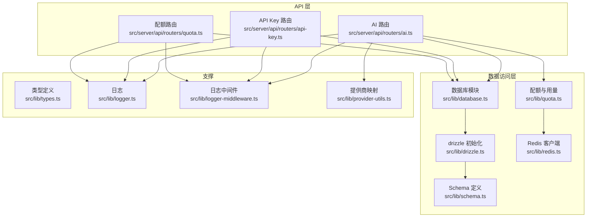
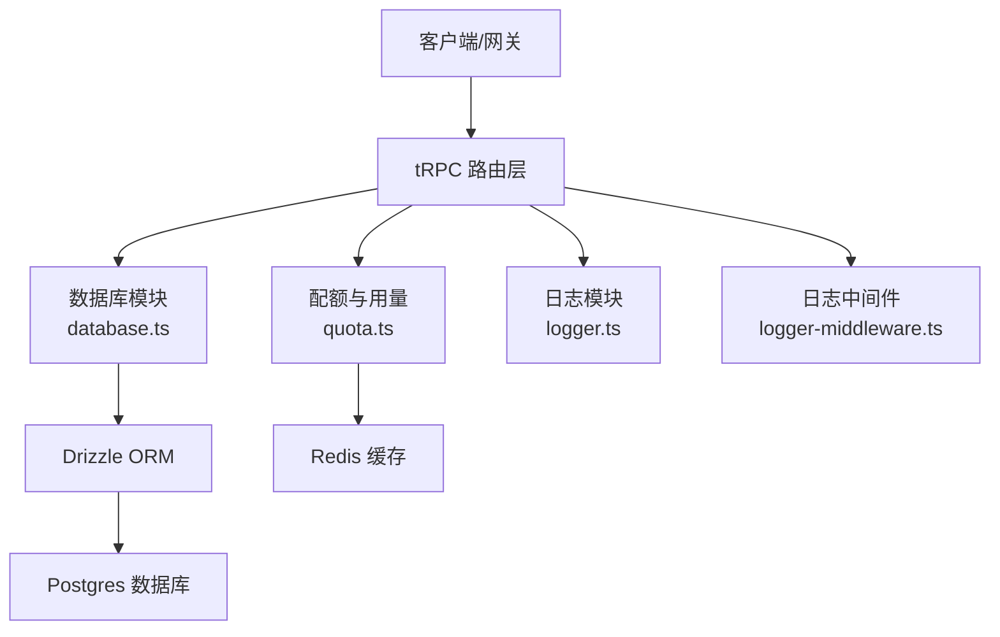
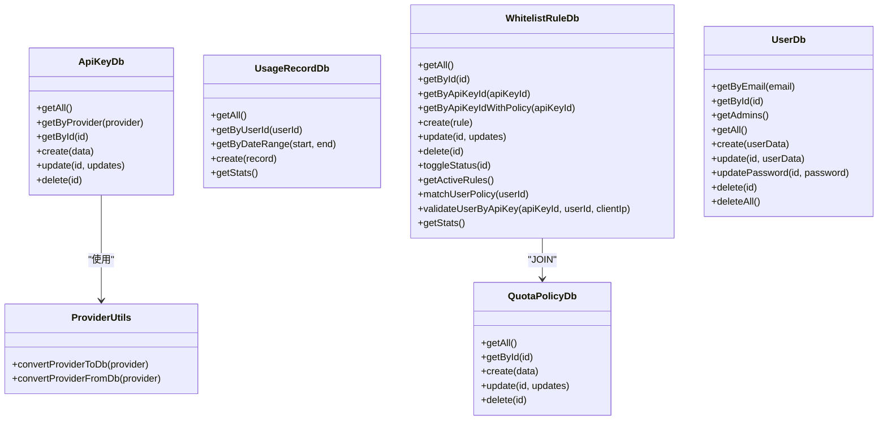
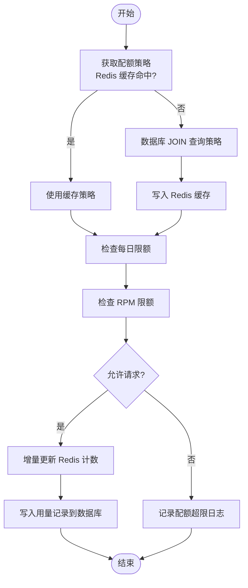
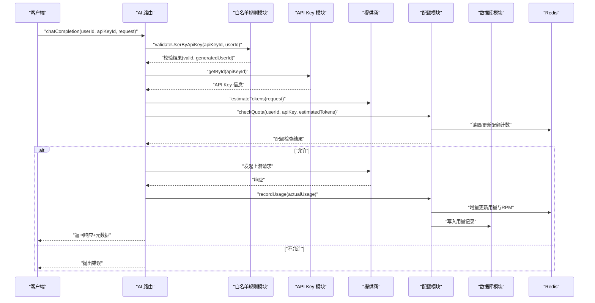
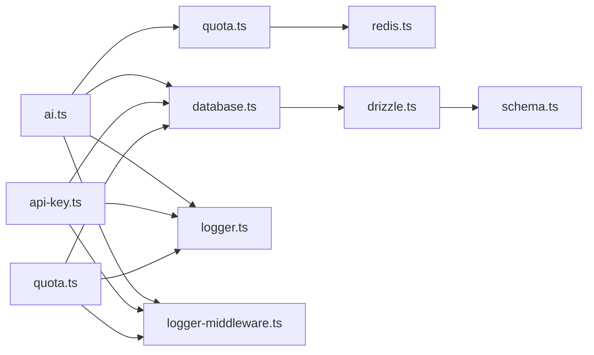

# 数据访问模式

<cite>
**本文引用的文件**
- [src/lib/database.ts](file://src/lib/database.ts)
- [src/lib/drizzle.ts](file://src/lib/drizzle.ts)
- [src/lib/schema.ts](file://src/lib/schema.ts)
- [drizzle.config.ts](file://drizzle.config.ts)
- [src/lib/redis.ts](file://src/lib/redis.ts)
- [src/lib/quota.ts](file://src/lib/quota.ts)
- [src/lib/provider-utils.ts](file://src/lib/provider-utils.ts)
- [src/server/api/routers/ai.ts](file://src/server/api/routers/ai.ts)
- [src/server/api/routers/api-key.ts](file://src/server/api/routers/api-key.ts)
- [src/server/api/routers/quota.ts](file://src/server/api/routers/quota.ts)
- [src/lib/logger.ts](file://src/lib/logger.ts)
- [src/lib/logger-middleware.ts](file://src/lib/logger-middleware.ts)
- [src/lib/types.ts](file://src/lib/types.ts)
</cite>

## 目录
1. [引言](#引言)
2. [项目结构](#项目结构)
3. [核心组件](#核心组件)
4. [架构总览](#架构总览)
5. [详细组件分析](#详细组件分析)
6. [依赖关系分析](#依赖关系分析)
7. [性能考虑](#性能考虑)
8. [故障排查指南](#故障排查指南)
9. [结论](#结论)
10. [附录](#附录)

## 引言
本文件系统性梳理 AIGate 的数据访问层设计与实现，覆盖以下主题：
- 数据访问层设计模式：以“领域模块 + 数据库适配层 + 缓存层”的三层组合，结合 Drizzle ORM 的类型安全查询与 Redis 的高性能缓存。
- 查询优化策略：利用索引友好的字段、聚合查询并行化、缓存键空间设计与 TTL 策略。
- 事务管理机制：当前实现未显式使用事务，采用幂等写入与缓存一致性策略保障数据最终一致。
- CRUD 与复杂查询：统一的 CRUD 模块化封装；复杂统计与跨表关联查询通过 JOIN 与并行查询实现。
- 批量与复杂查询：通过 Promise.all 并行聚合统计，减少往返延迟。
- 缓存与连接池：Redis 作为热点数据缓存，Postgres 客户端连接池由底层驱动管理；Drizzle 初始化时关闭预编译以适配事务模式。
- 并发控制：基于 Redis 的原子计数与过期策略实现速率限制与配额控制。
- 性能优化与异常恢复：日志埋点、降级策略、错误分类与恢复建议。

## 项目结构
数据访问相关的核心目录与文件如下：
- 数据库初始化与适配：drizzle 初始化、数据库连接、Schema 定义
- 数据访问模块：各实体的 CRUD 封装
- 缓存模块：Redis 客户端与键空间设计
- 业务逻辑：配额策略、用量记录、白名单规则校验
- API 层：调用数据访问模块，组织请求处理流程

**图表来源**
- [src/lib/drizzle.ts](file://src/lib/drizzle.ts#L1-L12)
- [src/lib/schema.ts](file://src/lib/schema.ts#L1-L162)
- [src/lib/database.ts](file://src/lib/database.ts#L1-L692)
- [src/lib/redis.ts](file://src/lib/redis.ts#L1-L43)
- [src/lib/quota.ts](file://src/lib/quota.ts#L1-L327)
- [src/server/api/routers/ai.ts](file://src/server/api/routers/ai.ts#L1-L301)
- [src/server/api/routers/api-key.ts](file://src/server/api/routers/api-key.ts#L1-L377)
- [src/server/api/routers/quota.ts](file://src/server/api/routers/quota.ts#L1-L221)
- [src/lib/logger.ts](file://src/lib/logger.ts#L1-L184)
- [src/lib/logger-middleware.ts](file://src/lib/logger-middleware.ts#L43-L99)
- [src/lib/provider-utils.ts](file://src/lib/provider-utils.ts#L1-L27)

**章节来源**
- [src/lib/drizzle.ts](file://src/lib/drizzle.ts#L1-L12)
- [src/lib/schema.ts](file://src/lib/schema.ts#L1-L162)
- [src/lib/database.ts](file://src/lib/database.ts#L1-L692)
- [src/lib/redis.ts](file://src/lib/redis.ts#L1-L43)
- [src/lib/quota.ts](file://src/lib/quota.ts#L1-L327)
- [src/server/api/routers/ai.ts](file://src/server/api/routers/ai.ts#L1-L301)
- [src/server/api/routers/api-key.ts](file://src/server/api/routers/api-key.ts#L1-L377)
- [src/server/api/routers/quota.ts](file://src/server/api/routers/quota.ts#L1-L221)
- [src/lib/logger.ts](file://src/lib/logger.ts#L1-L184)
- [src/lib/logger-middleware.ts](file://src/lib/logger-middleware.ts#L43-L99)
- [src/lib/provider-utils.ts](file://src/lib/provider-utils.ts#L1-L27)

## 核心组件
- 数据库适配层（Drizzle）
  - 初始化 Postgres 客户端，禁用预编译以适配事务模式，绑定 Schema。
  - 提供类型安全的查询入口 db。
- Schema 定义
  - 定义枚举、表结构与关系，涵盖 API Key、配额策略、用量记录、用户、白名单规则及 NextAuth 表。
- 数据库模块（database.ts）
  - 为每个实体提供统一 CRUD 接口，包含条件查询、聚合统计、复杂关联查询。
  - 提供白名单规则匹配与用户校验逻辑。
- 缓存模块（redis.ts）
  - Redis 客户端与键空间命名规范，覆盖用户配额、请求次数、RPM、策略缓存等。
- 配额与用量（quota.ts）
  - 基于 Redis 的配额检查、用量记录、每日统计与重置。
  - 与数据库模块协作，保证最终一致性。
- API 路由
  - AI 路由：校验白名单、估算 Token、配额检查、用量记录、返回元数据。
  - API Key 路由：提供 CRUD、状态切换、使用统计。
  - 配额路由：策略 CRUD、用户用量查询与重置。

**章节来源**
- [src/lib/drizzle.ts](file://src/lib/drizzle.ts#L1-L12)
- [src/lib/schema.ts](file://src/lib/schema.ts#L1-L162)
- [src/lib/database.ts](file://src/lib/database.ts#L1-L692)
- [src/lib/redis.ts](file://src/lib/redis.ts#L1-L43)
- [src/lib/quota.ts](file://src/lib/quota.ts#L1-L327)
- [src/server/api/routers/ai.ts](file://src/server/api/routers/ai.ts#L1-L301)
- [src/server/api/routers/api-key.ts](file://src/server/api/routers/api-key.ts#L1-L377)
- [src/server/api/routers/quota.ts](file://src/server/api/routers/quota.ts#L1-L221)

## 架构总览
数据访问层采用“ORM + 缓存 + 路由编排”的分层架构：
- ORM 层：Drizzle 提供类型安全查询与 SQL 构建。
- 缓存层：Redis 提供高并发读写与 TTL 管理。
- 业务层：路由层负责参数校验、白名单校验、配额检查与用量记录。
- 日志与监控：统一日志模块与中间件埋点，便于追踪与排障。

**图表来源**
- [src/server/api/routers/ai.ts](file://src/server/api/routers/ai.ts#L1-L301)
- [src/server/api/routers/api-key.ts](file://src/server/api/routers/api-key.ts#L1-L377)
- [src/server/api/routers/quota.ts](file://src/server/api/routers/quota.ts#L1-L221)
- [src/lib/database.ts](file://src/lib/database.ts#L1-L692)
- [src/lib/quota.ts](file://src/lib/quota.ts#L1-L327)
- [src/lib/drizzle.ts](file://src/lib/drizzle.ts#L1-L12)
- [src/lib/redis.ts](file://src/lib/redis.ts#L1-L43)
- [src/lib/logger.ts](file://src/lib/logger.ts#L1-L184)
- [src/lib/logger-middleware.ts](file://src/lib/logger-middleware.ts#L43-L99)

## 详细组件分析

### 数据库适配层（Drizzle）
- 初始化要点
  - 从环境变量读取 DATABASE_URL。
  - 禁用预编译以适配事务模式。
  - 绑定 schema，确保类型安全。
- 设计影响
  - 类型推断强，减少运行时错误。
  - 与迁移工具 drizzle-kit 配合，schema 与迁移输出路径在配置文件中定义。

**章节来源**
- [src/lib/drizzle.ts](file://src/lib/drizzle.ts#L1-L12)
- [drizzle.config.ts](file://drizzle.config.ts#L1-L11)

### Schema 定义（类型与关系）
- 枚举与表结构
  - 角色、状态、提供商、白名单状态、限制类型等枚举。
  - API Key、配额策略、用量记录、用户、白名单规则、NextAuth 相关表。
- 关系定义
  - 白名单规则与配额策略通过名称建立一对一关系。
- 类型导出
  - 为 ORM 查询结果与插入对象提供类型别名，便于上层使用。

**章节来源**
- [src/lib/schema.ts](file://src/lib/schema.ts#L1-L162)

### 数据库模块（CRUD 与复杂查询）
- API Key 模块
  - 支持按提供商筛选、按 ID 查询、创建、更新、删除。
- 配额策略模块
  - 支持按 ID 查询、创建、更新、删除。
- 用量记录模块
  - 支持按用户、按日期范围查询，并提供聚合统计（总用户数、今日请求、今日 Token、总请求、活跃用户）。
  - 统计查询通过 Promise.all 并行执行，降低延迟。
- 白名单规则模块
  - 支持按 ID、按 API Key ID 查询，以及与配额策略的内连接查询。
  - 提供规则状态切换、获取有效规则、按用户匹配策略、按 API Key 与用户进行校验（含正则与占位符替换）。
- 用户模块
  - 支持按邮箱、ID 查询，管理员查询，创建、更新、更新密码、删除、批量删除。
- 活跃 API Key 获取
  - 根据提供商获取 ACTIVE 状态的密钥。

**图表来源**
- [src/lib/database.ts](file://src/lib/database.ts#L1-L692)
- [src/lib/provider-utils.ts](file://src/lib/provider-utils.ts#L1-L27)

**章节来源**
- [src/lib/database.ts](file://src/lib/database.ts#L1-L692)
- [src/lib/provider-utils.ts](file://src/lib/provider-utils.ts#L1-L27)

### 缓存层（Redis）
- 客户端初始化
  - 从环境变量读取 REDIS_URL，连接失败时记录错误。
- 键空间设计
  - 用户每日配额、用户每日请求次数、用户每分钟请求次数、用户策略缓存、API Key 配置缓存、请求日志等。
- 使用场景
  - 配额检查与用量累加、RPM 限制、策略缓存、请求日志落盘。

**章节来源**
- [src/lib/redis.ts](file://src/lib/redis.ts#L1-L43)

### 配额与用量（quota.ts）
- 策略获取
  - 优先从 Redis 缓存命中；未命中则通过数据库 JOIN 获取策略并缓存。
- 配额检查
  - 支持 Token 与请求次数两种模式；均检查每日限额与 RPM 限额。
  - 计算剩余配额并记录日志。
- 用量记录
  - 增量更新 Redis 中的当日用量与 RPM；同时写入数据库用量记录。
- 统计与重置
  - 提供每日用量查询与重置接口。
- 日志与异常
  - 对异常进行分类记录，便于定位问题。

**图表来源**
- [src/lib/quota.ts](file://src/lib/quota.ts#L1-L327)
- [src/lib/redis.ts](file://src/lib/redis.ts#L1-L43)
- [src/lib/database.ts](file://src/lib/database.ts#L1-L692)

**章节来源**
- [src/lib/quota.ts](file://src/lib/quota.ts#L1-L327)
- [src/lib/redis.ts](file://src/lib/redis.ts#L1-L43)

### API 路由（调用链与流程）
- AI 路由
  - 校验白名单规则与 API Key 状态。
  - 估算 Token，执行配额检查。
  - 非流式请求：发起上游请求，记录用量并返回元数据。
- API Key 路由
  - 提供 CRUD、状态切换、使用统计（最近7天用量、每日汇总）。
- 配额路由
  - 提供策略 CRUD、用户用量查询与重置；更新/删除策略后清理今日缓存。

**图表来源**
- [src/server/api/routers/ai.ts](file://src/server/api/routers/ai.ts#L1-L301)
- [src/lib/database.ts](file://src/lib/database.ts#L1-L692)
- [src/lib/quota.ts](file://src/lib/quota.ts#L1-L327)
- [src/lib/redis.ts](file://src/lib/redis.ts#L1-L43)

**章节来源**
- [src/server/api/routers/ai.ts](file://src/server/api/routers/ai.ts#L1-L301)
- [src/server/api/routers/api-key.ts](file://src/server/api/routers/api-key.ts#L1-L377)
- [src/server/api/routers/quota.ts](file://src/server/api/routers/quota.ts#L1-L221)

## 依赖关系分析
- 组件耦合
  - 路由层仅依赖数据库模块与配额模块，职责清晰。
  - 数据库模块依赖 Drizzle 与 Schema，提供统一 CRUD。
  - 配额模块依赖 Redis 与数据库模块，形成“缓存 + 数据库”的双写策略。
- 外部依赖
  - Postgres 与 Redis 通过环境变量配置。
  - Drizzle 与 drizzle-kit 用于 ORM 与迁移。
- 循环依赖
  - 未发现循环依赖；模块间单向依赖。

**图表来源**
- [src/server/api/routers/ai.ts](file://src/server/api/routers/ai.ts#L1-L301)
- [src/server/api/routers/api-key.ts](file://src/server/api/routers/api-key.ts#L1-L377)
- [src/server/api/routers/quota.ts](file://src/server/api/routers/quota.ts#L1-L221)
- [src/lib/database.ts](file://src/lib/database.ts#L1-L692)
- [src/lib/quota.ts](file://src/lib/quota.ts#L1-L327)
- [src/lib/redis.ts](file://src/lib/redis.ts#L1-L43)
- [src/lib/drizzle.ts](file://src/lib/drizzle.ts#L1-L12)
- [src/lib/schema.ts](file://src/lib/schema.ts#L1-L162)
- [src/lib/logger.ts](file://src/lib/logger.ts#L1-L184)
- [src/lib/logger-middleware.ts](file://src/lib/logger-middleware.ts#L43-L99)

**章节来源**
- [src/server/api/routers/ai.ts](file://src/server/api/routers/ai.ts#L1-L301)
- [src/server/api/routers/api-key.ts](file://src/server/api/routers/api-key.ts#L1-L377)
- [src/server/api/routers/quota.ts](file://src/server/api/routers/quota.ts#L1-L221)
- [src/lib/database.ts](file://src/lib/database.ts#L1-L692)
- [src/lib/quota.ts](file://src/lib/quota.ts#L1-L327)
- [src/lib/redis.ts](file://src/lib/redis.ts#L1-L43)
- [src/lib/drizzle.ts](file://src/lib/drizzle.ts#L1-L12)
- [src/lib/schema.ts](file://src/lib/schema.ts#L1-L162)
- [src/lib/logger.ts](file://src/lib/logger.ts#L1-L184)
- [src/lib/logger-middleware.ts](file://src/lib/logger-middleware.ts#L43-L99)

## 性能考虑
- 查询优化
  - 使用 Promise.all 并行执行聚合统计，减少往返时间。
  - WHERE 条件尽量使用索引友好字段（如主键、枚举、时间戳）。
- 缓存策略
  - Redis 缓存策略与用量键设置合理 TTL，避免长期占用内存。
  - RPM 与每日用量键设置短期过期，保证时效性。
- 连接池与并发
  - Postgres 客户端连接池由底层驱动管理；Drizzle 初始化关闭预编译以适配事务模式。
- 写入一致性
  - 先写 Redis，再写数据库；若 Redis 成功而数据库失败，可通过重放或补偿机制修复。
- 日志与可观测性
  - 统一日志格式与级别，生产环境按日期轮转，便于问题回溯。

[本节为通用性能建议，不直接分析具体文件]

## 故障排查指南
- 数据库错误
  - 数据库模块对每个操作都包裹 try/catch 并记录错误，必要时返回空值或抛出异常。
  - 建议：关注日志中的错误堆栈，定位具体查询与参数。
- Redis 错误
  - Redis 客户端连接失败会记录错误；缓存失败不应阻塞主流程。
  - 建议：检查 REDIS_URL、网络连通性与键空间命名一致性。
- 配额检查失败
  - 配额模块对异常进行捕获并返回失败结果；同时记录详细上下文。
  - 建议：核对策略配置、用户标识与 API Key 绑定关系。
- 日志与中间件
  - 日志中间件统一记录操作耗时与上下文；日志模块按级别与文件轮转。
  - 建议：开发环境开启 debug 级别，生产环境关注 error 与 warn。

**章节来源**
- [src/lib/database.ts](file://src/lib/database.ts#L1-L692)
- [src/lib/redis.ts](file://src/lib/redis.ts#L1-L43)
- [src/lib/quota.ts](file://src/lib/quota.ts#L1-L327)
- [src/lib/logger.ts](file://src/lib/logger.ts#L1-L184)
- [src/lib/logger-middleware.ts](file://src/lib/logger-middleware.ts#L43-L99)

## 结论
AIGate 的数据访问层通过“Drizzle ORM + Redis 缓存 + tRPC 路由”的组合，实现了类型安全、高性能与可维护性的平衡。核心特性包括：
- 统一的 CRUD 封装与复杂查询能力；
- 基于 Redis 的高效配额与用量控制；
- 并行聚合统计与合理的 TTL 策略；
- 完善的日志与中间件埋点，便于问题定位与性能分析。

建议后续可引入：
- 显式事务用于强一致场景；
- 更细粒度的缓存失效策略；
- 配额与用量的异步补偿任务。

[本节为总结性内容，不直接分析具体文件]

## 附录
- 类型定义
  - 配额策略、API Key、用户、用量记录、配额检查结果、聊天补全请求/响应等类型均在类型文件中定义，便于上层严格约束。
- 迁移配置
  - drizzle-kit 配置指向 schema 与输出目录，便于生成与推送迁移。

**章节来源**
- [src/lib/types.ts](file://src/lib/types.ts#L1-L118)
- [drizzle.config.ts](file://drizzle.config.ts#L1-L11)