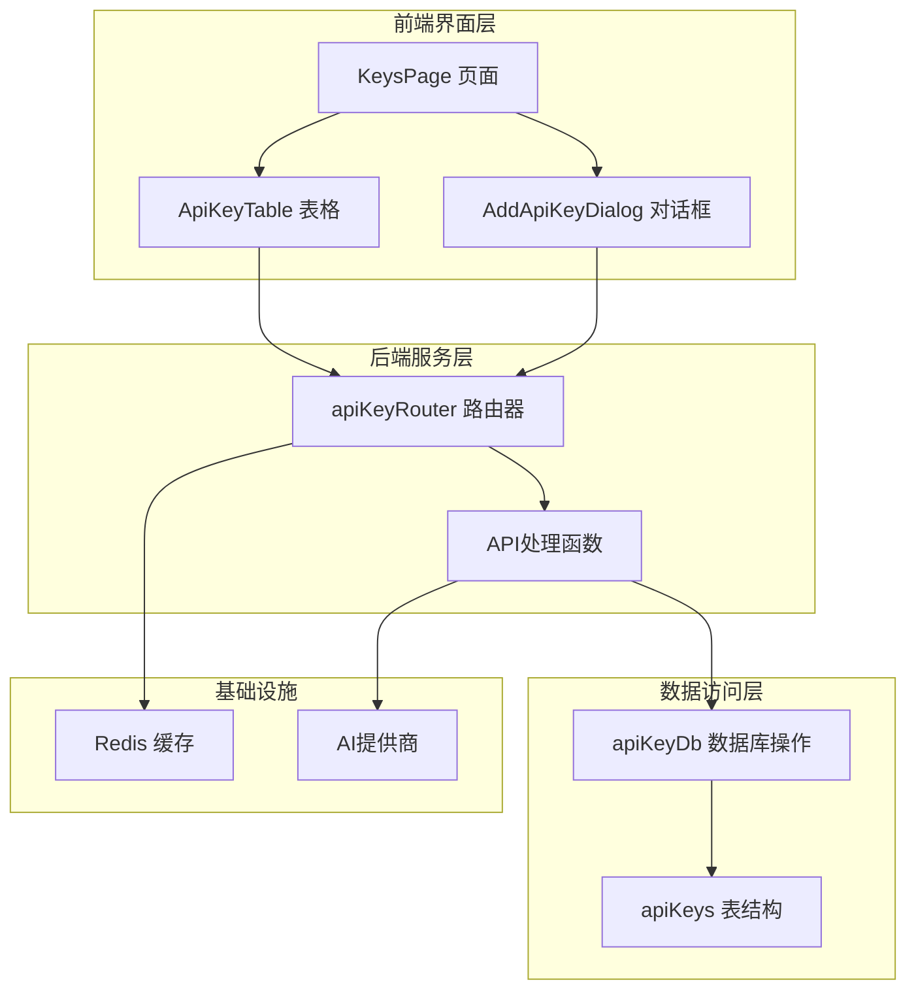
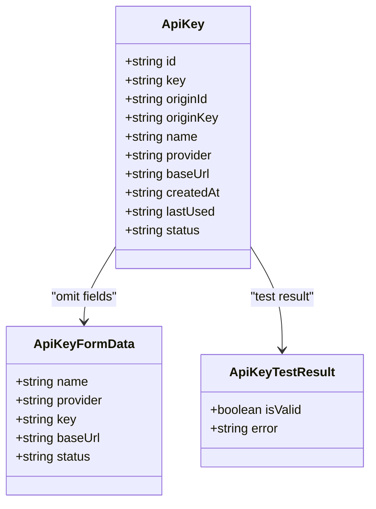
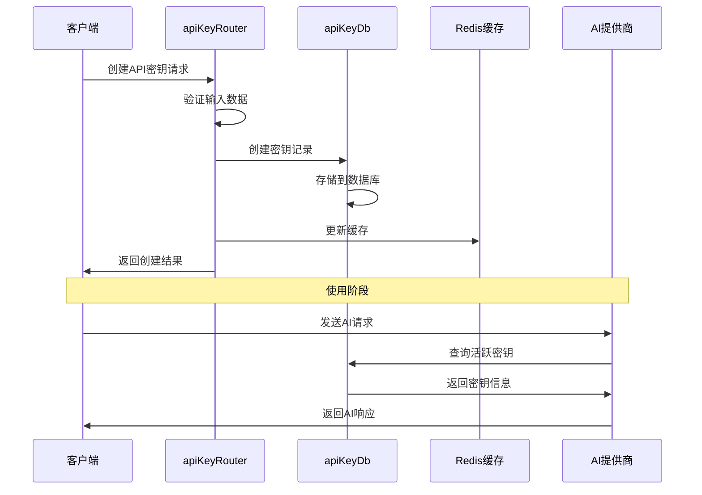
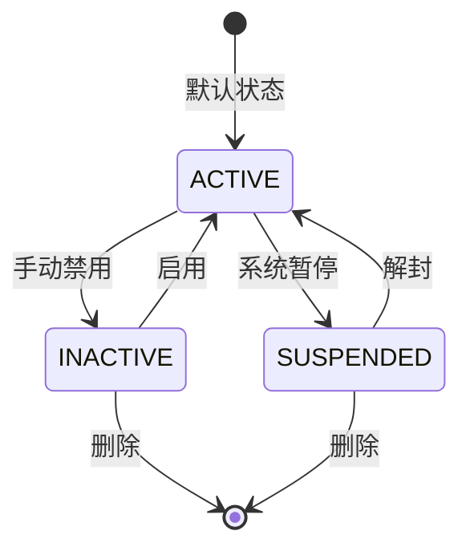
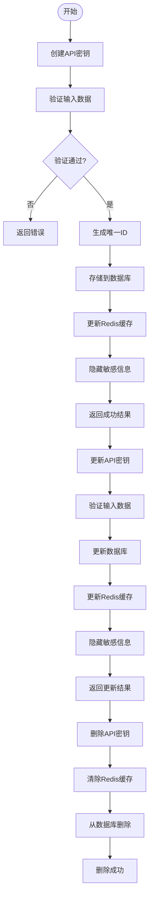
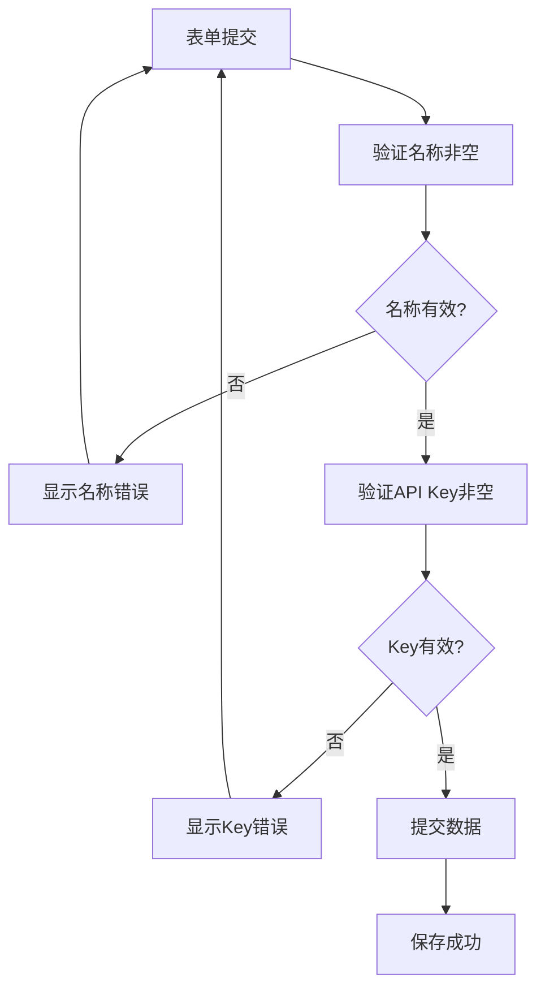
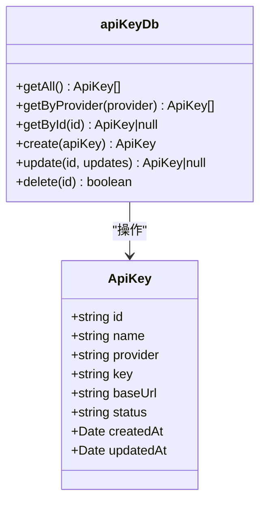
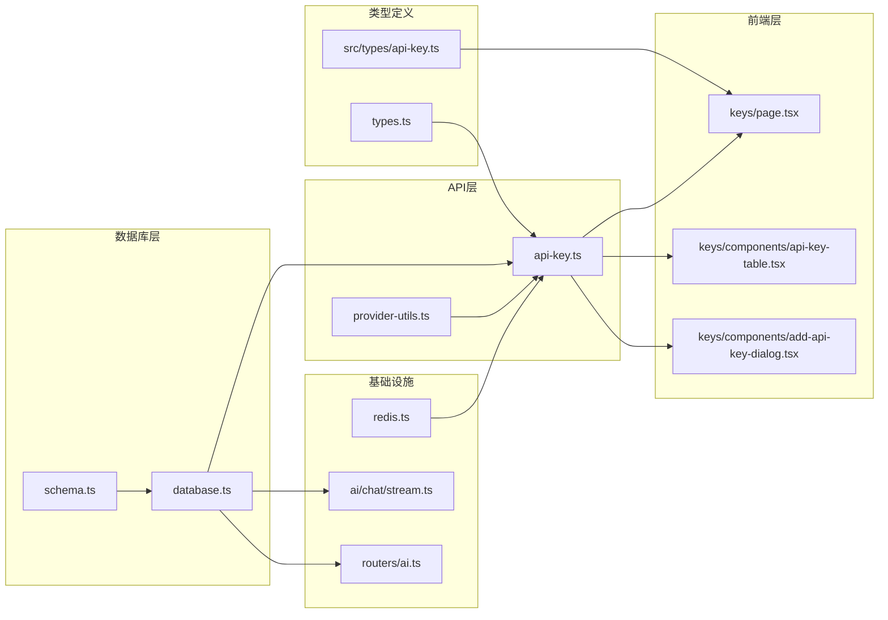
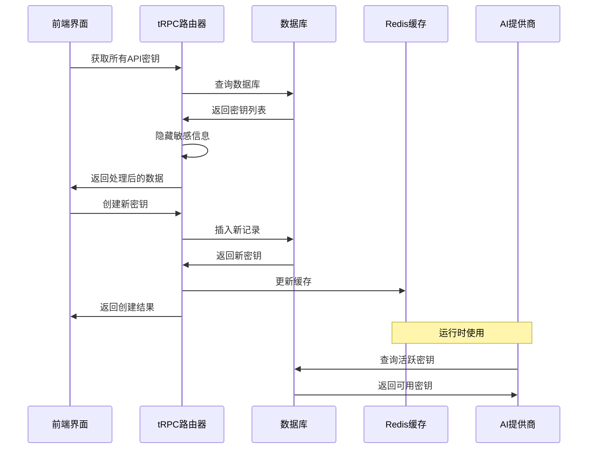

# API密钥实体模型

<cite>
**本文档引用的文件**
- [src/types/api-key.ts](file://src/types/api-key.ts)
- [src/lib/schema.ts](file://src/lib/schema.ts)
- [src/server/api/routers/api-key.ts](file://src/server/api/routers/api-key.ts)
- [src/app/(dashboard)/keys/page.tsx](file://src/app/(dashboard)/keys/page.tsx)
- [src/app/(dashboard)/keys/components/api-key-table.tsx](file://src/app/(dashboard)/keys/components/api-key-table.tsx)
- [src/app/(dashboard)/keys/components/add-api-key-dialog.tsx](file://src/app/(dashboard)/keys/components/add-api-key-dialog.tsx)
- [src/lib/types.ts](file://src/lib/types.ts)
- [src/lib/database.ts](file://src/lib/database.ts)
- [src/lib/redis.ts](file://src/lib/redis.ts)
- [src/lib/provider-utils.ts](file://src/lib/provider-utils.ts)
- [src/pages/api/ai/chat/stream.ts](file://src/pages/api/ai/chat/stream.ts)
- [src/server/api/routers/ai.ts](file://src/server/api/routers/ai.ts)
</cite>

## 目录
1. [简介](#简介)
2. [项目结构](#项目结构)
3. [核心组件](#核心组件)
4. [架构概览](#架构概览)
5. [详细组件分析](#详细组件分析)
6. [依赖关系分析](#依赖关系分析)
7. [性能考虑](#性能考虑)
8. [故障排除指南](#故障排除指南)
9. [结论](#结论)

## 简介

本文档详细描述了AIGate项目中的API密钥实体模型，包括数据库表结构、前端类型定义、业务逻辑实现以及完整的API密钥管理功能。API密钥是连接AI服务提供商（OpenAI、Anthropic、Google、DeepSeek、Moonshot、Spark）与系统用户的关键凭证，支持多提供商集成、自定义基础URL配置和灵活的状态管理。

## 项目结构

API密钥功能涉及多个层次的组件协作：

**图表来源**
- [src/app/(dashboard)/keys/page.tsx](file://src/app/(dashboard)/keys/page.tsx#L1-L194)
- [src/server/api/routers/api-key.ts](file://src/server/api/routers/api-key.ts#L68-L376)
- [src/lib/database.ts](file://src/lib/database.ts#L20-L81)

## 核心组件

### 数据库表结构

API密钥表采用PostgreSQL设计，具有以下关键特性：

| 字段名 | 数据类型 | 约束条件 | 描述 |
|--------|----------|----------|------|
| id | text | PRIMARY KEY | API密钥唯一标识符 |
| name | text | NOT NULL | 密钥显示名称 |
| provider | enum | NOT NULL, DEFAULT 'OPENAI' | AI服务提供商 |
| key | text | NOT NULL | 实际的API密钥值 |
| base_url | text | NULL | 自定义基础URL（可选） |
| status | enum | NOT NULL, DEFAULT 'ACTIVE' | 密钥状态 |
| created_at | timestamp | NOT NULL, DEFAULT NOW() | 创建时间 |
| updated_at | timestamp | NOT NULL, DEFAULT NOW() | 更新时间 |

**章节来源**
- [src/lib/schema.ts](file://src/lib/schema.ts#L42-L52)

### 前端类型定义

**图表来源**
- [src/types/api-key.ts](file://src/types/api-key.ts#L2-L20)
- [src/lib/types.ts](file://src/lib/types.ts#L19-L31)

**章节来源**
- [src/types/api-key.ts](file://src/types/api-key.ts#L1-L21)
- [src/lib/types.ts](file://src/lib/types.ts#L19-L31)

## 架构概览

API密钥管理系统采用分层架构设计，实现了完整的CRUD操作和状态管理：

**图表来源**
- [src/server/api/routers/api-key.ts](file://src/server/api/routers/api-key.ts#L132-L175)
- [src/lib/database.ts](file://src/lib/database.ts#L52-L55)
- [src/lib/redis.ts](file://src/lib/redis.ts#L34-L35)

## 详细组件分析

### 支持的AI服务提供商

系统支持以下六种AI服务提供商：

| 提供商代码 | 显示名称 | 常用模型 | 基础URL示例 |
|------------|----------|----------|-------------|
| openai | OpenAI | gpt-4o, gpt-4o-mini | https://api.openai.com/v1 |
| anthropic | Anthropic | claude-3-opus, claude-3-sonnet | https://api.anthropic.com |
| google | Google | gemini-pro, gemini-ultra | https://generativelanguage.googleapis.com/v1beta |
| deepseek | DeepSeek | deepseek-chat, deepseek-coder | https://api.deepseek.com/v1 |
| moonshot | Moonshot | moonshot-v1-8k, moonshot-v1-32k | https://api.moonshot.cn/v1 |
| spark | 星火大模型 | spark-v3.5 | https://spark-api.xf-yun.com/v1 |

**章节来源**
- [src/app/(dashboard)/keys/components/add-api-key-dialog.tsx](file://src/app/(dashboard)/keys/components/add-api-key-dialog.tsx#L121-L155)
- [src/lib/schema.ts](file://src/lib/schema.ts#L15-L22)

### 状态枚举定义

API密钥状态采用三层状态管理：

**图表来源**
- [src/lib/schema.ts](file://src/lib/schema.ts#L14-L14)

**章节来源**
- [src/server/api/routers/api-key.ts](file://src/server/api/routers/api-key.ts#L48-L66)

### API密钥管理功能

#### CRUD操作流程

**图表来源**
- [src/server/api/routers/api-key.ts](file://src/server/api/routers/api-key.ts#L132-L270)

**章节来源**
- [src/server/api/routers/api-key.ts](file://src/server/api/routers/api-key.ts#L68-L376)

### 前端用户界面

#### API密钥表格组件

API密钥表格提供了完整的管理界面：

| 列字段 | 显示内容 | 功能特性 |
|--------|----------|----------|
| name | 密钥名称 | 只读显示 |
| provider | 服务商 | 下拉选择 |
| apiKeyId | API Key Id | 复制功能 |
| key | API Key | 密码显示/隐藏 |
| baseUrl | Base URL | 可选自定义 |
| createdAt | 创建时间 | 格式化显示 |
| lastUsed | 最后使用 | 空值显示'-' |
| status | 状态 | 活跃/禁用标签 |
| actions | 操作按钮 | 测试、启用/禁用、编辑、删除 |

**章节来源**
- [src/app/(dashboard)/keys/components/api-key-table.tsx](file://src/app/(dashboard)/keys/components/api-key-table.tsx#L29-L174)

#### 添加/编辑对话框

添加API密钥对话框包含以下验证机制：

**图表来源**
- [src/app/(dashboard)/keys/components/add-api-key-dialog.tsx](file://src/app/(dashboard)/keys/components/add-api-key-dialog.tsx#L91-L111)

**章节来源**
- [src/app/(dashboard)/keys/components/add-api-key-dialog.tsx](file://src/app/(dashboard)/keys/components/add-api-key-dialog.tsx#L39-L273)

### 数据库操作实现

#### API密钥数据库接口

**图表来源**
- [src/lib/database.ts](file://src/lib/database.ts#L20-L81)

**章节来源**
- [src/lib/database.ts](file://src/lib/database.ts#L20-L81)

### 缓存策略

系统使用Redis实现API密钥缓存，提高查询性能：

| 缓存键格式 | 用途 | 过期时间 | 示例 |
|------------|------|----------|------|
| api_keys:openai | OpenAI密钥缓存 | 1小时 | api_keys:openai |
| api_keys:anthropic | Anthropic密钥缓存 | 1小时 | api_keys:anthropic |
| api_keys:google | Google密钥缓存 | 1小时 | api_keys:google |
| api_keys:deepseek | DeepSeek密钥缓存 | 1小时 | api_keys:deepseek |
| api_keys:moonshot | Moonshot密钥缓存 | 1小时 | api_keys:moonshot |
| api_keys:spark | Spark密钥缓存 | 1小时 | api_keys:spark |

**章节来源**
- [src/lib/redis.ts](file://src/lib/redis.ts#L18-L42)
- [src/server/api/routers/api-key.ts](file://src/server/api/routers/api-key.ts#L150-L156)

## 依赖关系分析

### 组件间依赖关系

**图表来源**
- [src/lib/types.ts](file://src/lib/types.ts#L19-L31)
- [src/lib/schema.ts](file://src/lib/schema.ts#L42-L52)
- [src/server/api/routers/api-key.ts](file://src/server/api/routers/api-key.ts#L1-L8)

**章节来源**
- [src/server/api/routers/api-key.ts](file://src/server/api/routers/api-key.ts#L1-L8)

### 数据流分析

**图表来源**
- [src/app/(dashboard)/keys/page.tsx](file://src/app/(dashboard)/keys/page.tsx#L15-L15)
- [src/server/api/routers/api-key.ts](file://src/server/api/routers/api-key.ts#L70-L95)

## 性能考虑

### 缓存优化策略

1. **Redis缓存层**：API密钥按提供商分类缓存，1小时过期时间平衡性能和数据一致性
2. **批量查询**：支持按提供商批量获取密钥，减少数据库查询次数
3. **数据掩码**：前端只显示部分敏感信息，保护密钥安全

### 数据库优化

1. **索引设计**：在provider和status字段上建立索引，优化查询性能
2. **连接池**：Drizzle ORM提供连接池管理，提高并发性能
3. **事务处理**：关键操作使用事务保证数据一致性

## 故障排除指南

### 常见问题及解决方案

| 问题类型 | 症状 | 可能原因 | 解决方案 |
|----------|------|----------|----------|
| 密钥验证失败 | API调用返回401错误 | 密钥格式错误或过期 | 检查密钥格式和有效期 |
| 提供商不支持 | 返回"不支持的提供商"错误 | 提供商代码不正确 | 确认提供商枚举值 |
| 缓存同步问题 | 新创建的密钥无法立即使用 | Redis缓存未更新 | 等待缓存过期或手动刷新 |
| 权限不足 | 403 Forbidden错误 | 用户权限不足 | 检查用户角色和权限设置 |

**章节来源**
- [src/server/api/routers/api-key.ts](file://src/server/api/routers/api-key.ts#L89-L94)
- [src/pages/api/ai/chat/stream.ts](file://src/pages/api/ai/chat/stream.ts#L56-L58)

### 错误处理机制

系统实现了多层次的错误处理：

1. **前端验证**：表单提交前的即时验证
2. **后端验证**：Zod schema验证和业务逻辑检查
3. **异常捕获**：统一的TRPCError处理
4. **日志记录**：详细的错误日志便于调试

**章节来源**
- [src/lib/types.ts](file://src/lib/types.ts#L20-L29)
- [src/server/api/routers/api-key.ts](file://src/server/api/routers/api-key.ts#L169-L174)

## 结论

API密钥实体模型设计合理，实现了以下关键特性：

1. **完整的生命周期管理**：支持创建、查询、更新、删除和状态切换
2. **多提供商支持**：涵盖主流AI服务提供商，支持扩展
3. **安全考虑**：敏感信息掩码、权限控制、缓存安全
4. **性能优化**：Redis缓存、数据库索引、连接池管理
5. **用户体验**：直观的前端界面、实时状态反馈、错误友好提示

该设计为后续的功能扩展（如API密钥测试、使用统计、配额管理等）奠定了良好的基础，同时保持了系统的可维护性和可扩展性。