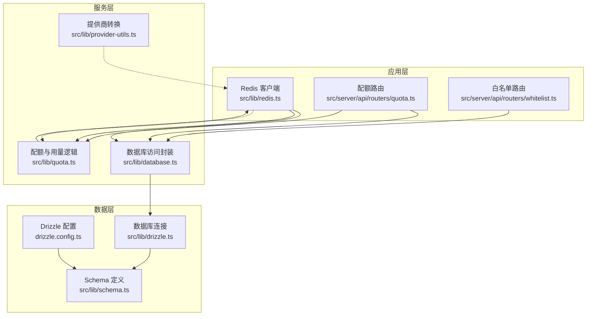
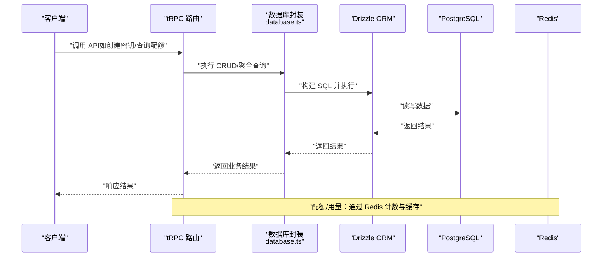
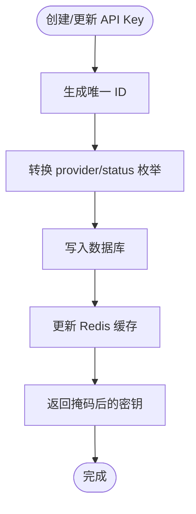
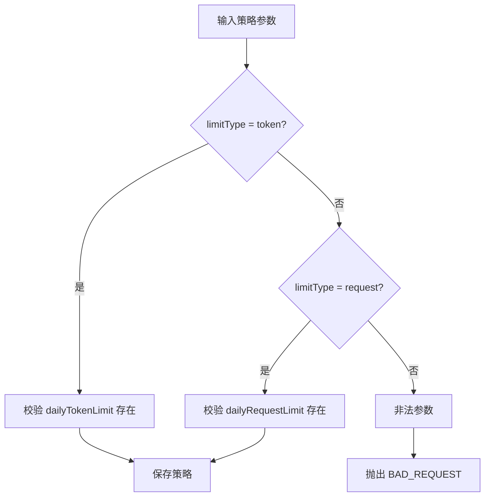
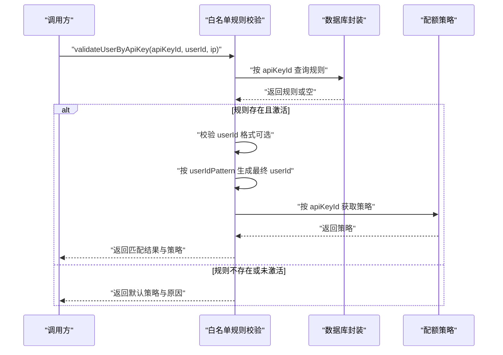
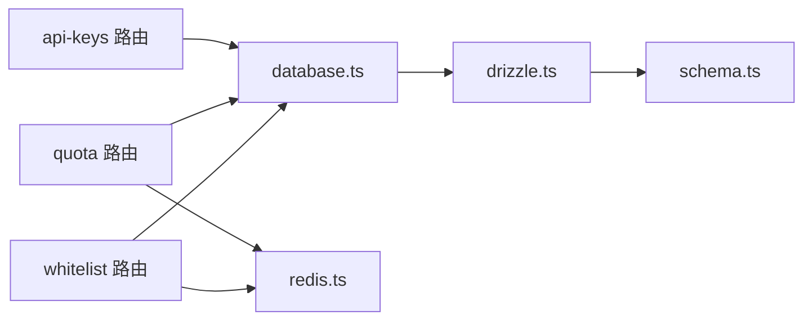
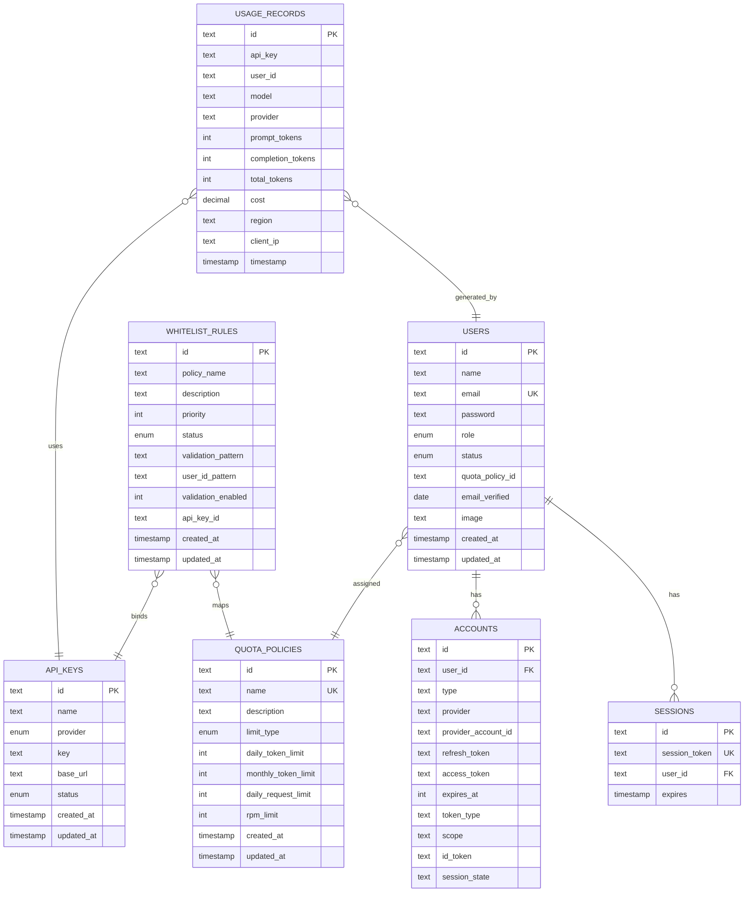

# 核心数据模型

<cite>
**本文引用的文件**
- [drizzle.config.ts](file://drizzle.config.ts)
- [schema.ts](file://src/lib/schema.ts)
- [drizzle.ts](file://src/lib/drizzle.ts)
- [database.ts](file://src/lib/database.ts)
- [quota.ts](file://src/lib/quota.ts)
- [redis.ts](file://src/lib/redis.ts)
- [provider-utils.ts](file://src/lib/provider-utils.ts)
- [types.ts](file://src/lib/types.ts)
- [api-key.ts](file://src/types/api-key.ts)
- [api-key 路由](file://src/server/api/routers/api-key.ts)
- [配额路由](file://src/server/api/routers/quota.ts)
- [白名单路由](file://src/server/api/routers/whitelist.ts)
</cite>

## 目录
1. [简介](#简介)
2. [项目结构](#项目结构)
3. [核心组件](#核心组件)
4. [架构总览](#架构总览)
5. [详细组件分析](#详细组件分析)
6. [依赖分析](#依赖分析)
7. [性能考虑](#性能考虑)
8. [故障排除指南](#故障排除指南)
9. [结论](#结论)
10. [附录](#附录)

## 简介
本文件系统性梳理 AIGate 的核心数据模型，覆盖用户、API 密钥、配额策略与用量记录等关键实体。文档从数据表结构、字段定义、约束与索引策略出发，解释实体关系映射、外键与级联规则，并结合业务流程阐述设计理念、数据完整性保障与最佳实践。同时给出典型使用场景与排障建议，帮助开发者与运维人员高效理解与维护数据层。

## 项目结构
AIGate 的数据层采用 Drizzle ORM + PostgreSQL 作为持久化存储，Redis 作为高并发配额与缓存层。核心文件组织如下：
- 数据模型定义：src/lib/schema.ts
- 数据库连接与初始化：src/lib/drizzle.ts
- 数据访问层封装：src/lib/database.ts
- 配额与用量逻辑：src/lib/quota.ts
- Redis 客户端与键空间：src/lib/redis.ts
- 提供商名称转换：src/lib/provider-utils.ts
- 类型与校验：src/lib/types.ts、src/types/api-key.ts
- API 路由（tRPC）：src/server/api/routers/*.ts

图表来源
- [drizzle.config.ts](file://drizzle.config.ts#L1-L11)
- [schema.ts](file://src/lib/schema.ts#L1-L162)
- [drizzle.ts](file://src/lib/drizzle.ts#L1-L12)
- [database.ts](file://src/lib/database.ts#L1-L692)
- [quota.ts](file://src/lib/quota.ts#L1-L327)
- [redis.ts](file://src/lib/redis.ts#L1-L43)
- [api-key 路由](file://src/server/api/routers/api-key.ts#L1-L377)
- [配额路由](file://src/server/api/routers/quota.ts#L1-L221)
- [白名单路由](file://src/server/api/routers/whitelist.ts#L1-L222)

章节来源
- [drizzle.config.ts](file://drizzle.config.ts#L1-L11)
- [schema.ts](file://src/lib/schema.ts#L1-L162)
- [drizzle.ts](file://src/lib/drizzle.ts#L1-L12)

## 核心组件
本节概述四大核心实体：用户、API 密钥、配额策略、用量记录；并补充白名单规则与 NextAuth 相关表，说明它们之间的关系与约束。

- 用户 users
  - 主键：id
  - 唯一：email
  - 外键：quota_policy_id → quota_policies.name
  - 枚举：role ∈ {USER, ADMIN}；status ∈ {ACTIVE, INACTIVE, SUSPENDED}
  - 时间戳：created_at, updated_at

- API 密钥 api_keys
  - 主键：id
  - 枚举：provider ∈ {OPENAI, ANTHROPIC, GOOGLE, DEEPSEEK, MOONSHOT, SPARK}
  - 枚举：status ∈ {ACTIVE, INACTIVE, SUSPENDED}
  - 唯一：无（仅 id 唯一）
  - 时间戳：created_at, updated_at

- 配额策略 quota_policies
  - 主键：id
  - 唯一：name
  - 枚举：limit_type ∈ {token, request}
  - 字段：daily_token_limit, monthly_token_limit, daily_request_limit, rpm_limit
  - 时间戳：created_at, updated_at

- 用量记录 usage_records
  - 主键：id
  - 字段：api_key, user_id, model, provider, prompt_tokens, completion_tokens, total_tokens, cost, region, client_ip, timestamp

- 白名单规则 whitelist_rules
  - 主键：id
  - 外键：api_key_id → api_keys.id
  - 关系：policy_name → quota_policies.name
  - 枚举：status ∈ {active, inactive}
  - 字段：priority, validation_pattern, user_id_pattern, validation_enabled

- NextAuth 表 accounts, sessions, verification_tokens
  - accounts.userId → users.id（级联删除）
  - sessions.userId → users.id（级联删除）

章节来源
- [schema.ts](file://src/lib/schema.ts#L28-L137)

## 架构总览
下图展示数据模型在系统中的位置与交互：tRPC 路由调用数据库封装，数据库封装通过 Drizzle ORM 访问 PostgreSQL；配额与用量逻辑通过 Redis 实现高性能计数与缓存；提供商名称在路由与数据库之间做双向转换。

图表来源
- [api-key 路由](file://src/server/api/routers/api-key.ts#L68-L377)
- [配额路由](file://src/server/api/routers/quota.ts#L39-L221)
- [白名单路由](file://src/server/api/routers/whitelist.ts#L22-L222)
- [database.ts](file://src/lib/database.ts#L1-L692)
- [quota.ts](file://src/lib/quota.ts#L1-L327)
- [redis.ts](file://src/lib/redis.ts#L1-L43)

## 详细组件分析

### 用户表 users
- 设计要点
  - 主键 id；唯一 email；角色与状态枚举；外键 quota_policy_id 指向 quota_policies.name。
  - 便于按邮箱快速检索与登录；通过配额策略实现差异化限额。
- 约束与索引
  - 主键：id
  - 唯一键：email
  - 外键：quota_policy_id → quota_policies.name
  - 建议索引：email（唯一）、quota_policy_id（非唯一）
- 业务规则
  - 角色区分管理员与普通用户；状态控制账户可用性。
- 最佳实践
  - 登录流程优先使用 email 唯一约束；避免重复邮箱。
  - 用户状态变更需同步清理会话与缓存。

章节来源
- [schema.ts](file://src/lib/schema.ts#L70-L83)
- [database.ts](file://src/lib/database.ts#L581-L691)

### API 密钥表 api_keys
- 设计要点
  - 主键 id；provider 与 status 枚举；可选 baseUrl 支持多厂商适配。
  - 与 Redis 缓存配合，按 provider 维度短期缓存有效密钥。
- 约束与索引
  - 主键：id
  - 建议索引：provider（过滤有效密钥）、status（快速筛选）
- 业务规则
  - ACTIVE 状态才参与流量调度；禁用后需清理缓存。
  - 路由层对 provider/status 做前后端枚举转换。
- 最佳实践
  - 创建/更新时同步 Redis 缓存；删除时清理对应键。
  - 对外展示掩码密钥，保护敏感信息。

图表来源
- [api-key 路由](file://src/server/api/routers/api-key.ts#L131-L175)
- [redis.ts](file://src/lib/redis.ts#L34-L35)

章节来源
- [schema.ts](file://src/lib/schema.ts#L42-L52)
- [api-key 路由](file://src/server/api/routers/api-key.ts#L1-L377)
- [redis.ts](file://src/lib/redis.ts#L1-L43)

### 配额策略表 quota_policies
- 设计要点
  - 主键 id 与唯一 name；支持按 token 或请求次数两种限制模式；rpm_limit 控制每分钟请求速率。
  - 与白名单规则通过 policyName 关联，形成“按 API Key 映射策略”的灵活授权链路。
- 约束与索引
  - 主键：id；唯一：name
  - 建议索引：name（唯一）
- 业务规则
  - 创建/更新时校验 limitType 与对应上限字段的互斥关系；策略变更需清理当日缓存。
- 最佳实践
  - 默认策略兜底；策略命名清晰，便于审计与追踪。
  - 变更策略后及时清理 Redis 中的策略缓存与用户当日用量。

图表来源
- [配额路由](file://src/server/api/routers/quota.ts#L102-L140)

章节来源
- [schema.ts](file://src/lib/schema.ts#L28-L40)
- [配额路由](file://src/server/api/routers/quota.ts#L1-L221)

### 用量记录表 usage_records
- 设计要点
  - 记录每次请求的 token 消耗、成本、区域与客户端 IP；支持按用户与时间范围聚合统计。
  - 与数据库封装配合，提供按用户、按日期范围查询与汇总能力。
- 约束与索引
  - 主键：id
  - 建议索引：user_id、timestamp、api_key
- 业务规则
  - 用量写入数据库前先更新 Redis 计数；支持按天/分钟维度统计。
- 最佳实践
  - 用量统计异步聚合，避免阻塞主流程；定期归档历史数据。

章节来源
- [schema.ts](file://src/lib/schema.ts#L54-L68)
- [database.ts](file://src/lib/database.ts#L143-L278)

### 白名单规则表 whitelist_rules
- 设计要点
  - 通过 api_key_id 与 api_keys 建立一对一绑定；通过 policyName 与 quota_policies 建立策略映射。
  - 支持正则校验与占位符生成最终 userId，实现灵活的用户标识归一化。
- 约束与索引
  - 主键：id；唯一：无
  - 外键：api_key_id → api_keys.id；policyName → quota_policies.name
  - 建议索引：api_key_id（唯一性约束）、status、priority
- 业务规则
  - 每个 API Key 只能绑定一个白名单规则；启用校验时按正则匹配 userId。
  - 生成最终 userId 支持 @user_id、@api_key、@ip、@any 占位符。
- 最佳实践
  - 优先使用白名单规则进行用户标识归一化；保持规则优先级与正则有效性。

图表来源
- [database.ts](file://src/lib/database.ts#L456-L545)
- [quota.ts](file://src/lib/quota.ts#L18-L57)

章节来源
- [schema.ts](file://src/lib/schema.ts#L85-L98)
- [database.ts](file://src/lib/database.ts#L292-L579)

### NextAuth 相关表 accounts、sessions、verification_tokens
- 设计要点
  - accounts.userId 与 sessions.userId 外键指向 users.id，并设置级联删除，确保用户删除时自动清理认证数据。
  - verification_tokens 使用复合主键（identifier, token）保证令牌唯一性。
- 约束与索引
  - accounts.userId 外键（级联删除）
  - sessions.userId 外键（级联删除）
  - verification_tokens 复合主键
- 最佳实践
  - 用户删除流程需依赖级联删除，避免悬挂认证数据。

章节来源
- [schema.ts](file://src/lib/schema.ts#L100-L137)

## 依赖分析
- 组件耦合
  - tRPC 路由依赖数据库封装；数据库封装依赖 Drizzle ORM 与 PostgreSQL；配额逻辑依赖 Redis。
  - 白名单规则与配额策略通过 policyName 建立弱耦合映射；API Key 与白名单规则建立强绑定。
- 外部依赖
  - PostgreSQL：持久化；Redis：缓存与计数；NextAuth：会话管理。
- 循环依赖
  - 未发现循环导入；各模块职责清晰。

图表来源
- [api-key 路由](file://src/server/api/routers/api-key.ts#L1-L377)
- [配额路由](file://src/server/api/routers/quota.ts#L1-L221)
- [白名单路由](file://src/server/api/routers/whitelist.ts#L1-L222)
- [database.ts](file://src/lib/database.ts#L1-L692)
- [drizzle.ts](file://src/lib/drizzle.ts#L1-L12)
- [schema.ts](file://src/lib/schema.ts#L1-L162)
- [redis.ts](file://src/lib/redis.ts#L1-L43)

## 性能考虑
- Redis 缓存
  - API Key 缓存：按 provider 维度短期缓存，降低数据库压力。
  - 策略缓存：按 api_key_id 缓存配额策略，减少 JOIN 查询。
  - 用量计数：按日/分钟维度计数，避免热点竞争。
- 索引优化
  - users.email（唯一）、quota_policies.name（唯一）、api_keys.provider/status、usage_records.user_id/timestamp/api_key。
- 批处理与异步
  - 用量写入数据库采用异步落盘，优先保证实时配额判断。
- 事务与一致性
  - 关键路径尽量使用单条写入或事务，避免脏读；Redis 与数据库的最终一致性通过幂等设计保证。

## 故障排除指南
- API Key 状态异常
  - 现象：请求被拒绝或配额不生效
  - 排查：确认 api_keys.status 是否为 ACTIVE；Redis 中是否仍缓存旧值；必要时清理对应键
  - 参考：api-key 路由的状态切换与缓存清理逻辑
- 配额策略未生效
  - 现象：策略变更后用量仍按旧策略计算
  - 排查：确认策略变更后是否清理 Redis 中的策略缓存与用户当日用量
  - 参考：配额路由的缓存清理函数
- 白名单规则冲突
  - 现象：提示某 API Key 已绑定其他白名单规则
  - 排查：检查 whitelist_rules.api_key_id 是否唯一；更新时避免与其他规则冲突
- 用户标识不一致
  - 现象：同一用户在不同策略下额度不同
  - 排查：检查白名单规则的 userIdPattern 与占位符替换逻辑；确认最终生成的 userId 是否一致

章节来源
- [api-key 路由](file://src/server/api/routers/api-key.ts#L227-L270)
- [配额路由](file://src/server/api/routers/quota.ts#L15-L37)
- [白名单路由](file://src/server/api/routers/whitelist.ts#L73-L82)
- [database.ts](file://src/lib/database.ts#L456-L545)

## 结论
AIGate 的数据模型围绕“策略驱动的配额控制”展开：以配额策略为核心，通过白名单规则将 API Key 与策略解耦，再由 Redis 实现高并发计数与缓存，最终由数据库保障数据持久化与一致性。该设计既满足灵活的业务规则，又兼顾性能与可维护性。建议在生产环境中持续完善索引、监控 Redis 命中率与数据库慢查询，并规范策略命名与白名单规则的治理流程。

## 附录

### 数据模型 ER 图

图表来源
- [schema.ts](file://src/lib/schema.ts#L28-L137)

### 字段定义与约束清单
- users
  - 主键：id；唯一：email；外键：quota_policy_id → quota_policies.name；枚举：role, status
- api_keys
  - 主键：id；枚举：provider, status
- quota_policies
  - 主键：id；唯一：name；枚举：limit_type；字段：daily_token_limit, monthly_token_limit, daily_request_limit, rpm_limit
- usage_records
  - 主键：id；字段：api_key, user_id, model, provider, prompt_tokens, completion_tokens, total_tokens, cost, region, client_ip, timestamp
- whitelist_rules
  - 主键：id；外键：api_key_id → api_keys.id；外键：policy_name → quota_policies.name；枚举：status；字段：priority, validation_pattern, user_id_pattern, validation_enabled
- accounts/sessions
  - accounts.userId → users.id（级联删除）；sessions.userId → users.id（级联删除）

章节来源
- [schema.ts](file://src/lib/schema.ts#L28-L137)

### 使用示例与最佳实践
- 创建 API 密钥
  - 步骤：生成唯一 id → 转换 provider/status → 写入数据库 → 更新 Redis 缓存 → 掩码返回
  - 参考：api-key 路由的 create 流程
- 应用配额策略
  - 步骤：按 api_key_id 获取白名单规则 → 获取配额策略 → 校验当日/每分钟限额 → 记录用量
  - 参考：quota.ts 的 checkQuota 与 recordUsage
- 白名单规则匹配
  - 步骤：按 apiKeyId 查规则 → 校验 userId 格式 → 生成最终 userId → 返回策略
  - 参考：database.ts 的 validateUserByApiKey
- 最佳实践
  - 严格索引：按查询热点建立索引；避免全表扫描
  - 缓存治理：策略与密钥缓存设置合理过期时间；变更后主动清理
  - 枚举转换：前后端枚举统一转换，避免大小写与拼写差异
  - 审计与日志：对配额超限、策略变更、用量记录进行日志留痕

章节来源
- [api-key 路由](file://src/server/api/routers/api-key.ts#L131-L175)
- [quota.ts](file://src/lib/quota.ts#L78-L200)
- [database.ts](file://src/lib/database.ts#L456-L545)