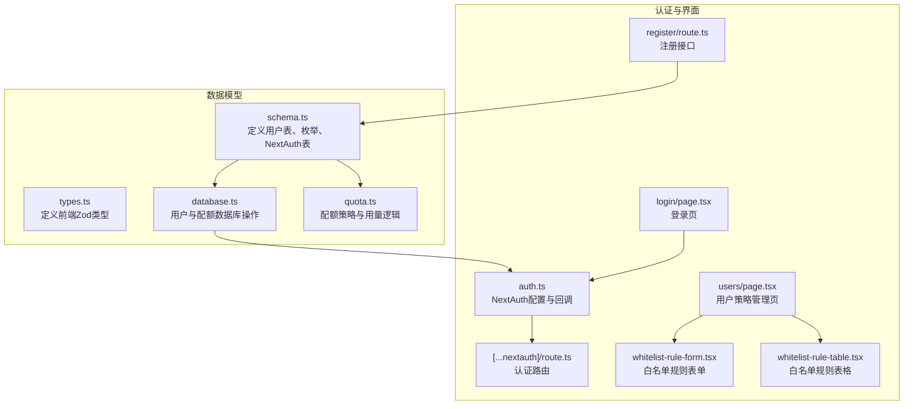
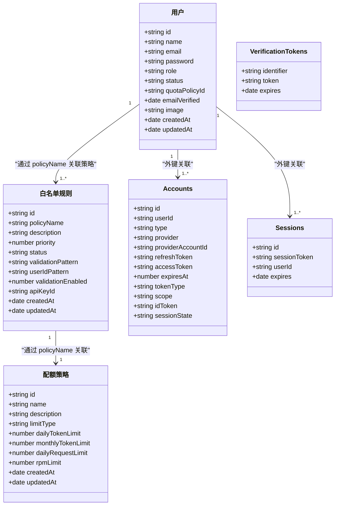
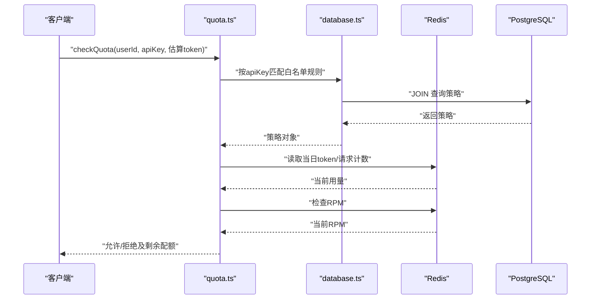
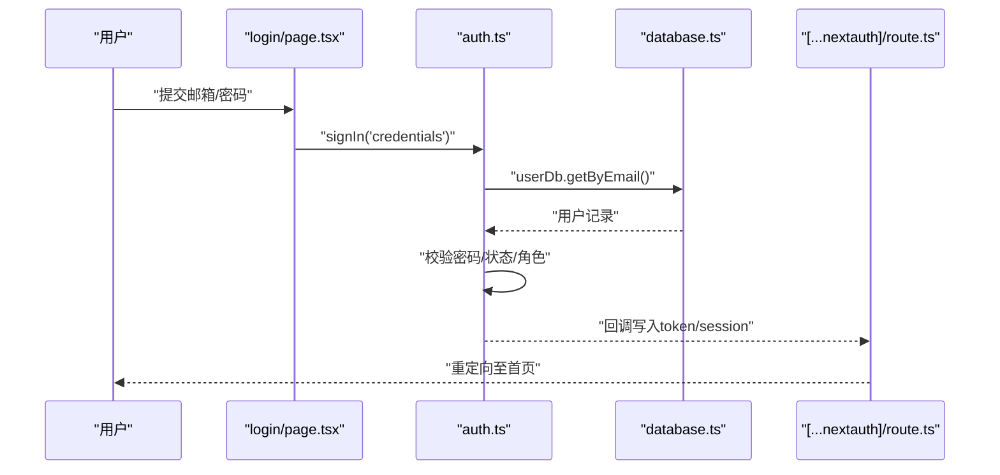
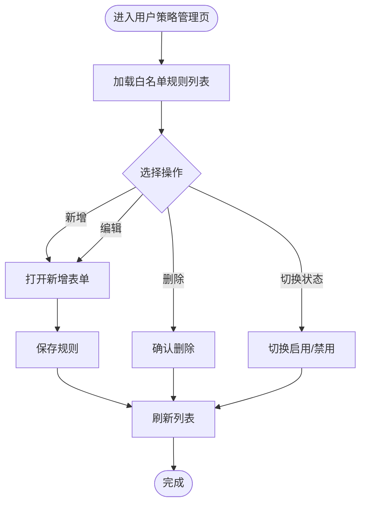
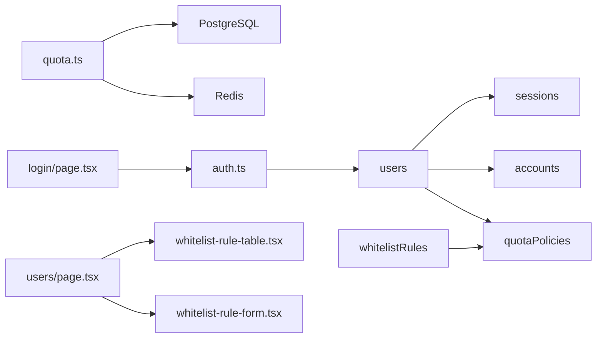

# 用户实体模型

<cite>
**本文档引用的文件**
- [schema.ts](file://src/lib/schema.ts)
- [types.ts](file://src/lib/types.ts)
- [database.ts](file://src/lib/database.ts)
- [quota.ts](file://src/lib/quota.ts)
- [auth.ts](file://src/auth.ts)
- [route.ts](file://src/app/api/auth/[...nextauth]/route.ts)
- [page.tsx](file://src/app/login/page.tsx)
- [page.tsx](file://src/app/(dashboard)/users/page.tsx)
- [whitelist-rule-form.tsx](file://src/app/(dashboard)/users/components/whitelist-rule-form.tsx)
- [whitelist-rule-table.tsx](file://src/app/(dashboard)/users/components/whitelist-rule-table.tsx)
- [route.ts](file://src/app/api/auth/register/route.ts)
- [drizzle.config.ts](file://drizzle.config.ts)
</cite>

## 目录
1. [简介](#简介)
2. [项目结构](#项目结构)
3. [核心组件](#核心组件)
4. [架构总览](#架构总览)
5. [详细组件分析](#详细组件分析)
6. [依赖关系分析](#依赖关系分析)
7. [性能考虑](#性能考虑)
8. [故障排除指南](#故障排除指南)
9. [结论](#结论)
10. [附录](#附录)

## 简介
本文件系统性地阐述用户实体模型的设计与实现，涵盖用户表字段定义、数据类型与约束、角色与状态枚举设计、用户与配额策略的关系、以及与 NextAuth.js 的集成方式。同时提供业务规则实现、数据完整性保障、使用示例与最佳实践，并给出常见问题的排查建议。

## 项目结构
用户模型相关的核心文件分布于以下模块：
- 数据库模型与枚举：src/lib/schema.ts
- 类型定义与验证：src/lib/types.ts
- 数据访问层：src/lib/database.ts
- 配额策略与用量计算：src/lib/quota.ts
- 身份认证与会话：src/auth.ts、src/app/api/auth/[...nextauth]/route.ts
- 登录界面与用户策略管理界面：src/app/login/page.tsx、src/app/(dashboard)/users/page.tsx
- 白名单规则表单与表格组件：src/app/(dashboard)/users/components/whitelist-rule-form.tsx、whitelist-rule-table.tsx
- 注册流程：src/app/api/auth/register/route.ts
- Drizzle 配置：drizzle.config.ts

图表来源
- [schema.ts](file://src/lib/schema.ts#L70-L83)
- [database.ts](file://src/lib/database.ts#L582-L627)
- [quota.ts](file://src/lib/quota.ts#L1-L327)
- [auth.ts](file://src/auth.ts#L1-L114)
- [route.ts](file://src/app/api/auth/[...nextauth]/route.ts#L1-L6)
- [page.tsx](file://src/app/login/page.tsx#L1-L48)
- [page.tsx](file://src/app/(dashboard)/users/page.tsx#L1-L147)
- [whitelist-rule-form.tsx](file://src/app/(dashboard)/users/components/whitelist-rule-form.tsx#L1-L531)
- [whitelist-rule-table.tsx](file://src/app/(dashboard)/users/components/whitelist-rule-table.tsx#L1-L168)
- [route.ts](file://src/app/api/auth/register/route.ts#L1-L29)

章节来源
- [schema.ts](file://src/lib/schema.ts#L1-L162)
- [drizzle.config.ts](file://drizzle.config.ts#L1-L11)

## 核心组件
- 用户表 users：包含主键 id、必填唯一邮箱、可空密码、角色与状态枚举、配额策略外键、邮箱验证时间、头像等字段。
- 角色枚举 role：USER、ADMIN；状态枚举 status：ACTIVE、INACTIVE、SUSPENDED。
- NextAuth 表 accounts、sessions、verification_tokens：与用户表建立外键关联，支持凭证登录与会话管理。
- 配额策略 quotaPolicies：与用户通过 quotaPolicyId 关联，支持按 token 或 request 两种限制模式。
- 白名单规则 whitelistRules：用于根据 API Key 与 userId 格式匹配策略，支持优先级与启用状态。

章节来源
- [schema.ts](file://src/lib/schema.ts#L13-L14)
- [schema.ts](file://src/lib/schema.ts#L70-L83)
- [schema.ts](file://src/lib/schema.ts#L100-L137)
- [schema.ts](file://src/lib/schema.ts#L28-L40)
- [schema.ts](file://src/lib/schema.ts#L85-L98)

## 架构总览
用户实体模型贯穿数据层、认证层与界面层，形成“模型-服务-界面”的清晰分层。

图表来源
- [schema.ts](file://src/lib/schema.ts#L70-L83)
- [schema.ts](file://src/lib/schema.ts#L28-L40)
- [schema.ts](file://src/lib/schema.ts#L85-L98)
- [schema.ts](file://src/lib/schema.ts#L100-L137)

## 详细组件分析

### 用户表字段定义与约束
- 主键 id：文本类型，唯一标识用户。
- 名称 name：文本类型，必填。
- 邮箱 email：文本类型，必填且唯一。
- 密码 password：文本类型，用于凭证登录场景。
- 角色 role：枚举 USER、ADMIN，默认 USER。
- 状态 status：枚举 ACTIVE、INACTIVE、SUSPENDED，默认 ACTIVE。
- 配额策略外键 quotaPolicyId：文本类型，必填，指向 quotaPolicies.id。
- 邮箱验证时间 emailVerified：日期类型。
- 头像 image：文本类型。
- 时间戳 createdAt/updatedAt：自动默认当前时间。

业务要点
- 用户状态为 ACTIVE 且角色为 ADMIN 才能通过凭证登录流程。
- 配额策略外键强制用户与策略关联，确保用量与限额控制生效。

章节来源
- [schema.ts](file://src/lib/schema.ts#L70-L83)
- [auth.ts](file://src/auth.ts#L32-L53)

### 角色与状态枚举设计理念
- 角色枚举 role：区分普通用户与管理员，支撑权限控制与登录校验。
- 状态枚举 status：支持激活、停用与封禁三种状态，便于运营与风控场景。
- 设计原则：使用数据库枚举保证取值安全，避免脏数据；前端与后端统一校验。

章节来源
- [schema.ts](file://src/lib/schema.ts#L13-L14)
- [auth.ts](file://src/auth.ts#L32-L53)

### 用户与配额策略的关联关系
- 用户通过 quotaPolicyId 关联到 quotaPolicies。
- 配额策略支持两种限制模式：
  - token 模式：按日/月 token 用量限制与 RPM 限制。
  - request 模式：按日请求数限制与 RPM 限制。
- 白名单规则通过 policyName 与 quotaPolicies.name 关联，实现更细粒度的匹配与优先级控制。

图表来源
- [quota.ts](file://src/lib/quota.ts#L78-L200)
- [database.ts](file://src/lib/database.ts#L421-L442)

章节来源
- [schema.ts](file://src/lib/schema.ts#L28-L40)
- [schema.ts](file://src/lib/schema.ts#L85-L98)
- [quota.ts](file://src/lib/quota.ts#L1-L327)
- [database.ts](file://src/lib/database.ts#L421-L442)

### 与 NextAuth.js 的集成
- 认证提供者：CredentialsProvider，基于邮箱与密码进行校验。
- 授权流程：从数据库查询用户，校验密码、状态与角色，成功后写入 JWT 与 Session。
- NextAuth 表：accounts、sessions、verification_tokens 与 users 建立外键关联，支持第三方账号与会话持久化。

图表来源
- [page.tsx](file://src/app/login/page.tsx#L20-L43)
- [auth.ts](file://src/auth.ts#L14-L81)
- [route.ts](file://src/app/api/auth/[...nextauth]/route.ts#L1-L6)
- [database.ts](file://src/lib/database.ts#L582-L592)

章节来源
- [auth.ts](file://src/auth.ts#L1-L114)
- [route.ts](file://src/app/api/auth/[...nextauth]/route.ts#L1-L6)
- [schema.ts](file://src/lib/schema.ts#L100-L137)

### 用户策略管理（白名单规则）
- 页面入口：/users，展示白名单规则列表，支持新增、编辑、删除与切换状态。
- 表单组件：支持选择策略、设置优先级、配置 userId 格式校验规则与 API Key 关联。
- 匹配逻辑：按优先级顺序匹配，支持正则校验与通配规则。

图表来源
- [page.tsx](file://src/app/(dashboard)/users/page.tsx#L22-L95)
- [whitelist-rule-form.tsx](file://src/app/(dashboard)/users/components/whitelist-rule-form.tsx#L128-L282)
- [whitelist-rule-table.tsx](file://src/app/(dashboard)/users/components/whitelist-rule-table.tsx#L28-L148)

章节来源
- [page.tsx](file://src/app/(dashboard)/users/page.tsx#L1-L147)
- [whitelist-rule-form.tsx](file://src/app/(dashboard)/users/components/whitelist-rule-form.tsx#L1-L531)
- [whitelist-rule-table.tsx](file://src/app/(dashboard)/users/components/whitelist-rule-table.tsx#L1-L168)

### 使用示例与业务规则
- 凭证登录：仅当用户状态为 ACTIVE 且角色为 ADMIN 时允许登录。
- 配额检查：根据策略限制类型（token/request）与 RPM 进行综合判断。
- 用量记录：按日/分钟维度累加用量，并落库记录明细。
- 白名单匹配：优先级高的规则先匹配，支持正则校验与 API Key 关联。

章节来源
- [auth.ts](file://src/auth.ts#L32-L53)
- [quota.ts](file://src/lib/quota.ts#L78-L200)
- [database.ts](file://src/lib/database.ts#L203-L260)

### 数据完整性保障
- 数据库层面：唯一约束（邮箱）、外键约束（accounts/sessions/users）、枚举约束（role/status/limitType）。
- 业务层面：登录前校验状态与角色；配额检查前校验策略与规则有效性；用量记录前校验策略类型。
- 缓存层面：Redis 缓存策略与用量，设置合理过期时间，避免缓存穿透。

章节来源
- [schema.ts](file://src/lib/schema.ts#L70-L83)
- [schema.ts](file://src/lib/schema.ts#L100-L137)
- [quota.ts](file://src/lib/quota.ts#L18-L76)

## 依赖关系分析
- 用户模型依赖配额策略与白名单规则，实现灵活的用量控制。
- NextAuth 依赖用户模型，提供认证与会话能力。
- 前端界面依赖 tRPC 与 Drizzle ORM，实现数据查询与更新。

图表来源
- [schema.ts](file://src/lib/schema.ts#L70-L137)
- [quota.ts](file://src/lib/quota.ts#L1-L327)
- [auth.ts](file://src/auth.ts#L1-L114)
- [page.tsx](file://src/app/login/page.tsx#L1-L48)
- [page.tsx](file://src/app/(dashboard)/users/page.tsx#L1-L147)
- [whitelist-rule-form.tsx](file://src/app/(dashboard)/users/components/whitelist-rule-form.tsx#L1-L531)
- [whitelist-rule-table.tsx](file://src/app/(dashboard)/users/components/whitelist-rule-table.tsx#L1-L168)

章节来源
- [schema.ts](file://src/lib/schema.ts#L1-L162)
- [quota.ts](file://src/lib/quota.ts#L1-L327)
- [auth.ts](file://src/auth.ts#L1-L114)

## 性能考虑
- Redis 缓存：策略与用量采用 Redis 缓存，减少数据库压力；合理设置过期时间，避免长期驻留。
- 分布式限流：RPM 限制按分钟维度存储，适合高并发场景。
- 查询优化：白名单规则匹配按优先级排序，尽量减少正则匹配次数；必要时对常用模式建立索引。
- 写入优化：用量记录批量写入数据库，降低 IO 压力。

## 故障排除指南
- 登录失败
  - 检查用户状态是否为 ACTIVE，角色是否为 ADMIN。
  - 核对邮箱与密码是否正确，确认数据库中是否存在该用户。
- 配额不足
  - 检查策略 limitType 是否正确，token 模式下查看当日 token 用量，request 模式下查看当日请求数。
  - 检查 RPM 是否达到上限。
- 白名单规则不生效
  - 确认规则状态为 active，优先级设置是否正确。
  - 检查 userId 格式校验规则是否匹配，正则表达式是否有效。
- NextAuth 会话异常
  - 检查 accounts/sessions 表中的外键关联是否正常。
  - 确认 NEXTAUTH_SECRET 配置正确，会话过期时间设置合理。

章节来源
- [auth.ts](file://src/auth.ts#L14-L81)
- [quota.ts](file://src/lib/quota.ts#L78-L200)
- [database.ts](file://src/lib/database.ts#L421-L442)
- [schema.ts](file://src/lib/schema.ts#L100-L137)

## 结论
用户实体模型通过严谨的数据结构、明确的枚举约束与完善的认证集成，实现了从身份管理到用量控制的全链路闭环。配合白名单规则与配额策略，系统具备良好的可扩展性与可运维性。建议在生产环境中持续监控配额与用量指标，定期清理过期会话与缓存，确保系统稳定运行。

## 附录
- 字段与类型的对应关系参考：[schema.ts](file://src/lib/schema.ts#L70-L83)、[types.ts](file://src/lib/types.ts#L33-L45)
- 配额策略与用量逻辑参考：[quota.ts](file://src/lib/quota.ts#L1-L327)
- 数据库操作参考：[database.ts](file://src/lib/database.ts#L582-L627)
- 认证与会话参考：[auth.ts](file://src/auth.ts#L1-L114)、[route.ts](file://src/app/api/auth/[...nextauth]/route.ts#L1-L6)
- 用户策略管理界面参考：[page.tsx](file://src/app/(dashboard)/users/page.tsx#L1-L147)、[whitelist-rule-form.tsx](file://src/app/(dashboard)/users/components/whitelist-rule-form.tsx#L1-L531)、[whitelist-rule-table.tsx](file://src/app/(dashboard)/users/components/whitelist-rule-table.tsx#L1-L168)
- 注册流程参考：[route.ts](file://src/app/api/auth/register/route.ts#L1-L29)
- Drizzle 配置参考：[drizzle.config.ts](file://drizzle.config.ts#L1-L11)