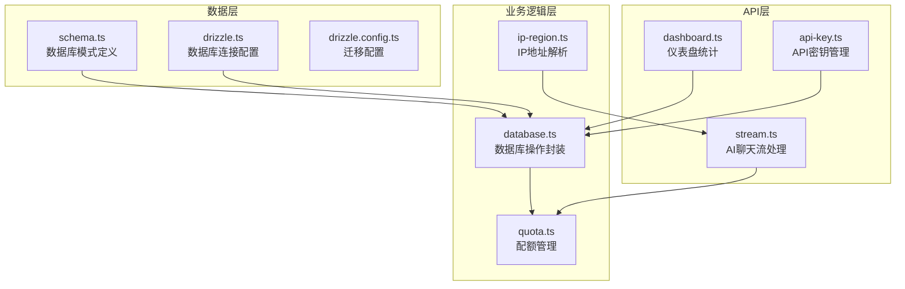
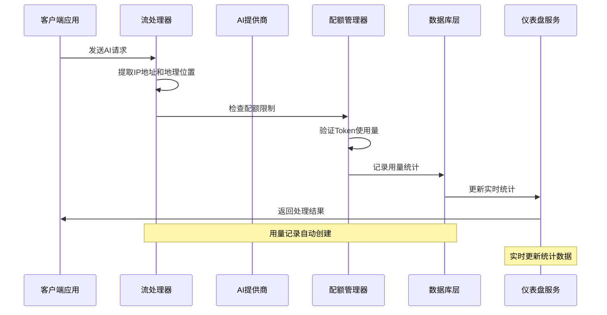
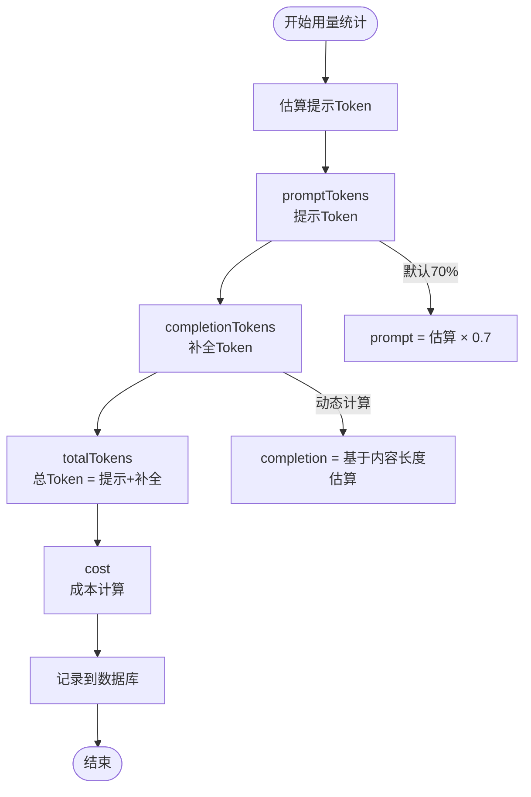
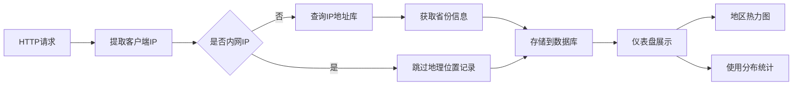
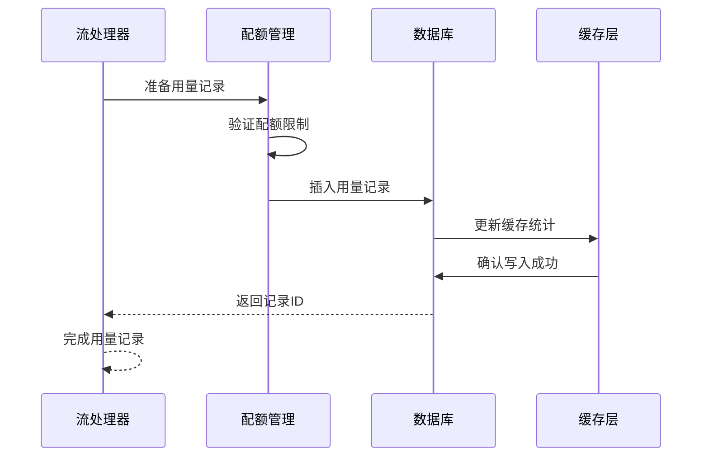
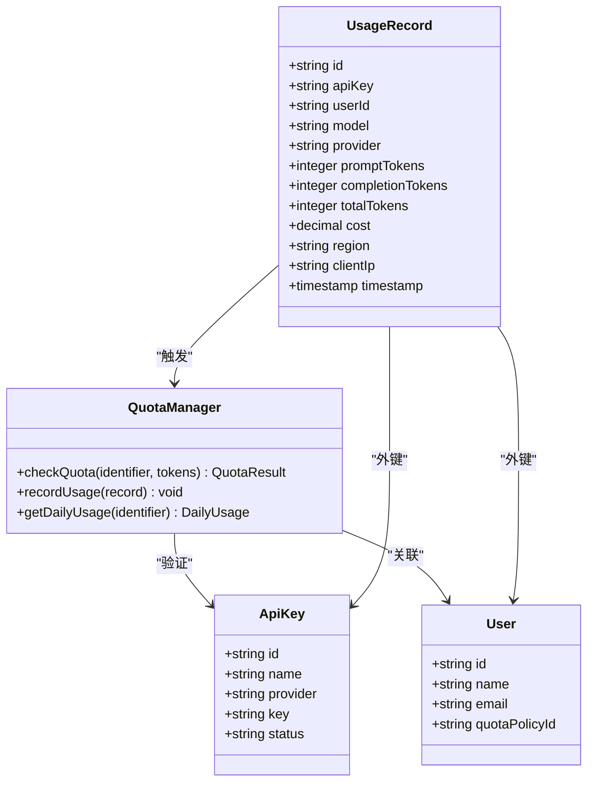
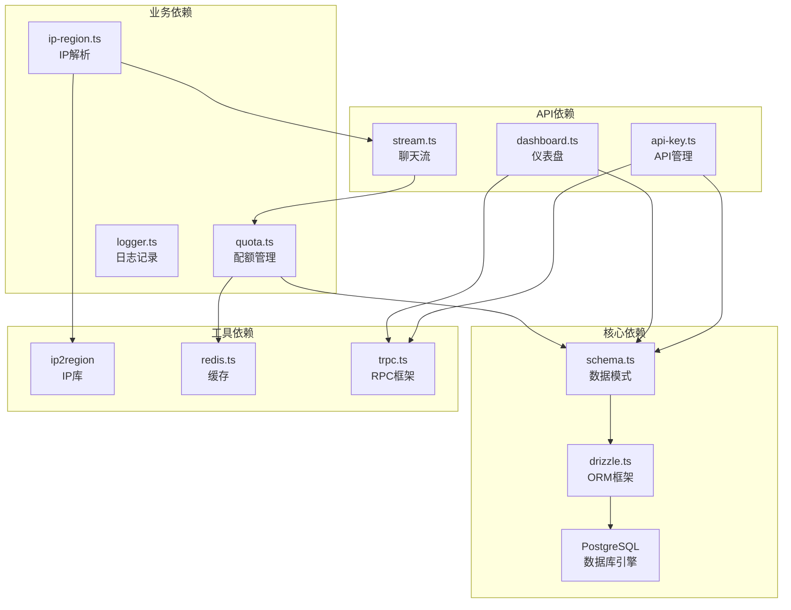
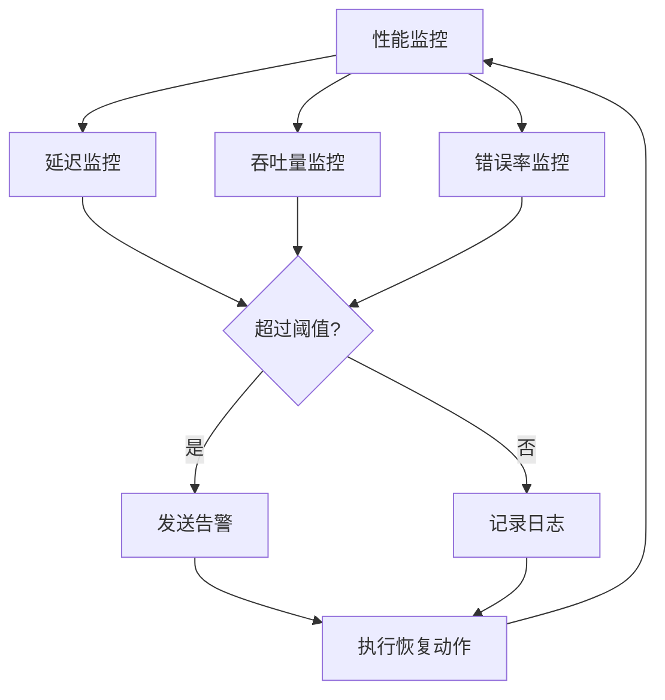

# 用量记录实体模型

<cite>
**本文档引用的文件**
- [schema.ts](file://src/lib/schema.ts)
- [database.ts](file://src/lib/database.ts)
- [stream.ts](file://src/pages/api/ai/chat/stream.ts)
- [quota.ts](file://src/lib/quota.ts)
- [ip-region.ts](file://src/lib/ip-region.ts)
- [dashboard.ts](file://src/server/api/routers/dashboard.ts)
- [api-key.ts](file://src/server/api/routers/api-key.ts)
- [drizzle.ts](file://src/lib/drizzle.ts)
- [drizzle.config.ts](file://drizzle.config.ts)
</cite>

## 目录
1. [简介](#简介)
2. [项目结构](#项目结构)
3. [核心组件](#核心组件)
4. [架构概览](#架构概览)
5. [详细组件分析](#详细组件分析)
6. [依赖分析](#依赖分析)
7. [性能考虑](#性能考虑)
8. [故障排除指南](#故障排除指南)
9. [结论](#结论)

## 简介

用量记录实体模型是AIGate系统中用于跟踪和分析AI服务使用情况的核心数据结构。该模型不仅记录了Token消耗统计信息，还包括成本计算、地理位置信息收集、时间戳和IP地址记录等关键业务指标。

本系统通过用量记录实体模型实现了对用户行为的全面追踪，为配额管理、成本分析和性能监控提供了坚实的数据基础。系统支持多种AI提供商（OpenAI、Anthropic、Google等），能够准确统计不同模型的使用情况和成本消耗。

## 项目结构

用量记录实体模型在项目中的组织结构如下：

**图表来源**
- [schema.ts](file://src/lib/schema.ts#L54-L68)
- [drizzle.ts](file://src/lib/drizzle.ts#L1-L11)
- [drizzle.config.ts](file://drizzle.config.ts#L1-L10)

**章节来源**
- [schema.ts](file://src/lib/schema.ts#L1-L162)
- [drizzle.ts](file://src/lib/drizzle.ts#L1-L11)
- [drizzle.config.ts](file://drizzle.config.ts#L1-L10)

## 核心组件

用量记录实体模型由以下核心组件构成：

### 数据库表结构

用量记录表采用PostgreSQL数据库设计，具有以下关键特性：

- **主键设计**: 使用UUID作为主键，确保全球唯一性
- **索引优化**: 在timestamp、userId、apiKey等字段上建立索引以提升查询性能
- **数据完整性**: 所有关键字段设置NOT NULL约束，保证数据质量
- **扩展性**: 支持未来字段扩展和业务需求变化

### 字段定义详解

| 字段名 | 数据类型 | 约束条件 | 描述 | 示例值 |
|--------|----------|----------|------|--------|
| id | text | PRIMARY KEY | 用量记录唯一标识符 | "usage_" + UUID |
| apiKey | text | NOT NULL | 关联的API密钥标识 | "key_123456" |
| userId | text | NOT NULL | 使用者的用户标识 | "user_789012" |
| model | text | NOT NULL | AI模型名称 | "gpt-4o" |
| provider | text | NOT NULL | AI服务提供商 | "OPENAI" |
| promptTokens | integer | NOT NULL | 提示Token数量 | 1500 |
| completionTokens | integer | NOT NULL | 补全Token数量 | 2300 |
| totalTokens | integer | NOT NULL | Token总数 | 3800 |
| cost | decimal(10,6) | NOT NULL | 成本金额 | 0.001900 |
| region | text | NULL | 地理位置信息 | "广东省" |
| clientIp | text | NULL | 客户端IP地址 | "113.101.200.50" |
| timestamp | timestamp | DEFAULT NOW() | 记录创建时间 | "2024-01-15 14:30:00" |

**章节来源**
- [schema.ts](file://src/lib/schema.ts#L54-L68)

## 架构概览

用量记录实体模型在整个系统中的架构位置如下：

**图表来源**
- [stream.ts](file://src/pages/api/ai/chat/stream.ts#L100-L168)
- [quota.ts](file://src/lib/quota.ts#L225-L245)
- [dashboard.ts](file://src/server/api/routers/dashboard.ts#L364-L381)

## 详细组件分析

### 用量记录表设计

用量记录表采用了精心设计的字段结构来满足各种业务需求：

#### Token消耗统计字段

系统通过三个核心字段精确统计Token使用情况：

**图表来源**
- [stream.ts](file://src/pages/api/ai/chat/stream.ts#L101-L139)

#### 成本计算机制

成本计算采用灵活的设计，支持不同提供商的成本定价：

| 成本字段 | 数据类型 | 精度要求 | 描述 |
|----------|----------|----------|------|
| cost | decimal(10,6) | 10位精度，6位小数 | 成本金额，支持微小数值精度 |
| 计价单位 | USD | 美元 | 标准美元计价 |
| 精度控制 | 自动四舍五入 | 保留6位小数 | 避免浮点数误差累积 |

#### 地理位置信息收集

系统实现了多层次的地理位置信息收集机制：

**图表来源**
- [ip-region.ts](file://src/lib/ip-region.ts#L24-L78)

**章节来源**
- [schema.ts](file://src/lib/schema.ts#L54-L68)
- [stream.ts](file://src/pages/api/ai/chat/stream.ts#L27-L29)
- [ip-region.ts](file://src/lib/ip-region.ts#L51-L78)

### 数据库操作接口

用量记录的数据库操作通过专门的封装层实现：

#### 查询接口

系统提供了多种查询接口来满足不同的业务需求：

| 查询方法 | 参数 | 功能描述 | 性能特点 |
|----------|------|----------|----------|
| getAll() | 无 | 获取所有用量记录 | 异步批量查询 |
| getByUserId(userId) | 用户ID | 按用户过滤记录 | 索引加速查询 |
| getByDateRange(startDate, endDate) | 时间范围 | 按时间范围过滤 | 复合索引查询 |
| getStats() | 无 | 获取统计摘要 | 并行聚合查询 |

#### 创建和更新操作

用量记录的创建采用原子性操作，确保数据一致性：

**图表来源**
- [quota.ts](file://src/lib/quota.ts#L232-L245)

**章节来源**
- [database.ts](file://src/lib/database.ts#L144-L278)
- [quota.ts](file://src/lib/quota.ts#L225-L260)

### API集成点

用量记录实体模型与多个API端点深度集成：

#### 实时用量统计API

系统提供了多种API端点来获取用量统计信息：

| API端点 | 功能描述 | 请求参数 | 响应格式 |
|---------|----------|----------|----------|
| GET /api/ai/chat/stream | 实时聊天流处理 | 请求体包含用户ID和API密钥 | SSE流响应 |
| GET /api/dashboard/stats | 仪表盘统计数据 | 可选日期范围参数 | 统计摘要JSON |
| GET /api/usage/:userId | 用户用量详情 | 用户ID路径参数 | 用量记录列表 |

#### 配额检查集成

用量记录与配额管理系统紧密集成，确保使用量在允许范围内：

**图表来源**
- [stream.ts](file://src/pages/api/ai/chat/stream.ts#L78-L86)
- [quota.ts](file://src/lib/quota.ts#L225-L260)

**章节来源**
- [api-key.ts](file://src/server/api/routers/api-key.ts#L325-L339)
- [dashboard.ts](file://src/server/api/routers/dashboard.ts#L364-L381)

## 依赖分析

用量记录实体模型的依赖关系如下：

**图表来源**
- [schema.ts](file://src/lib/schema.ts#L1-L162)
- [drizzle.ts](file://src/lib/drizzle.ts#L1-L11)
- [ip-region.ts](file://src/lib/ip-region.ts#L1-L101)

**章节来源**
- [schema.ts](file://src/lib/schema.ts#L1-L162)
- [drizzle.ts](file://src/lib/drizzle.ts#L1-L11)

## 性能考虑

### 查询性能优化

系统在设计时充分考虑了查询性能优化：

#### 索引策略

- **复合索引**: 在(timestamp, userId)和(timestamp, apiKey)上建立复合索引
- **单列索引**: 在userId、apiKey、provider等高频查询字段上建立索引
- **部分索引**: 对于region字段建立条件索引，仅索引非空值

#### 查询优化技术

- **并行查询**: 使用Promise.all()并行执行多个统计查询
- **分页查询**: 对大量数据采用分页机制，避免一次性加载过多记录
- **缓存策略**: 使用Redis缓存热点数据，减少数据库压力

### 存储性能优化

#### 数据压缩

- **Decimal精度控制**: 使用decimal(10,6)精确存储成本数据
- **文本字段优化**: 对常用字符串字段建立适当长度限制
- **时间戳优化**: 使用timestamp with timezone确保时区一致性

#### 批量操作

- **批量插入**: 支持批量插入多个用量记录
- **批量更新**: 提供批量更新功能减少网络往返

### 监控和告警

系统实现了完善的性能监控机制：

## 故障排除指南

### 常见问题诊断

#### 数据库连接问题

**症状**: 用量记录无法写入数据库
**可能原因**:
- DATABASE_URL环境变量配置错误
- 数据库连接池耗尽
- 表结构不匹配

**解决方案**:
1. 检查DATABASE_URL配置
2. 验证数据库连接权限
3. 运行数据库迁移脚本

#### IP地址解析失败

**症状**: region和clientIp字段为空
**可能原因**:
- IP2Region库初始化失败
- 内网IP被过滤
- 代理头配置错误

**解决方案**:
1. 检查IP2Region库安装
2. 验证代理头配置
3. 添加IP地址白名单

#### 配额检查异常

**症状**: 配额检查总是失败
**可能原因**:
- Redis连接问题
- 配额策略配置错误
- 用户ID格式不正确

**解决方案**:
1. 检查Redis连接状态
2. 验证配额策略配置
3. 格式化用户ID

### 性能问题排查

#### 查询超时

**症状**: 用量统计查询响应缓慢
**排查步骤**:
1. 检查数据库索引是否有效
2. 分析慢查询日志
3. 优化查询条件

#### 内存泄漏

**症状**: 应用内存持续增长
**排查步骤**:
1. 检查数据库连接是否正确关闭
2. 验证事件监听器是否清理
3. 监控垃圾回收情况

**章节来源**
- [database.ts](file://src/lib/database.ts#L151-L163)
- [ip-region.ts](file://src/lib/ip-region.ts#L65-L68)
- [quota.ts](file://src/lib/quota.ts#L252-L259)

## 结论

用量记录实体模型通过精心设计的字段结构、完善的数据库操作接口和高效的API集成，为AIGate系统提供了强大的使用情况追踪能力。该模型不仅满足了当前的业务需求，还具备良好的扩展性和性能表现。

### 主要优势

1. **数据完整性**: 通过严格的约束条件确保数据质量
2. **性能优化**: 采用多种优化技术提升查询效率
3. **扩展性强**: 支持未来功能扩展和业务变化
4. **监控完善**: 提供全面的性能监控和故障诊断能力

### 未来发展

随着AI服务使用的不断增长，用量记录实体模型将继续演进，包括：
- 更精细的使用情况分析
- 实时成本计算功能
- 更丰富的地理位置分析
- 智能化的配额管理建议

该模型为构建高性能、可扩展的AI服务监控系统奠定了坚实的基础。