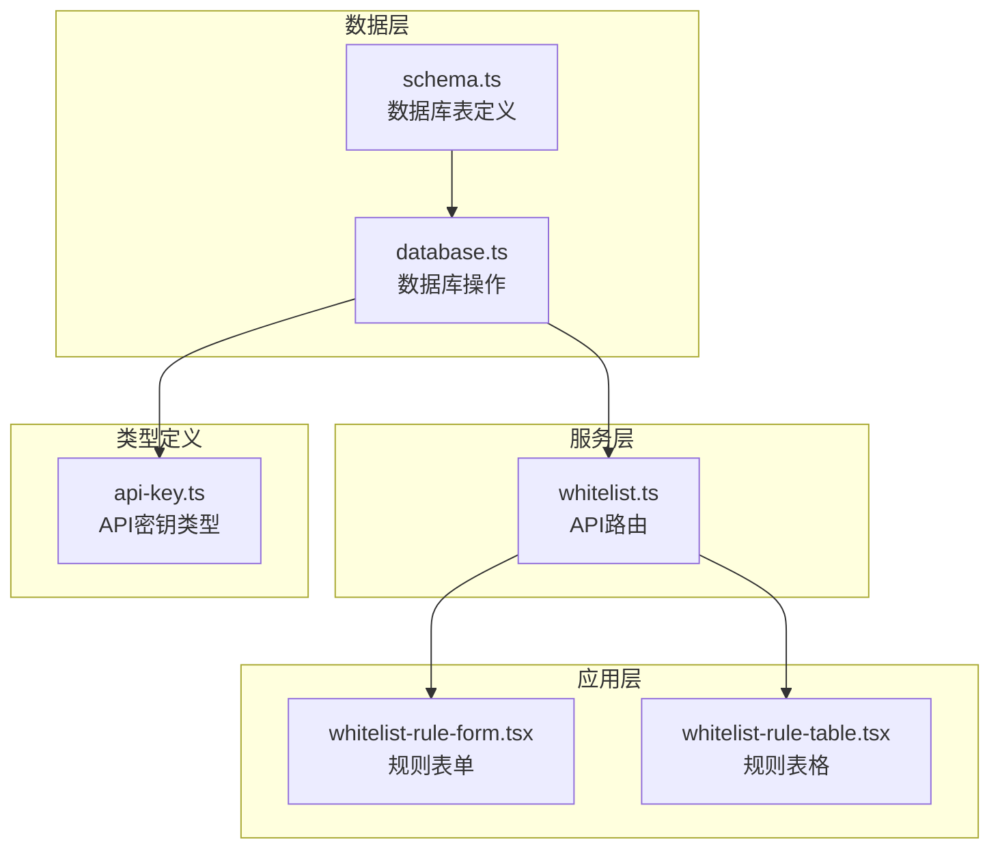
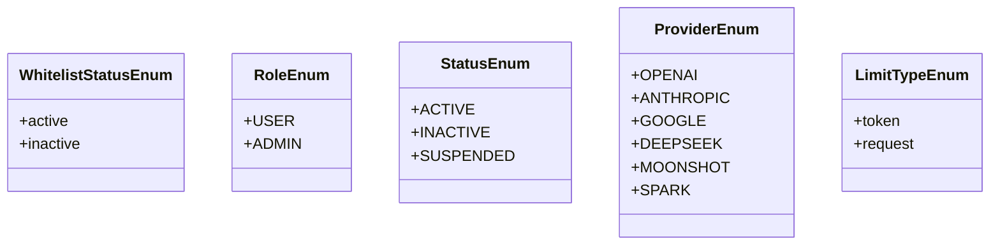
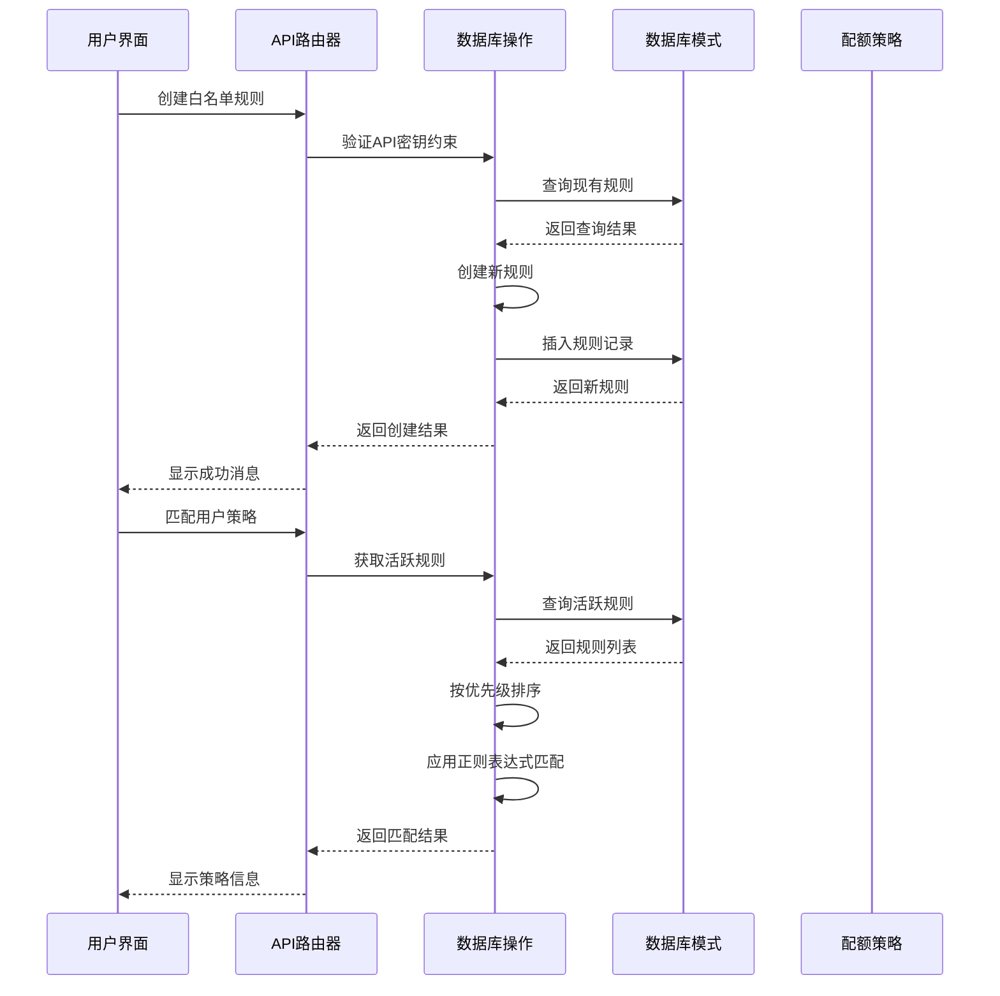
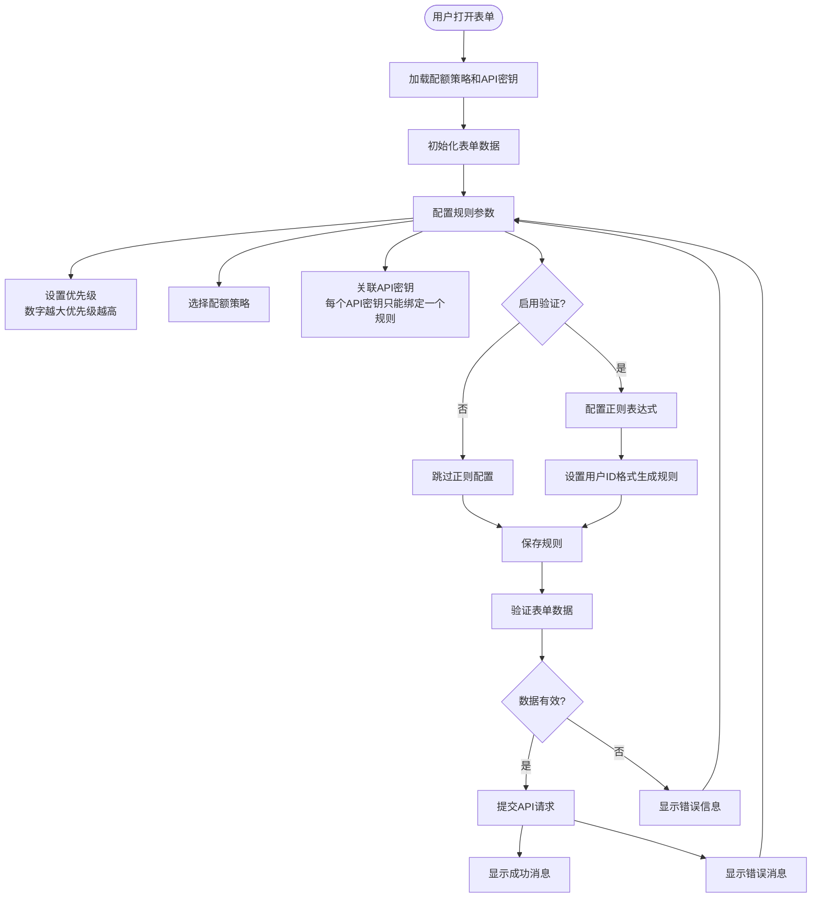
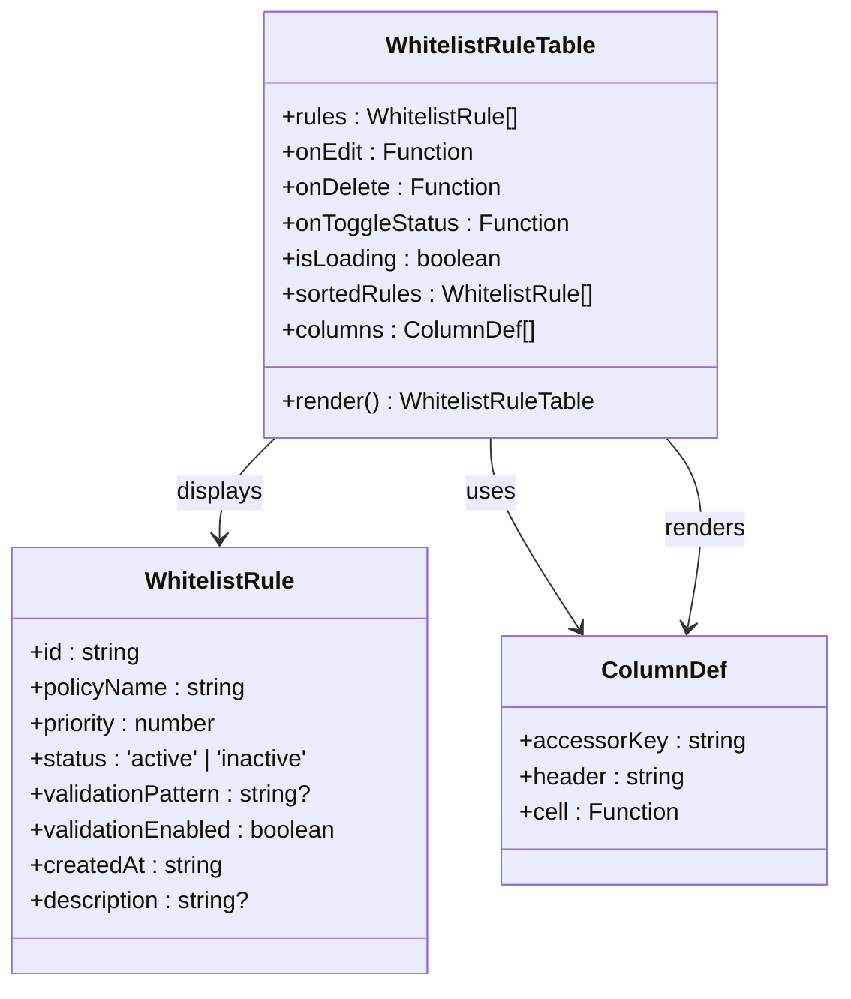
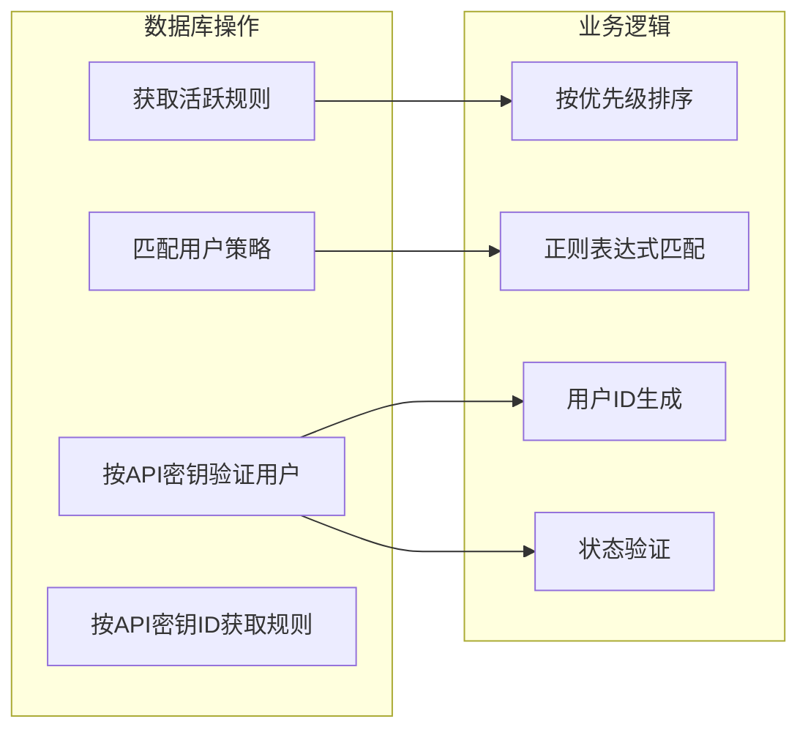
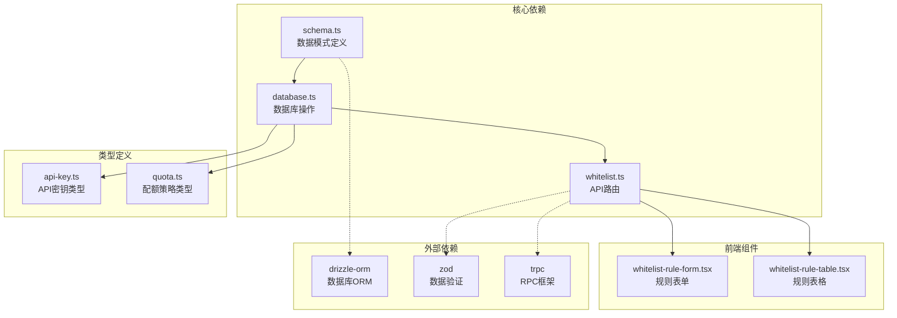
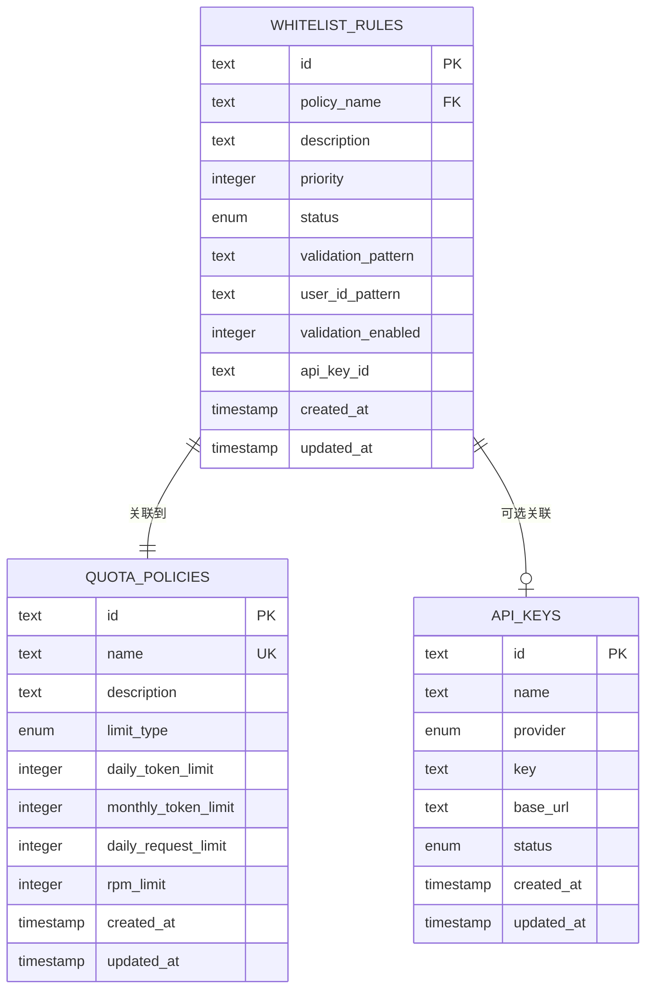
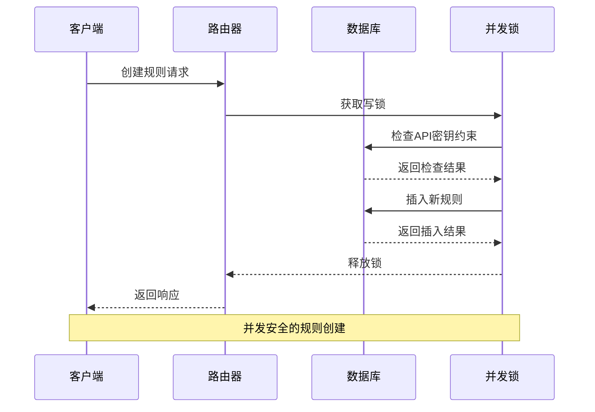
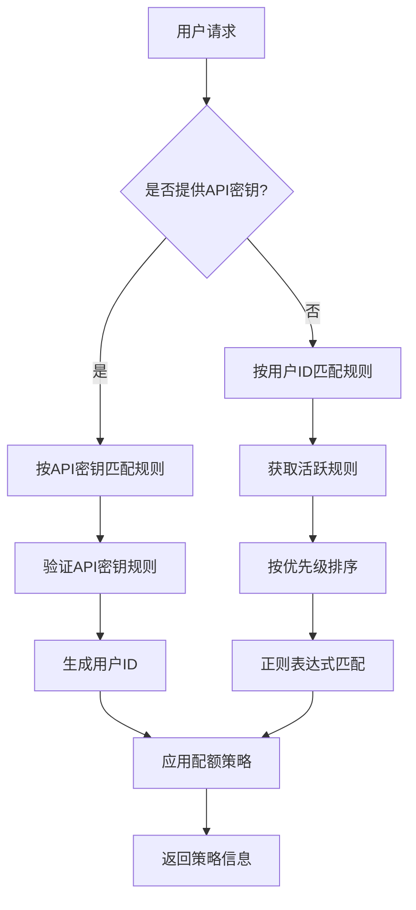

# 白名单规则实体模型

<cite>
**本文档引用的文件**
- [schema.ts](file://src/lib/schema.ts)
- [database.ts](file://src/lib/database.ts)
- [whitelist.ts](file://src/server/api/routers/whitelist.ts)
- [whitelist-rule-form.tsx](file://src/app/(dashboard)/users/components/whitelist-rule-form.tsx)
- [whitelist-rule-table.tsx](file://src/app/(dashboard)/users/components/whitelist-rule-table.tsx)
- [api-key.ts](file://src/types/api-key.ts)
</cite>

## 目录
1. [简介](#简介)
2. [项目结构](#项目结构)
3. [核心组件](#核心组件)
4. [架构概览](#架构概览)
5. [详细组件分析](#详细组件分析)
6. [依赖关系分析](#依赖关系分析)
7. [性能考虑](#性能考虑)
8. [故障排除指南](#故障排除指南)
9. [结论](#结论)
10. [附录](#附录)

## 简介

白名单规则实体模型是本系统中用于控制用户访问权限和配额管理的核心数据结构。该模型通过定义严格的字段规范、状态管理和正则表达式验证机制，确保只有符合预设条件的用户能够访问特定的API密钥和配额策略。

本模型支持复杂的规则组合和动态匹配机制，包括基于优先级的规则排序、基于正则表达式的用户ID验证、以及与配额策略的关联管理。系统还提供了直观的用户界面来管理这些规则，包括预设模板、实时验证和批量操作功能。

## 项目结构

白名单规则实体模型在项目中的组织结构如下：

**图表来源**
- [schema.ts](file://src/lib/schema.ts#L85-L98)
- [database.ts](file://src/lib/database.ts#L1-L200)
- [whitelist.ts](file://src/server/api/routers/whitelist.ts#L1-L222)

**章节来源**
- [schema.ts](file://src/lib/schema.ts#L1-L162)
- [database.ts](file://src/lib/database.ts#L1-L200)

## 核心组件

### 数据库表结构

白名单规则实体模型基于PostgreSQL数据库设计，包含以下核心表结构：

| 表名 | 字段 | 类型 | 约束 | 描述 |
|------|------|------|------|------|
| whitelist_rules | id | text | PRIMARY KEY | 规则唯一标识符 |
| whitelist_rules | policyName | text | NOT NULL | 关联的配额策略名称 |
| whitelist_rules | description | text |  | 规则描述信息 |
| whitelist_rules | priority | integer | NOT NULL DEFAULT 1 | 规则优先级（数值越大优先级越高） |
| whitelist_rules | status | enum | NOT NULL DEFAULT 'active' | 规则状态（active/inactive） |
| whitelist_rules | validationPattern | text |  | 正则表达式验证模式 |
| whitelist_rules | userIdPattern | text |  | 用户ID格式生成规则 |
| whitelist_rules | validationEnabled | integer | NOT NULL DEFAULT 0 | 是否启用验证（0/1布尔值） |
| whitelist_rules | apiKeyId | text |  | 关联的API密钥ID |
| whitelist_rules | createdAt | timestamp | NOT NULL DEFAULT now() | 创建时间 |
| whitelist_rules | updatedAt | timestamp | NOT NULL DEFAULT now() | 更新时间 |

### 枚举类型定义

系统定义了多个枚举类型来确保数据的一致性和完整性：

**图表来源**
- [schema.ts](file://src/lib/schema.ts#L13-L26)

**章节来源**
- [schema.ts](file://src/lib/schema.ts#L13-L26)

## 架构概览

白名单规则实体模型采用分层架构设计，确保各层职责清晰分离：

**图表来源**
- [whitelist.ts](file://src/server/api/routers/whitelist.ts#L67-L102)
- [database.ts](file://src/lib/database.ts#L421-L449)

## 详细组件分析

### 白名单规则表单组件

白名单规则表单组件提供了完整的用户交互界面，支持规则的创建、编辑和管理：

**图表来源**
- [whitelist-rule-form.tsx](file://src/app/(dashboard)/users/components/whitelist-rule-form.tsx#L128-L531)

#### 预设模板系统

系统提供了丰富的预设模板来简化正则表达式的创建：

| 预设触发符 | 模板标签 | 描述 | 正则表达式 |
|------------|----------|------|------------|
| @ip | IPv4地址 | 匹配IPv4地址格式 | ^((25[0-5]\|2[0-4]\\d\|[01]?\\d\\d?)\\.){3}(25[0-5]\|2[0-4]\\d\|[01]?\\d\\d?)$ |
| @ip_range | IP段范围 | 匹配IP段格式（如192.168.*.*） | ^192\\.168\\.\\d{1,3}\\.\\d{1,3}$ |
| @email | 邮箱格式 | 匹配标准邮箱格式 | ^[\\w.+-]+@[\\w-]+\\.[\\w.]$ |
| @email_domain | 指定域名邮箱 | 匹配特定域名邮箱 | ^[\\w.+-]+@company\\.com$ |
| @origin | HTTP来源 | 匹配HTTP Origin格式 | ^https?://[\\w.-]+(:\\d+)?$ |
| @numeric | 纯数字ID | 匹配纯数字ID | ^[1-9]\\d*$ |
| @uuid | UUID格式 | 匹配UUID格式 | ^[0-9a-f]{8}-[0-9a-f]{4}-[0-9a-f]{4}-[0-9a-f]{4}-[0-9a-f]{12}$ |
| @prefix | 前缀ID | 匹配带前缀的ID（如user_xxx） | ^user_[a-zA-Z0-9]+$ |
| @any | 任意字符串 | 匹配任意非空字符串 | ^.+$$ |

**章节来源**
- [whitelist-rule-form.tsx](file://src/app/(dashboard)/users/components/whitelist-rule-form.tsx#L50-L126)

### 白名单规则表格组件

规则表格组件提供了规则的可视化展示和批量操作功能：

**图表来源**
- [whitelist-rule-table.tsx](file://src/app/(dashboard)/users/components/whitelist-rule-table.tsx#L9-L168)

### 数据库操作层

数据库操作层提供了完整的CRUD操作和业务逻辑实现：

**图表来源**
- [database.ts](file://src/lib/database.ts#L408-L449)
- [database.ts](file://src/lib/database.ts#L456-L545)

**章节来源**
- [database.ts](file://src/lib/database.ts#L303-L352)
- [database.ts](file://src/lib/database.ts#L408-L449)
- [database.ts](file://src/lib/database.ts#L456-L545)

## 依赖关系分析

白名单规则实体模型与其他系统组件存在紧密的依赖关系：

**图表来源**
- [schema.ts](file://src/lib/schema.ts#L1-L11)
- [whitelist.ts](file://src/server/api/routers/whitelist.ts#L1-L6)

### 关系映射

系统通过外键关系建立了白名单规则与配额策略之间的关联：

**图表来源**
- [schema.ts](file://src/lib/schema.ts#L29-L52)
- [schema.ts](file://src/lib/schema.ts#L85-L98)

**章节来源**
- [schema.ts](file://src/lib/schema.ts#L139-L145)

## 性能考虑

### 查询优化策略

1. **索引设计**: 建议为常用查询字段建立索引：
   - `whitelist_rules.status`: 支持活跃规则快速检索
   - `whitelist_rules.priority`: 支持优先级排序
   - `whitelist_rules.apiKeyId`: 支持API密钥关联查询

2. **查询优化**: 
   - 使用`LIMIT 1`优化单条记录查询
   - 实现批量操作减少数据库往返
   - 缓存热门策略配置

3. **内存管理**:
   - 合理使用`React.memo`避免不必要的重渲染
   - 实现虚拟化表格处理大量数据

### 并发控制

系统实现了完善的并发控制机制：

**章节来源**
- [whitelist.ts](file://src/server/api/routers/whitelist.ts#L73-L82)

## 故障排除指南

### 常见问题及解决方案

1. **API密钥绑定冲突**
   - **症状**: 创建或更新规则时报错"该API密钥已经绑定了其他白名单规则"
   - **原因**: 每个API密钥只能绑定一个白名单规则
   - **解决方案**: 解除现有绑定或选择其他API密钥

2. **正则表达式无效**
   - **症状**: 规则创建成功但验证失败
   - **原因**: 正则表达式语法错误
   - **解决方案**: 检查正则表达式语法或使用预设模板

3. **规则优先级冲突**
   - **症状**: 预期的高优先级规则未生效
   - **原因**: 优先级数值设置不当
   - **解决方案**: 调整优先级数值，数值越大优先级越高

### 调试工具

系统提供了多种调试和监控工具：

1. **规则统计**: 提供总规则数、活跃规则数、高优先级规则数等统计信息
2. **日志记录**: 详细的错误日志和操作日志
3. **实时验证**: 表单级别的实时正则表达式验证

**章节来源**
- [whitelist.ts](file://src/server/api/routers/whitelist.ts#L77-L81)
- [database.ts](file://src/lib/database.ts#L547-L578)

## 结论

白名单规则实体模型通过精心设计的数据结构、严格的约束条件和灵活的验证机制，为系统的访问控制提供了强大的基础设施。该模型不仅满足了当前的功能需求，还具备良好的扩展性和维护性。

关键特性包括：
- **数据完整性**: 通过枚举类型和约束条件确保数据一致性
- **灵活性**: 支持复杂的规则组合和动态匹配
- **易用性**: 提供直观的用户界面和丰富的预设模板
- **性能**: 优化的查询策略和并发控制机制
- **可维护性**: 清晰的代码结构和完善的错误处理

该模型为构建企业级的访问控制和配额管理系统奠定了坚实的基础。

## 附录

### 使用示例

#### 基本规则创建流程

1. **选择配额策略**: 从可用的配额策略中选择合适的策略
2. **设置优先级**: 输入数字作为规则优先级（数值越大优先级越高）
3. **配置验证规则**: 可选地启用验证并设置正则表达式
4. **关联API密钥**: 选择要绑定的API密钥（可选）
5. **保存规则**: 点击保存按钮完成规则创建

#### 规则组合最佳实践

1. **优先级设计**: 
   - 高优先级规则用于特殊用户群体
   - 低优先级规则作为默认回退方案

2. **验证规则设计**:
   - 使用预设模板作为起点
   - 逐步细化正则表达式以提高准确性
   - 测试正则表达式以确保正确性

3. **API密钥管理**:
   - 每个API密钥绑定一个专门的规则
   - 使用规则描述清楚说明用途
   - 定期审查和更新规则配置

### 动态匹配机制

系统实现了智能的动态匹配机制：

**图表来源**
- [database.ts](file://src/lib/database.ts#L421-L449)
- [database.ts](file://src/lib/database.ts#L456-L545)