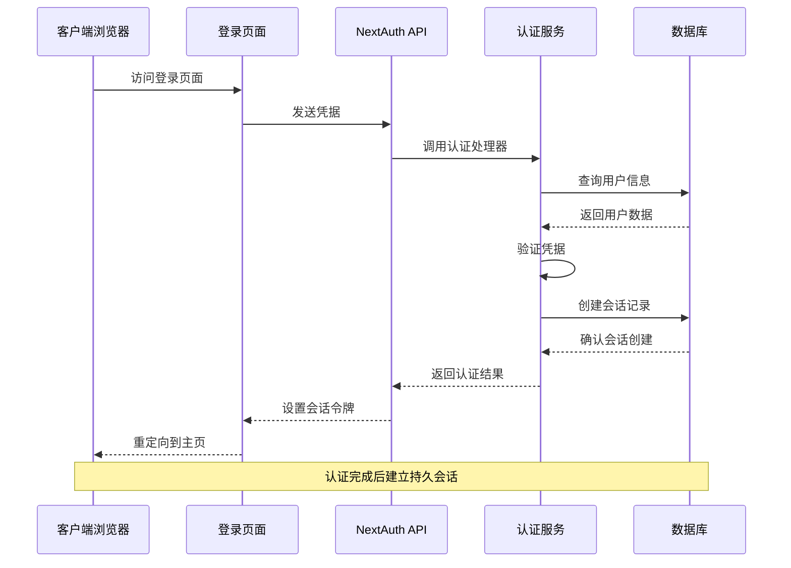
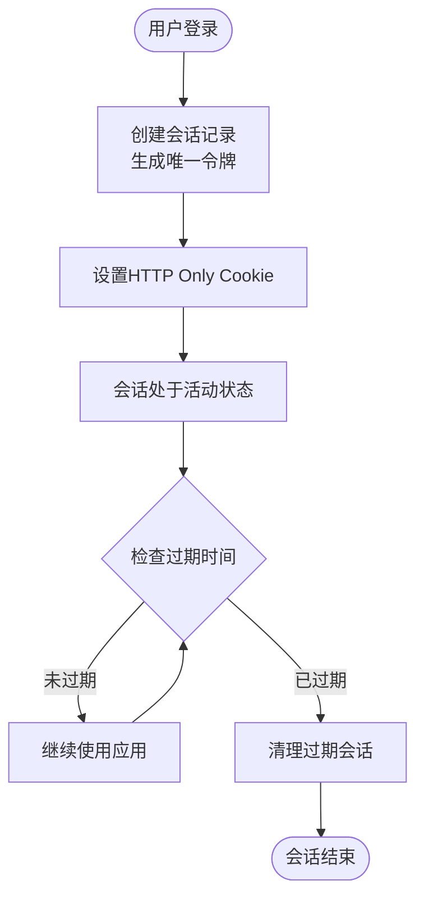
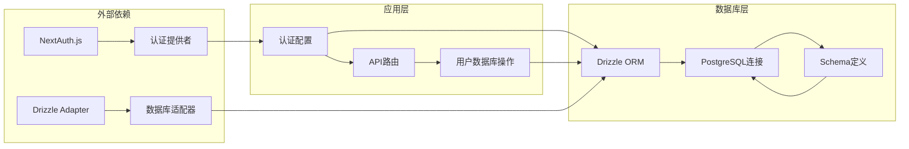
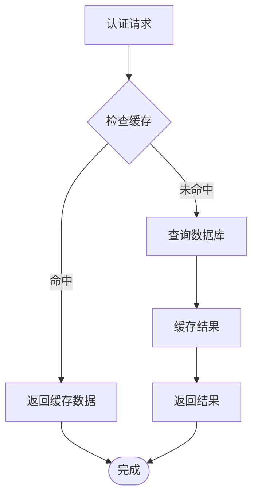
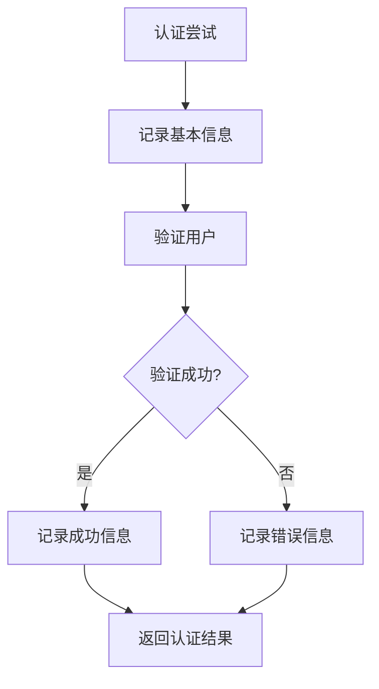

# 认证相关实体模型

<cite>
**本文档引用的文件**
- [src/lib/schema.ts](file://src/lib/schema.ts)
- [src/auth.ts](file://src/auth.ts)
- [src/app/api/auth/[...nextauth]/route.ts](file://src/app/api/auth/[...nextauth]/route.ts)
- [src/lib/database.ts](file://src/lib/database.ts)
- [src/app/login/page.tsx](file://src/app/login/page.tsx)
- [src/lib/drizzle.ts](file://src/lib/drizzle.ts)
- [drizzle.config.ts](file://drizzle.config.ts)
- [package.json](file://package.json)
</cite>

## 目录
1. [简介](#简介)
2. [项目结构](#项目结构)
3. [核心组件](#核心组件)
4. [架构概览](#架构概览)
5. [详细组件分析](#详细组件分析)
6. [依赖关系分析](#依赖关系分析)
7. [性能考虑](#性能考虑)
8. [故障排除指南](#故障排除指南)
9. [结论](#结论)

## 简介

本文件详细描述了基于 NextAuth.js 的认证系统中涉及的实体模型，包括账户表(accounts)、会话表(sessions)和验证码表(verification_tokens)的数据结构设计。文档涵盖了字段定义、数据类型、约束条件、外键关系以及安全机制，并提供了完整的认证流程说明和最佳实践指导。

## 项目结构

认证系统在项目中的组织结构如下：

```mermaid
graph TB
subgraph "认证相关文件"
A[src/lib/schema.ts] --> B[实体模型定义]
C[src/auth.ts] --> D[认证配置]
E[src/app/api/auth/[...nextauth]/route.ts] --> F[API路由处理]
G[src/app/login/page.tsx] --> H[登录界面]
end
subgraph "数据库层"
I[src/lib/database.ts] --> J[用户数据库操作]
K[src/lib/drizzle.ts] --> L[数据库连接]
M[drizzle.config.ts] --> N[数据库配置]
end
subgraph "依赖管理"
O[package.json] --> P[NextAuth依赖]
Q[package.json] --> R[Drizzle ORM依赖]
end
A --> I
C --> E
E --> A
```

**图表来源**
- [src/lib/schema.ts](file://src/lib/schema.ts#L1-L162)
- [src/auth.ts](file://src/auth.ts#L1-L114)
- [src/app/api/auth/[...nextauth]/route.ts](file://src/app/api/auth/[...nextauth]/route.ts#L1-L7)

**章节来源**
- [src/lib/schema.ts](file://src/lib/schema.ts#L1-L162)
- [src/auth.ts](file://src/auth.ts#L1-L114)
- [src/app/api/auth/[...nextauth]/route.ts](file://src/app/api/auth/[...nextauth]/route.ts#L1-L7)

## 核心组件

### 实体模型概述

认证系统主要包含以下三个核心实体表：

1. **accounts 表** - 存储用户的身份提供商账户信息
2. **sessions 表** - 管理会话令牌和过期时间
3. **verification_tokens 表** - 处理邮箱验证和密码重置令牌

每个实体都遵循统一的设计原则：
- 主键使用 UUID 文本类型
- 所有表都包含创建时间和更新时间戳
- 采用级联删除确保数据一致性
- 字段命名遵循下划线分隔规范

**章节来源**
- [src/lib/schema.ts](file://src/lib/schema.ts#L100-L137)

## 架构概览

认证系统的整体架构采用分层设计，确保安全性和可维护性：



**图表来源**
- [src/app/login/page.tsx](file://src/app/login/page.tsx#L20-L43)
- [src/app/api/auth/[...nextauth]/route.ts](file://src/app/api/auth/[...nextauth]/route.ts#L1-L7)
- [src/auth.ts](file://src/auth.ts#L14-L81)

## 详细组件分析

### 账户表 (accounts)

账户表负责存储用户通过各种身份提供商创建的账户信息：

#### 字段定义

| 字段名 | 数据类型 | 约束条件 | 描述 |
|--------|----------|----------|------|
| id | text | PRIMARY KEY | 账户唯一标识符 |
| user_id | text | NOT NULL, REFERENCES users(id) ON DELETE CASCADE | 外键关联用户表 |
| type | text | NOT NULL | 身份提供商类型 |
| provider | text | NOT NULL | 具体提供商名称 |
| provider_account_id | text | NOT NULL | 提供商内部用户ID |
| refresh_token | text | NULL | 刷新令牌 |
| access_token | text | NULL | 访问令牌 |
| expires_at | integer | NULL | 令牌过期时间戳 |
| token_type | text | NULL | 令牌类型 |
| scope | text | NULL | 权限范围 |
| id_token | text | NULL | ID令牌 |
| session_state | text | NULL | 会话状态 |

#### 外键关系

账户表与用户表建立了一对多的关系：
- `user_id` 字段引用 `users.id`
- 采用级联删除策略，当用户被删除时，其所有账户记录也会自动删除

#### 安全特性

- 所有敏感令牌字段都设置为可空，避免明文存储
- 使用整数类型的过期时间戳便于快速比较
- 支持多种身份提供商的标准化存储

**章节来源**
- [src/lib/schema.ts](file://src/lib/schema.ts#L101-L116)

### 会话表 (sessions)

会话表管理用户的登录会话状态和生命周期：

#### 字段定义

| 字段名 | 数据类型 | 约束条件 | 描述 |
|--------|----------|----------|------|
| id | text | PRIMARY KEY | 会话唯一标识符 |
| session_token | text | NOT NULL, UNIQUE | 会话令牌值 |
| user_id | text | NOT NULL, REFERENCES users(id) ON DELETE CASCADE | 外键关联用户表 |
| expires | timestamp | NOT NULL | 会话过期时间 |

#### 会话安全机制

会话表实现了多层次的安全保护：

1. **令牌唯一性**：`session_token` 字段具有唯一约束，防止令牌冲突
2. **时间控制**：`expires` 字段精确控制会话有效期
3. **级联清理**：用户删除时自动清理相关会话记录
4. **数据库约束**：强制保证数据完整性

#### 会话生命周期



**图表来源**
- [src/lib/schema.ts](file://src/lib/schema.ts#L118-L125)

**章节来源**
- [src/lib/schema.ts](file://src/lib/schema.ts#L118-L125)

### 验证码表 (verification_tokens)

验证码表专门处理邮箱验证和密码重置功能：

#### 字段定义

| 字段名 | 数据类型 | 约束条件 | 描述 |
|--------|----------|----------|------|
| identifier | text | NOT NULL | 标识符（通常是邮箱地址） |
| token | text | NOT NULL, UNIQUE | 验证令牌 |
| expires | timestamp | NOT NULL | 令牌过期时间 |

#### 复合主键设计

验证码表采用复合主键设计：
- `(identifier, token)` 组合作为主键
- 确保同一标识符下的令牌唯一性
- 防止令牌重复使用

#### 过期处理机制

验证码表实现了严格的过期控制：
- `expires` 字段精确控制令牌有效期
- 系统自动清理过期的验证码记录
- 防止令牌被恶意重复使用

**章节来源**
- [src/lib/schema.ts](file://src/lib/schema.ts#L127-L137)

## 依赖关系分析

### 数据库连接架构



**图表来源**
- [src/lib/drizzle.ts](file://src/lib/drizzle.ts#L1-L12)
- [src/lib/database.ts](file://src/lib/database.ts#L1-L692)
- [drizzle.config.ts](file://drizzle.config.ts#L1-L11)

### 认证流程依赖

认证系统的关键依赖关系：

1. **认证配置依赖**：`src/auth.ts` 依赖 `src/lib/database.ts` 进行用户验证
2. **API路由依赖**：`src/app/api/auth/[...nextauth]/route.ts` 依赖 `src/auth.ts` 提供认证选项
3. **数据库适配**：使用 `@auth/drizzle-adapter` 实现数据库驱动的认证存储
4. **ORM集成**：通过 `drizzle-orm` 提供类型安全的数据库操作

**章节来源**
- [src/auth.ts](file://src/auth.ts#L1-L114)
- [src/app/api/auth/[...nextauth]/route.ts](file://src/app/api/auth/[...nextauth]/route.ts#L1-L7)
- [src/lib/database.ts](file://src/lib/database.ts#L1-L692)

## 性能考虑

### 数据库优化策略

1. **索引设计**：所有外键字段都应建立适当的索引以提高查询性能
2. **连接池管理**：使用 `prepare: false` 配置避免预取问题
3. **查询优化**：合理使用 `LIMIT 1` 优化单条记录查询
4. **事务处理**：对于复杂的认证操作使用事务确保数据一致性

### 缓存策略



### 安全性能平衡

- **令牌加密**：使用强加密算法保护敏感令牌
- **过期策略**：合理的过期时间平衡安全性与用户体验
- **日志审计**：记录关键认证事件但避免泄露敏感信息

## 故障排除指南

### 常见问题及解决方案

#### 认证失败问题

**问题症状**：用户无法登录，系统返回认证失败

**可能原因**：
1. 用户状态不是 ACTIVE
2. 密码不匹配
3. 用户不存在
4. 凭证参数缺失

**解决步骤**：
1. 检查用户状态是否为 ACTIVE
2. 验证密码是否正确
3. 确认用户邮箱是否存在于数据库
4. 确保登录表单包含完整的凭据

#### 会话过期问题

**问题症状**：用户登录后很快被登出

**可能原因**：
1. 会话过期时间设置过短
2. 服务器时间不同步
3. 数据库连接问题

**解决步骤**：
1. 检查会话过期时间配置
2. 同步服务器时间
3. 验证数据库连接稳定性

#### 令牌冲突问题

**问题症状**：多个用户使用相同的会话令牌

**可能原因**：
1. 会话令牌生成算法问题
2. 数据库唯一约束失效
3. 并发访问冲突

**解决步骤**：
1. 检查会话令牌生成逻辑
2. 验证数据库唯一约束
3. 实施并发控制机制

### 调试工具和方法

#### 日志分析

系统提供了详细的日志记录功能：



#### 数据库检查

1. **用户表检查**：确认用户状态和密码字段
2. **会话表检查**：验证会话令牌和过期时间
3. **账户表检查**：确认用户账户关联关系

**章节来源**
- [src/auth.ts](file://src/auth.ts#L24-L30)
- [src/auth.ts](file://src/auth.ts#L76-L78)

## 结论

本认证系统通过精心设计的实体模型和安全机制，为应用程序提供了可靠的身份认证服务。核心特点包括：

1. **完整的关系设计**：清晰的外键关系确保数据一致性
2. **多层次安全保护**：从令牌管理到会话控制的全方位安全保障
3. **灵活的扩展性**：支持多种身份提供商和自定义认证需求
4. **完善的监控机制**：详细的日志记录便于问题诊断和性能优化

建议在生产环境中：
- 定期审查和更新安全配置
- 监控认证系统的性能指标
- 实施定期的安全审计
- 建立完善的备份和恢复机制

通过遵循这些最佳实践，可以确保认证系统的稳定运行和持续安全。