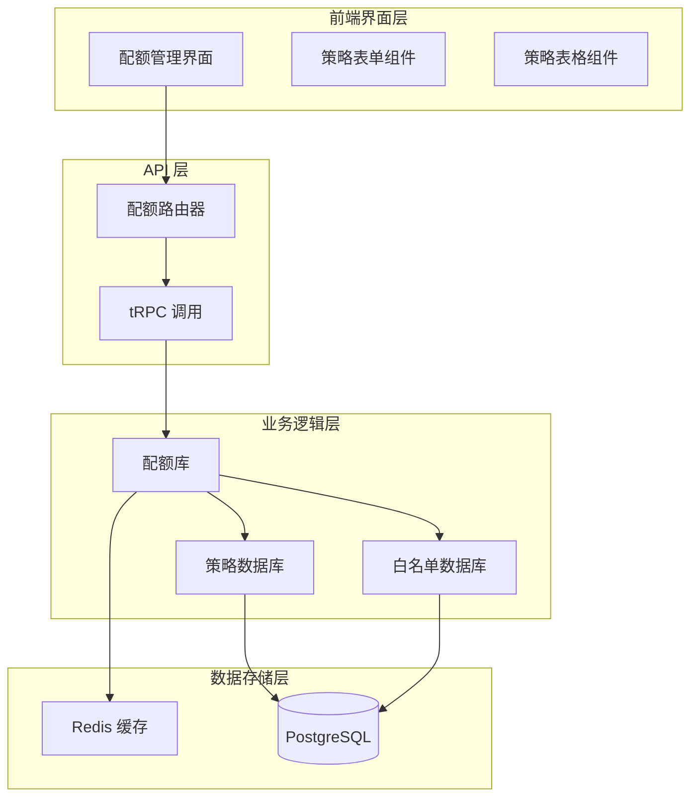
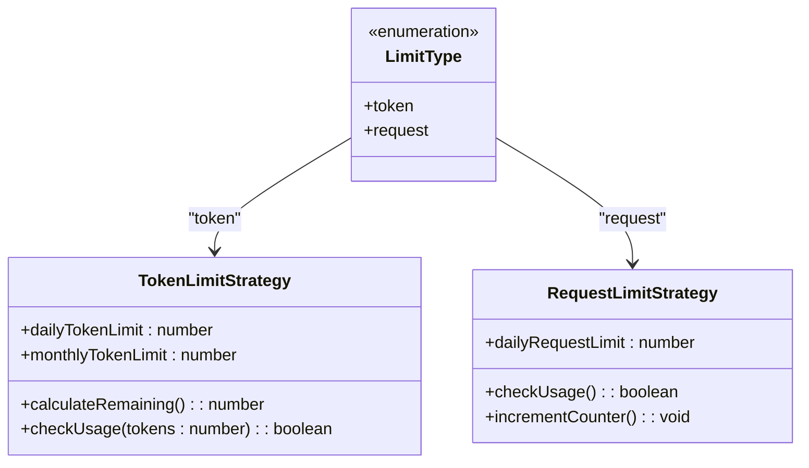
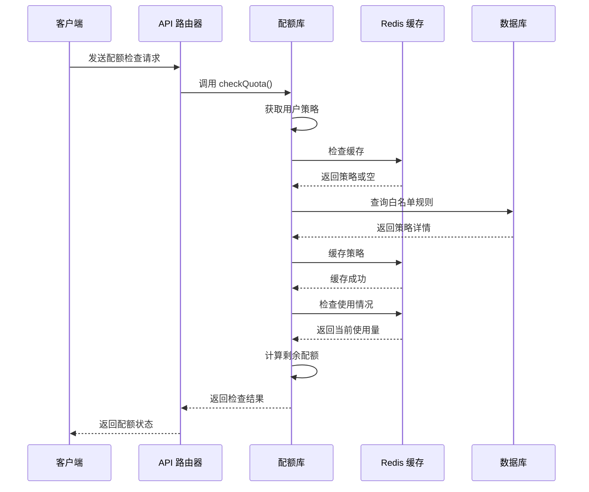
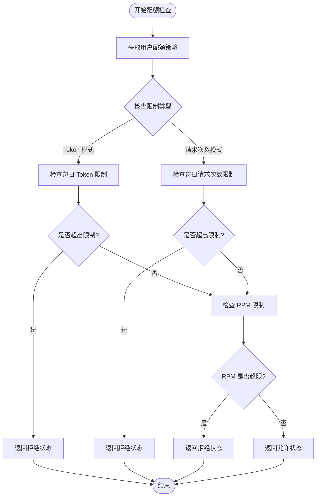
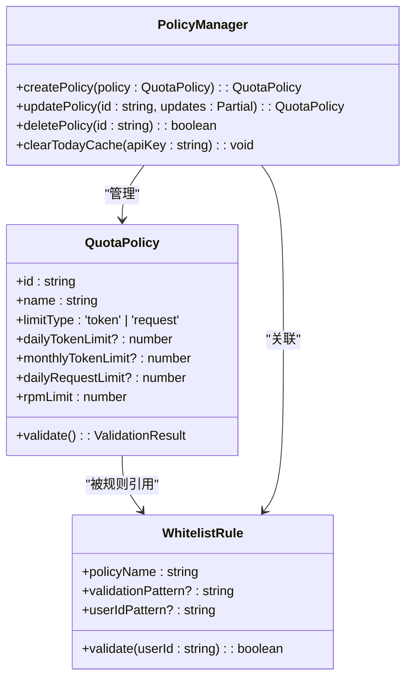
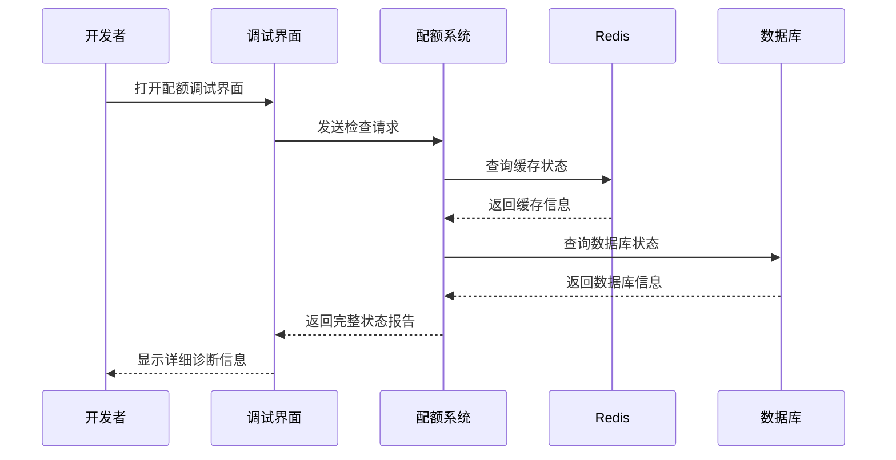

# 配额策略实体模型

<cite>
**本文档引用的文件**
- [quota.ts](file://src/lib/quota.ts)
- [quota.ts](file://src/server/api/routers/quota.ts)
- [schema.ts](file://src/lib/schema.ts)
- [types.ts](file://src/lib/types.ts)
- [database.ts](file://src/lib/database.ts)
- [redis.ts](file://src/lib/redis.ts)
- [date.ts](file://src/lib/date.ts)
- [policy-form.tsx](file://src/app/(dashboard)/quotas/components/policy-form.tsx)
- [policy-table.tsx](file://src/app/(dashboard)/quotas/components/policy-table.tsx)
- [page.tsx](file://src/app/(dashboard)/quotas/page.tsx)
- [quota-debug/types.ts](file://src/app/(dashboard)/debug/components/quota-debug/types.ts)
</cite>

## 目录
1. [简介](#简介)
2. [项目结构](#项目结构)
3. [核心组件](#核心组件)
4. [架构概览](#架构概览)
5. [详细组件分析](#详细组件分析)
6. [依赖关系分析](#依赖关系分析)
7. [性能考虑](#性能考虑)
8. [故障排除指南](#故障排除指南)
9. [结论](#结论)

## 简介

配额策略实体模型是 AIGate 系统中的核心功能模块，负责管理用户对 AI 服务的使用限制。该系统提供了灵活的配额管理机制，支持基于 Token 数量和请求次数的不同限制模式，并实现了智能的缓存和过期机制。

本系统采用 Redis 作为主要的存储引擎来跟踪实时使用情况，同时使用 PostgreSQL 作为持久化存储来保存策略配置和用量记录。通过这种混合存储架构，系统能够在保证高并发性能的同时提供准确的配额控制。

## 项目结构

配额策略功能分布在多个层次中，形成了清晰的分层架构：



**图表来源**
- [quota.ts](file://src/lib/quota.ts#L1-L327)
- [quota.ts](file://src/server/api/routers/quota.ts#L1-L221)
- [schema.ts](file://src/lib/schema.ts#L1-L162)

**章节来源**
- [quota.ts](file://src/lib/quota.ts#L1-L327)
- [quota.ts](file://src/server/api/routers/quota.ts#L1-L221)
- [schema.ts](file://src/lib/schema.ts#L1-L162)

## 核心组件

### 配额策略表结构

配额策略表是整个系统的核心数据结构，定义了用户使用限制的所有参数：

| 字段名 | 数据类型 | 约束条件 | 描述 |
|--------|----------|----------|------|
| id | text | PRIMARY KEY | 策略唯一标识符 |
| name | text | NOT NULL | 策略名称 |
| description | text | NULL | 策略描述 |
| limitType | text | NOT NULL, DEFAULT 'token' | 限制类型枚举 |
| dailyTokenLimit | integer | NULL | 每日 Token 限制 |
| monthlyTokenLimit | integer | NULL | 每月 Token 限制 |
| dailyRequestLimit | integer | NULL | 每日请求次数限制 |
| rpmLimit | integer | NOT NULL, DEFAULT 60 | 每分钟请求次数限制 |
| createdAt | timestamp | NOT NULL, DEFAULT NOW() | 创建时间 |
| updatedAt | timestamp | NOT NULL, DEFAULT NOW() | 更新时间 |

### 限制类型枚举设计

系统支持两种主要的限制类型，每种类型都有其特定的应用场景：



**图表来源**
- [schema.ts](file://src/lib/schema.ts#L25-L40)
- [types.ts](file://src/lib/types.ts#L4-L15)

**章节来源**
- [schema.ts](file://src/lib/schema.ts#L25-L40)
- [types.ts](file://src/lib/types.ts#L4-L15)

## 架构概览

配额策略系统的整体架构采用了分层设计，确保了高内聚低耦合的特性：



**图表来源**
- [quota.ts](file://src/lib/quota.ts#L78-L200)
- [quota.ts](file://src/server/api/routers/quota.ts#L103-L140)

## 详细组件分析

### 配额检查流程

配额检查是系统中最核心的功能，它负责实时验证用户的使用是否超出限制：



**图表来源**
- [quota.ts](file://src/lib/quota.ts#L78-L200)

### Redis 键值设计

系统使用精心设计的键命名规范来组织不同类型的配额数据：

| 键类型 | 命名模式 | 过期时间 | 用途 |
|--------|----------|----------|------|
| 用户每日配额 | `user_quota:{userId}:{date}:{apiKey}` | 7 天 | 存储每日 Token 使用量 |
| 用户每日请求 | `user_requests:{userId}:{date}:{apiKey}` | 7 天 | 存储每日请求次数 |
| 用户 RPM | `user_rpm:{userId}:{apiKey}:{minute}` | 2 分钟 | 存储每分钟请求次数 |
| 策略缓存 | `policy:apiKey:{apiKeyId}` | 1 小时 | 缓存配额策略 |
| 请求日志 | `request_log:{userId}:{requestId}` | 24 小时 | 存储请求详细信息 |

**章节来源**
- [quota.ts](file://src/lib/quota.ts#L203-L260)
- [redis.ts](file://src/lib/redis.ts#L18-L42)

### 时间维度计算机制

系统实现了多维度的时间窗口来精确控制用户使用：

```mermaid
graph LR
subgraph "时间维度"
Daily[每日] --> DailyKey[user_quota:{userId}:{YYYY-MM-DD}:{apiKey}]
Monthly[每月] --> MonthlyKey[user_quota:{userId}:{YYYY-MM}:{apiKey}]
Minute[每分钟] --> MinuteKey[user_rpm:{userId}:{apiKey}:{YYYY-MM-DD:HH:MM}]
end
subgraph "过期策略"
DailyKey --> DailyExpire[7 天过期]
MonthlyKey --> MonthExpire[30 天过期]
MinuteKey --> MinuteExpire[2 分钟过期]
end
subgraph "计算逻辑"
Daily --> CalcDaily[当日累计]
Minute --> CalcMinute[当前分钟计数]
end
```

**图表来源**
- [quota.ts](file://src/lib/quota.ts#L215-L227)
- [date.ts](file://src/lib/date.ts#L1-L17)

**章节来源**
- [quota.ts](file://src/lib/quota.ts#L215-L227)
- [date.ts](file://src/lib/date.ts#L1-L17)

### 策略组合与动态调整

系统支持复杂的策略组合和动态调整机制：



**图表来源**
- [quota.ts](file://src/server/api/routers/quota.ts#L103-L193)
- [database.ts](file://src/lib/database.ts#L332-L352)

**章节来源**
- [quota.ts](file://src/server/api/routers/quota.ts#L103-L193)
- [database.ts](file://src/lib/database.ts#L332-L352)

## 依赖关系分析

配额策略系统涉及多个组件之间的复杂交互关系：

```mermaid
graph TB
subgraph "核心依赖"
QuotaLib[src/lib/quota.ts]
Schema[src/lib/schema.ts]
Types[src/lib/types.ts]
Redis[src/lib/redis.ts]
Date[src/lib/date.ts]
end
subgraph "API 层"
QuotaRouter[src/server/api/routers/quota.ts]
Database[src/lib/database.ts]
end
subgraph "前端界面"
PolicyForm[src/app/(dashboard)/quotas/components/policy-form.tsx]
PolicyTable[src/app/(dashboard)/quotas/components/policy-table.tsx]
QuotasPage[src/app/(dashboard)/quotas/page.tsx]
end
QuotaLib --> Schema
QuotaLib --> Types
QuotaLib --> Redis
QuotaLib --> Date
QuotaRouter --> QuotaLib
QuotaRouter --> Database
PolicyForm --> QuotaRouter
PolicyTable --> QuotaRouter
QuotasPage --> PolicyForm
QuotasPage --> PolicyTable
```

**图表来源**
- [quota.ts](file://src/lib/quota.ts#L1-L7)
- [quota.ts](file://src/server/api/routers/quota.ts#L1-L8)

**章节来源**
- [quota.ts](file://src/lib/quota.ts#L1-L7)
- [quota.ts](file://src/server/api/routers/quota.ts#L1-L8)

## 性能考虑

系统在设计时充分考虑了性能优化：

### 缓存策略
- **策略缓存**: 配额策略缓存 1 小时，减少数据库查询压力
- **使用量缓存**: 当日使用量缓存 7 天，支持跨天自动重置
- **RPM 缓存**: 每分钟请求缓存 2 分钟，确保精确的速率控制

### 数据库优化
- **索引设计**: 在关键查询字段上建立适当索引
- **批量操作**: 支持批量清理过期数据
- **连接池**: 合理配置数据库连接池大小

### Redis 优化
- **内存管理**: 合理设置过期时间，避免内存泄漏
- **键命名**: 统一的键命名规范便于管理和维护
- **数据类型**: 使用合适的数据类型提高存储效率

## 故障排除指南

### 常见问题及解决方案

| 问题类型 | 症状 | 可能原因 | 解决方案 |
|----------|------|----------|----------|
| 配额检查失败 | 报错 "配额检查失败" | Redis 连接异常 | 检查 REDIS_URL 环境变量 |
| 策略不生效 | 用户仍然可以超过限制 | 缓存未更新 | 调用 clearTodayPolicy() 清理缓存 |
| 数据丢失 | 使用量统计不准确 | Redis 过期 | 检查过期时间设置 |
| 性能问题 | 响应时间过长 | 缓存命中率低 | 优化缓存策略 |

### 调试工具

系统提供了专门的调试工具来帮助诊断问题：



**图表来源**
- [quota-debug/types.ts](file://src/app/(dashboard)/debug/components/quota-debug/types.ts#L1-L36)

**章节来源**
- [quota-debug/types.ts](file://src/app/(dashboard)/debug/components/quota-debug/types.ts#L1-L36)

## 结论

配额策略实体模型通过精心设计的数据结构、高效的缓存机制和灵活的策略管理，为 AIGate 系统提供了强大的使用限制能力。系统支持多种限制模式，能够适应不同的业务需求，并通过智能的过期机制确保数据的准确性和时效性。

该系统的主要优势包括：
- **灵活性**: 支持 Token 限制和请求次数限制两种模式
- **高性能**: 基于 Redis 的缓存架构确保快速响应
- **可扩展性**: 模块化的架构便于功能扩展
- **易维护性**: 清晰的代码结构和完善的错误处理机制

通过合理使用本系统提供的功能，开发者可以轻松实现复杂的配额管理需求，为用户提供公平、稳定的 AI 服务体验。