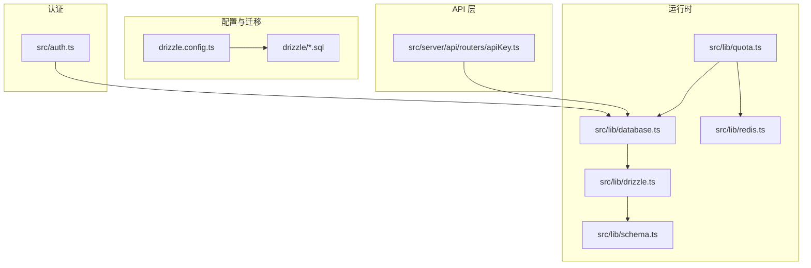
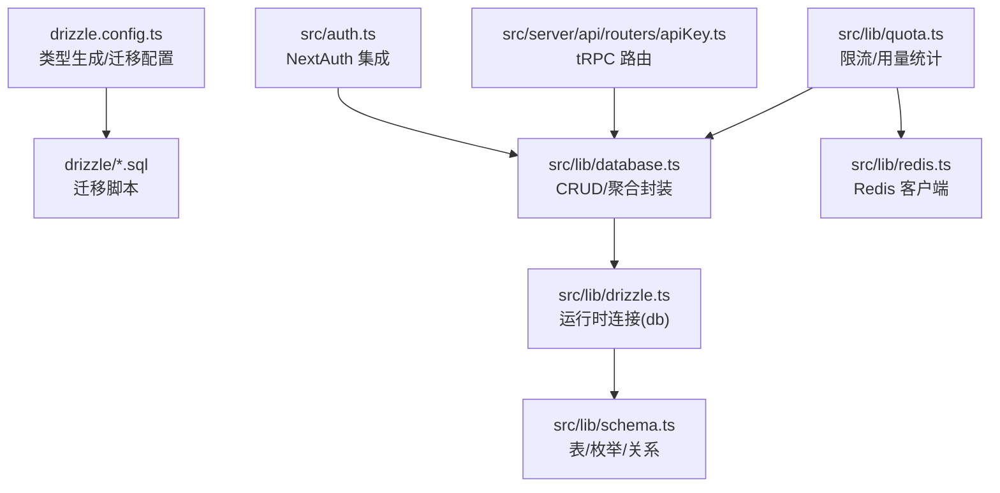
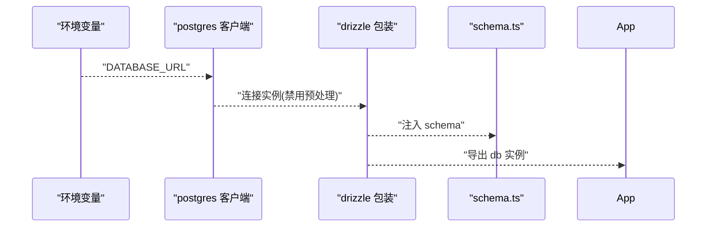
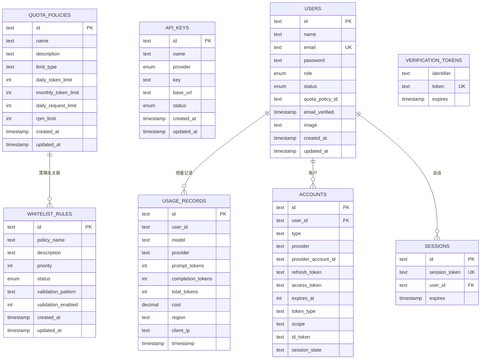
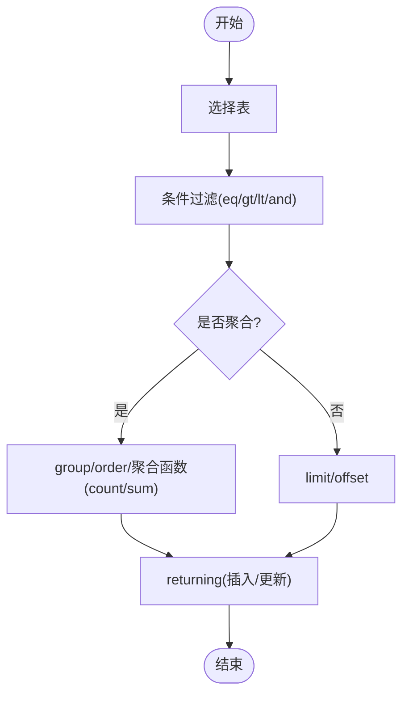
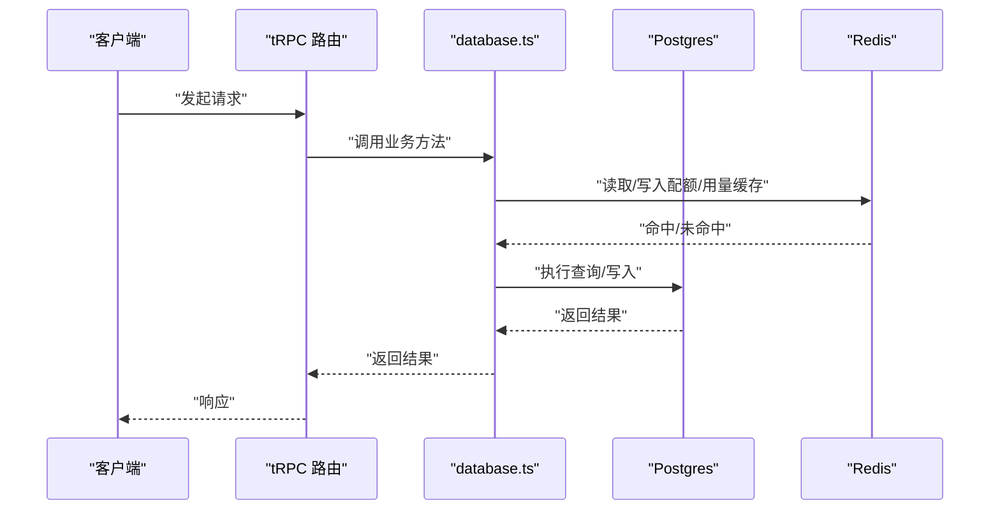
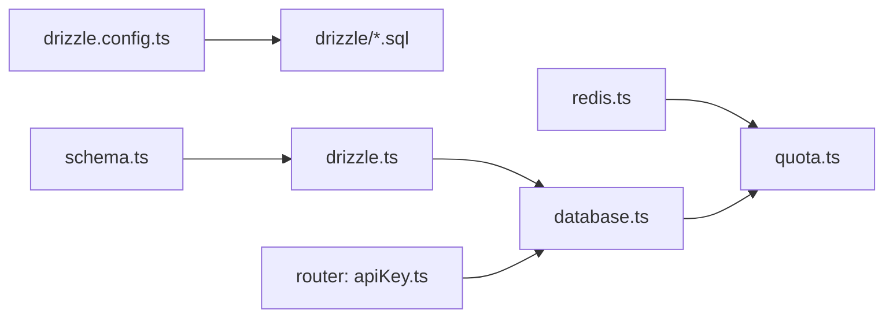

# Drizzle ORM 配置与使用

<cite>
**本文引用的文件**   
- [drizzle.config.ts](file://drizzle.config.ts)
- [src/lib/drizzle.ts](file://src/lib/drizzle.ts)
- [src/lib/schema.ts](file://src/lib/schema.ts)
- [src/lib/database.ts](file://src/lib/database.ts)
- [src/lib/quota.ts](file://src/lib/quota.ts)
- [src/lib/redis.ts](file://src/lib/redis.ts)
- [src/server/api/routers/apiKey.ts](file://src/server/api/routers/apiKey.ts)
- [src/auth.ts](file://src/auth.ts)
- [package.json](file://package.json)
- [drizzle/0009_add_daily_request_limit.sql](file://drizzle/0009_add_daily_request_limit.sql)
- [drizzle/0009_add_nextauth_tables.sql](file://drizzle/0009_add_nextauth_tables.sql)
- [Dockerfile.migrate](file://Dockerfile.migrate)
</cite>

## 目录
1. [简介](#简介)
2. [项目结构](#项目结构)
3. [核心组件](#核心组件)
4. [架构总览](#架构总览)
5. [详细组件分析](#详细组件分析)
6. [依赖关系分析](#依赖关系分析)
7. [性能考虑](#性能考虑)
8. [故障排查指南](#故障排查指南)
9. [结论](#结论)
10. [附录](#附录)

## 简介
本文件面向 AIGate 项目中 Drizzle ORM 的配置与使用，系统性地说明以下内容：
- 初始化配置：数据库连接、类型生成与运行时配置
- 连接池配置与管理：连接数、超时、复用策略
- 查询构建器：CRUD、复杂查询、联表与聚合
- 事务处理最佳实践：嵌套、错误处理与回滚
- 类型安全：返回类型推断与编译时类型检查
- 与 Next.js 集成与性能优化
- 提供可直接定位到源码路径的示例，便于快速上手

## 项目结构
AIGate 将 Drizzle ORM 的配置与使用集中在以下模块：
- 配置与迁移：drizzle.config.ts、drizzle/* 迁移脚本
- 运行时连接：src/lib/drizzle.ts
- 数据模型：src/lib/schema.ts
- 业务封装：src/lib/database.ts
- 限流与用量：src/lib/quota.ts、src/lib/redis.ts
- API 层调用：src/server/api/routers/apiKey.ts
- NextAuth 集成：src/auth.ts
- 工具链脚本：package.json 中的 db:* 命令

图表来源
- [drizzle.config.ts](file://drizzle.config.ts#L1-L11)
- [src/lib/drizzle.ts](file://src/lib/drizzle.ts#L1-L12)
- [src/lib/schema.ts](file://src/lib/schema.ts#L1-L159)
- [src/lib/database.ts](file://src/lib/database.ts#L1-L524)
- [src/lib/quota.ts](file://src/lib/quota.ts#L1-L334)
- [src/lib/redis.ts](file://src/lib/redis.ts#L1-L49)
- [src/server/api/routers/apiKey.ts](file://src/server/api/routers/apiKey.ts#L1-L462)
- [src/auth.ts](file://src/auth.ts#L1-L56)

章节来源
- [drizzle.config.ts](file://drizzle.config.ts#L1-L11)
- [src/lib/drizzle.ts](file://src/lib/drizzle.ts#L1-L12)
- [src/lib/schema.ts](file://src/lib/schema.ts#L1-L159)
- [src/lib/database.ts](file://src/lib/database.ts#L1-L524)
- [src/lib/quota.ts](file://src/lib/quota.ts#L1-L334)
- [src/lib/redis.ts](file://src/lib/redis.ts#L1-L49)
- [src/server/api/routers/apiKey.ts](file://src/server/api/routers/apiKey.ts#L1-L462)
- [src/auth.ts](file://src/auth.ts#L1-L56)

## 核心组件
- Drizzle 初始化与连接
  - 运行时连接：通过 postgres 客户端创建连接，禁用预处理以适配事务池模式；再由 drizzle 包装为可查询的 db 实例。
  - 类型生成与迁移：drizzle-kit 读取 schema 路径与数据库凭据，生成迁移与推送变更。

- 数据模型与类型
  - schema.ts 定义表结构、枚举与关系，导出类型推断，配合 Drizzle ORM 在编译期提供类型安全。

- 业务封装层
  - database.ts 对各表提供 CRUD 与聚合查询封装，统一错误处理与返回值结构。
  - quota.ts 结合 Redis 实现高并发限流与用量统计，同时落库记录用量明细。

- API 层集成
  - router 层通过 database.ts 调用底层查询，完成业务逻辑与数据持久化。

章节来源
- [src/lib/drizzle.ts](file://src/lib/drizzle.ts#L1-L12)
- [drizzle.config.ts](file://drizzle.config.ts#L1-L11)
- [src/lib/schema.ts](file://src/lib/schema.ts#L1-L159)
- [src/lib/database.ts](file://src/lib/database.ts#L1-L524)
- [src/lib/quota.ts](file://src/lib/quota.ts#L1-L334)
- [src/server/api/routers/apiKey.ts](file://src/server/api/routers/apiKey.ts#L1-L462)

## 架构总览
下图展示了 Drizzle ORM 在 AIGate 中的整体交互：配置驱动迁移，运行时通过 drizzle.ts 建立连接，业务层通过 database.ts 统一访问，限流与用量通过 quota.ts/redis.ts 协同，API 层通过 tRPC 调用数据库。

图表来源
- [drizzle.config.ts](file://drizzle.config.ts#L1-L11)
- [src/lib/drizzle.ts](file://src/lib/drizzle.ts#L1-L12)
- [src/lib/schema.ts](file://src/lib/schema.ts#L1-L159)
- [src/lib/database.ts](file://src/lib/database.ts#L1-L524)
- [src/lib/quota.ts](file://src/lib/quota.ts#L1-L334)
- [src/lib/redis.ts](file://src/lib/redis.ts#L1-L49)
- [src/server/api/routers/apiKey.ts](file://src/server/api/routers/apiKey.ts#L1-L462)
- [src/auth.ts](file://src/auth.ts#L1-L56)

## 详细组件分析

### Drizzle 初始化与连接配置
- 运行时连接
  - 使用 postgres 客户端建立连接，设置禁用预处理以适配事务池模式。
  - 将 schema 注入 drizzle，得到类型安全的 db 实例。
- 类型生成与迁移
  - drizzle.config.ts 指定 schema 文件路径、输出目录、方言与数据库凭据。
  - 通过 package.json 中的 db:* 脚本执行生成、推送与迁移。

图表来源
- [src/lib/drizzle.ts](file://src/lib/drizzle.ts#L1-L12)
- [drizzle.config.ts](file://drizzle.config.ts#L1-L11)

章节来源
- [src/lib/drizzle.ts](file://src/lib/drizzle.ts#L1-L12)
- [drizzle.config.ts](file://drizzle.config.ts#L1-L11)
- [package.json](file://package.json#L6-L17)

### 数据模型与类型安全
- 表结构与枚举
  - 定义配额策略、API Key、用量记录、用户、白名单规则及 NextAuth 相关表。
  - 使用 pgEnum 定义枚举类型，保证字段取值受控。
- 关系与类型推断
  - relations 定义表间关系，$inferSelect/$inferInsert 导出类型，实现编译期类型检查。
- 迁移增强
  - 0009_* 迁移新增每日请求限制与 NextAuth 表结构，体现演进过程。

图表来源
- [src/lib/schema.ts](file://src/lib/schema.ts#L1-L159)
- [drizzle/0009_add_daily_request_limit.sql](file://drizzle/0009_add_daily_request_limit.sql#L1-L9)
- [drizzle/0009_add_nextauth_tables.sql](file://drizzle/0009_add_nextauth_tables.sql#L1-L33)

章节来源
- [src/lib/schema.ts](file://src/lib/schema.ts#L1-L159)
- [drizzle/0009_add_daily_request_limit.sql](file://drizzle/0009_add_daily_request_limit.sql#L1-L9)
- [drizzle/0009_add_nextauth_tables.sql](file://drizzle/0009_add_nextauth_tables.sql#L1-L33)

### 查询构建器使用：CRUD、复杂查询、联表与聚合
- CRUD 示例
  - API Key：全量查询、按提供商过滤、按 ID 查询、插入、更新（带时间戳）、删除。
  - 配额策略：全量查询、按 ID 查询、插入（自动生成 ID 与时间戳）、更新、删除。
  - 用量记录：全量查询、按用户 ID 查询、按时间范围查询、插入、聚合统计。
  - 白名单规则：全量查询、按 ID 查询、插入、更新、删除、切换状态、按状态筛选、匹配用户策略、校验用户、统计。
- 复杂查询与聚合
  - 使用 and/gte/lte、count/countDistinct/sum 等进行条件组合与聚合统计。
  - 并发统计：Promise.all 同步拉取多指标，减少往返。
- 联表查询
  - schema 中定义了策略与规则的关系，可在查询时 join 获取关联数据（例如按策略名关联）。

图表来源
- [src/lib/database.ts](file://src/lib/database.ts#L1-L524)

章节来源
- [src/lib/database.ts](file://src/lib/database.ts#L1-L524)

### 事务处理最佳实践
- 当前实现
  - 运行时连接通过 postgres 客户端创建，drizzle 包装为 db 实例；未显式使用事务 API。
- 最佳实践建议
  - 显式开启事务：在需要强一致性的场景（如扣减配额与写入用量）使用事务包裹。
  - 错误处理：捕获异常后回滚，避免部分提交导致不一致。
  - 嵌套事务：若底层驱动支持 savepoint，可分层控制；否则需避免嵌套。
  - 超时与重试：结合连接池超时参数与指数退避策略，提升稳定性。
- 注意事项
  - 项目中已禁用预处理以适配事务池模式，确保事务可用性。

章节来源
- [src/lib/drizzle.ts](file://src/lib/drizzle.ts#L7-L9)

### 类型安全查询：返回类型推断与编译时检查
- $inferSelect/$inferInsert
  - schema.ts 导出类型，database.ts 在返回值与参数中使用，实现编译期类型检查。
- 联动验证
  - tRPC 路由层使用 Zod Schema 对输入进行运行时校验，与 Drizzle 类型形成双重保障。

章节来源
- [src/lib/schema.ts](file://src/lib/schema.ts#L145-L159)
- [src/lib/database.ts](file://src/lib/database.ts#L6-L15)
- [src/server/api/routers/apiKey.ts](file://src/server/api/routers/apiKey.ts#L1-L462)

### 与 Next.js 集成与性能优化
- Next.js 集成
  - NextAuth 通过 src/auth.ts 配置，与 Drizzle 适配器结合使用，实现用户认证与会话管理。
  - API 路由通过 tRPC 调用 database.ts，实现前后端一致的数据访问层。
- 性能优化
  - 连接池：使用 postgres 客户端默认连接池能力，结合禁用预处理以适配事务模式。
  - 限流与缓存：quota.ts 与 redis.ts 协同，将高频统计与配额检查前置到 Redis，降低数据库压力。
  - 批量统计：database.ts 使用 Promise.all 并发拉取多个聚合指标，减少往返。
  - 迁移与构建：Dockerfile.migrate 在容器内执行 db:migrate，确保部署一致性。

图表来源
- [src/server/api/routers/apiKey.ts](file://src/server/api/routers/apiKey.ts#L1-L462)
- [src/lib/database.ts](file://src/lib/database.ts#L1-L524)
- [src/lib/quota.ts](file://src/lib/quota.ts#L1-L334)
- [src/lib/redis.ts](file://src/lib/redis.ts#L1-L49)

章节来源
- [src/auth.ts](file://src/auth.ts#L1-L56)
- [src/server/api/routers/apiKey.ts](file://src/server/api/routers/apiKey.ts#L1-L462)
- [src/lib/quota.ts](file://src/lib/quota.ts#L1-L334)
- [src/lib/redis.ts](file://src/lib/redis.ts#L1-L49)
- [Dockerfile.migrate](file://Dockerfile.migrate#L1-L14)

## 依赖关系分析
- drizzle.config.ts 与 drizzle/* 迁移脚本共同驱动 schema 的演进与同步。
- src/lib/drizzle.ts 依赖 schema.ts 并导出 db，被 database.ts 等模块消费。
- quota.ts 依赖 redis.ts 与 database.ts，形成“缓存 + 数据库”的双写策略。
- router 层依赖 database.ts，实现业务与数据的解耦。

图表来源
- [drizzle.config.ts](file://drizzle.config.ts#L1-L11)
- [src/lib/schema.ts](file://src/lib/schema.ts#L1-L159)
- [src/lib/drizzle.ts](file://src/lib/drizzle.ts#L1-L12)
- [src/lib/database.ts](file://src/lib/database.ts#L1-L524)
- [src/lib/quota.ts](file://src/lib/quota.ts#L1-L334)
- [src/lib/redis.ts](file://src/lib/redis.ts#L1-L49)
- [src/server/api/routers/apiKey.ts](file://src/server/api/routers/apiKey.ts#L1-L462)

章节来源
- [drizzle.config.ts](file://drizzle.config.ts#L1-L11)
- [src/lib/schema.ts](file://src/lib/schema.ts#L1-L159)
- [src/lib/drizzle.ts](file://src/lib/drizzle.ts#L1-L12)
- [src/lib/database.ts](file://src/lib/database.ts#L1-L524)
- [src/lib/quota.ts](file://src/lib/quota.ts#L1-L334)
- [src/lib/redis.ts](file://src/lib/redis.ts#L1-L49)
- [src/server/api/routers/apiKey.ts](file://src/server/api/routers/apiKey.ts#L1-L462)

## 性能考虑
- 连接池与复用
  - 使用 postgres 客户端默认连接池；禁用预处理以适配事务模式。
- 缓存优先
  - Redis 缓存配额策略、每日用量、每分钟请求等热点数据，显著降低数据库负载。
- 并发统计
  - 使用 Promise.all 并发拉取多个聚合指标，减少网络往返。
- 迁移与部署
  - Dockerfile.migrate 在容器内执行 db:migrate，确保生产环境一致性与可重复性。

章节来源
- [src/lib/drizzle.ts](file://src/lib/drizzle.ts#L7-L9)
- [src/lib/quota.ts](file://src/lib/quota.ts#L1-L334)
- [src/lib/database.ts](file://src/lib/database.ts#L236-L257)
- [Dockerfile.migrate](file://Dockerfile.migrate#L1-L14)

## 故障排查指南
- 连接问题
  - 确认 DATABASE_URL 环境变量有效；检查数据库可达性与凭据。
- 迁移失败
  - 使用 db:migrate/db:push/db:generate 检查 schema 与迁移脚本是否匹配。
- 类型错误
  - schema 变更后重新生成类型或执行迁移，确保编译通过。
- 事务相关
  - 若出现事务不可用，确认已禁用预处理且连接池模式支持事务。
- 缓存异常
  - Redis 连接失败不影响主流程，但会降低性能；检查 REDIS_URL 与网络连通性。

章节来源
- [drizzle.config.ts](file://drizzle.config.ts#L7-L9)
- [package.json](file://package.json#L13-L16)
- [src/lib/drizzle.ts](file://src/lib/drizzle.ts#L7-L9)
- [src/lib/redis.ts](file://src/lib/redis.ts#L1-L16)

## 结论
AIGate 对 Drizzle ORM 的使用体现了“配置驱动迁移 + 类型安全 + 缓存优先 + 并发优化”的设计思路。通过 schema 的强类型约束与 database.ts 的统一封装，实现了清晰的业务边界；结合 quota.ts 与 Redis 的高并发限流方案，兼顾了性能与可靠性。建议在需要强一致性的关键路径引入显式事务，并持续完善监控与告警，以进一步提升系统的稳定性与可观测性。

## 附录
- 常用命令
  - 生成类型与迁移：db:generate
  - 推送变更：db:push
  - 执行迁移：db:migrate
  - 种子数据：db:seed
- 运行时连接与事务
  - 禁用预处理以适配事务池模式
- 迁移演进
  - 0009_* 迁移新增每日请求限制与 NextAuth 表结构

章节来源
- [package.json](file://package.json#L13-L16)
- [drizzle/0009_add_daily_request_limit.sql](file://drizzle/0009_add_daily_request_limit.sql#L1-L9)
- [drizzle/0009_add_nextauth_tables.sql](file://drizzle/0009_add_nextauth_tables.sql#L1-L33)