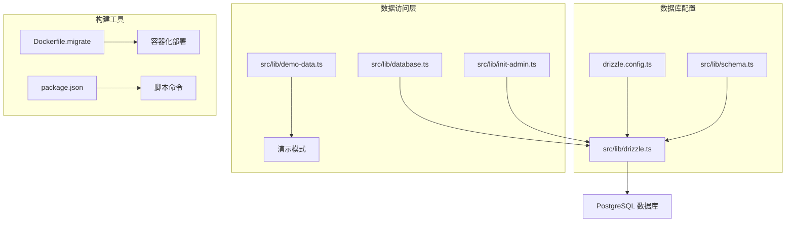
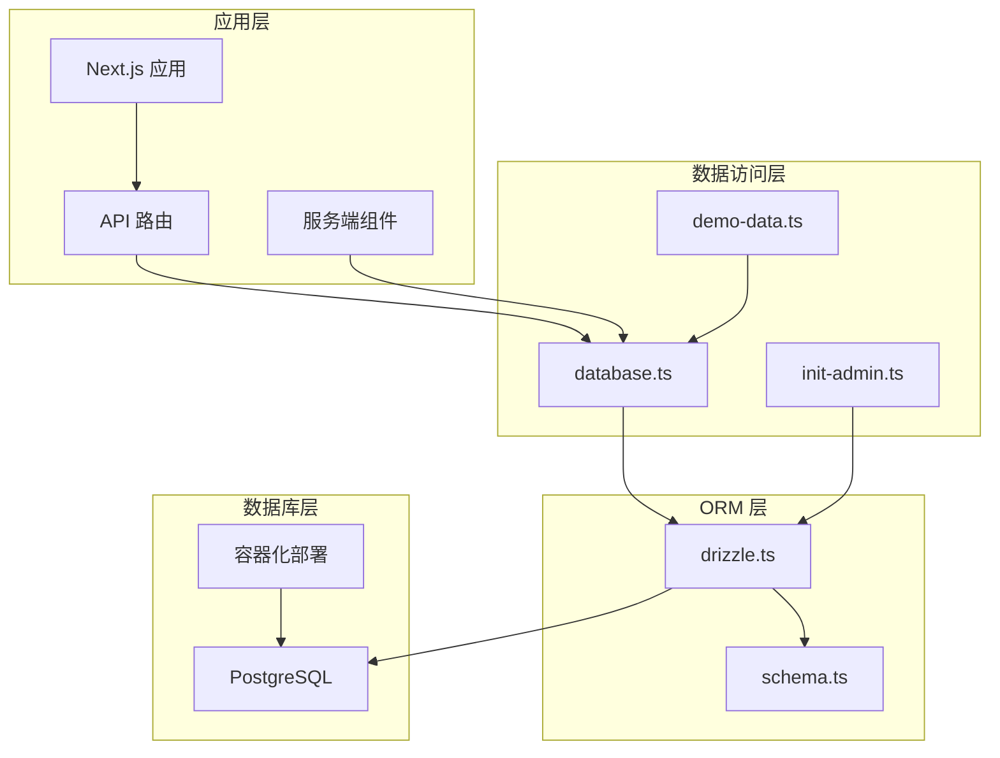
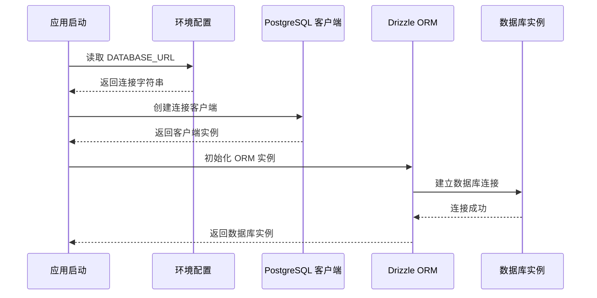
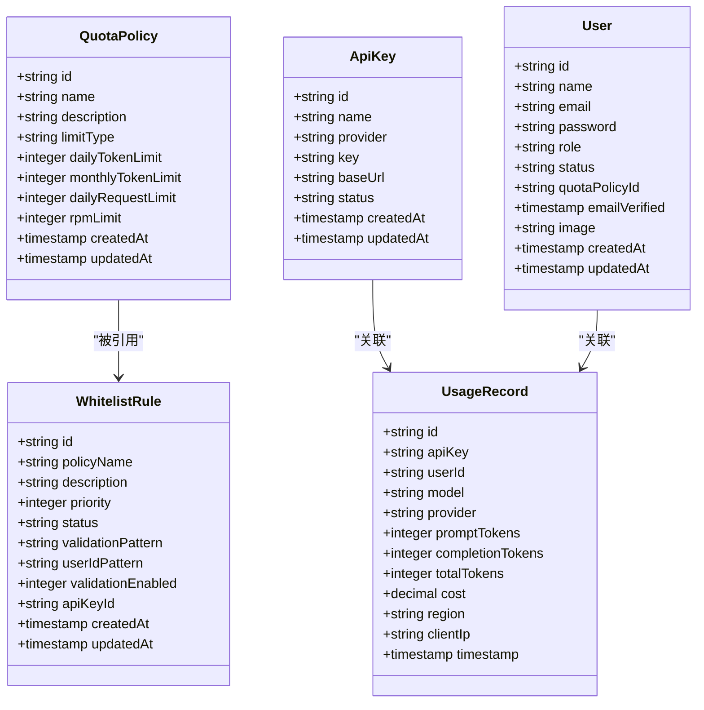
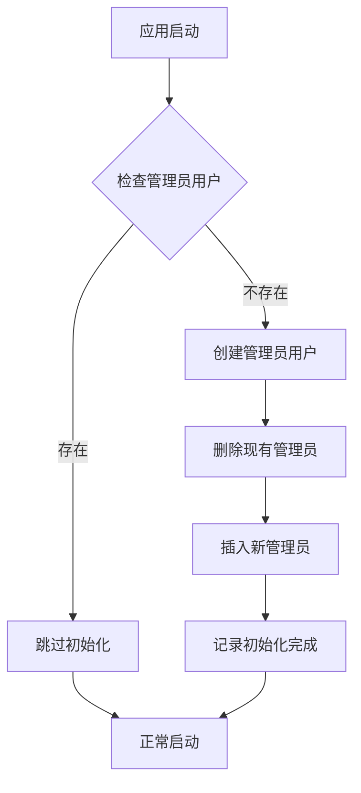
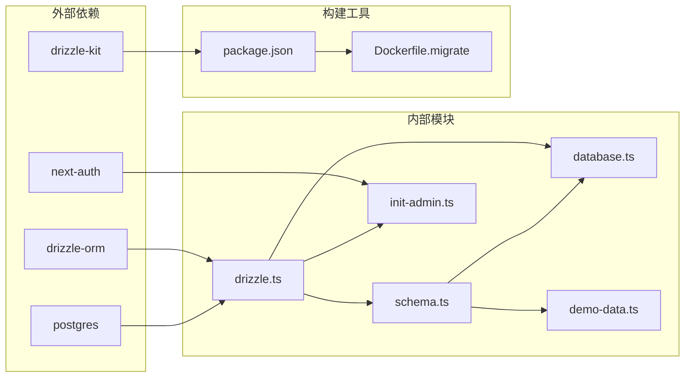

# 数据库初始化

<cite>
**本文档引用的文件**
- [drizzle.config.ts](file://drizzle.config.ts)
- [src/lib/drizzle.ts](file://src/lib/drizzle.ts)
- [src/lib/schema.ts](file://src/lib/schema.ts)
- [src/lib/database.ts](file://src/lib/database.ts)
- [Dockerfile.migrate](file://Dockerfile.migrate)
- [package.json](file://package.json)
- [src/lib/init-admin.ts](file://src/lib/init-admin.ts)
- [src/lib/demo-data.ts](file://src/lib/demo-data.ts)
</cite>

## 目录
1. [简介](#简介)
2. [项目结构](#项目结构)
3. [核心组件](#核心组件)
4. [架构概览](#架构概览)
5. [详细组件分析](#详细组件分析)
6. [依赖关系分析](#依赖关系分析)
7. [性能考虑](#性能考虑)
8. [故障排除指南](#故障排除指南)
9. [结论](#结论)

## 简介

本项目采用 Drizzle ORM 作为数据库抽象层，使用 PostgreSQL 作为主要数据库存储。数据库初始化是整个系统的核心基础设施，负责建立数据库连接、定义数据模型、执行迁移以及提供类型安全的数据访问接口。

项目实现了完整的数据库初始化流程，包括开发环境的本地数据库设置、生产环境的容器化部署、以及演示模式下的内存数据模拟。通过 Drizzle Kit 工具链，项目支持数据库模式的生成、推送和迁移管理。

## 项目结构

项目的数据库相关文件分布如下：

**图表来源**
- [drizzle.config.ts:1-11](file://drizzle.config.ts#L1-L11)
- [src/lib/drizzle.ts:1-12](file://src/lib/drizzle.ts#L1-L12)
- [src/lib/schema.ts:1-162](file://src/lib/schema.ts#L1-L162)

**章节来源**
- [drizzle.config.ts:1-11](file://drizzle.config.ts#L1-L11)
- [src/lib/drizzle.ts:1-12](file://src/lib/drizzle.ts#L1-L12)
- [src/lib/schema.ts:1-162](file://src/lib/schema.ts#L1-L162)

## 核心组件

### 数据库配置管理

项目使用 Drizzle Kit 进行数据库配置管理，通过 `drizzle.config.ts` 文件定义数据库连接参数和模式位置。

### 数据模型定义

数据模型通过 `src/lib/schema.ts` 文件集中定义，包含以下核心表结构：

- **配额策略表 (quota_policies)**: 管理不同类型的配额限制
- **API 密钥表 (api_keys)**: 存储第三方服务的认证密钥
- **用量记录表 (usage_records)**: 跟踪用户的 API 使用情况
- **用户表 (users)**: 系统用户信息管理
- **白名单规则表 (whitelist_rules)**: 控制用户访问权限的规则引擎

### 数据访问层

`src/lib/database.ts` 提供了完整的 CRUD 操作接口，支持多种查询模式和事务处理。

**章节来源**
- [src/lib/schema.ts:28-98](file://src/lib/schema.ts#L28-L98)
- [src/lib/database.ts:21-101](file://src/lib/database.ts#L21-L101)

## 架构概览

**图表来源**
- [src/lib/database.ts:1-850](file://src/lib/database.ts#L1-L850)
- [src/lib/drizzle.ts:1-12](file://src/lib/drizzle.ts#L1-L12)
- [src/lib/schema.ts:1-162](file://src/lib/schema.ts#L1-L162)

## 详细组件分析

### 数据库连接初始化

数据库连接通过 `src/lib/drizzle.ts` 文件建立，采用以下配置策略：

**图表来源**
- [src/lib/drizzle.ts:5-9](file://src/lib/drizzle.ts#L5-L9)

### 数据模型设计

数据模型采用 Drizzle ORM 的类型安全设计，每个表都有明确的字段定义和约束：

**图表来源**
- [src/lib/schema.ts:28-98](file://src/lib/schema.ts#L28-L98)

### 数据库操作接口

`src/lib/database.ts` 提供了完整的数据访问接口，包括：

#### API 密钥管理
- 获取所有 API 密钥
- 按提供商查询 API 密钥
- 创建、更新、删除 API 密钥
- 获取活跃的 API 密钥

#### 配额策略管理
- 管理配额策略的完整生命周期
- 支持按 ID 查询和批量操作

#### 用量记录管理
- 统计分析功能
- 时间范围查询
- 用户维度查询

#### 白名单规则管理
- 规则匹配算法
- 用户验证逻辑
- 权限控制机制

**章节来源**
- [src/lib/database.ts:21-800](file://src/lib/database.ts#L21-L800)

### 管理员用户初始化

系统提供了自动化的管理员用户初始化功能，确保应用启动时具备管理员账户：

**图表来源**
- [src/lib/init-admin.ts:9-40](file://src/lib/init-admin.ts#L9-L40)

**章节来源**
- [src/lib/init-admin.ts:1-40](file://src/lib/init-admin.ts#L1-L40)

### 演示模式支持

项目内置了完整的演示模式，通过 `src/lib/demo-data.ts` 提供内存中的数据模拟：

- 内存存储的数据结构
- 类型安全的 CRUD 操作
- 自动生成的演示数据
- 与真实数据库接口的兼容性

**章节来源**
- [src/lib/demo-data.ts:1-435](file://src/lib/demo-data.ts#L1-L435)

## 依赖关系分析

**图表来源**
- [package.json:48-71](file://package.json#L48-L71)
- [src/lib/drizzle.ts:1-3](file://src/lib/drizzle.ts#L1-L3)

### 核心依赖说明

- **drizzle-orm**: 主要的 ORM 框架，提供类型安全的数据库操作
- **postgres**: PostgreSQL 客户端驱动，处理数据库连接
- **drizzle-kit**: 数据库迁移和模式管理工具
- **next-auth**: 认证系统，与数据库集成

**章节来源**
- [package.json:20-94](file://package.json#L20-L94)

## 性能考虑

### 连接池优化

数据库连接采用了优化的配置策略：

- 禁用预取功能以支持事务模式
- 使用连接池管理数据库连接
- 支持高并发场景下的连接复用

### 查询性能

- 使用索引优化常用查询字段
- 实现批量操作减少数据库往返
- 提供统计查询的聚合函数支持

### 缓存策略

- 演示模式下的内存缓存
- Redis 集成支持会话和缓存
- 合理的缓存失效策略

## 故障排除指南

### 常见问题诊断

#### 数据库连接问题
- 检查 DATABASE_URL 环境变量配置
- 验证数据库服务状态
- 确认网络连接和防火墙设置

#### 迁移失败
- 检查数据库权限
- 验证模式定义的完整性
- 查看迁移日志获取详细错误信息

#### 性能问题
- 监控数据库连接池使用情况
- 分析慢查询日志
- 优化索引和查询语句

**章节来源**
- [src/lib/database.ts:27-32](file://src/lib/database.ts#L27-L32)
- [src/lib/drizzle.ts:7-9](file://src/lib/drizzle.ts#L7-L9)

## 结论

本项目的数据库初始化方案体现了现代 Web 应用的最佳实践：

1. **类型安全**: 通过 Drizzle ORM 提供完整的 TypeScript 支持
2. **可维护性**: 清晰的模块分离和职责划分
3. **可扩展性**: 支持多种部署模式和环境配置
4. **可靠性**: 完善的错误处理和故障恢复机制

通过标准化的数据库初始化流程，项目为后续的功能开发奠定了坚实的基础，同时保持了良好的性能表现和可维护性。