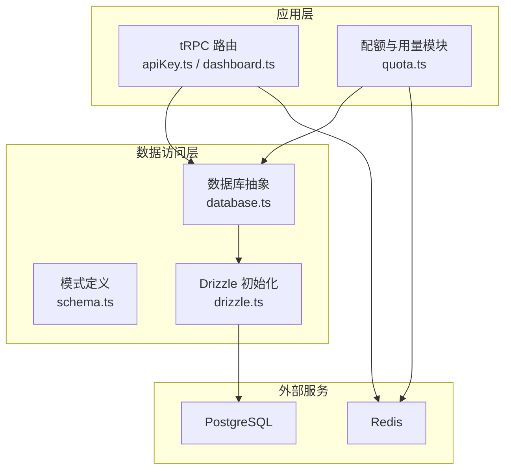
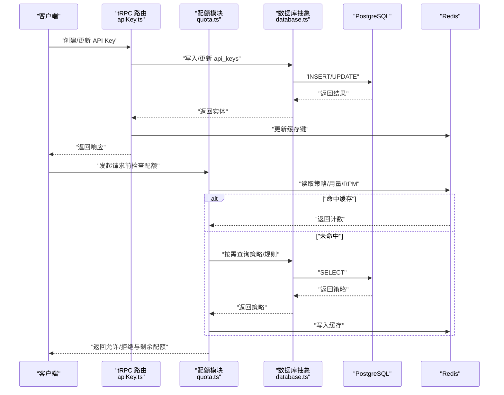
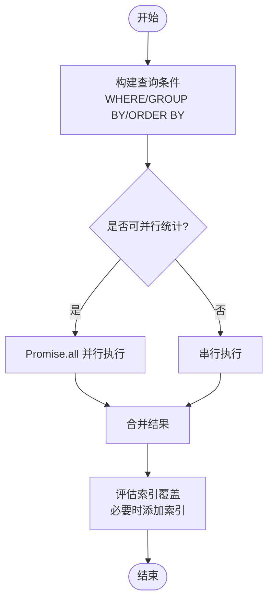
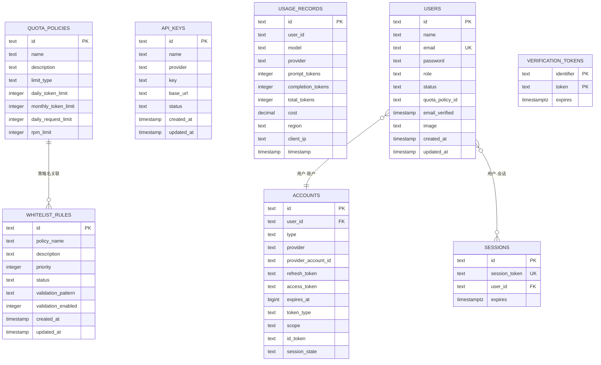
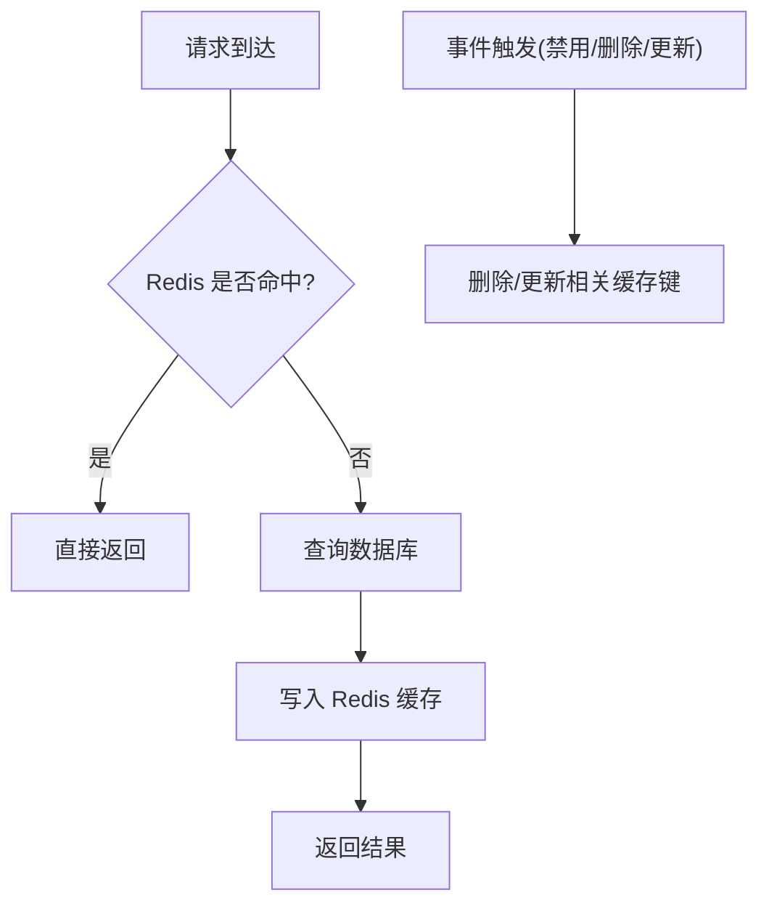
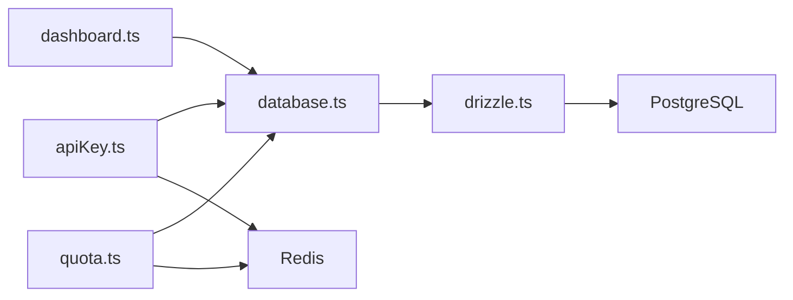

# 数据库性能优化

<cite>
**本文引用的文件**
- [src/lib/database.ts](file://src/lib/database.ts)
- [src/lib/drizzle.ts](file://src/lib/drizzle.ts)
- [src/lib/schema.ts](file://src/lib/schema.ts)
- [drizzle.config.ts](file://drizzle.config.ts)
- [src/lib/redis.ts](file://src/lib/redis.ts)
- [src/lib/quota.ts](file://src/lib/quota.ts)
- [src/server/api/routers/apiKey.ts](file://src/server/api/routers/apiKey.ts)
- [src/server/api/routers/dashboard.ts](file://src/server/api/routers/dashboard.ts)
- [drizzle/0009_add_daily_request_limit.sql](file://drizzle/0009_add_daily_request_limit.sql)
- [drizzle/0009_add_nextauth_tables.sql](file://drizzle/0009_add_nextauth_tables.sql)
- [package.json](file://package.json)
</cite>

## 目录
1. [简介](#简介)
2. [项目结构](#项目结构)
3. [核心组件](#核心组件)
4. [架构总览](#架构总览)
5. [详细组件分析](#详细组件分析)
6. [依赖关系分析](#依赖关系分析)
7. [性能考量](#性能考量)
8. [故障排查指南](#故障排查指南)
9. [结论](#结论)
10. [附录](#附录)

## 简介
本文件面向 AIGate 的数据库性能优化，结合现有代码与迁移脚本，系统梳理索引设计策略、查询优化技巧、连接池优化、慢查询分析与监控、分片与分区策略、缓存策略、性能测试与基准测试方法，并给出不同业务场景的最佳实践建议。文档同时提供可视化图示帮助理解数据流与组件交互。

## 项目结构
AIGate 使用 Drizzle ORM + PostgreSQL 作为持久层，Redis 作为高频计数与缓存层，配合 tRPC 提供 API 层。数据库迁移由 drizzle-kit 管理，schema 定义集中在 schema.ts 中，实际连接通过 drizzle.ts 初始化。

**图表来源**
- [src/server/api/routers/apiKey.ts](file://src/server/api/routers/apiKey.ts#L1-L462)
- [src/server/api/routers/dashboard.ts](file://src/server/api/routers/dashboard.ts#L1-L235)
- [src/lib/quota.ts](file://src/lib/quota.ts#L1-L334)
- [src/lib/database.ts](file://src/lib/database.ts#L1-L524)
- [src/lib/drizzle.ts](file://src/lib/drizzle.ts#L1-L12)
- [src/lib/schema.ts](file://src/lib/schema.ts#L1-L159)

**章节来源**
- [src/lib/drizzle.ts](file://src/lib/drizzle.ts#L1-L12)
- [drizzle.config.ts](file://drizzle.config.ts#L1-L11)
- [src/lib/schema.ts](file://src/lib/schema.ts#L1-L159)

## 核心组件
- 数据库抽象层：封装 CRUD 与聚合查询，统一异常处理，便于后续引入索引与查询优化。
- Drizzle 初始化：基于 postgres-js 客户端，关闭预编译以适配事务池模式。
- 模式定义：定义表结构、枚举、外键与关系，为索引与查询优化提供依据。
- Redis 缓存：用于配额策略、每日用量、每分钟用量与请求日志缓存，显著降低数据库压力。
- tRPC 路由：对外暴露 API，内部调用数据库与 Redis，承载查询优化与缓存策略落地点。

**章节来源**
- [src/lib/database.ts](file://src/lib/database.ts#L1-L524)
- [src/lib/drizzle.ts](file://src/lib/drizzle.ts#L1-L12)
- [src/lib/schema.ts](file://src/lib/schema.ts#L1-L159)
- [src/lib/redis.ts](file://src/lib/redis.ts#L1-L49)
- [src/lib/quota.ts](file://src/lib/quota.ts#L1-L334)
- [src/server/api/routers/apiKey.ts](file://src/server/api/routers/apiKey.ts#L1-L462)
- [src/server/api/routers/dashboard.ts](file://src/server/api/routers/dashboard.ts#L1-L235)

## 架构总览
下图展示从 tRPC 到数据库与 Redis 的关键路径，以及配额检查与用量记录的流程。

**图表来源**
- [src/server/api/routers/apiKey.ts](file://src/server/api/routers/apiKey.ts#L146-L240)
- [src/lib/quota.ts](file://src/lib/quota.ts#L74-L190)
- [src/lib/database.ts](file://src/lib/database.ts#L1-L524)
- [src/lib/redis.ts](file://src/lib/redis.ts#L1-L49)

## 详细组件分析

### 数据库抽象层与查询优化要点
- 统一异常处理：所有数据库操作在 try/catch 中进行，避免异常冒泡，便于集中监控与告警。
- 聚合查询：使用 Promise.all 并行执行多维统计，减少往返次数，提升仪表盘与报表类查询性能。
- 时间范围查询：对 usage_records 的 timestamp 建立索引可显著提升按天/小时统计的效率。
- 排序与分页：对高频排序列（如 timestamp）建立索引；若存在分页，建议使用游标分页或基于索引的 LIMIT/OFFSET。

**图表来源**
- [src/lib/database.ts](file://src/lib/database.ts#L223-L276)
- [src/server/api/routers/dashboard.ts](file://src/server/api/routers/dashboard.ts#L33-L133)

**章节来源**
- [src/lib/database.ts](file://src/lib/database.ts#L143-L276)
- [src/server/api/routers/dashboard.ts](file://src/server/api/routers/dashboard.ts#L1-L235)

### Drizzle 初始化与连接池优化
- 客户端初始化：使用 postgres-js，关闭预编译以适配事务池模式，避免不兼容问题。
- 连接池参数：建议在生产环境通过 DATABASE_URL 或环境变量设置连接池大小、空闲超时、最大生命周期等参数；当前仓库未显式配置，需在部署时补充。
- 查询超时：建议为长查询设置超时，避免阻塞连接；可在中间件或路由层增加超时控制。
- 连接复用：Drizzle 与 postgres-js 默认复用连接，注意避免在同一事务中长时间占用连接。

**章节来源**
- [src/lib/drizzle.ts](file://src/lib/drizzle.ts#L1-L12)

### 模式定义与索引设计策略
- 主键索引：所有表主键已定义，无需额外索引。
- 唯一索引：users.email、accounts.session_token、verification_tokens.identifier+token 已声明唯一，保障去重与快速查找。
- 复合索引：建议为高频过滤与排序列组合建立复合索引，例如：
  - usage_records(userId, timestamp)
  - usage_records(timestamp)
  - quota_policies(name)
  - whitelist_rules(status, priority)
- 部分索引：对 status 等有限枚举值列，可考虑部分索引以缩小索引体积。
- 枚举与约束：limit_type 的 CHECK 约束保证数据一致性，有助于查询优化器选择最优执行计划。

**图表来源**
- [src/lib/schema.ts](file://src/lib/schema.ts#L29-L159)

**章节来源**
- [src/lib/schema.ts](file://src/lib/schema.ts#L1-L159)
- [drizzle/0009_add_daily_request_limit.sql](file://drizzle/0009_add_daily_request_limit.sql#L1-L9)
- [drizzle/0009_add_nextauth_tables.sql](file://drizzle/0009_add_nextauth_tables.sql#L1-L33)

### tRPC 路由与查询优化
- API Key 管理：创建/更新/删除时同步 Redis 缓存，避免重复查询数据库；测试 Key 时按提供商分别验证，减少无效调用。
- 仪表盘统计：使用并行查询获取多维指标，减少往返；对时间范围与分组列建立索引可进一步提升性能。
- 参数映射：提供者名称前后端转换函数统一处理，避免查询时的字符串不一致导致全表扫描。

**章节来源**
- [src/server/api/routers/apiKey.ts](file://src/server/api/routers/apiKey.ts#L1-L462)
- [src/server/api/routers/dashboard.ts](file://src/server/api/routers/dashboard.ts#L1-L235)

### Redis 缓存策略与失效机制
- 策略缓存：用户策略按 userId 缓存，命中率高且更新频率低，适合长期缓存。
- 日用量与 RPM：按日期与分钟粒度缓存，设置合理过期时间，避免内存膨胀。
- 请求日志：短期缓存请求详情，便于审计与重放。
- 失效策略：禁用 API Key 时清理对应缓存键；策略变更时可采用版本号或 TTL 控制。

**图表来源**
- [src/lib/quota.ts](file://src/lib/quota.ts#L14-L48)
- [src/lib/redis.ts](file://src/lib/redis.ts#L18-L49)
- [src/server/api/routers/apiKey.ts](file://src/server/api/routers/apiKey.ts#L242-L335)

**章节来源**
- [src/lib/quota.ts](file://src/lib/quota.ts#L1-L334)
- [src/lib/redis.ts](file://src/lib/redis.ts#L1-L49)
- [src/server/api/routers/apiKey.ts](file://src/server/api/routers/apiKey.ts#L146-L335)

## 依赖关系分析
- 应用层依赖数据访问层，数据访问层依赖 Drizzle 初始化与 PostgreSQL；配额模块同时依赖 Redis。
- tRPC 路由负责协调数据库与缓存，是查询优化与缓存策略的关键落地点。

**图表来源**
- [src/server/api/routers/apiKey.ts](file://src/server/api/routers/apiKey.ts#L1-L462)
- [src/server/api/routers/dashboard.ts](file://src/server/api/routers/dashboard.ts#L1-L235)
- [src/lib/database.ts](file://src/lib/database.ts#L1-L524)
- [src/lib/drizzle.ts](file://src/lib/drizzle.ts#L1-L12)
- [src/lib/quota.ts](file://src/lib/quota.ts#L1-L334)

**章节来源**
- [src/server/api/routers/apiKey.ts](file://src/server/api/routers/apiKey.ts#L1-L462)
- [src/server/api/routers/dashboard.ts](file://src/server/api/routers/dashboard.ts#L1-L235)
- [src/lib/database.ts](file://src/lib/database.ts#L1-L524)
- [src/lib/drizzle.ts](file://src/lib/drizzle.ts#L1-L12)
- [src/lib/quota.ts](file://src/lib/quota.ts#L1-L334)

## 性能考量

### 索引设计策略
- 主键索引：已由 schema 定义，无需额外处理。
- 唯一索引：users.email、accounts.session_token、verification_tokens 复合主键已具备唯一性，查询与去重高效。
- 复合索引建议：
  - usage_records(userId, timestamp)：支持按用户与时间范围查询。
  - usage_records(timestamp)：支持全局时间序列统计。
  - quota_policies(name)：策略名称查询。
  - whitelist_rules(status, priority)：筛选激活规则并按优先级排序。
- 部分索引：对 status 等有限枚举列，可考虑仅对 active/inactive 建立部分索引，降低维护成本。
- 枚举与约束：limit_type 的 CHECK 约束保证数据一致性，有利于查询优化器选择最优执行计划。

**章节来源**
- [src/lib/schema.ts](file://src/lib/schema.ts#L1-L159)
- [drizzle/0009_add_daily_request_limit.sql](file://drizzle/0009_add_daily_request_limit.sql#L1-L9)

### 查询优化技巧
- WHERE 条件优化：尽量使用等值过滤与范围过滤结合，避免在 WHERE 中对列进行函数运算。
- JOIN 顺序优化：优先使用小表驱动大表，确保连接键上有索引。
- 子查询优化：将可并行的聚合查询改为 Promise.all，减少多次往返；对子查询结果建立物化视图或临时表（在复杂场景下）。
- 排序与分页：对 ORDER BY 列建立索引；分页使用基于索引的游标分页或键集分页，避免深度分页。

**章节来源**
- [src/lib/database.ts](file://src/lib/database.ts#L223-L276)
- [src/server/api/routers/dashboard.ts](file://src/server/api/routers/dashboard.ts#L33-L133)

### 数据库连接池优化
- 连接数调优：根据并发请求数与数据库资源设定最大连接数，避免连接池耗尽。
- 查询超时：为长查询设置超时，防止阻塞连接；可在 tRPC 层或数据库中间件设置。
- 连接复用：Drizzle 与 postgres-js 默认复用连接，避免在同一事务中长时间占用连接。

**章节来源**
- [src/lib/drizzle.ts](file://src/lib/drizzle.ts#L1-L12)

### 慢查询分析与监控
- 执行计划分析：使用 EXPLAIN/EXPLAIN ANALYZE 分析关键查询，关注索引使用、排序与聚合步骤。
- 性能指标监控：监控慢查询数量、平均执行时间、连接池利用率、Redis 命中率等。
- 日志与告警：对慢查询与异常进行日志记录与阈值告警。

**章节来源**
- [src/lib/database.ts](file://src/lib/database.ts#L1-L524)

### 数据分片与分区策略
- 水平分片：按用户维度（如 userId 哈希）分片，适用于高并发写入与按用户隔离的场景。
- 垂直分片：将大字段（如日志详情）拆分至单独表或存储，减少主表扫描开销。
- 分区：对时间序列表（usage_records）按月/季度分区，便于归档与清理历史数据。

**章节来源**
- [src/lib/schema.ts](file://src/lib/schema.ts#L54-L67)

### 缓存策略设计
- 查询结果缓存：对稳定报表与配置类数据进行缓存，设置合理 TTL。
- 热点数据缓存：对高频配额策略与用量进行缓存，结合 Redis 集群提升可用性。
- 缓存失效机制：事件驱动失效（如禁用 API Key、策略更新），确保一致性。

**章节来源**
- [src/lib/quota.ts](file://src/lib/quota.ts#L1-L334)
- [src/lib/redis.ts](file://src/lib/redis.ts#L1-L49)
- [src/server/api/routers/apiKey.ts](file://src/server/api/routers/apiKey.ts#L146-L335)

### 性能测试与基准测试
- 压力测试：使用 wrk、k6 或 JMeter 对关键路由（创建/更新 API Key、用量统计）施压。
- 基准测试：对典型查询（按用户/时间范围统计）进行基准，记录 P50/P95 延迟。
- 指标采集：Prometheus + Grafana 监控数据库与 Redis 指标，结合 APM 工具追踪端到端延迟。

**章节来源**
- [package.json](file://package.json#L6-L16)

## 故障排查指南
- 数据库错误：所有数据库操作均捕获异常并记录日志，定位失败原因与上下文。
- Redis 异常：Redis 操作失败不影响主流程，但需记录警告并定期巡检。
- tRPC 错误：对常见错误（如未找到、内部错误）进行标准化返回，便于前端与监控识别。

**章节来源**
- [src/lib/database.ts](file://src/lib/database.ts#L1-L524)
- [src/server/api/routers/apiKey.ts](file://src/server/api/routers/apiKey.ts#L103-L143)

## 结论
AIGate 当前已具备良好的数据访问抽象与缓存策略，后续可在以下方面持续优化：完善索引覆盖、引入连接池参数化配置、加强慢查询监控与执行计划分析、实施分片与分区策略，并通过系统化的性能测试与基准测试持续迭代。

## 附录
- drizzle-kit 配置：指定 schema、输出目录与方言，便于迁移与生成。
- 迁移脚本：新增每日请求限制与 NextAuth 表结构，反映业务演进与数据模型变化。

**章节来源**
- [drizzle.config.ts](file://drizzle.config.ts#L1-L11)
- [drizzle/0009_add_daily_request_limit.sql](file://drizzle/0009_add_daily_request_limit.sql#L1-L9)
- [drizzle/0009_add_nextauth_tables.sql](file://drizzle/0009_add_nextauth_tables.sql#L1-L33)