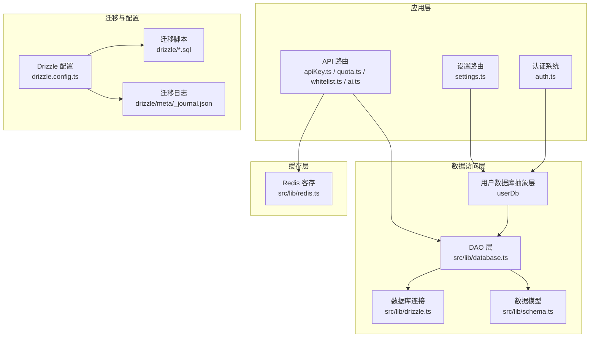
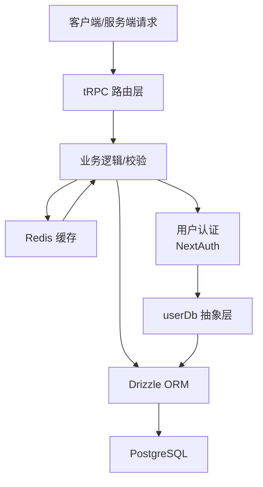
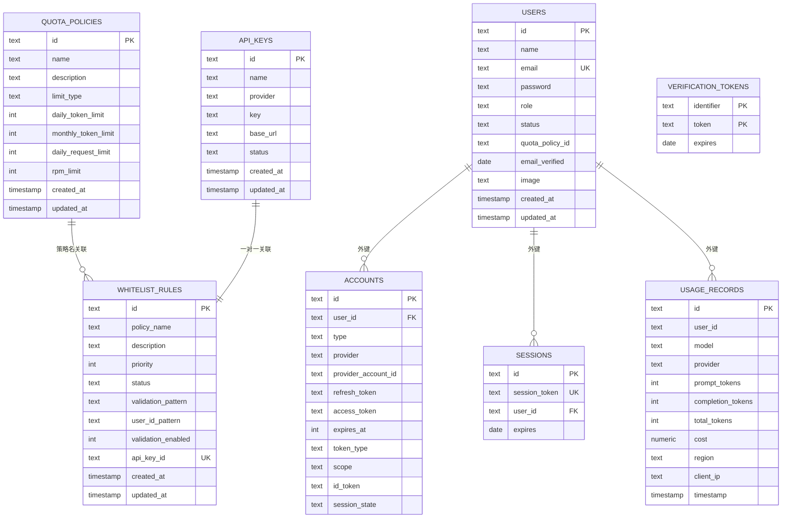
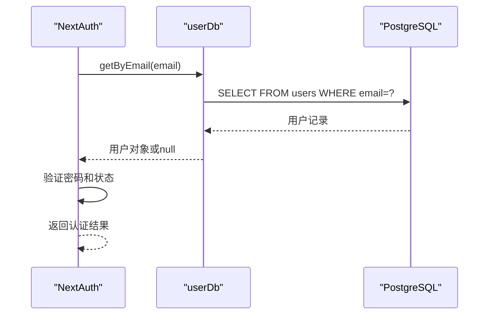
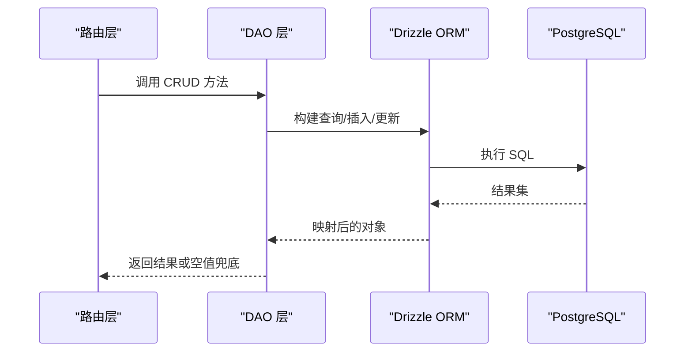
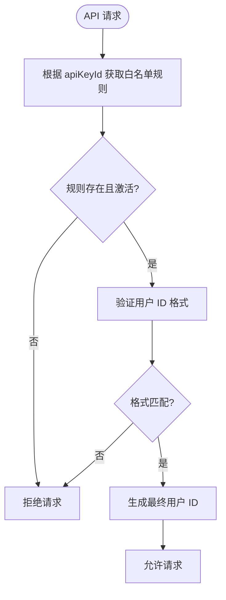
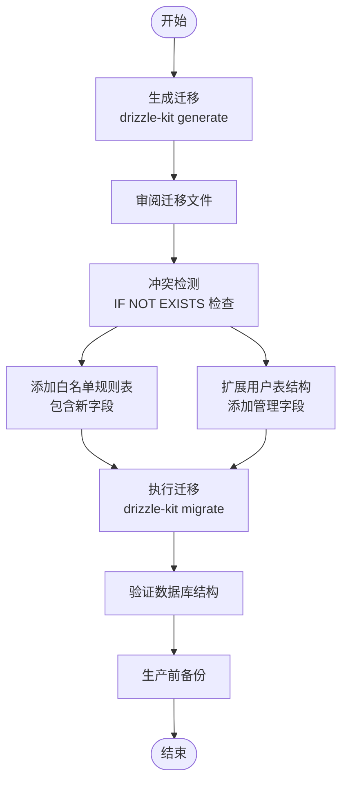
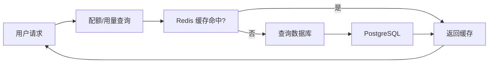
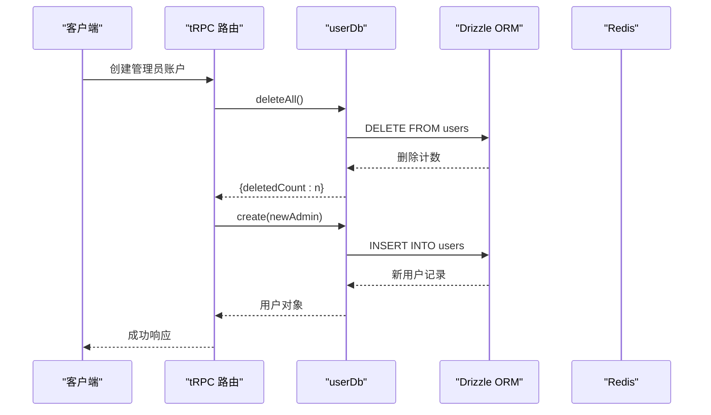
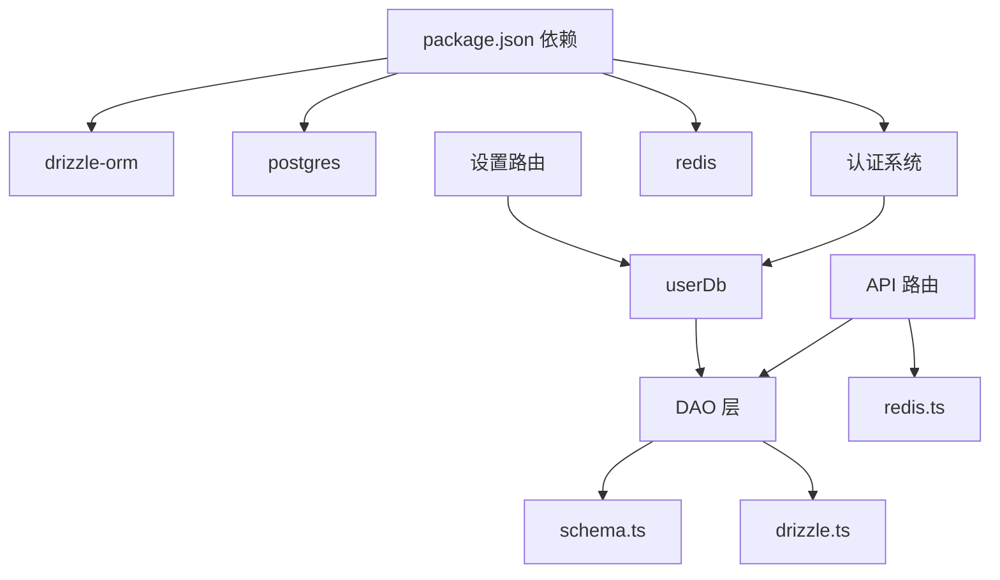

# 数据库设计与管理

<cite>
**本文引用的文件**
- [drizzle.config.ts](file://drizzle.config.ts)
- [src/lib/drizzle.ts](file://src/lib/drizzle.ts)
- [src/lib/schema.ts](file://src/lib/schema.ts)
- [src/lib/database.ts](file://src/lib/database.ts)
- [src/lib/redis.ts](file://src/lib/redis.ts)
- [src/server/api/routers/apiKey.ts](file://src/server/api/routers/apiKey.ts)
- [src/server/api/routers/quota.ts](file://src/server/api/routers/quota.ts)
- [src/server/api/routers/whitelist.ts](file://src/server/api/routers/whitelist.ts)
- [src/server/api/routers/ai.ts](file://src/server/api/routers/ai.ts)
- [src/pages/api/ai/chat/stream.ts](file://src/pages/api/ai/chat/stream.ts)
- [drizzle/meta/_journal.json](file://drizzle/meta/_journal.json)
- [drizzle/0009_fix_migration_conflict.sql](file://drizzle/0009_fix_migration_conflict.sql)
- [drizzle/0010_fix_database_structure.sql](file://drizzle/0010_fix_database_structure.sql)
- [package.json](file://package.json)
- [src/auth.ts](file://src/auth.ts)
- [src/server/api/routers/settings.ts](file://src/server/api/routers/settings.ts)
- [src/app/(dashboard)/users/page.tsx](file://src/app/(dashboard)/users/page.tsx)
- [src/app/(dashboard)/users/components/whitelist-rule-form.tsx](file://src/app/(dashboard)/users/components/whitelist-rule-form.tsx)
- [src/app/(dashboard)/users/components/whitelist-rule-table.tsx](file://src/app/(dashboard)/users/components/whitelist-rule-table.tsx)
</cite>

## 更新摘要
**所做更改**
- 新增完整的用户数据库抽象层(userDb)的详细说明，包括CRUD操作、错误处理和数据验证
- 更新用户表结构定义，包含扩展字段和约束规则
- 增强用户管理功能的描述，包括管理员账户管理和用户认证集成
- 添加用户表与白名单规则的关联关系说明
- 更新数据模型部分，反映用户表结构的完整扩展

## 目录
1. [简介](#简介)
2. [项目结构](#项目结构)
3. [核心组件](#核心组件)
4. [架构总览](#架构总览)
5. [详细组件分析](#详细组件分析)
6. [依赖分析](#依赖分析)
7. [性能考虑](#性能考虑)
8. [故障排除指南](#故障排除指南)
9. [结论](#结论)
10. [附录](#附录)

## 简介
本文件面向 AIGate 的数据库系统，提供从架构设计、数据模型、Drizzle ORM 使用、迁移管理到缓存与运维的完整设计与管理文档。内容覆盖：
- 表结构定义、实体关系模型与数据约束
- Drizzle ORM 的配置与查询构建器、事务处理
- 迁移版本控制、回滚与生产部署流程
- 数据模型字段、索引与性能优化建议
- 连接池配置、查询优化与缓存策略
- 备份恢复、监控指标与故障排除
- CRUD 示例与最佳实践

## 项目结构
数据库相关代码集中在以下位置：
- Drizzle 配置与迁移：drizzle.config.ts、drizzle 目录下的 SQL 迁移与 journal
- ORM 层：src/lib/drizzle.ts（连接与导出 db）、src/lib/schema.ts（表与枚举定义）、src/lib/database.ts（DAO 层）
- 缓存：src/lib/redis.ts（Redis 客户端与键空间）
- API 层：src/server/api/routers 下的路由模块，调用 DAO 层进行数据访问
- 认证：src/auth.ts（NextAuth 配置，配合数据库中的 NextAuth 表）
- 用户管理：用户数据库抽象层(userDb)及其在认证和设置路由中的应用

**图表来源**
- [drizzle.config.ts](file://drizzle.config.ts#L1-L11)
- [src/lib/drizzle.ts](file://src/lib/drizzle.ts#L1-L12)
- [src/lib/schema.ts](file://src/lib/schema.ts#L1-L162)
- [src/lib/database.ts](file://src/lib/database.ts#L581-L692)
- [src/lib/redis.ts](file://src/lib/redis.ts#L1-L49)
- [src/auth.ts](file://src/auth.ts#L1-L114)
- [src/server/api/routers/settings.ts](file://src/server/api/routers/settings.ts#L1-L88)

**章节来源**
- [drizzle.config.ts](file://drizzle.config.ts#L1-L11)
- [src/lib/drizzle.ts](file://src/lib/drizzle.ts#L1-L12)
- [src/lib/schema.ts](file://src/lib/schema.ts#L1-L162)
- [src/lib/database.ts](file://src/lib/database.ts#L581-L692)
- [src/lib/redis.ts](file://src/lib/redis.ts#L1-L49)
- [src/auth.ts](file://src/auth.ts#L1-L114)
- [src/server/api/routers/settings.ts](file://src/server/api/routers/settings.ts#L1-L88)

## 核心组件
- Drizzle ORM 配置与连接
  - 配置文件指定 schema、输出目录、方言与数据库凭据来源
  - 运行时通过 DATABASE_URL 初始化 postgres 客户端，并创建 drizzle 实例
- 数据模型与枚举
  - 定义角色、状态、提供商、白名单状态、限制类型等枚举
  - 定义配额策略、API Key、用量记录、用户、白名单规则及 NextAuth 相关表
  - 定义表间关系（如 accounts/sessions 外键关联 users）
- DAO 层
  - 提供 API Key、配额策略、用量记录、白名单规则的 CRUD 与统计查询
  - 统一错误处理与返回空集合/空值兜底
  - **新增** 用户数据库抽象层(userDb)，提供完整的用户管理CRUD操作
- 缓存层
  - Redis 客户端与键空间命名规范，支持用户配额策略、每日用量、RPM、API Key 等缓存
- API 路由
  - tRPC 路由对接 DAO 层，实现业务逻辑与缓存更新/清理
- 认证系统
  - NextAuth 集成，使用 userDb 进行用户认证与会话管理

**章节来源**
- [drizzle.config.ts](file://drizzle.config.ts#L1-L11)
- [src/lib/drizzle.ts](file://src/lib/drizzle.ts#L1-L12)
- [src/lib/schema.ts](file://src/lib/schema.ts#L1-L162)
- [src/lib/database.ts](file://src/lib/database.ts#L581-L692)
- [src/lib/redis.ts](file://src/lib/redis.ts#L1-L49)
- [src/server/api/routers/apiKey.ts](file://src/server/api/routers/apiKey.ts#L1-L393)
- [src/server/api/routers/quota.ts](file://src/server/api/routers/quota.ts#L1-L301)
- [src/server/api/routers/whitelist.ts](file://src/server/api/routers/whitelist.ts#L1-L221)
- [src/auth.ts](file://src/auth.ts#L1-L114)

## 架构总览
下图展示数据库层在系统中的位置与交互：

**图表来源**
- [src/lib/drizzle.ts](file://src/lib/drizzle.ts#L1-L12)
- [src/lib/database.ts](file://src/lib/database.ts#L581-L692)
- [src/lib/redis.ts](file://src/lib/redis.ts#L1-L49)
- [src/server/api/routers/apiKey.ts](file://src/server/api/routers/apiKey.ts#L1-L393)
- [src/server/api/routers/quota.ts](file://src/server/api/routers/quota.ts#L1-L301)
- [src/server/api/routers/whitelist.ts](file://src/server/api/routers/whitelist.ts#L1-L221)
- [src/auth.ts](file://src/auth.ts#L1-L114)

## 详细组件分析

### 数据模型与 ER 图
- 主要实体与字段概览
  - 配额策略：标识、名称、描述、限制类型、每日/月度 Token 限额、每日请求次数、RPM 限制、创建/更新时间
  - API 密钥：标识、名称、提供商、密钥、可选自定义 base_url、状态、创建/更新时间
  - 用量记录：标识、用户标识、模型、提供商、提示/补全/总 Token 数、成本、区域、客户端 IP、时间戳
  - 用户：标识、姓名、邮箱（唯一）、密码、角色、状态、配额策略标识、邮箱验证时间、头像、创建/更新时间
  - 白名单规则：标识、策略名、描述、优先级、状态、校验正则、是否启用校验、**新增** 用户 ID 模式、**新增** API Key ID、创建/更新时间
  - NextAuth 表：accounts、sessions、verification_tokens（含复合主键）
- 关系
  - accounts/sessions 外键关联 users，删除级联
  - 白名单规则与配额策略通过策略名关联（逻辑关联）
  - **新增** 白名单规则与 API Key 通过 apiKeyId 字段关联（一对一约束）
  - **新增** 用户表与白名单规则的关联关系

**图表来源**
- [src/lib/schema.ts](file://src/lib/schema.ts#L28-L162)

**章节来源**
- [src/lib/schema.ts](file://src/lib/schema.ts#L1-L162)

### 用户数据库抽象层(userDb)
**新增功能**：完整的用户数据库抽象层，提供用户管理的核心CRUD操作和数据验证。

#### 核心功能特性
- **用户查询**：支持按邮箱、ID精确查询，获取管理员列表和所有用户
- **用户管理**：提供创建、更新、删除用户的标准CRUD操作
- **密码管理**：专门的密码更新功能，支持安全的密码修改
- **批量操作**：支持删除所有用户，用于系统初始化和重置
- **错误处理**：统一的异常捕获和错误返回机制
- **数据验证**：在创建和更新时自动设置更新时间戳

#### 用户表结构扩展
- **基础字段**：id、name、email、password、role、status、quotaPolicyId
- **扩展字段**：emailVerified、image、createdAt、updatedAt
- **约束规则**：邮箱唯一性、角色枚举、状态枚举、配额策略外键
- **索引优化**：邮箱字段唯一索引，支持快速用户查找

#### userDb 方法详解
- `getByEmail(email: string)`: 根据邮箱查找用户，返回单个用户或null
- `getById(id: string)`: 根据ID查找用户，返回单个用户或null
- `getAdmins()`: 获取所有管理员用户，按创建时间倒序排列
- `getAll()`: 获取所有用户，按创建时间倒序排列
- `create(userData: NewUser)`: 创建新用户，返回创建的用户对象
- `update(id: string, userData: Partial<NewUser>)`: 更新用户信息，自动更新updatedAt
- `updatePassword(id: string, password: string)`: 更新用户密码，返回布尔结果
- `delete(id: string)`: 删除用户，返回布尔结果
- `deleteAll()`: 删除所有用户，返回删除计数

#### 认证系统集成
- **NextAuth 集成**：userDb 作为认证系统的数据源
- **管理员验证**：仅管理员用户可进行系统管理操作
- **会话管理**：通过 NextAuth 管理会话生命周期
- **凭证验证**：支持邮箱密码认证方式

#### 设置路由应用
- **管理员账户重置**：通过 settings 路由使用 userDb 删除所有用户并创建新管理员
- **账户信息获取**：获取第一个用户的信息作为系统管理员账户信息

**图表来源**
- [src/auth.ts](file://src/auth.ts#L20-L38)
- [src/lib/database.ts](file://src/lib/database.ts#L584-L592)

**章节来源**
- [src/lib/database.ts](file://src/lib/database.ts#L581-L692)
- [src/auth.ts](file://src/auth.ts#L1-L114)
- [src/server/api/routers/settings.ts](file://src/server/api/routers/settings.ts#L14-L46)

### Drizzle ORM 配置与使用
- 配置
  - 指定 schema 文件路径、输出目录、PostgreSQL 方言与 DATABASE_URL 凭据
- 连接
  - 初始化 postgres 客户端（关闭预取），创建 drizzle 实例并注入 schema
- 查询构建器与事务
  - 使用条件构造器（eq、and、gte、lte）与聚合函数（count、sum、countDistinct）
  - 通过 returning 获取插入/更新后的记录
  - 事务处理建议：在需要强一致性的多步写入时，使用数据库事务包裹（可结合应用层事务管理器）

**图表来源**
- [src/lib/drizzle.ts](file://src/lib/drizzle.ts#L1-L12)
- [src/lib/database.ts](file://src/lib/database.ts#L1-L582)

**章节来源**
- [drizzle.config.ts](file://drizzle.config.ts#L1-L11)
- [src/lib/drizzle.ts](file://src/lib/drizzle.ts#L1-L12)
- [src/lib/database.ts](file://src/lib/database.ts#L1-L582)

### API Key 基础白名单验证系统
**新增功能**：基于 API Key 的白名单验证系统，提供细粒度的用户 ID 格式控制和动态生成能力。

#### 核心功能特性
- **API Key 约束**：每个 API Key 只能绑定一个白名单规则，确保配置的唯一性
- **用户 ID 格式校验**：支持正则表达式验证传入的用户 ID 格式
- **动态用户 ID 生成**：支持基于模板的用户 ID 动态生成，包含占位符替换
- **多层校验机制**：先验证 API Key 绑定关系，再进行用户 ID 格式校验

#### 数据库方法
- `getByApiKeyId(apiKeyId: string)`: 根据 API Key ID 获取关联的白名单规则
- `validateUserByApiKey(apiKeyId: string, userId: string, clientIp?: string)`: 根据 API Key 和用户 ID 进行白名单验证

#### 白名单规则字段
- `userIdPattern`: 用户 ID 格式校验的正则表达式
- `apiKeyId`: 关联的 API Key ID，建立一对一关系
- `validationEnabled`: 是否启用用户 ID 格式校验

#### 使用流程

**图表来源**
- [src/lib/database.ts](file://src/lib/database.ts#L333-L547)
- [src/lib/schema.ts](file://src/lib/schema.ts#L85-L97)

**章节来源**
- [src/lib/database.ts](file://src/lib/database.ts#L333-L547)
- [src/lib/schema.ts](file://src/lib/schema.ts#L85-L97)
- [src/server/api/routers/whitelist.ts](file://src/server/api/routers/whitelist.ts#L65-L120)
- [src/pages/api/ai/chat/stream.ts](file://src/pages/api/ai/chat/stream.ts#L31-L48)
- [src/server/api/routers/ai.ts](file://src/server/api/routers/ai.ts#L106-L128)

### 迁移管理策略
- 版本控制
  - 迁移文件按顺序编号，记录每次变更；journal 维护已执行版本与时间戳
- 冲突解决与结构优化
  - **新增** 0009_fix_migration_conflict.sql 提供了幂等性检查，使用 `IF NOT EXISTS` 条件避免重复创建
  - **新增** 0010_fix_database_structure.sql 修复了数据库结构冲突，包含完整的约束检查和外键关系
  - **新增** 白名单规则表结构，包含新的字段定义和约束
  - **新增** 用户表结构扩展，包含完整的用户管理字段
  - 迁移文件包含安全检查：列存在性检查、约束存在性检查、表存在性检查
- 回滚机制
  - 当前仓库未提供回滚脚本；建议在生产环境执行迁移前先备份数据库，并在迁移脚本中包含幂等性与逆向 SQL
- 生产部署流程
  - 开发机生成迁移：使用生成命令
  - 应用机执行迁移：使用迁移命令
  - 本地/CI 推送：使用推送命令（谨慎用于开发环境）
- 典型演进
  - 新增每日请求限制与限制类型字段
  - 引入 NextAuth 相关表与字段
  - **新增** 完善的冲突解决机制和结构优化
  - **新增** API Key 基础白名单验证系统
  - **新增** 用户数据库抽象层和用户表结构扩展

**图表来源**
- [package.json](file://package.json#L6-L16)
- [drizzle/meta/_journal.json](file://drizzle/meta/_journal.json#L1-L83)
- [drizzle/0009_fix_migration_conflict.sql](file://drizzle/0009_fix_migration_conflict.sql#L1-L70)
- [drizzle/0010_fix_database_structure.sql](file://drizzle/0010_fix_database_structure.sql#L1-L87)

**章节来源**
- [package.json](file://package.json#L6-L16)
- [drizzle/meta/_journal.json](file://drizzle/meta/_journal.json#L1-L83)
- [drizzle/0009_fix_migration_conflict.sql](file://drizzle/0009_fix_migration_conflict.sql#L1-L70)
- [drizzle/0010_fix_database_structure.sql](file://drizzle/0010_fix_database_structure.sql#L1-L87)

### 缓存策略与连接池
- Redis 缓存键空间
  - 用户每日配额使用、用户每日请求次数、用户 RPM、用户策略缓存、API Key 配置、请求日志
  - 提供键生成器与日期/分钟格式化工具
- 连接池与客户端
  - 使用 postgres 客户端，默认关闭预取以适配事务模式
  - 建议：根据并发与延迟需求调整连接池参数（最大连接数、空闲超时、语句超时等）

**图表来源**
- [src/lib/redis.ts](file://src/lib/redis.ts#L1-L49)
- [src/lib/drizzle.ts](file://src/lib/drizzle.ts#L1-L12)

**章节来源**
- [src/lib/redis.ts](file://src/lib/redis.ts#L1-L49)
- [src/lib/drizzle.ts](file://src/lib/drizzle.ts#L1-L12)

### CRUD 操作与最佳实践
- API Key 管理
  - CRUD：全量、按提供商、按 ID 查询；创建、更新、删除
  - 状态切换与有效性测试
  - 使用 Redis 缓存 API Key，删除/禁用时清理对应缓存
- 配额策略管理
  - CRUD：全量、按 ID 查询；创建、更新、删除
  - 限制类型校验：token 模式需设置每日 Token 限额；request 模式需设置每日请求次数
  - 更新/删除后清理策略相关缓存键
- 白名单规则管理
  - CRUD：全量、按 ID 查询；创建、更新、删除
  - 状态切换、统计查询
  - **新增** API Key 约束：每个 API Key 只能绑定一个白名单规则
  - **新增** 用户 ID 格式校验与动态生成
  - 用户策略匹配：支持正则校验与优先级排序
- 用量记录与统计
  - 支持按用户、日期范围查询
  - 提供统计接口：总用户数、今日请求/Token、总请求、活跃用户
- **新增** 用户管理
  - **新增** userDb 提供完整的用户CRUD操作
  - **新增** 管理员账户重置功能，支持一键删除所有用户并创建新管理员
  - **新增** 用户认证集成，支持邮箱密码登录和NextAuth会话管理
  - **新增** 用户密码更新功能，支持安全的密码修改

**图表来源**
- [src/server/api/routers/settings.ts](file://src/server/api/routers/settings.ts#L14-L46)
- [src/lib/database.ts](file://src/lib/database.ts#L682-L690)

**章节来源**
- [src/server/api/routers/apiKey.ts](file://src/server/api/routers/apiKey.ts#L1-L393)
- [src/server/api/routers/quota.ts](file://src/server/api/routers/quota.ts#L1-L301)
- [src/server/api/routers/whitelist.ts](file://src/server/api/routers/whitelist.ts#L1-L221)
- [src/lib/database.ts](file://src/lib/database.ts#L581-L692)
- [src/server/api/routers/settings.ts](file://src/server/api/routers/settings.ts#L1-L88)

## 依赖分析
- 外部依赖
  - drizzle-orm、postgres、@auth/core、@auth/drizzle-adapter、redis
- 内部依赖
  - 路由层依赖 DAO 层；DAO 层依赖 schema 与 drizzle 连接
  - 缓存层被路由层与 DAO 层使用
  - **新增** 认证系统依赖 userDb 进行用户管理
  - **新增** 设置路由依赖 userDb 进行管理员账户管理

**图表来源**
- [package.json](file://package.json#L18-L56)
- [src/server/api/routers/apiKey.ts](file://src/server/api/routers/apiKey.ts#L1-L393)
- [src/lib/database.ts](file://src/lib/database.ts#L581-L692)
- [src/lib/schema.ts](file://src/lib/schema.ts#L1-L162)
- [src/lib/drizzle.ts](file://src/lib/drizzle.ts#L1-L12)
- [src/lib/redis.ts](file://src/lib/redis.ts#L1-L49)
- [src/auth.ts](file://src/auth.ts#L1-L114)
- [src/server/api/routers/settings.ts](file://src/server/api/routers/settings.ts#L1-L88)

**章节来源**
- [package.json](file://package.json#L18-L56)
- [src/server/api/routers/apiKey.ts](file://src/server/api/routers/apiKey.ts#L1-L393)
- [src/lib/database.ts](file://src/lib/database.ts#L581-L692)
- [src/lib/schema.ts](file://src/lib/schema.ts#L1-L162)
- [src/lib/drizzle.ts](file://src/lib/drizzle.ts#L1-L12)
- [src/lib/redis.ts](file://src/lib/redis.ts#L1-L49)
- [src/auth.ts](file://src/auth.ts#L1-L114)
- [src/server/api/routers/settings.ts](file://src/server/api/routers/settings.ts#L1-L88)

## 性能考虑
- 查询优化
  - 为高频过滤字段建立索引（如 email、session_token、provider、status、timestamp）
  - 使用投影选择必要列，避免 SELECT *
  - 合理使用 LIMIT 与 ORDER BY，避免全表扫描
  - **新增** 用户表邮箱字段唯一索引，优化认证查询性能
- 缓存策略
  - 对热点数据（API Key、用户策略、每日用量）使用 Redis 缓存
  - 缓存过期策略与失效策略（更新/删除时主动清理）
  - **新增** 用户认证信息缓存，提升登录性能
- 连接池
  - 根据并发与延迟目标调整最大连接数、空闲超时、语句超时
  - 在事务场景避免预取导致的不兼容问题（已通过关闭预取处理）
- 统计查询
  - 使用聚合函数与并行查询减少往返次数（DAO 层已采用 Promise.all 并行统计）
- **新增** 用户管理性能优化
  - userDb 使用 LIMIT 1 进行单用户查询，避免不必要的全表扫描
  - 管理员查询按创建时间倒序，支持快速获取最新管理员

## 故障排除指南
- 连接问题
  - 检查 DATABASE_URL 是否正确
  - 确认数据库可达与凭据有效
- 迁移失败
  - 查看 journal 与迁移文件，确认版本号与执行顺序
  - 在生产环境执行前先备份数据库
  - **新增** 使用冲突解决迁移文件：0009_fix_migration_conflict.sql 和 0010_fix_database_structure.sql
  - **新增** 验证白名单规则表结构完整性
  - **新增** 检查用户表结构扩展是否正确应用
- 缓存异常
  - 检查 Redis 服务状态与连接 URL
  - 关注缓存更新/清理失败的日志
- 权限与约束
  - 校验枚举值与检查约束（如限制类型）
  - 核对外键约束与级联删除行为
  - **新增** 验证 API Key 与白名单规则的一对一约束
  - **新增** 验证用户邮箱唯一性约束
  - **新增** 检查用户角色和状态枚举值的有效性

**章节来源**
- [src/lib/drizzle.ts](file://src/lib/drizzle.ts#L1-L12)
- [drizzle/meta/_journal.json](file://drizzle/meta/_journal.json#L1-L83)
- [src/lib/redis.ts](file://src/lib/redis.ts#L1-L49)
- [src/lib/schema.ts](file://src/lib/schema.ts#L25-L40)
- [src/lib/database.ts](file://src/lib/database.ts#L581-L692)

## 结论
AIGate 的数据库系统以 Drizzle ORM 为核心，结合 PostgreSQL 与 Redis，实现了清晰的数据模型、完善的迁移管理与高效的缓存策略。通过 tRPC 路由层统一接入 DAO 层，既保证了业务逻辑的可维护性，也便于扩展与监控。

**最新改进**：
- 新的迁移策略提供了更好的冲突解决机制，使用幂等性检查确保迁移的可靠性
- NextAuth 集成得到增强，支持更安全的认证流程
- 数据库结构更加健壮，包含完整的约束检查和外键关系
- **新增** API Key 基础白名单验证系统，提供细粒度的用户 ID 控制和动态生成能力
- **新增** 白名单规则与 API Key 的一对一约束，确保配置的唯一性和安全性
- **新增** 完整的用户数据库抽象层(userDb)，提供标准的用户管理CRUD操作
- **新增** 用户表结构扩展，支持完整的用户管理功能
- **新增** 管理员账户重置功能，简化系统初始化流程

建议在生产环境中完善回滚脚本、索引策略与连接池参数，并持续优化缓存命中率与查询性能。

## 附录
- 常用命令
  - 生成迁移：使用生成命令
  - 执行迁移：使用迁移命令
  - 推送模式（开发）：使用推送命令
- NextAuth 集成
  - 通过 @auth/drizzle-adapter 与数据库表配合，实现会话与令牌管理
  - **新增** 支持管理员用户和测试用户的认证流程
  - **新增** userDb 作为认证系统的数据源
- **新增** 冲突解决迁移文件
  - 0009_fix_migration_conflict.sql：修复迁移冲突和外键约束问题
  - 0010_fix_database_structure.sql：安全的数据库结构修复迁移
- **新增** API Key 基础白名单验证系统
  - 支持基于 API Key 的用户 ID 格式校验
  - 动态用户 ID 生成与占位符替换
  - 每个 API Key 只能绑定一个白名单规则的约束机制
- **新增** 用户数据库抽象层(userDb)
  - 提供完整的用户管理CRUD操作
  - 支持管理员账户重置和密码更新
  - 集成到认证系统和设置路由中
- **新增** 用户表结构扩展
  - 支持邮箱密码认证
  - 包含角色、状态、配额策略等管理字段
  - 提供完整的用户生命周期管理

**章节来源**
- [package.json](file://package.json#L6-L16)
- [src/auth.ts](file://src/auth.ts#L1-L85)
- [drizzle/0009_fix_migration_conflict.sql](file://drizzle/0009_fix_migration_conflict.sql#L1-L70)
- [drizzle/0010_fix_database_structure.sql](file://drizzle/0010_fix_database_structure.sql#L1-L87)
- [src/lib/database.ts](file://src/lib/database.ts#L581-L692)
- [src/server/api/routers/settings.ts](file://src/server/api/routers/settings.ts#L1-L88)