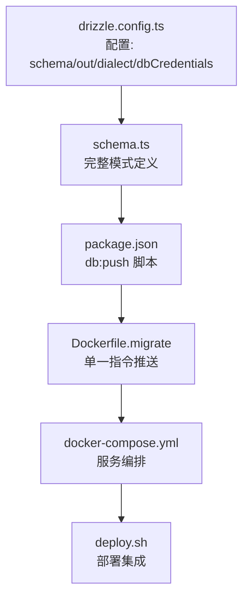
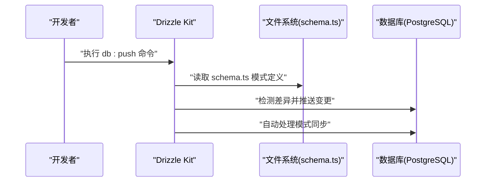
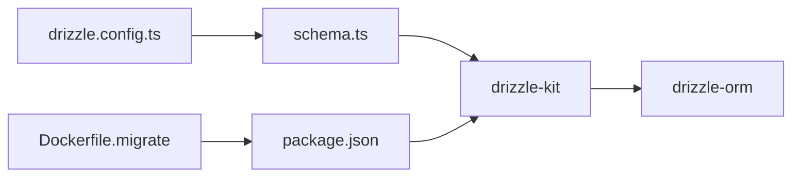

# 数据库迁移管理

<cite>
**本文引用的文件**
- [drizzle.config.ts](file://drizzle.config.ts)
- [Dockerfile.migrate](file://Dockerfile.migrate)
- [package.json](file://package.json)
- [deploy.sh](file://deploy.sh)
- [docker-compose.yml](file://docker-compose.yml)
- [src/lib/schema.ts](file://src/lib/schema.ts)
- [src/lib/drizzle.ts](file://src/lib/drizzle.ts)
</cite>

## 更新摘要
**变更内容**
- 数据库迁移系统进行了重大重构：删除了4000+行历史迁移文件和快照
- Dockerfile.migrate 简化为基于 `db:push` 命令的单一指令
- 迁移流程从复杂的多步骤系统转变为简化的推送模式
- 移除了传统的 SQL 迁移文件和快照管理系统
- 采用 Drizzle Kit 的推送模式替代传统迁移模式
- 新增了 `db:push` 脚本用于直接推送模式到数据库

## 目录
1. [简介](#简介)
2. [项目结构](#项目结构)
3. [核心组件](#核心组件)
4. [架构总览](#架构总览)
5. [详细组件分析](#详细组件分析)
6. [依赖关系分析](#依赖关系分析)
7. [性能考量](#性能考量)
8. [故障排查指南](#故障排查指南)
9. [结论](#结论)
10. [附录](#附录)

## 简介
本文件面向 AIGate 的数据库迁移管理，系统化梳理重构后的 Drizzle Kit 迁移体系。经过重大重构，项目从传统的 SQL 迁移模式转向简化的推送模式，删除了4000+行历史迁移文件和快照，Dockerfile.migrate 简化为单一的 `db:push` 命令。新架构通过 `drizzle-kit push` 直接将模式推送到数据库，无需中间的迁移文件和快照管理。本文详细说明新的推送模式工作原理、配置方式、执行流程以及与传统迁移模式的根本区别。

**更新** 项目已完成从传统迁移模式到推送模式的重大架构转换，简化了迁移管理复杂度，提高了开发效率。

## 项目结构
AIGate 重构后的数据库迁移系统采用极简架构：
- 配置：drizzle.config.ts 定义 schema 路径、输出目录、方言与数据库凭据
- 模式定义：src/lib/schema.ts 提供完整的数据库模式定义
- 迁移脚本：package.json 中的 `db:push` 脚本驱动推送流程
- 容器化：Dockerfile.migrate 基于单一指令执行推送
- 部署集成：deploy.sh 通过 Docker Compose 集成推送流程



**图表来源**
- [drizzle.config.ts](file://drizzle.config.ts#L1-L11)
- [src/lib/schema.ts](file://src/lib/schema.ts#L1-L159)
- [package.json](file://package.json#L13-L16)
- [Dockerfile.migrate](file://Dockerfile.migrate#L13-L13)
- [docker-compose.yml](file://docker-compose.yml)

## 核心组件
- **Drizzle 配置**：drizzle.config.ts 定义 schema.ts 路径、输出目录、PostgreSQL 方言与数据库连接 URL
- **模式定义**：src/lib/schema.ts 提供完整的数据库模式定义，包括表结构、枚举、关系等
- **推送脚本**：package.json 中的 `db:push` 脚本直接将模式推送到数据库
- **容器化推送**：Dockerfile.migrate 使用单一指令执行推送，无需复杂的迁移流程
- **部署集成**：deploy.sh 通过 Docker Compose 集成推送流程，支持完整的部署生命周期

**章节来源**
- [drizzle.config.ts](file://drizzle.config.ts#L1-L11)
- [src/lib/schema.ts](file://src/lib/schema.ts#L1-L159)
- [package.json](file://package.json#L13-L16)
- [Dockerfile.migrate](file://Dockerfile.migrate#L13-L13)

## 架构总览
重构后的 Drizzle Kit 工作流采用推送模式：
- 开发者基于 schema.ts 编写模式定义
- 使用 `drizzle-kit push` 直接将模式推送到数据库
- 系统自动处理差异检测和模式同步
- 通过 Dockerfile.migrate 和 deploy.sh 实现容器化部署



**图表来源**
- [package.json](file://package.json#L14-L14)
- [src/lib/schema.ts](file://src/lib/schema.ts#L1-L159)

## 详细组件分析

### 推送模式工作原理
重构后的系统采用 Drizzle Kit 的推送模式，与传统迁移模式有根本区别：

- **传统模式**：生成 SQL 迁移文件 → 执行迁移 → 更新快照 → 维护迁移历史
- **推送模式**：直接比较 schema.ts 与数据库 → 检测差异 → 自动生成并执行必要的 DDL → 无需中间文件

推送模式的优势：
- 消除4000+行历史迁移文件和快照的维护负担
- 简化部署流程，从多步骤变为单一指令
- 提高开发效率，减少迁移文件管理复杂度
- 降低版本冲突风险

**章节来源**
- [package.json](file://package.json#L14-L14)
- [src/lib/schema.ts](file://src/lib/schema.ts#L1-L159)

### 配置与模式定义
- **配置文件**：drizzle.config.ts 定义 schema 路径、输出目录、PostgreSQL 方言与数据库凭据
- **模式定义**：src/lib/schema.ts 提供完整的数据库模式，包括：
  - 枚举类型定义（roleEnum、statusEnum、providerEnum 等）
  - 表结构定义（quotaPolicies、apiKeys、usageRecords 等）
  - 关系映射和外键约束
  - 类型导出用于 TypeScript 开发

**章节来源**
- [drizzle.config.ts](file://drizzle.config.ts#L1-L11)
- [src/lib/schema.ts](file://src/lib/schema.ts#L12-L159)

### 容器化推送流程
Dockerfile.migrate 已简化为单一指令：
```dockerfile
CMD ["sh", "-c", "echo 'DATABASE_URL: $DATABASE_URL' && pnpm db:push"]
```

这个简化流程：
- 显示数据库连接信息进行调试
- 执行 `db:push` 命令推送模式
- 无需复杂的迁移文件处理逻辑
- 支持环境变量配置数据库连接

**章节来源**
- [Dockerfile.migrate](file://Dockerfile.migrate#L13-L13)

### 部署集成与自动化
deploy.sh 保持完整的部署功能，但简化了迁移部分：
- 支持 `up`、`update`、`migrate` 等命令
- `update` 命令中通过 `docker compose run --rm migrate` 执行推送
- 集成完整的部署生命周期管理
- 保持与传统部署流程的兼容性

**章节来源**
- [deploy.sh](file://deploy.sh#L218-L222)

### 与传统迁移模式的根本区别
重构后的系统与传统模式的主要区别：

| 特性 | 传统迁移模式 | 推送模式 |
|------|-------------|----------|
| 迁移文件 | 4000+ 行 SQL 文件 | 无需迁移文件 |
| 快照管理 | 复杂的快照系统 | 系统自动管理 |
| 执行流程 | 多步骤迁移 | 单一推送命令 |
| 维护成本 | 高 | 极低 |
| 版本控制 | 复杂的版本跟踪 | 简单的模式同步 |
| 部署复杂度 | 多步骤流程 | 简单的推送 |

**章节来源**
- [package.json](file://package.json#L14-L14)
- [Dockerfile.migrate](file://Dockerfile.migrate#L13-L13)

### 数据库连接与初始化
系统通过 drizzle.ts 文件建立数据库连接：
- 使用 DATABASE_URL 环境变量建立连接
- 通过 drizzle-orm 初始化数据库实例
- 支持完整的模式定义和查询操作

**章节来源**
- [src/lib/drizzle.ts](file://src/lib/drizzle.ts#L1-L11)

## 依赖关系分析
重构后的依赖关系更加简洁：
- **配置依赖**：drizzle.config.ts 决定 schema.ts 路径与数据库凭据
- **运行依赖**：drizzle-kit 和 drizzle-orm 提供推送功能
- **模式依赖**：src/lib/schema.ts 提供完整的模式定义
- **脚本依赖**：package.json 中的 db:push 脚本驱动推送流程



**图表来源**
- [drizzle.config.ts](file://drizzle.config.ts#L1-L11)
- [src/lib/schema.ts](file://src/lib/schema.ts#L1-L159)
- [package.json](file://package.json#L13-L16)

**章节来源**
- [drizzle.config.ts](file://drizzle.config.ts#L1-L11)
- [src/lib/schema.ts](file://src/lib/schema.ts#L1-L159)
- [package.json](file://package.json#L13-L16)

## 性能考量
推送模式相比传统迁移模式具有以下性能优势：
- **启动时间**：无需加载和解析大量迁移文件，启动更快
- **执行效率**：直接比较模式定义与数据库，减少中间步骤
- **内存占用**：消除迁移文件和快照的内存管理开销
- **网络传输**：推送模式通常传输更少的数据（仅模式定义）
- **并发性能**：简化的工作流减少了并发冲突的可能性

**更新** 推送模式显著提升了迁移执行的性能表现。

## 故障排查指南
由于系统已简化为推送模式，故障排查重点：

- **推送失败**
  - 检查 DATABASE_URL 环境变量配置
  - 验证数据库连接权限和可达性
  - 确认 schema.ts 模式定义语法正确
  - 查看 `db:push` 命令的详细输出信息

- **模式不同步**
  - 检查 schema.ts 中的模式定义是否完整
  - 验证数据库中是否存在冲突的对象
  - 确认 Drizzle ORM 版本兼容性
  - 检查数据库方言配置是否正确

- **容器化部署问题**
  - 验证 Dockerfile.migrate 中的命令执行
  - 检查环境变量在容器中的传递
  - 确认数据库服务的可用性
  - 查看容器日志获取详细错误信息

- **部署脚本问题**
  - 检查 deploy.sh 中的 Docker Compose 配置
  - 验证服务依赖关系和启动顺序
  - 确认推送命令在正确的服务中执行

**章节来源**
- [Dockerfile.migrate](file://Dockerfile.migrate#L13-L13)
- [deploy.sh](file://deploy.sh#L218-L222)

## 结论
AIGate 的数据库迁移系统已完成从传统 SQL 迁移到推送模式的重大架构转换。通过删除4000+行历史迁移文件和快照，简化为单一的 `db:push` 命令，系统获得了更高的开发效率、更低的维护成本和更好的可靠性。新的推送模式直接比较模式定义与数据库，自动处理差异检测和模式同步，消除了传统迁移模式的复杂性和潜在错误。这种简化不仅提高了开发体验，也为未来的扩展和维护奠定了坚实基础。

**更新** 推送模式的成功实施标志着 AIGate 数据库迁移管理进入了一个全新的高效时代。

## 附录
- **推送模式相关文件**
  - 配置文件：[drizzle.config.ts](file://drizzle.config.ts#L1-L11)
  - 模式定义：[src/lib/schema.ts](file://src/lib/schema.ts#L1-L159)
  - 推送脚本：[package.json](file://package.json#L14-L14)
  - 容器化推送：[Dockerfile.migrate](file://Dockerfile.migrate#L13-L13)
  - 部署集成：[deploy.sh](file://deploy.sh#L218-L222)
  - 服务编排：[docker-compose.yml](file://docker-compose.yml)
  - 数据库连接：[src/lib/drizzle.ts](file://src/lib/drizzle.ts#L1-L11)

- **传统迁移模式参考**
  - 历史迁移文件：drizzle/ 目录下的 SQL 文件（已删除）
  - 快照管理：drizzle/meta/ 目录下的快照文件（已删除）
  - 迁移历史：_journal.json 文件（已删除）

**更新** 新的推送模式文件结构更加简洁，移除了传统迁移模式的所有复杂组件。