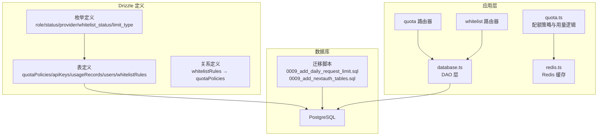
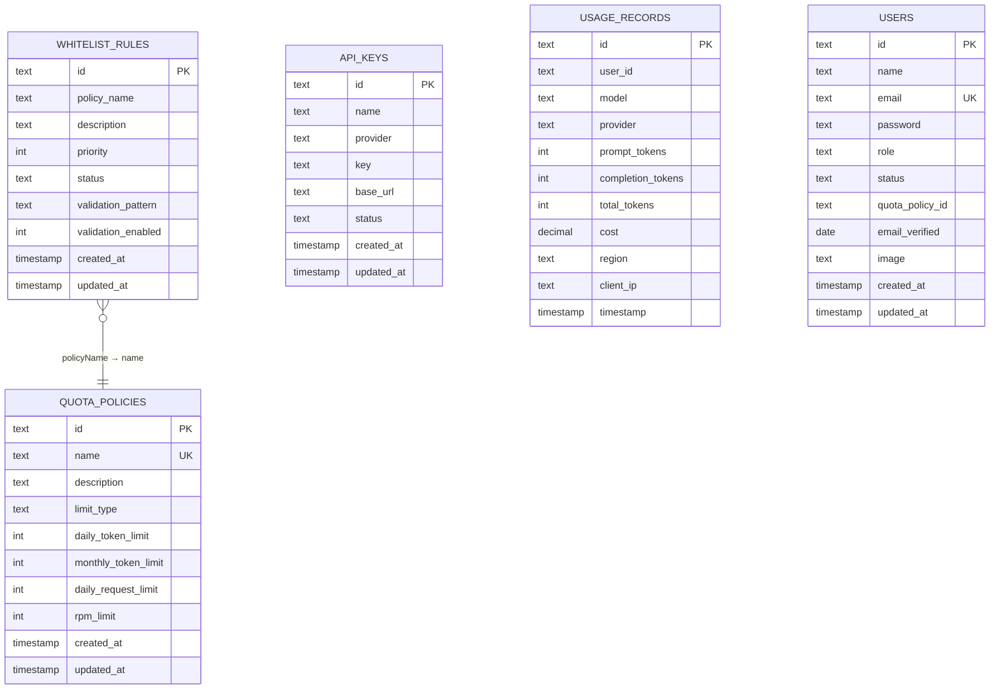
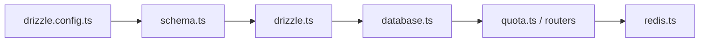

# 数据模型设计

<cite>
**本文档引用的文件**
- [schema.ts](file://src/lib/schema.ts)
- [database.ts](file://src/lib/database.ts)
- [types.ts](file://src/lib/types.ts)
- [drizzle.ts](file://src/lib/drizzle.ts)
- [drizzle.config.ts](file://drizzle.config.ts)
- [0009_add_daily_request_limit.sql](file://drizzle/0009_add_daily_request_limit.sql)
- [0009_add_nextauth_tables.sql](file://drizzle/0009_add_nextauth_tables.sql)
- [quota.ts](file://src/lib/quota.ts)
- [redis.ts](file://src/lib/redis.ts)
- [quota.ts 路由器](file://src/server/api/routers/quota.ts)
- [whitelist.ts 路由器](file://src/server/api/routers/whitelist.ts)
- [_journal.json](file://drizzle/meta/_journal.json)
</cite>

## 目录
1. [简介](#简介)
2. [项目结构](#项目结构)
3. [核心组件](#核心组件)
4. [架构总览](#架构总览)
5. [详细组件分析](#详细组件分析)
6. [依赖关系分析](#依赖关系分析)
7. [性能考量](#性能考量)
8. [故障排查指南](#故障排查指南)
9. [结论](#结论)
10. [附录](#附录)

## 简介
本文件系统性梳理 AIGate 的数据模型设计，聚焦于核心表结构与关系，涵盖配额策略、API 密钥、用量记录、用户与白名单规则等。文档详细说明字段定义、数据类型、约束规则、枚举类型、外键关系与级联行为，并解释业务含义与使用场景，帮助开发者与运维人员准确理解与维护数据模型。

## 项目结构
数据模型由 Drizzle ORM 在 PostgreSQL 中实现，采用“枚举 + 表 + 关系”的组织方式，配合迁移脚本与 tRPC 路由器进行运行时访问与控制。

图表来源
- [schema.ts](file://src/lib/schema.ts#L12-L159)
- [database.ts](file://src/lib/database.ts#L1-L524)
- [quota.ts](file://src/lib/quota.ts#L1-L334)
- [redis.ts](file://src/lib/redis.ts#L1-L49)
- [quota.ts 路由器](file://src/server/api/routers/quota.ts#L1-L301)
- [whitelist.ts 路由器](file://src/server/api/routers/whitelist.ts#L1-L189)
- [0009_add_daily_request_limit.sql](file://drizzle/0009_add_daily_request_limit.sql#L1-L9)
- [0009_add_nextauth_tables.sql](file://drizzle/0009_add_nextauth_tables.sql#L1-L33)

章节来源
- [schema.ts](file://src/lib/schema.ts#L12-L159)
- [drizzle.config.ts](file://drizzle.config.ts#L1-L11)
- [_journal.json](file://drizzle/meta/_journal.json#L1-L69)

## 核心组件
- 枚举类型
  - 角色枚举：USER、ADMIN
  - 状态枚举：ACTIVE、INACTIVE、SUSPENDED
  - AI 供应商枚举：OPENAI、ANTHROPIC、GOOGLE、DEEPSEEK、MOONSHOT、SPARK
  - 白名单状态枚举：active、inactive
  - 限制类型枚举：token、request
- 核心表
  - quotaPolicies：配额策略
  - apiKeys：API 密钥
  - usageRecords：用量记录
  - users：用户（含 NextAuth 扩展字段）
  - whitelistRules：白名单规则
- 关系
  - whitelistRules.policyName → quotaPolicies.name（一对一）

章节来源
- [schema.ts](file://src/lib/schema.ts#L12-L159)

## 架构总览
数据模型围绕“策略-规则-用量”闭环构建：白名单规则决定用户归属的配额策略；配额策略定义限制类型与限额；用量记录承载实际消耗；API 密钥提供外部服务调用凭据；用户表支撑认证与权限。

图表来源
- [schema.ts](file://src/lib/schema.ts#L28-L159)

## 详细组件分析

### 配额策略表 quotaPolicies
- 字段与约束
  - id：主键，文本类型
  - name：唯一索引，策略名称
  - description：描述
  - limitType：限制类型，默认 token，取值限定为 token/request
  - dailyTokenLimit：每日 Token 限额（当 limitType=token 时生效）
  - monthlyTokenLimit：月度 Token 限额
  - dailyRequestLimit：每日请求次数限额（新增字段）
  - rpmLimit：每分钟请求限制，默认 60
  - createdAt/updatedAt：默认当前时间
- 业务含义
  - 通过 limitType 决定按 Token 或请求数量进行配额控制
  - 支持 token 与 request 两种模式的混合配置
- 数据类型选择
  - 文本主键与名称：便于全局唯一标识与跨系统引用
  - 整数限额：简单直观，便于 Redis 计数
  - decimal cost：在用量记录中使用，用于精确成本计算
- 约束与检查
  - 通过迁移脚本添加 limit_type 字段与检查约束，确保取值合法

章节来源
- [schema.ts](file://src/lib/schema.ts#L28-L40)
- [0009_add_daily_request_limit.sql](file://drizzle/0009_add_daily_request_limit.sql#L1-L9)

### API 密钥表 apiKeys
- 字段与约束
  - id：主键
  - name：名称
  - provider：供应商枚举
  - key：密钥
  - base_url：可选的自定义基础地址
  - status：状态枚举，默认 ACTIVE
  - createdAt/updatedAt：默认当前时间
- 业务含义
  - 统一管理各供应商的 API 凭据，支持启用/禁用与缓存
- 数据类型选择
  - 文本类型统一存储密钥与供应商标识
  - 状态使用枚举保证一致性

章节来源
- [schema.ts](file://src/lib/schema.ts#L42-L52)
- [apiKey.ts 路由器](file://src/server/api/routers/apiKey.ts#L1-L462)

### 用量记录表 usageRecords
- 字段与约束
  - id：主键
  - userId：用户标识（可为邮箱或标识符）
  - model/provider：模型与供应商
  - prompt_tokens/completion_tokens/total_tokens：Token 统计
  - cost：decimal 成本
  - region/client_ip：地理与来源信息
  - timestamp：默认当前时间
- 业务含义
  - 记录每次请求的 Token 消耗与成本，支持统计与审计
- 数据类型选择
  - decimal cost：高精度成本计算
  - timestamp：统一时间戳记录

章节来源
- [schema.ts](file://src/lib/schema.ts#L54-L67)
- [database.ts](file://src/lib/database.ts#L142-L277)

### 用户表 users
- 字段与约束
  - id：主键
  - name/email/password：用户基本信息与认证字段
  - role/status：角色与状态枚举，默认 USER、ACTIVE
  - quotaPolicyId：外键关联 quotaPolicies.id（注：代码中为 quota_policy_id，迁移脚本中为 quota_policy_id）
  - email_verified/image：NextAuth 扩展字段
  - createdAt/updatedAt：默认当前时间
- 业务含义
  - 支撑认证与授权，绑定配额策略
- 外键与级联
  - accounts/sessions 表对 users.id 建立外键并设置级联删除

章节来源
- [schema.ts](file://src/lib/schema.ts#L69-L82)
- [0009_add_nextauth_tables.sql](file://drizzle/0009_add_nextauth_tables.sql#L1-L33)

### 白名单规则表 whitelistRules
- 字段与约束
  - id：主键
  - policyName：策略名称（与 quotaPolicies.name 关联）
  - description：描述
  - priority：优先级，默认 1
  - status：状态枚举，默认 active
  - validationPattern/validationEnabled：正则匹配与开关
  - createdAt/updatedAt：默认当前时间
- 业务含义
  - 通过优先级与正则匹配将用户映射到配额策略
- 关系
  - policyName → quotaPolicies.name（一对一）

章节来源
- [schema.ts](file://src/lib/schema.ts#L84-L95)
- [schema.ts](file://src/lib/schema.ts#L136-L142)

### NextAuth 相关表
- accounts
  - 外键 user_id → users.id，ON DELETE CASCADE
- sessions
  - 外键 user_id → users.id，ON DELETE CASCADE
  - sessionToken 唯一
- verification_tokens
  - 复合主键 (identifier, token)，token 唯一

章节来源
- [schema.ts](file://src/lib/schema.ts#L97-L134)
- [0009_add_nextauth_tables.sql](file://drizzle/0009_add_nextauth_tables.sql#L5-L33)

## 依赖关系分析
- Drizzle 配置
  - schema 指向 src/lib/schema.ts
  - dialect 为 postgresql
  - credentials 来自环境变量 DATABASE_URL
- 运行时连接
  - drizzle.ts 通过 postgres-js 建立连接并注入 schema
- DAO 层
  - database.ts 提供 CRUD 与统计查询
- 业务逻辑
  - quota.ts 结合 Redis 实现配额检查与用量记录
  - 路由器提供对外 API（tRPC）

图表来源
- [drizzle.config.ts](file://drizzle.config.ts#L1-L11)
- [schema.ts](file://src/lib/schema.ts#L1-L10)
- [drizzle.ts](file://src/lib/drizzle.ts#L1-L12)
- [database.ts](file://src/lib/database.ts#L1-L16)
- [quota.ts](file://src/lib/quota.ts#L1-L334)

章节来源
- [drizzle.config.ts](file://drizzle.config.ts#L1-L11)
- [drizzle.ts](file://src/lib/drizzle.ts#L1-L12)
- [database.ts](file://src/lib/database.ts#L1-L524)

## 性能考量
- Redis 缓存
  - 配额策略缓存：user_policy:*，提升策略读取性能
  - API Key 缓存：api_keys:provider，降低数据库压力
  - 日常用量与 RPM 计数：按日期与分钟粒度缓存，避免热点竞争
- 数据库优化
  - 用量记录按 timestamp 排序查询，建议在 timestamp 上建立索引（当前 schema 未显式声明索引，但查询会基于该列）
  - 白名单规则按 priority 排序，建议在 priority 建立索引
- 事务与并发
  - Redis incr/incrBy 为原子操作，适合高并发计数
  - 数据库写入用量记录采用批量插入返回机制，减少往返

章节来源
- [redis.ts](file://src/lib/redis.ts#L18-L49)
- [quota.ts](file://src/lib/quota.ts#L192-L255)
- [database.ts](file://src/lib/database.ts#L142-L277)

## 故障排查指南
- 配额策略不生效
  - 检查白名单规则 status 是否为 active
  - 确认 policyName 与 quotaPolicies.name 是否一致
  - 查看 Redis 缓存 user_policy:* 是否存在
- 用量统计异常
  - 核对 usageRecords 的 timestamp 是否正确
  - 检查 Redis 中 user_quota:* 与 user_requests:* 键是否存在
- API Key 无法使用
  - 确认 apiKeys.status 为 ACTIVE
  - 检查 Redis 缓存 api_keys:provider 是否存在
- 认证问题
  - 检查 accounts/sessions 表外键是否正常，确认级联删除行为
  - 核对 users.password 与 email_verified 字段

章节来源
- [whitelist.ts 路由器](file://src/server/api/routers/whitelist.ts#L1-L189)
- [quota.ts 路由器](file://src/server/api/routers/quota.ts#L1-L301)
- [apiKey.ts 路由器](file://src/server/api/routers/apiKey.ts#L1-L462)
- [database.ts](file://src/lib/database.ts#L1-L524)

## 结论
AIGate 的数据模型以清晰的枚举与表结构为基础，结合 Redis 缓存与 tRPC 路由器，实现了高效的配额控制与用量统计。通过白名单规则与配额策略的解耦设计，系统具备良好的可扩展性与可维护性。建议在生产环境中持续关注 Redis 缓存命中率与数据库索引策略，以进一步提升性能与稳定性。

## 附录

### 字段与类型对照表
- quotaPolicies
  - id：text（PK）
  - name：text（UK）
  - limit_type：text（枚举 token/request）
  - daily_token_limit：integer
  - monthly_token_limit：integer
  - daily_request_limit：integer（新增）
  - rpm_limit：integer（默认 60）
  - createdAt/updatedAt：timestamp（默认当前时间）
- apiKeys
  - id：text（PK）
  - provider：枚举（OPENAI/ANTHROPIC/GOOGLE/DEEPSEEK/MOONSHOT/SPARK）
  - status：枚举（ACTIVE/INACTIVE/SUSPENDED）
  - base_url：text（可选）
  - createdAt/updatedAt：timestamp（默认当前时间）
- usageRecords
  - id：text（PK）
  - user_id：text
  - model/provider：text
  - prompt_tokens/completion_tokens/total_tokens：integer
  - cost：decimal（精度 10，标度 6）
  - region/client_ip：text
  - timestamp：timestamp（默认当前时间）
- users
  - id：text（PK）
  - email：text（UK）
  - role/status：枚举（USER/ADMIN；ACTIVE/INACTIVE/SUSPENDED）
  - quota_policy_id：text（外键指向 quotaPolicies.id）
  - email_verified：date
  - image：text
  - createdAt/updatedAt：timestamp（默认当前时间）
- whitelistRules
  - id：text（PK）
  - policyName：text（与 quotaPolicies.name 关联）
  - status：枚举（active/inactive）
  - priority：integer（默认 1）
  - validation_pattern：text（可选）
  - validation_enabled：integer（默认 0，1 表示启用）
  - createdAt/updatedAt：timestamp（默认当前时间）

章节来源
- [schema.ts](file://src/lib/schema.ts#L12-L159)
- [0009_add_daily_request_limit.sql](file://drizzle/0009_add_daily_request_limit.sql#L1-L9)
- [0009_add_nextauth_tables.sql](file://drizzle/0009_add_nextauth_tables.sql#L1-L33)