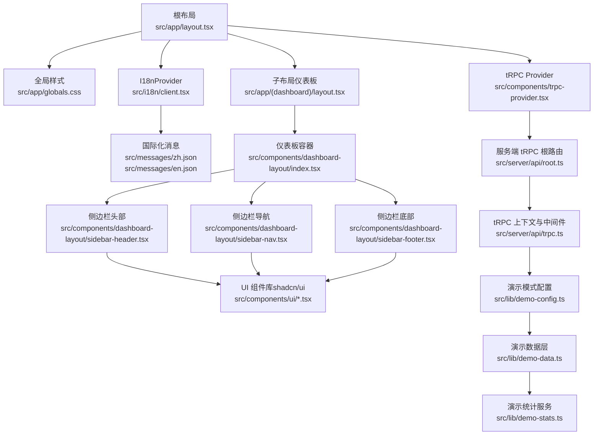
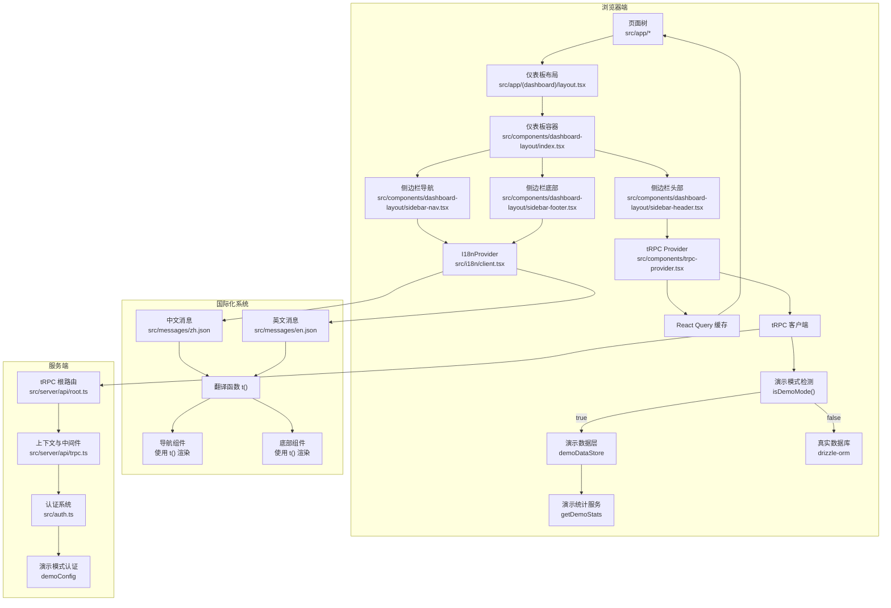
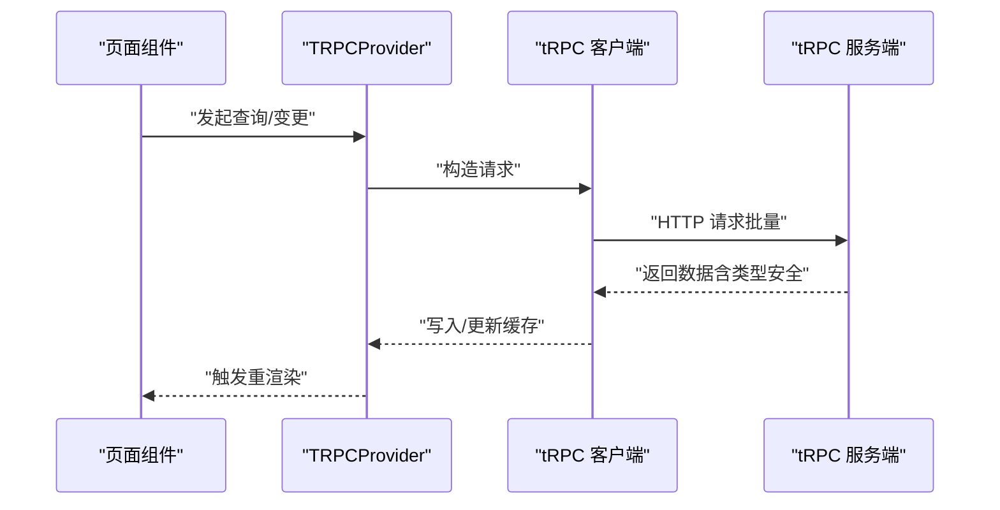
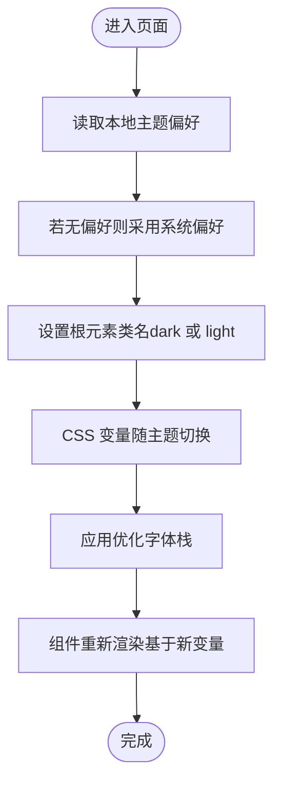
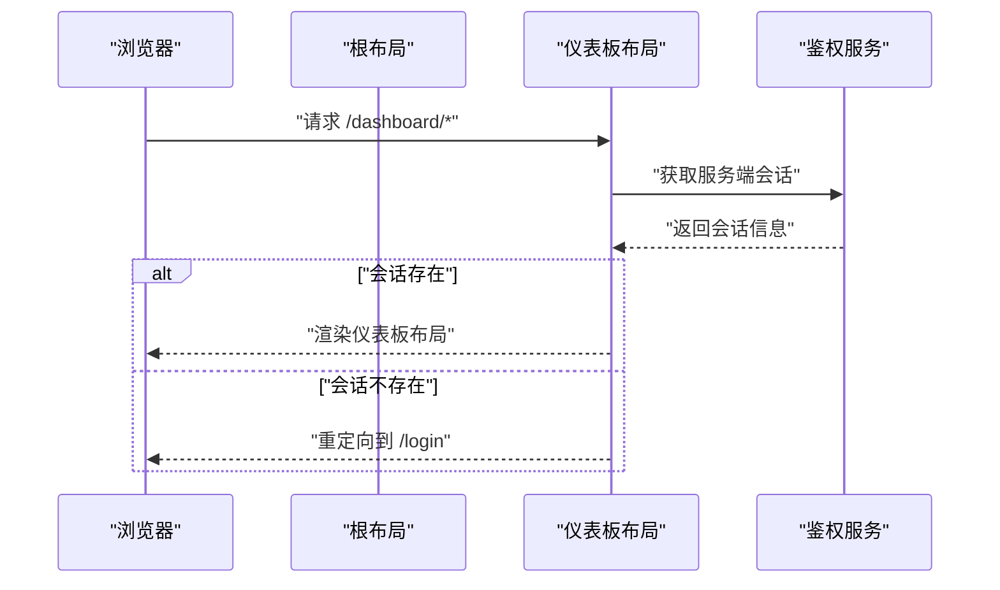
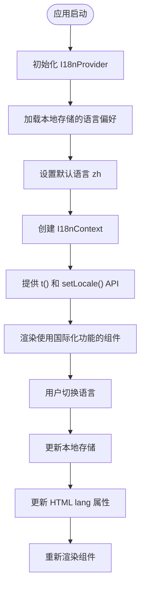
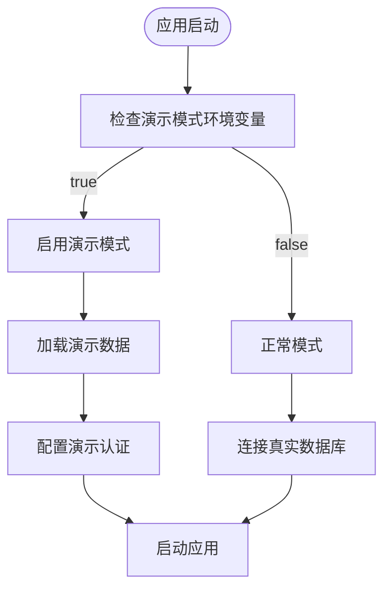
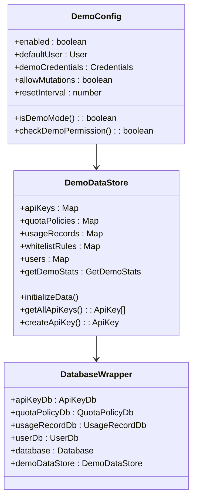
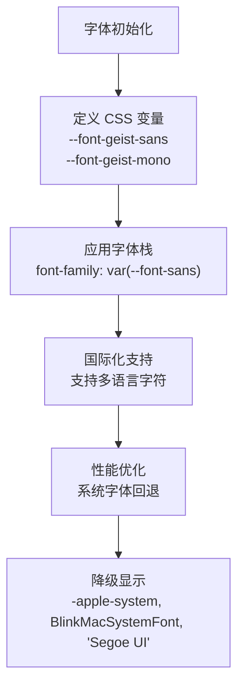
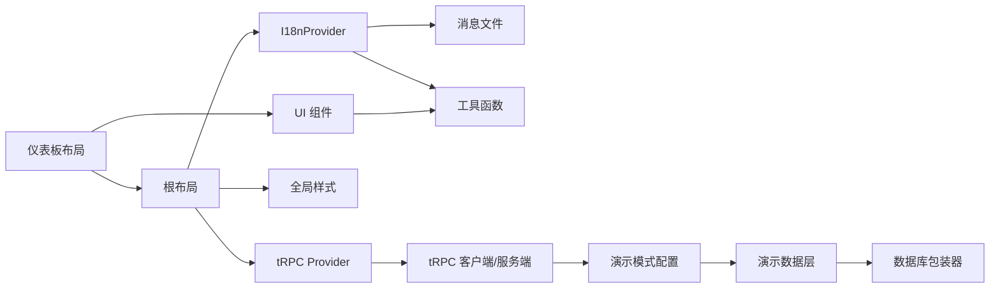

# 前端架构

<cite>
**本文引用的文件**
- [package.json](file://package.json)
- [next.config.ts](file://next.config.ts)
- [tailwind.config.js](file://tailwind.config.js)
- [components.json](file://components.json)
- [src/app/layout.tsx](file://src/app/layout.tsx)
- [src/components/trpc-provider.tsx](file://src/components/trpc-provider.tsx)
- [src/app/globals.css](file://src/app/globals.css)
- [src/components/dashboard-layout/index.tsx](file://src/components/dashboard-layout/index.tsx)
- [src/components/dashboard-layout/sidebar-header.tsx](file://src/components/dashboard-layout/sidebar-header.tsx)
- [src/components/dashboard-layout/sidebar-nav.tsx](file://src/components/dashboard-layout/sidebar-nav.tsx)
- [src/components/dashboard-layout/sidebar-footer.tsx](file://src/components/dashboard-layout/sidebar-footer.tsx)
- [src/app/(dashboard)/layout.tsx](file://src/app/(dashboard)/layout.tsx)
- [src/i18n/client.tsx](file://src/i18n/client.tsx)
- [src/messages/zh.json](file://src/messages/zh.json)
- [src/messages/en.json](file://src/messages/en.json)
- [src/server/api/root.ts](file://src/server/api/root.ts)
- [src/server/api/trpc.ts](file://src/server/api/trpc.ts)
- [src/lib/utils.ts](file://src/lib/utils.ts)
- [src/components/ui/button.tsx](file://src/components/ui/button.tsx)
- [src/components/ui/dialog.tsx](file://src/components/ui/dialog.tsx)
- [src/components/ui/table.tsx](file://src/components/ui/table.tsx)
- [src/lib/demo-config.ts](file://src/lib/demo-config.ts)
- [src/lib/demo-data.ts](file://src/lib/demo-data.ts)
- [src/lib/demo-stats.ts](file://src/lib/demo-stats.ts)
- [src/auth.ts](file://src/auth.ts)
- [src/lib/database.ts](file://src/lib/database.ts)
</cite>

## 更新摘要
**所做更改**
- 更新仪表板布局章节，反映从 monolithic 设计向 component composition 模式的重大演进
- 新增国际化系统章节，详细介绍完整的 I18nProvider 架构实现
- 增强组件详解部分，包含新的仪表板组件拆分和国际化集成
- 更新架构总览图，展示新的组件组合模式和国际化流程
- 完善依赖关系分析，体现新增的国际化依赖和组件拆分影响

## 目录
1. [引言](#引言)
2. [项目结构](#项目结构)
3. [核心组件](#核心组件)
4. [架构总览](#架构总览)
5. [组件详解](#组件详解)
6. [国际化系统](#国际化系统)
7. [演示模式集成](#演示模式集成)
8. [字体栈优化](#字体栈优化)
9. [依赖关系分析](#依赖关系分析)
10. [性能与构建优化](#性能与构建优化)
11. [故障排查指南](#故障排查指南)
12. [结论](#结论)
13. [附录](#附录)

## 引言
本文件面向 AIGate 前端团队与维护者，系统性梳理基于 Next.js 14 App Router 的前端架构，重点覆盖以下方面：
- 路由系统与页面/布局组织
- tRPC Provider 集成与状态管理
- shadcn/ui 组件体系的使用与定制策略
- 全局样式、主题系统与响应式设计
- 国际化系统架构与实现
- 演示模式集成与权限控制
- 字体栈优化与性能考量
- 开发环境配置、构建优化与性能考量
- 组件组织结构、命名约定与最佳实践

## 项目结构
AIGate 前端采用 Next.js 14 App Router 的 App 目录结构，结合服务端渲染、客户端 Provider 包裹与自定义 Tailwind 主题，形成统一的前端入口与组件生态。最新架构演进包括仪表板布局的组件化重构和完整的国际化系统集成。



**图表来源**
- [src/app/layout.tsx:1-64](file://src/app/layout.tsx#L1-L64)
- [src/i18n/client.tsx:1-96](file://src/i18n/client.tsx#L1-L96)
- [src/app/globals.css:1-138](file://src/app/globals.css#L1-L138)
- [src/components/trpc-provider.tsx:1-64](file://src/components/trpc-provider.tsx#L1-L64)
- [src/app/(dashboard)/layout.tsx:1-19](file://src/app/(dashboard)/layout.tsx#L1-L19)
- [src/components/dashboard-layout/index.tsx:1-29](file://src/components/dashboard-layout/index.tsx#L1-L29)
- [src/components/dashboard-layout/sidebar-header.tsx:1-18](file://src/components/dashboard-layout/sidebar-header.tsx#L1-L18)
- [src/components/dashboard-layout/sidebar-nav.tsx:1-64](file://src/components/dashboard-layout/sidebar-nav.tsx#L1-L64)
- [src/components/dashboard-layout/sidebar-footer.tsx:1-167](file://src/components/dashboard-layout/sidebar-footer.tsx#L1-L167)
- [src/server/api/root.ts:1-25](file://src/server/api/root.ts#L1-L25)
- [src/server/api/trpc.ts:1-153](file://src/server/api/trpc.ts#L1-L153)
- [src/lib/demo-config.ts:1-57](file://src/lib/demo-config.ts#L1-L57)
- [src/lib/demo-data.ts:1-435](file://src/lib/demo-data.ts#L1-L435)
- [src/lib/demo-stats.ts:1-111](file://src/lib/demo-stats.ts#L1-L111)

**章节来源**
- [src/app/layout.tsx:1-64](file://src/app/layout.tsx#L1-L64)
- [src/i18n/client.tsx:1-96](file://src/i18n/client.tsx#L1-L96)
- [src/app/globals.css:1-138](file://src/app/globals.css#L1-L138)
- [src/components/trpc-provider.tsx:1-64](file://src/components/trpc-provider.tsx#L1-L64)
- [src/app/(dashboard)/layout.tsx:1-19](file://src/app/(dashboard)/layout.tsx#L1-L19)
- [src/components/dashboard-layout/index.tsx:1-29](file://src/components/dashboard-layout/index.tsx#L1-L29)
- [src/components/dashboard-layout/sidebar-header.tsx:1-18](file://src/components/dashboard-layout/sidebar-header.tsx#L1-L18)
- [src/components/dashboard-layout/sidebar-nav.tsx:1-64](file://src/components/dashboard-layout/sidebar-nav.tsx#L1-L64)
- [src/components/dashboard-layout/sidebar-footer.tsx:1-167](file://src/components/dashboard-layout/sidebar-footer.tsx#L1-L167)
- [src/server/api/root.ts:1-25](file://src/server/api/root.ts#L1-L25)
- [src/server/api/trpc.ts:1-153](file://src/server/api/trpc.ts#L1-L153)
- [src/lib/demo-config.ts:1-57](file://src/lib/demo-config.ts#L1-L57)
- [src/lib/demo-data.ts:1-435](file://src/lib/demo-data.ts#L1-L435)
- [src/lib/demo-stats.ts:1-111](file://src/lib/demo-stats.ts#L1-L111)

## 核心组件
- 根布局与全局注入
  - 根布局负责注入全局样式、国际化提供者、开发期调试脚本、全局通知组件与 tRPC Provider，确保所有页面共享一致的主题、国际化与数据层能力。
- 国际化系统（新增）
  - 完整的 I18nProvider 架构，支持多语言切换、本地存储持久化、嵌套消息解析和 HTML lang 属性同步。
- tRPC Provider
  - 使用 React Query 作为本地缓存与状态管理，通过 tRPC 客户端进行批量 HTTP 请求，并启用日志链路以便开发调试。
- 仪表板布局（重构）
  - 采用组件组合模式，将侧边栏拆分为独立的 Header、Nav、Footer 组件，提升可维护性和扩展性。
- UI 组件库（shadcn/ui）
  - 基于 Radix UI 与 Tailwind CSS，提供按钮、对话框、表格等高复用组件，并以变体与尺寸扩展视觉表现。
- 演示模式系统
  - 提供完整的演示模式配置、权限控制和数据层集成，支持只读模式和数据重置功能。

**章节来源**
- [src/app/layout.tsx:1-64](file://src/app/layout.tsx#L1-L64)
- [src/i18n/client.tsx:1-96](file://src/i18n/client.tsx#L1-L96)
- [src/components/trpc-provider.tsx:1-64](file://src/components/trpc-provider.tsx#L1-L64)
- [src/components/dashboard-layout/index.tsx:1-29](file://src/components/dashboard-layout/index.tsx#L1-L29)
- [src/components/dashboard-layout/sidebar-header.tsx:1-18](file://src/components/dashboard-layout/sidebar-header.tsx#L1-L18)
- [src/components/dashboard-layout/sidebar-nav.tsx:1-64](file://src/components/dashboard-layout/sidebar-nav.tsx#L1-L64)
- [src/components/dashboard-layout/sidebar-footer.tsx:1-167](file://src/components/dashboard-layout/sidebar-footer.tsx#L1-L167)
- [src/components/ui/button.tsx:1-77](file://src/components/ui/button.tsx#L1-L77)
- [src/components/ui/dialog.tsx:1-125](file://src/components/ui/dialog.tsx#L1-L125)
- [src/components/ui/table.tsx:1-115](file://src/components/ui/table.tsx#L1-L115)
- [src/lib/demo-config.ts:1-57](file://src/lib/demo-config.ts#L1-L57)

## 架构总览
整体架构围绕"App Router 页面树 + Provider 注入 + 组件组合模式 + 国际化系统 + 自定义 UI 组件库 + 演示模式支持"的模式展开，服务端通过 tRPC 暴露统一 API，客户端通过 tRPC React 与 React Query 实现高效的数据获取与缓存。最新的组件化仪表板布局提升了代码的可维护性和扩展性，完整的国际化系统确保了多语言支持的一致性。



**图表来源**
- [src/app/(dashboard)/layout.tsx:1-19](file://src/app/(dashboard)/layout.tsx#L1-L19)
- [src/components/dashboard-layout/index.tsx:1-29](file://src/components/dashboard-layout/index.tsx#L1-L29)
- [src/components/dashboard-layout/sidebar-header.tsx:1-18](file://src/components/dashboard-layout/sidebar-header.tsx#L1-L18)
- [src/components/dashboard-layout/sidebar-nav.tsx:1-64](file://src/components/dashboard-layout/sidebar-nav.tsx#L1-L64)
- [src/components/dashboard-layout/sidebar-footer.tsx:1-167](file://src/components/dashboard-layout/sidebar-footer.tsx#L1-L167)
- [src/components/trpc-provider.tsx:1-64](file://src/components/trpc-provider.tsx#L1-L64)
- [src/i18n/client.tsx:1-96](file://src/i18n/client.tsx#L1-L96)
- [src/messages/zh.json:1-92](file://src/messages/zh.json#L1-L92)
- [src/messages/en.json:1-92](file://src/messages/en.json#L1-L92)
- [src/server/api/root.ts:1-25](file://src/server/api/root.ts#L1-L25)
- [src/server/api/trpc.ts:1-153](file://src/server/api/trpc.ts#L1-L153)
- [src/lib/demo-config.ts:1-57](file://src/lib/demo-config.ts#L1-L57)
- [src/lib/demo-data.ts:1-435](file://src/lib/demo-data.ts#L1-L435)
- [src/lib/demo-stats.ts:1-111](file://src/lib/demo-stats.ts#L1-L111)
- [src/auth.ts:1-150](file://src/auth.ts#L1-L150)

## 组件详解

### 仪表板布局：从 monolithic 到 component composition

**更新** 仪表板布局已从单一 monolithic 组件演进为模块化的组件组合模式，显著提升了代码的可维护性和扩展性。

- 设计理念
  - 采用组件组合模式（Component Composition），将复杂的侧边栏拆分为独立的功能组件
  - 每个组件专注于单一职责，通过组合实现复杂布局
  - 支持独立测试和独立开发，提升开发效率
- 核心组件
  - DashboardLayout：主容器组件，负责整体布局结构
  - SidebarHeader：侧边栏头部，包含品牌标识和标题
  - SidebarNav：侧边栏导航，集成国际化翻译功能
  - SidebarFooter：侧边栏底部，包含主题切换、用户菜单和语言切换器
- 优势
  - 可维护性：每个组件职责明确，易于理解和修改
  - 可扩展性：新增功能只需添加新组件，无需修改现有代码
  - 可测试性：组件可以独立测试，提高测试覆盖率
  - 可复用性：组件可以在其他项目中复用

```mermaid
classDiagram
class DashboardLayout {
+children : React.ReactNode
+render() : JSX.Element
}
class SidebarHeader {
+render() : JSX.Element
}
class SidebarNav {
+render() : JSX.Element
+t : (key : string) => string
}
class SidebarFooter {
+render() : JSX.Element
+LanguageSwitcher() : JSX.Element
+ThemeToggle() : void
+UserMenu() : JSX.Element
}
DashboardLayout --> SidebarHeader
DashboardLayout --> SidebarNav
DashboardLayout --> SidebarFooter
SidebarNav --> I18nContext["useTranslation()"]
SidebarFooter --> I18nContext
```

**图表来源**
- [src/components/dashboard-layout/index.tsx:1-29](file://src/components/dashboard-layout/index.tsx#L1-L29)
- [src/components/dashboard-layout/sidebar-header.tsx:1-18](file://src/components/dashboard-layout/sidebar-header.tsx#L1-L18)
- [src/components/dashboard-layout/sidebar-nav.tsx:1-64](file://src/components/dashboard-layout/sidebar-nav.tsx#L1-L64)
- [src/components/dashboard-layout/sidebar-footer.tsx:1-167](file://src/components/dashboard-layout/sidebar-footer.tsx#L1-L167)
- [src/i18n/client.tsx:89-95](file://src/i18n/client.tsx#L89-L95)

**章节来源**
- [src/components/dashboard-layout/index.tsx:1-29](file://src/components/dashboard-layout/index.tsx#L1-L29)
- [src/components/dashboard-layout/sidebar-header.tsx:1-18](file://src/components/dashboard-layout/sidebar-header.tsx#L1-L18)
- [src/components/dashboard-layout/sidebar-nav.tsx:1-64](file://src/components/dashboard-layout/sidebar-nav.tsx#L1-L64)
- [src/components/dashboard-layout/sidebar-footer.tsx:1-167](file://src/components/dashboard-layout/sidebar-footer.tsx#L1-L167)

### tRPC Provider 集成与状态管理
- 设计理念
  - 将 tRPC 客户端与 React Query 缓存组合，形成统一的数据流：本地缓存（React Query）+ 远端调用（tRPC）+ 变更传播（组件订阅）。
- 关键点
  - 客户端自动根据运行环境选择基础 URL，支持 SSR 与 Vercel 部署场景。
  - 默认查询缓存时间与重试策略，降低网络抖动对用户体验的影响。
  - 开发环境下启用日志链路，便于定位请求与错误。
- 状态管理
  - 通过 React Query 的 QueryClient 管理本地状态，组件可直接消费 tRPC 查询结果，无需手动写样板代码。



**图表来源**
- [src/components/trpc-provider.tsx:1-64](file://src/components/trpc-provider.tsx#L1-L64)
- [src/server/api/root.ts:1-25](file://src/server/api/root.ts#L1-L25)
- [src/server/api/trpc.ts:1-153](file://src/server/api/trpc.ts#L1-L153)

**章节来源**
- [src/components/trpc-provider.tsx:1-64](file://src/components/trpc-provider.tsx#L1-L64)
- [src/server/api/root.ts:1-25](file://src/server/api/root.ts#L1-L25)
- [src/server/api/trpc.ts:1-153](file://src/server/api/trpc.ts#L1-L153)

### shadcn/ui 组件系统与定制策略
- 使用策略
  - 通过组件别名与工具函数统一类名合并，保证样式一致性与可维护性。
  - 组件均支持变体（variant）与尺寸（size），满足不同场景下的视觉需求。
- 定制策略
  - 以 Tailwind CSS 变量与 CSS 自定义属性为基础，结合暗色模式变量，实现跨组件的主题一致性。
  - 通过组件内部的变体规则与阴影、模糊、边框等效果，统一 Liquid Glass 视觉风格。
- 示例组件
  - 按钮：提供多种变体与尺寸，适配不同交互层级。
  - 对话框：内置玻璃态背景、模糊与投影，提升信息密度与层次感。
  - 表格：在容器层面叠加玻璃态与阴影，增强可读性与对比度。

```mermaid
classDiagram
class Button {
+props : "variant,size,asChild,..."
+className : "基于变体与尺寸生成"
}
class Dialog {
+overlay : "模糊背景"
+content : "玻璃态容器"
+close : "带动画的关闭按钮"
}
class Table {
+container : "玻璃态+阴影"
+header/body/footer : "分层样式"
+row/cell : "悬停与选中态"
}
Button --> Utils["类名合并工具"]
Dialog --> Utils
Table --> Utils
```

**图表来源**
- [src/components/ui/button.tsx:1-77](file://src/components/ui/button.tsx#L1-L77)
- [src/components/ui/dialog.tsx:1-125](file://src/components/ui/dialog.tsx#L1-L125)
- [src/components/ui/table.tsx:1-115](file://src/components/ui/table.tsx#L1-L115)
- [src/lib/utils.ts:1-7](file://src/lib/utils.ts#L1-L7)

**章节来源**
- [src/components/ui/button.tsx:1-77](file://src/components/ui/button.tsx#L1-L77)
- [src/components/ui/dialog.tsx:1-125](file://src/components/ui/dialog.tsx#L1-L125)
- [src/components/ui/table.tsx:1-115](file://src/components/ui/table.tsx#L1-L115)
- [src/lib/utils.ts:1-7](file://src/lib/utils.ts#L1-L7)

### 全局样式、主题系统与响应式设计
- 全局样式
  - 通过 CSS 变量定义明/暗两套主题色彩，配合 Tailwind CSS 的 @theme inline 机制，使组件与全局样式保持一致。
  - Liquid Glass 效果通过背景透明度、模糊与饱和度等变量统一实现。
  - 字体栈优化：使用 Geist Sans 和 Geist Mono 作为主要字体，提供更好的国际化支持和性能表现。
- 主题系统
  - 支持本地存储主题偏好与系统偏好检测；切换时动态更新根元素类名，驱动 CSS 变量生效。
- 响应式设计
  - Tailwind 配置包含容器宽度与断点，组件普遍采用相对单位与语义化尺寸，保证在不同设备上的可读性与可用性。



**图表来源**
- [src/components/dashboard-layout/sidebar-footer.tsx:11-43](file://src/components/dashboard-layout/sidebar-footer.tsx#L11-L43)
- [src/app/globals.css:5-138](file://src/app/globals.css#L5-L138)

**章节来源**
- [src/app/globals.css:1-138](file://src/app/globals.css#L1-L138)
- [src/components/dashboard-layout/sidebar-footer.tsx:1-167](file://src/components/dashboard-layout/sidebar-footer.tsx#L1-L167)

### 路由系统、页面结构与布局管理
- 路由系统
  - 使用 App Router 的分组与嵌套路由，将仪表板相关页面置于 `(dashboard)` 分组内，统一受仪表板布局保护。
- 页面与布局
  - 根布局负责全局注入与 Provider 包裹；仪表板布局负责鉴权跳转与页面骨架。
- 鉴权流程
  - 仪表板布局在服务端获取会话，未登录则重定向至登录页，确保页面访问的安全性。



**图表来源**
- [src/app/layout.tsx:1-64](file://src/app/layout.tsx#L1-L64)
- [src/app/(dashboard)/layout.tsx:1-19](file://src/app/(dashboard)/layout.tsx#L1-L19)

**章节来源**
- [src/app/layout.tsx:1-64](file://src/app/layout.tsx#L1-L64)
- [src/app/(dashboard)/layout.tsx:1-19](file://src/app/(dashboard)/layout.tsx#L1-L19)

## 国际化系统

### I18nProvider 架构与实现

**新增** AIGate 前端现已集成完整的国际化系统，采用 I18nProvider 架构提供多语言支持。

- 架构设计
  - 基于 React Context 的 I18nProvider 提供全局国际化状态
  - 支持中文（zh）和英文（en）双语切换
  - 本地存储持久化用户语言偏好
  - 嵌套消息对象支持复杂结构的翻译
- 核心功能
  - 语言切换：通过 LanguageSwitcher 组件实现一键切换
  - 翻译函数：t(key) 返回对应语言的翻译文本
  - 嵌套值解析：支持 `Navigation.dashboard` 等路径形式的嵌套访问
  - HTML lang 同步：自动更新 document.documentElement.lang 属性
- 实现细节
  - 使用 useLocalStorageState 管理语言偏好
  - 通过 getNestedValue 函数解析嵌套消息对象
  - 错误处理：未找到翻译键时返回键名并发出警告
  - 类型安全：Locale 类型约束确保语言值的有效性



**图表来源**
- [src/i18n/client.tsx:53-87](file://src/i18n/client.tsx#L53-L87)
- [src/components/dashboard-layout/sidebar-nav.tsx:37-40](file://src/components/dashboard-layout/sidebar-nav.tsx#L37-L40)
- [src/components/dashboard-layout/sidebar-footer.tsx:121-152](file://src/components/dashboard-layout/sidebar-footer.tsx#L121-L152)

**章节来源**
- [src/i18n/client.tsx:1-96](file://src/i18n/client.tsx#L1-L96)
- [src/messages/zh.json:1-92](file://src/messages/zh.json#L1-L92)
- [src/messages/en.json:1-92](file://src/messages/en.json#L1-L92)
- [src/components/dashboard-layout/sidebar-nav.tsx:1-64](file://src/components/dashboard-layout/sidebar-nav.tsx#L1-L64)
- [src/components/dashboard-layout/sidebar-footer.tsx:1-167](file://src/components/dashboard-layout/sidebar-footer.tsx#L1-L167)

### 国际化集成与使用

**更新** 仪表板导航和底部组件已完全集成国际化系统，实现了真正的多语言支持。

- 导航国际化
  - SidebarNav 组件通过 useTranslation() hook 获取翻译函数
  - 导航项名称通过 t('Navigation.dashboard') 等键值获取
  - 支持动态语言切换，无需刷新页面即可更新导航文本
- 底部组件国际化
  - LanguageSwitcher 组件提供中英文切换按钮
  - 用户菜单项（设置、退出登录）已支持国际化
  - 主题切换按钮的提示文本已本地化
- 消息文件结构
  - 采用分层结构：Navigation、Common、Auth、Dashboard 等分类
  - 每个分类包含对应的中英文翻译
  - 支持复杂文本格式和占位符

**章节来源**
- [src/components/dashboard-layout/sidebar-nav.tsx:1-64](file://src/components/dashboard-layout/sidebar-nav.tsx#L1-L64)
- [src/components/dashboard-layout/sidebar-footer.tsx:1-167](file://src/components/dashboard-layout/sidebar-footer.tsx#L1-L167)
- [src/messages/zh.json:1-92](file://src/messages/zh.json#L1-L92)
- [src/messages/en.json:1-92](file://src/messages/en.json#L1-L92)

## 演示模式集成

### 演示模式配置与控制
- 模式开关
  - 通过环境变量 `DEMO_MODE` 和 `NEXT_PUBLIC_DEMO_MODE` 控制演示模式的启用状态。
  - 支持开发环境和生产环境的不同配置策略。
- 默认用户与凭据
  - 提供预设的演示用户和管理员账户，支持快速登录和演示。
  - 默认管理员邮箱：demo@example.com，密码：demo123。
- 权限控制
  - 演示模式下默认只允许读取操作，写入和删除操作需要额外配置。
  - 提供 `checkDemoPermission` 函数进行细粒度权限检查。



**图表来源**
- [src/lib/demo-config.ts:1-57](file://src/lib/demo-config.ts#L1-L57)
- [src/auth.ts:21-54](file://src/auth.ts#L21-L54)

### 演示数据层与权限控制
- 数据存储
  - 使用内存存储模拟真实数据库操作，支持 API Key、配额策略、使用记录等完整数据模型。
  - 提供数据初始化、查询、创建、更新、删除等完整 CRUD 操作。
- 权限检查
  - `checkDemoPermission` 函数根据操作类型返回相应的权限状态。
  - 支持配置允许修改数据的选项，实现只读和读写两种演示模式。
- 统计数据服务
  - 提供演示模式下的统计数据聚合功能，包括用户数统计、请求计数、Token 总数等。
  - 支持按日期范围查询和区域分布统计。



**图表来源**
- [src/lib/demo-config.ts:1-57](file://src/lib/demo-config.ts#L1-L57)
- [src/lib/demo-data.ts:1-435](file://src/lib/demo-data.ts#L1-L435)
- [src/lib/database.ts:20-219](file://src/lib/database.ts#L20-L219)

**章节来源**
- [src/lib/demo-config.ts:1-57](file://src/lib/demo-config.ts#L1-L57)
- [src/lib/demo-data.ts:1-435](file://src/lib/demo-data.ts#L1-L435)
- [src/lib/demo-stats.ts:1-111](file://src/lib/demo-stats.ts#L1-L111)
- [src/auth.ts:1-150](file://src/auth.ts#L1-L150)
- [src/lib/database.ts:20-219](file://src/lib/database.ts#L20-L219)

## 字体栈优化

### Geist 字体引入与优化
- 字体选择
  - 采用 Vercel 推出的 Geist Sans 和 Geist Mono 作为主要字体，提供更好的国际化支持和性能表现。
  - 通过 CSS 变量 `--font-geist-sans` 和 `--font-geist-mono` 实现字体栈的统一管理。
- 国际化支持
  - Geist 字体支持更广泛的字符集，特别适合多语言应用场景。
  - 在 `globals.css` 中通过 `font-family` 属性统一应用字体栈。
- 性能优化
  - 使用系统字体回退机制，确保在字体加载失败时的降级显示。
  - 通过 CSS 变量实现字体样式的集中管理，减少重复定义。



**图表来源**
- [src/app/globals.css:72-74](file://src/app/globals.css#L72-L74)
- [src/app/globals.css:133-136](file://src/app/globals.css#L133-L136)

### 字体栈配置与回退机制
- 主字体栈
  - `--font-sans`: `var(--font-geist-sans)` 作为主要无衬线字体。
  - `--font-mono`: `var(--font-geist-mono)` 作为等宽字体。
- 系统回退
  - 通过 `font-family` 属性提供完整的系统字体回退列表。
  - 确保在不同操作系统和浏览器中的兼容性。
- 组件集成
  - 所有 UI 组件通过 CSS 变量继承字体设置，保持视觉一致性。

**章节来源**
- [src/app/globals.css:70-86](file://src/app/globals.css#L70-L86)
- [src/app/globals.css:131-138](file://src/app/globals.css#L131-L138)

## 依赖关系分析
- 外部依赖概览
  - Next.js 16 与 App Router、Tailwind CSS v4、shadcn/ui 生态、tRPC 与 React Query、Next-Auth 等。
  - 新增演示模式相关依赖：@auth/core、@auth/drizzle-adapter 等。
  - 新增国际化相关依赖：ahooks（用于 useLocalStorageState）、lucide-react（图标库）。
- 内部耦合
  - 根布局依赖 I18nProvider、tRPC Provider 与全局样式；仪表板布局依赖鉴权、UI 组件和国际化；UI 组件依赖工具函数与 Tailwind 变量。
  - 演示模式通过 `isDemoMode()` 函数实现条件分支，避免硬编码的环境判断。
  - 国际化系统通过 Context API 实现跨组件通信，SidebarNav 和 SidebarFooter 组件都依赖 useTranslation hook。
- 可能的循环依赖
  - 当前结构清晰，Provider 位于根部，避免了 UI 组件与服务端逻辑的直接耦合。
  - 组件组合模式降低了模块间的耦合度，减少了循环依赖的风险。



**图表来源**
- [src/app/layout.tsx:1-64](file://src/app/layout.tsx#L1-L64)
- [src/i18n/client.tsx:1-96](file://src/i18n/client.tsx#L1-L96)
- [src/components/trpc-provider.tsx:1-64](file://src/components/trpc-provider.tsx#L1-L64)
- [src/components/dashboard-layout/index.tsx:1-29](file://src/components/dashboard-layout/index.tsx#L1-L29)
- [src/lib/utils.ts:1-7](file://src/lib/utils.ts#L1-L7)
- [src/server/api/root.ts:1-25](file://src/server/api/root.ts#L1-L25)
- [src/lib/demo-config.ts:1-57](file://src/lib/demo-config.ts#L1-L57)
- [src/lib/demo-data.ts:1-435](file://src/lib/demo-data.ts#L1-L435)
- [src/lib/database.ts:20-219](file://src/lib/database.ts#L20-L219)

**章节来源**
- [package.json:1-94](file://package.json#L1-L94)
- [src/app/layout.tsx:1-64](file://src/app/layout.tsx#L1-L64)
- [src/i18n/client.tsx:1-96](file://src/i18n/client.tsx#L1-L96)
- [src/components/trpc-provider.tsx:1-64](file://src/components/trpc-provider.tsx#L1-L64)
- [src/components/dashboard-layout/index.tsx:1-29](file://src/components/dashboard-layout/index.tsx#L1-L29)
- [src/lib/utils.ts:1-7](file://src/lib/utils.ts#L1-L7)
- [src/server/api/root.ts:1-25](file://src/server/api/root.ts#L1-L25)
- [src/lib/demo-config.ts:1-57](file://src/lib/demo-config.ts#L1-L57)
- [src/lib/demo-data.ts:1-435](file://src/lib/demo-data.ts#L1-L435)
- [src/lib/database.ts:20-219](file://src/lib/database.ts#L20-L219)

## 性能与构建优化
- 构建配置
  - 启用独立输出（standalone）与 React Compiler，减少体积并提升运行时性能。
  - 使用 lightningcss 作为 CSS 处理器，提供更快的构建速度和更好的性能表现。
- 数据层优化
  - tRPC 批处理链接减少请求数量；React Query 设置合理的过期时间与重试策略，平衡实时性与性能。
  - 演示模式下使用内存存储，避免数据库连接开销。
- 样式与主题
  - 使用 CSS 变量与 Tailwind 变体，避免重复计算与样式抖动；Liquid Glass 效果通过一次性变量定义实现。
  - 字体栈优化减少字体加载时间，提升首屏渲染性能。
- 开发体验
  - 在开发环境注入调试脚本，便于可视化与性能分析。
  - 演示模式提供快速启动和数据重置功能。
- 国际化性能优化
  - 消息对象预加载到内存，避免重复解析
  - 翻译函数使用 useCallback 优化性能
  - 本地存储语言偏好，避免每次重新计算

**章节来源**
- [next.config.ts:1-9](file://next.config.ts#L1-L9)
- [src/components/trpc-provider.tsx:25-54](file://src/components/trpc-provider.tsx#L25-L54)
- [src/app/globals.css:1-138](file://src/app/globals.css#L1-L138)
- [src/i18n/client.tsx:58-80](file://src/i18n/client.tsx#L58-L80)
- [src/lib/demo-config.ts:34-36](file://src/lib/demo-config.ts#L34-L36)

## 故障排查指南
- tRPC 请求失败或类型不匹配
  - 检查服务端上下文是否正确注入会话；确认客户端 URL 与部署环境一致；查看开发日志链路定位问题。
- 主题切换无效
  - 确认本地存储与系统偏好读取逻辑；检查根元素类名是否正确添加/移除；验证 CSS 变量是否更新。
- UI 组件样式异常
  - 检查组件变体与尺寸参数是否正确；确认工具函数类名合并逻辑；核对 Tailwind 配置与 CSS 变量。
- 演示模式问题
  - 检查环境变量配置是否正确；确认演示数据是否正常加载；验证权限检查逻辑。
  - 如遇演示数据异常，可通过 `demoDataStore.resetData()` 重置演示数据。
- 字体加载问题
  - 检查 CSS 变量定义是否正确；确认字体文件是否正确加载；验证系统字体回退机制。
- 国际化问题（新增）
  - 检查 I18nProvider 是否正确包裹在根布局中；确认消息文件格式是否正确；验证翻译键是否存在。
  - 检查 useTranslation hook 是否在 I18nProvider 上下文中使用；确认本地存储的语言偏好是否正确。
  - 如翻译文本显示为键名而非实际内容，检查消息文件中是否存在该键值对。

**章节来源**
- [src/server/api/trpc.ts:65-75](file://src/server/api/trpc.ts#L65-L75)
- [src/components/trpc-provider.tsx:15-20](file://src/components/trpc-provider.tsx#L15-L20)
- [src/components/dashboard-layout/sidebar-footer.tsx:11-43](file://src/components/dashboard-layout/sidebar-footer.tsx#L11-L43)
- [src/lib/utils.ts:1-7](file://src/lib/utils.ts#L1-L7)
- [src/lib/demo-config.ts:1-57](file://src/lib/demo-config.ts#L1-L57)
- [src/lib/demo-data.ts:213-221](file://src/lib/demo-data.ts#L213-L221)
- [src/i18n/client.tsx:63-69](file://src/i18n/client.tsx#L63-L69)

## 结论
AIGate 前端以 Next.js 14 App Router 为核心，结合 tRPC 与 React Query 实现高效的数据流，以 shadcn/ui 与 Tailwind CSS 构建一致的视觉语言与主题系统。最新的架构演进包括：

- **仪表板布局重构**：从 monolithic 设计转向 component composition 模式，显著提升了代码的可维护性和扩展性
- **国际化系统集成**：完整的 I18nProvider 架构，支持多语言切换和本地存储持久化
- **演示模式完善**：提供完整的数据层和权限控制机制，支持快速部署和演示场景
- **字体栈优化**：采用 Geist 字体提升国际化支持和性能表现

通过根布局统一注入与仪表板布局的鉴权保护，形成清晰的页面与组件组织方式。新增的组件组合模式和国际化系统为未来的功能扩展奠定了坚实基础。建议在后续迭代中持续完善组件文档与测试覆盖，进一步沉淀 UI 组件的使用规范与最佳实践。

## 附录
- 组件组织与命名约定
  - 仪表板组件采用模块化组织：index.tsx 为主容器，sidebar-header.tsx、sidebar-nav.tsx、sidebar-footer.tsx 为独立功能组件
  - 国际化组件采用 client.tsx 命名，明确客户端组件特性
  - 消息文件采用语言代码命名，如 zh.json、en.json
  - 组件目录按功能划分（如 ui、dashboard-layout），文件名采用帕斯卡命名；变体与尺寸通过组件内部配置统一管理。
  - 演示模式相关组件采用 demo 前缀命名，便于识别和维护。
- 最佳实践
  - 在新增页面时优先使用 App Router 的分组与嵌套路由；在需要全局状态时通过 Provider 注入；在 UI 层尽量复用现有组件，减少重复实现。
  - 演示模式开发时注意区分演示数据和真实数据，避免混淆。
  - 字体优化建议使用 CSS 变量管理，确保全局一致性。
  - 国际化开发时遵循消息文件的分层结构，使用语义化键名，避免硬编码文本。
  - 组件开发时遵循单一职责原则，优先考虑组件组合而非继承。