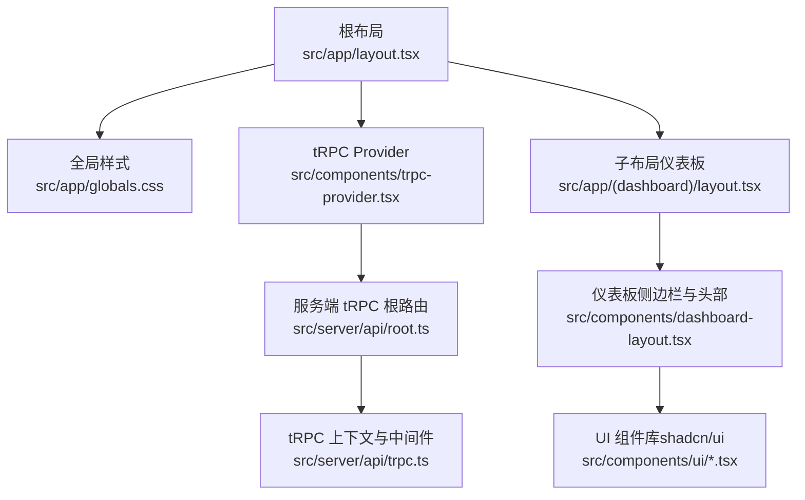
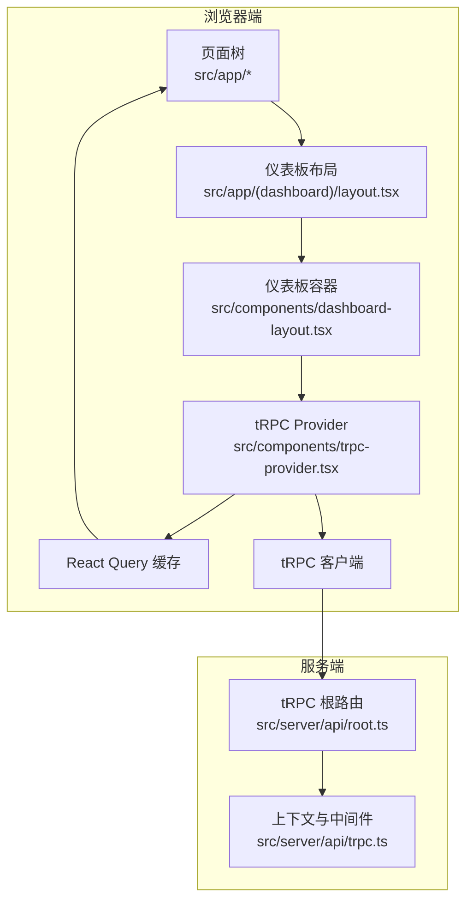
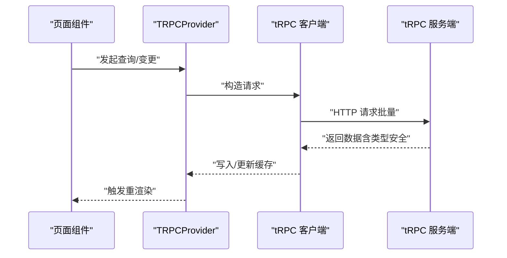
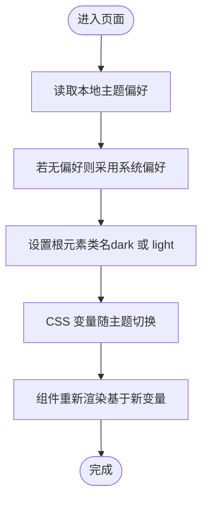
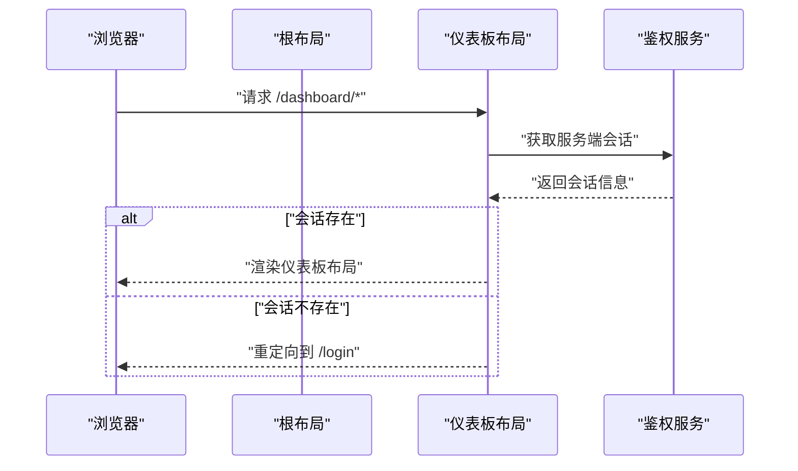
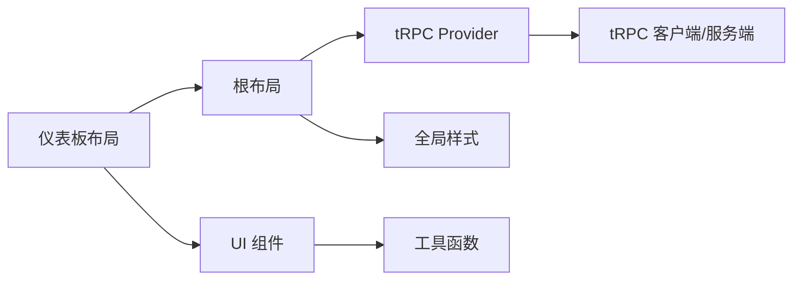

# 前端架构

<cite>
**本文引用的文件**
- [package.json](file://package.json)
- [next.config.ts](file://next.config.ts)
- [tailwind.config.js](file://tailwind.config.js)
- [components.json](file://components.json)
- [src/app/layout.tsx](file://src/app/layout.tsx)
- [src/components/trpc-provider.tsx](file://src/components/trpc-provider.tsx)
- [src/app/globals.css](file://src/app/globals.css)
- [src/components/dashboard-layout.tsx](file://src/components/dashboard-layout.tsx)
- [src/app/(dashboard)/layout.tsx](file://src/app/(dashboard)/layout.tsx)
- [src/server/api/root.ts](file://src/server/api/root.ts)
- [src/server/api/trpc.ts](file://src/server/api/trpc.ts)
- [src/lib/utils.ts](file://src/lib/utils.ts)
- [src/components/ui/button.tsx](file://src/components/ui/button.tsx)
- [src/components/ui/dialog.tsx](file://src/components/ui/dialog.tsx)
- [src/components/ui/table.tsx](file://src/components/ui/table.tsx)
</cite>

## 目录
1. [引言](#引言)
2. [项目结构](#项目结构)
3. [核心组件](#核心组件)
4. [架构总览](#架构总览)
5. [组件详解](#组件详解)
6. [依赖关系分析](#依赖关系分析)
7. [性能与构建优化](#性能与构建优化)
8. [故障排查指南](#故障排查指南)
9. [结论](#结论)
10. [附录](#附录)

## 引言
本文件面向 AIGate 前端团队与维护者，系统性梳理基于 Next.js 14 App Router 的前端架构，重点覆盖以下方面：
- 路由系统与页面/布局组织
- tRPC Provider 集成与状态管理
- shadcn/ui 组件体系的使用与定制策略
- 全局样式、主题系统与响应式设计
- 开发环境配置、构建优化与性能考量
- 组件组织结构、命名约定与最佳实践

## 项目结构
AIGate 前端采用 Next.js 14 App Router 的 App 目录结构，结合服务端渲染、客户端 Provider 包裹与自定义 Tailwind 主题，形成统一的前端入口与组件生态。



图表来源
- [src/app/layout.tsx](file://src/app/layout.tsx#L1-L54)
- [src/app/globals.css](file://src/app/globals.css#L1-L136)
- [src/components/trpc-provider.tsx](file://src/components/trpc-provider.tsx#L1-L64)
- [src/app/(dashboard)/layout.tsx](file://src/app/(dashboard)/layout.tsx#L1-L19)
- [src/components/dashboard-layout.tsx](file://src/components/dashboard-layout.tsx#L1-L197)
- [src/server/api/root.ts](file://src/server/api/root.ts#L1-L25)
- [src/server/api/trpc.ts](file://src/server/api/trpc.ts#L1-L153)

章节来源
- [src/app/layout.tsx](file://src/app/layout.tsx#L1-L54)
- [src/app/globals.css](file://src/app/globals.css#L1-L136)
- [src/components/trpc-provider.tsx](file://src/components/trpc-provider.tsx#L1-L64)
- [src/app/(dashboard)/layout.tsx](file://src/app/(dashboard)/layout.tsx#L1-L19)
- [src/components/dashboard-layout.tsx](file://src/components/dashboard-layout.tsx#L1-L197)
- [src/server/api/root.ts](file://src/server/api/root.ts#L1-L25)
- [src/server/api/trpc.ts](file://src/server/api/trpc.ts#L1-L153)

## 核心组件
- 根布局与全局注入
  - 根布局负责注入全局样式、开发期调试脚本、全局通知组件与 tRPC Provider，确保所有页面共享一致的主题与数据层能力。
- tRPC Provider
  - 使用 React Query 作为本地缓存与状态管理，通过 tRPC 客户端进行批量 HTTP 请求，并启用日志链路以便开发调试。
- 仪表板布局
  - 提供侧边导航、顶部操作区与主题切换逻辑，配合 Liquid Glass 视觉风格与暗色模式支持。
- UI 组件库（shadcn/ui）
  - 基于 Radix UI 与 Tailwind CSS，提供按钮、对话框、表格等高复用组件，并以变体与尺寸扩展视觉表现。

章节来源
- [src/app/layout.tsx](file://src/app/layout.tsx#L1-L54)
- [src/components/trpc-provider.tsx](file://src/components/trpc-provider.tsx#L1-L64)
- [src/components/dashboard-layout.tsx](file://src/components/dashboard-layout.tsx#L1-L197)
- [src/components/ui/button.tsx](file://src/components/ui/button.tsx#L1-L77)
- [src/components/ui/dialog.tsx](file://src/components/ui/dialog.tsx#L1-L125)
- [src/components/ui/table.tsx](file://src/components/ui/table.tsx#L1-L115)

## 架构总览
整体架构围绕“App Router 页面树 + Provider 注入 + 自定义 UI 组件库”的模式展开，服务端通过 tRPC 暴露统一 API，客户端通过 tRPC React 与 React Query 实现高效的数据获取与缓存。



图表来源
- [src/app/(dashboard)/layout.tsx](file://src/app/(dashboard)/layout.tsx#L1-L19)
- [src/components/dashboard-layout.tsx](file://src/components/dashboard-layout.tsx#L1-L197)
- [src/components/trpc-provider.tsx](file://src/components/trpc-provider.tsx#L1-L64)
- [src/server/api/root.ts](file://src/server/api/root.ts#L1-L25)
- [src/server/api/trpc.ts](file://src/server/api/trpc.ts#L1-L153)

## 组件详解

### tRPC Provider 集成与状态管理
- 设计理念
  - 将 tRPC 客户端与 React Query 缓存组合，形成统一的数据流：本地缓存（React Query）+ 远端调用（tRPC）+ 变更传播（组件订阅）。
- 关键点
  - 客户端自动根据运行环境选择基础 URL，支持 SSR 与 Vercel 部署场景。
  - 默认查询缓存时间与重试策略，降低网络抖动对用户体验的影响。
  - 开发环境下启用日志链路，便于定位请求与错误。
- 状态管理
  - 通过 React Query 的 QueryClient 管理本地状态，组件可直接消费 tRPC 查询结果，无需手动写样板代码。



图表来源
- [src/components/trpc-provider.tsx](file://src/components/trpc-provider.tsx#L1-L64)
- [src/server/api/root.ts](file://src/server/api/root.ts#L1-L25)
- [src/server/api/trpc.ts](file://src/server/api/trpc.ts#L1-L153)

章节来源
- [src/components/trpc-provider.tsx](file://src/components/trpc-provider.tsx#L1-L64)
- [src/server/api/root.ts](file://src/server/api/root.ts#L1-L25)
- [src/server/api/trpc.ts](file://src/server/api/trpc.ts#L1-L153)

### shadcn/ui 组件系统与定制策略
- 使用策略
  - 通过组件别名与工具函数统一类名合并，保证样式一致性与可维护性。
  - 组件均支持变体（variant）与尺寸（size），满足不同场景下的视觉需求。
- 定制策略
  - 以 Tailwind CSS 变量与 CSS 自定义属性为基础，结合暗色模式变量，实现跨组件的主题一致性。
  - 通过组件内部的变体规则与阴影、模糊、边框等效果，统一 Liquid Glass 视觉风格。
- 示例组件
  - 按钮：提供多种变体与尺寸，适配不同交互层级。
  - 对话框：内置玻璃态背景、模糊与投影，提升信息密度与层次感。
  - 表格：在容器层面叠加玻璃态与阴影，增强可读性与对比度。

```mermaid
classDiagram
class Button {
+props : "variant,size,asChild,..."
+className : "基于变体与尺寸生成"
}
class Dialog {
+overlay : "模糊背景"
+content : "玻璃态容器"
+close : "带动画的关闭按钮"
}
class Table {
+container : "玻璃态+阴影"
+header/body/footer : "分层样式"
+row/cell : "悬停与选中态"
}
Button --> Utils["类名合并工具"]
Dialog --> Utils
Table --> Utils
```

图表来源
- [src/components/ui/button.tsx](file://src/components/ui/button.tsx#L1-L77)
- [src/components/ui/dialog.tsx](file://src/components/ui/dialog.tsx#L1-L125)
- [src/components/ui/table.tsx](file://src/components/ui/table.tsx#L1-L115)
- [src/lib/utils.ts](file://src/lib/utils.ts#L1-L7)

章节来源
- [src/components/ui/button.tsx](file://src/components/ui/button.tsx#L1-L77)
- [src/components/ui/dialog.tsx](file://src/components/ui/dialog.tsx#L1-L125)
- [src/components/ui/table.tsx](file://src/components/ui/table.tsx#L1-L115)
- [src/lib/utils.ts](file://src/lib/utils.ts#L1-L7)

### 全局样式、主题系统与响应式设计
- 全局样式
  - 通过 CSS 变量定义明/暗两套主题色彩，配合 Tailwind CSS 的 @theme inline 机制，使组件与全局样式保持一致。
  - Liquid Glass 效果通过背景透明度、模糊与饱和度等变量统一实现。
- 主题系统
  - 支持本地存储主题偏好与系统偏好检测；切换时动态更新根元素类名，驱动 CSS 变量生效。
- 响应式设计
  - Tailwind 配置包含容器宽度与断点，组件普遍采用相对单位与语义化尺寸，保证在不同设备上的可读性与可用性。



图表来源
- [src/components/dashboard-layout.tsx](file://src/components/dashboard-layout.tsx#L56-L90)
- [src/app/globals.css](file://src/app/globals.css#L5-L129)

章节来源
- [src/app/globals.css](file://src/app/globals.css#L1-L136)
- [src/components/dashboard-layout.tsx](file://src/components/dashboard-layout.tsx#L1-L197)

### 路由系统、页面结构与布局管理
- 路由系统
  - 使用 App Router 的分组与嵌套路由，将仪表板相关页面置于 `(dashboard)` 分组内，统一受仪表板布局保护。
- 页面与布局
  - 根布局负责全局注入与 Provider 包裹；仪表板布局负责鉴权跳转与页面骨架。
- 鉴权流程
  - 仪表板布局在服务端获取会话，未登录则重定向至登录页，确保页面访问的安全性。



图表来源
- [src/app/layout.tsx](file://src/app/layout.tsx#L1-L54)
- [src/app/(dashboard)/layout.tsx](file://src/app/(dashboard)/layout.tsx#L1-L19)

章节来源
- [src/app/layout.tsx](file://src/app/layout.tsx#L1-L54)
- [src/app/(dashboard)/layout.tsx](file://src/app/(dashboard)/layout.tsx#L1-L19)

## 依赖关系分析
- 外部依赖概览
  - Next.js 16 与 App Router、Tailwind CSS v4、shadcn/ui 生态、tRPC 与 React Query、Next-Auth 等。
- 内部耦合
  - 根布局依赖 tRPC Provider 与全局样式；仪表板布局依赖鉴权与 UI 组件；UI 组件依赖工具函数与 Tailwind 变量。
- 可能的循环依赖
  - 当前结构清晰，Provider 位于根部，避免了 UI 组件与服务端逻辑的直接耦合。



图表来源
- [src/app/layout.tsx](file://src/app/layout.tsx#L1-L54)
- [src/components/trpc-provider.tsx](file://src/components/trpc-provider.tsx#L1-L64)
- [src/components/dashboard-layout.tsx](file://src/components/dashboard-layout.tsx#L1-L197)
- [src/lib/utils.ts](file://src/lib/utils.ts#L1-L7)
- [src/server/api/root.ts](file://src/server/api/root.ts#L1-L25)

章节来源
- [package.json](file://package.json#L1-L90)
- [src/app/layout.tsx](file://src/app/layout.tsx#L1-L54)
- [src/components/trpc-provider.tsx](file://src/components/trpc-provider.tsx#L1-L64)
- [src/components/dashboard-layout.tsx](file://src/components/dashboard-layout.tsx#L1-L197)
- [src/lib/utils.ts](file://src/lib/utils.ts#L1-L7)
- [src/server/api/root.ts](file://src/server/api/root.ts#L1-L25)

## 性能与构建优化
- 构建配置
  - 启用独立输出（standalone）与 React Compiler，减少体积并提升运行时性能。
- 数据层优化
  - tRPC 批处理链接减少请求数量；React Query 设置合理的过期时间与重试策略，平衡实时性与性能。
- 样式与主题
  - 使用 CSS 变量与 Tailwind 变体，避免重复计算与样式抖动；Liquid Glass 效果通过一次性变量定义实现。
- 开发体验
  - 在开发环境注入调试脚本，便于可视化与性能分析。

章节来源
- [next.config.ts](file://next.config.ts#L1-L9)
- [src/components/trpc-provider.tsx](file://src/components/trpc-provider.tsx#L25-L54)
- [src/app/globals.css](file://src/app/globals.css#L1-L136)

## 故障排查指南
- tRPC 请求失败或类型不匹配
  - 检查服务端上下文是否正确注入会话；确认客户端 URL 与部署环境一致；查看开发日志链路定位问题。
- 主题切换无效
  - 确认本地存储与系统偏好读取逻辑；检查根元素类名是否正确添加/移除；验证 CSS 变量是否更新。
- UI 组件样式异常
  - 检查组件变体与尺寸参数是否正确；确认工具函数类名合并逻辑；核对 Tailwind 配置与 CSS 变量。

章节来源
- [src/server/api/trpc.ts](file://src/server/api/trpc.ts#L65-L75)
- [src/components/trpc-provider.tsx](file://src/components/trpc-provider.tsx#L15-L20)
- [src/components/dashboard-layout.tsx](file://src/components/dashboard-layout.tsx#L56-L90)
- [src/lib/utils.ts](file://src/lib/utils.ts#L1-L7)

## 结论
AIGate 前端以 Next.js 14 App Router 为核心，结合 tRPC 与 React Query 实现高效的数据流，以 shadcn/ui 与 Tailwind CSS 构建一致的视觉语言与主题系统。通过根布局统一注入与仪表板布局的鉴权保护，形成清晰的页面与组件组织方式。建议在后续迭代中持续完善组件文档与测试覆盖，进一步沉淀 UI 组件的使用规范与最佳实践。

## 附录
- 组件组织与命名约定
  - 组件目录按功能划分（如 ui、dashboard-layout），文件名采用帕斯卡命名；变体与尺寸通过组件内部配置统一管理。
- 最佳实践
  - 在新增页面时优先使用 App Router 的分组与嵌套路由；在需要全局状态时通过 Provider 注入；在 UI 层尽量复用现有组件，减少重复实现。