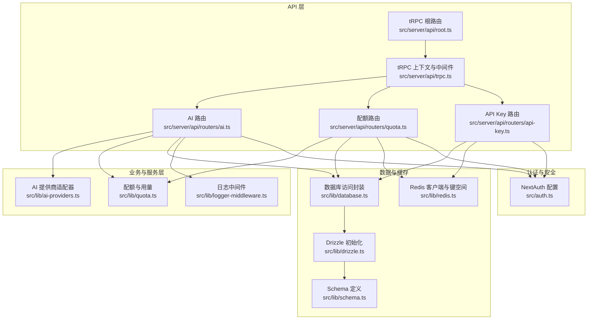
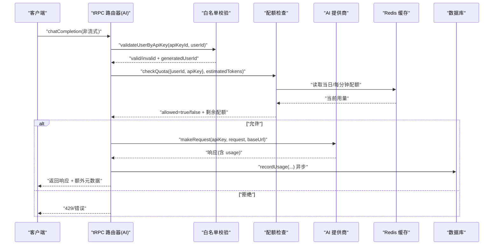
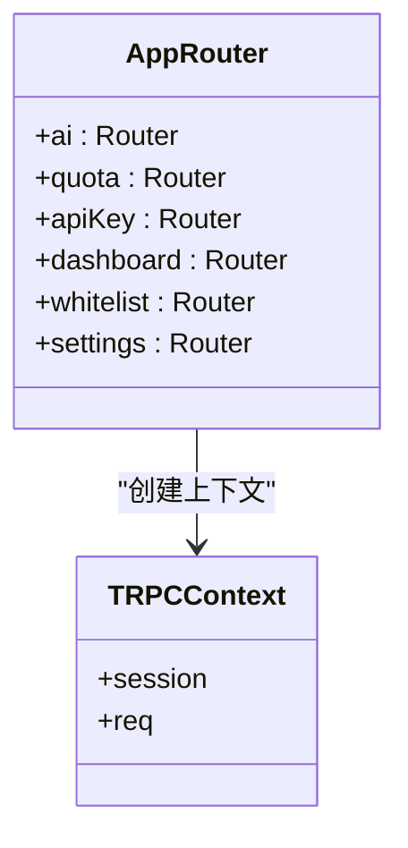
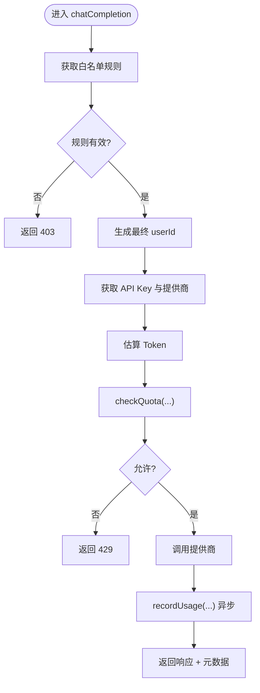
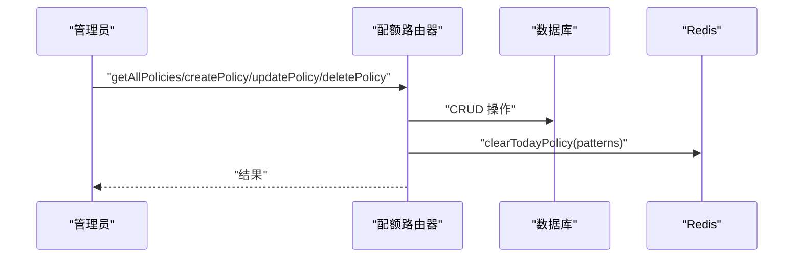
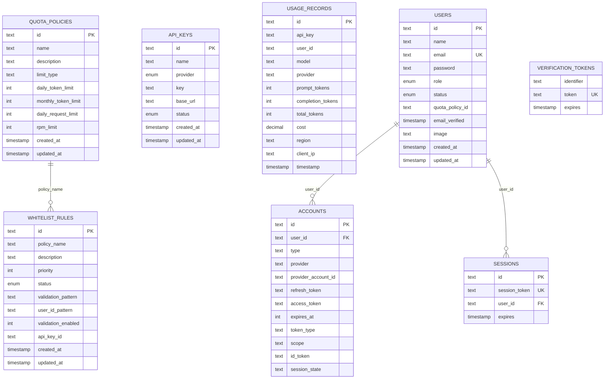
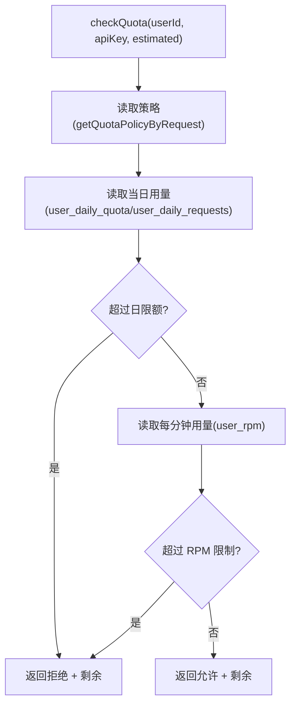
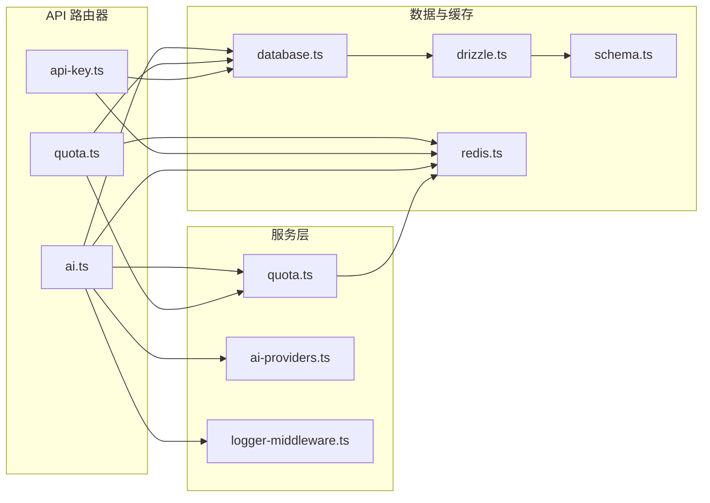

# 后端架构

<cite>
**本文引用的文件**
- [README.md](file://README.md)
- [package.json](file://package.json)
- [src/server/api/root.ts](file://src/server/api/root.ts)
- [src/server/api/trpc.ts](file://src/server/api/trpc.ts)
- [src/server/api/routers/ai.ts](file://src/server/api/routers/ai.ts)
- [src/server/api/routers/quota.ts](file://src/server/api/routers/quota.ts)
- [src/server/api/routers/api-key.ts](file://src/server/api/routers/api-key.ts)
- [src/lib/database.ts](file://src/lib/database.ts)
- [src/lib/drizzle.ts](file://src/lib/drizzle.ts)
- [src/lib/schema.ts](file://src/lib/schema.ts)
- [src/lib/redis.ts](file://src/lib/redis.ts)
- [src/lib/quota.ts](file://src/lib/quota.ts)
- [src/lib/types.ts](file://src/lib/types.ts)
- [src/lib/ai-providers.ts](file://src/lib/ai-providers.ts)
- [src/lib/provider-utils.ts](file://src/lib/provider-utils.ts)
- [src/lib/logger-middleware.ts](file://src/lib/logger-middleware.ts)
- [src/auth.ts](file://src/auth.ts)
- [src/pages/api/ai/chat/stream.ts](file://src/pages/api/ai/chat/stream.ts)
</cite>

## 目录
1. [简介](#简介)
2. [项目结构](#项目结构)
3. [核心组件](#核心组件)
4. [架构总览](#架构总览)
5. [详细组件分析](#详细组件分析)
6. [依赖关系分析](#依赖关系分析)
7. [性能考量](#性能考量)
8. [故障排查指南](#故障排查指南)
9. [结论](#结论)
10. [附录](#附录)

## 简介
本项目为基于 Next.js 14 + tRPC + Redis 的智能 AI 网关管理系统，提供类型安全的后端 API、实时配额控制、多模型代理与现代化前端界面。后端采用分层架构：控制器层（tRPC 路由器）、服务层（业务逻辑与配额/缓存/日志）、数据访问层（Drizzle ORM + PostgreSQL）。Redis 用于配额与缓存，NextAuth 实现认证授权，日志系统提供统一日志与监控。

## 项目结构
- 后端入口与 API
  - tRPC 根路由与上下文初始化位于 server/api
  - 各领域路由器：ai、quota、api-key、dashboard、whitelist、settings
- 数据层
  - Drizzle ORM + PostgreSQL，定义表结构与关系
  - 数据库访问封装于 lib/database.ts
- 缓存与配额
  - Redis 客户端与键空间设计位于 lib/redis.ts
  - 配额检查、用量记录与统计位于 lib/quota.ts
- 业务能力
  - AI 提供商适配器（OpenAI、Anthropic、Google、DeepSeek、Moonshot、Spark）
  - 认证与会话（NextAuth）
  - 日志中间件与统一日志接口

图表来源
- [src/server/api/root.ts](file://src/server/api/root.ts#L1-L25)
- [src/server/api/trpc.ts](file://src/server/api/trpc.ts#L1-L153)
- [src/server/api/routers/ai.ts](file://src/server/api/routers/ai.ts#L1-L301)
- [src/server/api/routers/quota.ts](file://src/server/api/routers/quota.ts#L1-L221)
- [src/server/api/routers/api-key.ts](file://src/server/api/routers/api-key.ts#L1-L377)
- [src/lib/ai-providers.ts](file://src/lib/ai-providers.ts#L1-L759)
- [src/lib/quota.ts](file://src/lib/quota.ts#L1-L327)
- [src/lib/logger-middleware.ts](file://src/lib/logger-middleware.ts#L1-L138)
- [src/lib/drizzle.ts](file://src/lib/drizzle.ts#L1-L12)
- [src/lib/schema.ts](file://src/lib/schema.ts#L1-L162)
- [src/lib/database.ts](file://src/lib/database.ts#L1-L692)
- [src/lib/redis.ts](file://src/lib/redis.ts#L1-L43)
- [src/auth.ts](file://src/auth.ts#L1-L114)

章节来源
- [README.md](file://README.md#L1-L83)
- [package.json](file://package.json#L1-L90)

## 核心组件
- tRPC 类型安全 API
  - 根路由集中注册各领域路由器
  - 上下文注入 NextAuth 会话，提供受保护/公开过程
  - 自定义中间件实现认证与速率限制占位
- 分层架构
  - 控制器层：各路由器定义查询/变更操作
  - 服务层：配额检查、用量记录、日志与提供商适配
  - 数据访问层：Drizzle ORM + PostgreSQL；Redis 缓存
- 认证与授权
  - NextAuth 会话与回调，仅管理员可访问受保护路由
- 中间件与日志
  - 统一 HTTP 请求日志与业务日志接口
- 数据模型
  - 配额策略、API Key、用量记录、白名单规则、用户与 NextAuth 表

章节来源
- [src/server/api/root.ts](file://src/server/api/root.ts#L1-L25)
- [src/server/api/trpc.ts](file://src/server/api/trpc.ts#L1-L153)
- [src/lib/schema.ts](file://src/lib/schema.ts#L1-L162)
- [src/auth.ts](file://src/auth.ts#L1-L114)
- [src/lib/logger-middleware.ts](file://src/lib/logger-middleware.ts#L1-L138)

## 架构总览
后端采用“控制器-服务-数据”三层，结合 tRPC 的类型安全与 Next.js App Router，形成前后端一体化的开发体验。AI 请求通过 tRPC 路由进入，经白名单校验、配额检查与提供商适配，再写入用量记录与 Redis 缓存。管理端通过受保护路由对配额策略、API Key 与用量进行管理。

图表来源
- [src/server/api/routers/ai.ts](file://src/server/api/routers/ai.ts#L88-L213)
- [src/lib/quota.ts](file://src/lib/quota.ts#L78-L200)
- [src/lib/ai-providers.ts](file://src/lib/ai-providers.ts#L34-L100)
- [src/lib/database.ts](file://src/lib/database.ts#L218-L221)

## 详细组件分析

### tRPC 路由器与上下文
- 根路由集中注册 ai、quota、apiKey、dashboard、whitelist、settings
- 上下文从 NextAuth 获取会话，公开过程与受保护过程分离
- 错误格式化支持 ZodError，便于前端类型安全提示

图表来源
- [src/server/api/root.ts](file://src/server/api/root.ts#L14-L21)
- [src/server/api/trpc.ts](file://src/server/api/trpc.ts#L52-L75)

章节来源
- [src/server/api/root.ts](file://src/server/api/root.ts#L1-L25)
- [src/server/api/trpc.ts](file://src/server/api/trpc.ts#L1-L153)

### AI 路由器（聊天完成）
- 输入校验：userId、apiKeyId、请求体
- 白名单规则校验：按 apiKeyId 获取规则并校验 userId 格式与生成规则
- 提供商选择：根据模型推断提供商或从 API Key 映射
- 配额检查：支持 token/request 两种模式与 RPM 限制
- 非流式处理：发起请求、记录用量、返回响应与配额元数据
- 流式处理：走独立 API 端点（见“流式端点”）

图表来源
- [src/server/api/routers/ai.ts](file://src/server/api/routers/ai.ts#L98-L213)
- [src/lib/quota.ts](file://src/lib/quota.ts#L78-L200)

章节来源
- [src/server/api/routers/ai.ts](file://src/server/api/routers/ai.ts#L1-L301)

### 配额路由器（受保护）
- 用户用量查询、重置配额
- 配额策略 CRUD：输入校验、限制类型约束、策略更新后清理缓存
- 清理缓存：按 apiKey 清理策略与当日用量/请求计数键

图表来源
- [src/server/api/routers/quota.ts](file://src/server/api/routers/quota.ts#L39-L221)
- [src/lib/redis.ts](file://src/lib/redis.ts#L17-L43)

章节来源
- [src/server/api/routers/quota.ts](file://src/server/api/routers/quota.ts#L1-L221)

### API Key 路由器（受保护）
- API Key 列表、详情、创建、更新、删除、状态切换
- 状态切换与删除时同步清理 Redis 缓存
- 使用掩码返回敏感字段，避免泄露

章节来源
- [src/server/api/routers/api-key.ts](file://src/server/api/routers/api-key.ts#L1-L377)

### 数据库与 Drizzle ORM
- Schema 定义：配额策略、API Key、用量记录、用户、白名单规则、NextAuth 相关表
- 数据访问封装：CRUD、统计、匹配规则、用户管理
- 连接初始化：PostgreSQL 客户端 + Drizzle，关闭预取以兼容事务模式

图表来源
- [src/lib/schema.ts](file://src/lib/schema.ts#L28-L162)
- [src/lib/drizzle.ts](file://src/lib/drizzle.ts#L1-L12)

章节来源
- [src/lib/schema.ts](file://src/lib/schema.ts#L1-L162)
- [src/lib/drizzle.ts](file://src/lib/drizzle.ts#L1-L12)
- [src/lib/database.ts](file://src/lib/database.ts#L1-L692)

### Redis 缓存与配额策略
- 键空间设计：用户每日配额、请求次数、每分钟请求、策略缓存、API Key 缓存、请求日志
- 配额检查：按 token/request 模式与 RPM 限制，使用原子递增与过期策略
- 策略缓存：按 apiKeyId 缓存策略，减少 JOIN 查询
- 清理策略：策略更新/删除后扫描并删除当日用量键

图表来源
- [src/lib/quota.ts](file://src/lib/quota.ts#L78-L200)
- [src/lib/redis.ts](file://src/lib/redis.ts#L17-L43)

章节来源
- [src/lib/quota.ts](file://src/lib/quota.ts#L1-L327)
- [src/lib/redis.ts](file://src/lib/redis.ts#L1-L43)

### AI 提供商适配器
- 统一接口：请求、流式请求、Token 估算
- 支持 OpenAI、Anthropic、Google、DeepSeek、Moonshot、Spark
- 流式转换：将各提供商的 SSE/流格式转换为 OpenAI 兼容格式
- API Key 获取：优先 Redis 缓存，回退数据库

章节来源
- [src/lib/ai-providers.ts](file://src/lib/ai-providers.ts#L1-L759)

### 认证与授权（NextAuth）
- 凭证登录：校验用户存在、密码一致、状态正常且角色为 ADMIN
- JWT/Session 回调：向 token/session 注入用户角色与状态
- 受保护路由：依赖 tRPC 中间件校验会话

章节来源
- [src/auth.ts](file://src/auth.ts#L1-L114)
- [src/server/api/trpc.ts](file://src/server/api/trpc.ts#L128-L139)

### 日志与监控
- HTTP 请求日志：方法、URL、状态码、耗时、UA、Referer、IP
- 业务日志：配额检查/更新/重置/超限、AI 请求、认证事件
- 统一日志接口：withLogging 包装异步操作，自动记录开始/结束/错误

章节来源
- [src/lib/logger-middleware.ts](file://src/lib/logger-middleware.ts#L1-L138)

### 流式端点（独立 API）
- SSE 流式输出：设置正确的响应头，逐块转发提供商流
- 配额检查：与 tRPC 路由一致
- Token 统计：解析流数据增量统计完成 Token

章节来源
- [src/pages/api/ai/chat/stream.ts](file://src/pages/api/ai/chat/stream.ts#L1-L184)

## 依赖关系分析

图表来源
- [src/server/api/routers/ai.ts](file://src/server/api/routers/ai.ts#L1-L301)
- [src/server/api/routers/quota.ts](file://src/server/api/routers/quota.ts#L1-L221)
- [src/server/api/routers/api-key.ts](file://src/server/api/routers/api-key.ts#L1-L377)
- [src/lib/quota.ts](file://src/lib/quota.ts#L1-L327)
- [src/lib/ai-providers.ts](file://src/lib/ai-providers.ts#L1-L759)
- [src/lib/database.ts](file://src/lib/database.ts#L1-L692)
- [src/lib/drizzle.ts](file://src/lib/drizzle.ts#L1-L12)
- [src/lib/schema.ts](file://src/lib/schema.ts#L1-L162)
- [src/lib/redis.ts](file://src/lib/redis.ts#L1-L43)
- [src/lib/logger-middleware.ts](file://src/lib/logger-middleware.ts#L1-L138)

章节来源
- [src/server/api/root.ts](file://src/server/api/root.ts#L1-L25)
- [src/server/api/trpc.ts](file://src/server/api/trpc.ts#L1-L153)

## 性能考量
- Redis 原子操作与过期策略：使用 INCR/INCRBY 与 EXPIRE，避免热点竞争
- 缓存策略：API Key 与配额策略短期缓存，降低数据库压力
- 并发统计：用量统计使用 Promise.all 并行查询
- 流式传输：SSE 直通转发，最小化中间处理
- 数据库连接：关闭预取以适配事务模式，减少内存占用

## 故障排查指南
- tRPC 错误
  - Zod 校验失败：查看 errorFormatter 返回的 zodError
  - 未授权：确认 NextAuth 会话与受保护过程
- 配额问题
  - 429 拒绝：检查当日/每分钟配额键与策略缓存
  - 用量未更新：确认 recordUsage 是否抛错与数据库写入
- Redis 连接
  - 连接失败：检查 REDIS_URL 与网络连通性
  - 缓存未命中：确认键空间与过期时间
- 数据库
  - 查询异常：检查 Drizzle 初始化与 schema 对齐
- 认证
  - 登录失败：检查用户状态、角色与凭据匹配

章节来源
- [src/server/api/trpc.ts](file://src/server/api/trpc.ts#L84-L95)
- [src/lib/quota.ts](file://src/lib/quota.ts#L189-L200)
- [src/lib/redis.ts](file://src/lib/redis.ts#L1-L15)
- [src/lib/drizzle.ts](file://src/lib/drizzle.ts#L1-L12)
- [src/auth.ts](file://src/auth.ts#L1-L114)

## 结论
本项目通过 tRPC 实现类型安全的后端 API，结合 Redis 实现高性能配额与缓存，Drizzle ORM 提供清晰的数据模型与访问层。认证采用 NextAuth，日志与监控覆盖全链路。整体架构清晰、职责分明，具备良好的扩展性与可观测性。

## 附录
- API 版本管理
  - 当前未发现显式的 API 版本号字段或路由版本化策略，建议在路由路径或请求头引入版本标识，便于未来演进
- 错误处理与监控
  - 统一 TRPC 错误格式化与业务日志接口，建议在网关层增加统一错误码与告警通知
- 安全加固
  - 建议对 tRPC 过程增加速率限制中间件与 WAF 防护
  - 对敏感字段（API Key）在返回前进行掩码处理