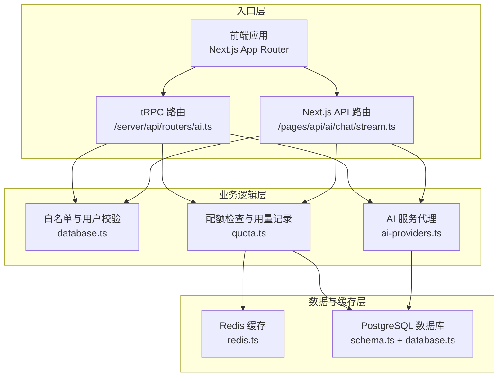
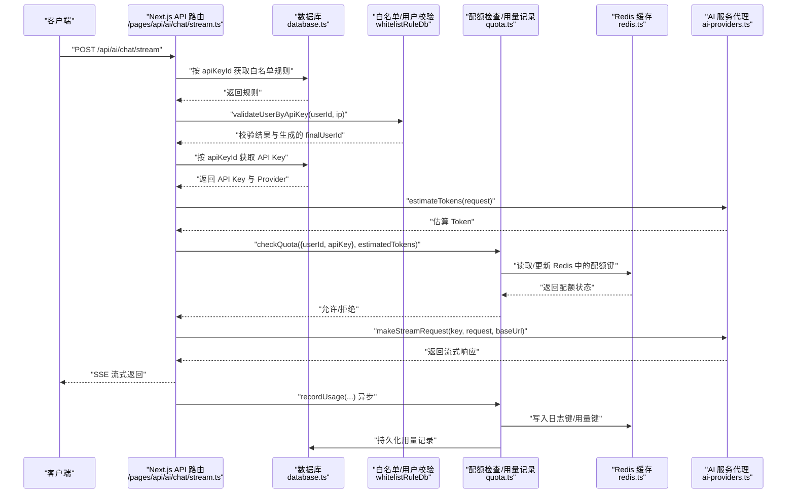
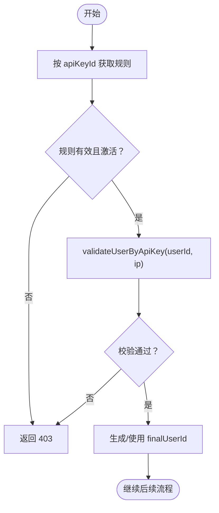
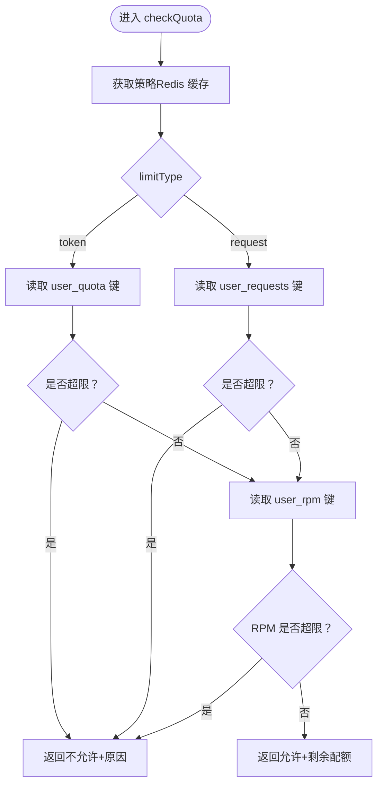
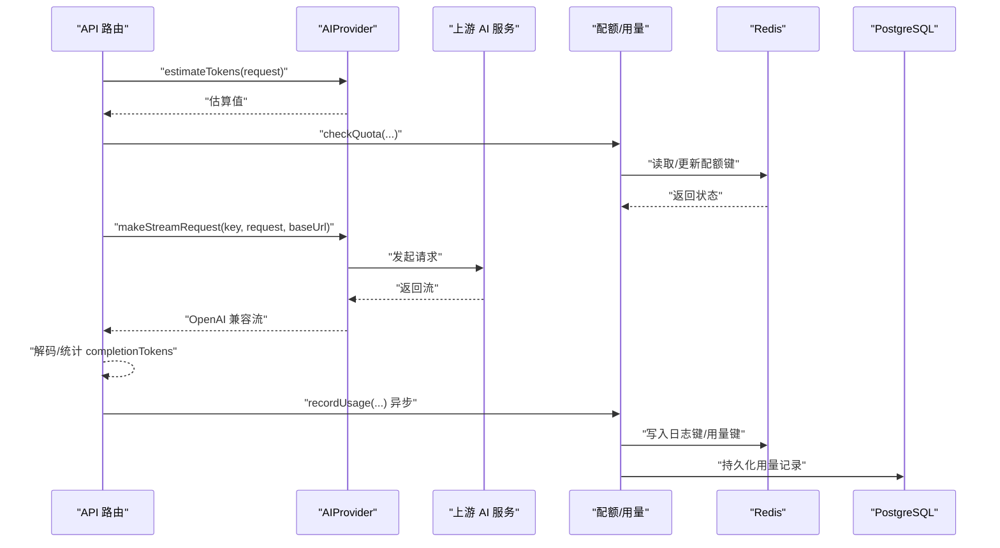
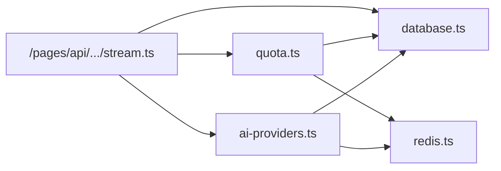

# 数据流设计

<cite>
**本文引用的文件**
- [README.md](file://README.md)
- [src/pages/api/ai/chat/stream.ts](file://src/pages/api/ai/chat/stream.ts)
- [src/server/api/routers/ai.ts](file://src/server/api/routers/ai.ts)
- [src/lib/quota.ts](file://src/lib/quota.ts)
- [src/lib/redis.ts](file://src/lib/redis.ts)
- [src/lib/database.ts](file://src/lib/database.ts)
- [src/lib/ai-providers.ts](file://src/lib/ai-providers.ts)
- [src/lib/types.ts](file://src/lib/types.ts)
- [src/lib/schema.ts](file://src/lib/schema.ts)
- [src/lib/ip-region.ts](file://src/lib/ip-region.ts)
- [src/lib/date.ts](file://src/lib/date.ts)
- [src/lib/logger-middleware.ts](file://src/lib/logger-middleware.ts)
- [src/server/api/root.ts](file://src/server/api/root.ts)
</cite>

## 目录
1. [简介](#简介)
2. [项目结构](#项目结构)
3. [核心组件](#核心组件)
4. [架构总览](#架构总览)
5. [详细组件分析](#详细组件分析)
6. [依赖关系分析](#依赖关系分析)
7. [性能考量](#性能考量)
8. [故障排查指南](#故障排查指南)
9. [结论](#结论)
10. [附录](#附录)

## 简介
本文件面向 AIGate 的“数据流设计”，系统性描述从用户请求到最终响应的完整数据流转过程，覆盖以下关键环节：
- 请求接收与参数校验
- 白名单与用户校验
- 配额检查与策略匹配
- AI 服务代理与流式传输
- 用量记录与统计
- 异步处理与日志
- 数据一致性、事务与并发控制
- 序列化/反序列化与格式转换
- 性能监控、瓶颈分析与优化建议

## 项目结构
AIGate 采用 Next.js 14 + tRPC + Redis + PostgreSQL 的分层架构：
- 前端路由与页面位于 src/app 与 src/pages/api
- 后端 API 通过 tRPC 路由组织，核心逻辑集中在 src/server/api/routers
- 数据访问层封装于 src/lib/database 与 src/lib/redis
- 配额与用量逻辑位于 src/lib/quota
- AI 供应商适配位于 src/lib/ai-providers
- 类型与数据库 Schema 定义位于 src/lib/types 与 src/lib/schema
- 日志与中间件位于 src/lib/logger-middleware 与 src/lib/ip-region、src/lib/date

图表来源
- [src/pages/api/ai/chat/stream.ts](file://src/pages/api/ai/chat/stream.ts#L1-L184)
- [src/server/api/routers/ai.ts](file://src/server/api/routers/ai.ts#L1-L301)
- [src/lib/quota.ts](file://src/lib/quota.ts#L1-L327)
- [src/lib/redis.ts](file://src/lib/redis.ts#L1-L43)
- [src/lib/database.ts](file://src/lib/database.ts#L1-L692)
- [src/lib/ai-providers.ts](file://src/lib/ai-providers.ts#L1-L759)
- [src/lib/schema.ts](file://src/lib/schema.ts#L1-L162)

章节来源
- [README.md](file://README.md#L1-L83)
- [src/server/api/root.ts](file://src/server/api/root.ts#L1-L25)

## 核心组件
- 请求入口与路由
  - Next.js API 路由：/pages/api/ai/chat/stream.ts 提供 OpenAI 兼容的流式聊天接口
  - tRPC 路由：/server/api/routers/ai.ts 提供非流式聊天、模型查询、配额信息查询等
- 白名单与用户校验：/lib/database.ts 中的 whitelistRuleDb 提供按 apiKeyId 的规则匹配与 userId 校验
- 配额与用量：/lib/quota.ts 提供策略获取、配额检查、用量记录与每日统计
- 缓存与键空间：/lib/redis.ts 定义 Redis 键命名规范与连接
- 数据库 Schema：/lib/schema.ts 定义 quota_policies、api_keys、usage_records、whitelist_rules、users 等
- AI 服务代理：/lib/ai-providers.ts 提供 OpenAI、Anthropic、Google、DeepSeek、Moonshot、Spark 等提供商的统一接口
- 辅助能力：IP 归属地查询、日期工具、日志中间件

章节来源
- [src/pages/api/ai/chat/stream.ts](file://src/pages/api/ai/chat/stream.ts#L1-L184)
- [src/server/api/routers/ai.ts](file://src/server/api/routers/ai.ts#L1-L301)
- [src/lib/database.ts](file://src/lib/database.ts#L293-L545)
- [src/lib/quota.ts](file://src/lib/quota.ts#L1-L327)
- [src/lib/redis.ts](file://src/lib/redis.ts#L1-L43)
- [src/lib/ai-providers.ts](file://src/lib/ai-providers.ts#L1-L759)
- [src/lib/schema.ts](file://src/lib/schema.ts#L1-L162)
- [src/lib/ip-region.ts](file://src/lib/ip-region.ts#L1-L101)
- [src/lib/date.ts](file://src/lib/date.ts#L1-L17)
- [src/lib/logger-middleware.ts](file://src/lib/logger-middleware.ts#L1-L138)

## 架构总览
下图展示了从用户请求到响应返回的主路径，以及配额检查、用量记录、日志与缓存/数据库交互：

图表来源
- [src/pages/api/ai/chat/stream.ts](file://src/pages/api/ai/chat/stream.ts#L10-L184)
- [src/lib/database.ts](file://src/lib/database.ts#L317-L545)
- [src/lib/quota.ts](file://src/lib/quota.ts#L78-L260)
- [src/lib/redis.ts](file://src/lib/redis.ts#L17-L43)
- [src/lib/ai-providers.ts](file://src/lib/ai-providers.ts#L12-L27)

## 详细组件分析

### 请求接收与参数校验
- Next.js API 路由
  - 校验方法与 CORS 中间件
  - 解析请求体中的 userId、apiKeyId、request
  - 提取客户端 IP 与地区信息
  - 生成 requestId
- tRPC 路由
  - 输入参数使用 Zod 校验
  - 从上下文 ctx.req 获取 IP 与地区
  - 生成 requestId

章节来源
- [src/pages/api/ai/chat/stream.ts](file://src/pages/api/ai/chat/stream.ts#L10-L31)
- [src/server/api/routers/ai.ts](file://src/server/api/routers/ai.ts#L98-L106)

### 白名单与用户校验
- 按 apiKeyId 获取白名单规则并校验状态
- 对 userId 进行正则校验与模式替换，生成 finalUserId
- 若校验失败，返回 403/Forbidden

图表来源
- [src/lib/database.ts](file://src/lib/database.ts#L317-L545)
- [src/pages/api/ai/chat/stream.ts](file://src/pages/api/ai/chat/stream.ts#L32-L51)
- [src/server/api/routers/ai.ts](file://src/server/api/routers/ai.ts#L108-L132)

章节来源
- [src/lib/database.ts](file://src/lib/database.ts#L317-L545)
- [src/pages/api/ai/chat/stream.ts](file://src/pages/api/ai/chat/stream.ts#L32-L51)
- [src/server/api/routers/ai.ts](file://src/server/api/routers/ai.ts#L108-L132)

### 配额检查与策略匹配
- 策略来源：优先通过 apiKeyId 关联的白名单规则获取策略；未命中则回退默认策略
- 检查维度：
  - 日 Token 限额（当 limitType=token）
  - 日请求次数限额（当 limitType=request）
  - 每分钟请求次数（RPM）
- Redis 键空间：
  - user_quota:{userId}:{date}:{apiKey}
  - user_requests:{userId}:{date}:{apiKey}
  - user_rpm:{userId}:{apiKey}:{YYYY-MM-DD:HH:MM}
  - policy:apiKey:{apiKeyId}
- 记录用量时同时更新 Redis 与数据库

图表来源
- [src/lib/quota.ts](file://src/lib/quota.ts#L78-L200)
- [src/lib/redis.ts](file://src/lib/redis.ts#L17-L43)

章节来源
- [src/lib/quota.ts](file://src/lib/quota.ts#L17-L76)
- [src/lib/quota.ts](file://src/lib/quota.ts#L78-L200)
- [src/lib/redis.ts](file://src/lib/redis.ts#L17-L43)

### AI 服务代理与流式传输
- 依据 API Key 的 provider 选择对应 AIProvider
- 非流式：调用 makeRequest，聚合 usage 并记录用量
- 流式：调用 makeStreamRequest，将上游流转换为 OpenAI 兼容的 SSE 格式
- Token 统计：流式场景中按增量内容估算 completionTokens

图表来源
- [src/lib/ai-providers.ts](file://src/lib/ai-providers.ts#L12-L27)
- [src/lib/ai-providers.ts](file://src/lib/ai-providers.ts#L58-L95)
- [src/lib/ai-providers.ts](file://src/lib/ai-providers.ts#L168-L277)
- [src/pages/api/ai/chat/stream.ts](file://src/pages/api/ai/chat/stream.ts#L105-L175)
- [src/lib/quota.ts](file://src/lib/quota.ts#L202-L260)

章节来源
- [src/lib/ai-providers.ts](file://src/lib/ai-providers.ts#L12-L27)
- [src/lib/ai-providers.ts](file://src/lib/ai-providers.ts#L58-L95)
- [src/lib/ai-providers.ts](file://src/lib/ai-providers.ts#L168-L277)
- [src/pages/api/ai/chat/stream.ts](file://src/pages/api/ai/chat/stream.ts#L105-L175)
- [src/lib/quota.ts](file://src/lib/quota.ts#L202-L260)

### 用量记录与统计
- 记录字段：id、userId、requestId、model、provider、promptTokens、completionTokens、totalTokens、timestamp、cost、region、clientIp
- 异步更新：
  - Redis：request_log:{apiKey}:{requestId}（24h）、user_quota/user_requests/user_rpm（过期策略）
  - PostgreSQL：usage_records 表
- 统计接口：通过 tRPC 路由提供配额信息查询与模型列表查询

章节来源
- [src/lib/quota.ts](file://src/lib/quota.ts#L202-L260)
- [src/lib/schema.ts](file://src/lib/schema.ts#L54-L68)
- [src/server/api/routers/ai.ts](file://src/server/api/routers/ai.ts#L241-L299)

### 数据一致性、事务与并发控制
- 一致性策略
  - Redis 作为高吞吐缓存，提供原子自增与过期控制，保障配额检查与用量更新的强一致近似
  - 用量记录采用异步落库，避免阻塞主链路
- 并发控制
  - Redis 自增（INCR/INCRBY）天然具备原子性
  - 每分钟键带时间戳，避免跨分钟竞争
- 事务处理
  - 当前实现未使用数据库事务包裹配额与用量更新；若需强一致，可在数据库层引入分布式锁或消息队列补偿

章节来源
- [src/lib/quota.ts](file://src/lib/quota.ts#L202-L260)
- [src/lib/redis.ts](file://src/lib/redis.ts#L17-L43)

### 序列化、反序列化与格式转换
- 请求体与响应体
  - 使用 Zod Schema 校验与转换
  - 流式场景将上游 SSE 转换为 OpenAI 兼容格式
- 类型定义
  - ChatCompletionRequest/Response、UsageRecord、QuotaPolicy 等均通过 Zod 定义
- IP/区域
  - 从请求头提取 IP，查询归属地省份

章节来源
- [src/lib/types.ts](file://src/lib/types.ts#L47-L117)
- [src/lib/ai-providers.ts](file://src/lib/ai-providers.ts#L168-L277)
- [src/lib/ip-region.ts](file://src/lib/ip-region.ts#L24-L78)

## 依赖关系分析
- 组件耦合
  - API 路由依赖 database、quota、ai-providers
  - quota 依赖 redis 与 database
  - ai-providers 依赖 database 与 redis（缓存 API Key）
- 外部依赖
  - Redis：配额与日志缓存
  - PostgreSQL：策略、用量、白名单、用户等持久化
  - 各 AI 服务商 SDK/fetch

图表来源
- [src/pages/api/ai/chat/stream.ts](file://src/pages/api/ai/chat/stream.ts#L1-L10)
- [src/lib/quota.ts](file://src/lib/quota.ts#L1-L6)
- [src/lib/ai-providers.ts](file://src/lib/ai-providers.ts#L1-L3)

章节来源
- [src/pages/api/ai/chat/stream.ts](file://src/pages/api/ai/chat/stream.ts#L1-L10)
- [src/lib/quota.ts](file://src/lib/quota.ts#L1-L6)
- [src/lib/ai-providers.ts](file://src/lib/ai-providers.ts#L1-L3)

## 性能考量
- 流式传输
  - 使用 ReadableStream 与 SSE，降低延迟与内存占用
- 缓存策略
  - Redis 键设置合理过期时间，避免长期驻留
  - API Key 与配额策略缓存减少数据库压力
- 并发与吞吐
  - Redis 原子自增与键空间设计提升并发性能
- 监控与可观测性
  - 日志中间件记录请求耗时、状态码、用户代理等
  - 建议增加 Prometheus/Grafana 指标采集与链路追踪

[本节为通用性能建议，不直接分析具体文件]

## 故障排查指南
- 常见错误与定位
  - 403：未绑定有效白名单规则或用户校验失败
  - 400：缺少必要字段、API Key 无效或不支持的提供商
  - 429：配额不足（日限额或 RPM 限制）
  - 5xx：内部错误，查看日志
- 日志与告警
  - 使用日志中间件与专用日志函数记录配额、AI 请求与认证事件
  - Redis 连接错误会输出错误日志
- 排查步骤
  - 检查 Redis 键是否存在与过期时间
  - 核对数据库中 API Key 与白名单规则状态
  - 确认上游 AI 服务可用性与网络连通性

章节来源
- [src/pages/api/ai/chat/stream.ts](file://src/pages/api/ai/chat/stream.ts#L16-L182)
- [src/lib/logger-middleware.ts](file://src/lib/logger-middleware.ts#L79-L138)
- [src/lib/redis.ts](file://src/lib/redis.ts#L7-L13)

## 结论
AIGate 的数据流以“请求入口 → 白名单校验 → 配额检查 → AI 代理 → 用量记录”为主线，结合 Redis 缓存与 PostgreSQL 持久化，实现了高并发、低延迟的 AI 网关服务。通过清晰的键空间设计与异步落库策略，系统在性能与可靠性之间取得平衡。建议进一步引入更强一致性的事务或消息队列补偿机制，并完善指标与告警体系以支撑生产环境的稳定运行。

[本节为总结性内容，不直接分析具体文件]

## 附录
- API 示例与部署说明参见项目自述文件
- tRPC 路由组织与类型安全接口定义

章节来源
- [README.md](file://README.md#L52-L83)
- [src/server/api/root.ts](file://src/server/api/root.ts#L14-L21)