# 架构设计

<cite>
**本文引用的文件**
- [README.md](file://README.md)
- [package.json](file://package.json)
- [next.config.ts](file://next.config.ts)
- [src/lib/database.ts](file://src/lib/database.ts)
- [src/lib/redis.ts](file://src/lib/redis.ts)
- [src/server/api/trpc.ts](file://src/server/api/trpc.ts)
- [src/server/api/root.ts](file://src/server/api/root.ts)
- [src/server/api/routers/ai.ts](file://src/server/api/routers/ai.ts)
- [src/server/api/routers/quota.ts](file://src/server/api/routers/quota.ts)
- [src/server/api/routers/api-key.ts](file://src/server/api/routers/api-key.ts)
- [src/lib/schema.ts](file://src/lib/schema.ts)
- [drizzle.config.ts](file://drizzle.config.ts)
- [src/components/trpc-provider.tsx](file://src/components/trpc-provider.tsx)
- [src/app/layout.tsx](file://src/app/layout.tsx)
- [src/auth.ts](file://src/auth.ts)
- [docker-compose.yml](file://docker-compose.yml)
</cite>

## 目录
1. [引言](#引言)
2. [项目结构](#项目结构)
3. [核心组件](#核心组件)
4. [架构总览](#架构总览)
5. [详细组件分析](#详细组件分析)
6. [依赖分析](#依赖分析)
7. [性能考量](#性能考量)
8. [故障排查指南](#故障排查指南)
9. [结论](#结论)
10. [附录](#附录)

## 引言
本架构设计文档面向 AIGate 项目的前端、后端、数据库与缓存层，系统采用 Next.js 14 App Router + tRPC 的全栈架构，结合 Redis 实现高并发下的配额与策略缓存，使用 PostgreSQL 进行数据持久化，并通过 NextAuth.js 提供认证与会话管理。本文档旨在阐明分层架构的职责划分、组件交互关系、数据流向与集成模式，并解释技术选型的动机与权衡。

## 项目结构
AIGate 采用按功能域与层次分离的组织方式：
- 前端层：Next.js 14 App Router，负责页面路由、UI 组件与 tRPC 客户端集成
- 后端层：tRPC 路由器与过程（procedures），封装业务逻辑与外部调用
- 数据访问层：Drizzle ORM + PostgreSQL，提供类型安全的数据模型与查询
- 缓存层：Redis，提供配额、策略与键值缓存
- 认证层：NextAuth.js，提供凭据认证与会话管理

```mermaid
graph TB
subgraph "前端层"
FE_Next["Next.js 应用<br/>App Router"]
FE_TRPC_Client["tRPC 客户端<br/>@trpc/react-query"]
FE_UI["UI 组件<br/>shadcn/ui + Tailwind"]
end
subgraph "后端层"
BE_tRPC_Server["tRPC 服务端<br/>initTRPC + 中间件"]
BE_Routers["tRPC 路由器<br/>ai / quota / api-key / ..."]
end
subgraph "数据与缓存"
DA_DB["PostgreSQL<br/>Drizzle ORM"]
DA_Redis["Redis 缓存"]
end
subgraph "认证"
AU_NextAuth["NextAuth.js<br/>凭据认证"]
end
FE_Next --> FE_TRPC_Client
FE_TRPC_Client --> BE_tRPC_Server
BE_tRPC_Server --> BE_Routers
BE_Routers --> DA_DB
BE_Routers --> DA_Redis
FE_Next --> AU_NextAuth
```

图表来源
- [src/app/layout.tsx](file://src/app/layout.tsx#L25-L53)
- [src/components/trpc-provider.tsx](file://src/components/trpc-provider.tsx#L14-L63)
- [src/server/api/root.ts](file://src/server/api/root.ts#L14-L21)
- [src/lib/database.ts](file://src/lib/database.ts#L1-L692)
- [src/lib/redis.ts](file://src/lib/redis.ts#L1-L43)
- [src/auth.ts](file://src/auth.ts#L6-L107)

章节来源
- [README.md](file://README.md#L74-L83)
- [package.json](file://package.json#L18-L68)
- [next.config.ts](file://next.config.ts#L3-L6)

## 核心组件
- tRPC 服务端初始化与上下文：负责会话注入、序列化与错误格式化
- tRPC 路由器聚合：将 ai、quota、api-key、dashboard、whitelist、settings 等子路由整合
- 数据访问层：围绕 apiKeys、quotaPolicies、usageRecords、whitelistRules、users 等表的 CRUD 与统计查询
- 缓存层：Redis 键空间覆盖用户配额、策略、API Key、请求日志等
- 认证与会话：NextAuth.js 凭据认证，回调注入角色与状态
- 前端 tRPC Provider：QueryClient、超时与批量链接配置

章节来源
- [src/server/api/trpc.ts](file://src/server/api/trpc.ts#L65-L75)
- [src/server/api/root.ts](file://src/server/api/root.ts#L14-L21)
- [src/lib/database.ts](file://src/lib/database.ts#L19-L81)
- [src/lib/redis.ts](file://src/lib/redis.ts#L17-L42)
- [src/auth.ts](file://src/auth.ts#L6-L107)
- [src/components/trpc-provider.tsx](file://src/components/trpc-provider.tsx#L25-L54)

## 架构总览
AIGate 的整体架构遵循“表现层-业务逻辑层-数据访问层”的分层设计，前端通过 tRPC 客户端发起类型安全的请求，后端在 tRPC 过程中执行业务规则（白名单校验、配额检查、模型选择），并与数据库与缓存进行读写交互。认证与授权在 tRPC 上下文中完成，确保仅受保护的路由可被已登录用户访问。

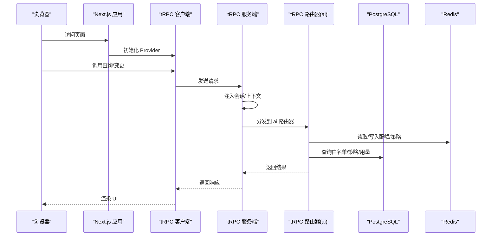

图表来源
- [src/components/trpc-provider.tsx](file://src/components/trpc-provider.tsx#L38-L54)
- [src/server/api/trpc.ts](file://src/server/api/trpc.ts#L65-L75)
- [src/server/api/root.ts](file://src/server/api/root.ts#L14-L21)
- [src/server/api/routers/ai.ts](file://src/server/api/routers/ai.ts#L98-L213)
- [src/lib/database.ts](file://src/lib/database.ts#L280-L290)
- [src/lib/redis.ts](file://src/lib/redis.ts#L17-L42)

## 详细组件分析

### tRPC 服务端与上下文
- 上下文创建：从 Next.js 请求中提取会话，注入到每个 tRPC 过程
- 错误格式化：将 Zod 校验错误扁平化，便于前端处理
- 中间件：提供受保护过程与速率限制扩展点

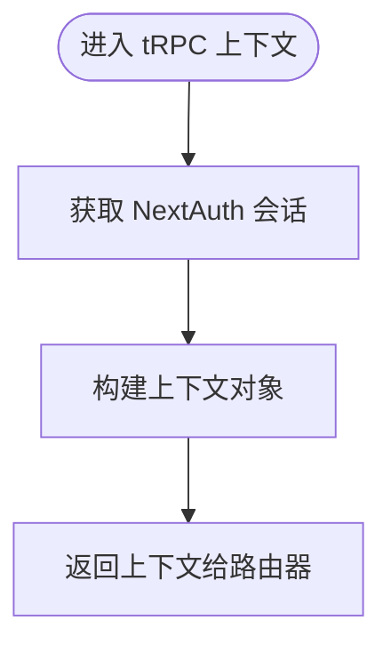

图表来源
- [src/server/api/trpc.ts](file://src/server/api/trpc.ts#L65-L75)
- [src/server/api/trpc.ts](file://src/server/api/trpc.ts#L84-L95)

章节来源
- [src/server/api/trpc.ts](file://src/server/api/trpc.ts#L65-L95)

### tRPC 路由器聚合
- 路由器集中注册：ai、quota、api-key、dashboard、whitelist、settings
- 类型导出：AppRouter 供前端类型安全使用

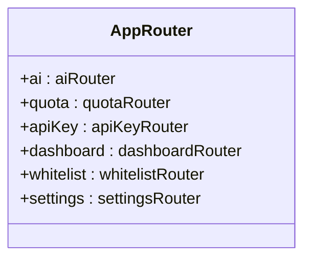

图表来源
- [src/server/api/root.ts](file://src/server/api/root.ts#L14-L21)

章节来源
- [src/server/api/root.ts](file://src/server/api/root.ts#L14-L25)

### AI 路由器：聊天完成与配额流程
- 输入校验：使用 Zod Schema 对请求体进行严格校验
- 白名单校验：依据 apiKeyId 获取规则并校验 userId
- Provider 选择：根据 API Key 的提供商映射到具体实现
- 配额检查：估算 Token 后检查当日/每分钟配额
- 非流式响应：调用上游模型，记录用量并返回元数据

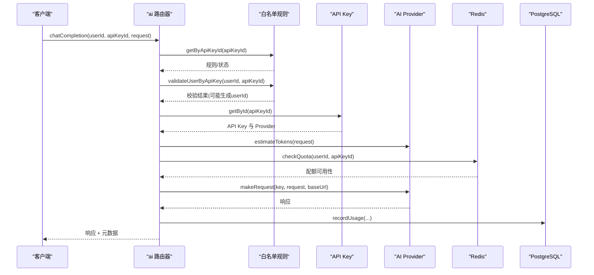

图表来源
- [src/server/api/routers/ai.ts](file://src/server/api/routers/ai.ts#L98-L213)
- [src/lib/database.ts](file://src/lib/database.ts#L456-L545)
- [src/lib/database.ts](file://src/lib/database.ts#L134-L160)

章节来源
- [src/server/api/routers/ai.ts](file://src/server/api/routers/ai.ts#L88-L301)

### 配额路由器：策略管理与用户用量
- 策略 CRUD：受保护过程，输入校验与约束（token/request 模式）
- 用户用量：按 apiKeyId 与 userId 获取当日用量
- 策略变更清理：更新策略后扫描并清理相关 Redis 缓存键

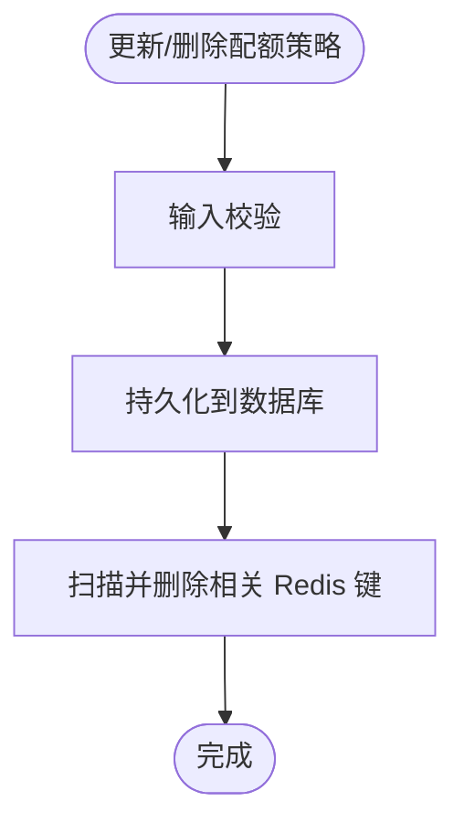

图表来源
- [src/server/api/routers/quota.ts](file://src/server/api/routers/quota.ts#L103-L193)
- [src/server/api/routers/quota.ts](file://src/server/api/routers/quota.ts#L15-L37)

章节来源
- [src/server/api/routers/quota.ts](file://src/server/api/routers/quota.ts#L39-L221)

### API Key 路由器：密钥生命周期与缓存
- 生命周期：创建、更新、删除、切换状态
- 缓存同步：新增/更新时写入 Redis；禁用/删除时清理
- 数据脱敏：返回前端时对密钥与 ID 进行掩码处理

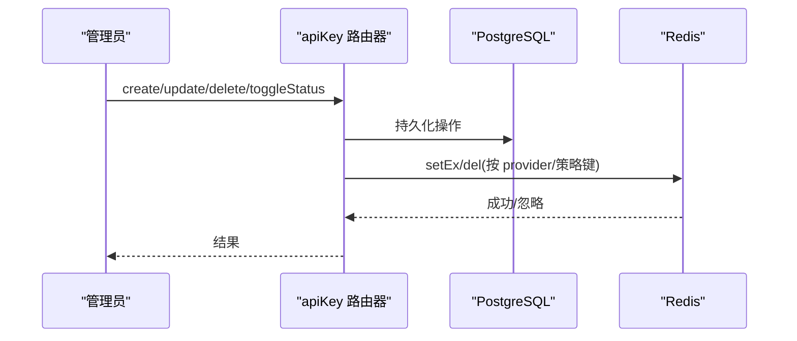

图表来源
- [src/server/api/routers/api-key.ts](file://src/server/api/routers/api-key.ts#L131-L175)
- [src/server/api/routers/api-key.ts](file://src/server/api/routers/api-key.ts#L177-L225)
- [src/server/api/routers/api-key.ts](file://src/server/api/routers/api-key.ts#L227-L270)
- [src/lib/redis.ts](file://src/lib/redis.ts#L17-L42)

章节来源
- [src/server/api/routers/api-key.ts](file://src/server/api/routers/api-key.ts#L68-L377)

### 数据模型与持久化
- 数据库：PostgreSQL，使用 Drizzle ORM 定义表结构与关系
- 模型：配额策略、API Key、用量记录、用户、白名单规则、NextAuth 表
- 关系：白名单规则与配额策略通过名称关联

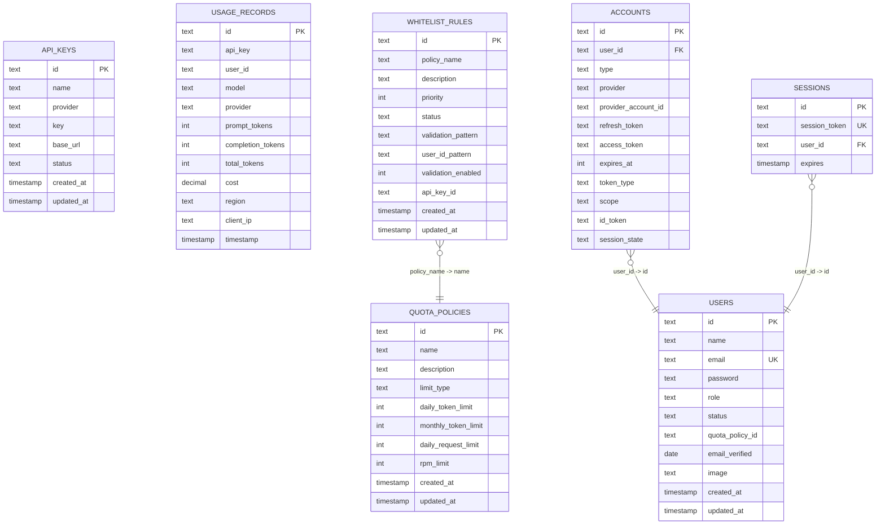

图表来源
- [src/lib/schema.ts](file://src/lib/schema.ts#L28-L98)
- [src/lib/schema.ts](file://src/lib/schema.ts#L100-L137)

章节来源
- [src/lib/schema.ts](file://src/lib/schema.ts#L1-L162)
- [drizzle.config.ts](file://drizzle.config.ts#L3-L10)

### 缓存策略与键空间
- 用户配额：按用户+日期+API Key 维度缓存当日 Token/请求计数与 RPM
- 策略缓存：按 API Key 缓存配额策略键
- API Key 缓存：按提供商缓存当前有效 API Key
- 请求日志：按用户+请求 ID 缓存请求元信息

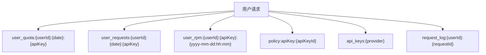

图表来源
- [src/lib/redis.ts](file://src/lib/redis.ts#L17-L42)

章节来源
- [src/lib/redis.ts](file://src/lib/redis.ts#L1-L43)

### 认证与会话
- 凭据认证：用户名/密码校验，管理员角色限定
- 会话回调：将用户角色与状态注入 JWT 与会话
- 登录页面与错误处理：统一跳转至登录页

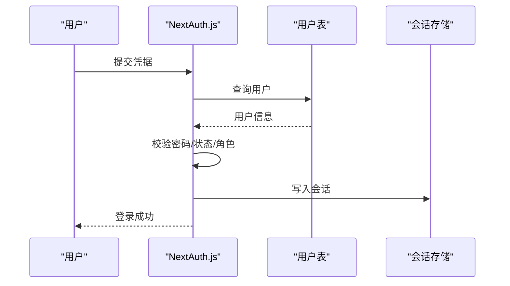

图表来源
- [src/auth.ts](file://src/auth.ts#L14-L53)
- [src/auth.ts](file://src/auth.ts#L84-L101)

章节来源
- [src/auth.ts](file://src/auth.ts#L6-L114)

## 依赖分析
- 前端依赖：Next.js、tRPC 客户端、React Query、Tailwind CSS、shadcn/ui
- 后端依赖：tRPC 服务端、NextAuth、Drizzle ORM、PostgreSQL 驱动、Redis 客户端
- 工具链：Drizzle Kit 用于迁移与生成

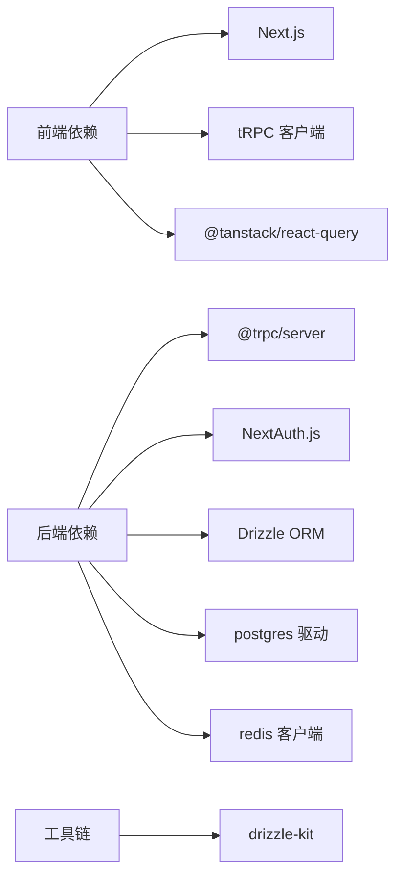

图表来源
- [package.json](file://package.json#L18-L68)
- [drizzle.config.ts](file://drizzle.config.ts#L3-L10)

章节来源
- [package.json](file://package.json#L18-L68)

## 性能考量
- tRPC 类型安全与序列化：使用 superjson 保证复杂数据传输的类型一致性，减少前端解析成本
- 批量请求：客户端使用 httpBatchLink，降低网络往返
- 缓存命中：Redis 缓存配额与策略，显著降低数据库压力
- 并发与超时：QueryClient 默认 staleTime 与 retry 策略平衡实时性与稳定性
- 数据库优化：Drizzle ORM 生成的查询具备类型安全与可维护性，配合索引与分区可进一步优化

## 故障排查指南
- tRPC 错误：关注 errorFormatter 输出的 zodError 字段，定位输入校验问题
- 认证失败：检查凭据、用户状态与角色，确认 NextAuth 回调是否正确注入
- 配额异常：核对 Redis 键空间与清理策略，确认策略更新后缓存是否失效
- 数据库异常：查看数据库连接与迁移状态，确认 Drizzle 配置与凭证
- 缓存不可用：检查 Redis 连接与健康状态，确认键命名与过期策略

章节来源
- [src/server/api/trpc.ts](file://src/server/api/trpc.ts#L84-L95)
- [src/auth.ts](file://src/auth.ts#L14-L53)
- [src/server/api/routers/quota.ts](file://src/server/api/routers/quota.ts#L15-L37)
- [docker-compose.yml](file://docker-compose.yml#L39-L60)

## 结论
AIGate 采用清晰的分层架构与类型安全的 tRPC，结合 Redis 缓存与 PostgreSQL 持久化，实现了高性能、可扩展的 AI 网关管理能力。前端通过 tRPC Provider 与 React Query 实现高效的数据获取与状态管理；后端通过路由器与中间件隔离业务逻辑与外部依赖；认证与授权在上下文中统一处理，保障系统安全性与可运维性。

## 附录
- 部署与运行：使用 Docker Compose 启动应用、PostgreSQL 与 Redis，并通过 migrate 任务完成数据库初始化
- 开发配置：Next.js 输出为 standalone，启用 React Compiler；Drizzle Kit 配置指向 schema 与输出目录

章节来源
- [docker-compose.yml](file://docker-compose.yml#L1-L87)
- [next.config.ts](file://next.config.ts#L3-L6)
- [drizzle.config.ts](file://drizzle.config.ts#L3-L10)