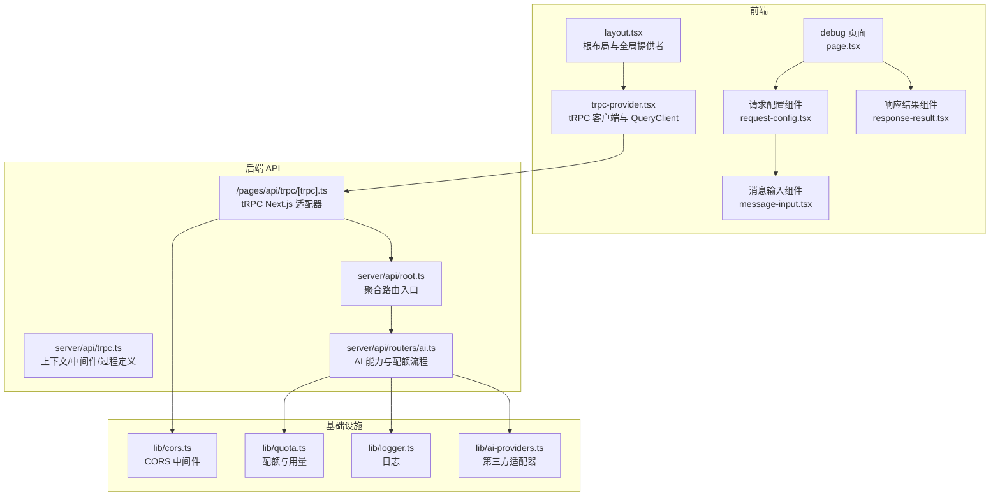
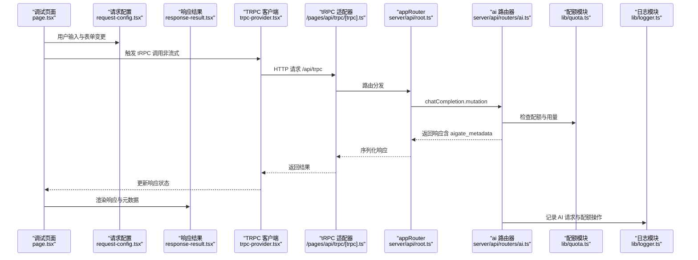
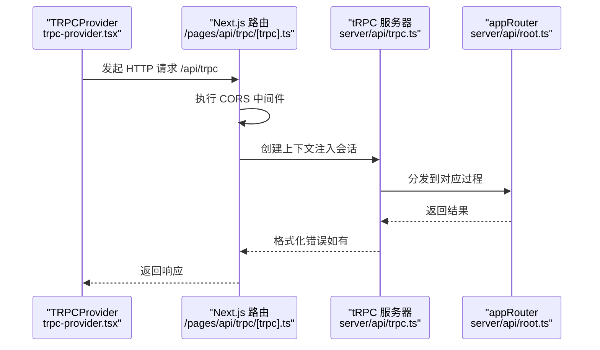
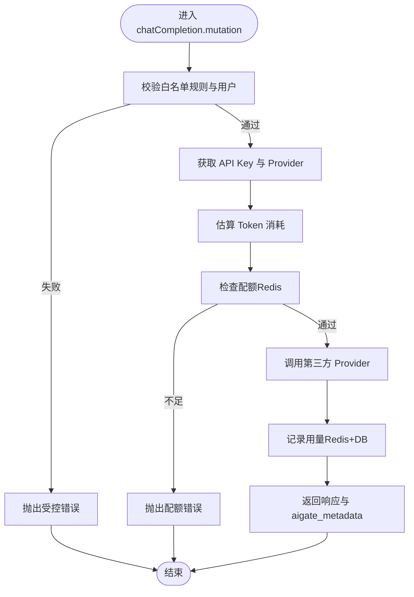
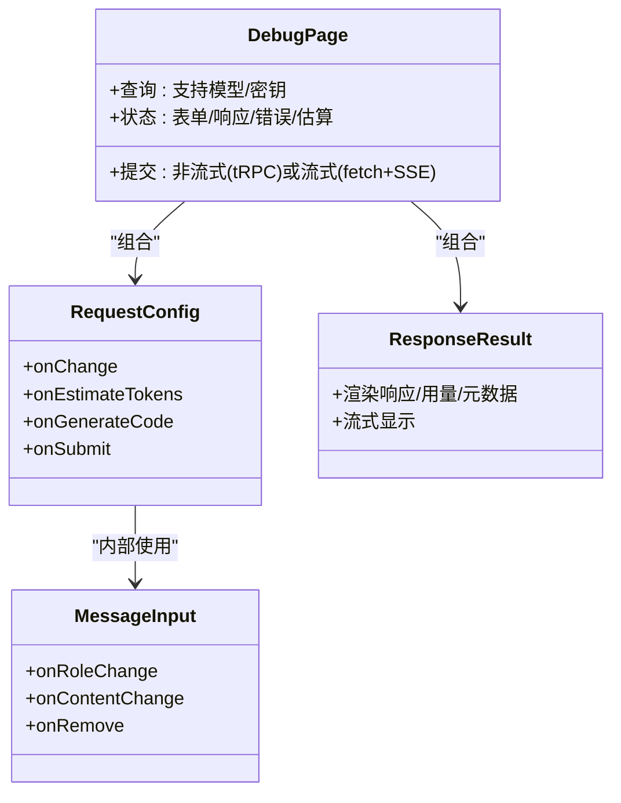
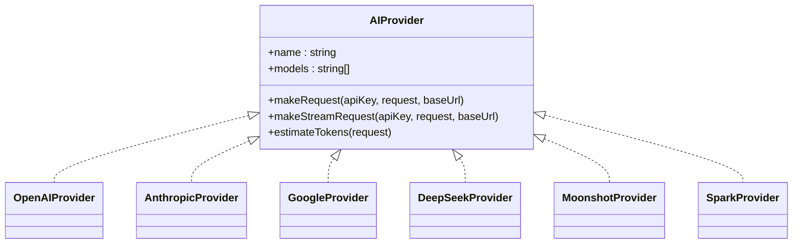
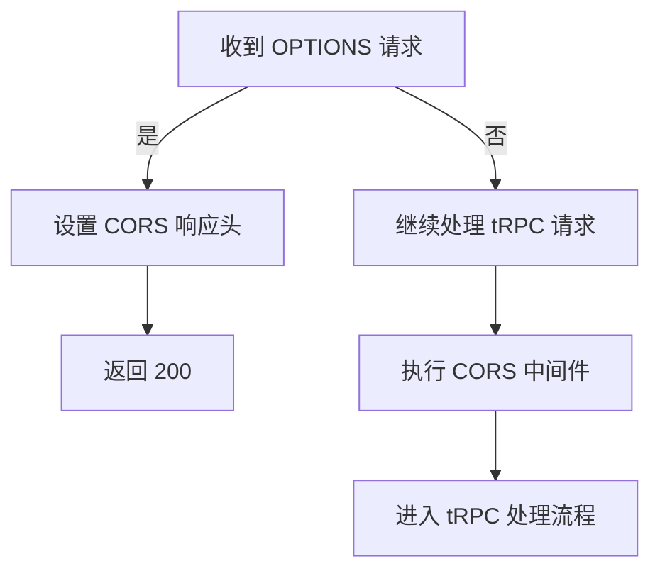
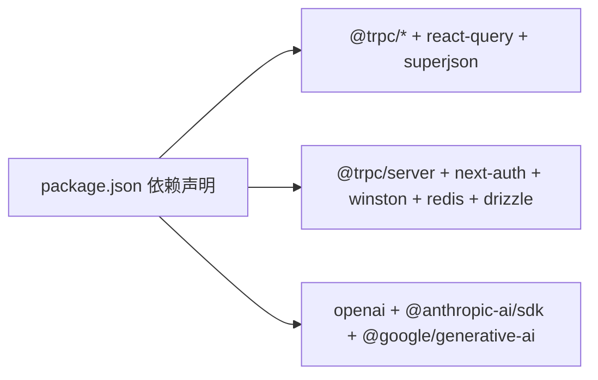

# 组件交互模式

<cite>
**本文引用的文件**
- [src/app/layout.tsx](file://src/app/layout.tsx)
- [src/components/trpc-provider.tsx](file://src/components/trpc-provider.tsx)
- [src/pages/api/trpc/[trpc].ts](file://src/pages/api/trpc/[trpc].ts)
- [src/server/api/root.ts](file://src/server/api/root.ts)
- [src/server/api/trpc.ts](file://src/server/api/trpc.ts)
- [src/server/api/routers/ai.ts](file://src/server/api/routers/ai.ts)
- [src/app/(dashboard)/debug/page.tsx](file://src/app/(dashboard)/debug/page.tsx)
- [src/app/(dashboard)/debug/components/request-config.tsx](file://src/app/(dashboard)/debug/components/request-config.tsx)
- [src/app/(dashboard)/debug/components/response-result.tsx](file://src/app/(dashboard)/debug/components/response-result.tsx)
- [src/app/(dashboard)/debug/components/message-input.tsx](file://src/app/(dashboard)/debug/components/message-input.tsx)
- [src/lib/cors.ts](file://src/lib/cors.ts)
- [src/lib/ai-providers.ts](file://src/lib/ai-providers.ts)
- [src/lib/quota.ts](file://src/lib/quota.ts)
- [src/lib/logger.ts](file://src/lib/logger.ts)
- [package.json](file://package.json)
</cite>

## 目录
1. [简介](#简介)
2. [项目结构](#项目结构)
3. [核心组件](#核心组件)
4. [架构总览](#架构总览)
5. [详细组件分析](#详细组件分析)
6. [依赖关系分析](#依赖关系分析)
7. [性能考量](#性能考量)
8. [故障排查指南](#故障排查指南)
9. [结论](#结论)
10. [附录](#附录)

## 简介
本文件系统性梳理 AIGate 的组件交互模式，覆盖前端组件间的数据传递、事件处理与状态同步；tRPC 客户端与服务器端路由器的交互协议与数据交换格式；UI 组件的组合模式、属性传递与生命周期管理；第三方服务集成的适配器模式与抽象层设计；错误传播机制、异常处理与降级策略；以及跨域请求处理、CORS 配置与安全通信机制。目标是帮助开发者与运维人员快速理解系统如何协同工作，并提供最佳实践与排障建议。

## 项目结构
AIGate 采用 Next.js 应用结构，前端通过 tRPC 客户端与后端 API 交互，后端基于 tRPC 路由器组织业务逻辑，辅以 CORS 中间件、配额与日志等基础设施模块。

**图表来源**
- [src/app/layout.tsx](file://src/app/layout.tsx#L25-L53)
- [src/components/trpc-provider.tsx](file://src/components/trpc-provider.tsx#L22-L61)
- [src/pages/api/trpc/[trpc].ts](file://src/pages/api/trpc/[trpc].ts#L1-L28)
- [src/server/api/root.ts](file://src/server/api/root.ts#L14-L21)
- [src/server/api/trpc.ts](file://src/server/api/trpc.ts#L65-L75)
- [src/server/api/routers/ai.ts](file://src/server/api/routers/ai.ts#L88-L301)
- [src/lib/cors.ts](file://src/lib/cors.ts#L7-L34)
- [src/lib/quota.ts](file://src/lib/quota.ts#L78-L200)
- [src/lib/logger.ts](file://src/lib/logger.ts#L94-L102)
- [src/lib/ai-providers.ts](file://src/lib/ai-providers.ts#L12-L27)

**章节来源**
- [src/app/layout.tsx](file://src/app/layout.tsx#L25-L53)
- [src/components/trpc-provider.tsx](file://src/components/trpc-provider.tsx#L1-L64)
- [src/pages/api/trpc/[trpc].ts](file://src/pages/api/trpc/[trpc].ts#L1-L28)
- [src/server/api/root.ts](file://src/server/api/root.ts#L1-L25)
- [src/server/api/trpc.ts](file://src/server/api/trpc.ts#L1-L153)
- [src/lib/cors.ts](file://src/lib/cors.ts#L1-L54)

## 核心组件
- tRPC 客户端与提供者
  - TRPCProvider 在根布局中初始化 QueryClient 与 tRPC 客户端，配置超时、重试与批处理链接，并通过超级序列化传输复杂数据结构。
- tRPC 服务器端
  - createTRPCContext 注入会话与请求对象；公共/受保护过程定义；错误格式化与 Zod 错误透传。
  - appRouter 聚合多个业务路由器，如 ai、quota、apiKey、dashboard、whitelist、settings。
- AI 路由器
  - 提供聊天补全、模型列表、Token 估算、配额信息查询等能力；集成白名单校验、配额检查、用量记录与元数据返回。
- 调试页面与 UI 组件
  - 调试页整合模型选择、消息编辑、Token 估算、代码生成与响应展示；子组件负责表单控件与渲染。
- CORS 与安全
  - CORS 中间件统一处理预检与响应头；NextAuth 会话用于鉴权；敏感日志分级与落盘。
- 第三方服务适配器
  - AIProvider 抽象统一 OpenAI、Anthropic、Google、DeepSeek、Moonshot、Spark 等提供商的请求、流式与估算逻辑。

**章节来源**
- [src/components/trpc-provider.tsx](file://src/components/trpc-provider.tsx#L14-L61)
- [src/server/api/trpc.ts](file://src/server/api/trpc.ts#L65-L153)
- [src/server/api/root.ts](file://src/server/api/root.ts#L14-L21)
- [src/server/api/routers/ai.ts](file://src/server/api/routers/ai.ts#L88-L301)
- [src/app/(dashboard)/debug/page.tsx](file://src/app/(dashboard)/debug/page.tsx#L14-L371)
- [src/app/(dashboard)/debug/components/request-config.tsx](file://src/app/(dashboard)/debug/components/request-config.tsx#L52-L418)
- [src/app/(dashboard)/debug/components/response-result.tsx](file://src/app/(dashboard)/debug/components/response-result.tsx#L43-L215)
- [src/lib/cors.ts](file://src/lib/cors.ts#L7-L53)
- [src/lib/ai-providers.ts](file://src/lib/ai-providers.ts#L12-L27)

## 架构总览
下图展示从前端到后端的关键交互路径与数据流。

**图表来源**
- [src/app/(dashboard)/debug/page.tsx](file://src/app/(dashboard)/debug/page.tsx#L24-L315)
- [src/components/trpc-provider.tsx](file://src/components/trpc-provider.tsx#L38-L54)
- [src/pages/api/trpc/[trpc].ts](file://src/pages/api/trpc/[trpc].ts#L8-L27)
- [src/server/api/root.ts](file://src/server/api/root.ts#L14-L21)
- [src/server/api/routers/ai.ts](file://src/server/api/routers/ai.ts#L98-L213)
- [src/lib/quota.ts](file://src/lib/quota.ts#L78-L200)
- [src/lib/logger.ts](file://src/lib/logger.ts#L105-L163)

## 详细组件分析

### tRPC 客户端与服务器端交互协议
- 客户端侧
  - 使用 createTRPCReact 与 QueryClientProvider，启用批处理链接与日志链接；transformer 使用 superjson 保证复杂类型往返。
  - URL 依据运行环境动态决定，开发/SSR/生产分别指向本地或 Vercel。
- 服务器侧
  - createTRPCContext 从 NextAuth 获取会话上下文；errorFormatter 将 Zod 错误扁平化透传至前端。
  - 公共/受保护过程定义，受保护过程在执行前校验会话有效性。
  - Next.js 适配器在处理 tRPC 请求前先执行 CORS 中间件，处理 OPTIONS 预检。

**图表来源**
- [src/components/trpc-provider.tsx](file://src/components/trpc-provider.tsx#L38-L54)
- [src/pages/api/trpc/[trpc].ts](file://src/pages/api/trpc/[trpc].ts#L8-L27)
- [src/server/api/trpc.ts](file://src/server/api/trpc.ts#L65-L95)
- [src/server/api/root.ts](file://src/server/api/root.ts#L14-L21)

**章节来源**
- [src/components/trpc-provider.tsx](file://src/components/trpc-provider.tsx#L14-L61)
- [src/pages/api/trpc/[trpc].ts](file://src/pages/api/trpc/[trpc].ts#L1-L28)
- [src/server/api/trpc.ts](file://src/server/api/trpc.ts#L65-L153)

### AI 路由器与配额、用量、日志
- 白名单与 API Key 校验
  - 根据 apiKeyId 获取白名单规则并校验用户合法性；若未绑定有效规则或校验失败，抛出受控错误。
- 配额检查
  - 依据策略（按 Token 或请求次数）与每分钟速率限制进行检查；支持缓存与 Redis 原子计数。
- 用量记录
  - 非流式请求完成后记录实际 Token 使用并写入数据库；流式请求走独立 SSE 端点。
- 元数据返回
  - 在响应中附加 aigate_metadata，包含请求 ID、提供商、处理时长与剩余配额。
- 日志
  - 记录 AI 请求、配额检查/更新/超额等操作，区分级别并按需落盘。

**图表来源**
- [src/server/api/routers/ai.ts](file://src/server/api/routers/ai.ts#L98-L213)
- [src/lib/quota.ts](file://src/lib/quota.ts#L78-L200)
- [src/lib/logger.ts](file://src/lib/logger.ts#L105-L163)

**章节来源**
- [src/server/api/routers/ai.ts](file://src/server/api/routers/ai.ts#L88-L301)
- [src/lib/quota.ts](file://src/lib/quota.ts#L1-L327)
- [src/lib/logger.ts](file://src/lib/logger.ts#L1-L184)

### 调试页面与 UI 组件组合模式
- 页面状态管理
  - 使用本地存储持久化表单与响应，避免刷新丢失；并发查询模型列表与 API Key 列表。
- 子组件职责分离
  - RequestConfig 负责表单输入、示例加载、Token 估算与代码生成；MessageInput 管理消息项的增删改；ResponseResult 展示响应、用量与元数据。
- 生命周期与副作用
  - 组件挂载时触发 tRPC 查询；提交时根据是否流式选择不同路径；流式模式使用原生 fetch 与 SSE。

**图表来源**
- [src/app/(dashboard)/debug/page.tsx](file://src/app/(dashboard)/debug/page.tsx#L14-L371)
- [src/app/(dashboard)/debug/components/request-config.tsx](file://src/app/(dashboard)/debug/components/request-config.tsx#L52-L418)
- [src/app/(dashboard)/debug/components/message-input.tsx](file://src/app/(dashboard)/debug/components/message-input.tsx#L21-L63)
- [src/app/(dashboard)/debug/components/response-result.tsx](file://src/app/(dashboard)/debug/components/response-result.tsx#L43-L215)

**章节来源**
- [src/app/(dashboard)/debug/page.tsx](file://src/app/(dashboard)/debug/page.tsx#L14-L371)
- [src/app/(dashboard)/debug/components/request-config.tsx](file://src/app/(dashboard)/debug/components/request-config.tsx#L1-L418)
- [src/app/(dashboard)/debug/components/response-result.tsx](file://src/app/(dashboard)/debug/components/response-result.tsx#L1-L215)
- [src/app/(dashboard)/debug/components/message-input.tsx](file://src/app/(dashboard)/debug/components/message-input.tsx#L1-L63)

### 第三方服务适配器模式与抽象层设计
- 抽象接口
  - AIProvider 定义统一的名称、模型列表、请求/流式请求与 Token 估算方法。
- 具体实现
  - OpenAI、Anthropic、Google、DeepSeek、Moonshot、Spark 等均实现相同接口，便于替换与扩展。
- 适配与转换
  - 对第三方 SSE 流进行格式转换，统一为 OpenAI 兼容的 data: [chunk] 格式，便于前端统一消费。

**图表来源**
- [src/lib/ai-providers.ts](file://src/lib/ai-providers.ts#L12-L27)
- [src/lib/ai-providers.ts](file://src/lib/ai-providers.ts#L34-L100)
- [src/lib/ai-providers.ts](file://src/lib/ai-providers.ts#L102-L282)
- [src/lib/ai-providers.ts](file://src/lib/ai-providers.ts#L284-L469)
- [src/lib/ai-providers.ts](file://src/lib/ai-providers.ts#L471-L613)
- [src/lib/ai-providers.ts](file://src/lib/ai-providers.ts#L615-L685)

**章节来源**
- [src/lib/ai-providers.ts](file://src/lib/ai-providers.ts#L1-L759)

### 跨域请求处理、CORS 配置与安全通信
- CORS 中间件
  - 动态设置 Access-Control-Allow-Origin、允许的方法与头部、Credentials 支持与预检缓存；对 OPTIONS 请求直接返回。
- tRPC 适配器
  - 在 tRPC 处理前先执行 CORS 中间件，确保跨域场景下预检与后续请求均正确处理。
- 安全通信
  - NextAuth 会话用于受保护过程鉴权；敏感日志分级与脱敏；第三方 SDK 通过环境变量与配置中心管理密钥。

**图表来源**
- [src/lib/cors.ts](file://src/lib/cors.ts#L42-L53)
- [src/pages/api/trpc/[trpc].ts](file://src/pages/api/trpc/[trpc].ts#L20-L27)

**章节来源**
- [src/lib/cors.ts](file://src/lib/cors.ts#L1-L54)
- [src/pages/api/trpc/[trpc].ts](file://src/pages/api/trpc/[trpc].ts#L1-L28)

## 依赖关系分析
- 前端依赖
  - @trpc/react-query、@tanstack/react-query、superjson、next 等构成前端数据流与状态管理基础。
- 后端依赖
  - @trpc/server、next-auth、winston、redis、drizzle-orm 等支撑 tRPC、鉴权、日志、缓存与数据库访问。
- 第三方 SDK
  - openai、@anthropic-ai/sdk、@google/generative-ai 等用于对接不同 AI 提供商。

**图表来源**
- [package.json](file://package.json#L18-L68)

**章节来源**
- [package.json](file://package.json#L1-L90)

## 性能考量
- tRPC 批处理与缓存
  - QueryClient 默认 staleTime 与 retry 策略减少重复请求；Redis 缓存配额策略与 API Key，降低数据库压力。
- 流式响应
  - 流式模式使用 SSE，前端按块增量渲染，降低首字延迟与内存占用。
- 序列化优化
  - 使用 superjson 传输复杂类型，减少自定义序列化开销。
- 日志分级
  - 开发环境输出到控制台，生产环境按文件轮转，避免阻塞主业务线。

[本节为通用指导，无需特定文件分析]

## 故障排查指南
- tRPC 错误透传
  - 服务器端 errorFormatter 将 Zod 错误扁平化，前端可直接读取字段级错误；受保护过程未登录会返回 UNAUTHORIZED。
- CORS 相关问题
  - 确认浏览器是否发送预检请求；检查 Access-Control-Allow-* 响应头是否正确；验证 Credentials 是否开启。
- 配额与用量异常
  - 检查 Redis 中当日用量与 RPM 计数是否递增；核对策略是否正确缓存；查看日志中的配额超额记录。
- 第三方提供商错误
  - 关注 Provider 层的网络与鉴权错误；必要时切换 baseUrl 或更换 API Key。
- 日志定位
  - 使用 logError/logWarn/logInfo 等便捷方法，结合日志文件定位问题根因。

**章节来源**
- [src/server/api/trpc.ts](file://src/server/api/trpc.ts#L84-L95)
- [src/lib/cors.ts](file://src/lib/cors.ts#L7-L34)
- [src/lib/quota.ts](file://src/lib/quota.ts#L101-L156)
- [src/lib/logger.ts](file://src/lib/logger.ts#L105-L183)

## 结论
AIGate 通过 tRPC 将前端与后端紧密耦合在类型安全的契约之上，配合 CORS、鉴权、配额与日志等基础设施，实现了可扩展、可观测且易维护的组件交互模式。UI 组件采用组合与职责分离的设计，使调试与扩展更加直观。第三方服务通过适配器抽象统一接入，便于替换与演进。建议在生产环境中强化监控告警与限流策略，持续优化缓存命中率与日志分级，以获得更佳的稳定性与性能表现。

[本节为总结，无需特定文件分析]

## 附录
- 最佳实践清单
  - 组件解耦：UI 仅负责展示与交互，业务逻辑下沉至 tRPC 路由器与工具模块。
  - 依赖注入：通过 createTRPCContext 注入会话与请求对象，避免在组件内直接访问环境变量。
  - 模块化：将配额、日志、Provider 适配器等拆分为独立模块，便于测试与替换。
  - 错误处理：统一使用 TRPCError 并透传 Zod 错误；对不可恢复错误进行降级与兜底。
  - 跨域与安全：固定允许的 Origin 与方法；对敏感头与 Cookie 启用 Credentials；定期轮换密钥。

[本节为通用指导，无需特定文件分析]