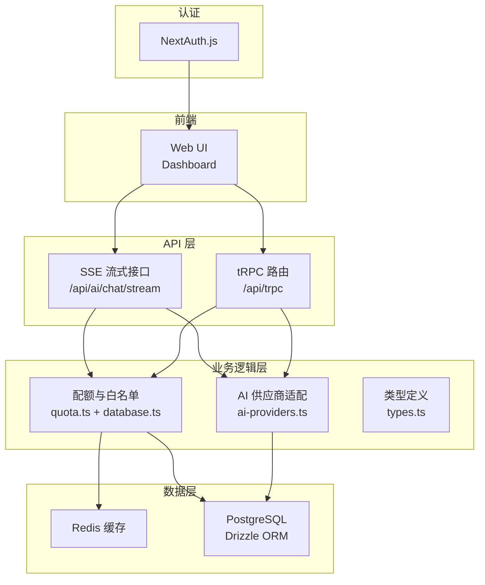
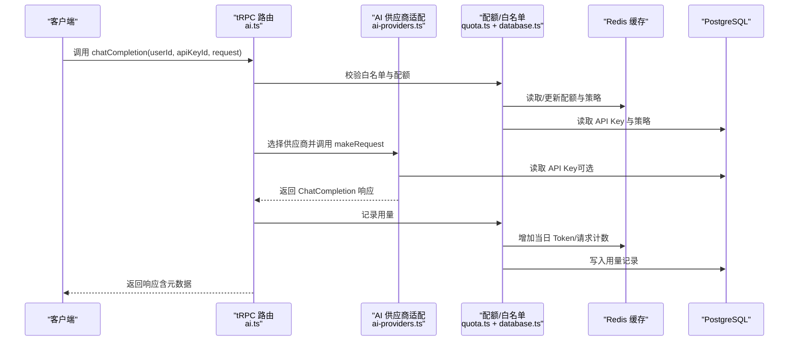
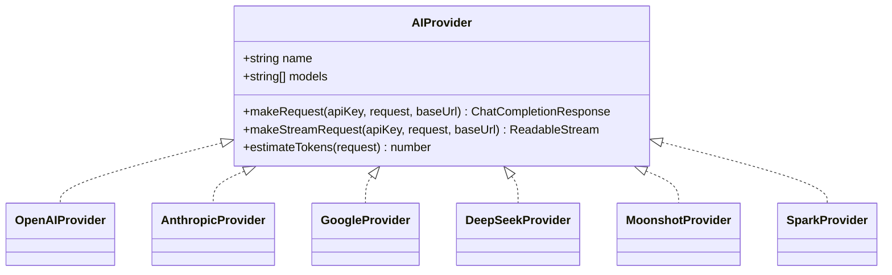
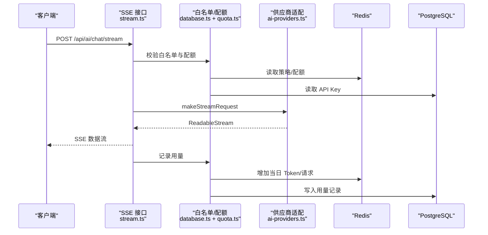
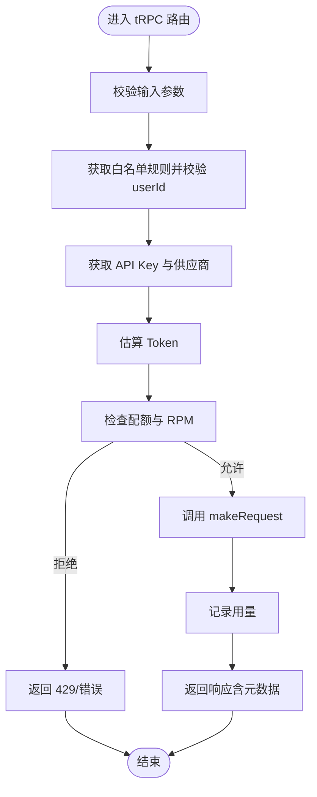
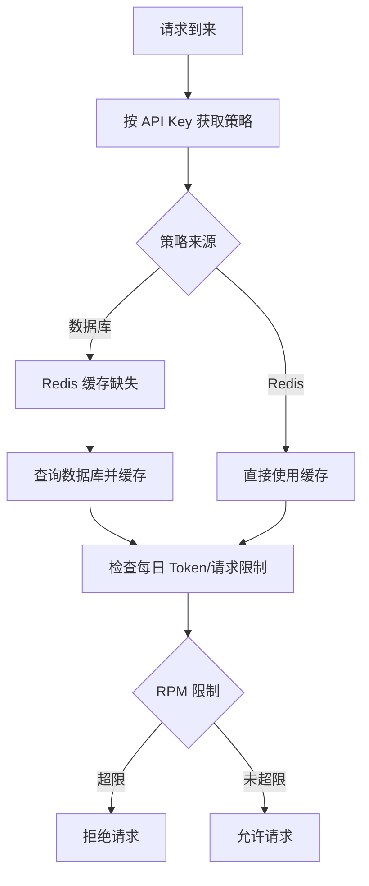
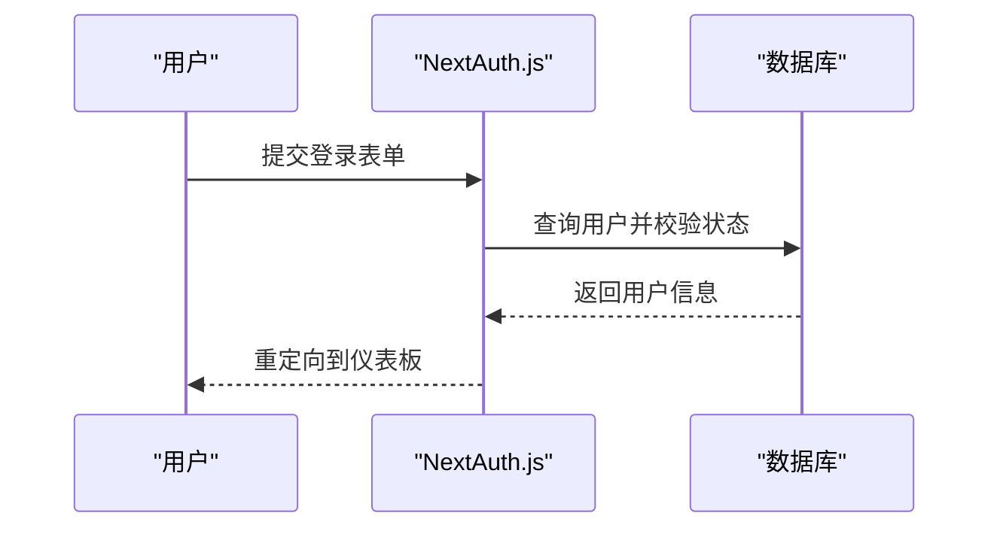
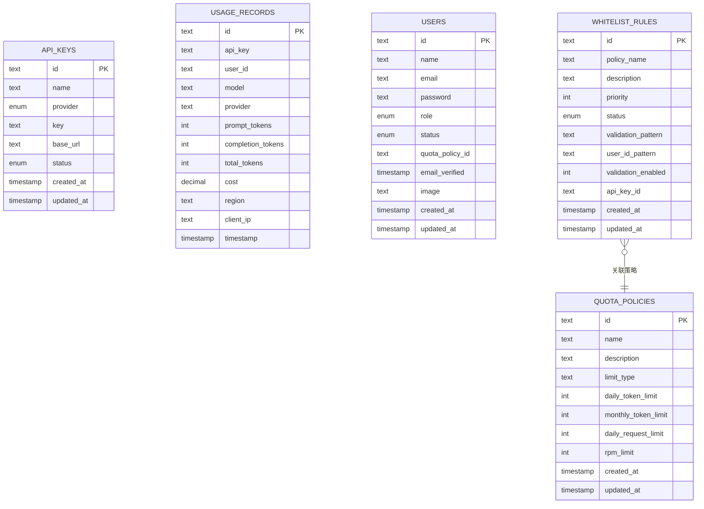
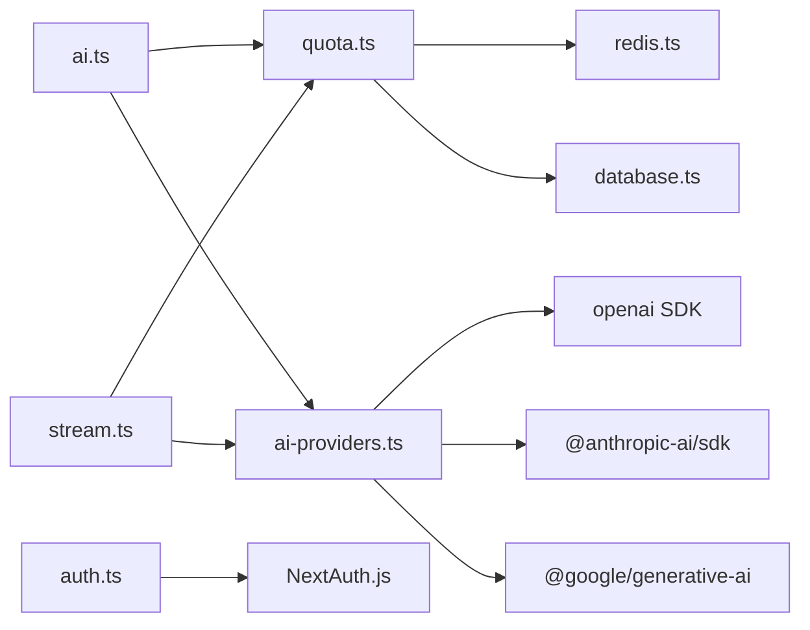

# AI 服务代理

<cite>
**本文档引用的文件**
- [README.md](file://README.md)
- [package.json](file://package.json)
- [src/lib/ai-providers.ts](file://src/lib/ai-providers.ts)
- [src/lib/provider-utils.ts](file://src/lib/provider-utils.ts)
- [src/pages/api/ai/chat/stream.ts](file://src/pages/api/ai/chat/stream.ts)
- [src/server/api/routers/ai.ts](file://src/server/api/routers/ai.ts)
- [src/lib/types.ts](file://src/lib/types.ts)
- [src/lib/quota.ts](file://src/lib/quota.ts)
- [src/lib/database.ts](file://src/lib/database.ts)
- [src/lib/redis.ts](file://src/lib/redis.ts)
- [src/lib/schema.ts](file://src/lib/schema.ts)
- [src/auth.ts](file://src/auth.ts)
- [src/app/api/auth/[...nextauth]/route.ts](file://src/app/api/auth/[...nextauth]/route.ts)
- [next.config.ts](file://next.config.ts)
- [drizzle.config.ts](file://drizzle.config.ts)
</cite>

## 目录
1. [简介](#简介)
2. [项目结构](#项目结构)
3. [核心组件](#核心组件)
4. [架构总览](#架构总览)
5. [详细组件分析](#详细组件分析)
6. [依赖关系分析](#依赖关系分析)
7. [性能考虑](#性能考虑)
8. [故障排除指南](#故障排除指南)
9. [结论](#结论)
10. [附录](#附录)

## 简介
本项目是一个基于 Next.js 14 + tRPC + Redis 的智能 AI 网关管理系统，支持多模型代理与配额控制。系统统一接入多家主流 AI 服务商（OpenAI、Anthropic、Google、DeepSeek、Moonshot、Spark 等），提供统一的 OpenAI 兼容接口，支持非流式与流式响应，内置白名单与配额策略，结合 Redis 实现毫秒级响应与高并发处理。

- 支持的 AI 服务提供商：OpenAI、Anthropic、Google、DeepSeek、Moonshot、Spark
- 统一 OpenAI 兼容接口：/api/v1/chat/completions
- tRPC 类型安全 API：/api/trpc
- 配额控制：基于 Redis 的 Token 与请求次数双重限制
- 安全认证：NextAuth.js 管理员登录
- 实时监控：仪表板展示请求趋势、地区分布、IP 记录等

**章节来源**
- [README.md](file://README.md#L1-L83)

## 项目结构
后端采用分层设计：
- API 层：Next.js Pages API（流式接口）与 tRPC 路由（非流式接口）
- 业务逻辑层：AI 供应商适配、配额与白名单校验、用量记录
- 数据访问层：Drizzle ORM + PostgreSQL；Redis 缓存
- 认证层：NextAuth.js

**图表来源**
- [src/pages/api/ai/chat/stream.ts](file://src/pages/api/ai/chat/stream.ts#L1-L184)
- [src/server/api/routers/ai.ts](file://src/server/api/routers/ai.ts#L1-L301)
- [src/lib/ai-providers.ts](file://src/lib/ai-providers.ts#L1-L759)
- [src/lib/quota.ts](file://src/lib/quota.ts#L1-L327)
- [src/lib/database.ts](file://src/lib/database.ts#L1-L692)
- [src/lib/redis.ts](file://src/lib/redis.ts#L1-L43)
- [src/auth.ts](file://src/auth.ts#L1-L114)

**章节来源**
- [README.md](file://README.md#L74-L83)
- [package.json](file://package.json#L1-L90)

## 核心组件
- AI 供应商适配器：统一接口 makeRequest/makeStreamRequest/estimateTokens，支持 OpenAI、Anthropic、Google、DeepSeek、Moonshot、Spark
- 配额与白名单：基于 Redis 的每日 Token/请求次数限制，支持 RPM 限制；白名单规则按 API Key 绑定策略
- 流式与非流式处理：SSE 流式接口与 tRPC 非流式接口
- 认证与会话：NextAuth.js 管理员登录
- 类型系统：Zod Schema + TypeScript 类型定义

**章节来源**
- [src/lib/ai-providers.ts](file://src/lib/ai-providers.ts#L12-L759)
- [src/lib/quota.ts](file://src/lib/quota.ts#L1-L327)
- [src/lib/types.ts](file://src/lib/types.ts#L1-L118)
- [src/auth.ts](file://src/auth.ts#L1-L114)

## 架构总览
系统通过 tRPC 与 SSE 两条路径对外提供服务：
- tRPC 非流式：适合一次性响应场景，返回完整 ChatCompletion 响应
- SSE 流式：适合实时对话场景，按事件流推送增量内容

**图表来源**
- [src/server/api/routers/ai.ts](file://src/server/api/routers/ai.ts#L88-L213)
- [src/lib/ai-providers.ts](file://src/lib/ai-providers.ts#L687-L759)
- [src/lib/quota.ts](file://src/lib/quota.ts#L78-L200)
- [src/lib/database.ts](file://src/lib/database.ts#L280-L290)

## 详细组件分析

### AI 供应商适配器（AI Providers）
- 统一接口定义：AIProvider 接口包含 name、models、makeRequest、makeStreamRequest、estimateTokens
- 供应商实现：OpenAI、Anthropic、Google、DeepSeek、Moonshot、Spark
- 流式转换：将各供应商的 SSE/SDK 流转换为 OpenAI 兼容的 SSE 格式
- Token 估算：简单按字符长度估算（约 4 字符 ≈ 1 Token）

**图表来源**
- [src/lib/ai-providers.ts](file://src/lib/ai-providers.ts#L12-L759)

**章节来源**
- [src/lib/ai-providers.ts](file://src/lib/ai-providers.ts#L12-L759)

### 流式接口（/api/ai/chat/stream）
- CORS 处理：中间件处理跨域
- 白名单与用户校验：按 apiKeyId 获取规则并校验 userId
- 配额检查：估算 Token 后检查每日与 RPM 限制
- 流式转发：调用供应商 makeStreamRequest，将供应商 SSE 转为 OpenAI 兼容格式
- 用量统计：累计 completion tokens 并记录用量

**图表来源**
- [src/pages/api/ai/chat/stream.ts](file://src/pages/api/ai/chat/stream.ts#L10-L184)
- [src/lib/ai-providers.ts](file://src/lib/ai-providers.ts#L58-L95)
- [src/lib/quota.ts](file://src/lib/quota.ts#L202-L260)

**章节来源**
- [src/pages/api/ai/chat/stream.ts](file://src/pages/api/ai/chat/stream.ts#L1-L184)

### tRPC 非流式接口（/api/trpc）
- 输入校验：Zod Schema 校验 userId、apiKeyId、request
- 白名单与用户校验：同上
- 配额检查：估算 Token 后检查限制
- 响应封装：将供应商响应与元数据（请求 ID、处理时间、剩余配额）合并返回

**图表来源**
- [src/server/api/routers/ai.ts](file://src/server/api/routers/ai.ts#L88-L213)
- [src/lib/quota.ts](file://src/lib/quota.ts#L78-L200)

**章节来源**
- [src/server/api/routers/ai.ts](file://src/server/api/routers/ai.ts#L1-L301)

### 配额与白名单（Quota & Whitelist）
- 配额策略：支持按 Token 或请求次数限制，含每日与 RPM 限制
- 策略来源：优先按 API Key ID 获取策略（JOIN 白名单规则与配额策略）
- 缓存：Redis 缓存策略与 API Key，降低数据库压力
- 用量记录：写入 Redis 计数与数据库记录

**图表来源**
- [src/lib/quota.ts](file://src/lib/quota.ts#L17-L76)
- [src/lib/redis.ts](file://src/lib/redis.ts#L17-L43)
- [src/lib/database.ts](file://src/lib/database.ts#L332-L352)

**章节来源**
- [src/lib/quota.ts](file://src/lib/quota.ts#L1-L327)
- [src/lib/database.ts](file://src/lib/database.ts#L292-L545)
- [src/lib/redis.ts](file://src/lib/redis.ts#L1-L43)

### 认证与会话（NextAuth.js）
- 提供商：凭据登录（Email/Password）
- 回调：注入用户角色与状态到 JWT 与 Session
- 页面：登录页与错误页重定向

**图表来源**
- [src/auth.ts](file://src/auth.ts#L1-L114)
- [src/app/api/auth/[...nextauth]/route.ts](file://src/app/api/auth/[...nextauth]/route.ts#L1-L7)

**章节来源**
- [src/auth.ts](file://src/auth.ts#L1-L114)
- [src/app/api/auth/[...nextauth]/route.ts](file://src/app/api/auth/[...nextauth]/route.ts#L1-L7)

### 数据模型（Schema）
- 表结构：配额策略、API Key、用量记录、用户、白名单规则、NextAuth 相关表
- 枚举：角色、状态、提供商、限制类型、白名单状态
- 关系：白名单规则关联配额策略

**图表来源**
- [src/lib/schema.ts](file://src/lib/schema.ts#L28-L98)

**章节来源**
- [src/lib/schema.ts](file://src/lib/schema.ts#L1-L162)

## 依赖关系分析
- 外部 SDK：openai、@anthropic-ai/sdk、@google/generative-ai
- tRPC：类型安全 RPC，前后端一致的类型约束
- Redis：配额与策略缓存、请求日志
- Drizzle + PostgreSQL：持久化存储
- NextAuth.js：认证与会话管理

**图表来源**
- [package.json](file://package.json#L18-L67)
- [src/lib/ai-providers.ts](file://src/lib/ai-providers.ts#L42-L46)
- [src/lib/quota.ts](file://src/lib/quota.ts#L1-L7)
- [src/lib/redis.ts](file://src/lib/redis.ts#L1-L15)
- [src/lib/database.ts](file://src/lib/database.ts#L1-L6)
- [src/auth.ts](file://src/auth.ts#L1-L4)

**章节来源**
- [package.json](file://package.json#L1-L90)

## 性能考虑
- 缓存策略：Redis 缓存配额策略、API Key、请求日志，减少数据库压力
- 连接池与长连接：Redis 客户端连接复用
- 流式传输：SSE 无阻塞转发，避免大响应阻塞
- 类型安全：tRPC 减少序列化开销，提升端到端性能
- 部署优化：Next.js standalone 输出，便于容器化部署

**章节来源**
- [src/lib/redis.ts](file://src/lib/redis.ts#L1-L43)
- [src/lib/quota.ts](file://src/lib/quota.ts#L17-L76)
- [next.config.ts](file://next.config.ts#L1-L9)

## 故障排除指南
- 403：API Key 未绑定有效白名单规则或用户校验失败
- 400：缺少必要字段或 API Key 状态异常
- 429：配额不足（Token/请求次数/RPM）
- 500：内部服务器错误，查看日志
- 501：供应商不支持流式模式
- 认证失败：凭据不匹配或用户状态异常

排查步骤：
- 检查 API Key 状态与绑定的白名单规则
- 校验 userId 格式与生成规则
- 查看 Redis 中配额键值与过期时间
- 检查数据库中用量记录与策略配置
- 查看日志输出定位具体错误

**章节来源**
- [src/pages/api/ai/chat/stream.ts](file://src/pages/api/ai/chat/stream.ts#L32-L93)
- [src/server/api/routers/ai.ts](file://src/server/api/routers/ai.ts#L107-L174)
- [src/lib/quota.ts](file://src/lib/quota.ts#L78-L200)
- [src/lib/database.ts](file://src/lib/database.ts#L456-L545)

## 结论
本系统通过统一的 AI 供应商适配器与 tRPC/SSE 双通道接口，实现了对多家 AI 服务商的无缝接入与统一管理。配合 Redis 缓存与 PostgreSQL 存储，系统具备高并发、低延迟与强扩展性的特点。白名单与配额策略保障了资源使用的可控性，NextAuth.js 提供了完善的认证体系。开发者可基于现有适配器快速扩展新的 AI 服务提供商。

## 附录

### 集成新 AI 服务提供商步骤
1. 在 AI 适配器中新增 Provider 实现（实现 makeRequest、makeStreamRequest、estimateTokens）
2. 在 providers 映射中注册新 Provider
3. 在数据库枚举与类型中添加新的提供商
4. 在 tRPC 与 SSE 接口中自动可用（通过 getProviderByModel 与 providers 映射）
5. 在前端或管理界面配置 API Key 与基础 URL（如需）

参考路径：
- [AI 适配器定义与实现](file://src/lib/ai-providers.ts#L12-L759)
- [数据库提供商枚举](file://src/lib/schema.ts#L15-L22)
- [类型定义](file://src/lib/types.ts#L19-L31)

**章节来源**
- [src/lib/ai-providers.ts](file://src/lib/ai-providers.ts#L687-L759)
- [src/lib/schema.ts](file://src/lib/schema.ts#L15-L22)
- [src/lib/types.ts](file://src/lib/types.ts#L19-L31)

### API 接口概览
- OpenAI 兼容接口：POST /api/v1/chat/completions
- tRPC 接口：/api/trpc（chatCompletion、getSupportedModels、estimateTokens、getQuotaInfo）
- 认证接口：/api/auth/[...nextauth]

**章节来源**
- [README.md](file://README.md#L52-L72)
- [src/server/api/routers/ai.ts](file://src/server/api/routers/ai.ts#L88-L301)
- [src/app/api/auth/[...nextauth]/route.ts](file://src/app/api/auth/[...nextauth]/route.ts#L1-L7)